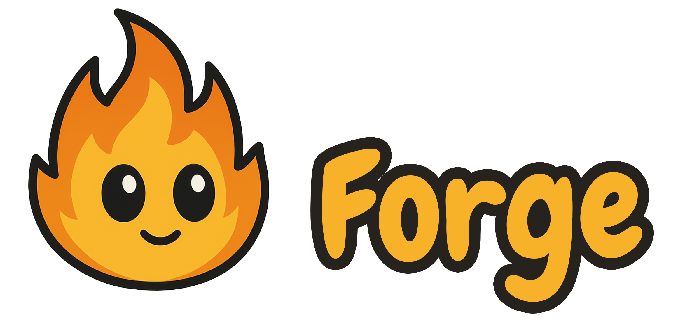

# Forge



Forge is a **browser-based game engine** that lets you create games directly in your browser. It comes with everything you need to get started, including graphics rendering, audio, animations, input handling, and more.

[Check out the documentation](https://forge-game-engine.github.io/Forge/)

---

## Try the Demo

You can try a working demo of Forge in your browser without installing anything:  
[Live Demo](https://forge-game-engine.github.io/Forge/)

Just open the link and start experimenting with the engine right away!

---

## What Forge Can Do

Forge provides the core systems you need to build games:

- Render graphics in your browser
- Play audio and music
- Animate characters and objects
- Handle input from keyboard and mouse
- Manage game entities and simple logic

Forge allows you to create most types of games right in the browser!

---

## Who Is This For?

Forge is designed for:

- **Game enthusiasts** who want to prototype and experiment
- **Students** learning game development
- **Creators** who want a browser-friendly, easy-to-use engine

---

## For Developers (Optional)

If you want to dive into the code:

```sh
git clone https://github.com/forge-game-engine/Forge.git
cd Forge
npm install
npm run dev


Build the project:
npm run build


Run tests:
npm test


This section is mainly for contributors who want to work on the engine itself.


Acknowledgements

Howler.js

Vite

Rive

Kenny

MatterJS