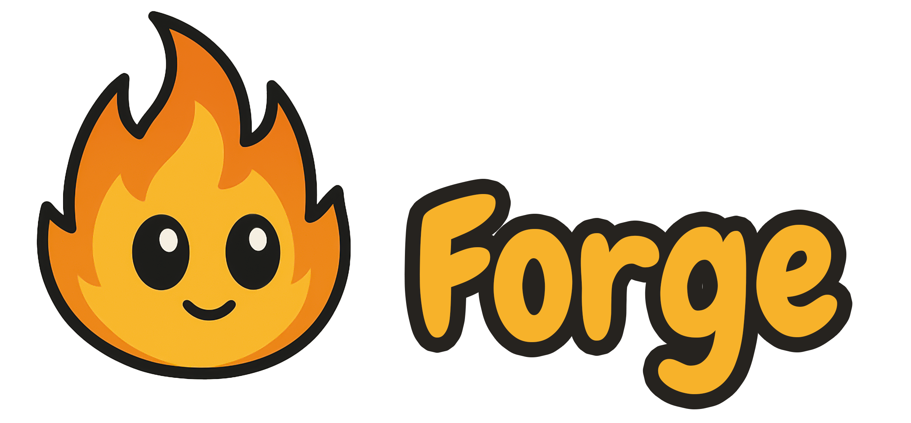

# Forge



Forge is a browser-based, code-only game engine. It has everything you'd
expect from an engine, including rendering, audio, input, animations, an
Entity-Component-System (ECS) core, physics, and more.

[Documentation](https://forge-game-engine.github.io/Forge/) ·
[Demos](https://forge-game-engine.github.io/Forge/demos/ecs)

## Getting started

```sh
npm install @forge-game-engine/forge
```

Add a `<div id="game-container"></div>` to your page, then create a game
and render a sprite to it:

```ts
import { createGame } from '@forge-game-engine/forge/utilities';
import {
  addSpriteComponent,
  createImageSprite,
} from '@forge-game-engine/forge/rendering';
import { addPositionComponent } from '@forge-game-engine/forge/common';

const { game, world, renderContext } = createGame('game-container');

const image = await renderContext.imageCache.getOrLoad('sprite.png');
const sprite = createImageSprite(image, renderContext, 0);

const entity = world.createEntity();

addPositionComponent(world, entity);
addSpriteComponent(world, entity, sprite);

game.run();
```

See the [Getting Started guide](https://forge-game-engine.github.io/Forge/docs/intro)
for a walkthrough of the above, and the
[ECS demo](https://forge-game-engine.github.io/Forge/demos/ecs) for a
complete runnable example.

Want to contribute? See [CONTRIBUTING.md](./CONTRIBUTING.md) for setup,
verification steps, and commit/changelog conventions.

## What the engine is

The engine is where all the code is stored that is usable for most types of games. For example: the renderer, audio systems, animations, mouse pointer, etc.

## What the engine is not

The engine is not a place to store code that is hyper-specific to a game. For example: a system for collecting coins.

## What if my system is specific to a particular genre?

You can make a separate folder or package outside of the engine.

## Acknowledgements

- [Howler.js](https://howlerjs.com/)
- [Vite](https://vite.dev/)
- [Kenny](https://www.kenney.nl/)
