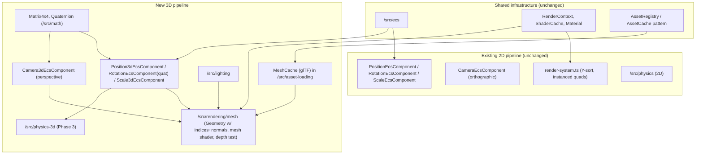

# Design: 3D Support

|                                        |                                                                                                                                                                                                                     |
| -------------------------------------- | ------------------------------------------------------------------------------------------------------------------------------------------------------------------------------------------------------------- |
| **Status**                             | Proposed — no code written yet                                                                                                                                                                                  |
| **Target modules**                     | New: `/src/math` additions, a new `/src/rendering/mesh` submodule, a new `/src/lighting` module, new 3D transform components in `/src/common`, a new `/src/physics-3d` module (Phase 3). Modified: `/src/rendering`, `/src/asset-loading`, `/src/particles`, `/src/ui`, `/src/audio`. See §6 for the full table. |
| **Engine version at time of writing** | `0.25.0`                                                                                                                                                                                                         |
| **Model**                              | **Additive 3D**: new perspective-camera / mesh / quaternion-based transform / (later) 3D-physics primitives that live alongside the existing 2D pipeline, not a conversion of the 2D pipeline to 3D            |

---

## 1. Summary

Forge is, today, a 2D engine end to end: `Vector2` positions, a single scalar
for rotation, an orthographic-only projection, a CPU-side Y-sort for draw
order, and a native physics engine built entirely on circles, polygons, and
2D joints. Nothing in `/src/math`, `/src/rendering`, `/src/common`, or
`/src/physics` currently assumes, or is prepared for, a third spatial
dimension — the one partial exception, `Vector3`, exists only to pass RGB
values into shader uniforms and has never been used for a position, a
velocity, or a rotation.

This document proposes what it would take to add real 3D support — a
perspective camera, textured/lit meshes with proper depth testing, a
quaternion-based 3D transform hierarchy, and (later) 3D physics — without
destabilizing the 2D engine that exists today. The core proposal (see §3 and
DL-01/DL-03/DL-06) is that 3D support is built **alongside** the 2D pipeline
as a parallel, opt-in set of components and systems, rather than by
generalizing `PositionEcsComponent`/`RotationEcsComponent`/`ScaleEcsComponent`
and the sprite renderer into a single 2D-and-3D-shaped system. The two
pipelines share what already generalizes cleanly (the ECS core, the asset
cache pattern, `RenderContext`'s WebGL2 context management, the shader
pre-processor, `Material`'s uniform-setting machinery), and each keeps its own
transform components, projection model, and draw-order strategy where the
underlying math and correctness requirements genuinely differ.

This is a large initiative. §7 breaks it into five phases, each independently
shippable and individually documentable: math/rendering prerequisites, static
mesh rendering with a perspective camera, lighting and materials, 3D physics,
and ecosystem integration (particles, UI, audio). A game can stop after any
phase and have a coherent, useful feature set.

---

## 2. Scope

### In scope

- New 3D math primitives: `Matrix4x4`, `Quaternion`, and promoting `Vector3`
  to first-class use (arithmetic, normalization, cross/dot products — the
  operations `Vec3` currently lacks).
- A perspective camera (field of view, near/far planes, aspect ratio) as a
  peer to the existing orthographic `CameraEcsComponent`.
- Static mesh rendering: vertex/index/normal buffer support (`Geometry`
  currently has neither indices nor normals), a mesh vertex/fragment shader,
  and GPU depth testing (a real depth buffer, replacing the Y-sort approach
  for 3D draws).
- glTF 2.0 (`.glb`) mesh/material import as a new `/src/asset-loading` cache
  type.
- Basic real-time lighting (directional and point lights, Lambertian/Phong
  shading) and a mesh material type distinct from the sprite `Material`.
- A 3D transform component set (`Position3dEcsComponent`,
  `RotationEcsComponent` using a quaternion, `Scale3dEcsComponent`) and a
  matrix-based 3D equivalent of `transform-system.ts`, composable with the
  existing `ParentEcsComponent`.
- A native 3D physics engine (colliders, rigid bodies, broad/narrow phase,
  joints, raycasting) as a longer-horizon phase, built in the same
  hand-rolled style as the existing 2D physics engine.
- Interop points for the rest of the engine: 3D-capable particle emitters,
  world-space UI billboarding against a 3D camera, and optional 3D positional
  audio.
- Demo(s) and documentation for each phase, per the project's standard
  verification checklist.

### Out of scope

- **Converting or breaking the existing 2D API.** `PositionEcsComponent`,
  `RotationEcsComponent`, `ScaleEcsComponent`, the orthographic camera, and
  the 2D physics engine are unaffected; existing games and demos keep working
  unmodified.
- **Skeletal/skinned mesh animation.** Phase 1 ships static meshes only. Bone
  hierarchies, skinning, and animation blending are a substantial project of
  their own and are called out in §9 as explicit future work, not folded into
  this design.
- **Physically-based rendering (PBR).** The lighting model proposed in Phase
  2 is Lambertian/Phong, matching the engine's existing hand-written-GLSL,
  no-PBR-pipeline style (see the sprite/post-process shaders already in
  `/src/rendering/shaders`). A full PBR pipeline (metallic/roughness
  workflow, image-based lighting, shadow mapping) is future work.
- **Shadow mapping and other advanced rendering techniques** (ambient
  occlusion, reflections, global illumination). These build on the lighting
  work in Phase 2 but are not part of it.
- **A visual scene/model editor.** Forge is code-only by design (see
  `design/ui-system.md`'s non-goals for the same principle); this document
  assumes meshes and scenes are authored in an external DCC tool (e.g.
  Blender) and imported as glTF, and assembled into scenes with the same
  factory-function ECS code every other Forge feature uses.
- **Mixed single-pass 2D/3D rendering** (e.g. a sprite occluded by, or
  casting a shadow onto, a 3D mesh within one draw pass). See DL-06 — 2D and
  3D content can coexist in one `EcsWorld` and can be composited across
  cameras/render targets, but they are not blended within a single render
  pass in this design.
- **Import formats other than glTF** (OBJ, FBX, COLLADA). See DL-04.

---

## 3. Why an additive, parallel pipeline

Three shapes this design could take differ in how much of the existing 2D
engine is touched:

|                                | What changes                                                                                     | Fit for Forge                                                                                                                                                                                    |
| ------------------------------ | ------------------------------------------------------------------------------------------------- | ------------------------------------------------------------------------------------------------------------------------------------------------------------------------------------------------- |
| **Generalize the 2D pipeline** | `PositionEcsComponent.local`/`.world` become `Vector3`, rotation becomes a quaternion everywhere, `Matrix3x3` projection becomes `Matrix4x4`, `transform-system.ts` is rewritten around 4x4 matrices | Poor. Every consumer of `Position`/`Rotation`/`Scale` — the entire 2D physics engine, particles, UI's rect tree, the sprite shader — assumes `Vector2`/scalar-radians today. This breaks or forces a rewrite of all of them for the benefit of games that may never use 3D. |
| **Third-party 3D engine/library embed** | Pull in an existing WebGL 3D layer (e.g. three.js) alongside Forge's own systems             | Poor. Two ECS-shaped ownership models (Forge's `EcsWorld` and the library's own scene graph) fighting for the same entities; contradicts the "keep dependencies minimal" principle in `AGENTS.md`, and Forge's asset/shader/material conventions would need to be duplicated or bypassed. |
| **Additive, parallel pipeline** | New 3D-specific components, systems, and shaders live beside the existing 2D ones; both draw through the same `RenderContext`/`Material`/shader-cache infrastructure | **Strong.** 2D games pay zero cost (no wasted z-components, no quaternion overhead, no depth buffer they don't need). 3D games get a pipeline whose math is actually correct for 3D instead of a widened 2D one. Shared infrastructure (ECS, asset cache pattern, shader pre-processor, `Material`) is reused, not duplicated. |

The tradeoff this buys: a scene mixing 2D sprites and 3D meshes needs
explicit interop (a camera renders one pipeline or the other; a sprite that
wants to exist "in" 3D space needs a billboard/world-space component — see
§4.9), rather than one universal transform type that works for both. Given
how deeply `Vector2`/scalar-rotation is baked into the physics engine, UI, and
particles (per the architecture survey backing this document), that tradeoff
is far smaller than the alternative of rewriting all of them.

---

## 4. Architecture

### 4.1 Module layout



### 4.2 Coordinate spaces and math foundations

Forge's 2D world uses a conventional screen-like space: +X right, +Y up (see
`GravityEcsComponent`'s default of `{x: 0, y: -9.81}`), rotation as a single
counter-clockwise radians value. The 3D pipeline adopts a **right-handed,
Y-up** coordinate system — +X right, +Y up, +Z **toward the viewer** (out of
the screen) — matching the convention glTF itself specifies, which avoids a
handedness-flip step on every imported asset. This is a separate, explicit
choice from the 2D world's space; the two are not implicitly the same space,
because a 2D sprite's "Y up, Z ignored" world does not embed naturally into a
"Z toward viewer" one.

New types added to `/src/math`, following the existing `Matrix2x2`/
`Matrix3x3` pattern (a `Float32Array`-backed class with named operations,
directly uploadable to a `uniformMatrix*fv` call):

- **`Matrix4x4`** — column-major `Float32Array(16)`. Operations: `identity`,
  `multiply`, `translate`, `rotate` (via quaternion), `scale`,
  `perspective(fovRadians, aspect, near, far)`, `lookAt(eye, target, up)`,
  `invert`, `transpose`. This is genuinely new code — `Material` already
  knows how to upload a length-16 `Float32Array` as a `mat4` uniform (see
  `_setUniformFloat32Array`), but nothing in the engine currently constructs
  one.
- **`Quaternion`** — `{x, y, z, w}`, with a `Quat` static-methods class
  mirroring `Vec2`/`Vec3`'s shape: `identity`, `fromAxisAngle`,
  `fromEuler`, `multiply`, `normalize`, `slerp`, `toMatrix4x4`. Chosen over
  Euler angles for `RotationEcsComponent`'s 3D form to avoid gimbal lock and
  to make `slerp`-based interpolation (animation, camera easing) well-defined
  — the same reason every mainstream 3D engine represents orientation this
  way internally, even when exposing Euler angles in authoring UI.
- **`Vector3`/`Vec3` promoted to full use** — add the arithmetic, dot/cross
  product, normalization, and interpolation methods `Vec2` already has for
  2D, since `Vec3` today has none of them (its only call site is passing raw
  `{x,y,z}` values through as a shader uniform).

### 4.3 Transform model

Mirroring the existing three-component pattern (`Position`/`Rotation`/
`Scale`) rather than introducing a single monolithic `Transform` component
keeps the 3D components structurally consistent with the 2D ones and lets an
entity opt into just the pieces it needs (see Open Question 1 for the
alternative):

```typescript
export interface Position3dEcsComponent {
  local: Vector3;
  world: Vector3;
  isStatic?: boolean;
}

export interface RotationEcsComponent {
  // shared between 2D and 3D consumers where possible
  local: Quaternion;
  world: Quaternion;
}

export interface Scale3dEcsComponent {
  local: Vector3;
  world: Vector3;
}
```

`ParentEcsComponent` (`{ parent: number }`) is reused as-is — it is already
dimension-agnostic, since it only carries an entity id.

The 2D `transform-system.ts` composes world transforms field-by-field
(`Vec2.rotate`, `Vec2.multiplyComponents`, scalar addition for rotation) —
correct for 2D, but not something that generalizes to 3D, where combining a
translation, a quaternion rotation, and a non-uniform scale correctly
requires real 4x4 matrix composition (the naive per-field approach breaks
down once rotation and non-uniform scale combine). `createTransform3dEcsSystem`
is therefore new code, not a generalization of the existing one, though it
keeps the same shape: recursive parent resolution via `ParentEcsComponent`,
cycle detection, and a frozen/static-entity cache for entities marked
`isStatic`, matching `transform-cache.ts`'s existing performance strategy.

### 4.4 Rendering pipeline

Three changes to `/src/rendering`, plus one new submodule:

1. **Depth buffer.** `RenderContext` requests `depth: true` from
   `canvas.getContext('webgl2', ...)` and a new render-pass mode enables
   `gl.DEPTH_TEST` / clears `gl.DEPTH_BUFFER_BIT` for 3D camera passes,
   leaving the existing 2D pass (which clears only `COLOR_BUFFER_BIT` and has
   never enabled depth testing) untouched. See DL-03 for why this replaces
   Y-sorting for 3D rather than extending it.
2. **`Geometry` gains index buffers and normals.** Today `Geometry` has no
   `ELEMENT_ARRAY_BUFFER`/`gl.drawElements` path and `create-quad-geometry.ts`
   only emits `a_position`/`a_texCoord`. Mesh rendering needs an index buffer
   (most imported meshes share vertices across triangles) and a normal
   attribute (`a_normal`) for lighting in Phase 2.
3. **A new `/src/rendering/mesh` submodule**: `MeshEcsComponent` (geometry +
   material reference), `createMeshEcsSystem` (queries
   `[Position3dEcsComponent, RotationEcsComponent, Scale3dEcsComponent,
   MeshEcsComponent]`, builds a model matrix via `Matrix4x4`, and issues draw
   calls), and new mesh vertex/fragment shaders under
   `/src/rendering/shaders/mesh/` following the existing
   `#pragma`-include-based pre-processing pipeline already used by
   `sprite.vert.glsl`.

Batching works differently here than for sprites: the existing instanced-quad
approach batches many *identical* quads sharing one `Renderable`. Meshes
vary in vertex/index count, so `createMeshEcsSystem` batches by
**(geometry, material)** pair using per-instance model-matrix attributes
(the mat4 equivalent of the existing per-instance `a_instanceRot`
scheme) — cheap for scenes with many copies of few unique meshes (the common
case: props, enemies), falling back to a single draw call per unique mesh
otherwise. This is new logic, not a reuse of `Renderable`'s
`floatsPerInstance`/`setupInstanceAttributes` contract, since that contract
is sized around the fixed sprite-quad vertex layout.

### 4.5 Camera

A new `Camera3dEcsComponent` sits alongside (not replacing) the existing
orthographic `CameraEcsComponent`:

```typescript
export interface Camera3dEcsComponent {
  fieldOfViewRadians: number;
  nearPlane: number;
  farPlane: number;
  cullingMask?: number;
  layer?: number;
  clearColor: Color;
  renderTarget?: RenderTarget;
}
```

`createPerspectiveProjectionMatrix` builds the `Matrix4x4` equivalent of
`create-projection-matrix.ts`'s orthographic `Matrix3x3`. Camera position and
orientation come from the entity's `Position3dEcsComponent`/
`RotationEcsComponent` (via `Matrix4x4.lookAt` or the inverse of the camera's
own world matrix), rather than the pan/zoom-sensitivity fields
`CameraEcsComponent` has today, since "zoom" isn't a meaningful concept for a
perspective camera the way it is for an orthographic one (see Open Question
5 for whether pan/zoom-style camera *controls* — e.g. an orbit or fly camera
— should still be a reusable input-driven system analogous to
`camera-system.ts`).

### 4.6 Lighting and materials

A new `/src/lighting` module (or a `/src/rendering/lighting` submodule — see
Open Question 3 for whether lighting fidelity/placement should be decided
before this is finalized) adds:

- `DirectionalLightEcsComponent` (`direction: Vector3`, `color`,
  `intensity`) and `PointLightEcsComponent` (`position` via
  `Position3dEcsComponent`, `color`, `intensity`, `range`).
- A `MeshMaterial` type distinct from the sprite `Material` (or an extension
  of it — both ultimately wrap a `WebGLProgram` and share `Material`'s
  uniform-setting API), exposing per-light uniforms and a
  diffuse/specular (Lambertian/Phong) shading term in the mesh fragment
  shader.
- A per-frame light-gathering step in `createMeshEcsSystem` (or a dedicated
  `createLightGatherEcsSystem` feeding the mesh system) that collects active
  lights and uploads them as an array uniform, capped at a fixed maximum
  count per draw call (a standard forward-rendering constraint, avoiding the
  complexity of deferred shading or a tiled/clustered light list for this
  design's scope).

### 4.7 Asset loading

`ImageCache` is the only existing `AssetCache` implementation. A new
`MeshCache` (`/src/asset-loading/asset-caches/mesh-cache.ts`) follows the
same interface: given a path, fetch and parse a `.glb` file, decode its
vertex/index/normal buffers and embedded material/texture data, and cache
the resulting `Geometry` + texture data keyed by path — the same shape
`ImageCache` already has for `HTMLImageElement`s. See DL-04 for why glTF
specifically, and §9 for the input-validation concerns of parsing external
binary mesh data.

### 4.8 3D physics (Phase 3)

Deferred to its own phase (see DL-05) rather than bundled with mesh
rendering. When built, it follows the same hand-rolled structural pattern as
the existing `/src/physics`: 3D colliders (sphere, box, capsule, convex
hull) replacing circle/polygon, an inertia **tensor** (a 3x3 matrix) replacing
`RigidBodyEcsComponent`'s scalar `momentOfInertia`, quaternion-based angular
velocity integration replacing scalar `angularVelocity`, and a 3D
broad-phase (AABB in 3D) plus narrow-phase (SAT or GJK/EPA, since simple
circle/polygon-style closed-form tests don't generalize to arbitrary convex
3D shapes) replacing the current pairwise-detector-per-shape-combo approach.
Joints (revolute, prismatic) generalize to 3D versions constraining
additional rotational degrees of freedom. This is, in effect, a second
physics engine sharing only the ECS query pattern and general architecture
with the first — see §9 for the scale of that undertaking.

### 4.9 Particles, UI, and audio interop

- **Particles** (Phase 4): `ParticleEmitterEcsComponent` gains a 3D variant
  emitting entities with `Position3dEcsComponent`/`Vector3` velocity instead
  of the current `Vector2`-based emission, rendered either as
  camera-facing billboards (reusing the sprite pipeline with a
  billboard-orientation shader term) or as small 3D meshes.
- **UI** (Phase 4): screen-space UI (the anchored rect tree itself) stays
  2D/orthographic — there is no reason for menus and HUD text to become 3D.
  The interop point is `UiWorldSpaceFollowEcsComponent`
  (`/src/ui/components/ui-world-space-follow-component.ts`), which today
  projects a `Vector2` world position to screen space for things like
  floating health bars. It gains a 3D counterpart that projects a
  `Position3dEcsComponent` through a `Camera3dEcsComponent`'s view-projection
  `Matrix4x4` instead of the current orthographic `Matrix3x3`, so a
  world-space UI canvas can track a 3D entity (e.g. a nameplate above a
  character).
- **Audio** (Phase 4, optional): Howler.js (the engine's existing audio
  dependency) already supports stereo panning based on listener/emitter
  position. A `PositionalAudioEcsComponent` wiring a sound's position and a
  listener's position (from `Position3dEcsComponent`) into Howler's panner
  API is a thin addition, not new DSP work.

---

## 5. API sketch

```typescript
// /src/math
export class Matrix4x4 {
  public static identity(): Matrix4x4;
  public static perspective(
    fieldOfViewRadians: number,
    aspect: number,
    near: number,
    far: number,
  ): Matrix4x4;
  public static lookAt(eye: Vector3, target: Vector3, up: Vector3): Matrix4x4;
  public multiply(other: Matrix4x4): Matrix4x4;
  public invert(): Matrix4x4;
  public readonly values: Float32Array; // length 16, column-major
}

export class Quat {
  public static identity(): Quaternion;
  public static fromAxisAngle(axis: Vector3, radians: number): Quaternion;
  public static slerp(a: Quaternion, b: Quaternion, t: number): Quaternion;
  public static toMatrix4x4(quaternion: Quaternion): Matrix4x4;
}

// /src/common (new, additive)
export const position3dComponentId = createComponentId<Position3dEcsComponent>('position3d');

export const addPosition3dComponent = (
  entity: number,
  world: EcsWorld,
  options: Position3dOptions = {},
): void => {
  const { local } = { ...defaultPosition3dOptions, ...options };
  world.addComponent(entity, position3dComponentId, { local, world: Vec3.clone(local) });
};

// /src/rendering/mesh (new)
export const createMeshEcsSystem = (
  renderContext: RenderContext,
): EcsSystem<[Position3dEcsComponent, RotationEcsComponent, Scale3dEcsComponent, MeshEcsComponent]> => ({
  query: [position3dComponentId, rotationComponentId, scale3dComponentId, meshComponentId],
  update: (world, { entities, components: [positions, rotations, scales, meshes] }) => {
    // build model matrices, batch by (geometry, material), draw
  },
});

// Assembling a 3D scene
const cube = world.createEntity();
addPosition3dComponent(cube, world, { local: { x: 0, y: 0, z: -5 } });
addRotationComponent(cube, world);
addScale3dComponent(cube, world);
addMeshComponent(cube, world, { geometry: cubeGeometry, material: litMaterial });

const cameraEntity = createCamera3d(world, {
  fieldOfViewRadians: degreesToRadians(60),
  nearPlane: 0.1,
  farPlane: 1000,
});
```

---

## 6. Targeted modules

| Module                          | Status               | Notes                                                                                          |
| -------------------------------- | -------------------- | ------------------------------------------------------------------------------------------------ |
| `/src/math`                      | Modified              | Add `Matrix4x4`, `Quaternion`/`Quat`; promote `Vector3`/`Vec3` to full arithmetic support        |
| `/src/rendering`                 | Modified              | Depth buffer/testing support, perspective projection matrix builder, `Geometry` index+normal support |
| `/src/rendering/mesh`            | New                   | `MeshEcsComponent`, `createMeshEcsSystem`, mesh shaders, mesh materials                          |
| `/src/lighting`                  | New                   | `DirectionalLightEcsComponent`, `PointLightEcsComponent`, light-gathering (Phase 2)               |
| `/src/asset-loading`             | Modified              | New `MeshCache` (glTF/.glb) alongside `ImageCache`                                                |
| `/src/common`                    | Modified (additive)   | New `Position3dEcsComponent`, `Scale3dEcsComponent`, quaternion `RotationEcsComponent` variant, `createTransform3dEcsSystem` |
| `/src/physics-3d`                | New (Phase 3)         | 3D colliders, rigid bodies, broad/narrow phase, joints, raycasting                                |
| `/src/particles`                 | Modified (Phase 4)    | 3D-capable emission (`Vector3` position/velocity), billboarding                                   |
| `/src/ui`                        | Modified (Phase 4)    | 3D-aware `UiWorldSpaceFollowEcsComponent` variant                                                  |
| `/src/audio`                     | Modified (Phase 4, optional) | Positional audio via Howler's existing panner support                                      |
| `documentation-site/docs/docs`   | Modified              | New pages/sections per phase (math, rendering, a new "3D" or "lighting" category)                 |
| `documentation-site/src/pages/demos` | Modified          | New demo category (`3d`) and entries per phase                                                     |

Engine version at time of writing: `0.25.0`.

---

## 7. Phases

Each phase is independently shippable — a team can stop after Phase 1 or 2
and have a complete, useful feature (static lit meshes with a perspective
camera) without needing physics or ecosystem integration.

### Phase 0 — Math and rendering prerequisites

Goal: the foundational types and GPU capability exist and are tested in
isolation, with no gameplay-facing API yet.

| Task                                                              | Description                                                                                   | Size |
| ------------------------------------------------------------------ | ----------------------------------------------------------------------------------------------- | ---- |
| `Matrix4x4`                                                       | Column-major 4x4 matrix type: identity, multiply, translate/rotate/scale, invert, transpose    | M    |
| `Quaternion`/`Quat`                                               | Quaternion type: identity, fromAxisAngle, fromEuler, multiply, normalize, slerp, toMatrix4x4    | M    |
| Promote `Vector3`/`Vec3`                                          | Add arithmetic, dot/cross product, normalize, lerp — mirroring `Vec2`'s existing API surface    | S    |
| Depth buffer support in `RenderContext`                           | Request a depth buffer from the WebGL2 context; add depth-test enable/clear for 3D passes       | S    |
| `Geometry` index buffer + normal attribute support                | Add `ELEMENT_ARRAY_BUFFER`/`gl.drawElements` path and an `a_normal` attribute slot               | M    |

**Definition of done:** unit tests (no GPU needed) cover `Matrix4x4` and
`Quaternion` correctness (composition, inversion, slerp); a minimal
hand-authored triangle mesh renders via a plain unlit shader with correct
occlusion against a second overlapping triangle, verified in an e2e test.

### Phase 1 — Static mesh rendering and perspective camera

Goal: a game can place a perspective camera and static, unlit/simply-shaded
meshes in a scene, imported from glTF.

| Task                                              | Description                                                                                   | Size |
| --------------------------------------------------- | ----------------------------------------------------------------------------------------------- | ---- |
| `Position3dEcsComponent`/`Scale3dEcsComponent`      | New components + `add*Component` factories, following the existing component pattern           | S    |
| Quaternion `RotationEcsComponent` (3D)              | New rotation component storing a quaternion; resolve naming/coexistence with the 2D scalar one (Open Question 1) | M    |
| `createTransform3dEcsSystem`                        | Matrix-based world-transform resolution with `ParentEcsComponent`, cycle detection, static cache | L    |
| `Camera3dEcsComponent` + perspective projection     | New camera component; `createPerspectiveProjectionMatrix`                                        | M    |
| Mesh shaders                                        | Unlit mesh vertex/fragment GLSL following the existing include/pre-processing pipeline           | M    |
| `MeshEcsComponent` + `createMeshEcsSystem`          | Component + system: model-matrix build, (geometry, material) batching, instanced/non-instanced draw | L    |
| `MeshCache` (glTF/.glb import)                      | Parse `.glb`, decode vertex/index/normal/UV buffers and embedded textures                       | XL   |
| Demo + docs                                         | A "rotating mesh with an orbiting perspective camera" demo; `documentation-site` `rendering`/new `3d` docs pages | M    |

**Definition of done:** a demo scene renders an imported glTF mesh, correctly
occluded via depth testing, viewed through an orbiting perspective camera,
verified visually per the project's demo-verification checklist and covered
by an e2e test using the relative-measurement pixel-assertion pattern
already established in `/e2e` (not absolute pixel values — see `AGENTS.md`'s
e2e testing section).

### Phase 2 — Lighting and materials

Goal: meshes can be lit by directional and point lights with Lambertian/Phong
shading, using materials distinct from the flat sprite `Material`.

| Task                                    | Description                                                                 | Size |
| ------------------------------------------ | ------------------------------------------------------------------------------ | ---- |
| `DirectionalLightEcsComponent`             | Component + factory                                                          | S    |
| `PointLightEcsComponent`                   | Component + factory, with range/attenuation                                   | S    |
| Light-gathering system                     | Collects active lights per frame, uploads as array uniforms with a capped count | M    |
| Lit mesh shader (Lambertian/Phong)         | Diffuse + specular terms using `a_normal`, light uniforms, and material color/shininess | L    |
| `MeshMaterial` type                        | Distinct from sprite `Material`, sharing its uniform-setting base             | M    |
| Demo + docs                                | A "several lit meshes under a moving light" demo; lighting docs page          | M    |

**Definition of done:** a demo scene shows visibly correct diffuse shading
that changes as a light or mesh moves, with no PBR/shadow-mapping
dependency.

### Phase 3 — 3D physics

Goal: 3D rigid bodies with sphere/box/capsule/convex-hull colliders,
gravity, and basic joints, mirroring the 2D physics engine's feature set.

| Task                                  | Description                                                                 | Size |
| ---------------------------------------- | ------------------------------------------------------------------------------ | ---- |
| 3D colliders                             | Sphere, box, capsule, convex hull — `computeAabb` in 3D                        | L    |
| `RigidBody3dEcsComponent`                | Velocity/angular velocity as `Vector3`, inertia tensor (3x3 matrix) instead of scalar | L    |
| 3D broad phase                           | 3D AABB overlap                                                                | M    |
| 3D narrow phase                          | SAT or GJK/EPA for convex shape pairs                                          | XL   |
| 3D collision resolution + integration    | Quaternion-based angular integration, impulse resolution                       | L    |
| 3D joints                                | Revolute/prismatic 3D equivalents constraining rotational degrees of freedom    | XL   |
| 3D raycasting                            | Ray-vs-sphere/box/capsule/convex-hull                                          | L    |
| Demo + docs                              | A "falling/colliding 3D shapes" demo; physics docs 3D section                  | M    |

**Definition of done:** a demo scene with multiple dynamic 3D rigid bodies
under gravity settles into a stable, visually correct resting configuration
without interpenetration, matching the existing 2D physics demos' bar for
correctness.

### Phase 4 — Ecosystem integration

Goal: particles, UI, and audio have 3D-aware counterparts so a 3D game isn't
missing capabilities 2D games have.

| Task                                  | Description                                                                 | Size |
| ---------------------------------------- | ------------------------------------------------------------------------------ | ---- |
| 3D particle emission                     | `Vector3` position/velocity emission, billboard orientation shader term        | M    |
| 3D world-space UI follow                 | `Camera3dEcsComponent`-aware variant of `UiWorldSpaceFollowEcsComponent`        | M    |
| Positional audio (optional)              | Wire `Position3dEcsComponent` into Howler's existing panner API                | S    |
| Demo catalogue updates                   | New `3d` demo category per `documentation-site`'s catalogue conventions        | S    |

**Definition of done:** a demo combines a 3D scene with billboarded particles
and a world-space nameplate UI element tracking a moving 3D entity.

---

## 8. Decision log

### DL-01 — Additive 3D transform components rather than generalizing the 2D ones

**Options:** (a) convert `PositionEcsComponent`/`RotationEcsComponent`/
`ScaleEcsComponent` to `Vector3`/quaternion-based types used by both 2D and
3D code; (b) add new, parallel 3D-specific components.

**Decision:** (b). **Rationale:** every existing consumer of these three
components — the entire `/src/physics` engine, `/src/particles`, `/src/ui`'s
rect tree, `transform-system.ts` itself — is written against `Vector2`
positions and scalar rotation. Converting them is a breaking change to the
whole engine for the benefit of games that may never use 3D. **Tradeoff:**
some structural duplication between `transform-system.ts` and
`createTransform3dEcsSystem`; an entity cannot mix a 2D position with a 3D
rotation. **Assumption:** most Forge games remain 2D-only even after this
ships, so keeping their hot path (2D transform resolution) untouched and
allocation-shaped the same as today matters more than API unification.

### DL-02 — Native `Matrix4x4`/`Quaternion` rather than a third-party math library

**Options:** (a) implement `Matrix4x4`/`Quaternion` in `/src/math` following
the existing `Matrix2x2`/`Matrix3x3` pattern; (b) add a dependency on an
established library (e.g. gl-matrix).

**Decision:** (a). **Rationale:** `AGENTS.md` states dependencies should be
kept minimal; the existing `Matrix2x2`/`Matrix3x3` pattern (a
`Float32Array`-backed class with named operations, directly uploadable to
`uniformMatrix*fv`) generalizes cleanly to 4x4, and a third `Matrix4x4`
built the same way keeps the math module internally consistent.
**Tradeoff:** the engine team owns correctness and performance of
matrix/quaternion math rather than relying on a widely-used, heavily
optimized library. **Assumption:** the existing `Matrix2x2`/`Matrix3x3` test
suites (both have paired `.test.ts` files) demonstrate the team already has
a workable process for verifying this class of math code.

### DL-03 — GPU depth testing for 3D, unchanged Y-sort for 2D

**Options:** (a) add a real WebGL2 depth buffer and `gl.DEPTH_TEST` for 3D
camera passes; (b) extend the existing CPU-side Y-sort/layer draw-order
scheme to a 3D depth value.

**Decision:** (a). **Rationale:** a single scalar depth-per-draw-call
(painter's algorithm) cannot correctly order interpenetrating or arbitrarily
rotated 3D geometry — this is precisely the class of problem GPU depth
buffers exist to solve, and WebGL2 supports it as a first-class feature.
**Tradeoff:** cameras must now declare which pipeline they render (2D
Y-sorted or 3D depth-tested); see DL-06. **Assumption:** no 3D scene in
scope for this design needs order-independent transparency (which depth
testing alone doesn't solve) — purely opaque or simple alpha-tested meshes
are assumed sufficient through Phase 2.

### DL-04 — glTF as the sole supported mesh import format

**Options:** (a) glTF 2.0 (`.glb`); (b) OBJ; (c) support multiple formats
from the start.

**Decision:** (a). **Rationale:** glTF is the de facto standard interchange
format with broad DCC tool support (including Blender's built-in exporter),
a well-specified compact binary layout that a hand-written parser can handle
without pulling in a full third-party SDK, and material conventions that
already anticipate the PBR-adjacent lighting model workable in Phase 2.
**Tradeoff:** teams with existing OBJ/FBX assets must convert them first.
**Assumption:** most new 3D content authored for Forge will come from
current-generation DCC tools that export glTF natively, making a
multi-format importer premature scope for the first version.

### DL-05 — 3D physics deferred to its own phase, kept native

**Options:** (a) build a full 3D rigid-body physics engine as part of the
initial 3D push; (b) defer it to a later phase, built the same hand-rolled
way as the 2D engine; (c) integrate a third-party (e.g. WASM) physics
engine.

**Decision:** (b). **Rationale:** a correct 3D narrow phase (SAT/GJK-EPA for
arbitrary convex shapes) and inertia-tensor-based rigid body dynamics are a
substantial project comparable in size to the existing 2D physics engine —
bundling it with mesh rendering would delay shipping the rendering half
indefinitely. Keeping it native (rather than (c)) preserves the engine's
identity as a "native 2D [and, with this phase, 3D] physics engine" per
`AGENTS.md`, and avoids a large WASM dependency. **Tradeoff:** games wanting
3D physics before Phase 3 ships have nothing built-in and must roll manual
checks. **Assumption:** rendering-only 3D (static or kinematic scenes, or
2D physics driving a visually-3D presentation) is a large enough valuable
subset to justify shipping Phases 0–2 well before Phase 3 exists — see Open
Question 4.

### DL-06 — Cameras render one pipeline (2D or 3D), not a blended pass

**Options:** (a) a camera declares exactly one pipeline (orthographic
Y-sorted 2D, or perspective depth-tested 3D); (b) build a unified renderer
that can interleave 2D sprites and 3D meshes correctly sorted against each
other in one pass.

**Decision:** (a). **Rationale:** (b) requires reconciling two fundamentally
different draw-order strategies (CPU Y-sort vs. GPU depth test) within a
single pass, which is a materially harder and more failure-prone rendering
problem than composing two separate passes — and Forge already has a
working precedent for cross-pipeline composition (UI-over-game camera
compositing via render targets, per `design/ui-system.md`). **Tradeoff:** no
single-camera shortcut for "place a 2D sprite at a specific 3D depth
relative to meshes"; a game wanting that composes an explicit interop
component (billboarding, world-space UI — see §4.9) or a second camera/pass.
**Assumption:** the common 3D-with-2D-overlay case (a 3D scene with a 2D
HUD) is adequately served by two composited camera passes, not a single
blended one.

---

## 9. Risks and tradeoffs

- **Scope size.** Phases 3 (3D physics) and the glTF importer (Phase 1) are
  each, on their own, comparable in effort to an existing major Forge
  subsystem. Treat each phase as its own project with its own timeline, not
  a subtask of "add 3D."
- **Duplication between 2D and 3D pipelines.** DL-01/DL-03/DL-06 all
  deliberately choose duplication over generalization to protect the
  existing 2D engine. This means bug fixes to transform resolution,
  draw-order, or camera-projection concepts may need to be considered (and
  possibly applied) in both places going forward.
- **glTF parsing is untrusted-input-handling code.** A `.glb` file is
  external binary data; per `AGENTS.md`'s "Browser Security" guidance
  ("Be cautious with user-generated content in WebGL"), the parser must
  validate buffer-view/accessor bounds against the actual binary length
  before reading, bound total vertex/index counts to something sane to
  prevent an oversized or malformed mesh causing excessive GPU memory
  allocation, and never execute or evaluate any embedded script-like content
  (glTF itself has none, but extensions could carry arbitrary JSON — treat
  unknown extensions as inert data, never as instructions).
- **Skeletal animation is a natural next ask.** Once static meshes and
  materials exist, "can it have an animated character" is the obvious
  follow-up question. This design explicitly excludes it (see §2) precisely
  because it changes the mesh format's asset requirements (skin weights,
  joint hierarchies), the transform system (bone-local transforms), and the
  shader (vertex skinning) enough to warrant its own design document once
  Phase 1 is stable.
- **Performance of non-instanced mesh batching.** §4.4's per-(geometry,
  material) batching degrades to one draw call per unique mesh instance for
  scenes with many distinct meshes (e.g. a hand-authored level with unique
  geometry per object). This is standard for 3D renderers but is a different
  performance profile than the sprite pipeline's fully-instanced approach,
  and should be called out in documentation so it isn't mistaken for a
  regression.

---

## 10. Testing considerations

- **Math (`Matrix4x4`, `Quaternion`)** is pure, GPU-free data and should be
  unit-tested exhaustively in Vitest — composition, inversion, `lookAt`/
  `perspective` matrix correctness against known reference values, and
  `slerp` edge cases (identical/opposite quaternions) — the same way
  `Matrix2x2`/`Matrix3x3` already are.
- **`createTransform3dEcsSystem`** is likewise GPU-free: unit test parent-child
  world-transform composition (translation + rotation + non-uniform scale
  together, where the naive per-field approach the 2D system uses would
  actually produce wrong results), cycle detection, and the static-entity
  cache, using a minimal `EcsWorld` per the project's existing ECS test
  conventions.
- **Mesh rendering, depth testing, lighting, and the perspective camera**
  need real-browser e2e coverage under `/e2e`, per `AGENTS.md`'s
  Integration & E2E Testing section — these are exactly the kind of
  real-WebGL2/real-game-loop behaviors unit tests mocking the GL context
  cannot verify. Follow the existing relative, same-run pixel-measurement
  pattern (compare a rendered landmark's on-screen bounds/color before and
  after an action, not absolute pixel coordinates or byte values) to avoid
  the SwiftShader-in-CI pitfalls already documented for
  `camera-pan-zoom.spec.ts`.
- **glTF import** should be unit-tested against small, purpose-built fixture
  `.glb` files (a single triangle, a cube, a mesh with an index buffer that
  reuses vertices) covering both well-formed and deliberately malformed
  input (truncated buffers, out-of-range accessor offsets) to verify the
  bounds-validation called out in §9.
- **3D physics (Phase 3)** should mirror the existing 2D physics test
  structure: unit tests per collider-pair narrow-phase function, integration
  tests for multi-body resting/settling scenarios, matching the bar the 2D
  engine's own test suite already sets.

---

## 11. Open questions

1. **Should the 3D transform be three separate components (mirroring the 2D
   pattern) or a single unified `Transform3dEcsComponent`?** §4.3 proposes
   mirroring the existing pattern for consistency, but a unified component
   would let `createTransform3dEcsSystem` cache and compose a single model
   matrix per entity more directly. This is a foundational API decision that
   blocks starting Phase 1 component work either way — needs a decision
   before implementation begins.
2. **Is a fully general 3D physics engine (Phase 3) an actual committed
   goal, or is this initiative primarily about 3D *rendering* for visual
   presentation, with gameplay-relevant physics staying 2D** (e.g., a
   2.5D game with a 3D-rendered environment but planar movement/collision)?
   This materially changes whether Phase 3 as scoped (a second full physics
   engine) is needed, or whether a much smaller "3D presentation only" scope
   is what's actually wanted.
3. **What lighting/shading fidelity is the actual target** — the
   Lambertian/Phong model proposed in Phase 2 (matching the engine's current
   hand-written-GLSL style), or is physically-based rendering an eventual
   goal that should shape the material API now (e.g. metallic/roughness
   fields even before a PBR shader exists) to avoid a breaking material
   format change later?
4. **Should skeletal/skinned mesh animation be treated as a near-term
   follow-up design (started once Phase 1 ships) or genuinely out of scope
   for the foreseeable roadmap?** This affects whether Phase 1's mesh/asset
   format decisions (e.g. `MeshCache`'s internal representation) should
   leave room for skin weights and joint data even while not implementing
   them yet.
5. **Should 3D camera movement (orbit, fly, first-person controls) be a
   reusable input-driven system analogous to `camera-system.ts`'s pan/zoom
   handling, shipped as part of Phase 1, or left entirely to game code** to
   implement against the raw `Position3dEcsComponent`/`RotationEcsComponent`
   the way many engines leave camera *control schemes* (as opposed to camera
   *projection*) to the game?
