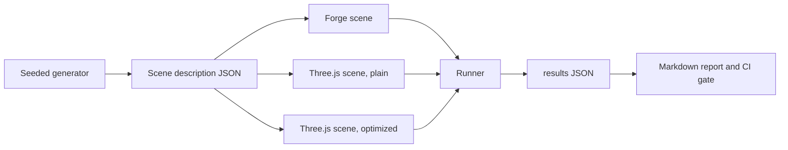

# Design 01: Testing and Benchmarks

|                                       |                                                                          |
| ------------------------------------- | ------------------------------------------------------------------------ |
| **Status**                            | Draft, for review                                                        |
| **Kind**                              | Infrastructure                                                           |
| **Engine version at time of writing** | `0.26.1`                                                                 |
| **Program**                           | [Forge 3D](./README.md), milestones M0 (Phases 1 and 2) and M1 (Phase 3) |
| **Related**                           | Every other design in this folder lists the tests it adds here           |

## 0. Targeted modules

| Path                                          | Change   | Notes                                                                                                                                       |
| --------------------------------------------- | -------- | ------------------------------------------------------------------------------------------------------------------------------------------- |
| `bench/` (new top-level folder)               | New      | Scene benchmark app (Forge and Three.js scenes), runner, scene generators, reports                                                          |
| `src/**/*.bench.ts`                           | New      | Microbenchmarks next to the code they measure                                                                                               |
| `e2e/golden/` (new)                           | New      | Golden-image specs, scenes and reference images                                                                                             |
| `e2e/allocation/` (new)                       | New      | Steady-state allocation specs driven through the Chrome DevTools Protocol                                                                   |
| `e2e/fixtures/harness.ts`                     | Modified | Golden and allocation scenes share the existing scene contract                                                                              |
| `src/rendering/test-helpers/recording-gl.ts`  | New      | A recording WebGL2 fake shared by device-layer and pipeline unit tests                                                                      |
| `src/math/test-helpers/`                      | New      | Tolerance matchers and seeded generators for vectors, quaternions and matrices                                                              |
| `vite.config.base.js`                         | Modified | `benchmark` configuration for Vitest                                                                                                        |
| `package.json`                                | Modified | `bench`, `bench:micro`, `bench:compare`, `test:golden`, `test:golden:update`, `test:allocation` scripts; `three` as a pinned dev dependency |
| `.github/workflows/ci.yml`                    | Modified | `bench-micro`, `bench-scenes`, `test-golden`, `test-allocation`, `bundle-size` jobs                                                         |
| `tsconfig.build.json`, `package.json` `files` | Modified | `bench/` never ships                                                                                                                        |

---

## 1. Summary

Forge has unit tests and a Playwright suite that checks rendering through
relative, same-run measurements. It has no benchmarks, no allocation checks
and no reference images. The 3D program changes the transform, the ECS
query path and the whole renderer, and promises budgets and a comparison
with Three.js (README §5). None of that can be held to without
measurement, and the measurement has to exist _before_ the changes, so the
`0.26.1` 2D engine can be the first baseline.

This design adds four kinds of test:

- **Microbenchmarks** with Vitest's benchmark mode, for the hot loops
  (queries, transform propagation, culling, sorting, light clustering,
  physics phases, glTF parsing).
- **Scene benchmarks** in a real browser: the README's B1 to B9, each built
  once with Forge and once with Three.js from the same generated content,
  run along the same scripted camera path and measured the same way.
- **Allocation tests** that run a scene for thousands of frames under the
  sampling heap profiler and fail if any engine function allocates in
  steady state.
- **Golden-image tests** that compare rendered frames against reviewed
  reference images, in a pinned browser image so the comparison is
  reproducible, plus analytic tests whose expected output is computed
  rather than captured.

CI runs all four on every pull request. Performance gates compare the pull
request against its base branch in the same job, which cancels most of the
noise of shared runners.

---

## 2. Scope

### In scope

- Vitest benchmark setup, base-versus-head comparison and the CI gate.
- The `bench/` app: scene generators, Forge and Three.js versions of each
  scene, a scripted camera path, the measurement runner and reports.
- Allocation tests through the sampling heap profiler.
- Golden-image tests: the pinned image, capture, comparison, update
  workflow, a canary scene and review rules.
- Analytic rendering tests (energy conservation, known illuminance).
- Unit-test conventions for 3D math, the device layer and systems.
- The bundle-size check for 2D games.
- The process for absolute budgets on reference hardware and for the Unity
  comparison.

### Out of scope

- **GPU-time gates in CI.** Shared runners have no GPU; SwiftShader timings
  say nothing about real GPUs. GPU budgets are checked on reference
  hardware at each milestone (§6.6).
- **Building Unity in CI.** It needs a license and a Unity install; the
  comparison builds live outside this repository (open question 2).
- **Cross-browser golden images.** Goldens are valid in one pinned
  environment (§6.4). Other browsers are covered by the behavioral e2e
  suite, which already runs there or can.
- **Fuzzing shaders or glTF files.** The glTF loader validates its input
  (design 11) and has malformed-file unit tests; fuzzing can come later.

---

## 3. Phases

### Phase 1: Microbenchmarks and allocation tests

Benchmarks and allocation tests for today's code, so the M1 changes have a
baseline.

| #   | Task                        | Description                                                                                                                                                     | Size |
| --- | --------------------------- | --------------------------------------------------------------------------------------------------------------------------------------------------------------- | ---- |
| 1.1 | Vitest benchmark setup      | `bench:micro` runs `src/**/*.bench.ts`; results written as JSON                                                                                                 | S    |
| 1.2 | First microbenchmarks       | ECS `query` and iteration at 1k, 10k and 100k entities; transform system with flat and deep hierarchies; sprite command building and radix sort; 2D broad phase | M    |
| 1.3 | Base-versus-head comparison | A script that builds the base and head commits in one job, runs both, compares medians and fails on a regression past the threshold (§6.2)                      | M    |
| 1.4 | Allocation test harness     | `e2e/allocation/`: runs a scene for 2,000 warm-up frames, then samples allocations for 2,000 frames through the DevTools Protocol (§6.3)                        | M    |
| 1.5 | Allocation specs for 2D     | The sprite, text, UI and particle stress scenes; known allocators today recorded as an allow-list that later designs must empty                                 | S    |

**Definition of done:** `npm run bench:micro` and `npm run test:allocation`
run locally and in CI; the comparison job fails on a deliberate 20%
slowdown in a test branch and passes on an unchanged one.

### Phase 2: Scene benchmarks and the 2D baseline (M0)

| #   | Task                    | Description                                                                                                                         | Size |
| --- | ----------------------- | ----------------------------------------------------------------------------------------------------------------------------------- | ---- |
| 2.1 | `bench/` app and runner | Vite app, scene registry, scripted camera paths, Playwright runner with uncapped frame rate, JSON and Markdown reports (§6.2)       | M    |
| 2.2 | Device counters         | Draw calls, triangles, program and texture binds counted in Forge (a counter object on the render context, zero cost when not read) | S    |
| 2.3 | B7 sprites, B8 UI       | Forge versions, and a Three.js version of B7                                                                                        | M    |
| 2.4 | Baseline report         | Run on the reference hardware and in CI; commit `bench/reports/0.26.1.md`                                                           | S    |
| 2.5 | Bundle-size check       | Build the 2D demos' bundles on base and head; fail when gzip size grows past 5%                                                     | S    |

**Definition of done:** M0 as in the README: the B7 and B8 baselines are
committed and CI fails a pull request that makes either more than 10%
slower.

### Phase 3: Golden-image suite

Lands during M1, so the renderer rewrite (designs 05 to 07) is checked
against today's output.

| #   | Task                      | Description                                                                                                                                                                                                                                 | Size |
| --- | ------------------------- | ------------------------------------------------------------------------------------------------------------------------------------------------------------------------------------------------------------------------------------------- | ---- |
| 3.1 | Pinned golden environment | The Playwright Docker image matching the pinned `@playwright/test` version; `test:golden` and `test:golden:update` run inside it locally and in CI                                                                                          | M    |
| 3.2 | Capture and compare       | Golden scenes render with `preserveDrawingBuffer`; the canvas element is captured and compared with per-spec tolerances (§6.4)                                                                                                              | S    |
| 3.3 | Canary scene              | A trivial scene whose failure means the environment is wrong, reported as such before other goldens run                                                                                                                                     | S    |
| 3.4 | 2D goldens                | Sprites (tint, emissive, nine-slice, flip), text and effects, masks, draw order, UI controls, terrain, bloom, blur, tone mapping. Text goldens are captured after design 07 Phase 0 (the rotated-text fix), so no golden records the defect | M    |
| 3.5 | Stability check           | 20 consecutive CI runs with no golden failures before the job becomes required                                                                                                                                                              | S    |

**Definition of done:** the job is a required check and has been stable for
20 runs.

### Phase 4: 3D scenes

The harness and content generators for every 3D scene, so each design can
turn its scene on as its features land.

| #   | Task                              | Description                                                                                                                         | Size |
| --- | --------------------------------- | ----------------------------------------------------------------------------------------------------------------------------------- | ---- |
| 4.1 | Scene generators                  | Seeded generators for B1 to B6 that write a scene description both engines build from (§6.2.2)                                      | M    |
| 4.2 | Three.js versions of B1 to B5, B9 | A plain version and an optimized version of each (§6.2.3)                                                                           | L    |
| 4.3 | Forge versions                    | Added by the designs that make each scene possible; until then the runner reports them as pending                                   | –    |
| 4.4 | Physics scenarios                 | Node-run scenario tests and benchmarks for design 14 (§6.5)                                                                         | M    |
| 4.5 | Analytic rendering test harness   | Helpers to sample regions of the canvas and compare against computed values; the init script that masks `EXT_clip_control` (§6.4.4) | S    |
| 4.6 | Audio render time                 | The runner's second measurement kind, an `OfflineAudioContext` driven frame by frame (§6.2.2), for design 15                        | S    |

**Definition of done:** the runner runs every scene for Three.js and reports
Forge's as pending or measured.

### Phase 5: Reference hardware and Unity

| #   | Task                    | Description                                                                                                 | Size |
| --- | ----------------------- | ----------------------------------------------------------------------------------------------------------- | ---- |
| 5.1 | Reference run procedure | A documented `npm run bench -- --report` procedure on the reference devices, with GPU timing when available | S    |
| 5.2 | Unity comparison        | Unity web builds of B1 to B5 (outside this repository) measured by the same runner from a URL               | L    |
| 5.3 | Milestone reports       | `bench/reports/<milestone>.md` at M3, M4, M5 and M6                                                         | S    |

**Definition of done:** the M3 report covers Forge, Three.js and Unity for
B1 to B5 on the reference hardware.

---

## 4. Decision log

| #   | Decision                       | Options                                                                                                                 | Chosen | Rationale, trade-offs, assumptions                                                                                                                                                                                                                                                                                                                                       |
| --- | ------------------------------ | ----------------------------------------------------------------------------------------------------------------------- | ------ | ------------------------------------------------------------------------------------------------------------------------------------------------------------------------------------------------------------------------------------------------------------------------------------------------------------------------------------------------------------------------ |
| T1  | Microbenchmark tool            | (a) Vitest's benchmark mode; (b) a custom harness; (c) a separate benchmark library                                     | (a)    | Forge already runs Vitest; benchmark mode reuses its TypeScript and module setup and reports per-task statistics. No new dependency.                                                                                                                                                                                                                                     |
| T2  | Performance gate               | (a) Absolute thresholds; (b) base versus head in the same job                                                           | (b)    | Shared runners vary by 20% or more between machines. Running both commits on the same machine in the same job, interleaved, compares like with like. Trade-off: the job takes about twice as long. Absolute budgets are checked on reference hardware instead (§6.6).                                                                                                    |
| T3  | Golden-image environment       | (a) Pinned Docker image with SwiftShader; (b) a hosted visual-testing service; (c) no goldens, relative assertions only | (a)    | SwiftShader is a CPU rasterizer, so the same build gives the same pixels on any machine. Pinning the image pins its build, which addresses the CI-only SwiftShader discrepancy `AGENTS.md` records: if a SwiftShader update changes output, it changes in a reviewed update to the image, not between runs. (b) costs money and needs secrets. (c) can't verify shading. |
| T4  | Fair Three.js comparison       | (a) The Three.js code a typical developer writes; (b) the most optimized Three.js code; (c) both                        | (c)    | Forge instances and batches automatically; Three.js does when the developer uses `InstancedMesh` or `BatchedMesh`. Reporting both shows the default experience and the ceiling. Forge's target is the optimized version.                                                                                                                                                 |
| T5  | Allocation detection           | (a) JS heap size before and after; (b) the sampling heap profiler through the DevTools Protocol                         | (b)    | Heap size deltas are hidden by garbage collection and say nothing about where an allocation happened. The sampling profiler attributes allocations to call stacks, so a failure names the function.                                                                                                                                                                      |
| T6  | Property tests for math        | (a) A property-testing library; (b) seeded loops with Forge's own `Random`                                              | (b)    | Math properties (an inverse undoes, a decomposition recomposes) only need many seeded inputs and tolerant comparison. No new dependency, and failures print the seed to reproduce.                                                                                                                                                                                       |
| T7  | Frame rate in scene benchmarks | (a) Measure frames per second at the display's rate; (b) uncap the frame rate and measure CPU time per frame            | (b)    | At a capped 60 fps, every engine that fits in 16 ms scores the same. Chromium's `--disable-gpu-vsync` and `--disable-frame-rate-limit` uncap the loop, and the runner measures the main thread's time per frame.                                                                                                                                                         |

---

## 5. Open questions

1. **A self-hosted GPU runner.** Options: (a) one machine with a real GPU
   running the scene benchmarks nightly with GPU timing; (b) GPU numbers only
   from milestone reports. (a) catches GPU regressions within a day; (b)
   costs nothing. Proposal: (a) once M3 lands, since that's when GPU cost
   becomes the bottleneck.
2. **Regression threshold.** 10% on scene medians and microbenchmark
   medians, with one automatic re-run before failing. Tighter thresholds
   flake on shared runners. Revisit once there's a month of data.
3. **Where Unity builds live.** Options: a separate repository owned by
   the maintainers, or not at all (README open question 3).

---

## 6. Design

### 6.1 Unit tests

Unit tests stay in Vitest under jsdom, next to the code. The 3D designs add
three helpers:

- **Math matchers** (`src/math/test-helpers/`): `expectVec3Close`,
  `expectQuatClose` (treats `q` and `-q` as equal, since they're the same
  rotation), `expectMat4Close`, with an absolute tolerance defaulting to
  `1e-9` for 64-bit math. **Seeded generators** produce random vectors, unit
  quaternions, affine matrices with non-uniform scale, rays and boxes from
  `Random`. A property test runs 1,000 seeded cases and prints the seed on
  failure.
- **Recording WebGL** (`src/rendering/test-helpers/recording-gl.ts`): a
  WebGL2 fake that records every call and models the state that matters
  (bound program, buffers, textures, framebuffer, enabled capabilities,
  blend, depth and stencil state). It replaces the per-test mocks the
  rendering tests build today, and lets device-layer tests assert things
  like "binding the same pipeline twice issues no GL calls". `AGENTS.md`'s
  mocking guidance is updated to point at it.
- **World builders**: small helpers that create a world with a camera, a
  few meshes or bodies, and step it, so system tests read as scenarios.

What jsdom can't test (GLSL compilation, real rasterization) is covered by
the browser suites below. Every shader variant the engine can generate is
compiled and linked in a browser test (`e2e/specs/shader-variants.spec.ts`)
so a variant that only some materials reach can't ship broken. The same
spec runs design 07's attribute-budget check: every sprite and text layout
uses at most 8 per-instance locations and 16 attributes in total.

### 6.2 Performance

#### 6.2.1 Microbenchmarks

`*.bench.ts` files sit next to the code they measure and run with Vitest's
benchmark mode under Node (no jsdom, which distorts timings). Each
benchmark builds its inputs outside the measured function and measures one
operation at three sizes, so a benchmark shows how cost scales.

The comparison script (`bench/compare-micro.mjs`):

1. builds the base commit and the head commit into two folders;
2. runs each benchmark file for base and head alternately, five times each,
   so slow periods on the runner hit both;
3. compares the medians of the per-run medians;
4. re-runs a benchmark that regressed past the threshold once, and fails
   the job if it regresses again;
5. writes a table to the job summary.

#### 6.2.2 Scene benchmarks

A **scene description** is plain data: the meshes (procedural primitives or
glTF files under `bench/assets`), materials, objects with transforms and
motion rules, lights and a camera path. A seeded generator writes it, so
both engines build exactly the same content. Sponza (B5, B9) is a Khronos
sample model fetched by a script and cached, not committed; B9's
KTX2-compressed copy is a release asset the script downloads (design 11
§6.17.1). B4's character is generated from a seed by `bench/`: a 60-joint
humanoid of about 5,000 vertices with four influences, and walk and run
clips at 30 keys per second with translation, rotation and scale on every
joint, which is what common exporters write (design 12 §6.17.1). No
Khronos sample character has 60 joints and two locomotion clips.

Scenes besides B1 to B9, added by the designs that need them:

- **Hidden walkers** (design 12): the 100 B4 characters walking outside
  every view and shadow view. It reports the animation and deformation
  systems' time and the palette bytes uploaded, which must be zero.
- **`spatial-audio-render`** (design 15): spatial sounds measured by audio
  render time (below).

B9 measures from the `assets.load` call to the first frame with every part
drawn. The scene creates its world, `registerRendering` with the lighting
feature, the camera and the shadowed sun before that call, so pipelines
compile against their views while textures transcode (design 11 GA28).
The Three.js version calls `compileAsync` with the camera, the same
preparation.

Each scene module exports `build(canvas, description)` returning a `step()`
function and a counters reader. The runner (Playwright, Chromium with
`--disable-gpu-vsync --disable-frame-rate-limit`):

1. loads the scene and waits for assets and shader preparation;
2. runs 120 warm-up frames;
3. runs 600 measured frames along the camera path, recording for each frame
   the main-thread time from the start of `step()` to its return;
4. records draw calls, triangles and binds from the engine counters
   (Forge's device counters, Three.js's `renderer.info`);
5. records GPU time per frame with `EXT_disjoint_timer_query_webgl2` when
   the browser exposes it (reference hardware only);
6. reports the median, 95th and 99th percentile, frames over 16.7 ms and
   the counters.

**Audio render time** is the runner's second measurement kind. A scene
exports a function that drives an `OfflineAudioContext`, suspending it at
every 1/60 s of audio time to run one frame of the world, so the audio
parameter calls are the ones a live frame makes. The runner reports the
wall time of `startRendering()` minus the time spent in those frame
callbacks, per second of audio. It is CPU work, so it's meaningful in CI
and is gated base versus head like CPU frame times.

In CI, scenes run on SwiftShader, so only CPU numbers are meaningful. The
gate is the same as for microbenchmarks: base versus head, plus Forge
versus Three.js optimized on the same run, which must stay at or under
`1.0×` for the scenes with a Three.js target (README §5).

#### 6.2.3 Three.js versions

Three.js is a pinned dev dependency (an exact version, bumped deliberately
with the report regenerated). Each 3D scene has:

- a **plain** version: one `Mesh` per object, `MeshStandardMaterial`,
  default renderer settings, as the Three.js documentation teaches;
- an **optimized** version: `InstancedMesh` or `BatchedMesh` where content
  repeats, frozen matrices (`matrixAutoUpdate = false`) for static objects,
  shared materials, and the same shadow settings as Forge.

Both use the same shadow map sizes, cascade counts (via the same split
distances), light counts, tone mapping and anti-aliasing as the Forge
version. The report lists any feature one engine can't match.

#### 6.2.4 Bundle size

`bundle-size` builds each 2D demo on base and head with the docs site's
production build, gzips the output, and fails when a demo grows more than
5%. This is what holds the README's promise that 2D games don't pay for 3D.

### 6.3 Allocation tests

An allocation spec loads a scene from the e2e harness, runs 2,000 frames
to reach steady state, then:

1. starts `HeapProfiler.startSampling` through a Chrome DevTools Protocol
   session, with a 512-byte sampling interval;
2. steps 2,000 frames;
3. stops sampling and walks the profile;
4. fails if any sample's stack has a frame from Forge's source (matched by
   source URL) that isn't in the spec's allow-list.

The allow-list starts with what Phase 1 finds in the `0.26.1` code (for
example, `EcsWorld.query` builds new arrays every call). Design 03 removes
those entries. After M1, the allow-list for the 2D scenes is empty, and
every new per-frame system ships with an allocation spec.

### 6.4 Golden-image tests

#### 6.4.1 Environment

Golden specs run only inside the Playwright Docker image whose version
matches the pinned `@playwright/test`. `npm run test:golden` starts the
container (locally and in CI), so goldens never depend on the host's GPU,
driver or fonts. Updating `@playwright/test` changes the image, and
`test:golden:update` regenerates the images in the same pull request, for
review.

#### 6.4.2 Capture and comparison

- Golden scenes create their render context with `preserveDrawingBuffer`,
  so capturing after a frame is reliable.
- Time is fixed: scenes step with a constant delta and seeded randomness.
- Canvas size is 320 × 240 at device pixel ratio 1, which keeps images small
  in the repository; scenes testing pixel ratio use 2.
- Comparison uses Playwright's screenshot comparison on the canvas element,
  with a per-pixel color threshold and a maximum fraction of differing
  pixels set per spec. The default is a 0.1 threshold and 0.2% of pixels;
  specs testing thin features (shadows' edges, text) document a looser one.

#### 6.4.3 The canary and review rules

The first golden spec clears to a known color and draws one opaque quad. If
it fails, the environment is wrong (a changed rasterizer, a GL fallback),
and the job reports that and skips the rest, rather than failing every
golden for a reason unrelated to the change. This addresses the SwiftShader
incident in `AGENTS.md`'s e2e section: such an environment problem shows
up as one clearly named failure.

A pull request that changes goldens shows the old and new images in its
diff. Review rules, added to the `write-e2e-test` skill:

- a golden changes only when the pull request explains why the old output
  was wrong or the new feature changes it;
- a new golden for a 3D feature is checked once against a reference
  renderer (the Khronos glTF Sample Viewer for materials and models) before
  it's committed, and the check is noted in the pull request.

#### 6.4.4 Analytic tests

Golden images catch changes; they don't prove correctness. Analytic tests
render scenes whose correct output can be computed, and sample the center
of regions (never edges) against the computed value with a tolerance. They
run in the normal e2e suite, on any GPU, because they compare against
math, not against a capture. Examples from designs 09 and 10:

- **White furnace:** spheres of every roughness and metalness, white base
  color, in a uniform white environment with no punctual lights, should be
  indistinguishable from the background. Any visible sphere means the
  BRDF gains or loses energy.
- **Known illuminance:** a plane with a white Lambertian material facing a
  directional light of a given lux, with a fixed exposure and tone mapping
  disabled, has a known output value.
- **Shadow coverage:** a plane half covered by an occluder is dark on the
  occluded side and lit on the other, at sampled points away from the edge.
- **Depth precision:** two planes 1 mm apart, 5 km from the origin, viewed
  from 1 m away, never z-fight (the camera-relative path in design 06).

Analytic lighting and shadow tests run under both depth conventions
(README G8): reversed depth where the browser has `EXT_clip_control`, and
standard depth by masking the extension with a Playwright init script
that wraps `getExtension` to return `null` for it. The engine needs no
test-only option for this.

### 6.5 Physics tests

Physics tests run under Node (they don't need a browser) and are of three
kinds, set out in design 14:

- **Unit tests** for shapes, mass properties, GJK/EPA, SAT, manifolds,
  joints and queries, using the math helpers above.
- **Scenario tests:** a stack of 10 boxes stays standing for 10 simulated
  seconds with less than 1 cm of drift; a 20-level pyramid comes to rest
  and sleeps; a 0.5 cm-thick wall stops a body moving at 100 m/s; a
  50-link chain stays connected; a character controller climbs steps and
  stops on slopes past its limit. Each runs at the fixed step and asserts
  on positions and sleep state.
- **Determinism:** the same scenario run twice in one process produces
  bit-identical body states. Forge doesn't promise determinism across
  machines (README non-goals), but repeatability on one machine is what
  makes the other tests stable.

The scenario list in design 14 §6.23.2 also includes sensor pickups (a
mover walking through static sensors gets one begin and one end per
pickup) and the box stack and platform 10,000 km from the origin.

B6 measures the step cost in the browser runner, alongside Rapier
(informational; it's a WASM engine and a different design). Besides the
per-step stage times, the B6 report records each frame's fixed-step count
and physics time, once at the reference display rate and once with the
frame rate held at 30 fps, so a regression that pushes typical frames to
two steps shows (design 14 §6.22.3). Physics microbenchmarks run in V8
under Node in CI and in Chrome on the reference devices through the
runner; the solver-row and box-box figures B6 depends on are measured in
design 14's Phase 2.

### 6.6 Reference hardware and Unity

Absolute budgets (README §5) apply to reference devices (README open
question 2). At each milestone a maintainer runs `npm run bench --
--report` on each device; the runner enables GPU timing when the browser
exposes `EXT_disjoint_timer_query_webgl2` and records the browser version,
GPU and driver. The report goes to `bench/reports/<milestone>.md`.

Unity comparison builds are made from Unity projects that build B1 to B5
from the same scene descriptions (an importer script in the Unity project
reads the JSON), with the Universal render pipeline and WebGL2. The runner
opens each build from a URL and measures frame times through Chrome's
tracing, since a Unity build's frame loop isn't instrumented by Forge's
runner.

### 6.7 What every 3D design's phases include

So the suites grow with the features, every phase that adds or changes
runtime behavior includes:

- unit tests for each public function and system;
- golden scenes for anything visible, and analytic tests where the output
  can be computed;
- an allocation spec for any new per-frame system;
- the microbenchmark or scene benchmark it affects, with the result in the
  pull request;
- the guide page and demo (`CLAUDE.md` steps 8 and 9).

The other designs' test sections list these specifically.
