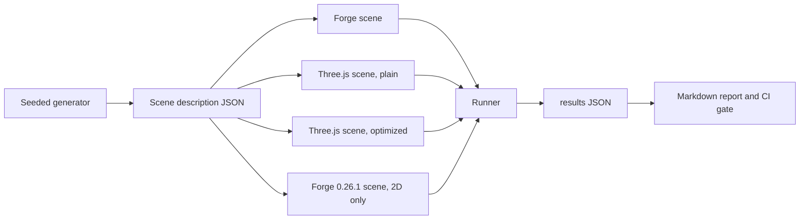

# Design 01: Testing and Benchmarks

|                                       |                                                                                                                                                                                                                       |
| ------------------------------------- | --------------------------------------------------------------------------------------------------------------------------------------------------------------------------------------------------------------------- |
| **Status**                            | Draft, for review (revised after solution review, §7)                                                                                                                                                                 |
| **Kind**                              | Infrastructure                                                                                                                                                                                                        |
| **Engine version at time of writing** | `0.26.1`                                                                                                                                                                                                              |
| **Program**                           | [Forge 3D](./README.md), milestones M0 (Phases 1 and 2), M1 (Phase 3, after design 07 Phase 0 and before designs 02 to 04), M2 (Phase 6) and M3 (Phases 4 and 5; tasks 4.1 and 4.3 earlier, before design 14 Phase 2) |
| **Related**                           | Every other design in this folder lists the tests it adds here                                                                                                                                                        |

## 0. Targeted modules

| Path                                                                                                                                            | Change   | Notes                                                                                                                                                                          |
| ----------------------------------------------------------------------------------------------------------------------------------------------- | -------- | ------------------------------------------------------------------------------------------------------------------------------------------------------------------------------ |
| `bench/` (new top-level folder)                                                                                                                 | New      | Scene benchmark app (Forge, Three.js and `0.26.1` versions of scenes), runner, self-timing page, scene generators, the bundle-size entry point, reports                        |
| `src/**/*.bench.ts`                                                                                                                             | New      | Microbenchmarks next to the code they measure                                                                                                                                  |
| `e2e/golden/` (new)                                                                                                                             | New      | Golden-image specs, scenes and reference images                                                                                                                                |
| `e2e/allocation/` (new)                                                                                                                         | New      | Steady-state allocation specs driven through the Chrome DevTools Protocol                                                                                                      |
| `e2e/fixtures/scenes/`                                                                                                                          | Modified | The sprite, UI, particle and text stress scenes, the first three ported from the docs-site demos, for the allocation specs and B8                                              |
| `e2e/playwright.golden.config.ts`, `e2e/playwright.allocation.config.ts`                                                                        | New      | The golden and `@analytic` specs, run in the pinned container, and the allocation specs; both with `retries: 0`                                                                |
| `e2e/fixtures/harness.ts`                                                                                                                       | Modified | Its scene glob also loads `e2e/golden/scenes/`, so golden scenes share the existing scene contract                                                                             |
| `e2e/playwright.config.ts`                                                                                                                      | Modified | Skips the `@analytic` specs; `firefox` and `webkit` projects (Phase 6)                                                                                                         |
| `src/rendering/test-helpers/recording-gl.ts`                                                                                                    | New      | A recording WebGL2 fake shared by device-layer and renderer unit tests                                                                                                         |
| `src/math/test-helpers/`                                                                                                                        | New      | Tolerance matchers and seeded generators for vectors, quaternions and matrices                                                                                                 |
| `src/rendering/render-context.ts`, `render-system.ts`, `create-terrain-render-ecs-system.ts`, `fullscreen-pass.ts`, `material.ts`, `texture.ts` | Modified | Device counters (task 2.2)                                                                                                                                                     |
| `src/ecs/ecs-world.ts`                                                                                                                          | Modified | Opt-in system timing (task 2.7)                                                                                                                                                |
| `vite.config.base.js`                                                                                                                           | Modified | `benchmark` configuration for Vitest, in a Node environment; `*.bench.ts` excluded from coverage                                                                               |
| `package.json`                                                                                                                                  | Modified | `bench`, `bench:micro`, `bench:compare`, `test:golden`, `test:golden:update`, `test:allocation` scripts; Vitest pinned to an exact version; `three` as a pinned dev dependency |
| `.github/workflows/ci.yml`                                                                                                                      | Modified | `bench-micro`, `bench-scenes`, `test-golden`, `test-allocation`, `bundle-size`, `test-backends` jobs                                                                           |
| `.github/workflows/golden-update.yml`                                                                                                           | New      | Manually triggered: regenerates goldens on a pull request's branch and commits them (§6.4.1)                                                                                   |
| `tsconfig.build.json`                                                                                                                           | Modified | Excludes `**/*.bench.ts`, so microbenchmarks never compile into `/dist`; `bench/` is already outside the base `include`                                                        |
| `AGENTS.md`, `.claude/skills/write-e2e-test/SKILL.md`                                                                                           | Modified | The pinned-container exception to "no golden diffing, no absolute pixel assertions"; golden review rules; the new commands (task 3.6)                                          |

---

## 1. Summary

Forge has unit tests and a Playwright suite that checks rendering through
relative, same-run measurements. It has no benchmarks, no allocation checks
and no reference images. The 3D program changes the transform, the ECS
query path and the whole renderer, and promises budgets and a comparison
with Three.js (README §5). None of that can be held to without
measurement, and the measurement has to exist _before_ the changes, so the
`0.26.1` 2D engine can be the first baseline.

This design adds four kinds of test:

- **Microbenchmarks** with Vitest's benchmark mode, for the hot loops
  (queries, transform propagation, culling, sorting, light clustering,
  physics phases, glTF parsing).
- **Scene benchmarks** in a real browser: the README's B1 to B9, each built
  once with Forge and once with Three.js from the same generated content,
  run along the same scripted camera path and measured the same way.
- **Allocation tests** that run a scene for thousands of frames under the
  sampling heap profiler and fail if any engine function allocates in
  steady state.
- **Golden-image tests** that compare rendered frames against reviewed
  reference images, in a pinned browser image so the comparison is
  reproducible, plus analytic tests whose expected output is computed
  rather than captured.

CI runs all four on every pull request. Performance gates compare the pull
request against its base branch in the same job, which cancels most of the
noise of shared runners, and the 2D scenes also against `0.26.1`, so
slowdowns can't add up one pull request at a time. Absolute budgets and the
comparisons with Three.js and Unity are measured on reference hardware at
each milestone.

---

## 2. Scope

### In scope

- Vitest benchmark setup, base-versus-head comparison and the CI gate.
- The `bench/` app: scene generators, Forge and Three.js versions of each
  scene, a scripted camera path, the measurement runner and reports.
- Allocation tests through the sampling heap profiler.
- Golden-image tests: the pinned image, capture, comparison, update
  workflow, a canary scene and review rules.
- Analytic rendering tests (energy conservation, known illuminance).
- Unit-test conventions for 3D math, the device layer and systems.
- Device counters and opt-in system timing in the engine, which the runner
  reads.
- The bundle-size check for 2D games.
- The process for absolute budgets on reference hardware and for the Unity
  comparison, with a self-timing bench page for browsers Playwright can't
  drive.

### Out of scope

- **GPU-time gates and engine comparisons in CI.** Shared runners have no
  GPU. SwiftShader timings say nothing about real GPUs, and SwiftShader
  rasterizes on the runner's own cores, by an amount that differs per
  engine. GPU budgets and the README §5 ratios against Three.js and Unity
  are checked on reference hardware at each milestone (§6.6). CI gates each
  pull request against its base branch (§6.2.2).
- **Building Unity in CI.** It needs a license and a Unity install; the
  comparison builds live outside this repository (decision T8).
- **Cross-browser golden images and analytic values.** Goldens are valid
  in one pinned environment (§6.4). Other browsers and GPU backends run the
  behavioral, relative analytic and `@backend` specs in Phase 6's matrix
  (§6.8). Like goldens, `@analytic` specs run in the pinned environment and
  on the reference devices (§6.4.4).
- **Fuzzing shaders or glTF files.** The glTF loader validates its input
  (design 11) and has malformed-file unit tests; fuzzing can come later.

---

## 3. Phases

### Phase 1: Microbenchmarks and allocation tests

Benchmarks and allocation tests for today's code, so the M1 changes have a
baseline.

| #   | Task                        | Description                                                                                                                                                                                                                                                         | Size |
| --- | --------------------------- | ------------------------------------------------------------------------------------------------------------------------------------------------------------------------------------------------------------------------------------------------------------------- | ---- |
| 1.1 | Vitest benchmark setup      | `bench:micro` runs `src/**/*.bench.ts`; results written as JSON                                                                                                                                                                                                     | S    |
| 1.2 | First microbenchmarks       | ECS `query` and iteration at 1k, 10k and 100k entities; transform system with flat and deep hierarchies; sprite command building and radix sort; 2D broad phase                                                                                                     | M    |
| 1.3 | Base-versus-head comparison | A script that builds the base and head commits in one job, runs both, compares medians and fails on a regression past the threshold (§6.2)                                                                                                                          | M    |
| 1.4 | Allocation test harness     | `e2e/allocation/`: runs a scene for 4,000 warm-up frames, then samples allocations for 2,000 frames through the DevTools Protocol at fixed intervals, charging each to the innermost frame of Forge's or the scene's code (§6.3)                                    | M    |
| 1.5 | Allocation specs for 2D     | Port the sprite and UI stress tests and the particle demo from the docs site into `e2e/fixtures/scenes/` (e2e depends only on `src/`), and add a text stress scene; a spec for each; known allocators today recorded as an allow-list that later designs must empty | M    |

**Definition of done:** `npm run bench:micro` and `npm run test:allocation`
run locally and in CI; the comparison job fails on a deliberate 20%
slowdown in a test branch and passes on an unchanged one; an allocation
spec gives the same result on repeated runs.

### Phase 2: Scene benchmarks and the 2D baseline (M0)

Builds the scene benchmark app and records the 2D baselines (B7, B8)
before any renderer code changes, so later designs are measured against
today's engine.

| #   | Task                    | Description                                                                                                                                                                                                                                                                                                                                                                                                                                 | Size |
| --- | ----------------------- | ------------------------------------------------------------------------------------------------------------------------------------------------------------------------------------------------------------------------------------------------------------------------------------------------------------------------------------------------------------------------------------------------------------------------------------------- | ---- |
| 2.0 | Reference devices       | Provision the reference devices (README G9) and record their specs, browser channel and driver policy in `bench/reports/README.md`                                                                                                                                                                                                                                                                                                          | S    |
| 2.1 | `bench/` app and runner | Vite app, scene registry, scripted camera paths, Playwright runner with uncapped frame rate, per-frame CPU time from a Chrome trace with GPU-process waits excluded and the frame interval, the 320 × 180 CI canvas, JSON and Markdown reports (§6.2.2)                                                                                                                                                                                     | M    |
| 2.2 | Device counters         | Draw calls, triangles, program and texture binds as running totals on the render context, incremented only inside its own wrappers: the three draw sites (the render system, the terrain render system, `fullscreen-pass.ts`) draw through one render context function, and binds count in `Material` and `Texture`. Nothing resets them; the runner reads them before and after each frame. `#### Added` for the render context's counters | S    |
| 2.3 | B7 sprites, B8 UI       | Forge versions (B8's is task 1.5's UI stress scene), a Three.js version of B7, and `0.26.1` versions of both, written against that release's API and built from the `v0.26.1` tag in the same job (§6.2.2)                                                                                                                                                                                                                                  | M    |
| 2.4 | Baseline report         | Run on the reference hardware and in CI; commit `bench/reports/0.26.1.md`                                                                                                                                                                                                                                                                                                                                                                   | S    |
| 2.5 | Bundle-size check       | Bundle a minimal 2D game (`bench/bundle/`) against head and against the `v0.26.1` tag; fail when head's gzip size is more than 5% over `0.26.1`'s (§6.2.4)                                                                                                                                                                                                                                                                                  | S    |
| 2.6 | Self-timing page        | `npm run bench -- --serve`: the bench app served cross-origin isolated; opened in any browser, it runs the scenes, times itself and posts its results to the serving machine, for the browsers Playwright can't drive (§6.6)                                                                                                                                                                                                                | M    |
| 2.7 | System timing           | `world.profiler.enable()`: `EcsWorld.update` times each system and group into arrays allocated when systems are added; engine systems set `name`; one check per system per tick when disabled (§6.2.5); `#### Added`                                                                                                                                                                                                                        | S    |

**Definition of done:** M0 as in the README: the B7 and B8 baselines are
committed and CI fails a pull request that makes either more than 10%
slower than its base branch or than `0.26.1`.

### Phase 3: Golden-image suite

Lands at the start of M1, before design 03 Phase 4 and design 04 Phase
1, so the stage reordering, the transform migration and the renderer
rewrite (designs 05 to 07) are all checked against today's output.

| #   | Task                      | Description                                                                                                                                                                                                                                                                                                                                                                                                                                                                                | Size |
| --- | ------------------------- | ------------------------------------------------------------------------------------------------------------------------------------------------------------------------------------------------------------------------------------------------------------------------------------------------------------------------------------------------------------------------------------------------------------------------------------------------------------------------------------------ | ---- |
| 3.1 | Pinned golden environment | The Playwright Docker image matching the pinned `@playwright/test` version, run as `linux/amd64`; `test:golden` runs inside it locally and in CI, and `test:golden:update` only in CI (§6.4.1); `test:golden` also runs the specs tagged `@analytic` after the canary, and `test:e2e` skips them (§6.4.4); `retries: 0`                                                                                                                                                                    | M    |
| 3.2 | Capture and compare       | Golden scenes render with `preserveDrawingBuffer`; the canvas element is captured and compared with per-spec tolerances (§6.4)                                                                                                                                                                                                                                                                                                                                                             | S    |
| 3.3 | Canary scene              | A trivial scene whose failure means the environment is wrong, reported as such before other goldens and `@analytic` specs run                                                                                                                                                                                                                                                                                                                                                              | S    |
| 3.4 | 2D goldens                | Sprites (tint, emissive, nine-slice, flip), text and effects, masks, draw order, UI controls, terrain, bloom, blur, tone mapping. Text goldens are captured after design 07 Phase 0 (the rotated-text fix), so no golden records the defect. Golden scenes load only images without `gAMA`, `cHRM` or `iCCP` chunks (as `assets/fonts/default/default.png`), so design 05 Phase 3, which stops applying them on upload, changes no golden                                                  | M    |
| 3.5 | Analytic test harness     | Helpers to sample regions of the canvas and compare them with computed values or with each other; the `@analytic` tag; the init script that masks the WebGL extensions a spec names (`EXT_clip_control`, `WEBGL_multi_draw`, §6.4.4). Lands with the golden suite in M1, before design 06 Phases 3 and 4 use it in M2                                                                                                                                                                      | S    |
| 3.6 | Conventions               | `AGENTS.md`'s e2e section ("Be wary of pixel-level rendering assertions") and the `write-e2e-test` skill's "What to avoid" describe the exception this phase adds: golden diffing and absolute pixel values are allowed only for specs in the pinned container behind the canary (`e2e/golden/` and `@analytic`, §6.4.1, §6.4.4), and the normal suite keeps relative, same-run measurements; the skill gains §6.4.3's golden review rules; `AGENTS.md`'s "Running" lists the new commands | S    |
| 3.7 | Stability check           | 20 consecutive CI runs, with retries off, with no golden failures before the job becomes required                                                                                                                                                                                                                                                                                                                                                                                          | S    |

**Definition of done:** the job is a required check and has been stable for
20 runs.

### Phase 4: 3D scenes

The harness and content generators for every 3D scene, so each design can
turn its scene on as its features land. The Forge version of each scene is
added by the design that makes it possible; until then the runner reports
it as pending.

| #   | Task                              | Description                                                                                                  | Size |
| --- | --------------------------------- | ------------------------------------------------------------------------------------------------------------ | ---- |
| 4.1 | Scene generators                  | Seeded generators for B1 to B6 that write a scene description both engines build from (§6.2.2)               | M    |
| 4.2 | Three.js versions of B1 to B5, B9 | A plain version and an optimized version of each (§6.2.3)                                                    | L    |
| 4.3 | Physics scenarios                 | Node-run scenario tests and benchmarks for design 14 (§6.5)                                                  | M    |
| 4.4 | Audio render time                 | The runner's second measurement kind, an `OfflineAudioContext` driven frame by frame (§6.2.2), for design 15 | S    |

**Definition of done:** the runner runs every scene for Three.js and reports
Forge's as pending or measured.

### Phase 5: Reference hardware and Unity

Fixes the reference hardware and the procedure for running on it, and
adds the Unity comparison, so milestone reports compare Forge, Three.js
and Unity on the same machines.

| #   | Task                    | Description                                                                                                                                                                                                                                                                                                                                                                                       | Size |
| --- | ----------------------- | ------------------------------------------------------------------------------------------------------------------------------------------------------------------------------------------------------------------------------------------------------------------------------------------------------------------------------------------------------------------------------------------------- | ---- |
| 5.1 | Reference run procedure | A documented `npm run bench -- --report` procedure on the reference devices (README G9), through the runner where Playwright drives the browser and the self-timing page in Safari (§6.6), with GPU timing when available; on the phones, the mobile variants of README §5 with resident GPU memory (design 05's resident counters) and a 10-minute run per scene that records thermal throttling | S    |
| 5.2 | Unity comparison        | Unity web builds of B1 to B5 and B9 (outside this repository, decision T8), loaded from a URL and timed by the bench page as Forge and Three.js are (§6.6, decision T10)                                                                                                                                                                                                                          | L    |
| 5.3 | Milestone reports       | `bench/reports/<milestone>.md` at M3, M4, M5 and M6, desktop and mobile; the Unity and mobile columns gate the milestone as README §7 says                                                                                                                                                                                                                                                        | S    |

**Definition of done:** the M3 report covers Forge, Three.js and Unity for
B1, B2, B3 and the hand-built B5 on the reference hardware, desktop and
mobile, and its Unity numbers gate M3 (README §7); B4 and the Sponza B5
join in the M4 report (README §7).

### Phase 6: Backend and browser matrix (M2, before design 05 Phase 4)

CI runs Chromium on Linux with SwiftShader only, so specs that depend on
a GPU backend or a browser run on one of each. This phase runs them where
the designs' assumptions differ: ANGLE's D3D11, Metal and OpenGL
backends, Firefox and WebKit.

| #   | Task                        | Description                                                                                                                                                                                                                                                                                                                                                                                                                                           | Size |
| --- | --------------------------- | ----------------------------------------------------------------------------------------------------------------------------------------------------------------------------------------------------------------------------------------------------------------------------------------------------------------------------------------------------------------------------------------------------------------------------------------------------- | ---- |
| 6.1 | `test-backends` job         | A CI job on `windows-latest` (Chromium with ANGLE's D3D11 backend on WARP), `macos-latest` (`--use-angle=metal`) and `ubuntu-24.04` (`--use-angle=gl` on Mesa, and SwiftShader) that first checks that the renderer string names the expected backend, then runs the specs tagged `@backend`: shader variants, stage-precision link, std140 offsets, one depth texture on two samplers, prepass invariance, depth precision, alpha-to-coverage (§6.8) | M    |
| 6.2 | Firefox and WebKit projects | Playwright `firefox` and `webkit` projects in `e2e/playwright.config.ts`, running the behavioral and relative analytic specs; goldens, `@analytic` specs and the DevTools Protocol allocation specs stay Chromium-only (§6.8)                                                                                                                                                                                                                         | M    |
| 6.3 | Required checks             | Both jobs required from M2; the browser gate table (§6.8) in the `write-e2e-test` skill                                                                                                                                                                                                                                                                                                                                                               | S    |

**Definition of done:** `test-backends` and the Firefox and WebKit
projects pass and are required checks; a spec tagged `@backend` that fails
on one backend fails the pull request; each configuration's renderer
canary passes, and a configuration whose canary can't pass on hosted
runners waits for open question 2.

---

## 4. Decision log

| #   | Decision                       | Options                                                                                                                                                                                                                     | Chosen | Rationale, trade-offs, assumptions                                                                                                                                                                                                                                                                                                                                                                                                                                                                                                                                                                                                                                                                                                                                                                                                                                                                                                                                                |
| --- | ------------------------------ | --------------------------------------------------------------------------------------------------------------------------------------------------------------------------------------------------------------------------- | ------ | --------------------------------------------------------------------------------------------------------------------------------------------------------------------------------------------------------------------------------------------------------------------------------------------------------------------------------------------------------------------------------------------------------------------------------------------------------------------------------------------------------------------------------------------------------------------------------------------------------------------------------------------------------------------------------------------------------------------------------------------------------------------------------------------------------------------------------------------------------------------------------------------------------------------------------------------------------------------------------- |
| T1  | Microbenchmark tool            | (a) Vitest's benchmark mode; (b) a custom harness; (c) a separate benchmark library                                                                                                                                         | (a)    | Forge already runs Vitest; benchmark mode reuses its TypeScript and module setup and reports per-task statistics. No new dependency. Benchmark mode is marked experimental in Vitest 4, so Vitest is pinned to an exact version and bumped deliberately.                                                                                                                                                                                                                                                                                                                                                                                                                                                                                                                                                                                                                                                                                                                          |
| T2  | Performance gate               | (a) Absolute thresholds; (b) base versus head in the same job                                                                                                                                                               | (b)    | Shared runners vary by 20% or more between machines. Running both commits on the same machine in the same job, interleaved, compares like with like. Interleaving reduces noise but doesn't remove it, and each added benchmark is another chance of a false failure, so a regression must repeat on a re-run to fail (§6.2.1); open question 3 revisits the metric. Base versus head alone lets slowdowns under the threshold add up, so the 2D scenes and the bundle are also compared with `0.26.1` in the same job (§6.2.2, §6.2.4). Trade-off: the job takes about twice as long. Absolute budgets are checked on reference hardware instead (§6.6).                                                                                                                                                                                                                                                                                                                         |
| T3  | Golden-image environment       | (a) Pinned Docker image with SwiftShader; (b) a hosted visual-testing service; (c) no goldens, relative assertions only                                                                                                     | (a)    | SwiftShader is a CPU rasterizer, so its output doesn't depend on a GPU or driver. Pinning the image pins its build, which addresses the CI-only SwiftShader discrepancy `AGENTS.md` records: if a SwiftShader update changes output, it changes in a reviewed update to the image, not between runs. SwiftShader's compiler may use the host CPU's instruction-set extensions, which can change rounding between machines (unverified), and the image is multi-architecture, so goldens are captured and checked only as `linux/amd64`, regenerated only in CI, and compared with a tolerance (§6.4.1, §6.4.2). (b) costs money and needs secrets. (c) can't verify shading.                                                                                                                                                                                                                                                                                                      |
| T4  | Fair Three.js comparison       | (a) The Three.js code a typical developer writes; (b) the most optimized Three.js code; (c) both                                                                                                                            | (c)    | Forge instances and batches automatically; Three.js does when the developer uses `InstancedMesh` or `BatchedMesh`. Reporting both shows the default experience and the ceiling. Forge's target is the optimized version.                                                                                                                                                                                                                                                                                                                                                                                                                                                                                                                                                                                                                                                                                                                                                          |
| T5  | Allocation detection           | (a) JS heap size before and after; (b) the sampling heap profiler through the DevTools Protocol                                                                                                                             | (b)    | Heap size deltas are hidden by garbage collection and say nothing about where an allocation happened. The sampling profiler records each allocation's call stack. The spec charges each allocation to the innermost frame of Forge's or the scene's code (§6.3), so a failure names the function that allocated, and the scene's own systems, which run under `EcsWorld.update`, aren't blamed on Forge. It must be started with `includeObjectsCollectedByMinorGC` and `includeObjectsCollectedByMajorGC`: without them the profile shows only objects still alive when sampling stops, not the per-frame garbage this test exists to catch. V8's `--sampling-heap-profiler-suppress-randomness` makes the sampling interval fixed, so a run's result doesn't depend on chance. Unity's zero-allocation assertions count every allocation exactly; V8 offers that only through allocation tracking, which records every object with its stack and slows a frame many times over. |
| T6  | Property tests for math        | (a) A property-testing library; (b) seeded loops with Forge's own `Random`                                                                                                                                                  | (b)    | Math properties (an inverse undoes, a decomposition recomposes) only need many seeded inputs and tolerant comparison. No new dependency, and failures print the seed to reproduce.                                                                                                                                                                                                                                                                                                                                                                                                                                                                                                                                                                                                                                                                                                                                                                                                |
| T7  | Frame rate in scene benchmarks | (a) Measure frames per second at the display's rate; (b) uncap the frame rate and measure CPU time per frame                                                                                                                | (b)    | At a capped 60 fps, every engine that fits in 16 ms scores the same. The page calls `step()` from `requestAnimationFrame`, so every frame is presented. Chromium's `--disable-gpu-vsync` and `--disable-frame-rate-limit` uncap the loop. The runner measures each frame's main-thread time in `step()` minus the time it blocks on the GPU process (§6.2.2). Uncapped, the GPU process falls behind and the bounded command buffer makes `step()` wait for it, and on SwiftShader that wait is CPU rasterization, not engine work.                                                                                                                                                                                                                                                                                                                                                                                                                                               |
| T8  | Where Unity builds live        | (a) A separate repository owned by the maintainers; (b) no Unity builds                                                                                                                                                     | (a)    | README G10: the product owner's target includes Unity web builds, and (a) is the only fair comparison. It needs a Unity license and an owner; the repository records the Unity version and render pipeline settings with each report.                                                                                                                                                                                                                                                                                                                                                                                                                                                                                                                                                                                                                                                                                                                                             |
| T9  | Per-system timing              | (a) An opt-in timer in `EcsWorld.update`; (b) the runner's CPU sampling profile, charged to systems' functions; (c) User Timing marks around each system                                                                    | (a)    | Designs 06, 12 and 15 set budgets per system or stage. Unity's profiler markers and Bevy's system spans are engine-owned for the same reason. (b) is statistical and can't tell apart systems that share a function; (c) creates an entry per mark, which allocates every frame. (a) writes into arrays allocated when systems are added and costs one check per system when off (§6.2.5).                                                                                                                                                                                                                                                                                                                                                                                                                                                                                                                                                                                        |
| T10 | Measuring each engine          | (a) Each engine's own instrumentation (Forge's `step()`, Three.js's render loop, Unity through Chrome's tracing); (b) one wrapper around `requestAnimationFrame`, installed by the bench page before an engine's code loads | (b)    | A ratio only means something between the same metric. Every engine's frame runs in an animation-frame callback, so timing the callback measures the same thing for all three, in every browser, including Safari, which has no trace the runner can read. Where there is a trace, GPU waits are subtracted the same way for all three (§6.2.2).                                                                                                                                                                                                                                                                                                                                                                                                                                                                                                                                                                                                                                   |

---

## 5. Open questions

In priority order.

1. **Browsers on the Apple reference devices, for the product owner.**
   README G9 runs Safari on the MacBook Air and the iPhone 13. Playwright
   can't drive Safari on macOS or iOS, and Safari has no GPU timer
   queries, no trace the runner can read and no way to uncap the frame
   rate, so its numbers come from the self-timing page with GPU waits
   included (§6.6). Options: (a) Safari only, as G9 says; (b) Chrome on the
   MacBook Air, driven by the runner like the Windows laptop, and Safari on
   the iPhone, where every browser uses WebKit; (c) both browsers on the
   Mac. (a) measures the browser macOS ships with; (b) measures the Mac the
   same way as the other desktop; (c) costs one more run per milestone.
   Proposal: (c), with Safari's numbers gating the budgets as G9 says and
   Chrome's showing how much of Safari's time is GPU waits. Needed before
   M0's baseline (task 2.4); (b) changes README G9.
2. **Self-hosted runners, for the product owner.** Hosted runners have no
   GPU, so the backend matrix runs D3D11 on WARP and OpenGL on Mesa's
   llvmpipe (§6.8), and Metal only if a hosted macOS runner gives Chromium
   a Metal device, which Phase 6's canary checks. GPU time is measured only
   on the reference devices at each milestone. Options: (a) hosted runners
   only; (b) one self-hosted Apple silicon Mac that runs the Metal column
   and, nightly, the scene benchmarks with GPU timing; (c) (b) plus a
   Windows machine with a GPU, for D3D11 on a vendor's driver. (a) costs
   nothing but may leave Metal untested between milestones and finds GPU
   regressions only at milestones; (b) and (c) cost hardware and upkeep,
   and on a public repository a self-hosted runner must not run pull
   requests from forks (GitHub's guidance), so it runs on `dev` after merge
   or on pull requests a maintainer approves. Proposal: (a) until Phase 6's
   canary runs; (b) if hosted macOS has no Metal, and from M3 either way,
   since that's when GPU cost becomes the bottleneck.
3. **Regression threshold and metric.** Options: (a) 10% on scene and
   microbenchmark medians of wall time, with one automatic re-run before
   failing; (b) a tighter threshold, such as 5%; (c) instruction counts for
   microbenchmarks, from Valgrind's CPU simulation, as CodSpeed and
   rustc-perf use. (a) doesn't flake on shared runners; (b) catches
   smaller regressions; (c) gives the same number on every run and doesn't
   get noisier as benchmarks are added, but models time rather than
   measuring it, runs many times slower, and CodSpeed is a hosted service
   that needs a token. Proposal: (a); revisit once there's a month of
   data, moving microbenchmarks to (c) if false failures show up.

---

## 6. Design

### 6.1 Unit tests

Unit tests stay in Vitest under jsdom, next to the code. The 3D designs add
three helpers:

- **Math matchers** (`src/math/test-helpers/`): `expectVec3Close`,
  `expectQuatClose` (treats `q` and `-q` as equal, since they're the same
  rotation), `expectMat4Close`, with an absolute tolerance defaulting to
  `1e-9` for 64-bit math. **Seeded generators** produce random vectors, unit
  quaternions, affine matrices with non-uniform scale, rays and boxes from
  `Random`. A property test runs 1,000 seeded cases and prints the seed on
  failure.
- **Recording WebGL** (`src/rendering/test-helpers/recording-gl.ts`): a
  WebGL2 fake that records every call and models the state that matters
  (bound program, buffers, textures, framebuffer, enabled capabilities,
  blend, depth and stencil state). It replaces the per-test mocks the
  rendering tests build today, and lets device-layer tests assert things
  like "binding the same pipeline twice issues no GL calls". `AGENTS.md`'s
  mocking guidance is updated to point at it.
- **World builders**: small helpers that create a world with a camera, a
  few meshes or bodies, and step it, so system tests read as scenarios.

What jsdom can't test (GLSL compilation, real rasterization) is covered by
the browser suites below. Every shader variant the engine can generate is
compiled and linked in a browser test (`e2e/specs/shader-variants.spec.ts`)
so a variant that only some materials reach can't ship broken. The same spec
runs design 07's attribute-budget check: every sprite, text and particle
layout uses at most 8 per-instance locations and 16 attributes in total.

### 6.2 Performance

#### 6.2.1 Microbenchmarks

`*.bench.ts` files sit next to the code they measure and run with Vitest's
benchmark mode under Node: the benchmark configuration sets a Node
environment, since the unit tests' jsdom distorts timings. Each
benchmark builds its inputs outside the measured function and measures one
operation at three sizes, so a benchmark shows how cost scales.

The comparison script (`bench/compare-micro.mjs`):

1. builds the base commit and the head commit into two folders;
2. runs each benchmark file for base and head alternately, five times each,
   so slow periods on the runner hit both;
3. compares the medians of the per-run medians;
4. re-runs a benchmark that regressed past the threshold once, and fails
   the job if it regresses again;
5. writes a table to the job summary.

Each commit runs its own benchmark files against its own code, and results
are matched by file and benchmark name. A pull request that changes an API
(designs 03 and 04 change the query and transform APIs) updates the
benchmark, and the two sides still measure the same operation. A
benchmark on only one side is reported, not gated.

#### 6.2.2 Scene benchmarks

A **scene description** is plain data: the meshes (procedural primitives or
glTF files under `bench/assets`), materials, objects with transforms and
motion rules, lights and a camera path. A seeded generator writes it, so
both engines build exactly the same content. Sponza (B5, B9) is a Khronos
sample model fetched by a script and cached, not committed; B9's
KTX2-compressed copy is a release asset the script downloads (design 11
§6.17.1). B4's character is generated from a seed by `bench/`: a 60-joint
humanoid of about 5,000 vertices with four influences, and walk and run
clips at 30 keys per second with translation, rotation and scale on every
joint, which is what common exporters write (design 12 §6.17.1). No
Khronos sample character has 60 joints and two locomotion clips.

Scenes besides B1 to B9, added by the designs that need them:

- **Hidden walkers** (design 12): the 100 B4 characters walking outside
  every view and shadow view. It reports the animation and deformation
  systems' time and the palette bytes uploaded, which must be zero.
- **`spatial-audio-render`** (design 15): spatial sounds measured by audio
  render time (below).

B9 measures from the `assets.load` call to the first frame with every part
drawn. The scene creates its world, a renderer with the lighting feature
(`createRenderer`) registered with `registerRendering`, the camera and the
shadowed sun before that call, so GPU pipelines compile against their views
while textures transcode (design 11 GA28). The Three.js version calls
`compileAsync` with the camera, the same preparation.

Each scene module exports `build(canvas, description)` returning a `step()`
function and a counters reader. The bench page calls `step()` once per
`requestAnimationFrame` callback, so every frame is presented as in a game,
and times the callback through a wrapper it installs before any engine code
loads, which times a Unity build's frames the same way (§6.6, decision
T10). The bench app is served cross-origin isolated, so `performance.now()`
has its finest resolution (5 µs in Chromium rather than 100 µs). The runner
(Playwright, Chromium with `--disable-gpu-vsync --disable-frame-rate-limit`,
so callbacks come as fast as frames finish rather than at the display's
rate):

1. loads the scene and waits for assets and shader preparation;
2. runs 120 warm-up frames;
3. runs 600 measured frames along the camera path, recording for each frame
   the CPU time of `step()`: its main-thread duration minus the time the
   main thread is blocked on the GPU process, read from a Chrome trace taken
   through the DevTools Protocol's `Tracing` domain (Chromium's
   command-buffer waits, traced under the `gpu` category; the runner lists
   the event names for the pinned version). Chromium's command buffer is
   bounded, so when the GPU process falls behind, the main thread blocks
   inside `step()`. On SwiftShader that wait is CPU rasterization, which
   differs per engine (Forge's depth prepass and clustered lights) and isn't
   engine work. Where the browser has no such trace (Safari on the macOS and
   iOS reference devices), the report gives `step()`'s duration and says it
   includes GPU waits. The runner also records the interval from one
   `step()` start to the next, which README §5's frame-rate budgets read;
4. records draw calls, triangles and binds from the engine counters
   (Forge's device counters, Three.js's `renderer.info`), and Forge's time
   per system and stage (§6.2.5);
5. records GPU time per frame with `EXT_disjoint_timer_query_webgl2` when
   the browser exposes it (reference hardware only, and in practice only
   Chromium);
6. reports the median, 95th and 99th percentile of CPU time, the frames
   whose interval exceeds 16.7 ms, and the counters.

**Audio render time** is the runner's second measurement kind. A scene
exports a function that drives an `OfflineAudioContext`, suspending it at
every 1/60 s of audio time to run one frame of the world, so the audio
parameter calls are the ones a live frame makes. The runner reports the
wall time of `startRendering()` minus the time spent in those frame
callbacks, per second of audio. It is CPU work, so it's meaningful in CI
and is gated base versus head like CPU frame times.

In CI, scenes run on SwiftShader, which rasterizes on the runner's own
cores. CI runs only the Forge version of each scene, for the base and head
commits alternately as §6.2.1 runs microbenchmarks, with the same threshold
and re-run. It uses a 320 × 180 canvas at pixel ratio 1. Culling, cluster
counts and level-of-detail choices depend on the view's aspect and on
fractions of its size, not on its pixel count (design 09 §6.4.1, design 06
§6.8.4), so the engine does the same culling, cluster and level-of-detail
work as at 1920 × 1080, while rasterization, and with it the job's length,
shrinks. SwiftShader still shares cores with the main thread, by amounts
that differ per engine. So the README §5 ratios (≤ 1× against the optimized
Three.js version; B1 also ≤ 0.5× against the plain version; ≤ 1× against
Unity) are measured and gated on the reference hardware at each milestone
(§6.6), not in CI.

**Against `0.26.1`.** Base versus head lets a slowdown under the threshold
pass in every pull request, and those add up. README §5 holds B7 and B8 to
"no slower than the `0.26.1` baseline", so the 2D scenes (B7, B8 and task
1.5's stress scenes) each have a `0.26.1` version, written against that
release's API. The job builds the `v0.26.1` tag next to the base and head
commits, runs the `0.26.1` versions in the same alternation, and fails when
head is slower by more than the threshold. Design 15's particle check
(task 2.8 there, at least five times faster than `0.26.1`) uses the same
mode.

#### 6.2.3 Three.js versions

Three.js is a pinned dev dependency (an exact version, bumped deliberately
with the report regenerated). Each 3D scene has:

- a **plain** version: one `Mesh` per object, `MeshStandardMaterial`,
  default renderer settings, as the Three.js documentation teaches;
- an **optimized** version: `InstancedMesh` or `BatchedMesh` where content
  repeats, frozen matrices (`matrixAutoUpdate = false`) for static objects,
  shared materials, and the same shadow settings as Forge.

Both use the same shadow map sizes, cascade counts (via the same split
distances), light counts, tone mapping and anti-aliasing as the Forge
version. The report lists any feature one engine can't match.

#### 6.2.4 Bundle size

`bundle-size` bundles a minimal 2D game (`bench/bundle/`: a camera,
sprites, text, a UI canvas with a button, input, audio and 2D physics) with
Vite in production mode, once against head and once, in its `0.26.1`
version, against the `v0.26.1` tag. It gzips both and fails when head's is
more than 5% larger (README open question 3). A minimal entry point shows
the engine's growth, which a docs-site build would hide under React and
shared chunks, and comparing with `0.26.1` rather than the base branch
stops growth adding up one pull request at a time. The job summary also
shows the change from the base branch. This is what holds the README's
promise that 2D games don't pay for 3D.

#### 6.2.5 System timing

Designs 06, 12 and 15 set budgets per system or per stage (design 06
§6.10, design 12's hidden walkers, design 15 §6.8.2), which a frame's total
can't split. `EcsWorld` gets an opt-in timer (decision T9): after
`world.profiler.enable()`, `update` reads `performance.now()` before and
after each system and each group and adds the difference to arrays
allocated when systems are added, so timing allocates nothing per frame.
Disabled, it costs one check per system per tick. The runner reads the
arrays after each frame and reports each system's and group's median,
labelled by `EcsSystem.name`, which every engine system sets; once design
03 Phase 4 adds stages, the runner sums groups into stages. Physics reports
its internal stages itself (design 14's `stats`).

A system's time includes any wait on the GPU process inside it, so
per-system times are reported, not gated, in CI; their budgets are checked
on the reference hardware.

### 6.3 Allocation tests

An allocation spec loads a scene from the e2e harness in Chromium started
with `--js-flags=--sampling-heap-profiler-suppress-randomness`, so a sample
is taken at exactly every 512 bytes allocated and which allocations are
sampled doesn't depend on chance. It runs 4,000 frames to reach steady
state: V8 optimizes a function with TurboFan after about 3,000 calls by
default, and unoptimized code can box numbers that optimized code keeps
unboxed, so a function that runs once per frame is judged only once it's
optimized, as it is in a game that has run for a minute. Then it:

1. starts sampling through a Chrome DevTools Protocol session with
   `HeapProfiler.startSampling({ samplingInterval: 512,
includeObjectsCollectedByMinorGC: true,
includeObjectsCollectedByMajorGC: true })`. Without the two flags the
   profile shows only objects still alive when sampling stops, so the
   per-frame garbage this test exists to catch, collected by scavenges
   before then, would never appear;
2. steps 2,000 frames;
3. stops sampling and walks the profile;
4. charges each sample to the innermost frame of its stack that is Forge's
   or the scene's code: the first frame whose source URL is in the
   repository's `src/` or `e2e/fixtures/` directory. Frames with no URL
   (the profiler's VM-state nodes) and frames in `node_modules` are
   skipped, so an allocation inside a dependency Forge calls is charged to
   Forge;
5. fails on a sample charged to Forge's `src/` unless some frame of its
   stack is a function on the spec's allow-list, and on a sample charged to
   a module the spec names as allocating nothing, whatever the allow-list
   says. The failure message prints the sample's whole stack.

Every system, the scene's own included, runs under `EcsWorld.update`, so
matching any Forge frame on the stack would blame the scene's allocations
on Forge. Allow-list entries, by contrast, match any frame of the stack, so
an entry can name the system an allocator runs under: the render system's
per-quad allocations happen partly inside `Vec2.clone`, which an entry
keyed on the allocating frame would allow for every caller. The module
rule is how design 03 checks that the particle scene makes no ECS
allocations while the particle entry is still on the allow-list. V8's
profile can charge an inlined function's allocation to the function it was
inlined into, which the printed stack shows.

The allow-list starts with what Phase 1 finds in the `0.26.1` code (for
example, `EcsWorld.query` builds new arrays every call). In M1, design 03
removes the ECS entries, by converting every system that calls
`world.query` inside `update` to declared queries (design 03 §6.1.4), and
design 04 removes the transform system's. Every other entry is tagged with
the design and phase that removes it:

| Allocator in the 2D scenes                                                                                                                                                                                                                                           | Removed by                                                                                                                                                 |
| -------------------------------------------------------------------------------------------------------------------------------------------------------------------------------------------------------------------------------------------------------------------- | ---------------------------------------------------------------------------------------------------------------------------------------------------------- |
| The render system's per-quad allocations                                                                                                                                                                                                                             | Design 07 Phase 1 (M2)                                                                                                                                     |
| Particles as entities                                                                                                                                                                                                                                                | Design 15 Phase 2 (M6)                                                                                                                                     |
| The 2D solver                                                                                                                                                                                                                                                        | The follow-up of design 14's open question 2                                                                                                               |
| UI layout, layout-group, canvas-group and navigation systems (`new Set(entities)` per tick in `ui-layout-system.ts`, `ui-layout-group-system.ts` and `ui-canvas-group-system.ts`; the `new Map` caches in `ui-layout-group-system.ts` and `ui-navigation-system.ts`) | Design 15 Phase 4, with its rewrite of these systems                                                                                                       |
| The UI interaction system's `new Map` per tick                                                                                                                                                                                                                       | Design 15 Phase 4, which deletes the system                                                                                                                |
| The UI raycast's candidate array and `Map`, built per canvas per tick (`raycast-ui-canvas.ts:151-152`)                                                                                                                                                               | Design 15 Phase 4 (task 4.6)                                                                                                                               |
| The UI text input system's `new Set` per tick (`ui-text-input-system.ts`), which finds removed fields                                                                                                                                                                | Design 03 Phase 3 (task 3.3), which moves the system's per-field state into components, so removed fields come from the `removed` journal (design 03 §6.2) |

After M6, the 2D allow-list is empty except the 2D solver's entry, and
every new per-frame system ships with an allocation spec.

**Lifetime soak** (`e2e/allocation/lifetime-soak.spec.ts`). Allocation
specs catch per-frame garbage; this one catches leaks across asset and
world lifetimes. It runs 50 cycles of: load a model, instantiate it 100
times, `prepare()`, remove the instances, release the model, and create
and stop a world. After a DevTools-forced garbage collection at the end of
cycles 2 and 50, it takes a heap snapshot and counts JS objects per
constructor (V8's code and internal entries excluded), as memlab does; a
constructor with more objects after cycle 50 than after cycle 2 fails the
spec, which names it. Total heap size would also count the code V8
compiles and the metadata it keeps, which grow without a leak, and cycle 1
fills caches and compiles code, so the comparison starts at cycle 2.
Design 05's resident GPU bytes and resource counts (§6.12 there) after
cycle 50 equal their values after cycle 2. It runs in CI from M2 with
textures only, and from M4 with the asset store and models.

### 6.4 Golden-image tests

#### 6.4.1 Environment

Golden specs run only inside the Playwright Docker image whose version
matches the pinned `@playwright/test`. `npm run test:golden` starts the
container (locally and in CI), so goldens never depend on the host's GPU,
driver or fonts. The image is published for several architectures, so the
container always runs as `linux/amd64` (emulated on Apple silicon), and
`test:golden:update` runs only in CI: the `golden-update` workflow,
started by hand on a pull request's branch, regenerates the images and
commits them there. Every golden then comes from the same kind of runner
as the job that checks it. Updating `@playwright/test` changes the image,
and the workflow regenerates the images in the same pull request, for
review. The golden configuration sets `retries: 0`, unlike the e2e
suite's two retries in CI, so a flaky golden fails instead of passing on a
retry.

#### 6.4.2 Capture and comparison

- Golden scenes create their render context with `preserveDrawingBuffer`,
  so capturing after a frame is reliable.
- Time is fixed: scenes step with a constant delta and seeded randomness.
- Golden scenes register their rendering system after every system that
  writes `local` and after the transform system, the order design 03's
  stages impose, so the stage reordering (design 03 Phase 4) and the
  transform migration (design 04 Phase 1) leave every golden image
  unchanged.
- Canvas size is 320 × 240 at device pixel ratio 1, which keeps images small
  in the repository; scenes testing pixel ratio use 2.
- Comparison uses Playwright's screenshot comparison on the canvas element,
  with a per-pixel color threshold and a maximum fraction of differing
  pixels set per spec. The default is a 0.1 threshold and 0.2% of pixels;
  specs testing thin features (shadows' edges, text) document a looser one.

#### 6.4.3 The canary and review rules

The first golden spec clears to a known color and draws one opaque quad. If
it fails, the environment is wrong (a changed rasterizer, a GL fallback),
and the job reports that and skips the other goldens and the `@analytic`
specs, rather than failing every one for a reason unrelated to the change.
This addresses the SwiftShader incident in `AGENTS.md`'s e2e section: such
an environment problem shows up as one clearly named failure.

A pull request that changes goldens shows the old and new images in its
diff. Review rules, added to the `write-e2e-test` skill:

- a golden changes only when the pull request explains why the old output
  was wrong or the new feature changes it;
- a new golden for a 3D feature is checked once against a reference
  renderer (the Khronos glTF Sample Viewer for materials and models) before
  it's committed, and the check is noted in the pull request.

#### 6.4.4 Analytic tests

Golden images catch changes; they don't prove correctness. Analytic tests
render scenes whose correct output can be computed, and sample the center
of regions (never edges) against the computed value with a tolerance.
Specs that compare a sample with a computed value (the white furnace, known
illuminance, and the value checks designs 07, 09, 10 and 13 add) are tagged
`@analytic` and run where goldens do: in the pinned environment (§6.4.1),
after the canary (§6.4.3), and on the reference devices at each milestone
(§6.6). They assert absolute pixel values, which `AGENTS.md`'s e2e section
warns an unpinned SwiftShader build can get wrong across the whole canvas.
Pinned and behind the canary, such a fault shows as one named environment
failure. Specs that only compare regions of one frame with each other
(shadow coverage, depth precision, far origin) are relative, same-run
measurements, so they also run in the normal e2e suite, and on the backend
matrix where §6.8 tags them `@backend`. Examples from designs 09 and 10:

- **White furnace:** spheres of every roughness and metalness, white base
  color, in a uniform white environment with no punctual lights, should be
  indistinguishable from the background. Any visible sphere means the
  BRDF gains or loses energy.
- **Known illuminance:** a plane with a white Lambertian material facing a
  directional light of a given lux, with a fixed exposure and tone mapping
  disabled, has a known output value.
- **Shadow coverage:** a plane half covered by an occluder is dark on the
  occluded side and lit on the other, at sampled points away from the edge.
- **Depth precision:** two planes 1 mm apart, 5 km from the origin, viewed
  from 1 m away, never z-fight (the camera-relative path in design 06).
- **Far origin** (`far-origin.spec.ts`): a camera and scene at
  (10,000 km, 0, 10,000 km) with a mesh, a sprite, a masked UI panel and a
  shadowed cube. The camera steps 1 mm per frame for 60 frames; the
  landmarks' rendered bounds move monotonically, within 0.5 px of the
  expected path, and the shadow edge stays put (relative measurements).
  It runs under both depth conventions. This is README §4.3's large-world
  claim, which otherwise only physics tests (design 14).

Analytic lighting and shadow tests run under both depth conventions
(README G8): reversed depth where the browser has `EXT_clip_control`, and
standard depth by masking the extension. Task 3.5's Playwright init script
wraps `getExtension` to return `null` for the extensions a spec names, so
the same mechanism tests every fallback path: `EXT_clip_control` for
standard depth, and `WEBGL_multi_draw` for design 06's loop of draws
(design 06 Phase 3). The engine needs no test-only option for this.

### 6.5 Physics tests

Physics tests run under Node (they don't need a browser) and are of three
kinds, set out in design 14:

- **Unit tests** for shapes, mass properties, GJK/EPA, SAT, manifolds,
  joints and queries, using the math helpers above.
- **Scenario tests:** a stack of 10 boxes stays standing for 10 simulated
  seconds with less than 1 cm of drift; a 20-level pyramid comes to rest
  and sleeps; a 0.5 cm-thick wall stops a body moving at 100 m/s; a
  50-link chain stays connected; a character controller climbs steps and
  stops on slopes past its limit. Each runs at the fixed step and asserts
  on positions and sleep state.
- **Determinism:** the same scenario run twice in one process produces
  bit-identical body states. Forge doesn't promise determinism across
  machines (README §2, out of scope), but repeatability on one machine is what
  makes the other tests stable.

The scenario list in design 14 §6.23.2 also includes sensor pickups (a
mover walking through static sensors gets one begin and one end per
pickup) and the box stack and platform 10,000 km from the origin.

B6 measures the step cost in the browser runner, alongside Rapier
(informational; it's a WASM engine and a different design). Besides the
per-step stage times, the B6 report records each frame's fixed-step count
and physics time, once at the reference display rate and once with the
frame rate held at 30 fps, so a regression that pushes typical frames to
two steps shows (design 14 §6.22.3). Physics microbenchmarks run in V8
under Node in CI and in each reference device's browser through the bench
page (§6.6); the solver-row and box-box figures B6 depends on are measured
in design 14's Phase 2.

### 6.6 Reference hardware and Unity

Absolute budgets (README §5) apply to reference devices (README G9). At each
milestone a maintainer runs `npm run bench -- --report` on each device; the
runner enables GPU timing when the browser exposes
`EXT_disjoint_timer_query_webgl2` and records the browser version, GPU and
driver. These runs measure Forge and both Three.js versions of each scene
at full size. Their ratios are the ones README §5 gates; CI doesn't gate
them (§6.2.2). The report goes to `bench/reports/<milestone>.md`.

Playwright can't drive Safari on macOS or iOS, so on those devices the
maintainer uses the self-timing page (task 2.6): `npm run bench -- --serve`
serves the bench app on the local network, and the page, opened in the
device's browser, runs the scenes, times them the same way and posts its
results to the serving machine, which writes the report. Without a trace,
its CPU times include GPU waits, and the report says so. Safari can't
uncap the frame rate, so its frame-rate budgets are read at the display's
rate. Open question 1 asks whether the Mac also runs Chrome.

Unity comparison builds are made from Unity projects that build B1 to B5
and B9 from the same scene descriptions (an importer script in the Unity project
reads the JSON), with the Universal render pipeline and WebGL2. The bench
page loads each build from a URL and times it as it times Forge and
Three.js: its `requestAnimationFrame` wrapper is installed before the
build's loader runs, and a Unity web build's main loop runs in those
callbacks, so each frame is the same measurement as Forge's `step()`
(decision T10), with GPU waits subtracted the same way where there's a
trace.

### 6.7 What every 3D design's phases include

So the suites grow with the features, every phase that adds or changes
runtime behavior includes:

- unit tests for each public function and system;
- golden scenes for anything visible, and analytic tests where the output
  can be computed;
- an allocation spec for any new per-frame system;
- the microbenchmark or scene benchmark it affects, with the result in the
  pull request;
- the guide page and demo (`CLAUDE.md` steps 8 and 9).

The other designs' test sections list these specifically.

### 6.8 Backend and browser matrix

Phase 6's jobs, and which specs gate which configuration:

| Specs                                                                                                                                                        | Chromium, SwiftShader (Linux)        | Chromium, ANGLE D3D11 (Windows), Metal (macOS), OpenGL (Linux) | Firefox | WebKit |
| ------------------------------------------------------------------------------------------------------------------------------------------------------------ | ------------------------------------ | -------------------------------------------------------------- | ------- | ------ |
| Golden images                                                                                                                                                | Gate                                 | –                                                              | –       | –      |
| Allocation (DevTools Protocol)                                                                                                                               | Gate                                 | –                                                              | –       | –      |
| `@backend`: shader variants, stage-precision link, std140 offsets, one depth texture on two samplers, prepass invariance, depth precision, alpha-to-coverage | Gate                                 | Gate                                                           | Gate    | Gate   |
| Behavioral specs and relative analytic specs (input, picking, audio, shadow coverage, far origin)                                                            | Gate                                 | –                                                              | Gate    | Gate   |
| `@analytic` specs, compared against computed values (lighting values, tone curves, bloom energy)                                                             | Gate, in the pinned golden container | –                                                              | –       | –      |

Designs that assume behavior on a backend or browser (designs 05, 06, 08,
09, 13 and 15) cite this matrix rather than "every backend CI offers".
Reference devices (§6.6) add real GPUs at each milestone and also run the
`@analytic` specs.

Hosted runners have no GPU: GitHub documents that its macOS arm64 runners
have no GPU access, and its standard Windows and Linux runners have none
either. Chromium can then fall back to SwiftShader without saying so, and a
job would pass without testing its backend. So every configuration first
runs a renderer canary: it reads `UNMASKED_RENDERER_WEBGL`
(`WEBGL_debug_renderer_info`) and fails unless the string names the
expected ANGLE backend. D3D11 runs on WARP, Microsoft's software D3D11
device (`--use-angle=d3d11-warp`), and OpenGL on Mesa's llvmpipe; both
exercise ANGLE's translation for that backend, which is what the
`@backend` specs check (precision, std140 offsets, samplers), though not a
vendor's driver. Whether a hosted macOS runner gives Chromium a Metal
device is unverified; the canary settles it in Phase 6, and if it doesn't,
the Metal column needs a self-hosted Mac (open question 2).

### 6.9 CI cost

GitHub-hosted runners are free for a public repository, so the cost is wall
time and the concurrency limit (macOS runners are the scarcest). The jobs
run only when a pull request changes `src/`, `bench/`, `e2e/`, the lockfile
or the workflows; the filter is a job condition, not a workflow path
filter, so a skipped job counts as passed for required checks. Starting
estimates, assuming a 2D stress frame takes about 10 ms on a four-core
runner at 320 × 180, replaced by measured figures in Phases 1 and 2:

| Job               | From | Estimate per pull request                                                                                                                                                            |
| ----------------- | ---- | ------------------------------------------------------------------------------------------------------------------------------------------------------------------------------------ |
| `bench-micro`     | M0   | Base and head builds, cached for the other jobs; five alternating runs per side: about 15 minutes, growing as designs add benchmarks                                                 |
| `bench-scenes`    | M0   | One job per scene: 720 frames × 15 runs (five each for base, head and `0.26.1`) ≈ 11,000 frames, about 3 minutes per 2D scene; a 3D scene, with no `0.26.1` version, about 5 minutes |
| `test-allocation` | M0   | 6,000 frames per scene under the profiler, about 2 minutes each, plus the lifetime soak from M2: about 10 minutes at M0, 20 by M6                                                    |
| `bundle-size`     | M0   | Two Vite builds of one entry point: about 3 minutes                                                                                                                                  |
| `test-golden`     | M1   | Image pull (cached), canary, goldens and `@analytic` specs: about 10 minutes                                                                                                         |
| `test-backends`   | M2   | Three runners: about 10 minutes each                                                                                                                                                 |

At M0 that's about 40 runner-minutes per pull request; by M6, with the 3D
scenes and the specs later designs add, two to three hours, spread over
parallel jobs, so the slowest job, about 20 minutes, sets the wall time. No
job runs the Three.js or Unity versions; those run on the reference devices
at each milestone.

---

## 7. Review

`solution-reviewer` verdict on the first draft: **REVISE**. The suite
types and measuring before the code changes were judged right; the
problems were in how the gates work. Changes made:

- Allocations are charged to the innermost frame of Forge's or the scene's
  code, so a scene's own systems, which run under `EcsWorld.update`, aren't
  blamed on Forge (§6.3, T5). Sampling uses fixed intervals
  (`--sampling-heap-profiler-suppress-randomness`), so a run's result
  doesn't depend on chance, and the warm-up is 4,000 frames, past V8's
  TurboFan threshold, so once-per-frame functions are optimized before
  they're judged.
- The allow-list gained the UI raycast's candidate array and `Map` and the
  UI text input system's `new Set` per tick.
- CI's scene timing excludes the main thread's waits on the GPU process,
  read from a Chrome trace, at a 320 × 180 canvas, and runs only Forge's
  versions. The Three.js and Unity ratios are measured and gated on the
  reference hardware at each milestone, not per pull request, as README §7
  allows for a missed budget (§6.2.2).
- The page calls `step()` from `requestAnimationFrame`, so T7's uncapping
  flags take effect, and one `requestAnimationFrame` wrapper times every
  engine, so the Unity numbers are the same metric as Forge's (T10, §6.6).
- Slowdowns can't add up one pull request at a time: the 2D scenes are also
  gated against their `0.26.1` versions, built from the `v0.26.1` tag in the
  same job, which design 15's particle check already assumed (§6.2.2). The
  bundle-size check measures a minimal 2D entry point against `0.26.1`
  instead of docs-site builds against the base branch (§6.2.4).
- Microbenchmarks: each commit runs its own files, matched by name, so an
  API change still compares the same operation; a benchmark on one side
  only is reported, not gated. They run in a Node environment, and Vitest
  is pinned because its benchmark mode is experimental (§6.2.1, T1).
- An opt-in system timer gives the per-system and per-stage times designs
  06, 12 and 15 set budgets on (task 2.7, §6.2.5, T9).
- Device counters are running totals incremented only inside the render
  context's wrappers, with no per-frame reset to own (task 2.2).
- Goldens run as `linux/amd64`, are regenerated only in CI, and run with
  retries off; T3 no longer claims the same pixels on any machine. Specs
  that assert absolute values are tagged `@analytic` and run in the pinned
  container behind the canary (§6.4).
- Each backend configuration first checks the renderer string, so a job
  can't pass on a silent fallback to SwiftShader; D3D11 runs on WARP and
  OpenGL on llvmpipe, and whether hosted macOS has Metal is checked by that
  canary (§6.8). Self-hosted runners are open question 2, for the product
  owner.
- Playwright can't drive Safari on macOS or iOS, so a self-timing page
  measures there (task 2.6, §6.6), and §6.5 no longer says Chrome on the
  reference devices. Which browsers the Mac runs is open question 1, for
  the product owner. Task 2.0 cites README G9.
- The lifetime soak compares object counts per constructor from cycle 2,
  as memlab does, instead of total heap size, which grows with compiled
  code (§6.3).
- The stress scenes are ported from the docs-site demos into
  `e2e/fixtures/scenes/`, since e2e can't depend on the docs site (task
  1.5, now M).
- `tsconfig.build.json` excludes `*.bench.ts` and coverage excludes it;
  §0 lists the golden and allocation Playwright configurations and the
  harness glob change.
- §6.9 estimates the CI cost.
- The analytic test harness and its extension-masking init script move
  to Phase 3 (task 3.5), in M1, because design 06 Phases 3 and 4 use them
  in M2; the script masks any extension a spec names, `WEBGL_multi_draw`
  as well as `EXT_clip_control` (§6.4.4).
- Task 3.6 updates `AGENTS.md`'s e2e section and the `write-e2e-test`
  skill, which forbid golden diffing and absolute pixel assertions, to
  describe the pinned-container exception this design adds.

Changes from the other designs and from README §9, applied when the
program was reconciled:

- Phase 6 and §6.8: the backend and browser matrix that designs 05, 06, 08,
  09, 13 and 15 cite for behavior that differs by backend or browser.
- The reference devices (task 2.0, README G9), the mobile variants with
  design 05's resident GPU memory (task 5.1), and Unity builds kept in a
  separate repository (T8, README G10).
- B9 measured from `assets.load` to the first frame with every part drawn
  (design 11 GA28), its KTX2-compressed Sponza copy (design 11) and B4's
  generated 60-joint character (design 12).
- The hidden-walkers scene (design 12), and audio render time with the
  `spatial-audio-render` scene (task 4.4, design 15).
- The allocation allow-list's "Removed by" column (designs 03 and 04 empty
  the ECS and transform entries in M1), and the lifetime soak against
  design 05's resident counters.
- The far-origin analytic test (README §4.3), analytic tests under both
  depth conventions (README G8), and design 07's attribute-budget check.
