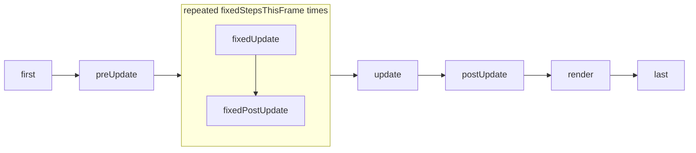

# Design 03: ECS Foundations

|                                       |                                                                                                                                                                                                                                                                                                                                                                     |
| ------------------------------------- | ------------------------------------------------------------------------------------------------------------------------------------------------------------------------------------------------------------------------------------------------------------------------------------------------------------------------------------------------------------------- |
| **Status**                            | Draft, for review (revised after solution review, §7)                                                                                                                                                                                                                                                                                                               |
| **Kind**                              | Feature and refactor                                                                                                                                                                                                                                                                                                                                                |
| **Engine version at time of writing** | `0.26.1`                                                                                                                                                                                                                                                                                                                                                            |
| **Program**                           | [Forge 3D](./README.md), milestone M1                                                                                                                                                                                                                                                                                                                               |
| **Related**                           | [04 Transforms](./04-transforms.md) (uses ticks, exclusions and stages), [06 Renderer and frame graph](./06-render-pipeline.md) and [14 Physics 3D](./14-physics-3d.md) (use declared queries, journals, singletons and the fixed step, including `fixedStepIndex`), [15 Audio, particles and picking](./15-audio-particles-and-picking-in-3d.md) (message streams) |

## 0. Targeted modules

| Path                                                                                                                                                                                                                                                                                        | Change   | Notes                                                                                                                                                                                            |
| ------------------------------------------------------------------------------------------------------------------------------------------------------------------------------------------------------------------------------------------------------------------------------------------- | -------- | ------------------------------------------------------------------------------------------------------------------------------------------------------------------------------------------------ |
| `src/ecs/ecs-world.ts`                                                                                                                                                                                                                                                                      | Modified | One internal path for every storage write; memberships; per-consumer results; journals; change ticks; singletons; stages; cached schedule; fixed-step loop                                       |
| `src/ecs/query-membership.ts` (new)                                                                                                                                                                                                                                                         | New      | The incrementally maintained set of entities matching one declared query                                                                                                                         |
| `src/ecs/ecs-system.ts`                                                                                                                                                                                                                                                                     | Modified | `without`, `queries`, `stage`; `QueryResult` gains `added`, `removed`, `lastRunTick`                                                                                                             |
| `src/ecs/stages.ts` (new)                                                                                                                                                                                                                                                                   | New      | The built-in stages                                                                                                                                                                              |
| `src/ecs/ecs-world.ts` start-of-tick logic                                                                                                                                                                                                                                                  | Removed  | Game-state groups become groups inside the `first` stage                                                                                                                                         |
| `src/common/time/Time.ts`                                                                                                                                                                                                                                                                   | Modified | Fixed-step accumulator; `deltaTimeInSeconds` is the fixed step inside the fixed stages; `fixedStepIndex`                                                                                         |
| `src/utilities/game.ts`, `create-game.ts`                                                                                                                                                                                                                                                   | Modified | The world takes its clock                                                                                                                                                                        |
| `src/input/**`                                                                                                                                                                                                                                                                              | Modified | Input manager as a singleton; stages; triggers latched for fixed steps                                                                                                                           |
| `src/states/**`                                                                                                                                                                                                                                                                             | Modified | State store in a component; groups inside `first`                                                                                                                                                |
| `src/text/systems/text-shaping-system.ts`, `src/ui/systems/ui-text-input-system.ts`                                                                                                                                                                                                         | Modified | Closure state moved to components (§6.5)                                                                                                                                                         |
| `src/rendering/systems/render-system.ts`, `src/rendering/utilities/resolve-instance-mask.ts`, `src/rendering/terrain/create-terrain-render-ecs-system.ts`, `src/ui/systems/ui-navigation-system.ts`, `ui-raycast-system.ts`, `ui-toggle-system.ts`, `src/ui/utilities/raycast-ui-canvas.ts` | Modified | Calls to `world.query` inside `update` become declared queries (§6.1.4); `raycastUiCanvas` takes the interactables' query result, which the text input's pointer handlers get from `world.query` |
| `documentation-site/src/pages/demos/game-states/_star.system.ts`, `space-shooter/_game-over.system.ts`                                                                                                                                                                                      | Modified | Declared queries instead of `world.query` inside `update` (§6.1.4)                                                                                                                               |
| Every engine system factory                                                                                                                                                                                                                                                                 | Modified | Declares its stage                                                                                                                                                                               |
| `documentation-site/docs/docs/ecs/`                                                                                                                                                                                                                                                         | Modified | `world.md`, `system.md`: declared queries, journals, ticks, stages, fixed step, singletons, what a system may keep                                                                               |
| `AGENTS.md`                                                                                                                                                                                                                                                                                 | Modified | "Architecture" and "System Pattern": the state rule (README §4.4), per-frame message streams, stages, change ticks                                                                               |

---

## 1. Summary

Three things in today's ECS stand between Forge and the 3D program's goals.

**Queries allocate every tick.** `EcsWorld.update` calls `query` for every
system (`ecs-world.ts`, `update`), and `query` builds a new entity array and
one new array per component key each time. Building the tick's group and
system order also allocates (`_getOrderedGroups`). With 50,000 renderables
and a dozen systems, that's megabytes of garbage per second before any game
logic runs. The fix is the standard one: systems **declare** every query
they read, the world keeps the matching set of entities up to date as
components are added and removed, and hands each system arrays it patches
with what changed rather than rebuilding them.

**There's no way to see what changed.** A renderer that keeps a GPU copy of
object data, or a physics engine that keeps a broad-phase tree, needs to
know which entities appeared and disappeared and which transforms moved.
This design adds **journals** (the entities that entered and left a query
since the system last ran) and **change ticks**, which advance with every
system run, so an owner can stamp what it changed and a reader can tell
whether the stamp is newer than its own last run.

**There's no frame structure.** Order is registration order in one default
group, and physics integrates with the variable frame delta. This design
adds built-in **stages** (`first`, `preUpdate`, `fixedUpdate`,
`fixedPostUpdate`, `update`, `postUpdate`, `render`, `last`) that contain
groups and systems, and a **fixed step**: the two fixed stages run zero or
more times per frame at a constant timestep, with the remainder exposed for
interpolation.

It also makes the state rule of README §4.4 concrete: **singleton
components** (`world.addSingleton`, `world.getSingleton`) for subsystem
state, and no state in system closures.

---

## 2. Scope

### In scope

- Declared queries: the primary `query`, named secondary `queries`, and
  `without` exclusions; allocation-free results patched from journals.
- One internal path for every storage write, so memberships can't miss a
  change.
- `added`/`removed` journals and per-run change ticks.
- Singleton components.
- The state rule, and moving the state today's systems keep in closures to
  where it belongs (or naming the design that does).
- Stages as containers of groups, a `stage` on systems, a cached schedule.
- The fixed step in `Time` and the world, and input that works inside it.

### Out of scope

- **Archetype storage.** Decision E1.
- **Generic value-change tracking** (knowing that game code wrote a field).
  Decision E3.
- **Running systems in parallel.** Declared queries would tell a scheduler
  which systems conflict, but JavaScript workers can't share component
  objects; that's a separate design if it's ever needed.
- **Deferred structural changes** (a command buffer). §6.1.4.
- **Moving 2D physics into the fixed step.** It needs interpolation, which
  design 14 adds for both physics engines.
- **Spatial audio state.** The sound system's tracked sounds move in
  design 15, which rewrites that system.

---

## 3. Phases

### Phase 1: Declared, cached queries

Replaces per-tick query scans with queries declared once and cached, so a
tick costs time proportional to what changed and allocates nothing.

| #   | Task                             | Description                                                                                                                                                                                                                                                                                                                                                                                    | Size |
| --- | -------------------------------- | ---------------------------------------------------------------------------------------------------------------------------------------------------------------------------------------------------------------------------------------------------------------------------------------------------------------------------------------------------------------------------------------------- | ---- |
| 1.1 | Single write path                | §6.1.1: `addComponent`, `addTag`, `removeComponent`, `removeEntity`, `setParent`, `removeParent` go through one internal add and one internal remove                                                                                                                                                                                                                                           | M    |
| 1.2 | Declarations                     | §6.1.2: `without` and named `queries` on `EcsSystem`, typed                                                                                                                                                                                                                                                                                                                                    | M    |
| 1.3 | Memberships                      | §6.1.3: one per distinct declaration, reference-counted by the systems that declare it                                                                                                                                                                                                                                                                                                         | M    |
| 1.4 | Per-system results               | §6.1.4: arrays patched from the system's journal before `update`                                                                                                                                                                                                                                                                                                                               | M    |
| 1.5 | Cached schedule                  | The ordered list of systems rebuilt only when systems or groups change, copied on write while a tick runs                                                                                                                                                                                                                                                                                      | S    |
| 1.6 | `world.query` and its callers    | §6.1.4: `world.query` stays uncached for code outside a system's `update`; every system that calls it inside `update` (the §6.1.4 table: the render, terrain render, UI navigation, UI raycast and UI toggle systems, and two docs-site demo systems) declares a secondary query instead; `raycastUiCanvas` takes the interactables' query result as a parameter, with a `#### Changed` bullet | M    |
| 1.7 | Equivalence tests and benchmarks | Random structural changes: results equal a brute-force scan; the design 01 ECS microbenchmarks; allocation allow-list entries removed                                                                                                                                                                                                                                                          | M    |

**Definition of done:** every existing test passes; a tick allocates
nothing in the ECS, with or without structural changes, once arrays have
grown to the scene's size; a membership refresh costs time proportional to
what changed; no engine or docs-site demo system calls `world.query` inside
`update` (§6.1.4).

### Phase 2: Journals and change ticks

Adds added and removed journals and change ticks, so a system can
process only the entities that changed.

| #   | Task                  | Description                                                                        | Size |
| --- | --------------------- | ---------------------------------------------------------------------------------- | ---- |
| 2.1 | `added` and `removed` | §6.2, with every edge case listed there tested                                     | M    |
| 2.2 | Change ticks          | §6.3: `world.changeTick` advances after each system run; `QueryResult.lastRunTick` | S    |
| 2.3 | Convention            | Owner-stamped `changedTick` in `AGENTS.md` and the system guide                    | S    |

**Definition of done:** a system that runs before a value's owner in the
same frame still sees the owner's stamp on its next run; journal tests pass.

### Phase 3: Singletons and the state rule

Adds singleton components and moves state kept in system closures into
components, so every value has one owner.

| #   | Task                       | Description                                                                                                                                                                                                                                                                                         | Size |
| --- | -------------------------- | --------------------------------------------------------------------------------------------------------------------------------------------------------------------------------------------------------------------------------------------------------------------------------------------------- | ---- |
| 3.1 | Singleton API              | §6.4                                                                                                                                                                                                                                                                                                | S    |
| 3.2 | Input manager, game states | `registerInputs` and `createGameState` keep their state in components                                                                                                                                                                                                                               | S    |
| 3.3 | Text shaping, text input   | Their closure state moves to components (§6.5); the text input's per-tick `new Set` goes, which removes its row from design 01 §6.3's allow-list                                                                                                                                                    | M    |
| 3.4 | Audit                      | Every remaining entry in §6.5 assigned to the design that moves it; `onRegister`'s documentation stops suggesting state                                                                                                                                                                             | S    |
| 3.5 | `AGENTS.md`                | The rule from README §4.4, what a system may keep, and per-frame message streams and single-consumer queues (§6.5) beside "one writer per value"                                                                                                                                                    | S    |
| 3.6 | Diagnostics                | README §4.6: `ForgeDiagnostic`, `Diagnostics` with `onWarning` and `onError`, deduplication by code and key, console output when nothing listens; `createGame` creates one and passes it to the world and services; unit tests for deduplication and for routing to a custom listener; `#### Added` | M    |

**Definition of done:** the §6.5 table has no entry without an owner; the
ones this design owns are moved.

### Phase 4: Stages

Adds built-in frame stages, so engine and game systems run in a fixed
order whatever order they were registered in.

| #   | Task              | Description                                                                                                         | Size |
| --- | ----------------- | ------------------------------------------------------------------------------------------------------------------- | ---- |
| 4.1 | Built-in stages   | §6.6: eight stages that contain groups; ordering only within a stage                                                | M    |
| 4.2 | `EcsSystem.stage` | Where `addSystem` puts a system with no `group`                                                                     | S    |
| 4.3 | Game states       | The transition, exit, scoped-removal and enter groups become groups in `first`; the start-of-tick rules are deleted | S    |
| 4.4 | Engine systems    | Every engine system declares its stage; guides, demos and e2e scenes stop ordering them by hand                     | M    |

**Definition of done:** every demo registers its systems in any order and
behaves the same, except one intended output change: rendering draws the
transforms of the frame it runs in, not the previous frame's (design 04
§6.7). A demo or e2e scene that registered rendering before the systems
that move entities therefore draws them one frame further on. No golden
changes (design 01 §6.4.2), and any e2e assertion this changes is updated
in the same pull request, which names the change. The guides' "register in
this order" lists are gone.

### Phase 5: Fixed step

Adds a fixed-step loop to `Time` and the world, with input latched per
fixed step.

| #   | Task                 | Description                                                                                                                                                                                                            | Size |
| --- | -------------------- | ---------------------------------------------------------------------------------------------------------------------------------------------------------------------------------------------------------------------- | ---- |
| 5.1 | `Time` accumulator   | §6.7: the step, steps this frame, interpolation alpha, `deltaTimeInSeconds` inside the fixed stages, `step(seconds)`                                                                                                   | S    |
| 5.2 | The world's clock    | `new EcsWorld(time)`; `createGame`, tests (through `createTestWorld()`), demos and e2e scenes migrated                                                                                                                 | M    |
| 5.3 | Fixed loop           | The fixed stages run `fixedStepsThisFrame` times per tick                                                                                                                                                              | S    |
| 5.4 | Input in fixed steps | §6.7.3: trigger actions latched for the fixed stages by the input module                                                                                                                                               | M    |
| 5.5 | Guides and changelog | "Fixed step" guide; `#### Added` and `#### Changed` entries for every API change in this design; the `#### Changed` entry also names Phase 4's rendering-order change (rendering draws the current frame's transforms) | S    |

**Definition of done:** a fixed system runs 60 times per simulated second at
frame rates from 20 to 240 fps; the first frame runs no catch-up steps; a
key pressed once is seen by exactly one fixed step, whether the frame ran
zero, one or several.

---

## 4. Decision log

| #   | Decision                                 | Options                                                                                                                                                                                                         | Chosen | Rationale, trade-offs, assumptions                                                                                                                                                                                                                                                                                                                                                                                                                                                                     |
| --- | ---------------------------------------- | --------------------------------------------------------------------------------------------------------------------------------------------------------------------------------------------------------------- | ------ | ------------------------------------------------------------------------------------------------------------------------------------------------------------------------------------------------------------------------------------------------------------------------------------------------------------------------------------------------------------------------------------------------------------------------------------------------------------------------------------------------------ |
| E1  | Storage                                  | (a) Keep sparse sets per component and cache query memberships; (b) archetype tables, as Bevy, Unity's entities package and flecs use                                                                           | (a)    | Archetypes pay off when components are stored inline, so iteration streams through contiguous memory. Forge's components are JavaScript objects, so an archetype table would be an array of pointers, much like a sparse set's dense array, while adding and removing a component (which particles and tags do constantly) would move the entity between tables. Hot loops that need contiguous numbers (culling, the solver) keep structure-of-arrays copies inside their subsystem (designs 06, 14). |
| E2  | How secondary queries are expressed      | (a) Systems declare them (`queries`), and the world owns their state; (b) the world caches `world.query` per calling system                                                                                     | (a)    | Bevy, flecs and Unity's entities package all declare queries, with query state owned by the framework. Guessing the caller from "the system currently running" is fragile: DOM events fired synchronously inside `update`, removal listeners and `onRegister` during a mid-tick `addSystem` would all be attributed to the wrong system. Declarations also make every system's data needs visible.                                                                                                     |
| E3  | Detecting value changes                  | (a) Track every write (proxies or setters); (b) systems mark changes by hand; (c) the owner of an output stamps it with the change tick, and owners detect changed inputs by comparing with what they last used | (c)    | JavaScript can't see a write to a plain object without a proxy, which slows every field access in every hot loop. Marking by hand is forgotten. The values that need change detection are outputs with one owner: the transform system knows when it changed a world transform, a material knows when `setUniform` ran. Bevy tracks every mutable access; this is the deviation, and the reason.                                                                                                       |
| E4  | Where subsystem state lives              | (a) Singleton components; (b) a separate resource store on the world                                                                                                                                            | (a)    | "State in components". A singleton is an ordinary component on its own entity, so it's inspected, scoped to a game state and removed like any other, with no second storage concept. Unity's entities package uses singleton components the same way, and Forge already does this informally for the input manager.                                                                                                                                                                                    |
| E5  | Fixed step                               | (a) A general fixed loop in the world, as Unity, Godot and Bevy have; (b) substepping inside physics only                                                                                                       | (a)    | Gameplay that applies forces, AI that ticks at a constant rate and both physics engines need the same step.                                                                                                                                                                                                                                                                                                                                                                                            |
| E6  | Step rate and the step cap               | (a) 60 Hz default, settable on `Time`; the existing delta clamp (`1/15 s`) caps steps at four per frame; (b) a separate maximum-steps setting                                                                   | (a)    | Games legitimately need different rates, so the rate is a setting. A separate cap would duplicate the clamp `Time` already applies, which exists to stop the same spiral. The first update, which `Time` doesn't clamp, adds nothing to the accumulator.                                                                                                                                                                                                                                               |
| E7  | How the world gets its clock             | (a) `new EcsWorld(time)`; (b) a step count passed to `update`; (c) the clock as a singleton component                                                                                                           | (a)    | The world needs the step count before it runs any stage, and the clock already exists as an object every game creates. (c) would change every system factory that takes `time`, for no gain. Trade-off: every `new EcsWorld()` in tests changes; `createTestWorld()` keeps that one line.                                                                                                                                                                                                              |
| E8  | Journal entries for short-lived entities | (a) An entity that entered and left between two runs appears in neither list; (b) it appears in both                                                                                                            | (a)    | Consumers use journals to create and destroy derived data (GPU slots, broad-phase proxies). Reporting an entity the consumer never saw makes it create and destroy something for nothing, and its handle is already dead.                                                                                                                                                                                                                                                                              |
| E9  | Stages                                   | (a) Eight stages that contain groups, with ordering only inside a stage; (b) stages as ordinary groups that others are ordered against                                                                          | (a)    | With (b), a group ordered only `after: update` can be sorted after `render`, and nothing stops a group landing inside the fixed span. Containment, as Bevy's schedules and Unity's system groups do, makes both impossible by construction, and lets the game-state groups be ordinary groups in `first` instead of the special start-of-tick rules.                                                                                                                                                   |
| E10 | Change tick granularity                  | (a) Advances with every system run, and each run is told its previous run's tick; (b) advances once per `update`                                                                                                | (a)    | With (b), a reader that runs before the owner in the same frame records the same tick the owner then stamps, and misses the change. Every fixed step in a frame would also share one tick. Bevy and Unity's entities package both version per system run. The world, not the system, remembers each system's last tick (state rule).                                                                                                                                                                   |
| E11 | Delta time inside the fixed stages       | (a) `deltaTimeInSeconds` returns the fixed step while the fixed stages run; (b) a separate `fixedDeltaTimeInSeconds`                                                                                            | (a)    | Unity and Bevy do (a). Systems that take `time` today move into the fixed step unchanged, and there's one name for "the delta of the tick I'm in".                                                                                                                                                                                                                                                                                                                                                     |
| E12 | Edge-triggered input in fixed steps      | (a) The input module latches triggers for the fixed stages and clears its own latch after the first step that sees them; (b) games copy input into intent components and clear them in fixed systems            | (a)    | (b) gives every intent two writers and, since `update` runs after the fixed stages, a frame of latency. Godot makes "just pressed" aware of physics frames the same way (a) does; one module owns the latch.                                                                                                                                                                                                                                                                                           |
| E13 | Exclusions                               | (a) `without` on declarations; (b) systems filter in their loops                                                                                                                                                | (a)    | Static transforms (design 04) and other "skip these" cases should cost nothing per frame, which only exclusion from the membership achieves. Bevy, flecs and Unity all have it.                                                                                                                                                                                                                                                                                                                        |

---

## 5. Open questions

1. **Order of query results.** Results follow membership order, which
   changes as entities are swapped out. Today's order isn't documented
   either. Options: (a) document the order as unspecified; (b) guarantee
   an order, such as entity id, by sorting results when membership
   changes. (a) costs nothing, since every system that needs an order
   sorts; (b) adds a sort to every membership change. Proposal: (a).

---

## 6. Design

### 6.1 Declared, cached queries

#### 6.1.1 One write path

Every change to component storage goes through one internal add and one
internal remove: `addComponent`, `addTag`, `removeComponent`,
`removeEntity`'s loop over the entity's components, and `setParent` /
`removeParent` (which write the `ParentEcsComponent`). Membership upkeep
and journals live in those two functions only, so no path can skip them.
Adding the same object, or a tag the entity already has, is not a change.

#### 6.1.2 Declarations

```ts
const meshExtraction: EcsSystem<
  [MeshEcsComponent, TransformEcsComponent],
  { lights: [PointLightEcsComponent, TransformEcsComponent] }
> = {
  stage: 'render',
  query: [meshId, transformId],
  without: [hiddenTag],
  queries: {
    lights: { query: [pointLightId, transformId] },
  },
  update(world, meshes, { lights }) {
    // meshes and lights are QueryResults
  },
};
```

`without` takes component or tag keys an entity must not have. `queries`
names secondary declarations, each with its own `query`, `tags` and
`without`. All of them are fixed when the system is created, like `query`
today.

#### 6.1.3 Memberships

A membership is the set of entities that match one declaration, kept in a
sparse set. The world indexes memberships by every key they mention. The
internal add and remove look up the memberships that mention the key and
add or remove the entity where its match changed. A membership exists while
at least one registered system declares it, and is dropped when the last
one is removed.

The cost moves from every tick to every structural change, and is
proportional to the number of memberships mentioning the key, which is
small.

#### 6.1.4 Results per system

Each system has its own `QueryResult` per declaration, with arrays the
world owns, an index from entity to position, and a pending journal. Before
calling `update`, the world applies the pending journal to the arrays:
entities that left are swapped out with the last element; entities that
entered are appended; replaced components are written in place. The cost is
proportional to what changed since the system last ran.

The contract changes from "new arrays built when the query runs" to:

> The arrays belong to the world and are reused. They don't change while
> the `update` that received them runs, even if that `update` adds or
> removes components. Don't keep them after `update` returns.

Every array in a `QueryResult` is typed read-only, columns included, so a
system can't sort or splice what the world will patch next tick; it sorts
a copy.

`world.query(keys, tags)` keeps today's behavior (new arrays, no journals)
for code that runs outside a system's `update`: setup code, `cleanup`, DOM
event handlers, functions game code calls, and tests. Inside `update`,
systems use declarations, so no tick calls it. The `0.26.1` callers outside
tests:

| Caller                                                                                           | Where it runs                                                                                            | After Phase 1                                                                                                                                                                                                   |
| ------------------------------------------------------------------------------------------------ | -------------------------------------------------------------------------------------------------------- | --------------------------------------------------------------------------------------------------------------------------------------------------------------------------------------------------------------- |
| `render-system.ts:602-607` (sprite and text queries)                                             | Every frame, in `update`                                                                                 | Secondary queries on `spriteId`, `positionId` and on `textId`, `textMeshId`, `positionId`                                                                                                                       |
| `resolve-instance-mask.ts:269` (`createInstanceMaskResolver`)                                    | Every frame, from the render system (`render-system.ts:647`)                                             | The render system declares a secondary query on `maskId` and passes it in                                                                                                                                       |
| `create-terrain-render-ecs-system.ts:97`                                                         | Every frame, in `update`                                                                                 | Secondary query on `terrainMeshId`                                                                                                                                                                              |
| `ui-navigation-system.ts:302`                                                                    | Every frame, in `update`                                                                                 | Secondary query on `uiInteractableId`, `rectTransformId`                                                                                                                                                        |
| `raycast-ui-canvas.ts:146`                                                                       | Every frame, once per canvas, from `ui-raycast-system.ts:37`; and from the text input's pointer handlers | Takes the interactables' `entities` and `components` as a parameter: the raycast system passes a secondary query on `uiInteractableId`, `rectTransformId`, and the pointer handlers pass `world.query`'s result |
| `ui-toggle-system.ts:35` (`clearOtherToggles`)                                                   | In `update`, on a frame where a grouped toggle turns on                                                  | Secondary query on `uiToggleId`, passed to `clearOtherToggles`                                                                                                                                                  |
| Docs-site demos `game-states/_star.system.ts:83` and `space-shooter/_game-over.system.ts:17, 21` | In `update`: every frame; on restart                                                                     | Secondary queries                                                                                                                                                                                               |
| `ui-text-input-system.ts:311` (`findFieldAt`)                                                    | DOM `pointerdown`, `mousedown` and `pointerup` handlers, outside any `update`                            | Unchanged: the field must be focused inside the browser's gesture handler for a phone keyboard to open, and a declared result is valid only during `update`                                                     |
| `bloom-system.ts:284`, `gaussian-blur-system.ts:290`, `_game-over.system.ts:39`                  | `cleanup`                                                                                                | Unchanged                                                                                                                                                                                                       |
| `physics/raycast/raycast.ts:117`, `apply-explosive-force.ts:35`                                  | Functions game code calls                                                                                | Unchanged                                                                                                                                                                                                       |

Design 07 deletes the render and terrain render systems (Phase 1) and the
mask resolver (Phase 3) in M2. They are converted here anyway, so from M1
no tick allocates in the ECS (README §7, M1).

Forge applies structural changes immediately, and keeps doing so: a
system's arrays are fixed for its `update`, while `getComponent`,
`isAlive` and later systems see changes at once, as today. Engines that
cache queries often defer changes to a sync point instead; Forge doesn't
need to, and deferring would change when every `removeEntity` takes
effect.

### 6.2 Journals

```ts
interface QueryResult<T extends readonly unknown[]> {
  readonly entities: readonly number[];
  readonly components: { readonly [K in keyof T]: readonly T[K][] };
  /** Entities that started matching since this system last ran. */
  readonly added: readonly number[];
  /** Entities that stopped matching since this system last ran. They may no longer be alive. */
  readonly removed: readonly number[];
  /** The change tick of this system's previous run, 0 on its first. */
  readonly lastRunTick: number;
}
```

Rules, each tested:

- An entity that entered and left between two runs appears in neither
  (decision E8).
- An entity that left and came back appears in `removed` and in `added`;
  process `removed` first.
- An entity whose component object was replaced appears in both, unless
  it entered since the last run, in which case it appears only in `added`.
- A system that didn't run (its `runIf` was false) gets everything since it
  last ran. Each entity appears at most once per list.
- On a system's first run, every member is in `added`.
- Removing a system discards its journals.

### 6.3 Change ticks

Each system run happens at its own tick: `world.changeTick` holds that
tick while the system's `update` runs, and advances by one when the run
ends. Outside any run (game code, DOM handlers, `onRegister`, between
`update` calls) the tick is therefore newer than every system's last run,
so a value stamped there is seen by every system on its next run, the last
one in the schedule included. This is Bevy's model: the world's tick is
always ahead of every system's `last_run`. (Advancing only before each run
left `world.changeTick` equal to the last system's `lastRunTick` after
`update`, so that system never saw a stamp written between ticks.) The tick
starts at 1, so a stamp written before the first `update` is newer than the
`0` every first run gets.

An owner that writes an output stamps it with the current tick, only when
the value actually changed:

```ts
transform.world.changedTick = world.changeTick;
```

A reader compares a stamp with its own previous run's tick, which the world
passes in (`QueryResult.lastRunTick`), so the reader keeps nothing:

```ts
if (transform.world.changedTick > meshes.lastRunTick) {
  /* moved since I last looked */
}
```

A system never sees its own stamps again (they equal its next
`lastRunTick`), and every other system sees each stamp exactly once.

Ticks and stamps are JavaScript numbers (doubles), exact up to 2^53, which
no game reaches. They must not be stored in a `Uint32Array` or another
32-bit field without wraparound-aware comparison: 2^32 runs is about 41
days at 60 frames per second with 20 systems, after which `>` reports old
stamps as new.

Derived caches outside systems (the GPU scene, design 06) record the stamp
they last consumed per item and compare for inequality.

### 6.4 Singleton components

```ts
const physics = world.addSingleton(
  physicsWorld3dId,
  createPhysicsWorld3d(options),
);
const physics = world.getSingleton(physicsWorld3dId); // in a system
```

- `addSingleton(key, value)` creates an entity, adds the component and
  returns it; it throws if an entity already has `key`.
- `getSingleton(key)` returns the component of the only entity with `key`
  in constant time, and throws if none or more than one has it.
- `tryGetSingleton(key)` returns `null` when none has it.

A singleton is an ordinary component: `removeEntity` removes it, a
`StateScopedEcsComponent` scopes it, declarations match it.

### 6.5 The state rule

README §4.4, applied to systems:

- A system's closure holds the services and configuration its factory
  received, and nothing written during one run that a later run reads.
- State a later run needs goes in a component: on the entities it's about,
  or in the subsystem's singleton.
- Derived caches of GPU, audio or DOM resources belong to the service that
  owns the resource.
- Scratch arrays fully written before being read each run may be kept to
  avoid allocating, on the service or singleton, never in module scope
  (module scope is shared by every world in the page).

Two named patterns sit beside "one writer per value".

- **Per-frame message streams.** A message stream is an append-only list
  on a singleton that several systems append to in one frame. No system
  edits or removes an entry another appended; one owning system clears it
  once per frame, before the writers run (once per fixed step for a
  stream written from the fixed stages, such as design 06's fixed-step
  debug buffer); readers run after the writers. A stream holds events of
  the frame (what was hit, what to draw), not a value with an owner, so
  many appenders don't make many writers of one value. Design 06's
  debug-draw shape buffers and design 15's `picking.hits` are message
  streams. Bevy's buffered messages work the same way.
- **Single-consumer queues.** Any system or module function appends; the
  one consumer reads and empties it each run (design 08's mesh change
  list, design 11's pending handle lists, design 12's requests and
  triggers). The consumer clears it, not an owner before the writers, so
  an entry waits however long it takes the consumer to run.

Design 12's pose pipeline is the one sanctioned exception to one writer per
value (README P6, design 12 AN11): pose sampling, then
`poseAdjustmentGroup`, write a pose target's `local` in a fixed order in
`postUpdate`, before transform propagation (§6.6.2). Design 12 records it in
`AGENTS.md` and `CLAUDE.md`.

The audit of `0.26.1`:

| Where                                                              | What                                                                                                                                                                                                        | Kind                                        | Moved by                                                                                                                                                                                                                            |
| ------------------------------------------------------------------ | ----------------------------------------------------------------------------------------------------------------------------------------------------------------------------------------------------------- | ------------------------------------------- | ----------------------------------------------------------------------------------------------------------------------------------------------------------------------------------------------------------------------------------- |
| `transform-system.ts`                                              | `frozen` (static entities already computed); `computed`                                                                                                                                                     | State; scratch                              | Design 04 (exclusion and a stamp on the component)                                                                                                                                                                                  |
| `render-system.ts` (module scope)                                  | Draw items, sort keys, command buffers, cleared destinations, the draw-order resolver, the instance staging buffer, the sprite renderables `WeakMap`                                                        | Scratch and GPU cache, shared across worlds | Design 07 (render context frame scratch)                                                                                                                                                                                            |
| `bloom-system.ts`, `gaussian-blur-system.ts`, `tone-map-system.ts` | Downsampled targets in `WeakMap`s; `processedTargetsThisFrame`                                                                                                                                              | GPU cache; scratch                          | Design 13 (frame graph transient targets)                                                                                                                                                                                           |
| Physics 2D factories                                               | `collisionPairs`, `collisionManifolds`, `contactConstraints` passed in                                                                                                                                      | State (warm starting) and scratch           | Design 14 (a 2D physics singleton)                                                                                                                                                                                                  |
| `sound-system.ts`                                                  | `trackedSounds` (playing sound per component), `updateCount`                                                                                                                                                | Audio cache; state                          | Design 15 (journals and the mixer)                                                                                                                                                                                                  |
| `text-shaping-system.ts`                                           | The last shaped snapshot per text, in a `WeakMap`                                                                                                                                                           | State                                       | This design (onto the text mesh component)                                                                                                                                                                                          |
| `ui-text-input-system.ts`                                          | Hidden inputs per field; caret blink state; the pressed field; the current world and container                                                                                                              | DOM cache; state                            | This design (caret and pressed field into components, the input elements owned by the text-entry service, which frees a removed field's element from the `removed` journal instead of the per-tick `new Set` that finds them today) |
| `register-inputs.ts`                                               | The input manager on an entity created by hand                                                                                                                                                              | State in a component already                | This design (`addSingleton`)                                                                                                                                                                                                        |
| `game-state.ts`, `state-transition-system.ts`                      | The transition store shared by the `GameState` handle and its systems; the transition system's closure `isFirstTick` (`state-transition-system.ts:27`), which decides whether the first tick sets `entered` | State games read; state                     | This design (a component on the state's own entity; the handle reads it; `isFirstTick` becomes a `hasEntered` field on it, written only by the transition system)                                                                   |

Phase 3 repeats the search with closure-level `let`, `Map`, `Set`,
`WeakMap` and typed arrays in every system factory, not only module scope,
and adds what it finds:

| Where                                                              | What                                                                       | Kind                          | Moved by                                                      |
| ------------------------------------------------------------------ | -------------------------------------------------------------------------- | ----------------------------- | ------------------------------------------------------------- |
| `render-system.ts` (factory closure)                               | `resources`: the sprite and text renderables, created on the first run     | GPU cache                     | Design 07 (deletes the render system)                         |
| `present-system.ts`                                                | The present material, created by the factory                               | GPU resource                  | Design 07 (deletes the present system for design 06's output) |
| `bloom-system.ts`, `gaussian-blur-system.ts`, `tone-map-system.ts` | Their materials, created by the factory                                    | GPU resources                 | Design 13 (post-processing passes on the frame graph)         |
| `draw-order.ts` (module scope)                                     | `digitCounts`, the radix sort's counting scratch used by the render system | Scratch, shared across worlds | Design 07 (render context frame scratch)                      |

Phase 3 moved the four rows this design owns. The text-input row's input
elements belong to a `TextEntryService` (`createTextEntryService(container)`
in the input module), which `createTextInput` creates each field's entry
through, keyed by the field's entity, and which `registerUiSystems` passes
to the text input system (the system is registered only when it gets one).
The service also holds the system's DOM listeners on the container. The
`UiTextInputStateEcsComponent` singleton keeps only the pressed field.

The system releases entries from its journals, not by rebuilding a set of
live fields every tick:

- `removed`: a field that stopped matching releases its entry, unless it's
  still a field with the same entry (it lost another component, or left and
  came back); then it's unclaimed.
- `added`: the system claims the field's entry.
- The service's unclaimed owners (entries created since the last run, and
  unclaimed ones) are checked every run, and an entry whose field is gone
  is released. This covers a field created and removed between two runs,
  which neither journal reports (E8), so its hidden input doesn't leak.

`cleanup` releases every entry and listener.

### 6.6 Stages

#### 6.6.1 The frame



`world.stages` holds the eight stages, in this fixed order. A stage
contains groups; `addSystemGroup(group, { stage, before, after })` places a
group in a stage and orders it only against groups in the same stage. A
system with no `group` goes into its stage's default group. This replaces
`firstSystemGroup` and `defaultSystemGroup` (now `stages.update`'s default
group), and the start-of-tick rules: a game state's transition, exit,
scoped-removal and enter groups are ordinary groups in `first`.

The flattened schedule is cached and rebuilt only when systems or groups
are added or removed. A change made while a tick runs takes effect next
tick, as today, by rebuilding into a new list rather than editing the one
being iterated.

Design 01's opt-in system timer (`world.profiler`, design 01 task 2.7)
keeps working through the rewrite: it times each system and group of the
flattened schedule, and its arrays are rebuilt with the schedule, so a
disabled timer still costs one check per system per tick.

#### 6.6.2 What runs where

| Stage             | Engine systems                                                                                                                                                                                                                                                                                                                                                            |
| ----------------- | ------------------------------------------------------------------------------------------------------------------------------------------------------------------------------------------------------------------------------------------------------------------------------------------------------------------------------------------------------------------------- |
| `first`           | Game state transitions, exit, scoped removal, enter                                                                                                                                                                                                                                                                                                                       |
| `preUpdate`       | Input update; picking: pointer rays, hit testers and the pointer interaction system; UI input (navigation, toggles, sliders, scroll views) in `uiInputGroup` (design 15). No audio system: the mixer unlocks audio itself, from DOM gesture listeners (`src/audio/sound-mixer.ts`)                                                                                        |
| `fixedUpdate`     | The game's fixed systems (forces, character movement)                                                                                                                                                                                                                                                                                                                     |
| `fixedPostUpdate` | 2D and 3D physics (design 14); the input module's fixed-step latch reset (last)                                                                                                                                                                                                                                                                                           |
| `update`          | Game logic (the default); lifecycle and timers                                                                                                                                                                                                                                                                                                                            |
| `postUpdate`      | In order: physics pose write-back and interpolation (`physicsWriteBackGroup`, design 14); animation (`animationGroup`, then `poseAdjustmentGroup`, design 12); UI layout; transform propagation (`transformPropagationGroup`, design 04); camera controllers and follow (design 06); the sound system (`audioGroup`) and particle simulation (`particleGroup`), design 15 |
| `render`          | Extraction, the renderer system (design 06)                                                                                                                                                                                                                                                                                                                               |
| `last`            | Input reset; debug-draw frame buffer clear (design 06 §6.9); asset collection (design 11 GA2)                                                                                                                                                                                                                                                                             |

`EcsSystem.stage` names a stage. Engine factories set it, so the order in
which a game calls `addSystem` doesn't matter. A game can pass `group` to
place a system elsewhere, and orders systems within a group with
`before`/`after`.

### 6.7 The fixed step

#### 6.7.1 `Time`

| Member                              | Meaning                                                                                                                          |
| ----------------------------------- | -------------------------------------------------------------------------------------------------------------------------------- |
| `fixedTimestepInSeconds` (settable) | The step, default `1 / 60`                                                                                                       |
| `fixedStepsThisFrame`               | How many times the fixed stages run this frame                                                                                   |
| `fixedStepIndex`                    | The 0-based index of the running fixed step within the frame, `0` to `fixedStepsThisFrame − 1`; meaningful while `isInFixedStep` |
| `fixedInterpolationAlpha`           | The leftover fraction of a step, in `[0, 1)`, for interpolating presentation between the last two steps                          |
| `deltaTimeInSeconds`                | Inside the fixed stages, the fixed step; elsewhere, the frame delta, as today                                                    |
| `isInFixedStep`                     | Whether the fixed stages are running                                                                                             |
| `step(seconds)`                     | Advances the clock by an exact amount, for tests and the e2e harness                                                             |

Each `update(now)` after the first adds the scaled, clamped frame delta to
an accumulator, takes as many whole steps as fit, and keeps the remainder.
The first update only seeds the clock (it's the page's age, unclamped
today, and must not become thousands of steps). `timeScale` changes how
fast simulated time accumulates, not the step. The existing clamp caps a
frame at four 60 Hz steps.

The world keeps the clock it was created with as `world.time` (read-only,
decision E7). Engine `register*` functions read it there, so none of them
takes a `time` parameter (`registerAnimation(world)`,
`registerPhysics2d(world, settings)`, `registerAudio(world, mixer)`,
`registerParticles(world, renderContext, random)`).

#### 6.7.2 The loop

The world runs `fixedUpdate` then `fixedPostUpdate`,
`time.fixedStepsThisFrame` times, between `preUpdate` and `update`, setting
`time.isInFixedStep` around the span and `time.fixedStepIndex` before each
step. Design 14 uses `fixedStepsThisFrame − fixedStepIndex` to spread an
animated body's per-frame motion over the frame's remaining steps.

#### 6.7.3 Input

Input updates once per frame, in `preUpdate`. Axes and holds are current
values and read the same anywhere. A trigger ("pressed this frame") would
be missed by a frame with no fixed steps and seen twice by a frame with
two, so the input module also latches each trigger for the fixed stages:
inside them, `isTriggered` reports a trigger that happened since the
previous fixed step, and the input module's own system at the end of
`fixedPostUpdate` clears the latch after the first step that ran. The input
module is the latch's only writer, and fixed systems read input with no
frame of delay.

### 6.8 Performance

- No allocation in the ECS on any tick, once arrays have grown to the
  scene's size: a still tick, and churn that adds about as many entities to
  each result as it removes. Results are patched by index and each array's
  length is set once per run, so leaving and entering in the same run never
  shrinks the storage; empty journals are one shared frozen array, so the
  arrays behind `added` and `removed` keep their storage across quiet runs;
  the free-handle queue is a ring; hot loops use indices, not iterators.
- The limit, without changing `QueryResult`: V8 gives an array's storage
  back when its length drops below about half of its capacity (all of it at
  length 0) and allocates when it regrows. A result or journal that shrinks
  that far (a scene that empties, or a burst of changes followed by a
  smaller one) allocates in proportion to the growth when it grows back.
  Removing that too needs a different `QueryResult` shape (a count beside
  fixed-capacity arrays, or typed-array views), which is a product decision.
- A structural change costs `O(memberships mentioning the key)`; patching a
  system's arrays costs `O(entities that entered or left)`.
- Microbenchmarks (design 01): 100,000 entities, 20 systems with
  overlapping declarations, for a still tick, 1% churn, 1% churn every
  other tick and full churn, with the heap each scene holds and the bytes
  each tick allocates (`src/ecs/ecs-world.bench.ts`).

### 6.9 Testing

- Equivalence: seeded random sequences of create, add, add-same, replace,
  tag, untag, set and remove parent, remove and remove-entity; after each
  `update`, every system's arrays equal a brute-force scan of its
  declaration, as sets.
- Contract: arrays don't change during `update`; a system added or removed
  mid-tick takes effect next tick.
- Journals: every rule in §6.2.
- Change ticks: a reader before and after the owner in the same frame,
  across fixed steps, and after a skipped run.
- Singletons: add twice throws; get with none or two throws; removal.
- Game state: `hasEntered` is written only by the transition system; a
  state registered again after its systems' `cleanup` raises `entered` on
  its first tick.
- Stages: systems registered in random order run in stage order; the
  engine's `register*` functions, called in every order, give the same
  schedule; a group can't be ordered against a group in another stage.
- Fixed step: steps per simulated second at several frame rates, the
  first frame, the cap, `timeScale`, alpha, `deltaTimeInSeconds` inside and
  outside the span, `fixedStepIndex` counting `0` to
  `fixedStepsThisFrame − 1` within a frame, triggers seen once.
- Allocation specs (design 01 task 1.5: the sprite, text, UI and particle
  stress scenes): no ECS allocations.

---

## 7. Review

`solution-reviewer` verdict on the first draft: **REVISE**. The direction
(cached memberships, journals, singletons, stages, a fixed step) matched
Bevy, Unity's entities package and Godot; the specifics had holes. Changes
made:

- Change ticks advance per system run with the previous run's tick passed
  in, instead of per `update`, which missed changes stamped later in the
  same frame (E10).
- Results are patched from journals in time proportional to the change,
  not refilled, and the tick's schedule is cached; the first draft's
  "no allocation" claim was false while `_getOrderedGroups` allocated.
- Every storage write goes through one path; `addTag`, `setParent`,
  `removeParent` and `removeEntity`'s loop had been missed.
- Secondary queries are declared (E2), instead of caching `world.query`
  per running system.
- Stages contain groups (E9), which also replaces the start-of-tick rules.
- The fixed step ignores the first, unclamped update; `deltaTimeInSeconds`
  is the step inside the fixed stages (E11).
- Fixed-step input is latched by the input module (E12) instead of intent
  components with two writers.
- Journal edge cases (replacement of an unseen entity, re-adding the same
  object, removed systems) are specified.
- The state audit covers the sound, text-shaping and text-input systems
  and the post-processing systems' per-frame sets, and the game-state store
  moves into a component like the input manager.
