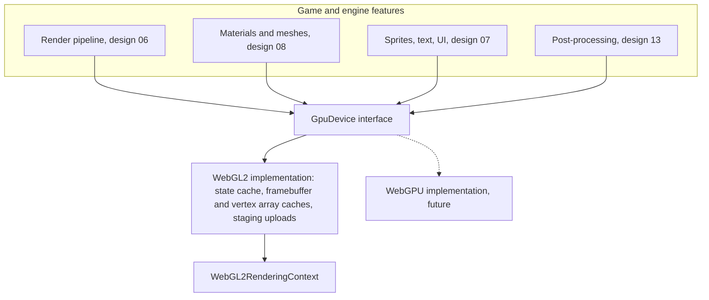

# Design 05: GPU Device Layer

|                                       |                                                                                                                                                                                                                                                                                                                                                                                                                                                                                                                                                                                                                                                                                                                               |
| ------------------------------------- | ----------------------------------------------------------------------------------------------------------------------------------------------------------------------------------------------------------------------------------------------------------------------------------------------------------------------------------------------------------------------------------------------------------------------------------------------------------------------------------------------------------------------------------------------------------------------------------------------------------------------------------------------------------------------------------------------------------------------------- |
| **Status**                            | Draft, for review (revised after solution review, §7)                                                                                                                                                                                                                                                                                                                                                                                                                                                                                                                                                                                                                                                                         |
| **Kind**                              | Feature and internal rewrite                                                                                                                                                                                                                                                                                                                                                                                                                                                                                                                                                                                                                                                                                                  |
| **Engine version at time of writing** | `0.26.1`                                                                                                                                                                                                                                                                                                                                                                                                                                                                                                                                                                                                                                                                                                                      |
| **Program**                           | [Forge 3D](./README.md), milestone M2                                                                                                                                                                                                                                                                                                                                                                                                                                                                                                                                                                                                                                                                                         |
| **Depends on**                        | Nothing in this program; lands before [06 Render pipeline](./06-render-pipeline.md)                                                                                                                                                                                                                                                                                                                                                                                                                                                                                                                                                                                                                                           |
| **Related**                           | [07 2D on the render pipeline](./07-2d-on-the-render-pipeline.md) (instance locations, the mask table), [08 Meshes, materials and shaders](./08-meshes-materials-and-shaders.md) (bind groups, shader variants, material blocks built in Phase 3), [09 Lighting](./09-lighting-and-shadows.md) and [10 PBR](./10-pbr-and-environment-lighting.md) (engine texture units, the restore notification), [11 glTF and asset lifetime](./11-gltf-and-asset-lifetime.md) (asynchronous restore, samplers, integer vertex formats), [12 Animation](./12-skeletal-and-morph-animation.md) (the second joint set), [13 Post-processing](./13-post-processing-and-anti-aliasing.md) (MSAA resolve, alpha-to-coverage, the readback slot) |

## 0. Targeted modules

| Path                                                                                          | Change   | Notes                                                                                                                                                                                                                                                             |
| --------------------------------------------------------------------------------------------- | -------- | ----------------------------------------------------------------------------------------------------------------------------------------------------------------------------------------------------------------------------------------------------------------- |
| `src/rendering/device/` (new)                                                                 | New      | `GpuDevice`, buffers, textures, samplers, pipelines, bind groups, render passes, state cache, capabilities, counters                                                                                                                                              |
| `src/rendering/render-context.ts`                                                             | Modified | Creates and owns the device; extensions and limits move to `device.capabilities`; `clearStrategy` removed in design 06                                                                                                                                            |
| `src/rendering/gpu-resource-registry.ts`                                                      | Modified | Becomes the device's registry of every GL object it created                                                                                                                                                                                                       |
| `src/rendering/texture.ts`, `owned-texture.ts`, `texture-cache.ts`                            | Modified | `Texture` wraps a `GpuTexture` and a `GpuSampler`; `withSampler`; sampler options replace `filter` and `wrap`; mipmaps, color space, cube, array and compressed formats                                                                                           |
| `src/rendering/render-target.ts`, `ping-pong-target.ts`                                       | Modified | Built on device textures; depth attachments and MSAA                                                                                                                                                                                                              |
| `src/rendering/geometry/geometry.ts`                                                          | Modified | Built on device buffers; replaced by meshes in design 08                                                                                                                                                                                                          |
| `src/rendering/materials/shader-program.ts`, `material.ts`                                    | Modified | Programs linked by the device; uniform blocks bound through bind groups; material blocks generated from loose uniforms (design 08 §6.3, task 3.5)                                                                                                                 |
| `src/rendering/shaders/pre-processing/`                                                       | Modified | Material block generation: explicit precision, struct and macro resolution, literal sizes, placement (design 08 §6.3.2)                                                                                                                                           |
| `src/rendering/fullscreen-pass.ts`, `systems/*`, `terrain/*`, `src/text/rendering/*`          | Modified | Draw through a render pass encoder instead of raw GL                                                                                                                                                                                                              |
| `e2e/fixtures/scenes/material-uniform-array.ts`, `material-unused-uniform.ts` and their specs | Modified | Read the material block back with `getBufferSubData` and the driver's `getActiveUniforms` offsets (task 3.5); their images don't change                                                                                                                           |
| `AGENTS.md`                                                                                   | Modified | "GPU Resources and Context Loss": `isContextLost` stays true until asynchronous restore sources finish, and `onContextRestored` is raised after the whole restore (§6.10); "Test Conventions": the `Material` mock paragraph describes material blocks (task 3.5) |
| `documentation-site/docs/docs/rendering/`                                                     | Modified | `textures.md` (formats, mipmaps, color space, sampler options), `context-loss.md`, `material-uniforms.md` (rewritten for blocks, task 3.5), a new `gpu-device.md` for custom passes                                                                               |

---

## 1. Summary

Forge's rendering code calls WebGL2 directly from wherever it draws: the
render system, the present system, each post-processing system, the
terrain system, the text renderer and the full-screen pass helper. Each
binds what it needs and leaves its bindings behind for the next (they do
disable blending when they finish). There is no state tracking, no uniform
buffers, no depth buffer, no MSAA target, no mipmaps and one texture type.
GPU objects survive context loss because each wrapper rebuilds itself.

3D rendering needs all of the missing pieces, and the product owner's
decision (README P1) needs the code shaped so a WebGPU backend can be
added later. This design puts one layer between Forge and WebGL2: a
**GPU device** with WebGPU's object model (buffers, textures, samplers,
render pipelines, bind groups, render passes), implemented on WebGL2.

The layer:

- tracks GL state and only issues calls that change it;
- binds per-frame, per-view, per-material and per-draw data as uniform
  buffer ranges in four fixed bind groups, as WebGPU does;
- budgets texture units per shader stage against the device's limits;
- has depth and stencil, MSAA with resolves, sRGB and float formats,
  mipmaps, cube and array textures, and compressed formats;
- compiles shaders in parallel where the browser allows it;
- owns every GL object, so context-loss recovery is one generic mechanism;
- counts draw calls, triangles, binds and uploads for the benchmarks.

Everything above it (the render pipeline, materials, sprites, post
effects) uses only the device's interface. A WebGPU backend is then a
second implementation of that interface.

---

## 2. Scope

### In scope

- The device interface and its WebGL2 implementation (§6.2 to §6.8).
- Capabilities and limits (§6.9), including the float color buffers lit 3D
  requires.
- Porting every existing GL call site onto the device, keeping today's 2D
  output identical.
- Context loss handled by the device for all resources.
- Counters and GPU timing for design 01.

### Out of scope

- **The WebGPU backend.** A later design (README open question 4).
- **Compute shaders and storage buffers.** WebGL2 has neither.
- **Command recording on WebGL2.** Decision D2.
- **Occlusion queries for culling.** They need a frame of latency and a
  fallback; a culling design of its own.
- **Multiview rendering (WebXR).** Not requested.
- **An LDR path for lit 3D.** Decided with the product owner: lit 3D and
  HDR effects require a float or half-float color buffer (§6.9); 2D doesn't.

---

## 3. Phases

### Phase 1: Device core and state cache

Adds capabilities, the state cache, buffers, textures and samplers, which
every later phase draws through.

| #   | Task                     | Description                                                                                | Size |
| --- | ------------------------ | ------------------------------------------------------------------------------------------ | ---- |
| 1.1 | Capabilities and limits  | §6.9: extensions requested once, limits and per-format sample counts read once             | S    |
| 1.2 | State cache              | §6.7: every piece of GL state the engine touches, behind setters that skip redundant calls | M    |
| 1.3 | Buffers                  | §6.3: vertex, index and uniform buffers; per-frame staging and upload                      | M    |
| 1.4 | Textures and samplers    | §6.4: formats, dimensions, immutable storage, uploads, mipmaps, sampler objects            | L    |
| 1.5 | Recording GL test helper | Design 01 §6.1                                                                             | S    |
| 1.6 | Changelog                | `#### Added`: `renderContext.device`, its capabilities, buffers, textures and samplers     | S    |

**Definition of done:** unit tests show no redundant GL calls for repeated
state; every format in §6.4 creates, uploads and samples in the browser
test.

### Phase 2: Pipelines, bind groups and passes

Adds render pipelines, bind groups and render passes, shaped after
WebGPU, and an encoder that records draws through them.

| #   | Task             | Description                                                                                       | Size |
| --- | ---------------- | ------------------------------------------------------------------------------------------------- | ---- |
| 2.1 | Render pipelines | §6.5: program, fixed attribute locations, primitive, depth-stencil, blend and multisample state   | M    |
| 2.2 | Bind groups      | §6.6: four groups; uniform blocks and samplers bound once at link time; per-stage texture budgets | M    |
| 2.3 | Render passes    | §6.8: attachments, load and store operations, clears, MSAA resolve, invalidation                  | M    |
| 2.4 | Pass encoder     | `setPipeline`, `setBindGroup`, `setVertexBuffer`, `setIndexBuffer`, draws, viewport, scissor      | M    |
| 2.5 | Changelog        | `#### Added`: render pipelines, bind groups, render passes and the pass encoder                   | S    |

**Definition of done:** a test pass draws an indexed, depth-tested,
MSAA-resolved mesh into a texture through the encoder only.

### Phase 3: Port the 2D renderer

Moves today's 2D renderer onto the device with no change in output, so
nothing outside the device layer calls `gl`.

| #   | Task            | Description                                                                                                                                                                                                                                                                                                                                                                                                                                               | Size |
| --- | --------------- | --------------------------------------------------------------------------------------------------------------------------------------------------------------------------------------------------------------------------------------------------------------------------------------------------------------------------------------------------------------------------------------------------------------------------------------------------------- | ---- |
| 3.1 | Resources       | `Texture`, `RenderTarget`, `PingPongTarget`, `Geometry`, `ShaderProgram`, `Material` on device objects                                                                                                                                                                                                                                                                                                                                                    | L    |
| 3.2 | Draw sites      | The render system, present, bloom, blur, tone mapping, terrain, text and full-screen passes draw through passes and encoders                                                                                                                                                                                                                                                                                                                              | L    |
| 3.3 | Context loss    | §6.10: the device rebuilds everything, waits for asynchronous restore sources, then raises one restore notification; per-wrapper rebuild code deleted                                                                                                                                                                                                                                                                                                     | M    |
| 3.4 | Escape hatch    | `renderContext.gl` stays, with `device.resetState()` for game code that calls GL directly                                                                                                                                                                                                                                                                                                                                                                 | S    |
| 3.5 | Material blocks | Design 08 §6.3: block generation with explicit `highp`, struct and macro resolution, literal sizes and placement; std140 scatter in `setUniform`, with copy semantics; shared block buffers with CPU mirrors; `SpriteMaterial` and today's custom-material demos on blocks; the `material-uniform-array` and `material-unused-uniform` scenes and specs rewritten to read the block back; `material-uniforms.md`; `AGENTS.md`'s `Material` mock paragraph | L    |

The canvas keeps its current context attributes (`antialias: true`) in
this phase: 2D still draws into it directly until design 06 Phase 2 adds
the output pass and offscreen MSAA (§6.11).

**Definition of done:** every e2e spec and golden passes with no changed
images (the `material-uniform-array` and `material-unused-uniform` scenes
are rewritten to read the material block, and their images don't change);
nothing outside `src/rendering/device` calls `gl` directly except the
documented escape hatch; B7 is no slower than the baseline.

Uploads stop color-converting in this phase (§6.4), which changes images
that carry color chunks. The e2e fixtures load only
`assets/fonts/default/default.png`, which has none, so no golden changes.
About 1,500 demo and docs-site PNGs (the Kenney packs) carry `gAMA` 1/2.2
and 14 carry `cHRM`; browsers converted those on upload and no longer do,
so those demos' sprites change slightly. The phase's changelog says so.

### Phase 4: Parallel compilation, readback and profiling

Adds asynchronous shader compilation and readback, and GPU counters and
timing for the benchmark runner.

| #   | Task                     | Description                                                                                                                                                                                                                         | Size |
| --- | ------------------------ | ----------------------------------------------------------------------------------------------------------------------------------------------------------------------------------------------------------------------------------- | ---- |
| 4.1 | Asynchronous pipelines   | `createRenderPipelineAsync` with `KHR_parallel_shader_compile`; link-time binding deferred until completion; errors mapped to source lines                                                                                          | M    |
| 4.2 | Asynchronous readback    | §6.13: `readTextureAsync` through a pixel buffer and a fence, polled on a timer when no frame runs; a reusable readback slot without a promise per read. Users: tests, environment harmonics (design 10), auto exposure (design 13) | S    |
| 4.3 | Counters and GPU timing  | §6.12, with resident bytes and resource counts per kind                                                                                                                                                                             | S    |
| 4.4 | Guide                    | `gpu-device.md`: resources, passes and encoders for custom passes; the escape hatch                                                                                                                                                 | M    |
| 4.5 | `pipeline-compile` scene | An e2e scene that creates 50 distinct programs behind an awaited load, built with the device only                                                                                                                                   | S    |
| 4.6 | Changelog                | `#### Added`: `createRenderPipelineAsync`, `readTextureAsync` and readback slots, device counters (resident bytes included) and the GPU profiler                                                                                    | S    |

**Definition of done:** in the `pipeline-compile` scene, no synchronous
`LINK_STATUS` query runs in the frame path (recording-GL counters) and no
frame after loading is longer than 16.7 ms (Long Tasks API); counters
feed the design 01 runner. The same check in B5 is design 08 Phase 4's.

---

## 4. Decision log

| #   | Decision                                      | Options                                                                                                                                                                               | Chosen                              | Rationale, trade-offs, assumptions                                                                                                                                                                                                                                                                                                                                                                                                                                                                                                                                                        |
| --- | --------------------------------------------- | ------------------------------------------------------------------------------------------------------------------------------------------------------------------------------------- | ----------------------------------- | ----------------------------------------------------------------------------------------------------------------------------------------------------------------------------------------------------------------------------------------------------------------------------------------------------------------------------------------------------------------------------------------------------------------------------------------------------------------------------------------------------------------------------------------------------------------------------------------- |
| D1  | Shape of the layer                            | (a) WebGPU's object model on WebGL2; (b) a thin wrapper of GL calls; (c) no layer, a state cache only                                                                                 | (a)                                 | README P1. Pipelines and bind groups are also how fast WebGL2 renderers are structured anyway (PlayCanvas and Filament do this): state grouped by how often it changes, uniform data in buffers. (b) and (c) would leave a WebGPU backend needing a rewrite of everything above them.                                                                                                                                                                                                                                                                                                     |
| D2  | Recording commands                            | (a) Encoders execute immediately on WebGL2; (b) record a command list, then replay                                                                                                    | (a)                                 | Recording on WebGL2 adds a copy of every command and buys nothing, since the browser already queues GL calls. The encoder's interface is the same either way, so the WebGPU backend records natively.                                                                                                                                                                                                                                                                                                                                                                                     |
| D3  | Uniform data                                  | (a) Uniform buffers (std140) for all engine data; loose uniforms only inside material blocks; (b) loose `uniform*` calls per draw                                                     | (a)                                 | One `bindBufferRange` replaces dozens of uniform calls, data that changes once per frame or view is uploaded once, and WebGPU has no loose uniforms. Design 08 turns a material's declared loose uniforms into its block, so custom shaders keep declaring uniforms the way they do today.                                                                                                                                                                                                                                                                                                |
| D4  | Bind group slots                              | (a) Four fixed groups: frame, view, material, draw; (b) free-form                                                                                                                     | (a)                                 | Four is WebGPU's guaranteed minimum. Grouping by update frequency means a draw that changes only per-draw data rebinds only group 3. Fixed slots let engine shader includes declare frame and view data once. The view group is bound once per view, except the ambient-occlusion unit, which is rebound for the transmissive phase (design 10's scene-color copy) and the transparent phase (design 15's `sceneDepth`), since no variant reads two of those textures.                                                                                                                    |
| D5  | Format names                                  | (a) WebGPU's format names (`rgba8unorm-srgb`, `depth24plus`); (b) GL enums; (c) Forge's own names                                                                                     | (a)                                 | Precise, documented and portable to the future backend. The existing `RENDER_TARGET_FORMAT` (`ldr`/`hdr`) maps onto `rgba8unorm` and `rgba16float`.                                                                                                                                                                                                                                                                                                                                                                                                                                       |
| D6  | MSAA                                          | (a) Multisampled renderbuffers resolved with `blitFramebuffer` into a texture of the same format; (b) the canvas's own antialiasing                                                   | (a)                                 | WebGL2 can't sample a multisampled texture, so offscreen MSAA must be renderbuffers plus a resolve, which requires matching formats. The canvas's antialiasing only applies to drawing straight into the canvas, which a linear, HDR pipeline doesn't do (design 06). The device hides the renderbuffer behind a texture with `sampleCount > 1`, as WebGPU does.                                                                                                                                                                                                                          |
| D7  | Direct GL access                              | (a) Keep `renderContext.gl`, with `device.resetState()` after direct calls; (b) remove it                                                                                             | (a)                                 | Games and tests sometimes need raw GL (a custom extension, a debugging read). Documented as WebGL-only, and as unavailable on a future WebGPU backend.                                                                                                                                                                                                                                                                                                                                                                                                                                    |
| D8  | Validation                                    | (a) Validate when pipelines, bind groups and passes are created; (b) also validate every draw                                                                                         | (a)                                 | Creation-time checks (attachment formats match the pipeline, layouts match, sizes fit limits, alpha-to-coverage only with an alpha target at location 0) catch the same mistakes at no per-draw cost. They include WebGPU's rules that WebGL2 doesn't enforce, so a mistake shows before the WebGPU backend exists. GL errors are only read after compiling and linking, never in the draw path (`getError` stalls).                                                                                                                                                                      |
| D9  | Per-frame dynamic data                        | (a) Written into CPU-side staging arrays during the frame and uploaded with one `bufferSubData` per buffer before the passes that read them; (b) a ring of buffer regions with fences | (a)                                 | `bufferSubData` is already correct when the GPU is still reading earlier contents (the driver handles it), and WebGPU's `writeBuffer` has the same guarantee. Fences and a growing ring add complexity for no correctness gain. One upload per buffer per frame keeps the call count low.                                                                                                                                                                                                                                                                                                 |
| D10 | Attribute locations                           | (a) A fixed table of locations per vertex semantic, bound before linking; (b) matched by name per pipeline                                                                            | (a)                                 | WebGPU uses numbered locations, and a fixed table means one vertex array layout serves every pipeline that reads the same mesh. Shaders still don't need `layout(location)` qualifiers: the device calls `bindAttribLocation` from the table.                                                                                                                                                                                                                                                                                                                                             |
| D11 | Lit 3D on devices without float color buffers | (a) Require `EXT_color_buffer_float` or `EXT_color_buffer_half_float` for HDR views, with a clear error; (b) an LDR shading path that tone maps in every material                     | (a), decided with the product owner | One shading path to build, test and keep fast. Nearly every WebGL2 device has one of the extensions. Creating an HDR view on a device without one throws; `lighting()` itself throws when created on such a device, since it renders the BRDF lookup table into `rgba16float` (design 10 §6.8.5). 2D views render to 8-bit sRGB targets and are unaffected. Design 13 asks to extend the requirement to 2D cameras with bloom, tone mapping or auto exposure, which need an HDR view (its PP29 and open question 1); that amendment waits for the product owner (README open question 1). |

---

## 5. Open questions

1. **Long-term status of `renderContext.gl`.** Options: (a) keep it, marked
   WebGL-only; (b) remove it when the WebGPU backend lands. Proposal: decide
   in the WebGPU design.

---

## 6. Design

### 6.1 How it fits



`RenderContext` creates the device and exposes it as `renderContext.device`.
The interface is public, because custom passes (design 06) use it; the
WebGL2 implementation's caches are internal.

### 6.2 Concepts and their WebGL2 mapping

| Device concept         | WebGL2 implementation                                                                                                                          |
| ---------------------- | ---------------------------------------------------------------------------------------------------------------------------------------------- |
| `GpuBuffer`            | A `WebGLBuffer` whose binding target is fixed by its usage at creation (WebGL2 forbids rebinding an index buffer elsewhere)                    |
| `GpuTexture`           | `texStorage2D`/`texStorage3D` immutable storage; a multisampled texture is a renderbuffer                                                      |
| `GpuSampler`           | A `WebGLSampler`, deduplicated by descriptor                                                                                                   |
| `GpuRenderPipeline`    | A linked program (shared by every pipeline with the same shader sources and defines) plus fixed-function state applied through the state cache |
| `GpuBindGroupLayout`   | A list of uniform-block and texture bindings with their group and shader stages                                                                |
| `GpuBindGroup`         | Buffer ranges and texture-sampler pairs to bind to the layout's binding points and texture units                                               |
| `GpuRenderPassEncoder` | A framebuffer (cached per set of attachments), viewport and clears; `end()` resolves and invalidates                                           |
| Vertex buffer layouts  | Vertex array objects, cached per (layout, buffers) on whatever owns the buffers                                                                |

### 6.3 Buffers

```ts
const buffer = device.createBuffer({
  usage: 'vertex',
  size: bytes,
  data,
  label: 'sponza positions',
});
buffer.write(byteOffset, data);
```

- Usages: `vertex`, `index`, `uniform`. A buffer has one usage.
- `write` uses `bufferSubData`.
- **Per-frame data** (view blocks, per-draw offsets, sprite instances,
  light data) is written into CPU-side staging arrays owned by the device
  during the frame, and uploaded once per buffer, before the first pass
  that reads it (decision D9). Uniform allocations within a staging block
  are aligned to `UNIFORM_BUFFER_OFFSET_ALIGNMENT`. Staging arrays grow to
  the scene's needs and are reused, so steady state allocates nothing.

### 6.4 Textures and samplers

```ts
const texture = device.createTexture({
  dimension: '2d', // '2d' | '2d-array' | 'cube' | '3d'
  format: 'rgba8unorm-srgb',
  size: { width, height, depthOrArrayLayers: 1 },
  mipLevelCount: 'full', // or a number
  sampleCount: 1,
  usage: ['sampled', 'copy-destination'], // 'render-attachment' for targets
  label,
});
texture.write(source, { mipLevel, layer, origin }); // ImageBitmap, image, canvas, video, typed array
texture.generateMipmaps();
```

Formats (WebGPU names): `r8unorm`, `rg8unorm`, `rgba8unorm`,
`rgba8unorm-srgb`, `r16float`, `rg16float`, `rgba16float`, `r32float`,
`rg32float`, `rgba32float`, `rg11b10ufloat`, `rgb10a2unorm`, `r32uint`,
`rg32uint`, `rgba32uint`, `depth16unorm`, `depth24plus`,
`depth24plus-stencil8`, `depth32float`, and the compressed families
`bc1`–`bc7`, `etc2`, `eac`, `astc` (each when its extension is present).
`r32float`, `rg32float` and `rgba32float` are sampled with `nearest`
filtering unless `OES_texture_float_linear` is present (the engine reads
its float data textures with `texelFetch`, so it never needs filtering on
them).

Uploads set pixel storage explicitly, once, through the state cache:
`UNPACK_FLIP_Y_WEBGL` false, `UNPACK_PREMULTIPLY_ALPHA_WEBGL` false,
`UNPACK_ALIGNMENT` 1, and `UNPACK_COLORSPACE_CONVERSION_WEBGL` `NONE`, so
the browser never changes pixel values (which would corrupt normal maps
and other data textures). `ImageBitmap`s are created with
`colorSpaceConversion: 'none'` and `premultiplyAlpha: 'none'` for the same
reason. Images are stored as authored; design 07 and design 11 state which
corner texture coordinates start from.

Samplers: `minFilter`, `magFilter`, `mipmapFilter`, `addressModeU/V/W`
(`repeat`, `mirror-repeat`, `clamp-to-edge`), `maxAnisotropy`, `lodMinClamp`,
`lodMaxClamp` and `compare` (for shadow maps), deduplicated by descriptor.

The public `Texture` class pairs a `GpuTexture` with a sampler.
`TextureOptions` gains `mipmaps` and `colorSpace: 'srgb' | 'linear'`, and
its single `filter` and `wrap` are replaced by public sampler options,
which glTF samplers need (separate S and T wrapping, separate filters,
`TextureSettingsTest`):

```ts
interface SamplerOptions {
  addressModeU?: 'repeat' | 'mirror-repeat' | 'clamp-to-edge'; // default 'clamp-to-edge'
  addressModeV?: 'repeat' | 'mirror-repeat' | 'clamp-to-edge'; // default 'clamp-to-edge'
  magFilter?: 'nearest' | 'linear'; // default 'linear'
  minFilter?: 'nearest' | 'linear'; // default 'linear'
  mipmapFilter?: 'nearest' | 'linear' | null; // default 'linear' with mipmaps, else null
  maxAnisotropy?: number; // default 1
}

const pixelArt = texture.withSampler({
  magFilter: 'nearest',
  minFilter: 'nearest',
});
```

`texture.withSampler(options)` returns a `Texture` that shares the GPU
texture with another sampler (deduplicated by the device). It owns no GPU
memory: disposing it releases nothing, and disposing one whose source
belongs to design 11's asset store throws, since the store owns the
source. One image sampled two ways is uploaded once (design 11 GA23).
Today's `filter: 'nearest'` becomes `magFilter` and `minFilter`
`'nearest'`, and `wrap: 'repeat'` becomes both address modes `'repeat'`;
the changelog maps them.

**One depth texture on two units.** A depth texture may be bound on two
units at once with two sampler objects, one with `compare` and one
without: a sampler object's compare mode overrides the texture's, so each
unit is consistent. A depth texture sampled without comparison must use
`nearest` filtering (OpenGL ES 3.0), which the device validates when the
bind group is created. Design 09's shadow map array is read this way
(comparison for lookups, raw depths for the soft-shadow blocker search).

### 6.5 Render pipelines

```ts
const pipeline = device.createRenderPipeline({
  shaders: { vertex: vertexSource, fragment: fragmentSource, defines },
  vertexBuffers: [
    {
      stride: 32,
      attributes: [
        { semantic: 'position', format: 'float32x3', offset: 0 },
        { semantic: 'normal', format: 'snorm16x4', offset: 12 },
        { semantic: 'uv0', format: 'unorm16x2', offset: 20 },
      ],
    },
  ],
  primitive: { topology: 'triangle-list', cullMode: 'back', frontFace: 'ccw' },
  depthStencil: {
    format: 'depth24plus',
    depthWrite: true,
    depthCompare: 'less-equal',
    depthBias: 0,
    depthBiasSlopeScale: 0,
  },
  targets: [
    {
      format: 'rgba16float',
      blend: blendStates.premultipliedOver,
      writeMask: 'all',
    },
  ],
  multisample: { count: 4, alphaToCoverage: false },
  bindGroupLayouts: [frameLayout, viewLayout, materialLayout, drawLayout],
});
```

- **Attribute locations** come from a fixed table (decision D10):
  `position` 0, `normal` 1, `tangent` 2, `uv0` 3, `uv1` 4, `color0` 5,
  `joints0` 6, `weights0` 7, `joints1` 8 and `weights1` 9 (design 12's
  eight-influence skinning), and 8 to 15 for per-instance data: sprite
  layouts use 8 to 13 and text layouts 8 to 14 (design 07 §6.2.2),
  particle billboards 8 to 12 and mesh particles 8 to 11 (design 15
  §6.3.9, §6.3.12). The
  second joint set overlaps the per-instance range; no pipeline reads
  both, since skinned meshes draw from GPU scene slots, not instance
  streams. Shaders name inputs `a_position`, `a_normal`, ...; the device
  binds them before linking.
- Attribute formats include float, normalized and integer types
  (`float16x4`, `unorm8x4`, `snorm16x4`, `uint16x2`, `sint16x4`...) so
  meshes can use quantized vertex data (design 11's
  `KHR_mesh_quantization`). Only normalized formats convert in vertex
  fetch, to floats in `[0, 1]` or `[-1, 1]`. Integer formats (`uint8x4`,
  `sint16x4`, `uint16x2`, ...) are read as integers on both backends:
  WebGL2 binds them with `vertexAttribIPointer` and the shader declares
  the input as `uvec` or `ivec`. No format reads integers as floats,
  because WebGPU has none; design 08's integer-attribute mesh features
  convert such positions and UVs in `forge/vertex`.
- `multisample.alphaToCoverage` requires `targets[0]` to exist and its
  format to have an alpha channel, or creating the pipeline throws, as
  WebGPU validates (D8; design 13 §6.4.2 relies on it).
- Pipelines with identical state share one entry; programs with identical
  sources and defines share one link.
- `frontFace` is pipeline state, so a mirrored object (negative scale
  determinant) uses the pipeline variant with the opposite winding;
  design 06 puts it in the batch key.
- Named blend states: `replace`, `straightAlphaOver` (the existing
  `blendFuncSeparate(SRC_ALPHA, ONE_MINUS_SRC_ALPHA, ONE, ONE_MINUS_SRC_ALPHA)`),
  `premultipliedOver` (`ONE, ONE_MINUS_SRC_ALPHA`), `additive`,
  `multiply`. `AGENTS.md`'s premultiplied-alpha contract is expressed as
  these names, so the rule can't be broken by a mistyped factor.

### 6.6 Bind groups and texture units

| Group | Name     | Holds                                                                                                                                                                                                                                                                                                                                                                                     | Changes                                                                                   |
| ----- | -------- | ----------------------------------------------------------------------------------------------------------------------------------------------------------------------------------------------------------------------------------------------------------------------------------------------------------------------------------------------------------------------------------------- | ----------------------------------------------------------------------------------------- |
| 0     | Frame    | Time, frame index; the BRDF lookup table (design 10)                                                                                                                                                                                                                                                                                                                                      | Once per frame                                                                            |
| 1     | View     | Camera matrices and position (high and low parts), viewport, exposure and environment values (design 10); the cluster, light data, shadow map and environment textures (designs 09, 10), ambient occlusion (design 13), whose unit holds design 10's scene-color copy in the transmissive phase and design 15's `sceneDepth` in transparent unlit variants, the 2D mask table (design 07) | Once per view, plus a rebind of that one unit for the transmissive and transparent passes |
| 2     | Material | The material's parameter block and textures                                                                                                                                                                                                                                                                                                                                               | Per material                                                                              |
| 3     | Draw     | The draw's offset into the view's object index list (design 06); the GPU scene, skinning and morph textures; per-draw fragment textures of a material kind that declares them (a sprite batch's texture and emissive map, design 08 MS15)                                                                                                                                                 | Per draw                                                                                  |

Exposure is in the view group, not the frame group, because each camera
has its own (design 10 §6.13).

GLSL ES 3.00 can't declare bindings in the shader, so the device assigns
them when it links:

- Uniform blocks named `ForgeFrame`, `ForgeView`, `ForgeMaterial`,
  `ForgeDraw` (and others a layout names) get binding points
  `group * 4 + index` through `uniformBlockBinding`.
- Samplers get texture units from **per-stage budgets**. The binding limit
  is `MAX_TEXTURE_IMAGE_UNITS` per shader stage, which is 16 on many
  devices (Apple GPUs through ANGLE's Metal backend, many Android GPUs),
  not the 32 combined units. The engine reserves at most 7 fragment units
  for lit programs: the BRDF lookup table and the environment cube
  (design 10); cluster data (headers and 16-bit indices in one `r32uint`
  texture), light data (the lights and their shadow records), and the
  shadow map array twice, through a comparison sampler and through a
  `nearest` sampler without comparison for the soft-shadow blocker search
  (design 09); and ambient occlusion (design 13). That leaves a material
  at least 9 on a 16-unit device and more where the device reports more.
  The 2D mask table (design 07 §6.4.1) is an engine unit only in programs
  that include `spriteMask`, which declare none of the lighting textures.
  A material's share also covers its kind's per-draw textures (group 3).
  Vertex-stage units (GPU scene, object index list, skinning, morph
  targets) are a separate budget. A hooked or custom material whose
  required samplers exceed its share throws when it's created (design 08
  §6.3.5, MS20); `PbrMaterial` drops optional extension maps instead
  (design 10 §6.4).
- The unit for each sampler is set once with `uniform1i` after linking. A
  draw then binds only buffer ranges and textures, never uniform locations.

### 6.7 State cache

Tracks, and changes only on difference: program, vertex array,
framebuffer (read and draw), viewport, scissor, enabled capabilities,
blend function, equation and color per draw buffer, color mask, depth
test, depth write, depth function, depth bias, stencil state and
reference, cull face, front face, active texture unit, texture and sampler
per unit and target, uniform buffer range per binding point, pixel
storage. Every device operation goes through it. `device.resetState()`
forgets the cache, so the next operation sets everything it needs (the
escape hatch's contract).

### 6.8 Render passes

```ts
const pass = encoder.beginRenderPass({
  label: 'opaque',
  colorAttachments: [
    {
      view: hdrColor,
      resolveTarget: hdrResolved,
      loadOp: 'clear',
      clearValue: [0, 0, 0, 1],
      storeOp: 'discard',
    },
  ],
  depthStencilAttachment: {
    view: depth,
    depthLoadOp: 'clear',
    depthClearValue: 1,
    depthStoreOp: 'store',
  },
});
pass.setPipeline(pipeline);
pass.setBindGroup(2, materialGroup);
pass.setVertexBuffer(0, mesh.vertexBuffer);
pass.setIndexBuffer(mesh.indexBuffer, 'uint16');
pass.drawIndexed(indexCount, instanceCount, firstIndex);
pass.end();
```

- Framebuffers are cached per attachment set.
- `loadOp: 'clear'` uses `clearBufferfv`/`clearBufferfi` per attachment.
- `end()` resolves multisampled attachments into their `resolveTarget`
  with `blitFramebuffer` (the formats must match, and creation-time
  validation checks it), then calls `invalidateFramebuffer` on
  attachments with `storeOp: 'discard'`, which saves memory bandwidth on
  the tile-based GPUs in phones.
- WebGL2's draw calls have no base vertex or first instance, and the
  engine doesn't need them: meshes packed into a shared buffer have their
  indices rebased when packed (design 08), and instanced draws read object
  indices from a list at an offset passed per draw (design 06 §6.6.3), the
  same way on the multi-draw and plain paths.
- Multi-draw (`WEBGL_multi_draw`) is used internally by the render
  pipeline's batcher (design 06), not exposed on the public encoder, since
  WebGPU has no equivalent without indirect draws.

### 6.9 Capabilities

`device.capabilities` records, once:

| Capability                  | From                                                                                                                                                                            | Without it                                                                                                                                                                                                                                                   |
| --------------------------- | ------------------------------------------------------------------------------------------------------------------------------------------------------------------------------- | ------------------------------------------------------------------------------------------------------------------------------------------------------------------------------------------------------------------------------------------------------------ |
| Float color buffers         | `EXT_color_buffer_float`, or `EXT_color_buffer_half_float` for 16-bit only                                                                                                      | HDR views can't be created: the render pipeline throws, naming the extension (decision D11); `lighting()` itself throws when created on such a device, since it renders the BRDF lookup table into `rgba16float` (design 10 §6.8.5). 2D views are unaffected |
| Float texture filtering     | `OES_texture_float_linear`                                                                                                                                                      | 32-bit float textures sample with `nearest` (the engine's own are read with `texelFetch`)                                                                                                                                                                    |
| Float blending              | `EXT_float_blend`                                                                                                                                                               | Needed only to blend into `rgba32float`, which the engine doesn't do                                                                                                                                                                                         |
| Anisotropic filtering       | `EXT_texture_filter_anisotropic`                                                                                                                                                | Trilinear filtering                                                                                                                                                                                                                                          |
| Compressed formats          | `WEBGL_compressed_texture_s3tc(_srgb)`, `_etc`, `_astc`, `EXT_texture_compression_bptc`, `_rgtc`                                                                                | Textures are transcoded to the best available, or decoded to `rgba8` (design 11)                                                                                                                                                                             |
| Parallel shader compilation | `KHR_parallel_shader_compile`                                                                                                                                                   | Compilation blocks; done ahead of time during loading (design 08)                                                                                                                                                                                            |
| Multi-draw                  | `WEBGL_multi_draw`                                                                                                                                                              | A loop of draws, with the same shader source: the device's prelude adds `#extension GL_ANGLE_multi_draw : require` and defines `FORGE_DRAW_ID` as `gl_DrawID` when the extension is enabled, and as `0` otherwise (design 06 §6.6.3)                         |
| Zero-to-one clip depth      | `EXT_clip_control`                                                                                                                                                              | Standard depth instead of reversed (README G8); defaults don't change (design 06)                                                                                                                                                                            |
| GPU timers                  | `EXT_disjoint_timer_query_webgl2`                                                                                                                                               | No GPU timings                                                                                                                                                                                                                                               |
| Sample counts per format    | `getInternalformatParameter(..., SAMPLES)`                                                                                                                                      | MSAA counts are clamped to what the format supports                                                                                                                                                                                                          |
| Limits                      | `MAX_TEXTURE_SIZE`, `MAX_SAMPLES`, `MAX_UNIFORM_BLOCK_SIZE`, `MAX_TEXTURE_IMAGE_UNITS`, `MAX_VERTEX_TEXTURE_IMAGE_UNITS`, `UNIFORM_BUFFER_OFFSET_ALIGNMENT`, `MAX_DRAW_BUFFERS` | Features size themselves to them                                                                                                                                                                                                                             |

### 6.10 Context loss

The device registers every GL object it creates, with what it was created
from: buffer contents (kept for static buffers; per-frame buffers are
rewritten the next frame), texture sources (as `Texture` does today),
sampler and pipeline descriptors, and shader sources. On restore it
re-requests extensions, then recreates buffers, textures, samplers,
programs and pipelines, and lets vertex array and framebuffer caches
refill lazily. The per-wrapper rebuild code that exists today (textures,
render targets, geometry, programs) is deleted. The `webgl-context-loss`
e2e spec keeps passing, and gains a 3D scene.

**Asynchronous restore sources.** A texture created from encoded bytes
(design 11's images and KTX2 files, kept as a `Blob`) registers a source
that decodes or transcodes asynchronously. On restore the device gives
each such texture empty storage of its size and format at once, so render
targets and bind groups that use it are valid, then decodes and uploads
it. Synchronous sources (pixels, typed arrays, render targets) restore as
today.

**When the context counts as restored.** `renderContext.isContextLost`
stays `true` until every asynchronous source has finished, so engine draw
functions keep returning early, and `onContextRestored` is raised only
then. The device restores against the live context internally while the
public flag is still `true`. Resources game code creates in that window
record their data, as they do while the context is lost, and are created
when the restore finishes. Today `_restore` clears the flag first (line 514) and raises the event after one synchronous pass (line 532,
`src/rendering/render-context.ts`); this changes that order, and
`AGENTS.md`'s "GPU Resources and Context Loss" says so.

**The restore notification.** `onContextRestored` is the notification for
owners of textures whose contents the GPU generated (design 10's BRDF
lookup table, environment specular cubes and procedural bakes): it runs
after every resource, asynchronous ones included, has been recreated, so
they can regenerate from their sources. A source that fails (a worker
refused by a tightened policy, for example) is reported with the
restore's other failures through the diagnostics channel's `onError`
(README §4.6), not thrown from the detached restore, and its texture stays
empty.

### 6.11 Canvas context attributes

Until design 06 Phase 2, the canvas keeps `antialias: true` and 2D keeps
drawing into it. With design 06 Phase 2, every camera renders into its own
targets and an output pass writes the canvas (design 06 §6.4.3), so the
canvas is created with `antialias: false`, `depth: false` and
`stencil: false`: a multisampled, depth-buffered canvas would be memory
spent twice. The change ships with the output pass, not before, so 2D never
loses antialiasing in between.

### 6.12 Counters and profiling

`device.counters` holds draw calls, instances, triangles, pipeline
switches, bind group binds, texture binds, buffer bytes uploaded and
texture bytes uploaded for the current and previous frame. Incrementing is
one addition in code that already runs. `device.counters.resident` holds
what is alive now: bytes and resource counts per kind (buffers, textures,
render targets and pooled transients), updated when a resource is
created, resized or disposed. Design 01's lifetime soak test reads it. When `EXT_disjoint_timer_query_webgl2`
is present and profiling is enabled (`device.profiler.enable()`), each
render pass records GPU time, reported per pass label a few frames later.
Both feed the design 01 runner and the stats overlay (design 06).

### 6.13 Asynchronous compilation and readback

With `KHR_parallel_shader_compile`, `createRenderPipelineAsync` compiles and
links without waiting, then polls `COMPLETION_STATUS_KHR` once per frame.
Only when the link is complete does it query block indices, call
`uniformBlockBinding` and set sampler units, since those calls would
otherwise block until the link finishes. A pipeline is usable once that's
done; design 08 §6.10 says what draws do meanwhile.

**Readback** never blocks. `readTextureAsync(texture, region)` copies into
a pixel buffer with `readPixels`, inserts a fence, and resolves its
promise once the fence has signaled, when it copies the bytes out with
`getBufferSubData`. It polls the fence each frame, and on a timer while
no frame runs, so a read started before `game.run()` (design 10 creates
environment maps then) still resolves. Users: tests, and design 10's
environment harmonics (an `rgba8unorm` read of a packed cube level).

A **readback slot** is the allocation-free form for reads that repeat
every frame: `device.createReadbackSlot(byteSize)` owns a pixel buffer and
a fence, `slot.read(texture, region)` starts a copy, and
`slot.poll(out)` copies the bytes into `out` and returns `true` once the
fence has signaled. There is no promise per read. Design 13's auto
exposure keeps one per camera.

### 6.14 Performance

- Binding the same pipeline, bind group or buffer twice issues no GL call
  (tested with the recording GL helper, which counts calls; it doesn't
  measure their cost).
- No `getUniformLocation`, `getParameter`, `getError` or
  `checkFramebufferStatus` in the draw path.
- Per-draw cost is measured in the browser, with real WebGL calls, in a
  scene benchmark of 10,000 draws that alternate between two pipelines and
  share a bind group; the target is under 2 µs of main-thread time per
  draw on the desktop reference.

### 6.15 Testing

- Unit tests with the recording GL helper: state cache, bind point and
  texture unit assignment against per-stage budgets, framebuffer and
  vertex array caching, staging uploads, validation errors.
- Browser tests (e2e): every format creates, uploads and samples; MSAA
  resolve; depth test; compressed formats when the GPU has them; parallel
  compile; asynchronous readback, including a read started before the first
  frame and a readback slot polled over several frames; pixel storage (a
  normal map's values read back unchanged); integer vertex formats read as
  integers; one depth texture bound on two units, with a comparison sampler
  and a `nearest` sampler without comparison, on the backend matrix (design
  01 Phase 6); alpha-to-coverage without an alpha target at location 0
  rejected.
- The existing e2e and golden suites, unchanged, prove the 2D port.
- Context loss: lose and restore with every resource kind alive;
  `isContextLost` stays `true` and `onContextRestored` waits until an
  asynchronous source has finished; a resource created during the restore
  is created when it finishes.

---

## 7. Review

`solution-reviewer` verdict on the first draft (reviewed with design 06):
**REVISE**. The WebGPU-shaped layer was judged the right foundation (as in
PlayCanvas and Filament). Changes made:

- Texture units are budgeted per shader stage (16 fragment units on many
  devices), not as group ranges of the 32 combined units.
- The ring allocator with fences is gone (D9): `bufferSubData` is already
  correct, so per-frame data is staged and uploaded once per buffer.
- Attribute locations come from a fixed table (D10), not names per
  pipeline.
- Object indices for instanced draws come from one path that works the
  same with and without multi-draw; multi-draw is internal to the batcher.
- Mirrored objects need the opposite `frontFace`, which is pipeline state.
- Link-time binding calls wait for parallel compilation to finish.
- Missing capabilities added: float texture filtering, half-float color
  buffers, per-format sample counts, color-space conversion and alignment
  for uploads.
- The canvas attribute change moved to design 06's output pass, so 2D
  doesn't lose antialiasing between the two designs.
- The per-draw benchmark is measured in the browser.
- The first draft's claim that draw sites leave blending enabled was
  wrong (they disable it); corrected.
- The LDR fallback is dropped (D11), decided with the product owner.

Changes from designs 07 to 15, applied when the program was reconciled:
material blocks are built here (task 3.5, design 08 MS1); exposure moved
to the view group and the seven engine units are design 09's packed set;
group 3 can hold per-draw textures; sampler options and `withSampler`
(design 11); asynchronous restore sources and one restore notification
(designs 10 and 11); integer vertex formats read as integers (design 11);
`joints1` and `weights1` at 8 and 9 (design 12); the sprite and text
instance locations and the mask table (design 07); alpha-to-coverage
validation and the readback slot (design 13); the Phase 3 definition of
done names the images whose color chunks are no longer applied.
