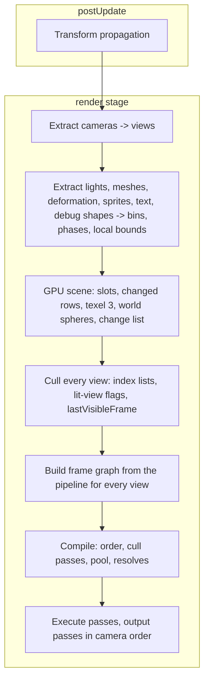

# Design 06: Render Pipeline

|                                       |                                                                                                       |
| ------------------------------------- | ----------------------------------------------------------------------------------------------------- |
| **Status**                            | Draft, for review (revised after solution review, §7)                                                 |
| **Kind**                              | Feature and breaking refactor                                                                         |
| **Engine version at time of writing** | `0.26.1`                                                                                              |
| **Program**                           | [Forge 3D](./README.md), milestone M2                                                                 |
| **Depends on**                        | [04 Transforms](./04-transforms.md), [05 GPU device layer](./05-gpu-device.md)                       |
| **Lands with**                        | [07 2D on the render pipeline](./07-2d-on-the-render-pipeline.md) and [13 Post-processing](./13-post-processing-and-anti-aliasing.md): Phase 2 here (with draw items and the sorted transparent phase, task 2.6) ships with Phase 1 of each |
| **Related**                           | [08 Meshes, materials and shaders](./08-meshes-materials-and-shaders.md) (mesh extraction, the change list, pass variants), [09 Lighting](./09-lighting-and-shadows.md) (lit views, shadow views, the change list), [10 PBR](./10-pbr-and-environment-lighting.md) (camera components, the transmissive phase), [12 Animation](./12-skeletal-and-morph-animation.md) (texel 3, deformed bounds, `lastVisibleFrame`), [13 Post-processing](./13-post-processing-and-anti-aliasing.md) (render scale, frame graph support, resolves), [15 Picking](./15-audio-particles-and-picking-in-3d.md) (message streams, `sceneDepth`) |

## 0. Targeted modules

| Path                                                    | Change   | Notes                                                                                                 |
| ------------------------------------------------------- | -------- | ----------------------------------------------------------------------------------------------------- |
| `src/rendering/pipeline/` (new)                         | New      | `RenderPipeline`, features, passes, insertion points, the frame graph (with design 13's `beginPostProcess` and pending layers), the transient texture pool, the missing-feature check |
| `src/rendering/views/` (new)                            | New      | Per-camera views, phases (binned and sorted), draw items, batching                                    |
| `src/rendering/gpu-scene/` (new)                        | New      | Object slots per world, the object data texture, change-driven uploads, world culling spheres from local bounds, the per-frame change list, culling arrays |
| `src/rendering/components/camera-component.ts`          | Modified | Projections with scaling modes, viewport, `order` (was `layer`), `clearColor: Color \| null`, `renderScale` (design 13); input fields move to controllers |
| `src/rendering/controllers/` (new)                      | New      | Pan-and-zoom (2D), orbit and fly (3D) camera controllers                                              |
| `src/rendering/camera-view.ts`                          | Modified | 3D views: matrices, frustum, rays, viewport conversions; the 2D fields kept for orthographic cameras |
| `src/rendering/render-context.ts`                       | Modified | `clearStrategy` removed; canvas context attributes (design 05 §6.11)                                   |
| `src/rendering/systems/render-system.ts`, `present-system.ts`, `camera-system.ts` | Removed | Replaced by extraction systems, the pipeline system and controllers                  |
| `src/ui/utilities/create-ui-canvas.ts`, `src/ui/systems/ui-layout-system.ts` | Modified | UI canvas cameras lose their render target; layout stops writing the camera     |
| `src/rendering/debug/` (new)                            | New      | Debug drawing and the stats overlay                                                                   |
| `src/rendering/render-target.ts`                        | Modified | Depth and MSAA; imported into the frame graph as camera destinations                                  |
| `documentation-site/docs/docs/rendering/`               | Modified | `world-units-and-cameras.md`, `multipass-rendering.md` rewritten; new `render-pipeline.md`, `custom-passes.md`, `debug-drawing.md`, `cameras-3d.md` |

---

## 1. Summary

Forge draws today with one render system that handles every camera, every
sprite and every glyph, followed by a present system that composites
camera targets, and post-processing systems that each run on their own
camera's target. There's no depth, no perspective and no notion of passes;
adding a new kind of drawing means editing the render system.

This design replaces that with a **render pipeline**: a set of passes,
built per frame into a **frame graph** that knows which textures each pass
reads and writes, drops passes whose output nobody uses, reuses pooled
intermediate textures between passes whose uses don't overlap, and inserts
MSAA resolves. Engine features (shadows, opaque, sky, transparent, bloom,
tone mapping) register passes; whether a pass runs for a camera depends on
that camera's components, so one camera can bloom and another blur, as
Forge allows today. Games add passes at named **insertion points**, or
replace the pipeline.

Above it:

- **Cameras** get perspective and orthographic projections (with scaling
  modes, so UI layout no longer writes the camera), a viewport, a
  composition `order`, and keep everything 2D games use. Input handling
  moves to controller components, one per camera.
- **Every camera renders into its own targets**, and an **output pass**
  writes its result to its destination with sRGB encoding, since WebGL2's
  canvas can't blend in linear space.
- **Extraction systems**, one per kind of renderable with fixed queries,
  turn components into **draw items**. Opaque and shadow items live in
  **retained bins** keyed by pipeline, material and mesh, updated from
  journals instead of re-sorted every frame; transparent items are sorted.
- The **GPU scene** keeps every mesh object's transform on the GPU per
  world, uploads only what changed (design 04's `changedTick`), and
  positions vertices relative to the camera at close to 64-bit precision.
- **Culling** runs over flat arrays of bounding spheres per view, with a
  tree for static objects.
- **Debug drawing** and a **stats overlay** come with the pipeline.

---

## 2. Scope

### In scope

- The pipeline, features, passes, insertion points and frame graph.
- Cameras, projections and scaling modes, viewports, composition, the
  output pass and the camera view API (matrices, frustum, picking rays,
  viewport conversions).
- Camera controllers: 2D pan-and-zoom (what the camera does today), orbit
  and fly.
- Extraction, binned and sorted phases, draw items, batching, instancing
  and multi-draw.
- The GPU scene and camera-relative rendering.
- Visibility: frustum culling, render categories, hierarchical visibility,
  a static tree, and level-of-detail selection.
- Debug drawing and stats.

### Out of scope

- **What's drawn**: meshes and materials (design 08), lights and shadows
  (09), PBR (10), 2D renderables (07), post effects (13). This design
  defines how they plug in.
- **Occlusion culling.** Design 05, out of scope.
- **Split-screen input routing.** Viewports are in scope; deciding which
  player's input drives which camera is game code.
- **Motion vectors, temporal effects.** No temporal anti-aliasing or motion
  blur in this program (design 13).

---

## 3. Phases

### Phase 1: Cameras, views and controllers

| #   | Task                    | Description                                                                                                       | Size |
| --- | ----------------------- | ----------------------------------------------------------------------------------------------------------------- | ---- |
| 1.1 | Camera component        | §6.2: projections with scaling modes, viewport, `order`, `clearColor`; 2D defaults unchanged                       | M    |
| 1.2 | Views                   | §6.3: view and projection matrices (reversed depth when available), frustum, rays, conversions                    | M    |
| 1.3 | Controllers             | Pan-and-zoom (today's camera input, moved), orbit, fly; one per camera, enforced                                  | M    |
| 1.4 | Ownership               | UI canvases use the reference-resolution scaling mode and layout stops writing `verticalWorldUnits`; `clearStrategy` removed | S |
| 1.5 | Migration               | Demos, e2e scenes and docs use the new fields and the pan-and-zoom controller                                      | M    |

**Definition of done:** `camera-pan-zoom` and every UI e2e spec pass; the
view API's conversions round-trip for both projections; nothing but a
controller writes a camera's transform.

### Phase 2: Pipeline, frame graph and output (ships with design 07 Phase 1)

| #   | Task                       | Description                                                                                                                  | Size |
| --- | -------------------------- | ---------------------------------------------------------------------------------------------------------------------------- | ---- |
| 2.1 | Frame graph                | §6.5: resources, pass declarations, compile (order, cull, lifetimes), pooled transient textures, execution                  | L    |
| 2.2 | Pipeline, features, insertion points | §6.4: per-frame and per-view passes; per-camera activation; adding, replacing and removing passes                  | M    |
| 2.3 | Output pass                | §6.4.3: every camera renders into its own targets; the output pass writes its destination in `order`, replacing the present system; canvas attributes change (design 05 §6.11). Until design 07 Phase 2, non-HDR views are `rgba8unorm` and the output pass copies without encoding | M |
| 2.4 | Camera destinations        | A camera's `renderTarget` is now its final destination. UI canvases, the space-shooter demo and the `hdr-tint-bloom`, `bloom-over-background`, `post-process-pixel-ratio` and `webgl-context-loss` e2e scenes drop the targets they used only to reach the present system | M |
| 2.5 | `registerRendering`        | Registers extraction systems and the pipeline system in the `render` stage; adds `MeshChangeListEcsComponent` (design 08) and records the world's pipeline on the render context | S |
| 2.6 | Draw items and the transparent phase | §6.6.1: draw items; the sorted transparent phase, sorted per view with design 07 §6.3's keys. Design 07 Phase 1 draws sprites, text and terrain through it | M |

**Definition of done:** with design 07 Phase 1 and design 13 Phase 1,
every 2D e2e spec passes and every golden is unchanged except their
reviewed differences (MSAA edges on cameras that rendered into targets,
design 07 S16); `render-system.ts` and `present-system.ts` are deleted.

### Phase 3: Phases and batching

| #   | Task                          | Description                                                                                        | Size |
| --- | ----------------------------- | -------------------------------------------------------------------------------------------------- | ---- |
| 3.1 | Binned phases                 | §6.6: binned phases for opaque, alpha-tested and shadow casters (the transparent phase is task 2.6) | M    |
| 3.2 | Bins                          | §6.6.2: retained, updated from extraction journals, design 08's change list and materials' `featureKey` | M    |
| 3.3 | Object index lists            | §6.6.3: per-view lists read at a per-draw offset, the same with and without multi-draw            | M    |
| 3.4 | Multi-draw                    | Batches with the same pipeline and material over meshes in a shared buffer merge                   | S    |
| 3.5 | Custom phases                 | A game defines a phase, an extraction system and a pass (the custom-passes guide)                  | S    |

**Definition of done:** 10,000 copies of one mesh and material draw in one
call; a frame in which nothing changed does no bin work; the custom-passes
guide's example runs as a demo.

### Phase 4: GPU scene and culling

| #   | Task                          | Description                                                                                          | Size |
| --- | ----------------------------- | ---------------------------------------------------------------------------------------------------- | ---- |
| 4.1 | Slots and journals            | §6.7.1: a slot per mesh object, per world, from extraction's journals                                | M    |
| 4.2 | Object data texture           | §6.7.2: rows written for changed dynamic transforms and for static ones from their journals; texel 3 from its inputs; world culling spheres from local bounds; the per-frame change list | M |
| 4.3 | Camera-relative positions     | §6.7.3: high and low translation; shader functions every material uses                               | M    |
| 4.4 | Culling                       | §6.8: every view culled before the frame graph is built; sphere tests over flat arrays; categories; hierarchical visibility for meshes and lights; lit-view flags; `lastVisibleFrame` | M |
| 4.5 | Static tree and LOD           | §6.8.3, §6.8.4                                                                                        | M    |

**Definition of done:** B1 (with design 08's meshes) uploads nothing and
scans no static slots after the first frame; the depth-precision analytic
test (design 01) passes on ANGLE's D3D11, Metal and OpenGL backends;
culling of 50,000 objects costs ≤ 0.5 ms.

### Phase 5: Debug drawing and stats

| #   | Task                  | Description                                                                                   | Size |
| --- | --------------------- | --------------------------------------------------------------------------------------------- | ---- |
| 5.1 | Debug drawing         | §6.9: lines, boxes, spheres, arrows, frustums, grids; depth-tested or on top; fixed-step shapes | M    |
| 5.2 | Stats overlay         | Frame time, draw calls, triangles, uploads, skipped draws, per-pass GPU time                  | S    |
| 5.3 | Demo                  | A perspective grid with orbit and fly controllers and debug shapes (the M2 demo)              | S    |

**Definition of done:** the M2 demo runs on the docs site; debug drawing
allocates nothing per frame.

---

## 4. Decision log

| #   | Decision                                    | Options                                                                                                                                      | Chosen | Rationale, trade-offs, assumptions                                                                                                                                                                                                                                                                                                                   |
| --- | ------------------------------------------- | -------------------------------------------------------------------------------------------------------------------------------------------- | ------ | ---------------------------------------------------------------------------------------------------------------------------------------------------------------------------------------------------------------------------------------------------------------------------------------------------------------------------------------------------- |
| R1  | Pipeline structure                          | (a) A frame graph built per frame from passes; (b) a fixed list of passes with hand-managed targets                                          | (a)    | The established technique (Frostbite's frame graph, Unity's render graph, Bevy's render graph). A pass declares what it reads and writes; the graph orders it, provides its targets and releases them. Hand-managed targets are how today's bloom and blur systems ended up keeping private scratch targets in `WeakMap`s. On WebGL2 the graph reuses pooled textures of the same descriptor; it can't alias memory between different formats. |
| R2  | Getting data from the ECS                   | (a) Extraction systems with fixed declared queries writing per-frame draw lists on the render context; (b) a separate render world      | (a)    | Forge runs on one thread, so a second world buys no parallelism and costs a copy. Extraction systems keep the "fixed query" rule and are the extension point for new renderables.                                                                                                                                                                 |
| R3  | Per-object data on the GPU                  | (a) A persistent GPU scene (object data texture) plus per-view lists of object indices; (b) uploading every visible object's matrix every frame | (a) | (b) uploads 64 bytes per visible object per frame (3 MB for B1). (a) uploads only objects that moved, plus 4 bytes per visible object for the index list. Three.js's `BatchedMesh` reads per-object data from a texture the same way.                                                                                                                    |
| R4  | Object data storage                         | (a) A float texture read with `texelFetch`; (b) uniform buffer arrays                                                                       | (a)    | Uniform blocks are guaranteed only 16 KB (256 matrices). A texture holds millions of objects and is read with exact integer addressing.                                                                                                                                                                                                             |
| R5  | Large-world precision                       | (a) Translation as high and low `float32` parts, subtracted from the camera's in the shader; (b) re-uploading camera-relative matrices every frame; (c) moving the world origin | (a) | README G4; the relative-to-eye technique Cesium uses. Keeps the GPU scene valid while the camera moves, unlike (b), and needs no game cooperation, unlike (c). GLSL ES 3.00 has no `precise` qualifier, so Phase 4 tests it on every ANGLE backend.                                                                                         |
| R6  | Camera input                                | (a) Controller components and systems that write the camera's transform, one per camera; (b) keep input fields on the camera                  | (a)    | A camera describes a view. Today's camera component also holds pan and zoom input, which made it a 2D controller; 3D needs other controllers. Each controller system is the one writer of its camera's `local` transform and zoom, and a second controller on the same camera throws.                                                         |
| R7  | Orthographic depth range default            | (a) `near: -1000`, `far: 1000` relative to the camera; (b) positive near and far                                                            | (a)    | A 2D camera sits at `z = 0` with its sprites, so the range extends both ways and 2D games never think about depth.                                                                                                                                                                                                                                |
| R8  | Compositing cameras and the canvas          | (a) Every camera renders into its own targets; an output pass writes the destination, encoding sRGB, in camera `order`; (b) let cameras without effects draw straight into the canvas | (a) | WebGL2's canvas can't be an sRGB target, so drawing into it directly blends in gamma space, against README G3; and an sRGB multisampled target can't be resolved into the canvas, since a resolve needs matching formats. Bevy and Unity's linear web path also always go through an intermediate. Cost: one full-screen pass per camera destination, fused with tone mapping and anti-aliasing whenever those run. |
| R9  | Culling                                     | (a) Brute-force sphere tests over flat arrays, plus a tree for static objects; (b) a dynamic tree for everything                            | (a)    | A sphere against six planes in a tight loop over typed arrays does 50,000 objects in well under a millisecond; a dynamic tree costs refitting for moving objects. Static objects get a tree built when the static set changes.                                                                                                                     |
| R10 | Camera `layer`                              | (a) Rename to `order`; (b) keep `layer`                                                                                                     | (a)    | Sprites also have a `layer` (their draw layer). Two meanings of one word in the rendering API is one too many.                                                                                                                                                                                                                                     |
| R11 | How games extend the pipeline               | (a) Features and passes at named insertion points, plus replacing the whole pipeline; (b) editing an exposed graph                          | (a)    | Insertion points are stable across engine versions; an exposed graph would make every internal change a breaking one.                                                                                                                                                                                                                              |
| R12 | Which effects apply to which camera         | (a) Features register passes once; each pass decides per view from the camera's components (bloom, tone mapping, blur, ambient occlusion); (b) pipeline-wide effects | (a) | Today the space-shooter demo blurs only its background camera and blooms only its foreground camera; (b) can't express that. Bevy keeps the same model: effects are camera components that per-view passes read.                                                                                                                         |
| R13 | Depth prepass                               | (a) Runs for a view whenever its opaque or alpha-tested phase has items; (b) off; (c) a camera setting                                      | (a)    | It costs a second vertex pass and saves shading every covered fragment, which with clustered lights is the main GPU cost; ambient occlusion needs its depth and normals. Deciding from the data means 2D views never run it and 3D views always do, with nothing to configure. It draws design 08's `depth` or `depthNormals` pass variants, and an item is skipped in every pass until all of its variants are ready (design 08 §6.10.1), so the prepass and the color pass never disagree. |
| R14 | Opaque and shadow phases                    | (a) Retained bins keyed by pipeline, material and mesh, updated from journals and versions; (b) sort every visible item every frame        | (a)    | With a depth prepass, front-to-back order buys little, and re-sorting 50,000 items each frame is work proportional to scene size rather than to change. Bevy moved its opaque phases from sorting to bins for this reason. Transparent items still need a sort.                                                                                      |
| R15 | Perspective far plane default               | (a) 1000 m on every device; (b) infinite where reversed depth is available                                                                 | (a)    | `EXT_clip_control` isn't in every browser, so (b) would make culling and anything reading the view's far distance differ by browser. Reversed depth still improves precision where it's available.                                                                                                                                            |

---

## 5. Open questions

1. **MSAA default on phones.** 4× MSAA on a high-density phone screen is
   expensive in a 3D scene. Options: (a) 4× everywhere (today's canvas
   behavior); (b) 4× on desktop, off on high-density mobile, with FXAA
   (design 13) instead. Proposal: (a) for 2D, decide for 3D after M3's
   mobile measurements.
2. **UI canvases as cameras.** Screen-space UI is a separate camera.
   Options: (a) keep that, as an orthographic camera with `order` above the
   scene; (b) an overlay pass in the scene camera's view. Proposal: (a),
   which this design keeps working and which supports several canvases.

---

## 6. Design

### 6.1 A frame



`registerRendering(world, renderContext, pipeline)` adds the extraction
systems for the engine's renderables and the pipeline system, all in the
`render` stage (design 03), adds the `MeshChangeListEcsComponent`
singleton that design 08's `updateMeshComponent` appends to, and records
the world's pipeline on the render context, which `renderContext.prepare`
and design 11's early compiles read (design 08 §6.10.2). Features add
their own extraction systems (lighting adds light extraction). A game's
custom renderable gets its own extraction system.

Every view is culled (§6.8) after the GPU scene's update and before the
frame graph is built, so per-frame passes' `setup` (design 09's shadow
maps) can read each view's culling results and lit-view flag.

### 6.2 Cameras

```ts
interface CameraEcsComponent {
  projection: PerspectiveProjection | OrthographicProjection;
  viewport: { x: number; y: number; width: number; height: number }; // fractions of the destination, default full
  renderTarget?: RenderTarget; // the destination; default: the canvas
  order: number;               // composition order into the destination (was `layer`)
  clearColor: Color | null;    // null: draw over what's already in the destination
  cullingMask: number;         // matched against renderables' `category`, as today
  ySort: boolean;              // 2D, unchanged (design 07)
  msaaSamples: 1 | 4;          // default 4
  renderScale: number;         // the view's resolution as a fraction of its viewport's, in (0, 2]; default 1 (design 13 §6.4.4)
}

interface PerspectiveProjection {
  kind: 'perspective';
  verticalFieldOfView: number; // radians, default π/3
  near: number;                // default 0.1
  far: number;                 // default 1000 (decision R15)
}

interface OrthographicProjection {
  kind: 'orthographic';
  scaling:
    | { kind: 'fixedHeight'; worldUnits: number }                 // today's verticalWorldUnits, default 10
    | { kind: 'referenceResolution'; width: number; height: number; match: 'width' | 'height' | 'expand' | 'shrink' };
  zoom: number;                // as today, default 1
  near: number;                // default -1000
  far: number;                 // default 1000
}
```

- `createCamera(world, options)` keeps making a camera entity with a
  transform; its defaults make an orthographic camera that behaves like
  today's. The `projection` option says which kind of camera it is.
- The `referenceResolution` scaling mode computes the view's height from
  the destination's CSS size, the way UI canvases scale today, so the UI
  layout system no longer writes the camera (it was a second writer of
  `verticalWorldUnits`).
- `clearColor: null` replaces `RenderContext.clearStrategy`, which is
  removed (it was a second way to say "don't clear").
- `msaaSamples` is per camera because cameras genuinely differ: a
  pixel-art camera wants none.
- `renderScale` is per camera for the same reason: a 3D camera on a phone
  renders at 0.75 while its UI canvas camera stays at 1 (design 13 PP27).
  `createCamera` takes it as an option. A value outside `(0, 2]` throws
  when the view is set up.
- A camera's **effects** are components on the camera entity, as bloom,
  blur and tone mapping are today (design 13 adds the rest), so each
  camera chooses its own.

**Controllers** (`src/rendering/controllers/`), each a component and a
`postUpdate` system that writes its camera's `local` transform (and an
orthographic camera's `zoom`). A camera has at most one; adding a second
throws.

| Controller                              | Behavior                                                                                         |
| --------------------------------------- | ------------------------------------------------------------------------------------------------ |
| `PanZoomCameraControllerEcsComponent`   | Today's `zoomInput`, `panInput`, sensitivities and zoom limits, moved off the camera, unchanged  |
| `OrbitCameraControllerEcsComponent`     | Orbits a target point or entity; rotate, pan and dolly inputs; distance and pitch limits; damping |
| `FlyCameraControllerEcsComponent`       | Free flight: look and move inputs, speed, boost, damping                                         |

### 6.3 Views

`computeCameraView(camera, transform, renderContext)` (and
`getCameraView(world, cameraEntity)`) return:

| Member                                    | Notes                                                                                              |
| ----------------------------------------- | -------------------------------------------------------------------------------------------------- |
| `viewMatrix`, `projectionMatrix`, `viewProjectionMatrix`, and inverses | 64-bit. The projection uses reversed depth when `EXT_clip_control` is present           |
| `position`, `forward`                     | World space                                                                                        |
| `frustum`                                 | Design 02 `Frustum`, built with the device's depth range                                           |
| `worldToViewport(out, point)`             | CSS pixels from the canvas's top-left, Y-down, plus `depth` in `[0, 1]`                            |
| `viewportToRay(out, point)`               | A world-space `Ray` for picking (design 15)                                                        |
| `viewportToWorld(out, point, plane?)`     | Where the ray meets `plane` (default `z = 0`); exact for orthographic, the 2D case                 |
| `bounds`, `size`, `pixelsPerUnit`         | Orthographic only, as today: the 2D UI and culling code keep using them                            |

Conversions use the camera's `viewport` rectangle of its destination, so
split-screen and minimap cameras convert correctly.

### 6.4 The pipeline

#### 6.4.1 Features, passes and insertion points

```ts
const pipeline = createRenderPipeline(renderContext, {
  features: [lighting(), bloom()],
});

pipeline.addPass('afterOpaque', outlinePass);
pipeline.addPass('postProcessing', heatHazePass, { before: 'bloom' });
pipeline.removePass('sky');
```

A **feature** is a function that adds passes, extraction systems and
shader includes to the pipeline. A feature being in the pipeline makes its
passes available; whether one runs for a camera is decided per view (a
bloom pass runs for views whose camera has a `BloomEcsComponent`).
`createRenderPipeline` with no features is the 2D pipeline: the
transparent phase and the output pass. Ambient occlusion and auto exposure
come with `lighting()`; tone mapping, color grading and FXAA are stages of
the output pass, which every pipeline has (design 13 PP2).

`addPass(point, pass, order?)` appends at the insertion point; the optional
`{ before?: string; after?: string }` names another pass at the same point
to run before or after, and naming a pass that isn't there throws. The
order of `features` never changes the order of passes.

**Camera extraction** turns each camera into a view. Besides the camera
and its transform, it declares one secondary query per engine camera
component that needs a feature: design 10's `ExposureEcsComponent`,
`EnvironmentEcsComponent`, `SkyEcsComponent`, `FogEcsComponent` and
`MaterialDebugViewEcsComponent`, design 09's `LightingDebugViewEcsComponent`
(all need `lighting()`), and design 13's effect components (bloom, blur,
ambient occlusion, auto exposure). When one matches a camera whose
pipeline lacks the feature, setting up the view throws, naming the
component and the feature (design 13 §6.2.2). The queries import only
component keys, so the check adds nothing to a 2D bundle.

| Insertion point     | Engine passes there                                                                  |
| ------------------- | ------------------------------------------------------------------------------------ |
| `frame`             | Shadow maps: the cascades of every lit view and the shared local light tiles, in one depth array (design 09); environment preparation (design 10); shared by all views |
| `beforeOpaque`      | Depth prepass (decision R13); per-lit-view light setup: light data and clusters (09); ambient occlusion (13) |
| `opaque`            | Opaque and alpha-tested phases                                                       |
| `afterOpaque`       | Sky, the scene-color copy and the transmissive phase (design 10)                     |
| `transparent`       | The transparent phase, including 2D sprites and text (07)                            |
| `afterTransparent`  | Debug drawing (depth-tested)                                                         |
| `postProcessing`    | Bloom, blur and game effects, in design 13's fixed engine order (§6.3.3 there); tone mapping, color grading and anti-aliasing run in the output pass |
| `output`            | Writing the result to the camera's destination                                       |
| `overlay`           | Debug drawing on top                                                                 |

A pass is:

```ts
interface RenderPassNode<TData> {
  name: string;
  /** Declares what the pass reads and writes for this view (or the frame). Returns null to skip. */
  setup(graph: FrameGraphBuilder, view: ViewResources): TData | null;
  /** Records draws. Runs only if the graph kept the pass. */
  execute(context: PassContext, data: TData): void;
}
```

`ViewResources` includes the camera's entity and components, so `setup`
reads its effect settings and returns `null` when the camera doesn't use
the pass. `PassContext` gives the device's pass encoder (design 05), the
view's bind groups, `drawPhase(phase)`, `drawFullscreen(material)` and the
textures the pass declared.

`FrameGraphBuilder` declares reads, writes and transient textures, and has
two members for passes that replace the view's color (design 13 §6.3):
`beginPostProcess(view)` returns the view's color so far as a source and a
new texture that becomes the view's color for every later pass, after
adding pending layers; `addPendingLayer(view, texture, intensity)` queues
light to add to the view's color, in the output pass or before the next
`beginPostProcess`, whichever comes first.

#### 6.4.2 View resources

Every view starts with resources passes can read and write:

- `color`: `rgba16float` when the view is lit (design 09 L17: after
  culling, one of its items uses a lit material) or its camera has bloom,
  tone mapping or auto exposure (design 13 §6.2.3); otherwise
  `rgba8unorm-srgb`. A UI canvas camera in a lit pipeline stays 8-bit. An
  HDR view on a device without float color buffers throws (design 05,
  decision D11). Until design 07 Phase 2, non-HDR views are `rgba8unorm`
  and the output pass copies them without encoding; design 07 Phase 2
  switches them to `rgba8unorm-srgb` with encoding, outright, with no
  option to keep the copy.
- `depth`: `depth24plus`, or `depth32float` with reversed depth, only when
  the prepass or the opaque or alpha-tested passes run (design 07 S15). A
  pure 2D view has no depth attachment.
- `normals`, written by the prepass when a pass asks for them (ambient
  occlusion).
- In a multisampled view whose alpha-tested phase has items, the prepass
  has a color attachment at location 0, which alpha-to-coverage needs
  (design 13 PP22): the normals when ambient occlusion is on, otherwise a
  transient multisampled `rgba8unorm` texture, never resolved and
  discarded at the end of the pass.

View textures are the viewport's size in device pixels times the camera's
`renderScale`, at least 1 texel on each axis. Projection, culling and
level of detail use the viewport's aspect and CSS size, which don't
change with the scale. Passes declare new transient textures
(`graph.createTexture(descriptor)`), sized relative to the view.

#### 6.4.3 Output and composition

The `output` pass reads the view's final color and writes the camera's
destination inside its viewport:

- It encodes linear color to sRGB in the shader (the canvas can't be an
  sRGB target). The view holds premultiplied color, and bloom adds light
  where alpha is 0, so the pass splits each pixel into the light its
  coverage explains and the glow beyond it, encodes them separately and
  adds them (design 13 §6.5.3), so the premultiplied-destination contract
  holds and glow over a transparent camera only adds light.
- When a destination is a `rgba8unorm-srgb` render target, the hardware
  encodes instead. A float destination receives linear light, unencoded
  (design 13 §6.5.2).
- It reads the view's color at each destination pixel: with `texelFetch`
  at a render scale of 1, bilinear filtering otherwise (design 13 §6.4.4),
  so a scaled view is resampled into the destination viewport in the same
  pass.
- Until design 07 Phase 2, it copies `rgba8unorm` views without encoding
  (task 2.3).
- The first camera (lowest `order`) to write a destination in a frame
  replaces it, clearing outside its viewport if it has a `clearColor`;
  later cameras blend over it with the premultiplied blend state. A UI
  camera over a 3D camera composites as today's present system does.
- Tone mapping, color grading and FXAA (design 13) run inside the output
  pass when the camera has them, so a typical 3D camera has exactly one
  full-screen pass after its scene passes.

A camera's `renderTarget` is now its final destination, not an
intermediate that something else presents. Code that rendered into a
target only so the present system would show it simply drops the target
(Phase 2, task 2.4).

### 6.5 The frame graph

Each frame:

1. **Build**: every per-frame pass's `setup`, then for each camera in
   `order`, every per-view pass's `setup`. Each declares reads, writes and
   new transient textures. Imported resources are the canvas, camera
   render targets and long-lived textures (shadow cascades and atlas,
   environment maps).
2. **Compile**:
   - order passes by insertion point and registration order, checking
     every read has an earlier write;
   - drop passes whose writes are never read and don't write an imported
     resource;
   - compute each transient texture's first and last use and assign it a
     pooled texture with the same descriptor that's free for that span;
   - add an MSAA resolve before every pass that samples a multisampled
     texture written since its last resolve, not only before the first
     read: design 10's transmission copy resolves the color mid-frame, the
     transparent phase draws into it again, and post-processing resolves
     it a second time;
   - choose `loadOp`/`storeOp` per attachment (`discard` after the last
     use, `clear` on the first write when the pass asks for one).
3. **Execute** passes in order.

The compiled result is cached on the render context by a hash of the
passes and descriptors, so a frame like the previous one compiles in
constant time and allocates nothing. Pooled textures unused for a few
frames are released.

### 6.6 Phases, bins and batching

#### 6.6.1 Draw items and phases

| Phase           | Organization                                                                            |
| --------------- | --------------------------------------------------------------------------------------- |
| `opaque`        | Retained bins by (pipeline variant, material, mesh part)                                |
| `alphaTested`   | The same                                                                                |
| `shadowCaster`  | The same bins, one set per world shared by every shadow view; each shadow view has its own culled set and index-list range (design 09) |
| `transmissive`  | Sorted per view, far to near; registered by `lighting()` (design 10 §6.12)              |
| `transparent`   | Sorted per view with design 07 §6.3's keys: layer, world order, depth (far first, measured at the item's depth point: the bounds' center, or the nearest ancestor with `DrawOrderEcsComponent.depthGroup`), root Y for `ySort` cameras, root sequence, hierarchy index with a kind sub-key |
| `overlay`       | Submission order                                                                        |

The pipeline variant in a bin key includes the front-face winding, so a
mirrored object (negative scale determinant, a GPU scene flag) lands in a
bin whose pipeline flips `frontFace` (design 05 §6.5). A game can register
its own phase, binned or sorted.

#### 6.6.2 Bins

A bin holds the GPU scene slots whose part uses its key. Bins are retained
across frames: the mesh extraction system adds and removes slots from its
journals (design 03), and moves a slot between bins when
`updateMeshComponent` changes its mesh, materials or `castsShadows`
(design 08's change list, §6.2 there) or when a material's `featureKey`
changes (work per bin, not per slot). Meshes are immutable, so a mesh
never changes under a bin. A frame in which nothing was added, removed or
rebound does no bin work.

Per view, after culling (§6.8), each bin's visible slots are written into
the view's object index list, and the bin draws as one instanced draw.
Bins draw in key order, which groups pipelines and materials and minimizes
state changes.

#### 6.6.3 Object index lists and draws

Each view has an object index list: an `r32uint` data texture holding the
GPU scene slot of every instance it draws, bin after bin, written each
frame. A draw's first index in the list goes in a small per-draw table in
the `ForgeDraw` block (bind group 3). The vertex shader reads its slot as

```glsl
uint slot = texelFetch(forge_objectIndices, forge_listCoord(forge_drawOffsets[gl_DrawID] + uint(gl_InstanceID)), 0).r;
```

For a plain instanced draw, `gl_DrawID` is 0 and the draw binds the block
range that starts at its own entry; with `WEBGL_multi_draw`, consecutive
batches with the same pipeline and material whose meshes share a buffer
(design 08's pool) go into one call, and `gl_DrawID` selects each one's
entry. One shader path serves both.

### 6.7 The GPU scene

#### 6.7.1 Slots

The render context keeps one GPU scene per world it renders, so two worlds
sharing a render context never collide. Each entity with a mesh component
gets a slot when the mesh extraction system sees it in its declared query's
`added` journal, and gives it up from `removed`. Slots are dense and
reused; the map from entity to slot is an `Int32Array` indexed by the
entity's slot index and checked against its generation. This is a derived
cache (README §4.4).

#### 6.7.2 Object data

An `rgba32float` texture, five texels per object:

| Texel | Contents                                                                           |
| ----- | ---------------------------------------------------------------------------------- |
| 0     | Row 0 of the 3x3 rotation-and-scale, and the high part of translation x            |
| 1     | Row 1, high part of translation y                                                  |
| 2     | Row 2, high part of translation z                                                  |
| 3     | Low parts of translation x, y, z; `receivesShadows + 2 × mirrored + 4 × record`, where `record` is design 12's deformation record index (below 2²², 0 when not deformed), exact in `float32` |
| 4     | Per-object tint (design 08, decision MS6)                                          |

Texel 3's fourth value replaces a skinned flag, which would duplicate the
variant's own skinning bits (design 12 AN31), so the object data stays at
five texels. The GPU scene writes it from inputs that each have one
owner: mesh extraction supplies `receivesShadows`; design 12's
deformation extraction supplies the record index, and a skinned slot's
mirrored flag (from its joint matrices, since the mesh entity's transform
cancels, design 12 §6.10.2); the slot's transform supplies the mirrored
flag of every other slot.

The normal matrix is computed in the shader from the 3x3's cofactors
(correct for non-uniform scale).

**The update.** The GPU scene's update runs after the extraction systems.
Each frame it compares each **dynamic** slot's transform `changedTick`
(design 04) with the stamp it last uploaded (for inequality, design 03
§6.3); **static** slots are written only when the static memberships'
journals report them, so they're never scanned. Changed rows go into a
CPU-side `Float32Array` mirror, and contiguous dirty ranges upload with
`texSubImage2D`.

**World culling spheres** have one writer, this update. It builds each
from the slot's local bound: the mesh's own bound, or for a deformed slot
the mesh-space bound design 12's extraction supplies, and recomputes it
when the slot's transform or its local bound changed.

**Which slots are static.** A slot takes the static path (never scanned,
culled through the static tree, §6.8.3) only when its entity has
`staticTransformTag`, no ancestor up to the root or the first
transformless ancestor has a dynamic transform, and it has no deformation
record. Everything else is dynamic:

- A static entity under a moving dynamic ancestor is recomposed by design
  04's walk whenever the ancestor moves (its §6.3.2), so its row and
  sphere must follow; the dynamic path compares its stamp like any other.
  The GPU scene checks the chain when a slot is added or a static journal
  reports the entity (reparenting), and, from a declaration of dynamic
  transforms, re-checks the slots in the subtree of an entity that became
  dynamic or static.
- A slot with a deformation record changes its local bound while its
  transform may not move (design 12 §6.10.5), whatever its tags.

**The change list** is the GPU scene's per-frame record of what changed,
written by this update and read by design 09's shadow cache (its §6.5.6).
Each entry is a slot with its previous and new world sphere (a removed
slot with its last sphere):

- slots whose transform row changed;
- slots added and removed;
- slots moved between bins, or whose `castsShadows` changed (design 08
  §6.2.2);
- slots whose alpha-tested shadow material's `version` changed;
- slots whose deformation tick advanced (design 12 §6.14 stamps it when a
  palette or morph list changes, since a character can deform in place
  without its transform changing);
- slots whose shadow variant became ready this frame (design 08 §6.10.1),
  as added, so a cached tile picks up a caster that was skipped while
  compiling.

It's cleared at the start of each update, and its arrays are reused.

#### 6.7.3 Camera-relative positions

The view block holds the camera position as high and low parts and a view
matrix with no translation. Engine shader functions, which every material
uses (design 08), compute:

```glsl
vec3 forge_objectToView(vec3 localPosition) {
  vec3 rotatedScaled = forge_objectBasis * localPosition;
  vec3 offset = (forge_objectTranslationHigh - forge_cameraPositionHigh)
              + (forge_objectTranslationLow - forge_cameraPositionLow);
  return mat3(forge_viewRotation) * (rotatedScaled + offset);
}
```

Subtracting the high parts first is exact for nearby values, so precision
near the camera is limited by the low parts, not by the distance from the
origin.

### 6.8 Visibility

#### 6.8.1 Per view

Every view is culled after the GPU scene's update and before the frame
graph is built (§6.1). For each view, a loop over the GPU scene's dynamic
sphere arrays (`Float64Array` centers, `Float32Array` radii) tests the
frustum's six planes and the object's `category` against the camera's
`cullingMask`, and marks visible slots. Hidden subtrees
(`VisibilityEcsComponent`) are resolved once per frame by the hierarchy
walk that resolves them today, into a per-slot flag, and for light
entities into a flag design 09's per-view light culling reads.

While it writes the view's object index lists, the loop records whether a
visible opaque, alpha-tested or transparent item uses a lit material. That
flag makes the view **lit** (design 09 §6.2.2), which decides its color
format (§6.4.2) and whether the lighting feature does work for it.

**Visibility feedback.** After culling, the pipeline writes
`MeshEcsComponent.lastVisibleFrame = time.frames` for every mesh visible
in a camera view or a shadow view, and for every dynamic caster a kept
cached shadow tile drew at its last render (design 09 §6.5.6). It is the
field's only writer, an output like `transform.world`; design 12 skips
sampling and palettes for meshes nobody saw (its AN26). Culling results
count whether or not a draw was skipped for a compiling pipeline.

#### 6.8.2 Per light

Shadow views (design 09) use the same loop with the light's frustum and a
`castsShadows` flag.

#### 6.8.3 Static tree

Slots on the static path (§6.7.2: `staticTransformTag`, no dynamic
ancestor, no deformation record) go into a bounding-volume tree, rebuilt
when the static set changes (rarely). The per-view loop walks it, skipping
whole subtrees outside the frustum.

#### 6.8.4 Level of detail

A mesh component can list alternative meshes with the screen height (as a
fraction of the viewport) below which each is used. The extraction system
picks one per view from the sphere's projected size, with a hysteresis
band so objects at the boundary don't flicker; the chosen level is part of
the bin the slot draws from in that view.

### 6.9 Debug drawing

```ts
const debug = world.getSingleton(debugDrawId);
debug.line(from, to, Color.red);
debug.box(boundingBox, Color.green, { depthTest: false });
debug.sphere(center, radius, color);
debug.arrow(origin, direction, color);
debug.frustum(view, color);
debug.grid({ size: 20, divisions: 20 });
```

Shapes are appended to typed arrays in the singleton component (state in
a component, README §4.4), drawn as lines in `afterTransparent`
(depth-tested) and `overlay` (on top). Both shape buffers are per-frame
message streams (design 03 §6.5): any system appends, none edits or
removes another's shapes, one owner clears each, and the debug pass reads
them after the writers. The frame buffer is cleared in the `last` stage.
Shapes drawn from the fixed stages (physics debug, design 14) go into a
second buffer that's cleared at the start of the next fixed step instead,
so they don't flicker on frames without one.
Physics, skeletons (design 12), light volumes (design 09) and bounds draw
through it.

The **stats overlay** (`createRenderStatsOverlay(container, renderContext)`)
is a DOM element updated twice a second from the device counters (design
05), so it costs nothing on the GPU.

### 6.10 Performance

Budgets for B1 (50,000 static meshes, 200 unique meshes, 50 materials) on
the desktop reference, measured per stage by the design 01 runner:

| Work                                   | Budget     |
| -------------------------------------- | ---------- |
| Transform propagation (all static)     | ≈ 0 (static subtrees aren't visited, design 04) |
| GPU scene updates                      | ≈ 0 (no dynamic slots; static slots not scanned) |
| Culling (static tree)                  | ≤ 0.5 ms   |
| Bin traversal and index lists          | ≤ 1.0 ms   |
| Shadow views (design 09)               | ≤ 1.0 ms   |
| Pass execution, draw submission        | ≤ 1.0 ms   |
| **Total**                              | **≤ 4 ms** |

No per-frame allocation (allocation specs for every extraction system and
the pipeline system).

### 6.11 Testing

- Unit: view matrices and conversions for both projections, both depth
  conventions and both scaling modes; frame graph ordering, culling,
  pooling and resolve insertion (a resolve before each read that follows
  a write); `addPass` ordering and its unknown-name error; the
  missing-feature check; per-camera pass activation; view formats and
  depth attachments decided from content; render-scale sizes; bin upkeep
  from journals, the change list and `featureKey`; index-list layout; slot
  allocation; dirty-range coalescing; texel 3 packing; world spheres from
  local bounds; static slots under a moving dynamic parent take the
  dynamic path; the change list's entries with previous and new spheres;
  `lastVisibleFrame` for camera views, shadow views and kept cached tiles;
  culling against brute force.
- e2e: camera composition (two cameras, UI over 3D), viewports
  (split-screen), the depth-precision analytic test on every ANGLE backend
  CI and the reference devices offer, a custom pass, per-camera effects
  (one camera blurred, one bloomed, as in the space-shooter demo).
- Golden: debug shapes from a perspective camera; orthographic and
  perspective views of the same scene; mirrored meshes.
- Benchmarks: B1 and B2 stage timings; culling and bin microbenchmarks.

---

## 7. Review

`solution-reviewer` verdict on the first draft (reviewed with design 05):
**REVISE**. The frame graph, extraction systems and GPU scene matched
Frostbite's, Unity's and Bevy's approaches; several specifics were wrong.
Changes made:

- Every camera renders through an intermediate target and an output pass
  (R8). The first draft let effect-free cameras draw straight into the
  canvas, which would blend in gamma space and can't resolve sRGB MSAA.
- Effects stay camera components that per-view passes read (R12); the
  first draft's pipeline-wide features couldn't express today's
  per-camera bloom and blur. View formats and the prepass (R13) are now
  decided from data.
- Opaque, alpha-tested and shadow phases are retained bins (R14) instead
  of per-frame sorts, and the GPU scene skips static slots, so a still
  scene does work proportional to change.
- Object indices come from a list read at a per-draw offset, one path with
  and without multi-draw; mirrored objects get a winding variant in the
  bin key.
- The GPU scene is kept per world.
- Camera ownership: the UI layout's write of `verticalWorldUnits` becomes a
  projection scaling mode, `clearStrategy` is removed in favor of
  `clearColor: null`, and one controller per camera is enforced.
- The far plane default is the same on every device (R15).
- Fixed-step debug shapes no longer flicker.
- The migration of camera render targets (UI canvases, a demo, four e2e
  scenes) is listed.
- "Aliasing" is described as pooled reuse, since WebGL2 can't alias
  memory.

Changes from designs 07 to 15, applied when the program was reconciled:
draw items and the sorted transparent phase moved into Phase 2 (task 2.6)
for design 07 Phase 1, with design 07's keys; 8-bit views copy until
design 07 Phase 2; depth only where an opaque pass writes it; view formats
decided from lit content and HDR effects (designs 09, 13); `renderScale`,
`beginPostProcess`, pending layers, `addPass` ordering, resolves before
every read after a write and the split output encoding (design 13); camera
extraction's missing-feature check (designs 09, 10, 13); the transmissive
phase and the `afterOpaque` passes (design 10); culling of every view
before the build, lit-view flags, shared shadow-caster bins and the change
list (design 09); texel 3's record index, world spheres from local bounds,
deformed slots on the dynamic path and `lastVisibleFrame` (design 12);
bins driven by design 08's change list; debug buffers as message streams
(design 15). The review of design 12 also found that static slots under a
moving dynamic parent were never rewritten; such slots now take the
dynamic path (§6.7.2).
