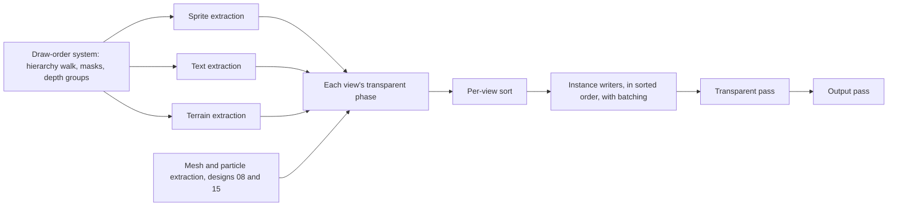

# Design 07: 2D on the Renderer

|                                       |                                                                                                                                                                                                                                                                                                                                                                                                                                                                                                                                                                      |
| ------------------------------------- | -------------------------------------------------------------------------------------------------------------------------------------------------------------------------------------------------------------------------------------------------------------------------------------------------------------------------------------------------------------------------------------------------------------------------------------------------------------------------------------------------------------------------------------------------------------------- |
| **Status**                            | Draft, for review (revised after solution review, §7)                                                                                                                                                                                                                                                                                                                                                                                                                                                                                                                |
| **Kind**                              | Refactor, defect fixes and feature                                                                                                                                                                                                                                                                                                                                                                                                                                                                                                                                   |
| **Engine version at time of writing** | `0.26.1`                                                                                                                                                                                                                                                                                                                                                                                                                                                                                                                                                             |
| **Program**                           | [Forge 3D](./README.md), milestone M2. Phase 0 is a bug fix that lands before M1's golden images; Phase 4 lands in M3, after design 08 Phase 1                                                                                                                                                                                                                                                                                                                                                                                                                       |
| **Depends on**                        | [06 Renderer and frame graph](./06-render-pipeline.md): Phase 1 here ships with its Phase 2, and needs the draw items and sorted transparent phase, which design 06 builds in its task 2.6 (§7)                                                                                                                                                                                                                                                                                                                                                                      |
| **Related**                           | [05 GPU device layer](./05-gpu-device.md) (fixed attribute locations, texture-unit budgets, staging uploads), [08 Meshes, materials and shaders](./08-meshes-materials-and-shaders.md) (Phase 4 here needs its meshes; its material blocks, built in design 05 Phase 3, carry `SpriteMaterial`), [13 Post-processing](./13-post-processing-and-anti-aliasing.md) (its Phases 1 and 2 ship with Phases 1 and 2 here), [15 Audio, particles and picking](./15-audio-particles-and-picking-in-3d.md) (particles and picking use the sort keys and billboard alignments) |

## 0. Targeted modules

| Path                                                                                                                                                                                               | Change   | Notes                                                                                                                                                                                                                                                                                                                                           |
| -------------------------------------------------------------------------------------------------------------------------------------------------------------------------------------------------- | -------- | ----------------------------------------------------------------------------------------------------------------------------------------------------------------------------------------------------------------------------------------------------------------------------------------------------------------------------------------------- |
| `src/text/rendering/glyph-quad.ts`                                                                                                                                                                 | Modified | Phase 0: glyph offsets rotated and scaled with the entity (`fix(text)`)                                                                                                                                                                                                                                                                         |
| `src/rendering/sprites/` (new; from `render-system.ts` and `utilities/sprite-*instance-data-segment.ts`)                                                                                           | New      | Sprite extraction system, instance writer and layout, nine-slice expansion                                                                                                                                                                                                                                                                      |
| `src/text/rendering/*`, `src/text/rendering/shaders/*`                                                                                                                                             | Modified | Text extraction system; glyphs as rectangles in the entity's plane; corner-and-edges layout                                                                                                                                                                                                                                                     |
| `src/rendering/draw-order.ts`                                                                                                                                                                      | Modified | A `render`-stage system runs the hierarchy walk once per frame; the walk also resolves mask rows and depth groups; results and sort scratch (`digitCounts` too) move from module scope to the render context                                                                                                                                    |
| `src/rendering/masks/mask-table.ts` (new)                                                                                                                                                          | New      | The per-frame mask table (§6.4)                                                                                                                                                                                                                                                                                                                 |
| `src/rendering/utilities/resolve-instance-mask.ts`, `mask-instance-data-segment.ts`, `instance-data-segment.ts`, `setup-instance-attribute.ts`, `src/rendering/render-command.ts`, `renderable.ts` | Removed  | Replaced by the mask table and fixed instance layouts on device pipelines (none is exported today)                                                                                                                                                                                                                                              |
| `src/rendering/components/draw-order-component.ts`                                                                                                                                                 | Modified | `depthGroup` (§6.3.2)                                                                                                                                                                                                                                                                                                                           |
| `src/rendering/components/billboard-component.ts` (new)                                                                                                                                            | New      | `BillboardEcsComponent`, read by the sprite and text extraction                                                                                                                                                                                                                                                                                 |
| `src/rendering/color.ts`                                                                                                                                                                           | Modified | `linear`: the color in linear space, computed once and kept                                                                                                                                                                                                                                                                                     |
| `src/rendering/shaders/sprite/*`, `shaders/mask/*`                                                                                                                                                 | Modified | Corner-and-edges instance layout; `spriteMask` reads the mask table                                                                                                                                                                                                                                                                             |
| `src/rendering/shaders/includes/`                                                                                                                                                                  | Modified | `colorSpace` include (`srgbToLinear`) for shaders that compute colors                                                                                                                                                                                                                                                                           |
| `src/rendering/materials/sprite-material.ts`                                                                                                                                                       | Modified | Pairs fragment shaders with the new `sprite.vert` (Phase 3). Moving it onto material blocks is design 05 Phase 3 (task 3.5, building design 08 §6.3), not this design: `u_texture` and `u_emissiveTexture` become draw textures bound in bind group 3, with a bind group cached per texture pair on the render context (design 08 §6.3.4, MS15) |
| `src/rendering/materials/uniform-value.ts`, `create-uniform-upload.ts`, `material.ts`                                                                                                              | Modified | `Matrix3x3` leaves `UniformValue` (design 02's `Matrix3` covers `mat3`); color uniforms upload linear values                                                                                                                                                                                                                                    |
| `src/rendering/terrain/*`                                                                                                                                                                          | Modified | A transparent-phase item with `layer`, drawn through its entity's transform; `createTerrainRenderEcsSystem` removed; `createTerrainMesh` loses `position` and `angle`                                                                                                                                                                           |
| `src/ui/utilities/create-ui-canvas.ts`                                                                                                                                                             | Modified | World-space canvases are depth groups (screen-space canvas cameras lose their target in design 06 task 2.4)                                                                                                                                                                                                                                     |
| `src/rendering/texture.ts`, `texture-cache.ts`, `default-texture-options.ts`, `src/text/font-atlas/font-atlas-cache.ts`                                                                            | Modified | Images load as sRGB textures; font atlases as linear                                                                                                                                                                                                                                                                                            |
| `src/rendering/shaders/utils/create-projection-matrix.ts`, `src/math/matrices/matrix3x3.ts`                                                                                                        | Removed  | Their last users go (Phase 3)                                                                                                                                                                                                                                                                                                                   |
| `e2e/specs/*` (named in §6.10), golden images                                                                                                                                                      | Modified | MSAA edges (Phase 1), linear blending (Phase 2), reviewed                                                                                                                                                                                                                                                                                       |
| `documentation-site/src/pages/demos/{car,rolling-ball,space-shooter,erosion-burn,brick-breaker}`                                                                                                   | Modified | Terrain `layer`; custom sprite shaders checked under linear output                                                                                                                                                                                                                                                                              |
| `documentation-site/docs/docs/`                                                                                                                                                                    | Modified | `rendering/`: `sprites.md`, `draw-order.md`, `masks.md`, `hdr-rendering.md`, `textures.md`, `material-uniforms.md`; `physics/terrain.md`; `text/text-effects.md`; `ui/creating-a-canvas.md`; `math/matrices.md`, `math/angles-and-rotation.md`; new `rendering/2d-and-3d-together.md`                                                           |

---

## 1. Summary

Every 2D feature Forge has draws through one render system: sprites,
nine-slice sprites, glyphs of text, UI panels and labels, masked fills and
particles (each a sprite entity). Terrain draws through a second system
that runs first and takes over clearing. The render system's order
(layer, world order, optional y-sort, hierarchy order) is exact and well
defined.

Design 06 replaces both systems with a renderer built from passes. This design
moves every 2D feature onto it, as extraction systems that put draw items
into each view's sorted transparent phase, then makes three deliberate
changes:

1. **Linear blending.** Images load as sRGB textures, colors convert to
   linear once, and blending happens in linear space, so translucent 2D
   and lit 3D composite correctly together (README G3). Translucent edges
   and gradients look different; the golden images change in one reviewed
   step.
2. **Quads in 3D.** Each sprite, nine-slice region and glyph is a
   rectangle in its entity's local XY plane, sent as a camera-relative
   corner and two edge vectors. Sprites and text can be placed, rotated,
   billboarded and seen in 3D.
3. **Depth.** Sprites, text and terrain sort with 3D transparent objects
   by distance from the camera and are hidden by opaque 3D geometry. When
   everything shares one depth, as in every 2D game today, distance ties
   and today's order decides.

Masks become a per-frame table with one row per mask entity, so a mask
works in its own plane, rotated rect masks clip exactly, and masked and
unmasked quads keep batching together.

The 2D API stays as it is apart from three changes the release notes
list: terrain sorts by `layer` with sprites instead of always drawing
first, `Matrix3x3` and `createProjectionMatrix` go, and colors behave as
described in §6.6. A text defect (glyphs that rotate in place) is fixed
separately, before M1 (Phase 0).

---

## 2. Scope

### In scope

- Sprites, nine-slice sprites, text and terrain as extraction systems and
  draw items in the renderer's transparent phase, one system per kind.
- The hierarchy walk (visibility, draw order, masks, depth groups) once
  per frame, with its state off module scope.
- The transparent sort keys, extended with depth and computed per view.
- The instance layouts within design 05's attribute locations.
- One culling test for every view.
- The mask table: masks in their own plane, nesting, rotated rect masks.
- Billboards for sprites and text.
- Linear blending: sRGB textures, the color conversion and its cache,
  sRGB views, the output pass's encoding.
- The text transform fix (Phase 0).
- 2D and 3D together: what happens and how a game controls it.

### Out of scope

- **2D lighting** (lights and normal maps for sprites). A feature of its
  own; design 08's shader hooks make a custom lit sprite material possible
  meanwhile. Sprites stay display-referred (design 10 PB10).
- **Pixel-perfect snapping** for pixel-art cameras. It deserves its own
  small design (a camera setting that snaps the view to whole texels).
- **GPU particles.** Particles stay sprite entities here; design 15 adds
  emitters drawn as one item each.
- **Changes to UI layout.** Layout keeps owning what it writes today:
  `transform.local.position` (`ui-layout-system.ts:269-270`) and sprite
  and mask `width`, `height` and `pivot` (lines 277-291). Design 06
  removes its write of the camera.
- **Stencil masks** (arbitrary mask shapes). Decision S7.
- **Changing text effect units.** Open question 2.

---

## 3. Phases

### Phase 0: Text transform fix (before design 01 Phase 3)

A `fix(text)` change on today's render system, independent of design
06's renderer. It lands before M1's golden suite captures text, so no
golden ever records the defect.

| #   | Task            | Description                                                                                                                                                                                 | Size |
| --- | --------------- | ------------------------------------------------------------------------------------------------------------------------------------------------------------------------------------------- | ---- |
| 0.1 | Glyph placement | `buildGlyphPosition` (`glyph-quad.ts:42-50`) rotates and scales each glyph's offset by the entity's world rotation and scale, as nine-slice regions already do (`render-system.ts:243-247`) | S    |
| 0.2 | Tests           | Unit: glyph centers of rotated and scaled text lie on the rotated, scaled baseline. e2e: a rotated label's ink bounds match the unrotated label's, rotated (a relative measurement)         | S    |
| 0.3 | Changelog       | `#### Fixed`: rotated and scaled text keeps its layout, instead of each glyph rotating about its own center along an unrotated line                                                         | S    |

**Definition of done:** the unit and e2e tests pass on `0.26`'s render system;
the fix is released before design 01 task 3.4 captures the text goldens.

### Phase 1: 2D on the renderer (ships with design 06 Phase 2 and design 13 Phase 1)

Today's instance layouts, shaders and order, on the renderer. Colors are
unchanged: views are `rgba8unorm` and the output pass copies without
encoding until Phase 2, which changes both outright, with no option to
keep the copy.

| #   | Task              | Description                                                                                                                                                                                                                                                                                   | Size |
| --- | ----------------- | --------------------------------------------------------------------------------------------------------------------------------------------------------------------------------------------------------------------------------------------------------------------------------------------- | ---- |
| 1.1 | Draw-order system | §6.1.2: the hierarchy walk runs once per frame in the `render` stage over sprites, text and terrain; its results and the sort scratch move to the render context; masks resolve in the same walk into reused per-entity slots, replacing the per-frame `Map` (`resolve-instance-mask.ts:280`) | M    |
| 1.2 | Sprite extraction | Sprites and nine-slice regions become transparent-phase items; their writer fills today's layout on the device's per-frame staging (design 05 §6.3) in sorted order                                                                                                                           | L    |
| 1.3 | Text extraction   | Its own system; an entity's text sorts after its sprite through the kind sub-key (§6.3.1)                                                                                                                                                                                                     | M    |
| 1.4 | Terrain           | §6.3.3: a transparent-phase item with `layer` (default 0) and the shared keys, drawn with the straight-alpha blend state; its entity needs a transform; the car and rolling-ball demos, the terrain guide and the golden scene give terrain a lower layer than their sprites                  | M    |
| 1.5 | Views and output  | 2D views render into `rgba8unorm` (`rgba16float` with an HDR effect) with design 06's default 4× MSAA; the output pass copies to the destination without encoding                                                                                                                             | S    |
| 1.6 | UI canvases       | Canvas cameras have no render target (design 06 task 2.4); each renders its own view, and the output pass composites it in `order`                                                                                                                                                            | S    |
| 1.7 | Delete            | `render-system.ts` and `present-system.ts` (design 06), `create-terrain-render-ecs-system.ts`, `render-command.ts`, `renderable.ts`, the module-scope buffers                                                                                                                                 | S    |
| 1.8 | Changelog         | `#### Changed`: terrain sorts by `layer` with sprites; cameras that rendered into render targets (UI canvases, bloomed cameras) now get 4× MSAA like the canvas; `#### Removed`: `createTerrainRenderEcsSystem`                                                                               | S    |

Until Phase 3, the vertex shaders are today's 2D ones, so sprites, text and
terrain draw only in orthographic views; a perspective view skips them.

**Definition of done:** every e2e spec passes unchanged; every golden is
unchanged except the edge pixels of geometry drawn by UI canvas and
bloomed cameras, which gained MSAA (reviewed); cameras that drew straight
into the canvas look the same, since the canvas's antialiasing was
MSAA too (assumed 4× in the pinned Chromium; the goldens confirm
it); B7 and B8 are no slower than the baseline; allocation specs for the
draw-order system and the three extraction systems pass.

### Phase 2: Linear blending (ships with design 13 Phase 2)

Moves 2D textures, colors and blending to linear space, so 2D and 3D
share one color space.

| #   | Task                     | Description                                                                                                                                                       | Size |
| --- | ------------------------ | ----------------------------------------------------------------------------------------------------------------------------------------------------------------- | ---- |
| 2.1 | sRGB textures            | §6.6.1: `TextureOptions.colorSpace` defaults to `'srgb'`; font atlases and generated data textures load as `'linear'`; the texture cache keys by it               | S    |
| 2.2 | Linear colors            | §6.6.2: `Color.linear`, computed once with the hue-preserving HDR rule; tints, emissive colors, terrain tints, clear colors and color uniforms upload it          | S    |
| 2.3 | sRGB views and output    | 2D views render into `rgba8unorm-srgb`, multisampled in the same format; the output pass encodes (design 13 §6.5.3 keeps coverage and glow apart; §6.5.5 dithers) | S    |
| 2.4 | e2e specs                | §6.10.2: the six specs that measure encoded values, by name                                                                                                       | M    |
| 2.5 | Goldens                  | Regenerated in one reviewed change with design 13 Phase 2; MSDF text weight reviewed explicitly (§6.6.4)                                                          | M    |
| 2.6 | Custom shaders and demos | The `colorSpace` include; the space-shooter, erosion-burn and brick-breaker demos' sprite shaders checked and adjusted where they compute colors                  | S    |
| 2.7 | Changelog and guides     | §6.6.4: what looks different and why, including custom sprite shaders; `hdr-rendering.md`, `sprites.md`, `textures.md`, `material-uniforms.md`                    | S    |

**Definition of done:** an analytic test shows 50% white over black reads
back as linear 0.5 (encoded ≈ 0.735, 188/255); the HDR conversion's unit
test shows hue is kept; the golden changes are reviewed side by side.

### Phase 3: Quads in 3D, depth, masks and billboards

Lets sprites, text and billboards be placed and depth-sorted in 3D, with
masks that work in any view.

| #   | Task                 | Description                                                                                                                                                                                                                                                                                                                  | Size |
| --- | -------------------- | ---------------------------------------------------------------------------------------------------------------------------------------------------------------------------------------------------------------------------------------------------------------------------------------------------------------------------- | ---- |
| 3.1 | Instance layouts     | §6.2: a camera-relative corner and two edge vectors per quad; `a_texCoord` dropped; glyphs and nine-slice regions as rectangles in the entity's plane                                                                                                                                                                        | M    |
| 3.2 | Terrain transform    | §6.3.3: vertices in the entity's local space, drawn through its world matrix; `createTerrainMesh` loses `position` and `angle`                                                                                                                                                                                               | S    |
| 3.3 | Mask table           | §6.4: one row per mask entity, a row index per instance, chains for nesting; rotated rect masks clip exactly; nested shape masks combine                                                                                                                                                                                     | M    |
| 3.4 | Culling              | §6.1.3: one bounding-sphere test against the view frustum for every view, and against the item's masks                                                                                                                                                                                                                       | S    |
| 3.5 | Depth key and groups | §6.3: depth per view, `DrawOrderEcsComponent.depthGroup`, world-space canvases as groups; depth tested when an opaque pass wrote it                                                                                                                                                                                          | M    |
| 3.6 | Billboards           | §6.5: `BillboardEcsComponent` for sprites and text                                                                                                                                                                                                                                                                           | S    |
| 3.7 | Attribute check      | Every sprite, text and particle layout uses at most 8 per-instance locations (8 to 15) and 16 in total, checked in design 01's shader-variant spec                                                                                                                                                                           | S    |
| 3.8 | Delete               | `Matrix3x3`, `createProjectionMatrix`, `resolve-instance-mask.ts`, the mask instance segment; `UniformValue`, the uniform upload path, `material-uniforms.md`, `matrices.md` and `angles-and-rotation.md` updated                                                                                                            | S    |
| 3.9 | Changelog and guides | `#### Added`: billboards, sprites and text in 3D views, depth groups; `#### Fixed`: rotated rect masks clip to the rectangle, not its bounding box; `#### Changed`: masks clip in their own plane, nested linear and radial masks combine; terrain follows its entity; `#### Removed`: `Matrix3x3`, `createProjectionMatrix` | S    |

**Definition of done:** a perspective camera shows sprites, text and
billboards placed in 3D and sorted by depth, golden-tested; masks on a
rotated world-space canvas seen at an angle clip correctly; every 2D
golden is unchanged except rotated rect masks; B7 and B8 are no slower
than the baseline.

### Phase 4: 2D and 3D together (after design 08 Phase 1)

Lets 2D and 3D content occlude each other in one view, with a guide and
demos.

| #   | Task      | Description                                                                                                                       | Size |
| --- | --------- | --------------------------------------------------------------------------------------------------------------------------------- | ---- |
| 4.1 | Occlusion | Goldens: sprites, text and terrain in front of and behind an opaque mesh in a perspective view; meshes in an orthographic 2D view | S    |
| 4.2 | Guide     | `2d-and-3d-together.md` (§6.7)                                                                                                    | M    |
| 4.3 | Demos     | Billboard trees in a 3D scene; 3D meshes in a 2D side-scroller; a world-space UI canvas on a 3D monitor                           | M    |

**Definition of done:** the occlusion goldens pass; the three demos run on
the docs site.

---

## 4. Decision log

| #   | Decision                                    | Options                                                                                                                                                                                                                 | Chosen                           | Rationale, trade-offs, assumptions                                                                                                                                                                                                                                                                                                                                                                                                                                                                                                                                                   |
| --- | ------------------------------------------- | ----------------------------------------------------------------------------------------------------------------------------------------------------------------------------------------------------------------------- | -------------------------------- | ------------------------------------------------------------------------------------------------------------------------------------------------------------------------------------------------------------------------------------------------------------------------------------------------------------------------------------------------------------------------------------------------------------------------------------------------------------------------------------------------------------------------------------------------------------------------------------ |
| S1  | Where 2D draws                              | (a) In the transparent phase with 3D transparent objects, depth-tested, not depth-written; (b) a separate 2D pass after 3D                                                                                              | (a)                              | (b) would draw a sprite behind a wall on top of it in a 3D view. In (a), opaque 3D hides sprites, and sprites and translucent 3D objects interleave by distance. A view whose opaque phases are empty has no depth buffer at all (S15), so a 2D game pays nothing for the test.                                                                                                                                                                                                                                                                                                      |
| S2  | Transparent sort order                      | (a) One order for 2D and 3D: layer, world order, depth (far first), root Y (y-sorting cameras), root sequence, hierarchy index with a kind sub-key; (b) separate orders                                                 | (a)                              | Unity's order: sorting layer, order in layer, distance to the camera. Depth sits where it ties for every 2D game today. A 2D game that sets `z` gets intuitive results: nearer draws in front within a layer (open question 1).                                                                                                                                                                                                                                                                                                                                                      |
| S3  | Per-instance geometry                       | (a) A camera-relative corner and two edge vectors, with size, pivot and flip folded in; (b) a camera-relative 3x4 matrix (first draft); (c) position, angle, scale, size and pivot, as today                            | (a)                              | A quad is planar, so a matrix's third column is never used: 9 floats describe it, the same as today's position, scale, angle, size and pivot (`sprite-instance-data-segment.ts:11-19`), and a 3x4 matrix needs 12. Like today's, it takes 3 attributes, so it frees no slots; the savings come from the mask index (S7) and from deriving UVs from the corner. A 2D angle can't express a 3D orientation. The vertex shader does two multiply-adds instead of pivot, scale, `sin`, `cos` and translate. 64-bit camera-relative math on the CPU keeps 2D precise far from the origin. |
| S4  | Where sprite data lives                     | (a) A per-view instance stream on the device's per-frame staging; (b) GPU scene slots like meshes (design 06)                                                                                                           | (a)                              | Sprites change often (animation frames, tints, fills), their data is mostly not transform, and sprite fields carry no change stamps (game code writes them, design 03 E3), so nothing could tell which slots to skip. Streaming what's visible is cheaper than keeping a copy in sync. Meshes, whose data is mostly static, use the GPU scene.                                                                                                                                                                                                                                       |
| S5  | Linear blending in 2D                       | (a) Yes (README G3); (b) keep gamma-space blending for 2D                                                                                                                                                               | (a)                              | Mixed 2D and 3D needs one color space. The output pass exists from Phase 1 regardless (design 06 R8); Phase 2 only adds encoding to it, so linear blending adds no pass. Godot keeps 2D in sRGB unless `hdr_2d` is on; Forge decided otherwise in G3.                                                                                                                                                                                                                                                                                                                                |
| S6  | Text transform                              | (a) Glyphs through the entity's rotation and scale; (b) keep per-glyph rotation about each glyph's center                                                                                                               | (a), as a separate fix (Phase 0) | (b) is a defect: rotated text comes apart into individually rotated letters along a horizontal line (`glyph-quad.ts:42-50`), while nine-slice regions rotate their offsets (`render-system.ts:243-247`). It's independent of the renderer, so it's fixed first, before goldens record it.                                                                                                                                                                                                                                                                                            |
| S7  | Masks                                       | (a) A per-frame table, one row per mask entity in its own plane, and one row index per instance; (b) per-instance mask data in the mask's plane, with a masked and an unmasked variant (first draft); (c) stencil masks | (a)                              | (b) needs a 3D origin, two 3D axes and a clip frame per instance (more than 37 floats), pushes masked text past 16 attributes (`msdf.vert.glsl:28-31`), splits batches wherever masked and unmasked UI interleave (today they share one, `mask-instance-data-segment.ts:170-173`) and doubles every custom sprite material's programs. (a) costs one float per instance and handles nesting across planes. (c) handles any shape but breaks batching at every mask and needs a stencil buffer. Clipping in the mask's plane is what Unity's `RectMask2D` does in canvas space.       |
| S8  | Billboards                                  | (a) A `BillboardEcsComponent` the sprite and text extraction read; (b) a field on `SpriteEcsComponent` (first draft)                                                                                                    | (a)                              | Name tags are text, and Godot has `billboard` on both `Sprite3D` and `Label3D`; one component means one definition. The quad's geometry is per-view scratch, not a component field, so either choice has one writer (game code); the first draft's reason for (b) was wrong. Mode names match design 15's particle alignments.                                                                                                                                                                                                                                                       |
| S9  | Terrain's place in the order                | (a) A 2D renderable with `layer` and its entity's transform, sorted with sprites; (b) a design 08 mesh in the opaque phase; (c) always first, as today                                                                  | (a)                              | (c) comes from registration order and a `clearStrategy` write (`create-terrain-render-ecs-system.ts:68-70, 103`), which stages (design 03) and design 06's removal of `clearStrategy` both end. Terrain is 2D level art that games layer between backgrounds and foregrounds: Unity's `SpriteShapeRenderer` and Godot's `Polygon2D` sort with sprites. (b) needs design 08, which lands after this, and would make terrain opaque and depth-writing. Trade-off: terrain breaks sprite batches where it falls between sprites, and games that relied on it drawing first set a layer. |
| S10 | HDR colors (components above 1)             | (a) The brightest channel is the intensity: `m = max(r, g, b)`; above 1, `linear = toLinear(c / m) × m`; (b) per channel, `toLinear(min(c, 1)) × max(c, 1)` (first draft)                                               | (a)                              | (b) isn't an intensity: it turns (4, 2, 1) into linear (4, 2, 1), while the hue (1, 0.5, 0.25) at intensity 4 is linear (4, 0.86, 0.20), so colored bloom tints lose saturation. (a) keeps the hue, is continuous at `m = 1`, and is Unity's model of an HDR color as a base color times an intensity. A grey tint of 2 is still twice as bright.                                                                                                                                                                                                                                    |
| S11 | When colors convert                         | (a) Once per `Color`, on first use, kept on the immutable object; (b) at every upload (first draft); (c) in the vertex shader                                                                                           | (a)                              | `Color` is immutable (`color.ts:13-16`), so the cached value never goes stale. (b) is three `Math.pow` calls or more per sprite, per view, per frame (about 150,000 in B7). Three.js converts once, when a color is set. (c) costs per vertex and still needs a CPU path for clear colors and uniforms. On first use rather than in the constructor, because many colors are never drawn.                                                                                                                                                                                            |
| S12 | Culling                                     | (a) One bounding-sphere test against the view frustum for every view; (b) a sphere test in 3D views and today's XY rectangle test in orthographic ones (first draft)                                                    | (a)                              | The rectangle test (`render-system.ts:297-318`) is wrong for sprites rotated out of the XY plane and for a rotated (isometric) orthographic camera. An orthographic frustum is a box, so one test covers both, as design 06 §6.8 does for meshes. Spheres are looser than today's boxes for long thin sprites; the cost is drawing a few invisible quads.                                                                                                                                                                                                                            |
| S13 | Extraction systems                          | (a) One per kind (sprites, text, terrain), merged by the phase's sort, with a kind sub-key; (b) one system for sprites and text (first draft)                                                                           | (a)                              | Design 06 (§1, R2): one extraction system per kind of renderable, with a fixed query. The sub-key keeps "an entity's sprite draws before its text". The hierarchy walk, which all three need, runs once in its own system.                                                                                                                                                                                                                                                                                                                                                           |
| S14 | Where an item's depth is measured           | (a) At its own position, unless an ancestor (or itself) is a depth group, whose position the whole subtree uses; (b) always at the root, like root Y; (c) always at its own position                                    | (a)                              | Per-object depth is what Unity, Godot and Bevy sort transparent objects by, and (b) would make every transparent item under one level root draw in hierarchy order. But coplanar hierarchies (a world-space canvas, a name tag with its background) must keep hierarchy order from every angle, which only a shared depth gives: Unity sorts a canvas as one unit and has sorting groups for sprites. `createUiCanvas` marks world-space canvases, so UI needs nothing from the game.                                                                                                |
| S15 | Depth buffer for views without opaque items | (a) Only when an earlier pass wrote depth (the prepass's condition, design 06 R13); (b) always                                                                                                                          | (a)                              | A 4× multisampled `depth24plus` at 1080p is about 33 MB, which a 2D game on a phone would pay for nothing. Sprite pipelines are keyed by the target, so a game that mixes 2D and 3D compiles both variants.                                                                                                                                                                                                                                                                                                                                                                          |
| S16 | Output before linear blending (Phase 1)     | (a) `rgba8unorm` views and a copying output pass until Phase 2, then encoding outright; (b) linear blending in Phase 1                                                                                                  | (a)                              | Phase 1 proves the renderer against unchanged goldens (except MSAA edges); Phase 2 then changes colors in one reviewed step. No option keeps the copy after Phase 2. Design 06's per-camera MSAA default applies from Phase 1, so UI and bloomed cameras, which rendered into targets without MSAA, gain it like every other camera.                                                                                                                                                                                                                                                 |

---

## 5. Open questions

In priority order.

1. **Distance in 2D sorting.** With S2, a 2D game that sets `z` changes its
   order. Options: (a) use distance (nearer in front), as proposed; (b)
   ignore `z` in orthographic views. (a) is consistent with 3D and with how
   other engines treat 2D depth; (b) keeps `z` purely for parallax and
   makes the same scene sort differently under two projections. Proposal:
   (a).
2. **Text effect sizes in 3D.** Outline width, shadow offset and softness
   are CSS pixels scaled to device pixels (`glyph-quad.ts:94-100`), so
   world-space text in perspective keeps the same on-screen outline at any
   distance, and the outline of a far label covers its glyphs. Options: (a)
   keep CSS pixels and document it; (b) measure them in the font's em units,
   so they scale with the text, as TextMeshPro and Godot's `Label3D` do. (b)
   also changes 2D text under camera zoom (outlines would grow with the
   text), so it's a separate `#### Changed` entry. Proposal: (b), decided
   before Phase 3.

---

## 6. Design

### 6.1 Extraction

#### 6.1.1 A frame



`registerRendering` (design 06 task 2.5) adds these systems to the
`render` stage, the draw-order system ordered before the extraction
systems. All of them declare their queries (design 03):

| System             | Declared queries                                                                                                                                         |
| ------------------ | -------------------------------------------------------------------------------------------------------------------------------------------------------- |
| Draw order         | `sprites: [spriteId, transformId]`, `texts: [textId, textMeshId, transformId]`, `terrains: [terrainMeshId, transformId]`, `masks: [maskId, transformId]` |
| Sprite extraction  | `[spriteId, transformId]`                                                                                                                                |
| Text extraction    | `[textId, textMeshId, transformId]`                                                                                                                      |
| Terrain extraction | `[terrainMeshId, transformId]`                                                                                                                           |

Optional components (`FlipEcsComponent`, `BillboardEcsComponent`) are read
through `world.getComponentAccessor`, as optional rotation and scale are
today. The extraction systems use neither journals nor change ticks: the
stream is rebuilt every frame (S4), and the hierarchy walk reads values
game code writes without stamps (visibility, draw order), so it can't be
skipped from journals either. Both are the same per-frame work as today.

#### 6.1.2 The draw-order system

It runs today's walk (`draw-order.ts`): every root subtree containing a
sprite, text or terrain entity, in pre-order, with `behindParent` children
just before their parent. Per entity it records, in typed arrays indexed by the entity's slot
and stamped with the frame:

- visibility in the hierarchy;
- world order, root sequence, hierarchy index and root (for root Y);
- the depth point: the nearest ancestor-or-self with
  `DrawOrderEcsComponent.depthGroup`, or the entity itself (§6.3.2);
- the innermost mask row (§6.4), propagated down the stack like
  visibility, so masks need no walk of their own.

The arrays and the sort scratch (including `draw-order.ts`'s module-scope
`digitCounts`) live on the render context, sized to the scene and reused
(README §4.4; design 03's audit lists them). A world's results are fully
rewritten before its extraction systems read them, so worlds sharing a
render context can't see each other's.

#### 6.1.3 Per view

For each view, each extraction system:

1. skips entities hidden in the hierarchy, hidden by a mask (§6.4.3) or
   outside the camera's `cullingMask`;
2. computes the item's bounding sphere (§6.2.3) and skips it when the
   sphere is outside the view's frustum (design 02 `Frustum`, a box for an
   orthographic view) or outside a mask in its chain;
3. pushes a draw item into the view's transparent phase: its sort keys
   (§6.3), its kind, and the entity.

After every extraction system has run, the renderer system sorts each view's
transparent phase. Each kind's **instance writer** then writes its items'
instances in sorted order into the device's per-frame staging, dropping
nine-slice regions and glyphs whose own spheres fail the same tests (as
today's per-command cull does, so a long text in a scroll view uploads
only its visible glyphs). Consecutive instances with the same pipeline,
material, texture and emissive map merge into one instanced draw, as
today.

### 6.2 Instances

#### 6.2.1 Geometry

Every quad (a sprite, a nine-slice region, a glyph) is a rectangle in its
entity's local XY plane, mapped to the world by the entity's matrix `M`
(`transform.world.matrix`, or the billboard basis of §6.5). For a sprite of
size `(w, h)`, pivot `p` and flip signs `s` (−1 when flipped):

```text
corner (local) = (−sx · px · w, −sy · py · h, 0)
origin         = M · corner − cameraPosition     // 64-bit, then float32
axisX          = M · (sx · w, 0, 0, 0)
axisY          = M · (0, sy · h, 0, 0)
```

A nine-slice region and a glyph use their own rectangle (offset and size
in the entity's plane) the same way. The vertex shader is:

```glsl
vec3 relative = a_instanceOrigin.xyz + a_position.x * a_instanceAxisX.xyz + a_position.y * a_instanceAxisY;
gl_Position = forge_relativeViewProjection * vec4(relative, 1.0); // view rotation and projection; positions are relative to the camera
v_texCoord = a_instanceTexRect.xy + vec2(a_position.x, 1.0 - a_position.y) * a_instanceTexRect.zw;
```

`a_position` is the corner of a unit quad, `(0, 0)` to `(1, 1)`, Y up, in
a small vertex buffer the 2D module owns (the full-screen quad is
separate).

Texture coordinates start at the image's top-left corner and grow down,
because design 05 uploads images without flipping; this is what
`uvOffset` already documents ("the top-left corner of the region") and
what glTF uses. Deriving them from the corner drops today's `a_texCoord`
attribute.

#### 6.2.2 Layouts

Per-instance attributes use locations 8 to 15 (design 05 decision D10);
`a_position` is location 0.

| Location   | Sprite (`sprite.vert`)                                             | Text fill (`msdf-fill.vert`)          | Text effects (`msdf.vert`)                                       |
| ---------- | ------------------------------------------------------------------ | ------------------------------------- | ---------------------------------------------------------------- |
| 8          | `a_instanceOrigin`: corner (xyz), mask row (w, 0 for none)         | Same                                  | Same                                                             |
| 9          | `a_instanceAxisX` (xyz)                                            | `a_instanceAxisX` (xyz), embolden (w) | Same as fill                                                     |
| 10         | `a_instanceAxisY` (xyz)                                            | Same                                  | Same                                                             |
| 11         | `a_instanceTexRect`: frame UV offset and size                      | Same                                  | Same                                                             |
| 12         | `a_instanceTint`: linear, straight alpha times `opacityMultiplier` | `a_instanceTint`                      | `a_instanceOutlineColor`                                         |
| 13         | `a_instanceEmissive`: linear (rgb)                                 | –                                     | `a_instanceShadowColor`                                          |
| 14         | –                                                                  | –                                     | `a_instanceEffectParams`: outline width, shadow offset, softness |
| Floats     | 21 (34 today)                                                      | 19 (32 today)                         | 27 (44 today)                                                    |
| Attributes | 7 of 16 (12 today)                                                 | 6 (12 today)                          | 8 (15 today)                                                     |

The effects layout drops today's tint, which `msdf-effects.frag` never
reads. Masked and unmasked quads share every layout (S7), so there is one
pipeline per material and target, not two. Every layout leaves at least one
per-instance location free; Phase 3's attribute check fails the build if a
layout passes 8 per-instance locations or 16 in total.

#### 6.2.3 Bounds

An item's bounding sphere is centered on its rectangle's center, with a
radius of half the longer diagonal of the parallelogram
(`½ · max(|axisX + axisY|, |axisX − axisY|)`). A text's sphere covers its
text mesh's bounds; a nine-slice sprite's covers the whole sprite. A
billboard's orientation changes per view, so its sphere is centered on the
entity's position with a radius reaching the pivot's farthest corner,
which holds for any orientation.

### 6.3 Order and depth

#### 6.3.1 Keys

Most significant first, sorted with the existing exact radix sort:

| Key           | Width   | Source                                                                                                        | Written   |
| ------------- | ------- | ------------------------------------------------------------------------------------------------------------- | --------- |
| Layer         | 32 bits | The item's `layer`: sprite, text, terrain; `MeshEcsComponent.layer` (design 08 §6.2) and emitters (design 15) | Per frame |
| World order   | 32 bits | Summed `DrawOrderEcsComponent.order`                                                                          | Per frame |
| Depth         | 32 bits | View-space depth of the item's depth point, far first (§6.3.2)                                                | Per view  |
| Root Y        | 64 bits | The root's world Y, higher first; `ySort` views only                                                          | Per frame |
| Root sequence | 64 bits | Creation sequence of the root                                                                                 | Per frame |
| Hierarchy     | 32 bits | Hierarchy index × 4 + kind: terrain 0, sprite 1, text 2, others 3                                             | Per frame |

The kind sub-key keeps today's rule that an entity's sprite draws before
its text, now across two extraction systems. Within one item, instances
draw in a fixed order (regions in order; a text's effects glyphs before its
fill glyphs, as today).

#### 6.3.2 Depth and depth groups

Depth is `dot(point − cameraPosition, cameraForward)`, computed in 64-bit,
negated so that farther sorts first, and stored as a sortable `float32`,
with `−0` normalized to `0` so equal depths tie. The point is the world
position of the item's entity, or of its nearest ancestor with
`depthGroup` set:

```ts
interface DrawOrderEcsComponent {
  order: number;
  behindParent: boolean;
  /** The entity's subtree sorts at this entity's depth, so coplanar content keeps its hierarchy order from every angle. Default false. */
  depthGroup: boolean;
}
```

`createUiCanvas` adds it to world-space canvases. A name tag (a background
sprite with a text child) sets it on its root. Meshes and emitters use
their bounds' center unless they're in a group (designs 08, 15).

In a 2D view where every item shares one depth (everything at `z = 0`, an
unrotated orthographic camera), the depth key ties, the radix sort skips
its bytes (`draw-order.ts:364-369`), and the other keys give today's order,
with terrain now placed by its layer.

Transparent items test depth against what the opaque passes wrote and never
write it. A view whose opaque and alpha-tested phases are empty has no
depth attachment (S15).

#### 6.3.3 Terrain

Terrain is level art built from a curve, drawn as one non-instanced draw
with its own mesh and material:

- **Phase 1**: a transparent-phase item with `TerrainMeshEcsComponent.layer`
  (default 0) and the shared keys, drawn with the straight-alpha blend
  state like sprites (today it draws with blending off, which only gave the
  same result for opaque textures). Its entity needs a transform. The
  `clearStrategy` write goes with `clearStrategy` (design 06).
- **Phase 3**: its vertices are in the entity's local space and it draws
  through the entity's camera-relative world matrix, so it follows its
  entity like every other renderable. `createTerrainMesh`'s `position` and
  `angle` options, which had to repeat the collider entity's transform
  (`terrain-mesh-component.ts:12-17`), and the Y negation in its vertex data
  are deleted.

### 6.4 Masks

#### 6.4.1 The mask table

The draw-order walk builds a table each frame with one row per mask entity
it reaches, in an `rgba32float` data texture, five texels per row. Row 0
means "no mask". An instance carries its innermost mask's row
(`a_instanceOrigin.w`).

| Texel | Contents                                                                                                  |
| ----- | --------------------------------------------------------------------------------------------------------- |
| 0     | Row 0 of the map from a world offset to mask coordinates (−1 to 1 across the rect), high part of center x |
| 1     | Row 1 of the map, high part of center y                                                                   |
| 2     | High part of center z; low parts of center x, y and z                                                     |
| 3     | Shape: rect, linear or radial, then its parameters (`edge`; or start angle, filled sweep, aspect)         |
| 4     | Parent row (0 for none)                                                                                   |

The map is the first two rows of the inverse of the matrix whose columns
are the mask's half-size X and Y axes and its plane's normal, taken from
the mask entity's world matrix, size, pivot and flip. It's exact for any
affine transform. Positions are stored as high and low parts, as in the
GPU scene (design 06 §6.7), so the table is built once per frame and
shared by every view of the world, and stays precise far from the origin.
It's bound in the view group and takes one fragment texture unit, only in
programs that include `spriteMask`. Those declare none of the lighting
textures, so a sprite program spends one engine unit (a lit program
spends up to 7, design 05 §6.6), leaving 15 of 16 for the sprite's
texture, its emissive map and the material's own.

#### 6.4.2 Coverage

The vertex shader forwards the camera-relative position (`highp vec3`) and
the row (flat). `spriteMaskCoverage()` keeps its signature, so custom
sprite fragment shaders don't change. It computes the position's
derivatives once, then walks the chain: for each row, the mask
coordinates, an anti-aliased rect, linear or radial coverage as today, and
the product. Derivatives of mask coordinates come from the position's
derivatives through the row's map, so no derivative is taken inside the
loop. Row 0 returns 1 at once; it's flat per instance, so the branch is
uniform across each quad.

A fragment is tested in the mask's plane: its offset from the mask's
center is projected onto the mask's axes, ignoring the distance from the
plane. For content in the mask's plane, which is all of today's UI, this is
today's test, except that a **rotated rect mask now clips to its
rectangle** instead of its world-space bounding box
(`resolve-instance-mask.ts:176-188`), a fix the changelog lists.

#### 6.4.3 Nesting

- A rect mask in the same plane as its parent rect mask and with parallel
  axes (a scroll view inside a panel) gets a row holding the intersection
  in the parent's frame and the parent's parent as its own parent, so the
  common case is one row, as today's intersected world rect was.
- Any other nesting (masks in different planes, a shape mask under a rect
  mask) is a chain, each row tested in its own plane. Linear and radial
  masks can now nest; today that throws (`resolve-instance-mask.ts:202-206`).
- A chain longer than 8 rows throws when the table is built, naming the
  entity.
- A mask with no area (zero size or scale, `amount: 0`) or an empty merged
  intersection hides its subtree, as `visible: false` does today.

### 6.5 Billboards

```ts
interface BillboardEcsComponent {
  /** How the entity's sprite or text faces each camera. */
  mode: 'view' | 'upright';
}

addBillboardComponent(world, nameTag, { mode: 'view' }); // default 'view'
```

Per view, the extraction replaces the rotation part of `M` with a basis
built from the view, keeping the entity's world position and its world
scale in X and Y:

- **`'view'`**: X and Y are the view's right and up, so the quad is
  parallel to the view plane, turned about the view axis by the entity's
  twist about its own Z axis: `θ = 2 · atan2(q.z, q.w)` for its world
  rotation `q` (the twist of a swing-twist decomposition about Z; equal to
  `getWorldAngle` for a 2D rotation). The rest of its rotation is ignored.
  In an unrotated orthographic view, this is exactly the non-billboarded
  quad.
- **`'upright'`**: Y is world `+Y`; X is the view's right projected onto
  the XZ plane (the view's up projected, if right is vertical). Trees and
  characters stay upright and turn to face the camera. The entity's
  rotation is ignored.

One sprite seen by two cameras faces each. Children of a billboarded
entity aren't billboarded; their transforms are unchanged, since a
billboard only changes how the item is drawn, never `transform.world`.
Game code is the component's only writer. Design 15's particle alignments
use the same `view` and `upright` definitions.

### 6.6 Color

#### 6.6.1 Textures

`TextureOptions.colorSpace` (design 05 §6.4) defaults to `'srgb'`: color
images (sprites, UI art, emissive maps, terrain layers) are
`rgba8unorm-srgb`, and sampling returns linear values. Data textures pass
`'linear'`: MSDF font atlases (`font-atlas-cache.ts` passes it), generated
ramps and lookup data. This is a real per-texture difference, not
a switch between old and new behavior. The texture cache keys by it, as it
keys by the other options.

#### 6.6.2 Colors

`Color` stays sRGB as authored, so a hex color still means the color a
designer picked and `Color.white` stays white.

```ts
class Color {
  /** This color in linear space, as shaders receive it. Computed on first read and kept: a Color never changes. */
  get linear(): LinearRgba; // { readonly r, g, b, a }; alpha is unchanged
}
```

The conversion (S10): with `m = max(r, g, b)`, `linear = toLinear(c)` when
`m ≤ 1`, and `toLinear(c / m) × m` above, where `toLinear` is the sRGB
transfer function per channel. Tints, emissive colors, terrain tints,
clear colors (premultiplied after conversion, as `RenderContext.clear`
does today) and `setColorUniform` all upload `color.linear`.
`Color.fromLinear` (design 10) is its inverse and fills the cache
directly, so linear values round-trip exactly.

#### 6.6.3 Views and output

- A 2D view renders into `rgba8unorm-srgb`, or `rgba16float` when the
  camera has an effect that needs HDR (bloom, tone mapping or auto
  exposure: design 13 §6.2.3, which then needs a float color buffer and
  throws without one, README P4). An orthographic camera with no lighting
  component isn't a lit camera, even in a renderer with `lighting()`
  (design 09 §6.2.2), so it stays 8-bit. Blending into
  an sRGB target happens in linear space in hardware. Multisampled
  `SRGB8_ALPHA8` renderbuffers exist in WebGL2, so MSAA keeps the format.
- The output pass encodes to sRGB in its shader for the canvas, which
  can't be an sRGB target (design 06 §6.4.3). Design 13 §6.5.3 keeps
  coverage and glow apart while encoding premultiplied color, and §6.5.5
  dithers 8-bit output.

#### 6.6.4 What looks different

- **Translucent edges, gradients and anti-aliased edges** blend in linear
  space: 50% black over white reads about 0.735 encoded, where it read
  0.5.
- **Tints barely change**: multiplying in linear space is close to
  multiplying encoded values, since the transfer curve is close to a power
  function.
- **Text**: MSDF coverage blended in linear space makes dark text on light
  backgrounds look thinner and light-on-dark bolder. The Phase 2 golden
  review covers it explicitly. If it needs correcting, the correction
  belongs in the MSDF coverage function, not in an option.
- **Custom sprite shaders that compute colors** (the Perlin-noise shader,
  SDF shapes filled with literal colors, gradients sampled from `'linear'`
  textures) look brighter, because their output is now taken as linear.
  The `colorSpace` include's `srgbToLinear()` converts values authored as
  sRGB. Shaders that sample color textures and multiply by tints need no
  change. The changelog and `sprites.md` say this.
- **HDR tints keep their hue** at any intensity (S10).

### 6.7 2D and 3D together

The guide covers three patterns:

- **Sprites and text in a 3D world:** place them with 3D transforms; add
  `BillboardEcsComponent` for things that face the camera; opaque geometry
  hides them and they sort with 3D transparent objects by depth. Give a
  multi-part item (a name tag) `depthGroup` so its parts stay in order.
- **3D models in a 2D game:** an orthographic camera draws meshes like
  anything else. Lit models need a lit camera: give the camera that draws
  them an `ExposureEcsComponent` (design 09 §6.2.2), or a lit item in its
  view throws. Meshes write depth, so place sprites in front of or
  behind a model with `z`, or draw the 3D content with its own camera and
  composite it by `order` when it should simply sit on a layer.
- **UI over 3D, and UI on 3D surfaces:** screen-space canvases are cameras
  with a higher `order`, as today. A world-space canvas is entities under a
  3D transform, drawn in the 3D view's transparent phase as one depth
  group; design 15 covers pointer hits on it. A canvas camera can also
  render into a render target that a mesh samples, for UI on a curved
  screen.

### 6.8 Who writes what

| Value                                                  | Writer                                                                                                      |
| ------------------------------------------------------ | ----------------------------------------------------------------------------------------------------------- |
| `transform.world`                                      | Design 04's transform system only                                                                           |
| Camera transform and `zoom`                            | The camera's one controller (design 06); UI layout no longer writes the camera                              |
| `sprite.width`, `height`, `pivot`; mask size and pivot | UI layout (`ui-layout-system.ts:277-291`) for UI entities; game code otherwise                              |
| `sprite.uvOffset`                                      | The sprite animation system (`sprite-animation-system.ts:78-79`) for animated sprites; game code otherwise  |
| `sprite.tintColor`                                     | The UI transition system (`ui-transition-system.ts:90`) for entities with a transition; game code otherwise |
| `BillboardEcsComponent`, `depthGroup`, `layer`         | Game code (`createUiCanvas` sets `depthGroup` when it creates a world-space canvas)                         |
| Instance data, sort keys, mask table, walk results     | Per-frame or per-view scratch on the render context, written by the 2D systems; not component fields        |

### 6.9 Performance

- **B7 (50,000 sprites)** must not be slower than the `0.26.1` baseline. A
  sprite instance shrinks from 34 floats to 21 (2.6 MB less upload per
  frame per view in B7). Per sprite, the CPU builds the corner and edges
  from the 64-bit world matrix (about 20 multiply-adds, against today's
  copy of 9 values) and reads cached linear colors. The vertex shader loses
  `sin`, `cos` and the pivot steps.
- **Sorting is per view.** Today one sort serves every camera
  (`render-system.ts:623-634`); depth makes it per view. The
  view-independent keys are written once per frame per item, so a view
  writes only depth (and root Y when it y-sorts). Each view sorts only the
  items it sees, after the `cullingMask` and frustum tests, and the radix
  sort skips bytes every item shares. **B8**, with several canvas cameras
  that each see their own UI, sorts about as many items in total as
  today's single sort. It must not be slower than the baseline.
- **Masks** cost one float per instance and, for masked fragments only,
  five texel fetches per row in the chain (usually one).
- **The output pass** costs one full-screen read and write per camera
  destination when no effect runs, measured in B7 on the mobile reference
  (GPU time; B7's gate is CPU).
- **No allocation per frame**: allocation specs for the draw-order system
  (including the mask table, replacing today's per-frame `Map`) and the
  three extraction systems. Writers write straight into staging, with no
  per-region or per-glyph objects (today `render-system.ts:249-281` and
  `glyph-quad.ts:103-135` allocate per quad).
- Microbenchmarks (design 01): instance writing for 50,000 sprites; the
  per-view sort for 4 views of 10,000 items; the walk with 100 masks.

### 6.10 Testing

#### 6.10.1 Unit

- Phase 0: glyph placement under rotation, scale and both.
- Phase 1: for seeded random hierarchies with layers, orders,
  `behindParent`, visibility, terrain and y-sorting, the phase's order
  equals today's render system's order; terrain sorts by layer.
- Phase 2: the HDR conversion keeps hue ((4, 2, 1) → (4, 0.86, 0.20)
  within 0.01), is continuous at 1, and round-trips with
  `Color.fromLinear`; `color.linear` returns the same object on a second
  read; the texture cache keys by color space.
- Phase 3:
  - instance geometry for pivot, flip, nine-slice regions, glyphs and
    both billboard modes (including the twist) against the matrix math;
  - per-view keys: far first, ties for coplanar items in an orthographic
    view, `−0` normalized, depth groups, the kind sub-key;
  - the mask table: rotated rect masks, coplanar nesting merged into one
    row, non-coplanar chains, a shape mask under a rect mask and two shape
    masks, the chain limit's error, hidden masks;
  - culling against a brute-force corner test in a rotated orthographic
    view and a perspective view;
  - the attribute check for every layout.

#### 6.10.2 e2e

Phase 1 changes no spec. Phase 2 updates the specs that measure encoded
values:

- `translucent-ui-compositing.spec.ts:77-87` measures opacity from encoded
  values, where a 50% black panel over white now reads about 0.27. It
  decodes the readback first, so the panel still measures 0.5.
- `tint-brighter-than-texture.spec.ts:61-66` checks a brightness ratio; it
  compares decoded values.
- `hdr-tint-bloom`, `bloom-over-background`, `mask-reveal` and
  `text-effects-overlap` have their thresholds rechecked against linear
  blending (halo gains, ring pixel counts at anti-aliased edges, ink and
  outline color classification).

Phase 3 adds a spec for masks on a rotated world-space canvas seen at an
angle (a relative measurement of the clipped area).

#### 6.10.3 Golden and analytic

- Phase 1: the existing goldens, with the MSAA edge changes reviewed.
- Phase 2: linear blending (50% white over black reads linear 0.5); the
  regenerated 2D goldens, reviewed side by side.
- Phase 3: sprites and text in a perspective view; billboard modes from two
  cameras; a rotated rect mask; nested non-coplanar masks.
- Phase 4: occlusion by meshes; meshes in an orthographic view.
- Allocation specs and B7 and B8 at every phase.

### 6.11 Documentation

- Phase 0: the changelog.
- Phase 1: `draw-order.md` (terrain among the keys; camera `order`),
  `physics/terrain.md` (layer, no terrain render system),
  `ui/creating-a-canvas.md` (canvas cameras without targets).
- Phase 2: `hdr-rendering.md` (linear working space, HDR colors as base
  color times intensity), `sprites.md` (custom shaders and linear output),
  `textures.md` (color space), `material-uniforms.md` (color uniforms are
  linear).
- Phase 3: `sprites.md` (3D placement, billboards), `draw-order.md` (depth,
  depth groups), `masks.md` (the mask's plane, rotated masks, nesting),
  `text/text-effects.md` (effect sizes in perspective), `physics/terrain.md`
  (terrain follows its entity), `material-uniforms.md`, `math/matrices.md`
  and `math/angles-and-rotation.md` (no `Matrix3x3`).
- Phase 4: `2d-and-3d-together.md`.

---

## 7. Review

`solution-reviewer` verdict on the first draft: **REVISE**. Moving 2D onto
design 06's transparent phase and linear blending (G3) were judged the
right direction, matching Unity's sort order and Bevy's and Unity's output
pass. Several claims about today's code were wrong and the phases didn't
line up with design 06. Every point was checked against the code and the
other designs, and all of them held. Changes made:

- **Phases match design 06.** Phase 1 ships with 06 Phase 2 and needs the
  draw items and sorted transparent phase 06 lists under task 3.1, which
  move into 06 Phase 2. Views are `rgba8unorm` and the output pass copies
  until Phase 2 switches both outright (S16). 06's default 4× MSAA now
  reaches UI and bloomed cameras, whose targets had none, and Phase 1's
  definition of done names those edge changes. UI canvas cameras have no
  targets (06 task 2.4). Occlusion goldens moved to Phase 4, since nothing
  writes depth before design 08.
- **The text defect is a separate `fix(text)`** (Phase 0), landing before
  M1's goldens instead of being carried through Phase 1.
- **Masks are a per-frame table** with one row index per instance (S7),
  replacing per-instance mask data and the masked/unmasked variant. Masked
  and unmasked quads keep batching; nesting across planes is defined as a
  chain; rotated rect masks clip exactly, called out as a fix; nested shape
  masks no longer throw; the per-frame `Map` is gone.
- **Attribute and float claims corrected.** Today's transform data is 3
  attributes and 9 floats, so a quad is now a corner and two edges (9
  floats, S3) rather than a 12-float matrix; savings come from the mask
  index and from deriving UVs. Layouts are listed per location within
  design 05's 8 to 15, with a build check.
- **Terrain** is a 2D renderable with `layer`, sorted with sprites, and
  later drawn through its entity's transform (S9), instead of claiming
  today's order survives.
- **HDR colors keep their hue** (brightest channel as intensity, S10), and
  the linear value is cached on the immutable `Color` (S11).
- **One frustum test** for every view (S12).
- **Billboards are a component** that sprites and text both read (S8),
  with `'view'` defined precisely (the twist about local Z kept), and the
  first draft's ownership argument dropped.
- **One extraction system per kind** (S13), with a kind sub-key; the
  shared hierarchy walk runs once in a draw-order system.
- **Depth groups** (S14) keep coplanar hierarchies such as world-space
  canvases in order from every angle, which the first draft's per-entity
  depth would have broken. Views without opaque items get no depth buffer
  (S15).
- **Ownership stated** (§6.8): UI layout does write the transform and
  sprite and mask sizes; `layer` for meshes is on `MeshEcsComponent`
  (design 08 §6.2); moving `SpriteMaterial` onto material blocks is design
  05 Phase 3, which builds design 08 §6.3, with its two textures as draw
  textures in bind group 3 (design 08 MS15).
- **Costs named**: per-view sorting (§6.9), the six e2e specs (§6.10.2),
  the custom-shader and MSDF text changes (§6.6.4), `Matrix3x3`'s uniform
  and documentation users, text effect units in perspective (open
  question 2), and the missing tests (hue, attribute budget, nested and
  non-coplanar masks, per-view keys, allocation).
- `TextureOptions.colorSpace` was confirmed as a genuine per-texture
  difference, not option bloat; the first draft's "ring allocator" became
  design 05's per-frame staging.
