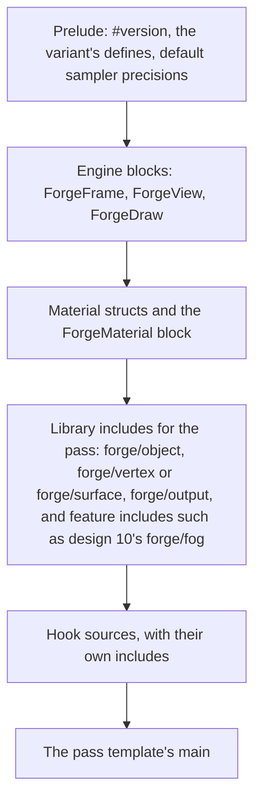

# Design 08: Meshes, Materials and Shaders

|                                       |                                                                                                                                                                                                                                                                                                                                                                                                                                                                                                                                                                                               |
| ------------------------------------- | --------------------------------------------------------------------------------------------------------------------------------------------------------------------------------------------------------------------------------------------------------------------------------------------------------------------------------------------------------------------------------------------------------------------------------------------------------------------------------------------------------------------------------------------------------------------------------------------- |
| **Status**                            | Draft, for review (revised after solution review, §7)                                                                                                                                                                                                                                                                                                                                                                                                                                                                                                                                         |
| **Kind**                              | Feature and refactor                                                                                                                                                                                                                                                                                                                                                                                                                                                                                                                                                                          |
| **Engine version at time of writing** | `0.26.1`                                                                                                                                                                                                                                                                                                                                                                                                                                                                                                                                                                                      |
| **Program**                           | [Forge 3D](./README.md), milestone M3. Material blocks (§6.3) are built in M2, in [05 GPU device layer](./05-gpu-device.md) Phase 3 (decision MS1)                                                                                                                                                                                                                                                                                                                                                                                                                                            |
| **Depends on**                        | [05 GPU device layer](./05-gpu-device.md), [06 Render pipeline](./06-render-pipeline.md)                                                                                                                                                                                                                                                                                                                                                                                                                                                                                                      |
| **Related**                           | [07 2D](./07-2d-on-the-render-pipeline.md) (sprite materials, per-draw textures), [09 Lighting](./09-lighting-and-shadows.md) and [10 PBR](./10-pbr-and-environment-lighting.md) (shading models, shadow bias, fog), [11 glTF](./11-gltf-and-asset-lifetime.md) (mesh and material data), [12 Animation](./12-skeletal-and-morph-animation.md) (skinning and morph variants), [13 Post-processing](./13-post-processing-and-anti-aliasing.md) (prepass normals, alpha-to-coverage), [15 Particles and picking](./15-audio-particles-and-picking-in-3d.md) (instance variants, kept mesh data) |

## 0. Targeted modules

| Path                                                                                          | Change   | Notes                                                                                                                                                                                                  |
| --------------------------------------------------------------------------------------------- | -------- | ------------------------------------------------------------------------------------------------------------------------------------------------------------------------------------------------------ |
| `src/rendering/meshes/` (new)                                                                 | New      | `Mesh`, parts, the position and attribute streams, bounds, the mesh pool, `generateTangents`, primitives                                                                                               |
| `src/rendering/components/mesh-component.ts` (new)                                            | New      | `MeshEcsComponent`, `addMeshComponent`, `updateMeshComponent`, `MeshChangeListEcsComponent`                                                                                                            |
| `src/rendering/meshes/mesh-extraction-system.ts` (new)                                        | New      | GPU scene slots, retained bins and transparent items, from journals and the change list                                                                                                                |
| `src/rendering/materials/`                                                                    | Modified | Render state, variants, pass variants, hooks, `UnlitMaterial`, custom materials, `MaterialTextureBinding`, per-draw textures, texture budgets. Material blocks are built in design 05 Phase 3          |
| `src/rendering/materials/shader-program.ts`                                                   | Modified | Every sampler kind design 05's textures need, with a default texture per kind; block reflection                                                                                                        |
| `src/rendering/shaders/pre-processing/`                                                       | Modified | Material block generation with explicit precision, struct and macro resolution (built in design 05 Phase 3); include names with `/`; program assembly from templates and hooks; `#line` source mapping |
| `src/rendering/shaders/forge/` (new)                                                          | New      | The engine shader library: `forge/frame`, `forge/view`, `forge/object`, `forge/vertex`, `forge/surface`, `forge/output`                                                                                |
| `src/rendering/geometry/`                                                                     | Removed  | `Geometry` replaced by `Mesh`; the shared quad becomes `renderContext.quadMesh`                                                                                                                        |
| `src/rendering/terrain/create-terrain-mesh.ts`                                                | Modified | Builds a `Mesh` instead of a `Geometry`                                                                                                                                                                |
| `src/rendering/fullscreen-pass.ts`                                                            | Modified | Draws one triangle generated from `gl_VertexID`, with no vertex buffer                                                                                                                                 |
| `src/rendering/render-context.ts`                                                             | Modified | `prepare()`; `quadMesh`; the material block buffers; the unused global uniform map removed                                                                                                             |
| `e2e/fixtures/scenes/material-uniform-array.ts`, `material-unused-uniform.ts` and their specs | Modified | Read values back from the material block (in design 05 Phase 3)                                                                                                                                        |
| `e2e/specs/` (new specs)                                                                      | New      | Stage precision, std140 layout, prepass invariance, discarding hooks in shadows, coherent skipping                                                                                                     |
| `AGENTS.md`                                                                                   | Modified | "Test Conventions": the paragraph on `Material` mocks describes blocks (in design 05 Phase 3)                                                                                                          |
| `documentation-site/docs/docs/rendering/`                                                     | Modified | `material-uniforms.md` rewritten (in design 05 Phase 3); new `meshes.md`, `materials.md`, `custom-shaders.md`, `shader-hooks.md`                                                                       |

---

## 1. Summary

Forge can draw quads. A 3D engine needs meshes: indexed vertex data with
several attributes, split into parts that each use a material, with bounds
for culling. It needs materials that carry their render state (opaque,
alpha-tested, blended, double-sided), that compile only the shader
variants actually used, and that work in every pass a mesh is drawn in
(depth prepass, shadow maps, color). And the product owner asked for a
render pipeline a game can hook into with custom shaders.

This design adds:

- **`Mesh`**: positions in one vertex stream and the other attributes
  interleaved in a second, indices, parts, bounds, and one kept CPU copy
  of what was uploaded (for context loss, physics and picking). Small
  static meshes are packed into shared buffers so they can be drawn
  together. Primitives (box, sphere, plane, cylinder, capsule, cone, quad)
  are built in.
- **`MeshEcsComponent`**: a mesh, a material per part, shadow flags,
  `category` and `layer` like sprites, a per-object tint and levels of
  detail. Its fields change through `updateMeshComponent`, which records
  the change for the one extraction system, so a frame in which nothing
  changed does no extraction work.
- **Materials on uniform buffers.** A material's uniforms live in one
  std140 block, uploaded when they change. Custom shaders keep declaring
  loose uniforms; the preprocessor turns them into the block with explicit
  precision, resolved struct and macro types and literal sizes. This part
  is built in M2 with design 05, so the device never needs a loose-uniform
  path.
- **Shader variants and passes.** Features (normal maps, skinning, alpha
  testing) are compile-time defines; each material compiles only the
  variants its meshes and passes use. The `depth`, `depthNormals` and
  `shadow` variants come from the material's own sources, so a vertex
  animation or a discarding hook casts the right shadow.
- **Shader hooks.** A material can supply GLSL functions the engine's
  shaders call at fixed points: vertex, surface, lighting and final color,
  with four custom values passed from the vertex hook to the surface hook.
  A hooked material keeps everything the engine does for it (instancing,
  camera-relative positions, skinning, morphing, lights, shadows, fog).
  Fully custom shaders remain possible, and declare the passes they
  support.
- **No compile hitches.** Pipelines compile in parallel; `prepare()`
  compiles everything a scene (and content not yet spawned) needs behind a
  loading screen; an object whose variants aren't all ready is skipped in
  every pass of the frame instead of stalling it.
- **`UnlitMaterial`**, the first material, with color, texture, vertex
  colors from the mesh, every alpha mode and fog. The PBR material is
  design 10.

---

## 2. Scope

### In scope

- Meshes: vertex formats (including quantized ones), the two vertex
  streams, indices, parts, bounds, the mesh pool, tangent generation,
  flat-normal meshes, primitives.
- The mesh component, its change list and its extraction into design 06's
  retained bins and sorted transparent phase.
- The material system: blocks (specified here, built in design 05 Phase
  3), textures and `MaterialTextureBinding`, sampler kinds, per-draw
  textures, texture budgets, render state, phases, variants, pass variants,
  per-object tint, the `fog` option.
- Shader hooks, custom varyings, custom materials, the engine shader
  library, error source mapping.
- Compilation, coherent skipping and `prepare()`.
- `UnlitMaterial`.
- Removing `Geometry`: the terrain mesh, the full-screen pass and the
  shared quad.

### Out of scope

- **Lit shading models**: design 09 (lights) and 10 (PBR).
- **Skinning and morph data**: design 12 adds the attributes, the
  animation data and the variant bits; this design fixes the order of the
  vertex path.
- **Particle instance streams**: design 15 adds particle instance variants
  of `forge/vertex` and `forge/object`.
- **A shader graph or node editor.** Forge is code-only.
- **Decals, procedural mesh editing.** Games can build meshes from arrays;
  meshes are immutable once created.
- **Mesh compression decoding**: design 11 (Draco and meshopt are glTF
  extensions).
- **Per-object material parameters beyond the tint.** Anything else is a
  different material (decision MS6).

---

## 3. Phases

**Material blocks are built in M2.** §6.3's block generation, its
preprocessor work, the sprite material and today's custom-material demos
on blocks, the rewritten `material-uniform-array` and
`material-unused-uniform` e2e scenes, `material-uniforms.md` and
`AGENTS.md`'s material test guidance ship in design 05 Phase 3. Design 05
moves `Material` onto the device there, and sprites and post-processing,
today's material users, draw through the device from M2 on (designs 07
and 13); building blocks later would need a loose-uniform path in the
device until M3 (decision MS1). The phases below build on it.

### Phase 1: Meshes and unlit materials

Adds meshes, primitive shapes, the mesh component and `UnlitMaterial`,
and removes `Geometry`.

| #   | Task                          | Description                                                                                                                                            | Size |
| --- | ----------------------------- | ------------------------------------------------------------------------------------------------------------------------------------------------------ | ---- |
| 1.1 | `Mesh`                        | §6.1.1 to §6.1.2: creation from arrays, position and attribute streams, indices, parts and their bounds, kept CPU data, `readAttribute`, `readIndices` | M    |
| 1.2 | Primitives                    | §6.1.5: box, sphere, plane (facing `+Y`), cylinder, capsule, cone, quad (facing `+Z`), with normals, UVs and tangents                                  | M    |
| 1.3 | Engine shader library         | §6.7: the six includes; `invariant gl_Position`; include names with `/` (decision MS13)                                                                | M    |
| 1.4 | Mesh component and extraction | §6.2: `updateMeshComponent` and the change list; slots, retained bins, the tint texel, transparent items                                               | L    |
| 1.5 | Sampler kinds                 | §6.3.4: every texture dimension and kind design 05 creates; a default texture per kind                                                                 | S    |
| 1.6 | `UnlitMaterial`               | §6.6: color, texture binding, vertex colors from the mesh, alpha modes                                                                                 | S    |
| 1.7 | `Geometry` removed            | The terrain builds a `Mesh`; full-screen passes draw one triangle from `gl_VertexID`; the shared quad is `renderContext.quadMesh`                      | M    |
| 1.8 | Demo, guides, changelog       | A spinning, textured cube; `meshes.md`, `materials.md`; `#### Added` (meshes, `UnlitMaterial`), `#### Removed` (`Geometry`, `quadGeometry`)            | S    |
| 1.9 | Disposed resources            | `isDisposed` on `Mesh`, `Texture` and `Material`; the extraction check and its diagnostics error (§6.1.1)                                              | S    |

**Definition of done:** the demo runs; 10,000 cubes sharing a mesh and
material draw in one instanced call; changing one cube's tint writes one
GPU scene row and swapping its material moves one slot between bins, with
no per-frame scan (unit tests with design 01's recording GL helper and bin
counters); nothing in `src` uses `Geometry`, and the terrain demo and the
post-processing e2e specs pass; the mesh extraction allocation spec
passes.

### Phase 2: Render state, variants and passes

Adds per-material render state and shader and pass variants, and packs
small meshes into shared buffers for multi-draw.

| #   | Task                     | Description                                                                                                                | Size |
| --- | ------------------------ | -------------------------------------------------------------------------------------------------------------------------- | ---- |
| 2.1 | Render state             | §6.4: blend modes, alpha cutoff, double-sided, depth settings, material depth bias; phase selection                        | M    |
| 2.2 | Variants                 | §6.5.1: variant keys from material, mesh, instance source, pass, pipeline features and target; program and pipeline caches | M    |
| 2.3 | Pass variants            | §6.5.2: `depth`, `depthNormals` and `shadow` variants from the same sources; shadow-pass culling and transparent casters   | M    |
| 2.4 | Mesh pool and multi-draw | §6.1.3: small static meshes packed per layout, indices rebased; design 06 merges their bins in one multi-draw              | M    |
| 2.5 | Changelog                | `#### Added`: render state, pass variants, the mesh pool                                                                   | S    |

**Definition of done:** alpha-tested and double-sided meshes render
correctly in the color, depth and `depthNormals` passes (golden scenes), and
in shadow passes once design 09 lands; the invariance spec (a prepass, then
a color pass with an `equal` depth test) leaves no holes on design 01's
backend matrix (its Phase 6); with `WEBGL_multi_draw`, B1 issues at most one
draw per pipeline and material, and without it at most one per pipeline,
material and mesh part.

### Phase 3: Shader hooks and custom materials

Adds shader hooks and custom materials, so a game can change vertex,
surface or lighting code and keep the engine's passes.

| #   | Task                | Description                                                                                                                                                                | Size |
| --- | ------------------- | -------------------------------------------------------------------------------------------------------------------------------------------------------------------------- | ---- |
| 3.1 | Hooks               | §6.8.1: vertex, surface, light, ambient and final-color hooks; their uniforms join the block; their samplers                                                               | L    |
| 3.2 | Custom varyings     | §6.8.2: `custom0` to `custom3` from the vertex hook to the surface hook                                                                                                    | S    |
| 3.3 | Hooks in every pass | §6.8.3: the vertex hook in every pass; the surface hook in depth and shadow passes for alpha-tested and discarding materials                                               | M    |
| 3.4 | Custom materials    | §6.9: full shaders with declared passes; required includes checked when created                                                                                            | M    |
| 3.5 | Texture budgets     | §6.3.5: a hooked or custom material over its share throws when created                                                                                                     | S    |
| 3.6 | Error mapping       | §6.5.3: compile and link errors name the original file and line through includes and hooks                                                                                 | S    |
| 3.7 | Guides and demos    | `custom-shaders.md`, `shader-hooks.md`; demos: wind on grass (vertex hook), a dissolve (a surface hook that discards, on an opaque material), toon shading (lighting hook) | M    |

**Definition of done:** the three demos run; the dissolve's depth and
`depthNormals` passes match its color pass (golden), and its shadow does
once design 09 lands; a compile error in a hook names the hook's file and
line.

### Phase 4: Compilation without hitches

Compiles variants asynchronously and adds `prepare()`, so a new material
doesn't stall a frame.

| #   | Task                        | Description                                                                                                                         | Size |
| --- | --------------------------- | ----------------------------------------------------------------------------------------------------------------------------------- | ---- |
| 4.1 | Asynchronous variants       | §6.10.1: pipelines compile through design 05's asynchronous path; an item is skipped in every pass until all its variants are ready | M    |
| 4.2 | `prepare()`                 | §6.10.2: every variant the world's cameras, lights and meshes need, plus content not yet spawned                                    | M    |
| 4.3 | Tangent generation          | §6.1.4: `generateTangents`, the MikkTSpace algorithm, on mesh data before a mesh is created                                         | M    |
| 4.4 | Counters                    | Variants compiling and compiled, skipped draws, kept mesh memory, in the stats overlay (design 06)                                  | S    |
| 4.5 | Failed and changed variants | §6.10.1's last-ready variant sets; §6.10.3: failed entries, `failedDraws`, diagnostics, `prepare()`'s aggregate error               | M    |
| 4.6 | Changelog                   | `#### Added`: `prepare()`, `compileContent`, `generateTangents`, levels of detail on meshes                                         | S    |

**Definition of done:** in B5 with `prepare()` awaited, no frame after the
first exceeds the budget because of compilation (measured by the design 01
runner); an object spawned with a new material appears in its color pass,
its prepass and its shadows on the same frame (the coherence spec);
`generateTangents` matches the reference tangents of the glTF sample
tangent test model.

---

## 4. Decision log

| #    | Decision                                            | Options                                                                                                                                                                                                                                                                                                                  | Chosen                                                    | Rationale, trade-offs, assumptions                                                                                                                                                                                                                                                                                                                                                                                                                                                                                                                                                                                                                                                                                                                                                                                                                                                                                                                                                                                                                           |
| ---- | --------------------------------------------------- | ------------------------------------------------------------------------------------------------------------------------------------------------------------------------------------------------------------------------------------------------------------------------------------------------------------------------ | --------------------------------------------------------- | ------------------------------------------------------------------------------------------------------------------------------------------------------------------------------------------------------------------------------------------------------------------------------------------------------------------------------------------------------------------------------------------------------------------------------------------------------------------------------------------------------------------------------------------------------------------------------------------------------------------------------------------------------------------------------------------------------------------------------------------------------------------------------------------------------------------------------------------------------------------------------------------------------------------------------------------------------------------------------------------------------------------------------------------------------------ |
| MS1  | Material uniform storage                            | (a) A std140 block generated from the shaders' loose uniform declarations, built with design 05 Phase 3; (b) shaders declare their own block; (c) loose uniforms uploaded per draw, as today                                                                                                                             | (a)                                                       | One `bindBufferRange` replaces per-draw uploads (design 05 D3), and WebGPU has no loose uniforms. Generation keeps today's shaders valid, since members of a block without an instance name are in global scope. It is more than moving declarations (§6.3.2): the block appears in both stages, so every member gets explicit `highp` (a block shared by two stages must match member precisions or the link fails, and GLSL ES 3.00 gives fragment shaders no default float precision, so Forge's fragment shaders declare `precision mediump float`); struct and macro types are resolved and structs placed before the block; sizes are emitted as literals; and `setUniform` scatters packed values into std140 strides. It is built in M2 because design 05 Phase 3 moves `Material` onto the device, and sprites and post-processing draw materials through it from then on (designs 07 and 13); in M3 it would need a loose-uniform path in the device in between, a compatibility shim. Samplers stay loose: GLSL ES 3.00 can't put them in blocks. |
| MS2  | Extending engine shaders                            | (a) Hooks: functions with fixed signatures the engine's shaders call; (b) patching engine shader text, as Three.js's `onBeforeCompile` does; (c) a node graph                                                                                                                                                            | (a)                                                       | Filament's `material()`/`materialVertex()` and Godot's `vertex()`/`fragment()`/`light()` are hooks. Three.js renders shadows with a separate depth material, so an `onBeforeCompile` patch never reaches them and a patched material casts the unpatched shape's shadow; patches also break with every engine change. Hooks are stable API, and the engine compiles them into every pass. A node graph is an editor feature, and Forge is code-only.                                                                                                                                                                                                                                                                                                                                                                                                                                                                                                                                                                                                         |
| MS3  | Feature variation                                   | (a) Compile-time defines, compiled on demand per used combination; (b) one shader with runtime branches for everything                                                                                                                                                                                                   | (a), with runtime branches for cheap per-material toggles | Texture fetches, skinning and normal mapping cost real time when compiled in but unused, and some can't be branched around on mobile. On-demand compilation means only combinations a scene uses ever compile. Cheap toggles (a factor that's 0 or 1) stay uniforms so they don't multiply variants.                                                                                                                                                                                                                                                                                                                                                                                                                                                                                                                                                                                                                                                                                                                                                         |
| MS4  | Depth, depth-normals and shadow variants            | (a) Generated from the material's own sources with a pass define; (b) one generic depth shader for every material                                                                                                                                                                                                        | (a)                                                       | Vertex hooks, skinning, morphing, alpha testing and hooks that discard all change what these passes must write. A generic shader would be wrong for each. Godot does the same: when a material's fragment code discards, its depth and shadow passes run that code.                                                                                                                                                                                                                                                                                                                                                                                                                                                                                                                                                                                                                                                                                                                                                                                          |
| MS5  | Fully custom shaders and passes                     | (a) A custom material lists the passes it supports, with sources for each; others skip it; (b) the engine guesses a depth shader                                                                                                                                                                                         | (a)                                                       | The engine can't derive a shadow shader from an arbitrary vertex shader. Explicit is predictable: a custom material that lists no shadow pass casts no shadow, and the guide says so. Its `depth` sources also compile the `depthNormals` variant with the pass define, so ambient occlusion needs nothing more from it.                                                                                                                                                                                                                                                                                                                                                                                                                                                                                                                                                                                                                                                                                                                                     |
| MS6  | Per-object variation without breaking batches       | (a) A tint in the GPU scene's object data, multiplied by the material's base color and alpha; (b) a material per variation                                                                                                                                                                                               | (a)                                                       | A crowd of differently colored objects stays one instanced draw. Design 06 §6.7.2 owns the object layout; the tint is its texel 4. Anything beyond a tint is a different material, as in every engine.                                                                                                                                                                                                                                                                                                                                                                                                                                                                                                                                                                                                                                                                                                                                                                                                                                                       |
| MS7  | Small static meshes                                 | (a) Packed into shared vertex and index buffers per layout, indices rebased; (b) a buffer set per mesh                                                                                                                                                                                                                   | (a), for meshes under 64 K vertices without morph targets | Shared buffers let different meshes with the same material draw in one multi-draw (design 06), and save buffer binds. Large meshes keep their own buffers. Morphed meshes keep their own too (design 12 AN25): their shader finds deltas by `gl_VertexID`, which is the mesh's own index only in its own buffer.                                                                                                                                                                                                                                                                                                                                                                                                                                                                                                                                                                                                                                                                                                                                             |
| MS8  | Missing tangents                                    | (a) `generateTangents` (MikkTSpace) runs on mesh data before a mesh is created, and importers always run it; a normal-mapped material on a mesh without tangents uses a tangent frame from screen-space derivatives and warns once; (b) require tangents; (c) generate them when a mesh is first drawn with a normal map | (a)                                                       | glTF says clients SHOULD generate MikkTSpace tangents when a normal-mapped primitive has none, and tools bake normal maps against them. MikkTSpace works per triangle corner and then re-welds vertices, so it changes the vertex count and the indices: it must run before the mesh's buffers and pool range exist. (c) would rebuild meshes mid-game. The derivative frame is the path flat-normal meshes already use (§6.1.4), so the fallback adds no new shader path.                                                                                                                                                                                                                                                                                                                                                                                                                                                                                                                                                                                   |
| MS9  | CPU copies of mesh data                             | (a) One copy of what was uploaded (the two streams and the indices), de-interleaved on read; (b) separate per-attribute copies; (c) dropped after upload, or droppable by the game                                                                                                                                       | (a)                                                       | Context loss (design 05), mesh colliders (design 14) and triangle picking (design 15) need it. The uploaded bytes are the least memory that still restores the GPU buffers; `readAttribute` de-interleaves and dequantizes into the caller's array. A mesh whose data could be dropped would make context loss fail silently, so there is no such path. The kept memory is listed in the stats overlay.                                                                                                                                                                                                                                                                                                                                                                                                                                                                                                                                                                                                                                                      |
| MS10 | Compile hitches                                     | (a) Parallel compilation, `prepare()`, and skipping an item in every pass until all the variants it needs this frame are ready; (b) compile synchronously on first use                                                                                                                                                   | (a)                                                       | Bevy's pipeline cache, Three.js's `compileAsync` and Babylon's `whenReadyAsync` work the same way. A synchronous compile of a PBR variant takes tens of milliseconds on some devices, a visible stutter. Skipping per pass instead of per item would draw an object missing from the prepass depth (so what's behind it can draw over it, and depth-based effects miss it), or an object without its shadow; skipping as a unit keeps the passes consistent.                                                                                                                                                                                                                                                                                                                                                                                                                                                                                                                                                                                                 |
| MS11 | Detecting changes to mesh components                | (a) Fields are read-only; `updateMeshComponent` writes them, stamps the component and appends the entity to a change list the extraction drains; (b) changes replace the component, seen through journals; (c) compare every component with what was last extracted, every frame                                         | (a)                                                       | (c) scans every mesh each frame (50,000 in B1), against design 06's "a frame in which nothing changed does no bin work". (b) works for mesh extraction, but every other system declaring `meshId` (design 12's deformation extraction, design 15's picking) would see a removal and an addition and rebuild what it keeps, and each change allocates a component. (a) costs time proportional to the changes and only the extraction reads the list. Unity's and Godot's renderer properties are setters that notify the renderer for the same reason. It follows design 03 E3: the mesh module owns its component's change record.                                                                                                                                                                                                                                                                                                                                                                                                                          |
| MS12 | Who owns depth bias                                 | (a) The material's `depthBias` is rasterizer state of its color, depth and `depthNormals` variants; the shadow pass's bias belongs to the light and is applied from the light's data; (b) both feed the shadow variant's rasterizer state                                                                                | (a)                                                       | (b) gives the shadow pass two writers, and putting each light's bias in pipeline state multiplies shadow pipelines by lights. Bevy and Unity apply light shadow bias from per-light data in shaders. The material's bias is for coplanar geometry (decals, overlays) and must be identical in the prepass and the color pass, or the prepass depth wouldn't match.                                                                                                                                                                                                                                                                                                                                                                                                                                                                                                                                                                                                                                                                                           |
| MS13 | Engine include names                                | (a) Path-like names (`forge/view`), with the include pattern widened to the characters `#pragma forge name` accepts; (b) camelCase names (`forgeView`)                                                                                                                                                                   | (a)                                                       | The include resolver accepts only `\w+` (`resolve-includes-pre-processor.ts:79`), while a shader's name may contain `.`, `-` and `/` (`tone-mapping.frag` can be named but not included), which is a defect of its own. A path prefix namespaces engine includes the way Bevy's `bevy_pbr::` imports do, and designs 09, 10, 12 and 15 already use these names. The `forge/` prefix is reserved.                                                                                                                                                                                                                                                                                                                                                                                                                                                                                                                                                                                                                                                             |
| MS14 | Struct- and macro-typed uniforms                    | (a) Parse struct definitions and lay them out in the block; resolve a macro type from its one unconditional `#define`; throw otherwise; (b) reject both, with a changelog note                                                                                                                                           | (a)                                                       | `material.ts:28-31` documents both as supported. An array of structs is the natural way to pass several waves or lights to a custom shader, and WGSL supports structs in uniform buffers, so a later backend keeps them. Parsing a struct is the same work as parsing a uniform statement. A macro type defined under `#if` could change per variant and so change the block layout, but a material has one block for all its variants, so only one unconditional definition is accepted. Struct members also become settable before the program links.                                                                                                                                                                                                                                                                                                                                                                                                                                                                                                      |
| MS15 | Textures that change per draw                       | (a) Draw textures, declared by the material kind and bound in bind group 3 (a sprite batch's texture and emissive map); (b) a material per texture; (c) rebinding group 2 per draw                                                                                                                                       | (a)                                                       | Bind group 2 is per material (design 05 D4). One sprite material serves sprites with different textures today (`sprite-material.ts:101-115`); (b) would break that and multiply blocks. Bevy's sprite pipeline binds each image as its own bind group per batch, the same split.                                                                                                                                                                                                                                                                                                                                                                                                                                                                                                                                                                                                                                                                                                                                                                             |
| MS16 | Vertex streams                                      | (a) Positions in their own buffer, the other attributes interleaved in a second; (b) everything interleaved in one buffer                                                                                                                                                                                                | (a)                                                       | Depth and shadow variants without hooks, skinning or alpha testing read only positions. B5 runs 13 such passes on its first frame (the prepass, four cascades, eight spot lights' tiles) and 5 on later frames (the prepass and four cascades; cached spot tiles render only when invalidated, design 09 §6.5.6), so they fetch 12 bytes per vertex instead of the full stride (typically 32 to 60 bytes). Color passes bind both streams, which costs one more binding in a cached vertex array. Unreal keeps a position-only stream for depth passes for the same reason.                                                                                                                                                                                                                                                                                                                                                                                                                                                                                  |
| MS17 | Values from the vertex hook to the surface hook     | (a) Four `vec4` slots, `custom0` to `custom3`, interpolated only when a hook uses them; (b) varyings declared in hook sources; (c) none                                                                                                                                                                                  | (a)                                                       | Filament's `custom0`–`custom3` and Unity's custom interpolators are fixed slots. They keep hook signatures fixed and map directly to WGSL locations. Godot's `varying` (b) needs the preprocessor to match declarations across stages for every variant. Four slots plus the engine's own varyings stay within WebGL2's guaranteed 15 vectors.                                                                                                                                                                                                                                                                                                                                                                                                                                                                                                                                                                                                                                                                                                               |
| MS18 | Shadows of transparent materials                    | (a) `blend` and `premultiplied` materials cast alpha-tested shadows at `alphaCutoff`; `additive` and `multiply` cast none; (b) all cast as opaque; (c) none cast                                                                                                                                                         | (a)                                                       | A fading object loses its shadow as it fades, a pane of glass at low alpha casts none, and the opaque parts of hair cards cast. Additive and multiplied surfaces add or filter light rather than block it. Trade-off: no colored or partial shadows; a game turns casting off per mesh with `castsShadows`.                                                                                                                                                                                                                                                                                                                                                                                                                                                                                                                                                                                                                                                                                                                                                  |
| MS19 | Primitive orientation                               | (a) The plane faces `+Y`, the quad faces `+Z`, round shapes run along `Y`; (b) everything with a front faces `+Z`                                                                                                                                                                                                        | (a)                                                       | A plane is a floor: Unity's, Godot's and Bevy's planes face `+Y`. A quad is a card that looks at the default camera, like a model's front (design 04 X10). Cylinders, capsules and cones run along `Y` like design 14's colliders, so a physics capsule and a capsule mesh line up.                                                                                                                                                                                                                                                                                                                                                                                                                                                                                                                                                                                                                                                                                                                                                                          |
| MS20 | A hooked or custom material over its texture budget | (a) Creating it throws, naming the counts; (b) drop samplers; (c) pack textures                                                                                                                                                                                                                                          | (a)                                                       | The engine can't tell which of a hook's samplers matter, so it can't drop one the way design 10 drops `PbrMaterial`'s optional extension maps (PB5). Its samplers are known when it's created, so the error comes then, not on some device mid-game.                                                                                                                                                                                                                                                                                                                                                                                                                                                                                                                                                                                                                                                                                                                                                                                                         |

---

## 5. Open questions

In priority order.

1. **Mesh pool limits.** 64 K vertices per packed mesh keeps 16-bit
   indices possible per mesh, but the pool needs 32-bit indices. Options:
   (a) one 32-bit index buffer per pool; (b) 16-bit index buffers in pool
   segments of 64 K vertices, which halves index memory but splits
   multi-draws at segment boundaries. Proposal: (a), confirmed with B1's
   memory measurements.
2. **Two-sided shadow casting.** Shadow casters cull like their color pass
   (§6.4.2), so a room built from single-sided planes facing inwards lets
   the sun through its walls. Options: (a) a double-sided material or
   closed geometry, as now; (b) a two-sided casting mode on the mesh
   component, as Unity and Godot offer. Proposal: (a), and add (b) if a
   demo or game needs it.

---

## 6. Design

### 6.1 Meshes

#### 6.1.1 Creation

```ts
const mesh = createMesh(renderContext, {
  attributes: {
    position: { format: 'float32x3', data: positions },
    normal: { format: 'float32x3', data: normals },
    uv0: { format: 'float32x2', data: uvs },
  },
  indices: indexArray, // Uint16Array or Uint32Array; optional
  parts: [{ start: 0, count: indexArray.length, topology: 'triangle-list' }],
  label: 'crate',
});
```

- **Attributes** (names are the engine's semantics, at design 05's fixed
  locations): `position`, `normal`, `tangent` (`vec4`, w is handedness),
  `uv0`, `uv1`, `color0`, `joints0`, `weights0`, and design 12's `joints1`
  and `weights1`. Any vertex format design 05 supports. Quantized formats
  from glTF's `KHR_mesh_quantization` upload without expanding, and the
  extension puts dequantization in the node's transform (design 11):
  - **Normalized** formats (`snorm16x4`, `unorm8x2`, ...) need no shader
    variant: vertex fetch converts them to floats.
  - **Unnormalized integer** positions, `uv0` and `uv1` (`uint16x4`,
    `sint8x2`, ...) are read as integers on both backends, since WebGPU
    has no format that reads integers as floats (design 05 §6.5). Each is
    a mesh feature (integer, signed or unsigned, per attribute); its
    variants declare the input as `uvec` or `ivec`, and `forge/vertex`
    converts it to floats, one instruction (design 11 GA25).

  The vertex layout is part of the pipeline descriptor (design 05 §6.5).

- **Parts** are index ranges (or vertex ranges for a non-indexed mesh)
  with a topology. Each is drawn with the material in the matching slot of
  the mesh component, and has its own local bounds, so design 06 could
  cull the parts of a large mesh one by one; design 06 culls per slot
  today (§6.8 there), and design 11's open question 2 proposes per-part
  culling.
- **Bounds**: a local `BoundingBox` and `BoundingSphere` per mesh and per
  part, computed at creation from the positions as the shader reads them
  (design 02).
- Meshes are immutable. A different shape is a different mesh.
- `mesh.dispose()` releases the GPU buffers, the pool range and the CPU
  copy, and sets `mesh.isDisposed`. `Texture` and `Material` have the
  same flag. Extraction systems check it once per bin, item or batch key
  (not per instance); a component that still draws a disposed resource is
  skipped and raises a diagnostics error (README §4.6) naming the entity,
  the component and the resource's label, instead of binding a deleted
  GL object.

`createMesh` throws for attributes of different vertex counts, an index
out of range, a part outside the indices, or an unknown semantic or
format, naming the mesh's label.

#### 6.1.2 Streams and CPU data

A mesh has two vertex streams (decision MS16):

- **positions**, alone, tightly packed;
- **attributes**: every other attribute, interleaved in one buffer, which
  is faster to fetch than one buffer per attribute.

Depth and shadow variants that read only positions bind only the first
stream. The vertex array for each (pipeline layout, buffers) pair is
cached by design 05.

The mesh keeps one CPU copy: the bytes of both streams and the indices, as
uploaded (decision MS9). `mesh.readAttribute(semantic, out?)` de-interleaves
an attribute and dequantizes it into a `Float32Array` (or the given
array), and `mesh.readIndices()` returns the indices. Design 14's mesh
colliders and design 15's picking read through them.

#### 6.1.3 The mesh pool

Meshes under 64 K vertices without morph targets (decision MS7) are packed
into shared buffers per vertex layout: a position buffer, an attribute
buffer and a 32-bit index buffer, with each mesh's indices rebased by its
first vertex when packed (WebGL2 has no base vertex, design 05 §6.8).
Parts of different meshes in one pool, drawn with the same pipeline and
material, merge into one multi-draw when `WEBGL_multi_draw` exists
(design 06 §6.6.3). Freed ranges are reused; the pool grows by
reallocating a buffer and copying from the kept CPU data.

#### 6.1.4 Normals and tangents

- **Flat normals.** A mesh without a `normal` attribute has the
  flat-normals mesh feature. Its fragment shaders compute the normal from
  the screen-space derivatives of the camera-relative position, and, when
  normal mapped, the tangent frame from the derivatives of the UVs. A
  `tangent` attribute on such a mesh is ignored. This is what glTF
  requires of primitives without normals ("MUST calculate flat normals"),
  and how design 11 (GA10) imports them. In the vertex hook,
  `vertex.normal` is zero for these meshes.
- **Generated tangents.** `generateTangents(data)` takes the arrays
  `createMesh` accepts and returns new arrays, with MikkTSpace tangents and
  the vertices split and re-welded as the algorithm requires. It runs
  before `createMesh`, because it changes the vertex count and the indices
  (decision MS8); morph target deltas and every other attribute are
  re-indexed with it. Design 11 runs it in its worker for every
  normal-mapped primitive without `TANGENT`.
- **Missing tangents.** A normal-mapped material drawn on a mesh with
  normals but no tangents uses the derivative tangent frame and warns
  once, naming the mesh and the material.

#### 6.1.5 Primitives

| Function             | Shape and defaults                                                         |
| -------------------- | -------------------------------------------------------------------------- |
| `createBoxMesh`      | Size 1 × 1 × 1, centered                                                   |
| `createSphereMesh`   | Radius 0.5                                                                 |
| `createPlaneMesh`    | 1 × 1 in XZ, facing `+Y`                                                   |
| `createQuadMesh`     | 1 × 1 in XY, facing `+Z`                                                   |
| `createCylinderMesh` | Radius 0.5, height 1, along `Y`, centered                                  |
| `createCapsuleMesh`  | Radius 0.5, height 2 tip to tip, along `Y`                                 |
| `createConeMesh`     | Radius 0.5, height 1, along `Y`, centered on its half height, apex at `+Y` |

All produce normals, UVs and analytic tangents, with UVs following glTF's
convention (design 11) so a texture looks the same on a primitive and on
an imported model. The orientations follow decision MS19, and the round
shapes match design 14's `createCapsuleShape`, `createCylinderShape` and
`createConeShape` with the same defaults. Each takes options for its
dimensions and segment counts.

### 6.2 The mesh component

#### 6.2.1 Component and changes

```ts
interface MeshEcsComponent {
  readonly mesh: Mesh;
  readonly materials: readonly Material[];   // one per part; a single material applies to all parts
  readonly castsShadows: boolean;            // default true
  readonly receivesShadows: boolean;         // default true
  readonly category: number;                 // matched against cameras' cullingMask, default 1
  readonly layer: number;                    // transparent ordering, as for sprites, default 0
  readonly tint: Color;                      // per-object multiplier, default white
  readonly levelsOfDetail: readonly MeshLevelOfDetail[]; // default none
  /** The change tick of the last updateMeshComponent call; 0 if none. */
  readonly changedTick: number;
  /** Output: the last frame culling found it in a camera view, a shadow view, or among a kept cached shadow tile's casters (designs 06, 09, 12). Written only by the render pipeline. */
  readonly lastVisibleFrame: number;
}

addMeshComponent(world, entity, options: MeshOptions): MeshEcsComponent;
updateMeshComponent(world, entity, changes: Partial<MeshOptions>): void;
```

Game code and design 11's model instantiation write the component's
inputs; mesh extraction reads them. Writes go through
`updateMeshComponent` (decision MS11), which:

1. validates the result (one material, or one per part of the mesh and of
   each level of detail that has no materials of its own) and throws
   otherwise;
2. writes the given fields;
3. stamps `changedTick` with the world's current change tick (design 03
   §6.3);
4. appends the entity to `MeshChangeListEcsComponent.entities`, the
   singleton `registerRendering` adds (design 06 §6.1). Without the
   singleton (rendering not registered yet) it skips this step; the
   extraction's first run sees every mesh in its `added` journal anyway.

The fields are `readonly` in the type, so a write in place doesn't
compile. `Color` is immutable, so a tint can't be changed in place either.
Replacing the whole component with `addMeshComponent` still works and is
seen through journals, but every system that declares `meshId` then
rebuilds what it keeps for that entity, so the guide recommends
`updateMeshComponent`.

The change list is a single-consumer queue (design 03 §6.5):
`updateMeshComponent` appends, the extraction
reads it once per run and empties it. An entity may appear more than once;
the extraction handles it once, by comparing `changedTick` with the stamp
it last consumed for the slot.

#### 6.2.2 Extraction

The mesh extraction system runs in the `render` stage (design 03), after
light extraction (design 09), and declares `query: [meshId, transformId]`.
It keeps nothing itself: slots, bins and the stamps it consumed are the
GPU scene's, a derived cache on the render context per world (design 06
§6.7). Per run:

```text
for entity in removed: free its slot; remove its parts from their bins and the transparent list
for entity in added:   allocate a slot; give the GPU scene its local bound and receivesShadows; write its
                       tint (texel 4); put each part in the bin of its phase (opaque, alphaTested, and
                       shadowCaster when it casts) or the transparent list
for entity in the change list, then empty the list:
  skip it if it isn't alive, has no slot, or its changedTick equals the slot's consumed stamp
  compare with the slot's record and do only what changed:
    mesh or levelsOfDetail -> re-bin every part; give the GPU scene the new local bound; update the LOD table
    materials              -> re-bin the parts whose material changed
    castsShadows           -> add to or remove from the shadowCaster bins
    receivesShadows        -> give the GPU scene the new value (it writes texel 3)
    tint                   -> mark texel 4 of the row dirty
    category               -> update the slot's culling category
  record the consumed stamp
for each material whose featureKey changed since its bins resolved it:
  re-resolve those bins' pipeline variants (work per bin, not per slot)
per view, after culling (design 06 §6.8):
  push each visible slot's transparent parts into the transparent phase, with design 07 §6.3's sort keys
```

- Opaque, alpha-tested and shadow-caster items live in design 06's
  retained bins; nothing is pushed per frame for GPU-scene slots (design
  06 R14). A
  frame in which nothing was added, removed or changed does no bin work.
- Transparent parts are kept in a list of slots that have one, so the
  per-view push costs time proportional to transparent content, not to
  the scene. `layer` is read there, which is why changing it needs no
  retained work. A transparent item's keys are design 07 §6.3's, shared
  with sprites, text and emitters: layer, world order, then depth measured
  at the bounds' center, or at the nearest ancestor with
  `DrawOrderEcsComponent.depthGroup` (design 07 S14), far first.
- Which phase a part goes to comes from its material (§6.4.1).
- A slot's mesh features (normals, tangents, `color0`, `uv1`, flat
  normals), plus design 12's skinning and morph bits, select its pipeline
  variants (§6.5.1).
- Texel 4 of design 06's object data is the tint, converted to linear
  (`Color.linear`, design 07 §6.6.2); the extraction is its only writer.
- Texel 3 and the world culling sphere are the GPU scene's (design 06
  §6.7.2): it writes texel 3 from `receivesShadows`, which this extraction
  supplies, and design 12's deformation record index and mirrored flag,
  and it builds the sphere from the local bound this extraction (or design
  12's, for deformed slots) supplies.

#### 6.2.3 Levels of detail

```ts
interface MeshLevelOfDetail {
  mesh: Mesh;
  screenHeight: number; // below this fraction of the viewport's height, use this mesh
  materials?: readonly Material[]; // default: the component's, by part index
}
```

Design 06 §6.8.4 picks a level per view. A level whose mesh has a
different number of parts from the component's mesh must give its own
`materials`; `addMeshComponent` and `updateMeshComponent` throw otherwise.
Separate materials per level is how Unity's level-of-detail groups work,
and lets a distant level use a cheaper material. `prepare()` compiles the
variants of every level.

### 6.3 Materials and their blocks

#### 6.3.1 What a material is

A material is a shader (sources, or an engine material with hooks), its
parameter values in a block, its textures, and its render state. It has:

- a **block**: a CPU copy of its `ForgeMaterial` uniform block, uploaded
  when it changes; `version` counts writes;
- a **`featureKey`**: an interned integer for the features that select a
  variant (which texture slots are bound, alpha mode, hooks); it changes
  only when a feature does, and design 06's bins compare it for inequality;
- **render state** (§6.4).

`Material`'s constructor (a vertex and a fragment shader, drawn by
whatever pass draws it, such as design 06's `drawFullscreen`) keeps its
signature. `material.dispose()` frees its block range; materials a model
creates are disposed with the model (design 11).

#### 6.3.2 Generating the block

This section is built in design 05 Phase 3 (decision MS1).

When a material's program is prepared, the preprocessor removes every
loose non-sampler `uniform` declaration from both stages and emits one
block, identical in both stages. A fragment shader as written (its vertex
shader declares `u_tint` too):

```glsl
#version 300 es
#pragma forge name(waves.frag)
precision mediump float;

#define WAVE_COUNT 4
struct Wave { vec2 direction; float amplitude; };
uniform Wave u_waves[WAVE_COUNT];
uniform vec4 u_tint;
uniform sampler2D u_texture;
```

The same stage, prepared:

```glsl
#version 300 es
// engine prelude: variant defines, default precisions for sampler types without one
precision mediump float;

#define WAVE_COUNT 4
struct Wave { highp vec2 direction; highp float amplitude; };
layout(std140) uniform ForgeMaterial {
  Wave u_waves[4];
  highp vec4 u_tint;
};
uniform sampler2D u_texture;
```

The rules:

- **Precision.** Every float and integer member, and every member of a
  struct the block uses, is declared `highp`; `bool` takes no qualifier. A
  block shared by two stages must match member precisions or the link
  fails (the Mesa linker enforces it, and dEQP tests it), and twelve of
  the engine's fragment shaders declare `precision mediump float` (for
  example `src/rendering/shaders/sprite/sprite.frag.glsl:5`) while vertex
  shaders default to `highp`. GLSL ES 3.00 guarantees `highp` in fragment
  shaders, and std140 stores 32-bit values regardless.
- **Struct types** are parsed from their `struct Name { ... };`
  definitions, members with types and sizes, nested structs included
  (decision MS14). Both stages must define a struct the block uses the
  same way, or the material throws; a stage without the definition gets
  it. An inline `uniform struct { ... } name;` throws, asking for a
  separate `struct` statement.
- **Macro types** (`uniform TINT_TYPE u_tint;`) resolve when the prepared
  source has exactly one `#define TINT_TYPE <type>`, outside any `#if`;
  otherwise creating the material throws, naming the uniform and the rule.
- **Sizes** are emitted as integer literals, resolved from literals,
  `#define`s and `const int`s as the parser does today.
- **Where it goes.** The block replaces the first loose declaration. A
  struct the block uses that is defined later in the stage moves to just
  before the block, with the structs it depends on, in dependency order.
  Moving a definition earlier can't break code that uses it, and with
  literal sizes the definition depends on nothing but other structs. A
  struct defined before that point stays where it is. In programs
  assembled from hooks, the engine's template places the block (§6.5.3).
- **`#if` branches** aren't evaluated, as today: a uniform declared in any
  branch becomes a member. So a block's layout doesn't depend on the pass,
  the mesh or the view, and one block serves every variant the material
  compiles. Only a change of the material's own features (design 10's
  extension objects) can change it.
- **Reserved names.** Members of blocks without an instance name share
  the global scope, so a material uniform named `forge_...` or a game block
  named `Forge...` throws when the material is created (it would collide
  with the engine's `ForgeFrame`, `ForgeView` and `ForgeDraw` members). A
  game shader that declares its own uniform block throws too, since the
  device binds only the blocks its layouts name (design 05 §6.6).
- A block larger than `MAX_UNIFORM_BLOCK_SIZE` (at least 16 KB) throws,
  naming its size.

The engine prelude, inserted after `#version` with the variant's defines,
declares a default precision (`highp`) for the sampler types GLSL ES 3.00
gives none (`sampler3D`, the array, shadow and integer samplers), so the
sampler kinds of §6.3.4 compile without one in game code.

#### 6.3.3 Layout and `setUniform`

The material lays the block out by std140 from the declarations:

| Member                         | Alignment | Size                                     |
| ------------------------------ | --------- | ---------------------------------------- |
| `float`, `int`, `uint`, `bool` | 4         | 4 (`bool` stored as 0 or 1)              |
| 2-component vectors            | 8         | 8                                        |
| 3-component vectors            | 16        | 12 (a following scalar can use the rest) |
| 4-component vectors            | 16        | 16                                       |
| `matC` and `matCxR`            | 16        | C columns, each padded to 16 bytes       |
| Array of N elements            | 16        | N × the element size rounded up to 16    |
| Struct                         | 16        | Its members, rounded up to 16            |

- `setUniform` keeps taking **packed** values, as today: 4 floats for a
  `float[4]`, 12 for a `vec3[4]`, 9 for a `mat3` (or design 02's `Matrix3`
  and `Matrix4`). The material validates them as today and scatters them
  into the block's padded strides.
- Struct members are set by name (`u_waves[2].amplitude`), and are known
  from the parsed definition, so they can be set before the program links
  (today they can't be until it does). A struct can't be set by its own
  name.
- `setUniform` **copies** the value into the block and bumps `version`.
  Today a typed array is kept and read when the material is bound, so
  changing it afterwards changes what's drawn; now the game calls
  `setUniform` again. The changelog says so. Per-frame values such as time
  come from the frame block (`forge/frame`).
- A shorter array updates the leading elements; the rest keep the
  material's own earlier values (zero until set). Today they can show
  another material's values when materials share a program.
- `setColorUniform` writes `color.linear` (design 07 §6.6.2), since
  shaders work in linear.

#### 6.3.4 Textures

- **Material textures** are loose sampler uniforms, set with
  `setUniform(name, texture)` or through an engine material's slots, and
  bound in bind group 2 (design 05 §6.6).
- **`MaterialTextureBinding`** is what engine materials' slots accept
  (`UnlitMaterial` here, `PbrMaterial` in design 10), carrying glTF's
  `texCoord` and `KHR_texture_transform`:

  ```ts
  interface MaterialTextureBinding {
    texture: Texture;
    uvSet: 0 | 1; // reads uv0 or uv1
    transform: TextureTransform | null; // KHR_texture_transform
  }

  interface TextureTransform {
    offset: Vector2; // default (0, 0)
    rotation: number; // radians, as KHR_texture_transform defines it; default 0
    scale: Vector2; // default (1, 1)
  }
  ```

  A bare `Texture` means `uvSet: 0` and no transform. A transform is
  composed on the CPU as the extension specifies (translation × rotation ×
  scale) into a 2 × 3 matrix stored in the block, and `uvSet: 1` and a
  transform are each a variant bit for that slot, so slots without them
  cost nothing (design 10 §6.2.4).

- **Sampler kinds.** Materials and hooks accept `sampler2D`,
  `sampler2DArray`, `samplerCube` and `sampler3D`, their `isampler` and
  `usampler` forms, and `sampler2DShadow`, `sampler2DArrayShadow` and
  `samplerCubeShadow`. `setUniform` checks the texture's dimension and
  sample type (float, integer, depth with a comparison sampler) against
  the declaration. An unset sampler gets a default texture of its kind,
  created on first use (black for float kinds, as `blackTexture` is today;
  zero for integer kinds; for shadow kinds, the far value of the device's
  depth convention: 0 with reversed depth, 1 otherwise, so it compares as
  lit under both, design 09 L13). Today only
  `sampler2D` is accepted (`shader-program.ts:22`, `:345`), because a
  single 2D default can't stand in for the others. Sampler arrays stay
  rejected: GLSL ES 3.00 indexes them only with constant expressions, so
  one uniform per texture loses nothing.
- **Draw textures** (decision MS15). A material kind can declare samplers
  whose texture changes per draw within one material. `SpriteMaterial`
  declares `u_texture` and `u_emissiveTexture`: the sprite extraction
  (design 07) binds each batch's pair in bind group 3, with the bind group
  cached per texture pair on the render context. `setUniform` on a draw
  texture throws, as it does today.

#### 6.3.5 Texture budgets

Design 05 §6.6 reserves at most seven fragment units for the engine, which
leaves a material at least 9 on a 16-unit device, and more where the
device reports more. The material's share covers its own textures and its
kind's draw textures. Vertex-stage samplers (a texture a vertex hook
reads) come from the vertex budget, after the engine's (the GPU scene, the
object index list, and design 12's animation data and morph deltas).

- `UnlitMaterial` uses at most one unit.
- A hooked or custom material whose required samplers exceed either
  share throws when it's created, naming the counts (decision MS20).
- `PbrMaterial`'s core maps and hook samplers are required in the same
  way; its optional extension maps are dropped in design 10's order when
  they don't fit (PB5).

#### 6.3.6 Uploads and binding

- Every material's block lives in a shared uniform buffer on the render
  context, at an offset aligned to `UNIFORM_BUFFER_OFFSET_ALIGNMENT`. The
  material's CPU block is a view into the render context's CPU mirror of
  that buffer, so `setUniform` writes straight into it and marks the range
  dirty.
- Dirty ranges are uploaded once per buffer before the first pass that
  reads them (design 05 D9). A block that didn't change isn't uploaded.
- Binding a material is one `bindBufferRange` to the `ForgeMaterial`
  binding point and its textures; there are no `uniform*` calls in the
  draw path. Sampler units are set once at link time (design 05 §6.6).
- **Per-pass block instances.** A material has one block, so a material
  drawn by several views with different values (a post effect on two
  cameras at different strengths, bloom and blur texel sizes for views of
  different sizes) would see the last view's values in every view.
  `PassContext.writeMaterialBlock(material, write)` copies the material's
  block into the view's per-frame staging (design 05 D9), lets `write`
  set values in the copy, and binds that range to `ForgeMaterial` at an
  aligned offset; the material's own block is unchanged. Engine passes
  (bloom, blur, output) and `createPostEffect` (design 13 §6.10) use it.
- `RenderContext`'s unused global uniform map
  (`setGlobalUniformValue`, `render-context.ts:98`, `:491-500`; used only
  in its own test) is deleted. Per-frame and per-view values live in the
  engine's frame and view blocks.

### 6.4 Render state and phases

#### 6.4.1 Fields

| Field                     | Values                                                                         | Phase         |
| ------------------------- | ------------------------------------------------------------------------------ | ------------- |
| `blendMode`               | `'opaque'`                                                                     | `opaque`      |
|                           | `'mask'` (alpha tested against `alphaCutoff`, default 0.5)                     | `alphaTested` |
|                           | `'blend'` (straight alpha over), `'premultiplied'`, `'additive'`, `'multiply'` | `transparent` |
| `doubleSided`             | Culling off; back faces get flipped normals and tangent frames                 |               |
| `depthWrite`, `depthTest` | Defaults follow the blend mode (transparent: test, no write)                   |               |
| `depthBias`               | Constant and slope-scaled, for coplanar geometry (decals, overlays)            |               |

- An opaque material whose surface hook discards draws in the
  `alphaTested` phase (§6.8.3).
- Blend modes map to design 05's named blend states, which keep the
  premultiplied-destination contract (`AGENTS.md`).
- In a view with a depth prepass (design 06 R13), opaque and alpha-tested
  color variants test depth for equal-or-nearer (`less-equal`, or
  `greater-equal` with reversed depth) and don't write it. `invariant
gl_Position` (§6.7) makes the comparison exact. Alpha-tested color
  variants keep their alpha test, so a fragment the prepass discarded is
  discarded again instead of drawing over what's behind it.

#### 6.4.2 Depth bias and shadow casting

- **Depth bias** (decision MS12). The material's `depthBias` is rasterizer
  state of its `color`, `depth` and `depthNormals` variants, identical in
  all three so prepass depth matches the color pass. Shadow variants never
  use it. The shadow pass's bias belongs to the light (design 09's
  `depthBias` and `normalBias`) and is applied from the light's data, not
  as pipeline state, so shadow pipelines don't multiply by lights.
- **Culling.** Shadow variants cull like the material's color variant:
  back faces unless `doubleSided`, with the winding flipped for mirrored
  objects (design 06 §6.6.1). Open question 2 covers single-sided walls.
- **Which materials cast** (decision MS18): `opaque` and `mask` materials
  cast; `blend` and `premultiplied` cast an alpha-tested shadow at their
  `alphaCutoff`; `additive` and `multiply` cast none.
  `castsShadows: false` on the mesh component excludes any mesh.

### 6.5 Variants and passes

#### 6.5.1 Variant keys

A pipeline is looked up by a key interned from:

- **material features** (`featureKey`): the material kind (unlit, PBR,
  custom material, sprite), which texture slots are bound with their UV
  set and transform bits, alpha mode, double-sided, fog, the hook sources,
  whether a hook discards and which custom varyings hooks use. There is no
  shading-model option: which hooks a material has is already in the key
  (design 10 PB35);
- **mesh features**: normals present (otherwise flat normals), tangents
  present, `color0`, `uv1`, and for each of `position`, `uv0` and `uv1`
  whether it is an unnormalized integer attribute, signed or unsigned
  (§6.1.1; normalized formats need no bit); design 12 adds skinned (four
  or eight influences) and morphed;
- **instance source**: GPU scene slots for meshes; design 15 adds particle
  instance streams;
- **pass**: `color`, `depth`, `depthNormals`, `shadow`;
- **pipeline features**: what the view's pipeline includes that shaders
  must know about (lighting, fog, ambient occlusion, the material debug
  view of design 10);
- **target**: color format and sample count (design 13 uses it for
  alpha-to-coverage), including a prepass's location-0 color target and
  its write mask (§6.5.2).

Fixed-function state that isn't code (blend state, depth state, cull mode,
front face, depth bias, the vertex layout) is part of the pipeline but not
the program. Each distinct key compiles once, on demand. Programs are
shared between pipelines with the same sources and defines, and pipelines
between materials with the same key and state.

#### 6.5.2 Passes

| Pass           | Drawn by                                                | Fragment work                                                                                                                                                                                          | Writes                                                                                                           |
| -------------- | ------------------------------------------------------- | ------------------------------------------------------------------------------------------------------------------------------------------------------------------------------------------------------ | ---------------------------------------------------------------------------------------------------------------- |
| `color`        | Opaque, alpha-tested and transparent phases             | The material, hooks, lighting (designs 09 and 10), fog, final color                                                                                                                                    | Color, straight alpha                                                                                            |
| `depth`        | The depth prepass (design 06 R13)                       | None, or the surface's alpha for `mask` materials and discarding hooks                                                                                                                                 | Depth; in a prepass with a location-0 attachment, `mask` items' sharpened alpha there (write mask `alpha`)       |
| `depthNormals` | The prepass of views with ambient occlusion (design 13) | As `depth`, plus the view-space vertex normal after the vertex hook, flipped for back faces of double-sided materials, without normal maps (design 13 PP19); derivative normals for flat-normal meshes | Depth; `n · 0.5 + 0.5` at location 0, with `mask` items' sharpened alpha in its alpha channel and 1 for the rest |
| `shadow`       | Shadow-caster phases (design 09)                        | As `depth`; transparent casters test alpha at `alphaCutoff` (§6.4.2)                                                                                                                                   | Depth                                                                                                            |

The vertex path, including the vertex hook, skinning and morphing, is the
same in every pass. A `depth` or `shadow` variant that reads no attribute
but position binds only the position stream (§6.1.2).

**The prepass's location-0 target.** Alpha-to-coverage takes coverage from
the fragment's location-0 output, and WebGPU accepts it only with an
alpha target there, so a multisampled view whose alpha-tested phase has
items gives its prepass a color attachment at location 0 (design 13
PP22): the normals with ambient occlusion, otherwise a transient
`rgba8unorm` texture. A pipeline's targets must match its pass, so every
item's `depth` variant in that pass has the same target: `mask` items
write their sharpened alpha (design 13 §6.4.2) with write mask `alpha`,
every other item with write mask `none`. Only pipeline state differs; the
programs are the depth-only ones.

#### 6.5.3 Assembling a program



- Feature includes are spliced only into variants whose pipeline-feature
  bits ask for them, so a 2D pipeline never needs the lighting module's
  includes registered.
- Each piece starts with a `#line 1 <n>` directive, where `<n>` indexes a
  table of the piece's file name (an include, a hook, the game's shader).
  Compile and link logs report `<n>:<line>`, which the error message maps
  back to the file and line, through includes (task 3.6).
- Hooks' loose uniforms join the material's block and their samplers get
  material units (§6.3.5). Two hooks declaring the same uniform must agree
  on its type and size, as two stages must today.

### 6.6 `UnlitMaterial`

```ts
const material = new UnlitMaterial(renderContext, {
  color: Color.white,
  colorTexture: crateTexture, // Texture or MaterialTextureBinding; optional; sRGB
  blendMode: 'opaque',
  alphaCutoff: 0.5,
  doubleSided: false,
  fog: true, // default true
  hooks: {},
});
```

- The color is `color × colorTexture × color0 × tint`. Vertex colors apply
  when the mesh has `color0`, as glTF specifies, so one material serves
  meshes with and without them (design 10 PB6); there is no
  `vertexColors` option.
- Lights don't affect it. Its output is display-referred: it isn't
  multiplied by the camera's exposure (design 10 PB10), so `Color.white`
  on an unlit mesh looks the same at any exposure. It never calls light
  or ambient hooks, so creating one with them throws.
- **Fog.** When the view's camera has fog (design 10 §6.11) and the
  material's `fog` is true, the color is fogged in the final-color stage,
  like a lit material at the same distance; additive materials fade to
  black. `fog` is a material feature bit, so a material that sets it
  false (a marker that must stay readable at any distance) compiles
  without it. The option exists for every engine-library material
  (`UnlitMaterial`, `PbrMaterial`, hooked materials); design 10 Phase 3
  implements the fog itself.
- It's what 3D debug content, world-space markers and particles (design 15) use, and what design 11 creates for `KHR_materials_unlit`.

### 6.7 The engine shader library

Includes every engine and custom shader can use, named with the reserved
`forge/` prefix (decision MS13):

| Include         | Provides                                                                                                                                                                                                                                                                                                                                                                                                                                                             |
| --------------- | -------------------------------------------------------------------------------------------------------------------------------------------------------------------------------------------------------------------------------------------------------------------------------------------------------------------------------------------------------------------------------------------------------------------------------------------------------------------- |
| `forge/frame`   | Time and frame index. Exposure is per view (design 10)                                                                                                                                                                                                                                                                                                                                                                                                               |
| `forge/view`    | View rotation (`forge_viewRotation`) and `forge_relativeViewProjection` (projection × view rotation, for camera-relative positions), camera position (high and low parts), viewport                                                                                                                                                                                                                                                                                  |
| `forge/object`  | Vertex stage only. Reads the instance's slot from the view's object index list at the draw's offset (design 06 §6.6.3), fetches the object's basis, translation, tint and flags from the GPU scene; `forge_objectToView`, `forge_objectToClip`, `forge_objectNormalToWorld`; declares `invariant gl_Position`                                                                                                                                                        |
| `forge/vertex`  | The standard vertex path: read attributes into `ForgeVertex` (converting unnormalized integer inputs to floats, §6.1.1), apply morph targets and skinning (design 12), the vertex hook, the object transform; write the varyings, including used custom slots. For an object with the GPU scene's mirrored flag it multiplies `tangent.w` by −1 before writing the tangent varying, so `forge_surfaceInput`'s bitangent is right under a reflection (design 10 PB38) |
| `forge/surface` | `ForgeSurface`, `ForgeSurfaceInput`, `forge_surfaceInput()`, `forge_defaultSurface()`, flat normals and derivative tangent frames, `forge_alphaTest`                                                                                                                                                                                                                                                                                                                 |
| `forge/output`  | `forge_writeColor` (straight alpha, as `AGENTS.md` requires); `forge_writeDepthOutput(viewNormal)`, which writes the encoded normal in `depthNormals` variants and nothing in `depth` and `shadow`                                                                                                                                                                                                                                                                   |

```glsl
struct ForgeVertex {
  vec3 position;   // object space
  vec3 normal;     // object space; zero on flat-normal meshes
  vec4 tangent;    // xyz object space, w handedness
  vec2 uv0;
  vec2 uv1;
  vec4 color0;     // white when the mesh has none
  vec4 custom0, custom1, custom2, custom3; // custom varyings
};

struct ForgeSurfaceInput {
  vec3 position;      // world-space position relative to the camera
  vec3 viewDirection; // unit, from the surface towards the camera
  vec3 normal;        // world-space orientation, unit, facing the viewer
  vec3 tangent;
  vec3 bitangent;
  vec2 uv0;
  vec2 uv1;
  vec4 color0;
  vec4 tint;          // the object's tint, linear
  vec4 custom0, custom1, custom2, custom3;
  bool frontFacing;
};
```

`invariant gl_Position` makes every program compute the same clip
position from the same vertex path, which the prepass and the
equal-or-nearer test of the color pass rely on (design 06 R13). Engine
fragment templates declare `precision highp float`. The existing includes
(noise, SDF shapes, gradients) stay available under their current names.

### 6.8 Shader hooks

#### 6.8.1 Hook functions

A material can supply any of these functions; the engine's shaders call
them where shown:

```glsl
// Object space, after morph targets and skinning, before the object transform.
void forge_vertex(inout ForgeVertex vertex);

// The material's surface: base color, alpha, normal, emissive, and the
// shading model's own fields (metallic, roughness, occlusion for PBR).
// Runs after the material's own evaluation, which has applied its factors,
// textures, vertex colors and the object's tint.
void forge_surface(inout ForgeSurface surface, in ForgeSurfaceInput input);

// Lit materials only: replaces the engine's term for one light, or for the environment.
vec3 forge_light(in ForgeSurface surface, in ForgeLight light, in ForgeSurfaceInput input);
vec3 forge_ambient(in ForgeSurface surface, in ForgeSurfaceInput input);

// After shading and fog: tints, stylization.
vec4 forge_finalColor(vec4 color, in ForgeSurfaceInput input);
```

```ts
const grass = new PbrMaterial(renderContext, {
  baseColorTexture: grassTexture,
  blendMode: 'mask',
  hooks: {
    vertex: windVertexHook, // a ForgeShaderSource with forge_vertex and its uniforms
  },
});
grass.setUniform('u_windStrength', 0.4);
```

- Hooks are `ForgeShaderSource`s: they keep `#pragma forge name(...)` and
  can include engine and game includes. They're fixed when the material is
  created and are part of its `featureKey`, so materials sharing a hook
  source share programs.
- The color program's order is the material's own surface evaluation
  (including the tint), the surface hook, the alpha test, shading, fog,
  the final-color hook, then `forge_writeColor` (design 10 §6.5.2 shows it
  for PBR).

#### 6.8.2 Custom varyings

The vertex hook can write `vertex.custom0` to `vertex.custom3`, and the
surface and final-color hooks read them as `input.custom0` to
`input.custom3` (decision MS17). A slot is interpolated only when a hook
source names it (the preprocessor looks for the token after comments are
stripped and includes resolved), so unused slots cost nothing. A wind hook
passes its sway phase to the surface hook this way, to darken grass tips
as they bend.

#### 6.8.3 Hooks in every pass

- The **vertex hook** runs in every pass, so displaced geometry casts the
  matching shadow and fills the prepass where the color pass draws.
- The **surface hook** runs in the color pass. It also runs in the
  `depth`, `depthNormals` and `shadow` passes whenever the pass tests
  alpha (`mask` materials, and `blend` and `premultiplied` casters in
  shadow passes, §6.4.2), and in all three when its source contains
  `discard` (the same token detection; a `discard` hidden behind a macro
  is still found, since the macro's definition contains the token). Only
  `alpha` and the discard matter there; the compiler removes the rest.
- An `opaque` material whose surface hook discards draws in the
  `alphaTested` phase, since it has the same costs: fragment work in its
  depth passes and no early depth rejection. Without this, a dissolve on
  an opaque material would fill the prepass and the shadow map where it
  has dissolved. Godot avoids this the same way, by running a discarding
  fragment shader in its depth passes.
- Alpha-to-coverage (design 13 §6.4.2) applies to `mask` materials. A
  discarding hook keeps its discard.

#### 6.8.4 Light and ambient hooks

A lit material's `light` hook replaces the engine's term for each light,
and its `ambient` hook the environment term, each on its own (design 10
PB35). There is no shading-model option: a material's hooks are already in
its variant key. A toon material can quantize direct light with its own
`forge_light` and keep the engine's image-based lighting, or replace both,
and keeps clustered lights and shadows either way. Design 09 supplies
`ForgeLight`: the direction towards the light, its linear unitless color,
its illuminance in lux on a surface facing it (falloff, window and cone
applied), the shadow factor, the distance, the angular radius of a light
with a size, and the type (design 09 §6.6). Design 10 §6.5.2 places these
calls in the lit program, and its `forge_pbrLight` and `forge_pbrAmbient`
have the hooks' signatures, so a hook can call them for some lights.
`UnlitMaterial` throws for these hooks (§6.6).

### 6.9 Custom materials

```ts
const hologram = createCustomMaterial(renderContext, {
  passes: {
    color: { vertex: hologramVertex, fragment: hologramFragment },
    depth: { vertex: hologramVertex, fragment: hologramDepthFragment }, // also compiles depthNormals
    // no shadow entry: it casts no shadow
  },
  blendMode: 'mask',
});
```

- The GPU scene is the only source of a mesh object's transform (design
  06 §6.6.3), and the view block's view matrix has no translation (design
  06 §6.7.3). So a custom material's vertex sources must include
  `forge/object` and position vertices with its functions;
  `createCustomMaterial` throws otherwise, as `createSpriteMaterial` does
  for a fragment shader without `spriteMask` today.
- An `opaque` or `mask` custom material must supply `depth` sources,
  since it draws in the prepass; creating one without them throws. Its
  depth fragment shader must call `forge_writeDepthOutput(viewNormal)`
  from `forge/output` (checked the same way), so the same sources serve
  `depth` and `depthNormals`.
- Without `shadow` sources, it casts no shadow (decision MS5).
- A custom material whose color sources include `forge/lights` is lit,
  detected when it's created: a view that draws it is a lit view, with
  lights, clusters and an HDR color target (design 09 §6.2.2).
- Blocks, textures, budgets and variants work as for any material.
- `SpriteMaterial` stays a material kind of its own (design 07):
  `sprite.vert` with the game's fragment shader, positioned from sprite
  instance data (design 07's camera-relative corner and two edge vectors,
  §6.2 there) rather than the GPU scene, with its two draw textures
  (§6.3.4) and the existing `spriteMask` requirement. `spriteMask` reads
  design 07's per-frame mask table (§6.4 there) through the row index each
  instance carries.

### 6.10 Compilation

#### 6.10.1 Asynchronous variants and coherent skipping

- Pipelines compile through design 05's asynchronous path when
  `KHR_parallel_shader_compile` exists. Every new variant found in a frame
  is issued before any status is polled.
- An item is **drawable** in a frame when every variant it needs that
  frame is ready: its prepass variant (`depth` or `depthNormals`), its
  `color` variant for the view's target, and its `shadow` variant for each
  shadow view it casts into. Readiness is kept per bin and per
  transparent item's (material, mesh features) pair in the render
  context's pipeline cache, so checking it costs one lookup per bin.
- An item that isn't drawable is skipped in every pass of the frame and
  counted in the stats overlay's skipped draws (design 06). It appears
  whole when ready, usually within a few frames (decision MS10).
- **Changed variants keep drawing.** When a bin's or transparent item's
  variant key changes (a texture bound where there was none, an extension
  object added, a `featureKey` change, a level of detail with a new
  material), it keeps drawing with its last ready variant set in every
  pass until the new set is ready for all passes, then switches in one
  frame. Only items with no ready set (newly spawned) are skipped. The
  pipeline cache keeps the last ready set per bin and per transparent
  item's pair, as Unity and Unreal keep drawing with the old shader until
  the new one compiles.
- A caster becoming drawable counts as entering for design 09's shadow
  tile cache, so a cached tile picks up its shadow.

#### 6.10.2 `prepare()`

```ts
await renderContext.prepare(world);

await renderContext.prepare(world, {
  content: [
    { mesh: rockMesh, materials: [rockMaterial] },
    { mesh: knightMesh, materials: knightMaterials, skinned: true },
  ],
});
```

- `registerRendering` (design 06) records the world's pipeline on the
  render context, so `prepare` knows the passes and pipeline features.
- It collects every variant key the world needs: for each camera, its
  target format (both formats for a camera of a pipeline with
  `lighting()` whose view hasn't latched HDR yet, design 06 §6.4.2),
  sample count, prepass type (`depthNormals` with ambient occlusion) and
  fog; for each mesh component, every level of detail's
  mesh features with its materials, in every pass it would be drawn in;
  for each shadow-casting light, the `shadow` variants of the casters.
- **Content not yet spawned** adds the same for each item, against every
  camera (as Three.js's `compileAsync(object)` and Unity's shader variant
  collections do). `skinned` defaults to whether the mesh has `joints0`.
  Design 11 accepts models as content.
- `renderContext.compileContent(content)` is the same collection for
  content items, against the views of every world registered with
  `registerRendering`, without waiting: it issues the compiles and
  returns. Design 11 calls it when a model's JSON is parsed (its GA28), so
  pipelines compile while textures transcode; `prepare()` later finds
  them compiled or compiling and waits.
- It issues every compile and link first and only then waits. Without
  `KHR_parallel_shader_compile` it compiles every shader, then links every
  program, then reads their statuses, so drivers that compile in the
  background overlap the work and the wait stays behind the loading
  screen.
- It resolves when everything is linked, and after design 11's upload
  queue has emptied.

#### 6.10.3 Failed variants

A variant can fail to compile or link at runtime: a driver bug on one
GPU, a mobile limit, a hook that only fails in the shadow variant.

- A failed link marks the pipeline cache's entry `failed`. Items that need
  it stay skipped, with no retry, and count in a `failedDraws` counter in
  the stats overlay.
- The error is reported once through the diagnostics channel (README
  §4.6), with the mapped file and line (§6.5.3), the variant key and the
  material's label. It isn't thrown from the frame or from a detached
  promise.
- `prepare()` rejects with one error listing every failure it found.

### 6.11 Context loss

- Mesh buffers are restored from the kept CPU data, through design 05's
  registry (§6.10 there); pool buffers from the meshes in them.
- Material blocks are restored by uploading the render context's mirrors
  whole; draw-texture bind groups refill lazily.
- Programs and pipelines are rebuilt by the device. Items skip until their
  variants are linked again, as in §6.10.1.
- `webgl-context-loss` gains a scene with a pooled mesh, a material with a
  struct uniform, a hooked material and an unlit textured quad, compared
  before the loss and after the restore.

### 6.12 Performance

| Work (desktop reference)                     | Budget                                                                             |
| -------------------------------------------- | ---------------------------------------------------------------------------------- |
| Mesh extraction in B1 with nothing changed   | ≤ 0.05 ms (empty journals and change list, no transparent items)                   |
| One entity in the change list                | ≤ 1 µs, plus its row upload                                                        |
| Material block uploads                       | One `bufferSubData` per shared buffer with dirty ranges; none when nothing changed |
| Binding a material whose block didn't change | One `bindBufferRange` and its textures; no uniform calls                           |
| Variant lookup                               | An interned integer per bin, recomputed on change                                  |
| B1 draw submission (~250 batches, design 06) | ≤ 1 ms                                                                             |

- In B2 (10,000 moving meshes) the extraction does nothing per frame;
  design 06's GPU scene uploads the moved rows.
- Depth and shadow variants without hooks, skinning or alpha testing fetch
  12 bytes per vertex (decision MS16), which matters most in B5's
  position-only passes: five a frame after the first (the prepass and four
  cascades), plus a spot tile whenever its cache entry is invalidated
  (design 09 §6.5.6).
- With `WEBGL_multi_draw`, pooled meshes sharing a pipeline and material
  draw in one call; without it, one call per mesh part bin, with the same
  shaders (design 05 §6.9).
- The kept CPU copy doubles a mesh's memory; the stats overlay shows it.

No allocation per frame: allocation specs for mesh extraction, material
block uploads and the pipeline cache's readiness checks.

### 6.13 Testing

- **Unit** (Vitest, recording GL helper from design 01):
  - std140 layout against hand-computed offsets for scalars, vectors,
    matrices, arrays, nested structs; packed `setUniform` values scattered
    into padded strides;
  - block generation: explicit `highp` on every member, struct definitions
    moved and inserted, macro types resolved or rejected, literal sizes,
    reserved names rejected, `#if` branches gathered;
  - include names with `/`;
  - variant keys and `featureKey` changes;
  - mesh creation, both streams, part bounds, pool packing and index
    rebasing, `readAttribute` de-interleaving and dequantizing;
  - primitives' normals, tangents, orientations and dimensions against
    design 14's shapes;
  - `generateTangents` against the glTF sample tangent test model's
    reference tangents;
  - change detection: a tint change writes one row, a material swap moves
    one slot, a change to an entity removed in the same frame is ignored,
    nothing is scanned when nothing changed;
  - level-of-detail material validation; texture budget errors; discard
    and custom-slot token detection; `UnlitMaterial` with a light or
    ambient hook throws; integer-attribute mesh features in the key;
  - failed variants: the recording GL helper returns `LINK_STATUS` false
    for one pass variant; the reported error names the hook's file and
    line, other items keep drawing, and `prepare()` rejects listing it;
  - a sprite whose texture was released and a mesh whose material was
    disposed are skipped, with one diagnostics error naming the entity;
  - per-pass block instances leave the material's own block unchanged.
- **Browser** (e2e):
  - every variant the engine can produce for `UnlitMaterial` and the hook
    demos compiles and links (design 01's `shader-variants.spec.ts`);
  - **stage precision**: a material whose fragment stage declares
    `precision mediump float` and whose uniforms are used in both stages
    links on design 01's backend matrix (its §6.8);
  - **std140 against the driver**: for a block with every member kind, the
    offsets and strides the driver reports (`getUniformIndices` and
    `getActiveUniforms` with `UNIFORM_OFFSET`, `UNIFORM_ARRAY_STRIDE`,
    `UNIFORM_MATRIX_STRIDE`) equal the material's layout;
  - the rewritten `material-uniform-array` scene reads the block back with
    `getBufferSubData` and decodes it with the driver's offsets;
    `material-unused-uniform` checks that `u_unused` is an active block
    member and can be set (both rewritten in design 05 Phase 3). The
    OpenGL ES 3.0 specification ("Uniform Variables") keeps every member of
    a std140 block active even when no shader reads it;
  - **invariance**: a prepass, then a color pass with an `equal` depth
    test, leaves no holes;
  - **integer attributes**: a mesh with `uint16x4` positions and `sint16x2`
    UVs renders as its float copy does;
  - **mirrored normal maps**: a normal-mapped plane and its mirror image
    light as mirror images (design 10 PB38);
  - **coherent skipping**: with a variant held as compiling by a test
    hook in the pipeline cache, the item is missing from the color pass,
    the prepass and the shadow map alike, then present in all three;
    switching a visible material's texture with the new variant's compile
    held never removes the object from the color pass, the prepass or the
    shadow map;
  - **per-pass block instances**: two cameras with the same post effect at
    strengths 0.2 and 0.8 render different results in one frame;
  - a mesh whose material was disposed is skipped, not drawn with a
    deleted GL object;
  - context loss with material blocks (§6.11).
- **Golden**: unlit textured primitives; alpha modes; double-sided; flat
  normals; the hook demos; a discarding hook on an opaque material in
  depth, `depthNormals` and, once design 09 lands, shadow passes;
  transparent casters.
- **Allocation and benchmarks**: the allocation specs in §6.12; B1
  batching and draw counts, with and without multi-draw; B5's shadow pass
  vertex fetch with one and two streams.

### 6.14 Documentation

- `rendering/material-uniforms.md` (rewritten in design 05 Phase 3):
  blocks, packed values, copying semantics, structs and macros, reserved
  names, sampler kinds.
- `rendering/meshes.md`: creating meshes, streams, parts, primitives,
  `updateMeshComponent`, levels of detail, reading data back, tangents.
- `rendering/materials.md`: `UnlitMaterial`, render state, phases,
  `MaterialTextureBinding`, fog, which materials cast shadows, texture
  budgets, `prepare()`.
- `rendering/custom-shaders.md`: custom materials, passes, the required
  includes, the engine library.
- `rendering/shader-hooks.md`: the hooks, custom varyings, discard, custom
  shading models.
- `AGENTS.md`'s paragraph on materials in tests (design 05 Phase 3): tests
  read and write material blocks through the recording GL helper instead
  of mocking `uniform*v` calls and `getActiveUniform` per test.
- Changelog: `#### Added` for meshes, primitives, `UnlitMaterial`, hooks
  and custom materials; `#### Changed` for `setUniform` copying its value
  and the include name rule; `#### Removed` for `Geometry`,
  `renderContext.quadGeometry` and the global uniform map.

---

## 7. Review

`solution-reviewer` verdict on the first draft: **REVISE**. The layering
(material data in blocks, hooks spliced into engine templates, skipping
draws until compiled) matched Filament, Godot, Bevy and Three.js; the
block generation, ownership of several values and the fit with designs
06 and 10 had gaps. Changes made:

- Block generation is specified as what it is (§6.3.2): explicit `highp`
  members so stages link, struct types parsed and placed before the block,
  macro types resolved from one definition, literal sizes, and
  `setUniform` scattering packed values into std140 strides (§6.3.3). It
  is built in design 05 Phase 3, so the device never needs a loose-uniform
  path (MS1).
- `MeshEcsComponent` fields are read-only and change through
  `updateMeshComponent`, which feeds a change list the extraction drains
  (MS11), so tint flashes and material swaps are seen without a scan.
- Depth bias has one owner per pass (MS12); the tint is design 06's
  texel 4, not a new one.
- §6.2 follows design 06's retained bins; only transparent parts are
  pushed per frame.
- Added the `depthNormals` pass, discard-aware depth and shadow passes,
  custom varyings, `invariant gl_Position`, and the shadow-pass rules for
  culling and transparent casters.
- Skipping is coherent across passes (MS10); `prepare()` knows the
  pipeline, accepts content not yet spawned and issues every compile
  before waiting.
- §6.9 corrected: a custom vertex shader must include `forge/object`.
  Open question 1 replaced by the budget rule (§6.3.5, MS20).
- Aligned with design 10: unlit materials are fogged and have a `fog`
  option; `MaterialTextureBinding` is defined here; vertex colors come
  from the mesh.
- The first draft's claim that the material e2e scenes pass unchanged was
  wrong (they read values with `getUniform`); they're rewritten. Sampler
  kinds, per-draw sprite textures and include names with `/` are handled.
- MikkTSpace is a SHOULD and runs before packing; flat normals (a MUST)
  are added; the drop-the-data path is gone; LOD levels can carry
  materials; positions get their own stream (MS16); planes face `+Y`
  (MS19); morphed meshes stay out of the pool.

Changes from designs 07 to 13, applied when the program was reconciled:
`shadingModel` is gone, light and ambient hooks replace their terms on
their own, and the variant key names the material kind (design 10 PB35);
`forge/vertex` negates `tangent.w` for mirrored objects (PB38);
unnormalized integer positions and UVs are mesh features read as
integers, since only normalized formats convert in vertex fetch (design 11
GA25; the review's "no quantized-position bit" held only for normalized
formats); `compileContent` issues compiles without waiting (design 11
GA28); texel 3 and world spheres are the GPU scene's, from inputs this
design supplies, and `lastVisibleFrame` counts culling results (design 12
AN26, AN31); the prepass's location-0 target for alpha-to-coverage
(design 13 PP22); transparent mesh items use design 07's keys and depth
groups, and `SpriteMaterial` reads design 07's mask table; `ForgeLight`
and the shadow default texture follow design 09; B5's position-only
passes count cached spot tiles.

- `Geometry`'s other users (the terrain mesh and the full-screen pass) are
  listed and moved, and the review's tests are added (§6.13).
