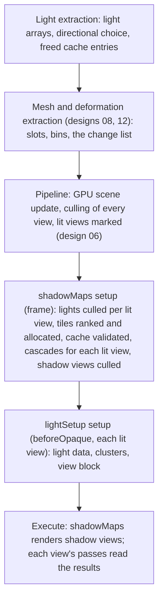

# Design 09: Lighting and Shadows

|                                       |                                                                                                                                                                                                                                                                                                                                                                                                                                                                                                                                                                                |
| ------------------------------------- | ------------------------------------------------------------------------------------------------------------------------------------------------------------------------------------------------------------------------------------------------------------------------------------------------------------------------------------------------------------------------------------------------------------------------------------------------------------------------------------------------------------------------------------------------------------------------------ |
| **Status**                            | Draft, for review (revised after solution review, §7)                                                                                                                                                                                                                                                                                                                                                                                                                                                                                                                          |
| **Kind**                              | Feature                                                                                                                                                                                                                                                                                                                                                                                                                                                                                                                                                                        |
| **Engine version at time of writing** | `0.26.1`                                                                                                                                                                                                                                                                                                                                                                                                                                                                                                                                                                       |
| **Program**                           | [Forge 3D](./README.md), milestone M3                                                                                                                                                                                                                                                                                                                                                                                                                                                                                                                                          |
| **Depends on**                        | [08 Meshes, materials and shaders](./08-meshes-materials-and-shaders.md), and through it [03 ECS foundations](./03-ecs-foundations.md), [05 GPU device layer](./05-gpu-device.md) and [06 Render pipeline](./06-render-pipeline.md)                                                                                                                                                                                                                                                                                                                                            |
| **Related**                           | [10 PBR and environment lighting](./10-pbr-and-environment-lighting.md) (the BRDF that uses these lights, two engine texture units), [11 glTF](./11-gltf-and-asset-lifetime.md) (`KHR_lights_punctual`), [12 Animation](./12-skeletal-and-morph-animation.md) (deforming shadow casters), [13 Post-processing](./13-post-processing-and-anti-aliasing.md) (the ambient occlusion unit), [15 Particles](./15-audio-particles-and-picking-in-3d.md) (mesh particles as casters), [01 Testing and benchmarks](./01-testing-and-benchmarks.md) (B3, B5, analytic and golden tests) |

## 0. Targeted modules

| Path                                                              | Change   | Notes                                                                                                                                  |
| ----------------------------------------------------------------- | -------- | -------------------------------------------------------------------------------------------------------------------------------------- |
| `src/lighting/` (new module, `@forge-game-engine/forge/lighting`) | New      | Everything below; `package.json` `exports` and `src/index.ts` updated                                                                  |
| `src/lighting/components/`                                        | New      | `DirectionalLightEcsComponent`, `PointLightEcsComponent`, `SpotLightEcsComponent` and their factories; `LightingDebugViewEcsComponent` |
| `src/lighting/systems/light-extraction-system.ts`                 | New      | Per-frame light arrays from three declared queries                                                                                     |
| `src/lighting/lighting-world-state.ts`                            | New      | Per-world derived state on the render context: light arrays, the shadow map array, the tile allocator, the shadow cache                |
| `src/lighting/clusters/`                                          | New      | The cluster grid, sorted CPU assignment, the packed cluster texture                                                                    |
| `src/lighting/shadows/`                                           | New      | The shadow map array, cascades per lit view, the tile allocator, cache validation, the shadow passes                                   |
| `src/lighting/shaders/`                                           | New      | `forge/lights` and `forge/shadows` includes; `ForgeLight`; caster bias and pancaking for shadow variants                               |
| `src/lighting/feature.ts`                                         | New      | `lighting(options)`: the pipeline feature (design 06) that adds passes, extraction, includes and view block fields                     |
| `e2e/specs/`, `e2e/golden/`, `e2e/allocation/`, `bench/`          | New      | §6.10                                                                                                                                  |
| `documentation-site/docs/docs/lighting/` (new)                    | New      | `index.md`, `lights.md`, `shadows.md`, `light-units-and-exposure.md`                                                                   |
| `documentation-site/src/pages/demos/lighting-and-shadows/` (new)  | New      | Demo with every light type and shadows; an entry in `documentation-site/src/data/demos.ts`                                             |
| `CHANGELOG.md`                                                    | Modified | `#### Added` per phase                                                                                                                 |

---

## 1. Summary

Forge has no lights: `src/rendering/components/` holds cameras, sprites,
draw order, masks, visibility and the three post effects, and the render context
requests only `EXT_color_buffer_float` (`render-context.ts:548`). This
design adds the three punctual light types every engine and glTF
(`KHR_lights_punctual`) have, in physical units, with shadows, rendered
with **clustered forward** shading (README G2): each lit view is divided
into a grid of cells in screen space and depth, each cell lists the lights
that reach it, and each pixel loops over only its cell's lights. WebGL2
has no compute shaders, so the lists are built on the CPU each frame and
uploaded as textures, as Bevy and PlayCanvas do on WebGL2.

Only **lit views** pay for any of it: a view whose culled content has at
least one lit material. UI canvases, 2D cameras and unlit-only views get
no light data, clusters or cascades.

Shadows live in one **shadow map array**, a depth texture array that
follows the device's depth convention:

- **The sun** (one shadowed directional light): up to four **cascades per
  lit view**, each a layer, fitted with a sphere whose radius is computed
  from the projection and rounded up, snapped to whole texels so edges
  don't shimmer, with casters in front of the near plane flattened onto it
  in the vertex shader.
- **Spot and point lights**: tiles in the remaining layers (a point light
  uses six), shared by every view, sized by the light's largest projected
  size in any lit view with hysteresis, and **cached per world**: a tile is
  re-rendered only when its light, its allocation or a caster that touches
  it changed, judged from the GPU scene's change list.
- **Filtering**: hardware depth comparison. A light with no size gets a
  fixed small filter; a light with a size (a point or spot `radius`, the
  sun's `angularDiameter`) gets soft shadows whose penumbra grows with the
  distance to the blocker.

The engine reserves seven fragment texture units (design 05 §6.6); this
design uses four of them: the cluster texture, the light data texture, and
the shadow map array through a comparison sampler and through a plain one
for the soft-shadow blocker search.

Lights are ordinary components on entities with transforms (a spot or
directional light aims along its `-Z`, README §4.1). The shading model
that turns lights into color is design 10's PBR, or a material's own
`forge_light` hook (design 08).

---

## 2. Scope

### In scope

- Directional, point and spot lights; physical units; range, attenuation
  and cones; light size.
- Light extraction, lit views, and the light data on the GPU.
- Clustered light lists built on the CPU.
- The shadow map array; cascades per lit view; local light tiles, their
  allocator and their cache.
- Biases, hard and soft filtering.
- `ForgeLight` and the light functions custom shaders call.
- Debug views (light counts, cascades, shadow maps, light volumes).

### Out of scope

- **The BRDF**: design 10.
- **Ambient and environment light**: design 10.
- **Area lights, light cookies, volumetric lighting.** Later features; the
  light record has a type field and spare components for them.
- **Light layers** (a light that affects only some objects, as Unity's
  rendering layers and Godot's light cull masks do). A later feature; the
  light record has room for a mask.
- **Caching cascades.** Cascades follow the camera and render every frame
  for each lit view (decision L7).
- **Baked lighting and light probes.** Forge has no bake tooling; glTF has
  no standard for it.
- **Temporal filtering of soft shadows.** Forge has no temporal
  accumulation (design 13), so soft-shadow kernels use a fixed pattern
  (§6.5.8).
- **2D lights** for sprites (design 07, out of scope).

---

## 3. Phases

Each phase adds its `#### Added` bullet to `CHANGELOG.md` and the guide
sections for what it ships.

### Phase 1: Lights, light data and lit views

| #   | Task                      | Description                                                                                                                          | Size |
| --- | ------------------------- | ------------------------------------------------------------------------------------------------------------------------------------ | ---- |
| 1.1 | Components                | §6.1: the three components and their factories, defaults and validation                                                              | S    |
| 1.2 | Light extraction          | §6.2.1: three declared queries, per-world light arrays, directional selection, removed lights                                        | M    |
| 1.3 | Lit views and GPU data    | §6.2.2, §6.3: the activation rule, view block fields, the light data texture                                                         | M    |
| 1.4 | `ForgeLight` and includes | §6.6; the shader loops over the view's whole light list (clusters come in Phase 2); a Lambertian test material through `forge_light` | M    |
| 1.5 | `lighting()` feature      | Registers extraction, the light setup pass and includes on a pipeline                                                                | S    |

**Definition of done:** the known-illuminance analytic test (design 01
§6.4.4) passes for a directional light; a point light's measured falloff
between two distances matches inverse-square within the window (§6.1.3);
a UI canvas camera in a pipeline with `lighting()` does no light work
(counted by the stats overlay).

### Phase 2: Clusters

| #   | Task                     | Description                                                                                                | Size |
| --- | ------------------------ | ---------------------------------------------------------------------------------------------------------- | ---- |
| 2.1 | Grid and slices          | §6.4.1: square tiles, a first slice to `clusterFirstSliceDepth`, exponential slices beyond                 | S    |
| 2.2 | Sorted assignment        | §6.4.2: visible lights sorted by view depth, capped pairs, counting sort into cells, the visible-light cap | M    |
| 2.3 | Cluster texture and loop | §6.3.4, §6.4.3: packed headers and 16-bit index pairs; the shading loop                                    | M    |
| 2.4 | Debug views              | `lightCount` heat map and `lightVolumes` (§6.7)                                                            | S    |

**Definition of done:** B3 (256 point lights) meets its budget; cluster
assignment equals a brute-force assignment in unit tests; the
slice-distribution and cell-overflow tests pass.

### Phase 3: Shadow map array and directional cascades

| #   | Task                  | Description                                                                                            | Size |
| --- | --------------------- | ------------------------------------------------------------------------------------------------------ | ---- |
| 3.1 | Shadow map array      | §6.5.1, §6.5.2: per-world array, layer management, both depth conventions, the two samplers            | M    |
| 3.2 | Cascades per lit view | §6.5.3: splits, a rounded sphere fit, texel snapping, culling without a near plane, pancaking          | M    |
| 3.3 | Shadow views          | §6.5.5: culled views over the shared `shadowCaster` bins; caster depth bias in the shadow vertex stage | M    |
| 3.4 | Sampling              | §6.5.7, §6.5.8: receiver normal offset, the hard filter, cascade blending and fade                     | M    |
| 3.5 | Debug views           | `cascades` and `shadowMaps` (§6.7)                                                                     | S    |

**Definition of done:** the shadow-coverage and no-acne analytic tests
pass under both depth conventions; a split-screen golden shows each view
with its own cascades; a slow camera pan shows no shimmering (an e2e test
compares shadow edges between frames); B1's shadow views meet design 06's
budget.

### Phase 4: Local light shadows and caching

| #   | Task                 | Description                                                                                                                                                           | Size |
| --- | -------------------- | --------------------------------------------------------------------------------------------------------------------------------------------------------------------- | ---- |
| 4.1 | Tile allocator       | §6.5.4: a quadtree per local layer; ranking by priority and largest projected size; hysteresis; previous tiles kept                                                   | M    |
| 4.2 | Spot and point tiles | Widened projections with real depth in the border; face selection; lookups clamped to tiles; clearing a tile with a quad                                              | M    |
| 4.3 | Shadow cache         | §6.5.6: per-world entries, stored values, design 06's change list, hooked casters, deformation, reallocation and context restore                                      | L    |
| 4.4 | Kept tiles' casters  | §6.5.6: each entry records the dynamic caster slots its last render drew; while its tiles are kept, culling counts them as visible (design 06 §6.8.1, design 12 AN26) | S    |

**Definition of done:** B5 meets its budget; a still scene with eight
shadowed spot lights renders no local shadow view after the first frame;
the context-loss e2e test, the deforming-caster golden and the allocator
hysteresis and reallocation allocation specs pass.

### Phase 5: Soft shadows, guides and demo

| #   | Task                     | Description                                                                                        | Size |
| --- | ------------------------ | -------------------------------------------------------------------------------------------------- | ---- |
| 5.1 | Soft shadows             | §6.5.8: the blocker search through the plain sampler; penumbra from `radius` and `angularDiameter` | M    |
| 5.2 | Texture-unit budget test | The 16-unit test with every engine feature on (§6.10), extended as designs 10 and 13 land          | S    |
| 5.3 | Guides and demo          | The four lighting guides (§6.11); the `lighting-and-shadows` demo                                  | M    |

**Definition of done:** soft-shadow goldens pass for each light type; the
texture-unit budget test passes; the guides and demo are on the docs site.

---

## 4. Decision log

| #   | Decision                | Options                                                                                                                                                                                                                                                                                                   | Chosen | Rationale, trade-offs, assumptions                                                                                                                                                                                                                                                                                                                                                                                                                                                                                                                                                                                                                                                                                                                                       |
| --- | ----------------------- | --------------------------------------------------------------------------------------------------------------------------------------------------------------------------------------------------------------------------------------------------------------------------------------------------------- | ------ | ------------------------------------------------------------------------------------------------------------------------------------------------------------------------------------------------------------------------------------------------------------------------------------------------------------------------------------------------------------------------------------------------------------------------------------------------------------------------------------------------------------------------------------------------------------------------------------------------------------------------------------------------------------------------------------------------------------------------------------------------------------------------ |
| L1  | Many lights             | (a) Clustered, assigned on the CPU; (b) screen tiles without depth slices; (c) every object loops over every light, as Three.js does; (d) clusters built on the GPU                                                                                                                                       | (a)    | (c) costs every pixel every light. Tiles without slices put near and far lights in one list. Godot's Forward+ builds clusters on the GPU with compute shaders, which WebGL2 lacks; Godot's WebGL2 renderer (Compatibility) isn't clustered at all and limits lights per object. Bevy and PlayCanvas build clusters on the CPU on WebGL2, as this does. A WebGPU backend can move assignment into a compute pass without changing the data the shaders read.                                                                                                                                                                                                                                                                                                              |
| L2  | Light data storage      | (a) Point and spot lights, with their shadow records, in a float texture per view; directional lights and cascades in the view block; (b) everything in uniform blocks, as Bevy's WebGL2 path does                                                                                                        | (a)    | A 16 KB block holds about 256 lights at 64 bytes, a hard ceiling. A texture holds thousands. Shadow matrices sit next to their lights, so they need no binding of their own. Directional lights are few and read by every pixel, so a block suits them.                                                                                                                                                                                                                                                                                                                                                                                                                                                                                                                  |
| L3  | Units                   | (a) Physical: lux for directional, lumens for point and spot, exposure in EV100 (design 10); (b) unitless intensities                                                                                                                                                                                     | (a)    | glTF's lights are physical, so imported scenes light correctly, and values from photography mean the same thing. Unitless intensities only stay consistent within one game.                                                                                                                                                                                                                                                                                                                                                                                                                                                                                                                                                                                              |
| L4  | Spot intensity          | (a) A spot light of `Φ` lumens has a point light's intensity, `I = Φ / 4π`, masked to the cone; (b) `Φ` spread over the cone; (c) `I = Φ / π`, as Three.js uses, and Unity's HD render pipeline for spot lights without its reflector option                                                              | (a)    | Narrowing a spot's cone then doesn't make it brighter, which is what artists expect when tuning a cone. Bevy defines a spot light's power this way ("a point light in a perfectly absorbent housing"), as Blender does for its spot lights, and glTF's candela convert exactly. Trade-off: a spot's lumens copied from Three.js are 4× too dim in Forge; the lights guide says so, and README §4.2 states which values carry over.                                                                                                                                                                                                                                                                                                                                       |
| L5  | Shadow storage          | (a) One depth 2D array for cascades and local tiles; (b) a cube map per point light and a texture per spot; (c) a cascade array and a separate local atlas, as Godot and Unity URP use                                                                                                                    | (a)    | WebGL2 has no cube map arrays, so (b) binds a texture per shadowed light. Soft shadows need a second, non-comparison binding of every shadow texture for the blocker search (GLSL ES 3.00 has no `textureGather`, and a shadow sampler returns only comparison results), so (c) needs four units for shadows: with the cluster and light data textures and the three units of designs 10 and 13, nine against design 05's seven. (a) needs two, which makes exactly seven, and gives every shadow one addressing scheme, a layer and a rectangle; Filament keeps its shadow maps in layers of one depth array the same way. Trade-off: cascades are layer-sized, and adding or removing a lit view with a shadowed sun reallocates the array and re-renders local tiles. |
| L6  | Cascade fitting         | (a) A sphere fit computed from the view's projection, radius rounded up, origin snapped to texels; casters in front of the near plane pancaked in the vertex shader; (b) tight fits to each split's corners; (c) depth clamping through `EXT_depth_clamp`                                                 | (a)    | Tight fits change size and position every frame, which makes shadow edges crawl. A radius computed from projection parameters and rounded up is identical every frame, where one computed from rotated corners drifts in the last bits. WebGL2 core has no depth clamp; `EXT_depth_clamp` isn't in every browser, and WebGPU's equivalent is an optional feature, so relying on it would make shadows differ by device. Pancaking in the shadow vertex shader is Unity's approach and works everywhere. Trade-off: some resolution, and triangles crossing the near plane are distorted, which a near-plane offset reduces.                                                                                                                                              |
| L7  | Caching                 | (a) Local tiles re-render when their light's values, their allocation or a caster touching them changed, from the GPU scene's change list, the whole tile at once; (b) static casters cached and dynamic casters drawn over a copy each frame, as Unity's HD render pipeline does; (c) render every frame | (a)    | Most local lights and casters don't move. Godot marks a light's shadow dirty when an instance paired with it moves; (a) tests what changed against the lights, so a still scene does no work at all, unlike a scan of every caster in every tile. (b) saves redrawing static casters under a light with a moving one, at twice the local memory and a copy per tile per frame; open question 2. Cascades follow the camera, so they render every frame.                                                                                                                                                                                                                                                                                                                  |
| L8  | Directional lights      | (a) Up to four per view, the brightest; one shadowed, the brightest with `castsShadows`; (b) any number, any number shadowed                                                                                                                                                                              | (a)    | One sun is the overwhelming case, and each additional cascaded light multiplies shadow rendering. Choosing by illuminance is deterministic and needs no setting; a game picks the shadowed light by setting `castsShadows`. Lights past the fourth, and shadowed lights past the first, are counted in the stats overlay.                                                                                                                                                                                                                                                                                                                                                                                                                                                |
| L9  | Light range             | (a) Finite, a plain input defaulting to 10 m, with a smooth window to zero; (b) derived from intensity when unset (first draft); (c) infinite, as glTF allows                                                                                                                                             | (a)    | Clusters need a bound. Derived from 0.01 lux, the default 800 lm bulb reaches about 80 m and covers the whole grid, so every light would be in every cell. Unity defaults to 10 m and Bevy to 20 m. The window (`(1 - (d/r)⁴)²`, glTF's recommendation) removes the hard edge a cut-off would show. A glTF light without a range gets the default, as Bevy's loader does (design 11, cross-doc). Trade-off: a bright light keeps the 10 m default until the game sets its range; the guide gives the formula.                                                                                                                                                                                                                                                            |
| L10 | Who owns shadow bias    | (a) The light's depth bias moves casters in the shadow vertex stage, read from the shadow view's block; its normal bias offsets receivers' lookups; the material owns rasterizer bias; (b) the light's bias as rasterizer state of the shadow pipeline (first draft)                                      | (a)    | (b) gives the shadow pipeline's bias two writers (design 08 MS12) and makes a pipeline per bias value, which splits the shared `shadowCaster` bins. Unity URP applies a light's depth and normal bias in its caster vertex shader (`ApplyShadowBias`); Bevy and Godot offset receivers along the normal. Keeping normal bias on the receiver keeps hook-free shadow variants position-only (design 08 MS16).                                                                                                                                                                                                                                                                                                                                                             |
| L11 | Shadow softness         | (a) From the light's physical size (`radius`, `angularDiameter`): a blocker search and a penumbra that grows with blocker distance when the size is above zero, a fixed small filter otherwise; (b) a `softness` filter radius plus a contact-hardening toggle (first draft)                              | (a)    | In (b) a point light's `radius` and `softness` both set a penumbra, and the toggle picks between them. One physical value sets the highlight (design 10 §6.6.4) and the penumbra, as a real lamp does. Godot's `light_size` and `light_angular_distance`, the shape radius and angular diameter of Unity's HD render pipeline, and Bevy's light radius drive soft shadows the same way. Trade-off: soft shadows cost 32 texture fetches per pixel per light.                                                                                                                                                                                                                                                                                                             |
| L12 | Cascades and views      | (a) Each lit view gets its own cascades, in its own layers; local tiles are shared by every view; (b) one set of cascades for the frame (first draft)                                                                                                                                                     | (a)    | Cascades are fitted to one view's frustum, so a second camera (split-screen, a minimap, a camera rendering into a texture) sampling another view's cascades gets wrong or missing shadows. Bevy computes cascades per view. A local light's map depends only on the light and its casters, so rendering it once serves every view. Trade-off: each lit view with a shadowed sun adds `cascadeCount` layers and their rendering.                                                                                                                                                                                                                                                                                                                                          |
| L13 | Shadow depth convention | (a) The device's: `depth32float`, cleared to 0, compared `greater-equal` with reversed depth; `depth24plus`, cleared to 1, compared `less-equal` otherwise; (b) always standard `depth24plus`; (c) undecided (first draft)                                                                                | (a)    | Shadow views use the same projection builders and engine functions as camera views (design 02 M7, README G8), so one convention per device is what they already produce, and reversed float depth helps perspective spot and point maps most. Tests run both conventions.                                                                                                                                                                                                                                                                                                                                                                                                                                                                                                |
| L14 | Cluster slices          | (a) A first slice from the near plane to `clusterFirstSliceDepth` (default 5 m), then 23 exponential slices to the farthest light; (b) exponential from the near plane (first draft); (c) uniform                                                                                                         | (a)    | From a 0.1 m near plane (design 06 R15) to 100 m, exponential slices put a third of the 24 in the first metre, where few lights are. Bevy starts with a fixed first slice of 5 m. The depth is an option of `lighting()` because scenes at different scales need different values (a tabletop game, an open world); Bevy exposes it too.                                                                                                                                                                                                                                                                                                                                                                                                                                 |
| L15 | Overflow and caps       | (a) Visible lights sorted by view depth once per view, so each cell's list runs near to far and overflow drops the farthest; at most 4,096 visible lights, nearest kept; (b) unsorted lists and a per-cell sort; (c) wider indices above 65,535 lights (first draft)                                      | (a)    | One sort of a few hundred lights costs microseconds; a sort per cell costs more and wasn't in the first draft's algorithm, so "farthest dropped" had nothing behind it. A cap with 16-bit indices replaces a format switch nobody needs.                                                                                                                                                                                                                                                                                                                                                                                                                                                                                                                                 |
| L16 | Cluster storage         | (a) One `r32uint` texture: a header per cell (offset and count) followed by light indices, two 16-bit indices per texel; (b) a header texture and an index texture in `r16uint` (first draft); (c) uniform blocks, as Bevy's WebGL2 path does                                                             | (a)    | One texture unit instead of two, and `r16uint` isn't in design 05's format list. Bevy packs offset and counts into one 32-bit value too. Uniform blocks are guaranteed only 16 KB, too small for the index lists.                                                                                                                                                                                                                                                                                                                                                                                                                                                                                                                                                        |
| L17 | Which views are lit     | (a) Decided from culled content: a view with an item whose material is lit; (b) every view of a pipeline with `lighting()`; (c) a camera setting                                                                                                                                                          | (a)    | (b) builds clusters and cascades for every UI canvas and 2D camera. (c) is a setting for what the data already says. Design 06 decides the depth prepass from data for the same reason (R13).                                                                                                                                                                                                                                                                                                                                                                                                                                                                                                                                                                            |
| L18 | Tile borders            | (a) Each point face's and spot's projection is widened so the tile's border holds real depth; (b) a 90° face plus padding (first draft); (c) kernels clamped inside the 90° area                                                                                                                          | (a)    | With (b), filtering near a face edge reads padding instead of depth, a visible seam. (c) shrinks the filter near edges. PlayCanvas widens its faces' field of view the same way. Trade-off: the border is about 12% of a tile's area.                                                                                                                                                                                                                                                                                                                                                                                                                                                                                                                                    |
| L19 | Tile sizes              | (a) Ranked by `priority`, then by the light's largest projected size over lit views, with a hysteresis band and previous tiles preferred; (b) re-ranked every frame by screen size (first draft)                                                                                                          | (a)    | Without hysteresis, a light near a size boundary changes size as the camera moves, and each change re-renders its tile. A game-set priority keeps a player's flashlight shadowed when it's small on screen.                                                                                                                                                                                                                                                                                                                                                                                                                                                                                                                                                              |

---

## 5. Open questions

1. **Defaults per platform.** Cascade count, shadow map size, local layers
   and soft shadows differ in cost a lot between desktop and phones; the
   default array is 128 MiB for one lit view with a shadowed sun (§6.9).
   Options: (a) one set of defaults that games tune, with a mobile preset
   in the guide (1024² layers and two local layers, 24 MiB); (b) defaults
   chosen from the device's capabilities. Proposal: (a) for now; revisit
   after M3's mobile measurements.
2. **Static and dynamic casters in cached tiles.** A tile re-renders all
   its casters when any of them changes (L7). Options: (a) keep that; (b)
   keep a static-only copy per tile and draw dynamic casters over a copy
   of it each frame, as Unity's HD render pipeline does. Proposal: (a),
   then measure B5 with a character walking under a spot light and adopt
   (b) if re-rendering exceeds the budget.
3. **Cluster grid.** About 144 square tiles per slice and 24 slices is a
   common starting point. Confirm with B3 on the integrated-GPU reference
   whether fewer slices are faster, and whether the 5 m first slice suits
   the sample game.
4. **Cameras that shouldn't get cascades.** Every lit view gets its own
   cascades when a sun casts shadows (L12), which a minimap may not need.
   Options: (a) keep that, with each view's shadow cost in the stats
   overlay; (b) a camera component that turns cascades off or down for its
   view, as Unity URP's per-camera shadow setting does. Proposal: (a), and
   add (b) if the split-screen benchmark or a demo shows the cost matters.

---

## 6. Design

### 6.1 Lights

#### 6.1.1 Components

```ts
interface DirectionalLightEcsComponent {
  color: Color; // sRGB, like every Forge color; default white
  illuminance: number; // lux, default 10,000
  angularDiameter: number; // radians, default 0 (hard shadows); the sun is about 0.0093
  castsShadows: boolean; // default false
  shadow: DirectionalShadowSettings;
}

interface DirectionalShadowSettings {
  depthBias: number; // in shadow-map texels, default 1
  normalBias: number; // in shadow-map texels, default 1
  cascadeCount: 1 | 2 | 3 | 4; // default 4
  maxDistance: number; // meters from the camera, default 100
  splitBlend: number; // 0 uniform to 1 logarithmic splits, default 0.75
  cascadeBlendWidth: number; // fraction of each cascade's depth range blended into the next, default 0.1
}

interface PointLightEcsComponent {
  color: Color;
  intensity: number; // lumens, default 800 (a household bulb)
  range: number; // meters, default 10 (§6.1.3)
  radius: number; // meters, the emitter's size: highlight size (design 10) and penumbra; default 0
  castsShadows: boolean; // default false
  shadow: LocalShadowSettings;
}

interface SpotLightEcsComponent extends PointLightEcsComponent {
  innerConeAngle: number; // radians from the axis, default 0
  outerConeAngle: number; // radians from the axis, default π/4, at most π/2
}

interface LocalShadowSettings {
  depthBias: number; // in shadow-map texels, default 1
  normalBias: number; // in shadow-map texels, default 1
  priority: number; // default 0; higher is given a tile first (§6.5.4)
}
```

```ts
const lamp = world.createEntity();
addTransformComponent(world, lamp, { position: { x: 0, y: 2.5, z: 0 } });
addPointLightComponent(world, lamp, {
  intensity: 1600,
  range: 12,
  radius: 0.05,
  castsShadows: true,
});

const flashlight = world.createEntity();
addTransformComponent(world, flashlight, { position: { x: 0, y: 1.6, z: 0 } });
addSpotLightComponent(world, flashlight, {
  intensity: 2000,
  range: 25,
  innerConeAngle: 0.3,
  outerConeAngle: 0.4,
  castsShadows: true,
  shadow: { priority: 1 },
});
```

- `addDirectionalLightComponent`, `addPointLightComponent` and
  `addSpotLightComponent` apply defaults with `withDefaults`, the nested
  `shadow` settings included, and throw on values that have no meaning: a
  negative intensity, illuminance, radius or angular diameter, a range of
  zero or less, cones outside `0 ≤ inner < outer ≤ π/2` (glTF's rule), a
  cascade count outside 1 to 4.
- A light's position and direction come from its `TransformEcsComponent`:
  directional and spot lights shine along their world `-Z`; scale is
  ignored, as glTF specifies.
- The fields are plain and written in place. Lights are few, and
  extraction reads every one every frame (§6.2.1), so there's no change
  list to feed; the shadow cache compares the values it depends on
  (§6.5.6).
- The only writers of these components are game code and design 11's
  model instantiation. Nothing in the engine writes them back.
- A light in a hidden subtree (`VisibilityEcsComponent`,
  `src/rendering/components/visibility-component.ts`) emits nothing and
  casts nothing, as a hidden sprite draws nothing.

#### 6.1.2 Units

- **Directional**: `illuminance` `E` is the illuminance, in lux, on a
  surface facing the light. A surface at angle `θ` to it receives
  `E cos θ`.
- **Point and spot**: `intensity` is luminous power `Φ` in lumens. The
  luminous intensity is `I = Φ / 4π` candela for both (decision L4), and
  the illuminance on a surface facing the light at distance `d` is
  `I / d²` times the window (§6.1.3) and, for a spot, the cone (§6.1.4).
- **Color** is a filter on the light: an sRGB `Color`, converted with
  `color.linear` (design 07 §6.6.2), unitless. Brightness lives only in
  `illuminance` and `intensity`.
- The shading model turns `E⊥`, the illuminance on a surface facing the
  light, into reflected luminance per color channel:
  `L = f · E⊥ · color · cos θ`, with `f` design 10's BRDF or the
  material's `forge_light` (§6.6).
- **Exposure** (design 10, EV100) converts luminance to display values.
  The default exposure suits the default sun; the bulb needs the indoor
  presets (design 10 §6.7.2).

Values from elsewhere:

| Source                       | Into Forge                                                                |
| ---------------------------- | ------------------------------------------------------------------------- |
| glTF `KHR_lights_punctual`   | Directional lux unchanged; point and spot candela × 4π lumens (design 11) |
| Bevy                         | Unchanged: the same units and the same spot convention                    |
| Three.js point light `power` | Unchanged                                                                 |
| Three.js spot light `power`  | × 4: Three.js uses `power = π · I` for spot lights                        |

#### 6.1.3 Range and attenuation

```text
E⊥ = I · window(d) · cone / max(d², max(radius, 0.01)²)
window(d) = clamp(1 - (d / range)⁴, 0, 1)²
```

The distance is clamped to the light's radius (and 1 cm), since the
inverse square has no meaning inside the emitter. The window is glTF's
recommended one; it reaches zero at `range`, so a light never contributes
past it, and clusters bound each light by its range.

`range` is an input with a fixed default of 10 m (decision L9). With it,
the default 800 lm bulb gives 16 lux at 2 m and 0.64 lux at 10 m before
the window, 4% of its value at 2 m, so the window's fall to zero is
hard to see. A brighter light needs a larger range; the guide gives the
distance at which a light falls to an illuminance `E`: `d = √(I / E)`.

#### 6.1.4 Spot cones

The cone factor follows glTF's recommended implementation:

```text
scale  = 1 / max(cos(inner) - cos(outer), 0.001)
offset = -cos(outer) · scale
cone   = clamp(dot(axis, -toLight) · scale + offset, 0, 1)²
```

Extraction stores `scale` and `offset`; a point light stores `0` and `1`,
which makes its cone factor 1 with the same code. A shadowed spot's
projection covers its outer cone, widened for the tile border (§6.5.4)
and limited to an 85° half-angle; a wider cone's edge goes unshadowed, and
the guide recommends a point light for cones wider than about 60°.

### 6.2 Extraction and lit views

#### 6.2.1 Light extraction

`createLightExtractionEcsSystem(renderContext)`, added by `lighting()`:

```ts
const lightExtraction: EcsSystem<
  [PointLightEcsComponent, TransformEcsComponent],
  {
    spots: [SpotLightEcsComponent, TransformEcsComponent];
    directional: [DirectionalLightEcsComponent, TransformEcsComponent];
  }
> = {
  stage: 'render',
  query: [pointLightId, transformId],
  queries: {
    spots: { query: [spotLightId, transformId] },
    directional: { query: [directionalLightId, transformId] },
  },
  update(world, points, { spots, directional }) {
    /* below */
  },
};
```

It runs in the `render` stage before mesh extraction (design 08 §6.2.2).
Each run:

1. For entities in the `removed` journals, drops their shadow cache
   entries and frees their tiles (§6.5.6).
2. Writes every point and spot light into the world's light arrays:
   world position (64-bit), axis, linear color, intensity, range, cone
   `scale` and `offset`, radius, shadow settings and the entity.
3. Chooses the directional lights: the four with the highest illuminance,
   and as the shadowed one the brightest of those with `castsShadows`
   (decision L8). The rest are counted in the stats overlay.

The arrays are scratch on the world's lighting state, fully rewritten each
run (README §4.4). The system reads components and writes none. Hidden
lights are dropped later, when lights are culled per view, using the
per-frame hidden-subtree resolution design 06 §6.8.1 computes for meshes
and light entities.

The lighting state is kept per world, beside the GPU scene (design 06
§6.7.1), so two worlds sharing a render context never share tiles or
cache entries. It is a derived cache: everything in it can be rebuilt
from components and is dropped with the world's GPU scene.

#### 6.2.2 Lit views

A view is **lit** when its pipeline has `lighting()` and, after culling,
one of its opaque, alpha-tested or transparent items uses a lit material
(decision L17): a `PbrMaterial`, with or without light and ambient hooks
(design 10 PB35 removed the `shadingModel` option), or a custom material
whose color sources include `forge/lights`, detected when it's created as
design 08 §6.9 detects its other includes. Design 06 culls every view
before building the frame graph and records the flag in its culling loop,
while it writes the view's object index lists (design 06 §6.8.1).

- Lit views get light data, clusters, directional lights in their view
  block, and cascades when a directional light casts shadows.
- Everything else (UI canvases, 2D cameras, a camera that sees only
  unlit content) gets none of it and costs the lighting feature nothing.
- A lit camera whose `renderTarget` is a texture (a minimap, a monitor in
  the scene) is a lit view like any other.
- A lit view renders into `rgba16float`; on a device without float color
  buffers, setting it up throws, naming the extension (design 05 D11).

#### 6.2.3 A frame



The frame graph runs per-frame passes' `setup` before per-view passes'
(design 06 §6.5), which is the order this needs: the shared tiles and
every view's cascade layers are known before any view writes its light
data. The per-view light lists computed in `shadowMaps`' setup are reused
by `lightSetup`.

### 6.3 GPU data

#### 6.3.1 Texture units

Design 05 §6.6 reserves at most seven fragment units for the engine,
which leaves a material at least nine on a 16-unit device. After this
design and designs 10 and 13:

| Sampler              | Kind                   | Group | Owner                                                              |
| -------------------- | ---------------------- | ----- | ------------------------------------------------------------------ |
| `forge_clusters`     | `usampler2D`           | View  | This design (§6.3.4)                                               |
| `forge_lights`       | `sampler2D`            | View  | This design (§6.3.3)                                               |
| `forge_shadowMaps`   | `sampler2DArrayShadow` | View  | This design: comparison, linear filtering                          |
| `forge_shadowDepths` | `sampler2DArray`       | View  | This design: the same texture, no comparison, `nearest`            |
| BRDF lookup table    | `sampler2D`            | Frame | Design 10                                                          |
| Environment          | `samplerCube`          | View  | Design 10                                                          |
| Ambient occlusion    | `sampler2D`            | View  | Design 13 (design 10's transmission copy in transmissive variants) |

`forge_shadowMaps` and `forge_shadowDepths` bind the same texture on two
units with two sampler objects. A sampler object's compare mode overrides
the texture's, so each unit is consistent; and OpenGL ES 3.0 requires
`nearest` filtering on a depth texture sampled without comparison, which
the blocker search wants anyway. Assumption, tested in the browser suite
on every ANGLE backend CI offers: every WebGL2 implementation accepts one
depth texture on two units this way.

A lit view without any shadowed light binds a 1 × 1 depth array holding
the far value of the device's convention on both units (design 08
§6.3.4's default for shadow kinds), so one variant serves views with and
without shadows. No light points at a shadow record then, so it's never
read; if it were, it would compare as lit.

#### 6.3.2 View block

Fields this design adds to `ForgeView` (std140), written by `lightSetup`
for each lit view:

| Field                                            | Contents                                                                                                                                    |
| ------------------------------------------------ | ------------------------------------------------------------------------------------------------------------------------------------------- |
| `forge_directionalLights[4]`                     | Three `vec4`s each: direction towards the light and `tan(angularDiameter / 2)`; linear color and illuminance; shadowed flag and normal bias |
| `forge_directionalLightCount`                    | 0 to 4                                                                                                                                      |
| `forge_cascadeMatrices[4]`                       | Camera-relative world to shadow clip space, per cascade (§6.5.3)                                                                            |
| `forge_cascadeSplits`                            | Far view depth of each cascade                                                                                                              |
| `forge_cascadeLayers`, `forge_cascadeTexelSizes` | Array layer and world size of one texel, per cascade                                                                                        |
| `forge_cascadeParams`                            | Count, blend width, fade start and end                                                                                                      |
| `forge_clusterGrid`                              | Tiles across and down, slices, tile size in pixels                                                                                          |
| `forge_clusterSlices`                            | First slice depth, logarithmic scale and bias (or linear scale and bias for orthographic views)                                             |
| `forge_lightingDebugMode`                        | §6.7                                                                                                                                        |

About 640 bytes per lit view.

#### 6.3.3 Light data texture

An `rgba32float` texture per lit view, 1,024 texels wide, read with
`texelFetch` (so it never needs float filtering, design 05 §6.4). Light
records come first, four texels each, in the order of the view's sorted
light list (§6.4.2); shadow records follow.

| Light texel | `xyz`                                                                               | `w`                   |
| ----------- | ----------------------------------------------------------------------------------- | --------------------- |
| 0           | Position relative to the camera, meters (`float32` of a 64-bit difference)          | Range                 |
| 1           | Linear color                                                                        | Intensity, candela    |
| 2           | Axis: the light's world `-Z` (spot lights)                                          | Radius                |
| 3           | Cone scale; cone offset; first texel of its shadow record, or −1 when it casts none | Type: 1 point, 2 spot |

Positions are written per view relative to that view's camera, so the
64-bit subtraction happens on the CPU and the GPU gets small numbers. The
data is rewritten every frame, so the high and low split the GPU scene
uses for objects (design 06 §6.7.3) isn't needed.

| Spot shadow texel | Contents                                                                                                                              |
| ----------------- | ------------------------------------------------------------------------------------------------------------------------------------- |
| 0–3               | Columns of the camera-relative shadow matrix: projection × light view × translation by the camera-to-light offset, composed in 64-bit |
| 4                 | Array layer, tile origin u and v, tile size in texture coordinates                                                                    |
| 5                 | Normal bias, world size of a texel at 1 m, near and far planes                                                                        |

| Point shadow texel | Contents                                                                                   |
| ------------------ | ------------------------------------------------------------------------------------------ |
| 0–5                | Per face (`+X`, `−X`, `+Y`, `−Y`, `+Z`, `−Z`): array layer, tile origin u and v, tile size |
| 6                  | Face scale `(N − 2B) / N` (§6.5.4), near and far planes, world size of a texel at 1 m      |
| 7                  | Normal bias                                                                                |

Point light faces are aligned with the world axes, so a point light's
rotation doesn't matter and doesn't invalidate its tiles. Receivers only
have positions relative to the camera (design 08 §6.7's
`ForgeSurfaceInput.position`), which is why every shadow matrix is
camera-relative.

#### 6.3.4 Cluster texture

An `r32uint` texture per lit view, 1,024 texels wide:

| Texels                 | Contents                                                                                       |
| ---------------------- | ---------------------------------------------------------------------------------------------- |
| `0` to `cellCount − 1` | One header per cell: `offset << 8 \| count`, the offset in 16-bit index slots, the count ≤ 128 |
| `cellCount` onwards    | Light indices, two 16-bit indices per texel, low half first                                    |

Both regions upload in one `texSubImage2D` of the rows used. Indices are
16-bit because a view has at most 4,096 visible lights (decision L15).

### 6.4 Clusters

#### 6.4.1 Grid and slices

- **Tiles** are square, in the view's own target's device pixels (each
  camera renders into its own target, design 06 R8), sized
  `ceil(√(width · height / 144))`, so a 1920 × 1080 view has 16 × 9
  tiles of 120 pixels and other aspects keep about 144 tiles per slice.
- **Slices** (24) cover view depth from the near plane to `zFar`, the
  farthest extent of any visible light, clamped to the camera's far plane.
  For a perspective view, slice 0 ends at
  `z₁ = min(clusterFirstSliceDepth, zFar / 2)` (default 5 m), and the other
  23 are spaced exponentially from `z₁` to `zFar` (decision L14). An
  orthographic view (an isometric game) spaces slices uniformly between
  the nearest and farthest light extents, since its depth isn't divided by
  distance.

The fragment's view depth is `dot(input.position, forge_cameraForward)`,
from its camera-relative position, so finding the slice doesn't read the
depth buffer and doesn't depend on the depth convention.

#### 6.4.2 Assignment

```text
visible = point and spot lights not hidden whose range sphere (a spot: its cone's bounding sphere)
          intersects the view frustum
sort visible by view depth of the light's center (radix sort on quantized depth, scratch arrays)
keep the first 4,096; count the rest in the stats overlay

for each light in visible, in order:
  tile range  = the screen rectangle of its view-space sphere (conservative)
  slice range = its depth extent
  for each cell in that range:
    if the sphere intersects the cell's view-space box (a spot: then its cone too):
      if count[cell] < 128: count[cell]++, record (cell, light)
      else: overflow++
prefix sum of count -> offset per cell
scatter the recorded pairs by cell (stable), packing two indices per texel
```

- Lights are processed near to far, so each cell's list runs near to far,
  and a full cell drops its farthest lights. The overflow count is in the
  stats overlay.
- One test pass and one stable scatter: no per-cell sort, no second pass
  of intersection tests.
- Everything runs on scratch arrays in the lighting state, grown to the
  scene's needs and reused, so steady state allocates nothing.

#### 6.4.3 Shading

```glsl
ForgeLightList lights = forge_clusterLights(input);       // reads the cell's header
for (uint i = 0u; i < lights.count; i++) {
  ForgeLight light = forge_clusterLight(lights, i, input); // index, record, attenuation, shadow
  color += FORGE_SHADE(surface, light, input);              // design 10's BRDF or forge_light
}
```

The cell comes from `gl_FragCoord.xy` and the slice (§6.4.1). Directional
lights are looped from the view block first. A receiver whose GPU scene
flags (texel 3, design 06 §6.7.2) clear "receives shadows" skips shadow
lookups; the vertex stage passes the flag as a flat varying. Lit opaque,
alpha-tested and transparent variants share the loop.

### 6.5 Shadows

#### 6.5.1 The shadow map array

Each world's lighting state owns one depth 2D array texture, imported into
the frame graph (design 06 §6.5):

- Layers are `shadowMapSize` texels square (a `lighting()` option, default
  2048, at most the device's `MAX_TEXTURE_SIZE`).
- Each lit view with a shadowed sun gets `cascadeCount` layers, one per
  cascade.
- `localShadowLayers` layers (default 4) hold spot and point light tiles.
- The layer count is the sum. It grows the frame it's needed and shrinks
  once extra layers have gone unused for 60 frames. Either reallocates the
  texture, which invalidates every cached tile (§6.5.6), so it happens
  only when the number of lit views with a shadowed sun changes.

```ts
lighting({
  shadowMapSize: 2048, // texels per side of each layer; a cascade fills one layer
  localShadowLayers: 4, // layers for spot and point light tiles
  clusterFirstSliceDepth: 5, // meters (§6.4.1)
});
```

These are plain configuration (README §4.4) because games genuinely need
different values: shadow memory against quality, and scene scale.

#### 6.5.2 Depth convention

Shadow maps follow the device's depth convention (decision L13):

| Device                        | Format         | Cleared to | Comparison      |
| ----------------------------- | -------------- | ---------- | --------------- |
| `EXT_clip_control` (reversed) | `depth32float` | 0          | `greater-equal` |
| Without it (standard)         | `depth24plus`  | 1          | `less-equal`    |

Shadow views build their projections with the same functions as camera
views (design 02 M7), and shaders compare through `forge/shadows`
functions, so no shadow code branches on the convention. The comparison
sampler's `compare` is set from it when the array is created.

#### 6.5.3 Directional cascades

For each lit view, when a directional light casts shadows:

- **Splits** blend uniform and logarithmic distributions (`splitBlend`)
  from the camera's near plane to `maxDistance`.
- **Fit.** Each cascade is the bounding sphere of its slice of the view
  frustum. The sphere is computed in view space from the projection's
  field of view, aspect and the split distances, not from rotated world
  corners, and its radius is rounded up to 1/16 of a meter, so it is
  identical every frame while those don't change.
- **Stabilizing.** The sphere's center is expressed in light space (the
  light's rotation only), in 64-bit, and snapped to whole texels
  (`2 · radius / shadowMapSize`), so the cascade moves in texel steps the
  filter hides.
- **The shadow view** is an orthographic view whose "camera" is the
  snapped center (high and low parts, design 06 §6.7.3) facing along the
  light. Its depth range spans the sphere, with the near plane moved a
  fixed 10 m towards the light.
- **Pancaking.** Casters between the light and the near plane still
  shadow the cascade. Culling uses the cascade's box with its near plane
  removed, and the shadow vertex stage clamps clip-space depth to the near
  plane for orthographic shadow views, so those casters land on it
  instead of being clipped (decision L6). The 10 m offset limits the
  distortion of large triangles that cross the near plane.
- **Receiver matrices** are camera-relative: the view block holds
  projection × light rotation × translation by `camera − center`, the
  translation computed in 64-bit.
- **Sampling** picks the first cascade whose split contains the
  fragment's view depth (the sphere contains the slice, so the fragment is
  inside it), blends into the next over the last `cascadeBlendWidth` of
  the cascade's depth range, and fades shadows out over the last 10% of
  `maxDistance`.

#### 6.5.4 Local light tiles

Local tiles are shared by every view (decision L12):

- **Quadtree per local layer.** Tiles are powers of two from
  `shadowMapSize / 2` (1024 by default) down to 128. A spot light uses one
  tile; a point light uses six of the same size, all or none.
- **Desired size.** For each shadowed local light visible in at least one
  lit view, the desired size `d` is its range sphere's projected diameter
  in pixels in the view where it's largest, clamped to the tile sizes.
- **Hysteresis.** A light keeps its current size `s` while
  `|log₂ d − log₂ s| ≤ 0.75`, and otherwise moves to the power of two
  nearest `d`. A tile at 512 stays while `d` is between about 304 and 861
  (decision L19).
- **Placement**, each frame, in rank order: `priority` descending, then
  projected size descending. A light whose size didn't change asks for its
  previous tile first. Otherwise, or if that's taken, it takes a free tile
  that no light held last frame, then one held by a lower-ranked light. A
  light that doesn't fit tries the next smaller size; one that fits at no
  size goes unshadowed this frame, and the stats overlay says so.
- **Widened projections** (decision L18). With tile size `N` and border
  `B = max(4, N / 32)` texels, a point face's projection has a half-angle
  of `atan(N / (N − 2B))` instead of 45°, so the inner `N − 2B` texels
  cover exactly the face and the border holds real depth from beyond it.
  A spot's half-angle is `atan(tan(outer) · N / (N − 2B))`, limited to 85°.
- **Lookups** select a point light's face from the major axis of the
  light-to-fragment vector in world space, map the face coordinates by the
  face scale `(N − 2B) / N` into the tile, and clamp every lookup to the
  tile inset by the filter's radius.
- **Near and far planes** are `min(0.1 m, range / 100)` and `range`.

The allocator is a derived GPU cache, not game state: which texels hold
which light's map. Dropping it (context loss) only means reallocating.

#### 6.5.5 Shadow views

A shadow view is a view of design 06 with its own view block and object
index list, and nothing per item:

- **Casters** come from the world's shared `shadowCaster` bins (design 06
  §6.6.1), which mesh extraction keeps from journals (design 08 §6.2.2).
  Nothing is pushed per frame.
- **Culling** uses design 06 §6.8.2's loop with the shadow view's frustum
  and the casters' `castsShadows` flag, over the dynamic sphere arrays and
  the static tree. Camera `cullingMask`s don't apply: what casts doesn't
  depend on who looks.
- **Which shadow views exist** this frame: every cascade of every lit view
  with a shadowed sun, and each local tile that must be re-rendered
  (§6.5.6). A valid cached tile has no shadow view, so it costs no culling
  and no draws.
- **The `shadowMaps` pass** (insertion point `frame`) renders them. A
  layer whose every tile re-renders (cascade layers; local layers after a
  reallocation or a restore) uses `loadOp: 'clear'`. A local layer with
  some valid tiles uses `loadOp: 'load'`, and each re-rendered tile is
  first cleared by drawing a quad over it with depth compare `always` and
  depth write on, at the far value of the convention. Design 05's load
  operations clear whole attachments, and WebGPU's do too, so a quad is
  the portable way to clear a rectangle.
- **The shadow view block** adds the light's depth bias and whether to
  pancake (§6.5.7).

#### 6.5.6 Caching

Each world's lighting state keeps one entry per shadowed local light,
keyed by entity and checked against its generation, as the GPU scene does
for slots (design 06 §6.7.1). An entry holds:

- its tiles (layer and rectangle per face) and their size;
- the values its tiles were rendered from: the light's transform stamp
  (`world.changedTick`, design 04), and for a spot its outer cone angle;
  its range; its depth bias; the tile rectangles;
- whether its last render drew a **hooked** caster: one from a bin whose
  shadow variant runs a vertex hook or a surface hook (design 08 §6.8.3),
  or one drawn from an instance stream (design 15's mesh particles);
- the **dynamic caster slots** its last render drew, from its shadow
  views' culling.

An entry is dropped, and its tiles freed, when its light is removed
(§6.2.1) or stops casting shadows. A shadowed light that no lit view sees
this frame keeps its entry and tiles, ranked below every visible light, so
coming back into view costs nothing unless another light took its tiles.

The transform stamp is compared for inequality (design 03 §6.3). The other
values are inputs the game writes and nobody stamps (design 03 E3), so the
entry stores them and compares them. That is about ten comparisons per
shadowed light per frame.

Each frame, in `shadowMaps`' setup, after placement, a tile is re-rendered
when:

1. it's new, or its size or rectangle changed;
2. a stored value differs from the light's current one;
3. its last render drew a hooked caster (hooks can read time, so their
   shadow can change every frame without anything else changing);
4. a slot in the GPU scene's change list touches it: the slot's previous
   or new bounding sphere intersects the light's range sphere and then the
   tile's frustum. The previous sphere matters because a caster that
   leaves must take its shadow with it;
5. the shadow map array was reallocated, or the context was restored
   (§6.8).

The **change list** is the GPU scene's per-frame record (design 06
§6.7.2) of slots whose transform row changed, slots added and removed
(removed ones with their last sphere), slots that moved between bins or
changed `castsShadows` (design 08 §6.2.2), slots whose alpha-tested shadow
material's `version` changed, slots whose deformation tick advanced
(design 12 §6.14 stamps it), and slots whose shadow variant became ready
(design 08 §6.10.1: a caster that becomes drawable counts as entering),
each with its previous and new sphere.

**Casters seen only through a kept tile.** A tile that isn't re-rendered
has no shadow view this frame, so culling wouldn't count its casters as
seen, and an animated character visible only through its cached shadow
would stop being sampled (design 12 AN20), never deform, and so never
invalidate the tile. While an entry's tiles are kept, design 06's
visibility feedback therefore writes `lastVisibleFrame` for the dynamic
caster slots its last render drew. The character keeps animating, its
deformation tick advances, and rule 4 re-renders the tile. Cost: one store
per dynamic caster of a kept tile.

Cost: rules 1 to 3 are comparisons per shadowed light. Rule 4 is sphere
tests proportional to changed slots times cached lights, zero in a still
scene. Godot marks a light's shadow dirty when an instance paired with it
moves; this is the same idea driven from the change side (decision L7). A
re-rendered tile re-renders all its casters, static ones included (open
question 2).

#### 6.5.7 Bias

Shadow bias has one owner per stage (decision L10, design 08 MS12):

- **Depth bias (the light's)** is applied by the shadow variant's vertex
  stage, from the shadow view's block. It moves each caster vertex away
  from the light by `depthBias` texels' world size: along the light's
  direction for a cascade (`depthBias · texelSize`), and along the
  light-to-vertex direction for a spot or point face, where the texel's
  world size grows with distance (the view-space position is scaled by
  `1 + depthBias · texelSizeAt1m`). It needs only the position, so
  hook-free shadow variants stay position-only (design 08 MS16).
- **Normal bias (the light's)** is applied by receivers: the lookup
  position moves along the geometric normal (not the normal-mapped one)
  by `normalBias` texels' world size at the receiver.
- **Rasterizer depth bias** is the material's (`depthBias`, design 08
  §6.4.2), used by its color, depth and `depthNormals` variants and never
  by shadow variants.

Shadow pipelines therefore don't depend on the light, and every shadow
view draws the same bins with the same pipelines. The defaults (one texel
each, as in Unity URP) are starting values, set by the no-acne analytic
test in Phase 3.

#### 6.5.8 Filtering and soft shadows

Lookups compare through `forge_shadowMaps` with linear filtering, so each
fetch compares and filters four texels.

- **Lights without a size** (`radius` or `angularDiameter` of 0): a fixed
  tent filter of nine fetches covering 5 × 5 texels.
- **Lights with a size** (decision L11):
  1. **Blocker search**: 16 fetches of raw depth through
     `forge_shadowDepths`, on a fixed golden-angle spiral over the region
     from which an occluder could shadow the point given the light's size;
     the depths nearer than the receiver are averaged. With none, the point
     is lit.
  2. **Penumbra width** `w`, from similar triangles, converted to texels:

     ```text
     spot and point: w = radius · (dReceiver − dBlocker) / dBlocker
     directional:    w = 2 · tan(angularDiameter / 2) · (dReceiver − dBlocker)
     ```

  3. **Filter**: 16 comparison fetches on the same spiral scaled to `w`
     (never smaller than the hard filter), clamped to the tile's border
     for local lights and to 32 texels for cascades.
- The spiral is fixed, not rotated per pixel. Rotation trades banding for
  noise, and without temporal accumulation (design 13) noise is the worse
  of the two.
- Depths are converted to distances by `forge/shadows` functions for both
  conventions and both projections.

### 6.6 `ForgeLight` for custom shading

Design 08's `forge_light` hook receives:

```glsl
struct ForgeLight {
  vec3 direction;      // unit, from the surface towards the light, world orientation
  vec3 color;          // the light's linear color, unitless
  float illuminance;   // lux on a surface facing the light: E for directional, I · window · cone / d² otherwise
  float shadow;        // 0 (fully shadowed) to 1 (lit); 1 for unshadowed lights
  float distance;      // to the light's center; 0 for directional
  float angularRadius; // radians, from the shaded point: asin(min(radius / distance, 1)) for point and spot, angularDiameter / 2 for directional, 0 without a size
  int type;            // FORGE_LIGHT_DIRECTIONAL, FORGE_LIGHT_POINT, FORGE_LIGHT_SPOT
};
```

The engine's loop builds one per light (directional lights, then the
cell's lights), samples the shadow before calling the hook, and sums the
results. The physically based contribution is
`f · light.color · light.illuminance · light.shadow · max(dot(n, l), 0)`;
a toon material can instead quantize `dot(normal, direction) * shadow`
without reimplementing clustering or shadows. The loop fills
`angularRadius` from the light data it already reads, so a light hook
that calls design 10's `forge_pbrLight` keeps the widened highlight of a
light with a size (design 10 §6.6.4). `illuminance` is one value
because the falloff is part of the light's physics; a stylized falloff can
be built from `distance`.

Fully custom shaders (design 08 §6.9) use the same functions from
`forge/lights`: `forge_directionalLightCount()`,
`forge_directionalLight(i, input)`, `forge_clusterLights(input)` and
`forge_clusterLight(list, i, input)`.

### 6.7 Debug views

`LightingDebugViewEcsComponent { mode }` on a camera, an effect-style
component (design 06 §6.2) read by the lit view's passes:

| Mode           | Shows                                                                                     |
| -------------- | ----------------------------------------------------------------------------------------- |
| `lightCount`   | A heat map of each cell's light count over the lit image; full cells in a warning color   |
| `cascades`     | The lit image tinted by cascade                                                           |
| `shadowMaps`   | The shadow map array's layers as thumbnails in the `overlay` pass                         |
| `lightVolumes` | Each visible light's range sphere or cone, drawn through design 06's debug-draw singleton |

The tinting modes are a variant bit, so release variants carry no debug
code. A camera with this component in a pipeline without `lighting()`
throws when its view is set up, as design 13 §6.2.2's effect check does.

### 6.8 Context loss

The device restores the shadow map array's storage with no contents
(design 05 §6.10). The lighting state listens to
`RenderContext.onContextRestored` (`src/rendering/render-context.ts:96`)
and marks every cache entry invalid, so every local tile re-renders on the
first frame after the restore, through the clear path of §6.5.5. Cascades
re-render every frame anyway; light data and cluster textures are
rewritten every frame. The `webgl-context-loss` e2e spec gains a scene
with a cached spot shadow.

### 6.9 Performance

Starting budgets on the desktop reference, measured in each phase and
replaced with measured targets (as design 04 did):

| Work                                                                              | Budget                                               |
| --------------------------------------------------------------------------------- | ---------------------------------------------------- |
| Light extraction                                                                  | ≤ 0.1 ms per 1,000 lights in the world               |
| Per lit view: culling, sorting and cluster assignment of 256 visible lights       | ≤ 0.5 ms CPU                                         |
| Per lit view: light data, cluster and view block uploads in B3                    | ≤ 100 KB                                             |
| Per lit view: four cascades' culling and submission (B1, B5)                      | ≤ 1.0 ms CPU (design 06 §6.10's shadow line)         |
| Local shadows in a still scene (B5's eight spots): ranking, placement, validation | ≤ 0.05 ms; no shadow views                           |
| Cache rule 4: 10,000 changed slots against 8 cached lights                        | ≤ 0.3 ms                                             |
| Average lights per pixel in B3 at 1080p                                           | ≤ 8                                                  |
| Default shadow map array, one lit view with a shadowed sun                        | 128 MiB: 8 layers of 2048², 4 bytes per texel        |
| GPU, integrated reference at 1080p: hard and soft shadows for B5                  | Measured in Phases 3 to 5 and recorded as the target |

No allocation per frame: allocation specs for light extraction,
clustering and shadow planning, and for a scene whose camera moves so
tiles change size every few dozen frames.

### 6.10 Testing

- **Unit**:
  - unit conversions; attenuation, window and the distance clamp; the
    cone factor against glTF's reference formula;
  - factory defaults and validation errors;
  - extraction: the four brightest directional lights, the shadowed one,
    hidden lights skipped, removed lights freeing their tiles;
  - lit views: a UI canvas camera and an unlit-only view get no light
    work;
  - slice distribution: slice 0 ends at `clusterFirstSliceDepth` (or half
    the far bound), the rest are exponential, orthographic views are
    uniform;
  - cluster assignment against brute force for random lights and views,
    both projections; packing and decoding of headers and index pairs;
  - cell overflow: 200 lights in one cell keep the 128 nearest, near to
    far, and count 72; the 4,096 visible-light cap;
  - cascade splits; the sphere fit identical under camera rotation;
    texel snapping (a camera moved by less than a texel produces the same
    cascade); pancaking places a caster in front of the near plane on it;
  - the allocator: rank order, priority, previous tiles kept, taking only
    from lower-ranked lights, all-or-nothing point lights;
  - hysteresis: a desired size oscillating inside the band never changes
    the tile; one crossing it changes it once;
  - cache invalidation from each rule in §6.5.6: a light value, the
    transform stamp, a caster moving in, a caster moving out (previous
    sphere), added and removed casters, a hooked bin, a deformation tick,
    a tile change, array reallocation and `onContextRestored`;
  - both depth conventions: shadow projections, clear values and
    comparison functions;
  - the texture-unit budget: with the recording GL helper (design 01
    §6.1) reporting 16 fragment units, a lit `PbrMaterial` variant with
    the environment, ambient occlusion, transmission, both shadow
    samplers and nine material textures links within budget, and a hooked
    material asking for a tenth throws (design 08 MS20).
- **Analytic** (design 01 §6.4.4): known illuminance; the inverse-square
  ratio; inside and outside a spot cone; shadow coverage; no acne on a lit
  plane facing the light. Each runs with reversed depth and with
  `EXT_clip_control` masked by a Playwright init script that wraps
  `getExtension`, so the engine needs no test option.
- **Golden**: each light type; cascades with the debug tint; hard and
  soft shadows for each light type; point light shadows across all six
  faces with no seam at face edges; 256 lights; toon shading through
  `forge_light`; a skinned character and a wind-hooked caster under a
  cached spot light, captured on two frames with different poses and
  times; split-screen with two lit cameras, each with its own cascades.
- **e2e**: a still scene with eight shadowed spots renders no local
  shadow view after the first frame (device counters); the shadow cache
  after context loss (lose and restore with `WEBGL_lose_context`, then
  compare a shadowed region's brightness with a relative, same-run
  measurement before and after); a slow pan shows no shimmer; one depth
  texture sampled through both samplers on every backend CI offers.
- **Allocation specs**: light extraction, clustering, shadow planning,
  tile reallocation under a moving camera.
- **Benchmarks**: B3 and B5; microbenchmarks for cluster assignment (64,
  256 and 1,024 lights) and for cache rule 4.

### 6.11 Documentation

- `lighting/index.md`: the `lighting()` feature and its options, lit
  views, what 2D and UI cameras pay (nothing), the debug views.
- `lighting/lights.md`: the three light types, transforms and aiming,
  units, range and the formula for choosing one, cones, `radius` and
  `angularDiameter`, hidden lights, glTF lights, values from Three.js
  (spots × 4) and other engines.
- `lighting/shadows.md`: turning shadows on; cascades and their settings;
  local tiles, `priority` and what happens when they don't fit; biases and
  acne; soft shadows and their cost; what makes a cached tile re-render
  (moving, deforming and hooked casters); memory per option; the mobile
  preset.
- `lighting/light-units-and-exposure.md`: lux, lumens and candela, with
  design 10's exposure presets.
- Demo `lighting-and-shadows` in the rendering category: every light type,
  shadows, a moving caster, the debug views.

---

## 7. Review

`solution-reviewer` verdict on the first draft: **REVISE**. The layering
(a `lighting()` feature, an extraction system with fixed queries, shading
through hooks) was judged right; several mechanisms broke contracts set by
the revised designs 03, 05 and 06. Every point was verified against those
designs and acted on. Changes made:

- **Texture units.** The first draft bound five fragment textures, so with
  designs 10 and 13 the engine needed eight, nine with the blocker search,
  against design 05's seven. The cluster headers and indices are now one
  `r32uint` texture (L16), shadow matrices live in the light data texture,
  and the blocker-search binding is counted. Packing alone still left
  eight, so cascades and local tiles share one depth array (L5); the
  design uses four units (§6.3.1).
- **Shadow bias** has one owner per stage (L10): the light's depth bias in
  the shadow vertex stage, its normal bias at the receiver, rasterizer bias
  the material's. Shadow pipelines no longer split bins by light.
- **Range** is a plain input with a fixed 10 m default (L9); `null` and
  the 80 m derived range are gone, and nothing writes light components
  back.
- **Views.** Cascades are per lit view in their own layers, local tiles
  are shared (L12), and only lit views do light work (L17). Tiles are
  ranked by the largest projected size over lit views.
- **Shadow views** are culled views over the shared `shadowCaster` bins;
  nothing pushes casters.
- **Caching** is per world beside the GPU scene, compares the stored
  values instead of a settings version nobody stamps, and is driven by the
  GPU scene's change list with previous spheres, hooked casters,
  deformation ticks, array reallocation and context restore (§6.5.6).
  Tiles are cleared with a quad; sizes have hysteresis and previous tiles
  are kept (L19).
- **Precision.** Light positions are camera-relative `float32` computed in
  64-bit, without a high and low split; every shadow matrix is
  camera-relative.
- **Clusters**: a 5 m first slice (L14); lights sorted by depth so
  overflow really drops the farthest; a 4,096 visible-light cap with
  16-bit indices replaces the `r16uint`/`r32uint` switch (L15).
- **Shadow details**: point faces and spots widened so borders hold real
  depth (L18); the cascade radius computed from the projection and rounded
  up; pancaking in the vertex shader rather than depth clamping (L6); the
  depth format and comparison follow the device's convention (L13).
- **Option bloat removed**: `range: null`, the index-format switch, "or
  `depth32float`", and `softness` with its contact-hardening toggle. The
  penumbra comes from the light's `radius` and the sun's new
  `angularDiameter` (L11).
- **Gaps filled**: `priority` is a setting; the four-directional-light
  limit and the choice of the shadowed one are stated (L8); units say
  illuminance, not radiance; `ForgeLight` carries `color` and
  `illuminance` (design 08 §6.8.4 now says so); L1 names Godot's GPU
  clusters and its WebGL2 renderer, which isn't clustered; L4 names the
  spot convention of Three.js and Unity's HD render pipeline.
- **Tests added**: the 16-unit budget, the cache after context loss,
  deforming and hooked casters under a cached spot, split-screen cascades,
  both depth conventions, cell overflow, allocator hysteresis, slice
  distribution, and allocation specs for tile reallocation.
