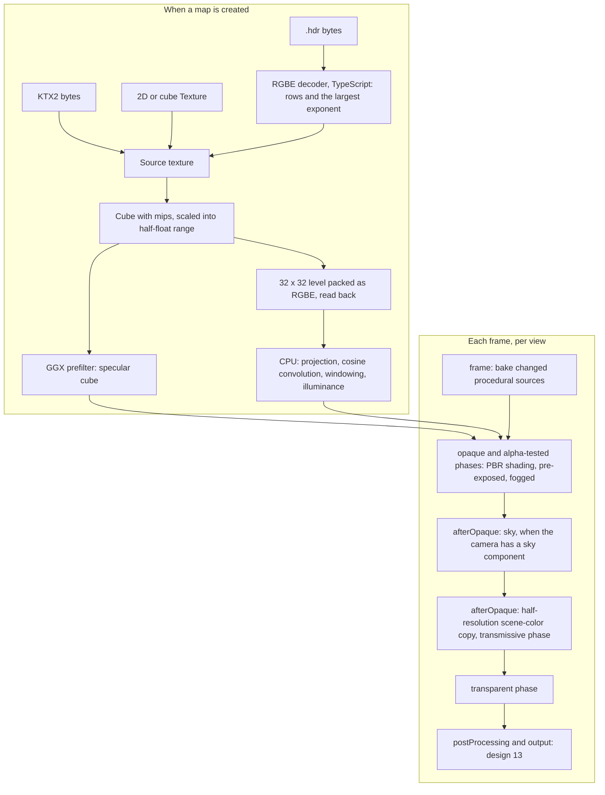

# Design 10: PBR and Environment Lighting

|                                       |                                                                                                       |
| ------------------------------------- | ----------------------------------------------------------------------------------------------------- |
| **Status**                            | Draft, for review (revised after solution review, §7)                                                 |
| **Kind**                              | Feature                                                                                               |
| **Engine version at time of writing** | `0.26.1`                                                                                              |
| **Program**                           | [Forge 3D](./README.md), milestone M3                                                                 |
| **Depends on**                        | [08 Meshes, materials and shaders](./08-meshes-materials-and-shaders.md), [09 Lighting and shadows](./09-lighting-and-shadows.md) |
| **Related**                           | [05 GPU device layer](./05-gpu-device.md) (bind groups, texture units, readback, context restore), [06 Render pipeline](./06-render-pipeline.md) (insertion points, view resources, phases, GPU scene), [11 glTF](./11-gltf-and-asset-lifetime.md) (material import, KTX2, the environment map asset kind), [13 Post-processing](./13-post-processing-and-anti-aliasing.md) (tone mapping, auto exposure, ambient occlusion), [01 Testing](./01-testing-and-benchmarks.md) (analytic, golden and reference tests) |

## 0. Targeted modules

| Path                                                          | Change   | Notes                                                                                                         |
| ------------------------------------------------------------- | -------- | ------------------------------------------------------------------------------------------------------------- |
| `src/lighting/materials/pbr-material.ts` (new)                | New      | `PbrMaterial`, its options and extension objects                                                              |
| `src/lighting/materials/texture-budget.ts` (new)              | New      | Texture slot deduplication and the extension priority order (§6.4)                                            |
| `src/lighting/components/` (created by design 09)             | Modified | `ExposureEcsComponent`, `EnvironmentEcsComponent`, `SkyEcsComponent`, `FogEcsComponent`, `MaterialDebugViewEcsComponent` |
| `src/lighting/exposure.ts` (new)                              | New      | `ev100FromCamera`, `ev100Presets`, the exposure multiplier                                                    |
| `src/lighting/environment/` (new)                             | New      | `EnvironmentMap`, `createEnvironmentMap`, the RGBE decoder, GPU processing, harmonics projection and windowing, procedural sources, the default environment |
| `src/lighting/brdf-lookup.ts` (new)                           | New      | The BRDF lookup table, generated on the GPU when the lighting feature is created                              |
| `src/lighting/passes/` (new)                                  | New      | Environment preparation (`frame`), sky, scene-color copy and transmissive phase (`afterOpaque`)               |
| `src/lighting/shaders/` (created by design 09)                | Modified | `forge/brdf`, `forge/pbr-surface`, `forge/pbr-lighting`, `forge/environment`, `forge/fog`, `forge/lit`; the lookup-table, conversion, prefilter, packing and sky shaders |
| `src/lighting/feature.ts` (created by design 09)              | Modified | `lighting()` registers this design's passes, phase, includes, view setup and the lookup table                 |
| `src/rendering/views/` (created by design 06)                 | Modified | Camera extraction reads this design's camera components and throws for them without `lighting()` (§6.13)      |
| `src/lighting/test-helpers/reference-brdf.ts` (new)           | New      | A TypeScript implementation of the BRDF used as the oracle for analytic tests                                  |
| `src/rendering/color.ts`                                      | Modified | `Color.fromLinear`, the inverse of design 07's linear conversion. Today `color.ts` has no linear conversion: only `fromHSLA`, `toRGBAString` and `toFloat32Array` |
| `e2e/specs/pbr-analytic.spec.ts`, `e2e/golden/lighting/` (new) | New     | Analytic and golden tests (§6.16)                                                                             |
| `e2e/reference/` (new)                                        | New      | Reference renders with the Khronos glTF Sample Renderer in the pinned golden container                         |
| `bench/scenes/shading/` (new)                                 | New      | Full-screen shading benchmarks per material feature; environment processing and scene-color copy benchmarks  |
| `package.json`                                                | Modified | `@khronosgroup/gltf-viewer` as a pinned dev dependency; `test:reference` script                               |
| `documentation-site/docs/docs/lighting/`                      | Modified | New `pbr-materials.md`, `environment-lighting.md`, `sky-and-fog.md`; `light-units-and-exposure.md` gains exposure |
| `documentation-site/src/pages/demos/` (new demos)             | New      | `pbr-materials`, `environment-and-fog`                                                                        |

---

## 1. Summary

Design 09 gives Forge lights in physical units and shadows, and leaves the
shading model to this design. This design adds:

- **`PbrMaterial`**, the glTF 2.0 metallic-roughness material: base color,
  metallic and roughness, normal, occlusion and emissive maps, alpha modes,
  double-sided rendering, vertex colors, two texture coordinate sets and
  texture transforms. It is written with design 08's engine shader library,
  so a material's surface, light, ambient and final-color hooks compose
  with it.
- **The glTF material extensions**: clearcoat, sheen, transmission,
  volume, dispersion, index of refraction, specular, iridescence,
  anisotropy and emissive strength. Unlit glTF materials map to design 08's
  `UnlitMaterial`. When a material has more textures than its share of
  texture units, whole extensions are dropped in a fixed priority order,
  never the core maps.
- **The BRDF**: Cook-Torrance with the GGX distribution, height-correlated
  Smith visibility and Schlick Fresnel, Lambertian diffuse combined as the
  glTF specification does, energy compensation for multiple scattering,
  specular anti-aliasing, and widened highlights for lights with a size.
- **Exposure** as a camera component holding EV100, with a helper that
  computes it from a physical camera's aperture, shutter speed and ISO.
  Lit shading is multiplied by it, so the physical light values of design
  09 land in a displayable range. The default exposure suits design 09's
  default sun. A camera has manual or automatic exposure (design 13), not
  both.
- **Environment lighting**: an environment component on the camera, whose
  source is an HDR environment map, a gradient or a color. A map is made
  from the bytes of a `.hdr` or KTX2 file, or from a texture, and is
  processed on the GPU when it's created into a GGX-prefiltered cube map
  for reflections, scaled into half-float range, plus nine
  spherical-harmonic coefficients for diffuse light, projected on the CPU
  from a small readback and windowed so they don't ring. A lit view
  without an environment component is lit by a default gradient
  environment, so a lit model looks right with no setup.
- **Sky and fog**: a sky pass that draws the environment behind the scene
  when the camera has a sky component, and exponential distance and height
  fog applied by every engine material, including transmissive ones
  without fogging their background twice.

Tone mapping, auto exposure and screen-space ambient occlusion are design
13's. This design defines how they plug in.

---

## 2. Scope

### In scope

- `PbrMaterial` and the glTF metallic-roughness model, every alpha mode,
  double-sided, vertex colors, texture coordinate sets,
  `KHR_texture_transform`, and normal mapping on mirrored objects.
- The ratified glTF material extensions listed above, and the mapping from
  glTF material JSON to `PbrMaterial` and `UnlitMaterial` that design 11
  implements.
- The texture-unit budget for materials: deduplication and priority.
- The BRDF and its layering, energy compensation, specular anti-aliasing
  and light size; the BRDF lookup table.
- Exposure, its defaults and how it relates to emissive, unlit and 2D
  content.
- The environment component, procedural and map sources, map creation and
  GPU processing, half-float range, harmonics and deringing, the default
  environment, specular occlusion.
- The sky pass and fog.
- The transmissive phase and the scene-color copy it reads.
- A material debug view; analytic, golden, reference and performance tests;
  guides and demos.
- Who writes each value (§6.18) and the changes this design needs in
  designs 05, 06, 08, 09 and 13 (§6.19).

### Out of scope

- **Tone mapping, color grading and auto exposure**: design 13. This design
  produces pre-exposed linear color for them.
- **Computing ambient occlusion**: design 13. This design consumes its
  texture for diffuse and specular occlusion.
- **Loading glTF files**: design 11 reads the JSON and creates materials
  through §6.14's mapping.
- **Loading environment files by URL with a lifetime**: design 11's
  `environmentMapAsset` kind, over this design's `createEnvironmentMap`.
- **A physically based atmosphere** (Rayleigh and Mie scattering, aerial
  perspective, a sun disk) and **volumetric fog** with light shafts. A sky
  and fog design can follow; the sky pass and fog stage here are where it
  would plug in.
- **Local reflection probes, light probes and screen-space reflections.**
  One environment per camera here. Probes need placement, blending and
  capture tooling, which is a design of its own.
- **`KHR_materials_diffuse_transmission`** (a release candidate, not
  ratified, at the time of writing) and **`KHR_materials_pbrSpecularGlossiness`**
  (archived by Khronos; convert with glTF-Transform).
- **Subsurface scattering**, **more than one layer of transmission**
  (glass seen through glass, open question 5) and **colored or partial
  shadows through transmissive surfaces**.
- **An LDR shading path.** Lit views need float color buffers (README P4).
- **2D lighting.** Sprites, text and UI stay display content (design 07).

---

## 3. Phases

### Phase 1: The core material, exposure and procedural environments

| #    | Task                       | Description                                                                                                                              | Size |
| ---- | -------------------------- | ---------------------------------------------------------------------------------------------------------------------------------------- | ---- |
| 1.1  | BRDF lookup table          | §6.8.5: generated on the GPU when `lighting()` is created; regenerated through design 05's restore notification; `lighting()` throws on a device without float color buffers | S |
| 1.2  | BRDF library               | §6.6: `forge/brdf`, `forge/pbr-lighting`: GGX, visibility, Fresnel, glTF mixing, energy compensation, specular anti-aliasing, light size | L    |
| 1.3  | `PbrMaterial` core         | §6.2: factors and the five core maps, alpha modes, double-sided, vertex colors, texture coordinate sets and transforms, mirrored tangent frames, block layout, variants | L |
| 1.4  | Shader flow and hooks      | §6.5: `forge/pbr-surface`, `forge/lit`; the surface hook runs after the material's own evaluation; light and ambient hooks replace the engine's terms they cover | M |
| 1.5  | Exposure                   | §6.7: `ExposureEcsComponent` (EV100), `ev100FromCamera`, presets, the view's exposure, pre-exposed output, output clamp; a camera with auto exposure as well throws | S |
| 1.6  | Procedural environments    | §6.8: the environment component with color and gradient sources, analytic harmonics, small prefiltered cubes, the default environment   | M    |
| 1.7  | View setup                 | §6.13: camera extraction reads this design's camera components; one of them in a pipeline without `lighting()` throws                  | S    |
| 1.8  | Reference BRDF and analytic tests | §6.16: the TypeScript oracle; white furnace at several `n·v`; known illuminance (design 01 §6.4.4)                                | M    |
| 1.9  | Reference renders          | §6.16.3: hand-built scenes exported to glTF and rendered by the Khronos Sample Renderer in the golden container                         | M    |
| 1.10 | Material debug view        | §6.5.4: base color, normal, metallic, roughness, occlusion, emissive, diffuse and specular light                                         | S    |
| 1.11 | Guide, demo, changelog     | `pbr-materials.md`, the exposure half of `light-units-and-exposure.md`, the `pbr-materials` demo (a sphere grid); `#### Added`           | M    |

**Definition of done:** the white furnace and known-illuminance tests pass
on CI's SwiftShader and on the reference devices, at every sampled `n·v`;
the hand-built metal-roughness sphere grid matches its Sample Renderer
references within the reference tolerance (§6.16.3), under a uniform
environment (given to the Sample Renderer as a generated one-color `.hdr`)
and under a directional light; a normal-mapped plane and its mirror image
light as mirror images; §6.1's example renders a lit, shadowed sphere with
no exposure or environment setup.

### Phase 2: Environment maps

| #   | Task                       | Description                                                                                                         | Size |
| --- | -------------------------- | ------------------------------------------------------------------------------------------------------------------- | ---- |
| 2.1 | RGBE decoder               | §6.9.2: Radiance `.hdr` header, flat and run-length-encoded rows, orientation, downsampling past the device's texture size, the largest exponent | M |
| 2.2 | Sources                    | §6.9.1: `createEnvironmentMap` from bytes (format detected) or from a 2D or cube `Texture`                          | S    |
| 2.3 | GPU processing             | §6.9.3: conversion to a cube scaled into half-float range, mips, GGX prefiltering with filtered importance sampling | L    |
| 2.4 | Spherical harmonics        | §6.9.4: the 32 × 32 level packed as RGBE and read back; projection, cosine convolution and windowing on the CPU; the map's illuminance | M |
| 2.5 | Map sources on the component | Illuminance normalization and rotation for maps                                                                   | S    |
| 2.6 | Occlusion                  | §6.8.4: material occlusion combined with design 13's ambient occlusion in opaque and alpha-tested variants; specular occlusion | S |
| 2.7 | Context loss and lifetime  | Reprocessing from the kept source after design 05's restore notification; `dispose`; `prepare()` waits for pending maps | S |
| 2.8 | Benchmarks and guide       | The processing benchmark (§6.15); `environment-lighting.md`                                                         | M    |

**Definition of done:** a 2048 × 1024 `.hdr` processes within the §6.15
budgets; harmonics and prefiltered mips of synthetic environments match
CPU references read back in the browser; an `.hdr` with a sun far above
half-float range processes with no infinite or NaN value and the same
illuminance as a scaled-down copy; the irradiance of a sun-dominated map
is non-negative in every direction; the sphere grid under a Khronos sample
environment matches its reference render.

### Phase 3: Sky and fog

| #   | Task                       | Description                                                                                         | Size |
| --- | -------------------------- | --------------------------------------------------------------------------------------------------- | ---- |
| 3.1 | Sky pass                   | §6.10: environment source, gradient, color and blurred skies behind opaque geometry                 | M    |
| 3.2 | Fog                        | §6.11: exponential height fog integrated from where fog starts, in the final-color stage of `PbrMaterial`, `UnlitMaterial` and hooked materials (design 08's `fog` feature bit), and on the sky | M |
| 3.3 | Fog and blend modes        | Additive materials fade to black and multiply materials to white                                    | S    |
| 3.4 | Guide and demo             | `sky-and-fog.md`; the `environment-and-fog` demo                                                    | M    |

**Definition of done:** golden scenes for each sky source and fog mode;
the fog analytic tests (§6.16.2) pass, including a start distance on a
sloped view; unlit and lit materials at the same distance receive the
same fog.

### Phase 4: Layered extensions

| #   | Task                       | Description                                                                                         | Size |
| --- | -------------------------- | --------------------------------------------------------------------------------------------------- | ---- |
| 4.1 | Texture budget             | §6.4: deduplication, priority order, warnings, stats counters                                        | M    |
| 4.2 | IOR and specular           | `KHR_materials_ior`, `KHR_materials_specular`                                                        | S    |
| 4.3 | Clearcoat                  | Coat lobe, coat normal map, base attenuation, coat environment term                                  | M    |
| 4.4 | Sheen                      | Charlie distribution, albedo scaling, environment term from the lookup table                         | M    |
| 4.5 | Iridescence                | Thin-film Fresnel                                                                                    | M    |
| 4.6 | Anisotropy                 | Anisotropic GGX and visibility; bent reflection for the environment                                  | M    |
| 4.7 | Goldens and guide          | Hand-built golden and reference scenes per extension; the extensions section of `pbr-materials.md`  | M    |

**Definition of done:** each extension's hand-built scene matches its
reference render; a material with every extension on a 16-unit device
keeps its core maps and drops extensions in the documented order, with one
warning.

### Phase 5: Transmission, volume and dispersion

| #   | Task                       | Description                                                                                         | Size |
| --- | -------------------------- | --------------------------------------------------------------------------------------------------- | ---- |
| 5.1 | Transmissive phase         | §6.12: a sorted phase drawn after the sky; the half-resolution scene-color copy with mips, made only when the phase has items | M |
| 5.2 | Transmission               | Thin-walled transmission, roughness-blurred, light transmission for punctual lights                 | L    |
| 5.3 | Volume                     | Refraction through thickness, Beer-Lambert attenuation                                              | M    |
| 5.4 | Dispersion                 | Per-channel index of refraction                                                                     | S    |
| 5.5 | Fog through transmission   | §6.11: the surface's own light fogged, the copy added as it is                                      | S    |
| 5.6 | Goldens and benchmark      | Spheres and slabs over a checkerboard; thin and thick; attenuation; dispersion; the copy at half and full resolution, with and without MSAA | M |

**Definition of done:** the transmission scenes match their reference
renders; a view with no transmissive items makes no copy (checked with the
device counters); the fog analytic test through a thin slab passes; the
copy meets its budget on the integrated-GPU reference, or the budget is
replaced with the measured value and PB20 revisited.

### Phase 6: KTX2 environments and sample-model goldens (with design 11)

| #   | Task                       | Description                                                                                         | Size |
| --- | -------------------------- | --------------------------------------------------------------------------------------------------- | ---- |
| 6.1 | KTX2 cube sources          | §6.9.2: HDR cube maps through design 11's KTX2 reader                                               | M    |
| 6.2 | Sample-model goldens       | §6.16.4: the Khronos material models and `NegativeScaleTest`, added to design 11's sample-model golden suite with its framing, each checked against the Sample Renderer | L |
| 6.3 | Mapping review             | §6.14's table checked against design 11's importer on the Khronos material test models              | S    |

**Definition of done:** the sample-model goldens pass and their reference
checks are recorded; B5 meets its budget with the Sponza glTF.

---

## 4. Decision log

| #    | Decision                                        | Options                                                                                                                                                              | Chosen | Rationale, trade-offs, assumptions                                                                                                                                                                                                                                                                                                                                         |
| ---- | ----------------------------------------------- | -------------------------------------------------------------------------------------------------------------------------------------------------------------------- | ------ | -------------------------------------------------------------------------------------------------------------------------------------------------------------------------------------------------------------------------------------------------------------------------------------------------------------------------------------------------------------------------- |
| PB1  | Shading model                                    | (a) glTF 2.0 Appendix B: GGX, height-correlated Smith, Schlick, Lambert, mixed by Fresnel; (b) Disney/Burley diffuse with a retro-reflection term; (c) an engine-specific model | (a) | glTF is Forge's only 3D format (README), and assets are authored and validated against the Sample Viewer's implementation of Appendix B. Matching it means a model looks in Forge the way its author saw it. Burley diffuse (Filament, Unreal) differs visibly at grazing angles on rough surfaces and is not what glTF specifies.                                    |
| PB2  | Multiple scattering                              | (a) Energy compensation from the lookup table: Fdez-Agüera's model for the environment, a scale on the specular lobe for punctual lights; (b) none, as the Sample Viewer does for punctual lights | (a) | Single-scattering GGX loses tens of percent of its energy on rough metals (Kulla and Conty 2017), so rough gold looks too dark. The environment form is what the Sample Viewer uses; the punctual form is Filament's, using the same table. Trade-off: rough metals under punctual lights are brighter than in the Sample Viewer, a known deviation in reference checks (§6.16.3).                     |
| PB3  | How `PbrMaterial` is built                       | (a) On design 08's shader library: the material's texture evaluation is an engine function, followed by the material's surface hook; (b) a separate hand-written shader | (a) | The product owner asked for a pipeline that custom shaders hook into, and the engine's own material must use the same mechanism or hooks will drift from it. A surface hook on a `PbrMaterial` sees the textured values and changes any of them; light and ambient hooks receive the same surface.                                                               |
| PB4  | What enables an extension's shader code          | (a) The extension's options object being present (a variant); its factors are uniforms; (b) a nonzero factor                                                       | (a)    | Switching variants when a factor crosses zero would compile a new program in the middle of an animation (design 08 MS3, MS10). Presence matches glTF: an extension is either on a material or not.                                                                                                                                                                  |
| PB5  | A material with more textures than units         | (a) Keep the core maps; drop whole extensions in a fixed priority order, then optional refinement maps; deduplicate slots that use the same texture; warn once; (b) refuse to create the material; (c) pack textures into arrays at load | (a) | A 16-unit device leaves a material 9 units (design 05 §6.6); the core and extension textures together need 17. Dropping a gating map alone (clearcoat strength, transmission) would apply the effect to the whole surface, which is worse than dropping the extension, and glTF requires extensions to degrade to the core material. (c) can't work for compressed textures, which can't be copied into an array on WebGL2. |
| PB6  | Vertex colors                                    | (a) Applied when the mesh has `color0`, as glTF specifies; (b) a material flag                                                                                     | (a)    | glTF says `COLOR_0` multiplies base color, and one glTF material can be shared by meshes with and without it; a flag would force the importer to split materials. Bevy also decides from the mesh. The mesh features in design 08's variant key already carry it, and design 08's `UnlitMaterial` works the same way (§6.6 there).                             |
| PB7  | Where exposure lives                             | (a) A camera component holding EV100; (b) a multiplier on the tone-mapping component, as today; (c) a pipeline setting               | (a)    | Exposure is a property of the camera, and each camera can have its own (design 06 R12). EV100 is the unit design 09 promised. Filament, Bevy and Unity's HDRP all expose EV100. Today's `ToneMappingEcsComponent.exposure` (`src/rendering/components/tone-mapping-component.ts:19`, default 1 at `:32`, read at `src/rendering/systems/tone-map-system.ts:71`) would be a second exposure; design 13 Phase 5 removes it in the release that adds this component. |
| PB8  | Where exposure is applied                        | (a) In lit shaders, before writing (pre-exposure); (b) in the output pass                                                                                          | (a)    | Physical values overflow `rgba16float`: a 100,000 lux sun on a smooth surface reaches several million before exposure, past half-float's 65,504. Pre-exposure is what Frostbite, Filament and Bevy do, and it keeps bloom and anti-aliasing working on displayable magnitudes.                                                                              |
| PB9  | Emissive units                                   | (a) Nits, multiplied by exposure, as the glTF specification defines emissive; (b) relative to exposure (always visible); (c) (a) plus an exposure-weight option, as Unity HDRP and Bevy have | (a), pending open question 1 | glTF defines emissive factor times texture in candela per square meter. Treating it as nits keeps emitters consistent with lights under any exposure and under design 13's auto exposure. Exposure-independent glow is what `UnlitMaterial` is for. Open question 1 asks the product owner how content authored for an exposure of 1 is imported, before M4. |
| PB10 | Unlit and 2D content under exposure              | (a) Display-referred: written as authored, not multiplied by exposure; (b) multiplied like lit content                                                            | (a)    | A sprite, a world-space label or `Color.white` on an unlit mesh should look the same at any exposure, as it does today. Bevy treats unlit materials the same way. HDR colors above 1 still bloom.                                                                                                                                                                 |
| PB11 | Where the environment is set                     | (a) A component on the camera; (b) a world singleton                                                                                                               | (a)    | Matches design 06's per-camera effects; two cameras (a level and an inventory preview) can light differently. Bevy puts its environment light on the camera; Godot lets a camera override the world's environment. A world-wide default is the default environment (PB12).                                                                                      |
| PB12 | A lit view with no environment component         | (a) The default environment: a gradient at 2,500 lux that lights but isn't drawn; (b) no ambient light                                                             | (a)    | With no ambient, every shadow and every surface facing away from the sun is black, and a metal reflects nothing, so the README's "lit model in under 20 lines" would look broken. Unity (a default procedural sky that also lights) and Bevy (a default ambient light) light a scene that sets nothing up. Godot 4 does only in its editor preview: at runtime a scene without a `WorldEnvironment` has none, and its users meet that as objects turning black when the game runs. Three.js has none. The default isn't drawn, so the background stays the camera's clear color until the camera gets a sky component (PB19), as in Bevy, whose default clear color doesn't match its ambient light either. Adding any environment component replaces the default, including a black color for scenes that want none. |
| PB13 | Environment brightness                           | (a) `illuminance`: the lux a white, up-facing surface receives from it; (b) a raw multiplier on the source's values                                               | (a)    | Most HDR images are not calibrated, so a multiplier gives each image a different brightness and nothing relates it to the sun's lux. Normalizing to illuminance makes images interchangeable and puts ambient light in the same unit as design 09's directional light; Unity HDRP offers the same "lux" mode. A calibrated image keeps its own brightness with `illuminance: map.illuminance`. |
| PB14 | Diffuse environment light                        | (a) Nine spherical-harmonic coefficients in the view block, projected on the CPU (PB33) and windowed (PB34); (b) an irradiance cube map                          | (a)    | (b) costs a fragment texture unit, which design 05 doesn't reserve. Nine coefficients represent irradiance with an average error of a few percent at most, and about 1% for typical environments (Ramamoorthi and Hanrahan 2001), in 144 bytes of uniforms. A small, very bright sun is the worst case: the error is largest on the side facing away from it, where the projection rings negative; windowing (PB34) removes the ringing at the cost of some directional contrast. Filament and Unity's ambient probes use harmonics. |
| PB15 | Specular environment light                       | (a) One GGX-prefiltered cube, roughness per mip, made on the GPU when the map is created (split-sum approximation); (b) prefiltered offline by a tool               | (a)    | Forge is code-only; a game drops in a `.hdr` file. GPU prefiltering of a 256 cube takes a few milliseconds (§6.15). Unreal's split sum is the established method.                                                                                                                                                                                  |
| PB16 | Sheen environment term                           | (a) Sample the GGX cube at the sheen roughness, scaled by the sheen albedo from the lookup table; (b) a second, Charlie-prefiltered cube, as the Sample Viewer does | (a) | (b) costs a texture unit and a second prefilter. Filament and Three.js use (a). Trade-off: sheen reflections of the environment are slightly sharper than the Sample Viewer's; a known deviation in reference checks.                                                                                                                                |
| PB17 | Environment rotation                             | (a) An angle about `+Y`; (b) a quaternion                                                                                                                          | (a)    | Environment images are captured level; tilting one puts the horizon at an angle. A rotation about Y keeps the up-facing illuminance (PB13) unchanged and costs one 2D rotation in the shader. Unity and Unreal rotate skies about the vertical axis only.                                                                                                     |
| PB18 | RGBE data                                        | (a) Decode run-length encoding in TypeScript, recording the largest exponent; upload the RGBE bytes and decode exponents on the GPU; (b) convert to floats on the CPU | (a)    | The CPU work is a byte copy loop, and the largest exponent is a comparison in it (PB32 needs it); (b) adds a float conversion per texel (tens of milliseconds for a 4K image) and doubles the upload. The source texture stays 4 bytes per texel and serves the sky at full resolution and full range.                                                       |
| PB19 | What the sky draws                               | (a) The camera's environment, or the default environment, drawn only when the camera has a sky component; (b) a separate sky texture or material; (c) also draw the default environment for lit views without a sky component | (a)    | When the sky is drawn, reflections, ambient light and background agree, because they come from one source. Without a sky component the background is the camera's clear color even though the default environment lights the scene; the guide says so and shows the one line that adds the sky. (c) would make the sky an effect without a component (against design 06 R12) and would cover what a camera with `clearColor: null` draws over, such as a 3D layer over a 2D background. A game that wants a background unrelated to its lighting uses the camera's clear color or its own pass at `afterOpaque`. |
| PB20 | Transmission                                     | (a) A copy of the opaque scene color at half the view's width and height, with mips, read by a sorted transmissive phase drawn after the sky; (b) the same at full resolution; (c) screen-space ray marching; (d) no transmission | (a)    | The Sample Viewer, Three.js and Bevy all use a copy, and glTF's transmission is specified for it. At 1080p a full-resolution `rgba16float` copy and its mips move about 50 MB per frame, plus the MSAA resolve's, which doesn't fit a fraction of a millisecond on the integrated-GPU reference; the Sample Viewer copies into a fixed 1024 × 1024 texture for the same reason. Half resolution reads the resolved color once and writes a quarter of it. Trade-off: smooth glass shows its background slightly softer, a known deviation in reference checks; Phase 5 measures both resolutions. Transmissive objects don't see each other or alpha-blended objects behind them (open question 5). |
| PB21 | The scene-color texture's unit                   | (a) The unit ambient occlusion uses in opaque variants; (b) an eighth engine unit; (c) a unit from the material's share                                          | (a)    | Screen-space ambient occlusion is computed from the prepass depth of opaque geometry, so transmissive and transparent surfaces never sample it (§6.8.4). Sharing the unit keeps design 05's reservation at seven and leaves the material's share unchanged.                                                                                              |
| PB22 | Fog model and where it's applied                 | (a) Exponential height fog, integrated analytically along the view ray from where fog starts, applied per fragment in the final-color stage; (b) a full-screen pass reading depth | (a)    | A full-screen pass can't fog transparent surfaces, which have no depth. The analytic integral of a density that falls off with height is Unreal's exponential height fog, which also starts its integral at the excluded distance; a falloff of zero gives plain exponential distance fog, so one model covers both.                                     |
| PB23 | Fog color                                        | (a) Either lit by the environment (physical, follows exposure) or a fixed color that is display-referred like the clear color; (b) always physical                | (a)    | Environment-lit fog matches the sky automatically. A stylized game picks one color for its clear color and its fog and expects them to match at any exposure; physical fog would need the game to divide by exposure. Bevy's fog color behaves like (a)'s fixed color.                                                                                          |
| PB24 | Specular anti-aliasing                           | (a) Always on, fixed constants: roughness widened by the screen-space variance of the shading normal; (b) a per-material option                                  | (a)    | Without it, smooth normal-mapped surfaces sparkle as the camera moves, and Forge has no temporal anti-aliasing to hide it. Godot enables the same filter by default. It never darkens or brightens a surface (energy is unchanged), so no game needs it off. Trade-off: silhouettes of very smooth objects are slightly rougher than in the Sample Viewer.       |
| PB25 | BRDF lookup table                                | (a) Generated on the GPU at startup (128 × 128, four channels); (b) shipped as a file; (c) an analytic approximation                                             | (a)    | (b) adds an asset every game must serve; (c) (Karis's mobile fit) is not accurate enough for the sheen and compensation terms. Generation takes about 1 ms of GPU time once.                                                                                                                                                                           |
| PB26 | Iridescence evaluation                           | (a) Once per pixel with `n·v`, applied to every light and the environment; (b) per light with `v·h`                                                               | (a)    | The thin-film Fresnel costs about a hundred instructions; per light it multiplies with the light count. The Sample Viewer evaluates it once per pixel.                                                                                                                                                                                                 |
| PB27 | Highlights of lights with a size                 | (a) Karis's representative point with lobe renormalization; (b) ignore the size for specular                                                                      | (a)    | Design 09's `radius` and `angularDiameter` exist so a big lamp or the sun doesn't make a pinpoint highlight on a mirror, and the same values set its penumbra. The representative point is cheap and is what Unreal uses. `ForgeLight` carries the angular radius (§6.19), so a light hook that calls `forge_pbrLight` gets the same highlight.          |
| PB28 | Colors in the material API                       | (a) Forge `Color` (sRGB as authored, design 07), with `Color.fromLinear` for linear values such as glTF factors; (b) linear tuples                                | (a)    | One color convention across sprites, lights and materials. glTF factors and published reference albedos are linear, so the inverse conversion is a public function, not something the importer reimplements. It inverts design 07's one conversion (S10) with the same transfer functions, not a second copy of them.                                  |
| PB29 | Environment processing timing                    | (a) Immediately on the device when a map is created, outside the frame; (b) inside the frame graph's `frame` pass                                               | (a)    | A game awaits `createEnvironmentMap` before its loop starts; work queued for a frame would never run. The `frame` pass bakes only procedural sources that changed, which is cheap.                                                                                                                                                                       |
| PB30 | What the exposure component stores               | (a) `ev100` only; a physical camera converts with `ev100FromCamera`; (b) a union of EV100 and aperture, shutter speed and ISO                                     | (a)    | The physical camera is one line of game code through `ev100FromCamera`, while a union makes every reader (view setup, design 13's metering, debug views) handle two kinds. Bevy's `Exposure` stores only `ev100` and builds it from physical camera parameters the same way. Depth of field isn't in this program, so nothing else would read the aperture. |
| PB31 | A camera with manual and automatic exposure      | (a) Throw; (b) auto exposure silently wins                                                                                                                         | (a)    | Two components setting one value is two writers, and (b) leaves a manual exposure that does nothing. Design 06 R6 throws for a second camera controller for the same reason. A game switching modes removes one component and adds the other.                                                                                                      |
| PB32 | Environment values past half-float range         | (a) Scale the conversion by `2^−k` from the decoder's largest exponent, and keep `k` on the map; (b) clamp at 65,504, as Three.js does; (c) an `rgba32float` cube | (a)    | A sun that wasn't clipped in an HDR image often exceeds 65,504, which `rgba16float` stores as infinity; `generateMipmap`, the prefilter and the harmonics then spread infinity and NaN over the whole map. (b) avoids that but removes the sun's energy, so `map.illuminance` and reflections are wrong. (c) doubles memory and can't be filtered without `OES_texture_float_linear`. A power-of-two scale is exact and is restored in the view's environment scale. Trade-off: in maps with extremely bright suns, regions millions of times dimmer lose precision in the cube; the sky reads the source at full precision. |
| PB33 | Projecting the harmonics                         | (a) On the CPU, from the cube's 32 × 32 level packed as RGBE into `rgba8unorm` and read back asynchronously; (b) a GPU reduction into float targets               | (a)    | (b) needs a renderable `rgba32float` target, which devices with only `EXT_color_buffer_half_float` lack (README P4 and design 05 D11 accept them), and summing in half floats overflows. The level has 6,144 texels, which TypeScript projects in well under a millisecond. Some ANGLE backends refuse to read a half-float attachment as `FLOAT`, while every device reads `rgba8unorm`; design 13 packs its exposure result the same way (PP20). |
| PB34 | Ringing in the harmonics                         | (a) Window the bands with the largest window that keeps irradiance non-negative; (b) clamp negative irradiance in the shader; (c) nothing                          | (a)    | Order-2 harmonics of a map with a small, very bright sun ring negative on the far side, which shades backlit surfaces black. (b) hides the negative values but leaves the wrong shape. Windowing removes the ringing at its source and leaves maps that don't ring unchanged (Sloan 2017, "Deringing Spherical Harmonics"; Filament's cmgen windows by default). |
| PB35 | Custom lighting in engine materials              | (a) A material's `light` hook replaces the engine's per-light term and its `ambient` hook the environment term, each on its own; (b) a `shadingModel: 'custom'` option that switches both | (a)    | The option repeats what the presence of the hooks already says. Godot replaces its light loop when a shader defines `light()` and keeps ambient light and reflections. (a) also lets a material restyle direct light and keep image-based lighting. Hooks are already part of the variant key (design 08 §6.5.1), so nothing is added to it. |
| PB36 | Creating environment maps                        | (a) `createEnvironmentMap(renderContext, source)` taking a file's bytes (format detected from them) or a `Texture`; design 11's `environmentMapAsset` wraps it; (b) a URL loader now, deleted when design 11 lands | (a)    | (b) ships an API planned for deletion one milestone later. Detecting the format from the bytes, as design 11's `textureAsset` does, removes a `kind` field the game could get wrong. A `Texture` source keeps six-image and LDR panorama skies possible, as Three.js's prefilter generator and Godot's panorama sky accept textures. Until design 11, a game fetches the bytes itself, in one line. |
| PB37 | Fog on transmissive surfaces                     | (a) Fog the surface's own light, add in-scattered fog only for the share it doesn't transmit, and add the transmitted copy as it is; (b) fog the whole output     | (a)    | The copy is already fogged along the whole ray from the camera, so (b) fogs the background twice and glass looks foggier than the air around it. (a) equals fogging the camera-to-glass and glass-to-background segments separately for thin-walled transmission (§6.11). |
| PB38 | Normal maps on mirrored objects                  | (a) Negate the bitangent when the object's transform mirrors, by multiplying `tangent.w` by −1 in the vertex path from the GPU scene's mirrored flag; (b) use `cross(n, t) · w` as it is                                   | (a)    | A reflection flips the cross product of transformed vectors, so with (b) a mirrored object's bumps are lit from the wrong side. Unity multiplies the tangent sign by its odd-negative-scale flag in the vertex shader for this reason. The flag already exists for winding (design 06 §6.7.2), so the fix costs one multiply. |

---

## 5. Open questions

In priority order.

1. **Imported emissive and light values under physical exposure. To be
   decided with the product owner before M4** (design 11 Phase 2 maps core
   materials). glTF defines emissive in candela per square meter and
   lights in physical units, but glTF has no exposure, so most files are
   authored for viewers that show a value of 1 as white (the Sample
   Viewer's default exposure is a multiplier of 1); glTFast's
   documentation notes that authors use physically implausible light
   intensities for the same reason. Under the default EV100 12, an emitter
   of 1 nit writes about 0.0002: DamagedHelmet's emissive panels are
   invisible, which undercuts the README's "lit glTF model in under 20
   lines", and imported lights authored the same way are too dim. Options:
   (a) keep glTF's units; the guide shows raising `emissiveStrength` and
   light intensities; (b) a per-material exposure weight from 0 (nits) to
   1 (relative to exposure: 1 is a fully exposed pixel), as Unity's HDRP
   and Bevy have, which design 11 sets on imported materials; (c) a
   photometric scale per loaded model, applied by design 11 to emissive and
   lights alike, as glTFast's light intensity factor does for lights.
   Proposal: (c), which keeps one physical model under manual and auto
   exposure (PB9) and corrects emitters and lights from the same file
   together; whether its default is 1 (glTF's units) or a value that
   matches EV100 12 is the product owner's call.
2. **Default exposure and default environment values.** EV100 12 and a
   2,500 lux gradient are chosen to suit design 09's 10,000 lux sun
   (§6.7.4). Options: confirm them on the reference devices with design 13's
   default tone mapping, or adjust both together. Proposal: confirm at the
   M3 golden review.
3. **Specular cube size.** 256 per face (4.2 MB) blurs flat mirrors. Options:
   (a) 256 default with the per-map `specularSize` option; (b) 512 on
   desktop. Proposal: (a).
4. **Decoding large `.hdr` files on the main thread.** A 4096 × 2048 image
   takes about 150 ms to decode. Options: (a) decode in a worker from design
   11's worker pool; (b) leave it to loading screens. Proposal: (a) once
   design 11's pool exists.
5. **Several layers of transmission.** Glass seen through glass shows the
   opaque scene only. Bevy re-copies the scene color between transmissive
   steps. Proposal: single layer now; a later change if demos need it.

---

## 6. Design

### 6.1 Overview



A lit sphere with a shadowing sun, using the APIs of designs 04, 06, 08
and 09. No exposure or environment is set: the result is correctly exposed
and lit by the default environment, in front of the camera's clear color
(§6.8.2):

```ts
const { game, world, renderContext } = createGame('game');
const pipeline = createRenderPipeline(renderContext, { features: [lighting()] });
registerRendering(world, renderContext, pipeline);

createCamera(world, {
  projection: { kind: 'perspective' },
  position: { x: 0, y: 1.5, z: 4 },
});

const sun = world.createEntity();
addTransformComponent(world, sun, { rotation: Quat.fromYawPitchRoll(Quat.identity, 0.6, -0.9, 0) });
addDirectionalLightComponent(world, sun, { castsShadows: true });

const ball = world.createEntity();
addTransformComponent(world, ball, { position: { x: 0, y: 1, z: 0 } });
addMeshComponent(world, ball, {
  mesh: createSphereMesh(renderContext),
  materials: [new PbrMaterial(renderContext, { baseColor: new Color(0.7, 0.23, 0.18), roughness: 0.4 })],
});

game.run();
```

Design 11 replaces the mesh lines with one call that instantiates a model.
An HDR environment and a visible sky are two more lines on the camera
(§6.8, §6.10).

### 6.2 `PbrMaterial`

#### 6.2.1 API

```ts
const material = new PbrMaterial(renderContext, {
  baseColor: Color.white,              // sRGB as authored; alpha is opacity
  baseColorTexture: albedo,            // sRGB texture
  metallic: 1,
  roughness: 1,                        // perceptual roughness
  metallicRoughnessTexture: orm,       // G roughness, B metallic
  normalTexture: { texture: normals, uvSet: 0, transform: null },
  normalScale: 1,
  occlusionTexture: orm,               // R; deduplicated with the slot above
  occlusionStrength: 1,
  emissive: Color.black,               // sRGB color; luminance is emissive × emissiveStrength nits
  emissiveStrength: 1,
  emissiveTexture: null,
  ior: 1.5,
  blendMode: 'opaque',                 // 'opaque' | 'mask' | 'blend' (design 08 §6.4)
  alphaCutoff: 0.5,
  doubleSided: false,
  fog: true,                           // design 08's material option (§6.11 here)
  clearcoat: null,                     // extension objects, §6.3
  sheen: null,
  specular: null,
  transmission: null,
  volume: null,
  iridescence: null,
  anisotropy: null,
  hooks: {},                           // design 08 §6.8; light and ambient hooks replace the engine's terms (§6.5.2)
});

material.roughness = 0.25;             // writes the block, bumps version; no new variant
material.clearcoat = { factor: 1, roughness: 0.05 }; // adds a feature: a new variant compiles
```

Defaults are glTF's. Every texture slot takes a `Texture` or a
`MaterialTextureBinding` (`{ texture, uvSet: 0 | 1, transform:
TextureTransform | null }`), the binding type design 08 defines (§6.3.4
there), which carries glTF's `texCoord` and `KHR_texture_transform`
(`offset`, `rotation`, `scale`). A bare `Texture` means `uvSet: 0` and no
transform.

Setting a factor writes the material block (design 08 §6.3). Setting a
texture where there was none, removing one, or adding or removing an
extension object changes the variant (decision PB4), which compiles
asynchronously like any new variant (design 08 §6.10). The guide says to
create materials with the features they will use.

#### 6.2.2 Textures, channels and color spaces

| Slot                       | Channels used     | Color space required             |
| -------------------------- | ----------------- | -------------------------------- |
| `baseColorTexture`         | RGBA              | sRGB                             |
| `metallicRoughnessTexture` | G roughness, B metallic | linear                     |
| `normalTexture`            | RGB, or RG with Z reconstructed for two-channel formats | linear |
| `occlusionTexture`         | R                 | linear                           |
| `emissiveTexture`          | RGB               | sRGB                             |

Extension slots are in §6.3. A texture's color space is a property of the
texture (design 07 §6.6.1), so the GPU decodes sRGB when sampling. Binding
a texture whose color space doesn't match a slot's RGB use throws, naming
the slot. Slots that read only alpha accept either, since sRGB formats
don't encode alpha; that's what lets glTF pack sheen roughness into the
sheen color texture's alpha.

Normal maps follow glTF: tangent space, green towards the bitangent
`cross(normal, tangent.xyz) * tangent.w`, scaled in X and Y by
`normalScale`. For an object whose transform mirrors (an odd number of
negative scale axes, the GPU scene's mirrored flag, design 06 §6.7.2), the
bitangent must be negated, since a reflection flips the cross product of
transformed vectors (decision PB38). Design 08's vertex path, which reads
the flag in `forge/object`, multiplies `tangent.w` by −1 for such objects
before writing the tangent varying, so `forge_surfaceInput` builds the
right frame (§6.19). Meshes without tangents get MikkTSpace tangents
(design 08 MS8). A two-channel normal texture (BC5 or EAC RG from design
11's transcoder) sets a variant bit and the shader reconstructs Z.

#### 6.2.3 Alpha, sides and vertex colors

- `opaque` ignores alpha and writes `1`. `mask` discards below
  `alphaCutoff` and writes `1`, in the color, depth and shadow variants
  (design 08 §6.8.3). `blend` writes straight alpha (design 08 §6.7).
- `doubleSided` disables culling; back faces flip the normal and the
  tangent frame.
- When the mesh has `color0`, it multiplies base color and alpha
  (decision PB6). It's a mesh feature in the variant key, so one material
  serves meshes with and without vertex colors.
- `uvSet: 1` reads `uv1`. A mesh without `uv1` used with such a binding
  reads `uv0` and the material warns once, naming the mesh and slot.

#### 6.2.4 Texture transforms

Each bound slot with a transform gets a 2 × 3 matrix (two `vec4`s) in the
material block, composed on the CPU as `KHR_texture_transform` specifies
(translation × rotation × scale), and a variant bit, so slots
without transforms cost nothing. Slots with the same coordinates and
transform share one transformed coordinate in the shader.

### 6.3 Extensions

Each extension is an options object on the material; `null` means the
material doesn't have it. Defaults are the extension's.

| Extension (options)          | Fields                                                                                                     | Textures (channels, color space)                                        |
| ---------------------------- | ---------------------------------------------------------------------------------------------------------- | ----------------------------------------------------------------------- |
| `KHR_materials_ior` (`ior`, top level) | `ior` ≥ 1, or exactly 0; default 1.5. 0 is the extension's compatibility value, for which the Fresnel term is 1: §6.6.1's `((ior − 1)/(ior + 1))²` is already 1 there, so it needs no special case or variant. Refraction (§6.12) treats indices below 1 as 1 | – |
| `KHR_materials_specular` (`specular`) | `factor` (1), `color` (white)                                                                    | `texture` (A, any), `colorTexture` (RGB, sRGB)                           |
| `KHR_materials_clearcoat` (`clearcoat`) | `factor` (0), `roughness` (0), `normalScale` (1)                                             | `texture` (R), `roughnessTexture` (G), `normalTexture` (RGB), all linear |
| `KHR_materials_sheen` (`sheen`) | `color` (black), `roughness` (0)                                                                     | `colorTexture` (RGB, sRGB), `roughnessTexture` (A, any)                  |
| `KHR_materials_transmission` (`transmission`) | `factor` (0)                                                                           | `texture` (R, linear)                                                    |
| `KHR_materials_volume` (`volume`) | `thickness` (0, mesh-space meters), `attenuationDistance` (`Infinity`), `attenuationColor` (white), `dispersion` (0, `KHR_materials_dispersion`) | `thicknessTexture` (G, linear) |
| `KHR_materials_iridescence` (`iridescence`) | `factor` (0), `ior` (1.3), `thicknessMinimum` (100 nm), `thicknessMaximum` (400 nm)        | `texture` (R), `thicknessTexture` (G), linear                            |
| `KHR_materials_anisotropy` (`anisotropy`) | `strength` (0), `rotation` (0, radians)                                                     | `texture` (RG direction, B strength, linear)                             |
| `KHR_materials_emissive_strength` | `emissiveStrength` on the material                                                                    | –                                                                       |
| `KHR_materials_unlit`        | Not a `PbrMaterial`: design 11 creates an `UnlitMaterial` from the base color, its texture and alpha mode; vertex colors come from the mesh (design 08 §6.6) | – |

`volume` without `transmission` has no effect, as the extension says;
`dispersion` without `volume` likewise. The material warns once for
either.

### 6.4 Texture units

Design 05 reserves at most seven fragment units for the engine and gives a
material the rest: at least 9 on a 16-unit device (§6.6 there). Core PBR
uses up to 5; the extensions add up to 12 more. Hook samplers also come
from the material's share.

When a material's variant is built:

1. **Deduplicate.** Slots bound to the same `Texture` (the same GPU
   texture and sampler) share one sampler uniform and one unit. glTF files
   often pack occlusion, roughness and metallic into one image, clearcoat
   and its roughness into another, and so on, so most materials need far
   fewer units than slots.
2. **Required units**: the core slots and the material's hook samplers.
   If they don't fit, creating the variant throws, naming the counts. This
   can't happen with core maps alone; it can with many hook samplers.
3. **Extensions, by priority**: transmission (with volume), clearcoat,
   sheen, iridescence, anisotropy, specular. For each, its gating map (the
   one that scales the effect across the surface: `transmission.texture`,
   `clearcoat.texture`, `sheen.colorTexture`, `iridescence.texture`,
   `anisotropy.texture`, `specular.texture`) must fit, or the whole
   extension is left out of the variant. An extension without a gating map
   needs no unit here.
4. **Refinement maps, by priority**: `volume.thicknessTexture`,
   `clearcoat.normalTexture`, `clearcoat.roughnessTexture`,
   `sheen.roughnessTexture`, `iridescence.thicknessTexture`,
   `specular.colorTexture`. One that doesn't fit is left out, and its
   factor applies alone.

The priority order is how far the material's look moves from the author's
intent when the extension is missing: glass that becomes opaque first,
a slightly different specular tint last. Leaving out an extension renders
the core material, which glTF requires to be a valid fallback, whereas
leaving out only a gating map would spread the effect over the whole
surface (decision PB5).

Each leftover is reported once per material in a console warning naming
the material's label, the device's unit count and what was left out, and
counted in the stats overlay (design 06 §6.9). The material itself is
unchanged, so the same material on a device with more units renders
everything.

### 6.5 Shader flow

#### 6.5.1 The surface

Design 08's `ForgeSurface` gains the fields of the PBR model. One struct
serves every material; fields a variant doesn't read are removed by the
compiler.

```glsl
struct ForgeSurface {
  vec3 baseColor;            // linear
  float alpha;
  vec3 normal;               // world-space orientation, unit, facing the viewer
  float metallic;
  float roughness;           // perceptual
  float occlusion;           // material ambient occlusion, 1 = none
  vec3 emissive;             // nits
  float ior;
  float specularFactor;      // KHR_materials_specular
  vec3 specularColor;
  float clearcoat;
  float clearcoatRoughness;
  vec3 clearcoatNormal;
  vec3 sheenColor;
  float sheenRoughness;
  float transmission;
  float thickness;           // meters, after object scale
  vec3 attenuationColor;
  float attenuationDistance;
  float dispersion;
  float iridescence;
  float iridescenceIor;
  float iridescenceThickness; // nanometers
  float anisotropyStrength;
  vec3 anisotropyDirection;   // world-space, in the surface plane
};
```

#### 6.5.2 The fragment program

`forge/lit` is the color-pass fragment program for `PbrMaterial`:

```glsl
void main() {
  ForgeSurfaceInput input = forge_surfaceInput();      // design 08: position, view vector, uvs, color0, tangent frame
  ForgeSurface surface = forge_defaultSurface();
  forge_pbrSurface(surface, input);                    // PbrMaterial's factors and textures (this design)
#ifdef FORGE_HOOK_SURFACE
  forge_surface(surface, input);                       // the material's hook sees the textured values
#endif
  forge_alphaTest(surface);                            // mask only
  vec3 own = forge_shade(surface, input) * forge_exposure;     // physical units, then pre-exposure (§6.7.3)
  ForgeTransmitted transmitted = forge_transmitted(surface, input); // §6.12; zero without transmission
  vec4 color = forge_composeFog(own, transmitted, surface.alpha, input); // §6.11; a plain sum without fog
  color = forge_clampOutput(color);                    // §6.6.6
#ifdef FORGE_HOOK_FINAL_COLOR
  color = forge_finalColor(color, input);              // design 08: the last word
#endif
  forge_writeColor(color);                             // straight alpha (design 08 §6.7)
}
```

- `forge_shade` loops over design 09's lights (directional lights from the
  view block, then the cluster's lights), building a `ForgeLight` for
  each. It calls the material's `forge_light` hook when the material has
  one, and `forge_pbrLight` (§6.6) otherwise; then the material's
  `forge_ambient` hook when it has one, and `forge_pbrAmbient` (§6.8)
  otherwise; then adds emissive. Each hook replaces only the term it
  covers, so a toon material can quantize direct light with its own
  `forge_light` and keep the engine's image-based lighting, or replace
  both (decision PB35). There is no shading-model option: which hooks a
  material has is already part of its variant key (design 08 §6.5.1).
- Lighting is accumulated in physical units in `highp` floats, and
  multiplied by the view's exposure once (§6.7.3).
- `forge_transmitted` returns the transmitted color, already exposed and
  fogged, and the per-channel weight it was added with, which fog needs
  (§6.11). Without `FORGE_TRANSMISSION` it returns zeros and the compiler
  removes it.
- Depth and shadow variants run `forge_pbrSurface` and the surface hook
  only when the material is alpha-tested, and read only `alpha`.

#### 6.5.3 Shader library

| Include              | Provides                                                                                          |
| -------------------- | ------------------------------------------------------------------------------------------------- |
| `forge/brdf`         | Distribution, visibility and Fresnel functions; anisotropic, Charlie and thin-film variants      |
| `forge/pbr-surface`  | `forge_pbrSurface`: texture coordinates and transforms, sampling, normal mapping, vertex colors   |
| `forge/pbr-lighting` | `forge_pbrLight` (one light, all layers) and `forge_pbrAmbient` (environment, all layers)         |
| `forge/environment`  | Harmonics evaluation, specular cube lookup with rotation, the lookup table, specular occlusion    |
| `forge/fog`          | `forge_fog` (opacity and color along the view ray), `forge_applyFog`, `forge_composeFog`          |
| `forge/lit`          | The program above                                                                                 |

```glsl
vec3 forge_pbrLight(in ForgeSurface surface, in ForgeLight light, in ForgeSurfaceInput input);
vec3 forge_pbrAmbient(in ForgeSurface surface, in ForgeSurfaceInput input);
```

They have the hooks' signatures, so a material's `forge_light` can call
`forge_pbrLight` for some lights and restyle others. `forge_pbrLight` reads
`light.angularRadius` for the representative point (§6.6.4), which design
09's `ForgeLight` gains (§6.19). Custom shaders can include any of these.

#### 6.5.4 Material debug view

`MaterialDebugViewEcsComponent { channel }` on a camera replaces that
view's lit output with one channel: base color, world normal, metallic,
roughness, occlusion, emissive, diffuse light, specular light or the
number of texture units dropped. It's a pipeline-feature bit in the
variant key (design 08 §6.5.1), so it compiles only when used.

### 6.6 The BRDF

`α` is perceptual roughness squared. Perceptual roughness is clamped to at
least 0.045, so `α²` stays representable and the distribution's peak stays
finite (Filament uses the same bound).

#### 6.6.1 Base layer

- Distribution (GGX): `D = α² / (π ((n·h)² (α² − 1) + 1)²)`.
- Visibility (height-correlated Smith, Heitz 2014):
  `V = 0.5 / (n·l √((n·v)²(1 − α²) + α²) + n·v √((n·l)²(1 − α²) + α²))`.
- Fresnel (Schlick): `F(f0, f90) = f0 + (f90 − f0)(1 − v·h)⁵`.
- Dielectric: `f0 = min(((ior − 1)/(ior + 1))² · specularColor, 1) ·
  specularFactor`, `f90 = specularFactor`. The diffuse lobe,
  `baseColor / π`, is weighted by one minus the dielectric Fresnel, and the
  specular lobe `D·V` by the Fresnel, as glTF Appendix B and
  `KHR_materials_specular` define.
- Metal: specular lobe weighted by `F(baseColor, 1)`; no diffuse.
- The result mixes dielectric and metal by `metallic`.

Per pixel, the shader computes once what doesn't depend on the light
(diffuse color, `f0`, `f90`, `α`, the lookup-table sample, iridescence
Fresnel), the way Filament's pixel parameters do, so the per-light loop
does only light-dependent work.

#### 6.6.2 Energy compensation

The lookup table gives the split-sum terms `A` and `B` at
`(n·v, roughness)`; `Ess = A + B` is the directional albedo of the
single-scattering lobe for a white `f0`.

- **Punctual lights**: the specular lobe is multiplied by
  `1 + f0 (1/Ess − 1)` (Filament's form of Kulla and Conty's
  compensation).
- **Environment**: Fdez-Agüera (2019), as the Sample Viewer does:
  `FssEss = kS·A + B` with `kS` Schlick's roughness-aware Fresnel;
  `Ems = 1 − Ess`; `F_avg = f0 + (1 − f0)/21`;
  `FmsEms = Ems · FssEss · F_avg / (1 − F_avg·Ems)`. Specular is
  `prefiltered · FssEss + irradiance · FmsEms`, and the dielectric diffuse
  term is weighted by `1 − (FssEss + FmsEms)`.

Under a uniform environment this returns exactly the incoming light for
any white material at any `n·v`, which is what the white furnace test
checks at several angles (§6.16.2).

#### 6.6.3 Specular anti-aliasing

Before shading, `α²` grows by the screen-space variance of the final
shading normal (Tokuyoshi and Kaplanyan 2019):
`kernel = min(2 · 0.25 · (|dFdx(n)|² + |dFdy(n)|²), 0.18)`,
`α² = min(α² + kernel, 1)`. Using the normal after normal mapping filters
normal-map detail and geometric curvature together. The same widening
applies to the clearcoat lobe with the clearcoat normal (decision PB24).

#### 6.6.4 Lights with a radius

Lights with a size are point and spot lights with `radius > 0` and
directional lights with `angularDiameter > 0` (design 09 §6.1.1). Shaders
see the size as `ForgeLight.angularRadius`, the light's angular radius
from the shaded point: `asin(min(radius / distance, 1))` for point and spot
lights, `angularDiameter / 2` for directional ones (§6.19). For these, the
specular lobe uses Karis's representative point: the light direction
becomes the direction within the light's disc closest to the reflection
ray, and the lobe is renormalized by `(α / α')²`, with `α'` widened by the
angular radius (Karis 2013). Diffuse uses the light's center. The exact
widening constant is the paper's, checked by a golden that compares
highlight size against a brute-force sphere-light render in the reference
BRDF. The same size sets design 09's penumbra (L11 there), so a lamp's
highlight and its shadow's softness agree.

#### 6.6.5 Layers

- **Clearcoat**: a GGX lobe with `f0 = 0.04`, its own roughness and
  normal. The layers below are scaled by `1 − clearcoat · Fc(n_c·v)`, and
  the coat lobe is added, as the extension defines. Its environment term
  samples the specular cube along the coat normal's reflection at the coat
  roughness.
- **Sheen**: the Charlie distribution
  `D = (2 + 1/α_s) · sin(θh)^(1/α_s) / (2π)` with Estevez and Kulla's
  visibility, `α_s` the sheen roughness squared. The layers below are
  scaled by the extension's albedo scaling, `1 − max(sheenColor) · E`, with
  `E` the sheen directional albedo from the lookup table. Its environment
  term samples the GGX cube at the sheen roughness, scaled by `E`
  (decision PB16).
- **Iridescence**: Belcour and Barla's thin-film Fresnel (2017) for the
  film's thickness and index of refraction, evaluated once per pixel with
  `n·v` and mixed into the base Fresnel by `iridescence` (decision PB26).
- **Anisotropy**: the direction is the tangent-space direction rotated by
  `rotation` and the texture's RG; strength multiplies the texture's B.
  The lobe uses anisotropic GGX and height-correlated visibility with
  `αt = mix(α, 1, strength²)` along the direction and `αb = α` across it.
  The environment term reflects about a bent normal, as the extension's
  implementation notes describe.
- **Transmission** is §6.12. For punctual lights, the transmitted lobe is
  a GGX lobe around the light direction refracted through the surface,
  with roughness scaled by `clamp(2·ior − 2, 0, 1)`, tinted by base color.

#### 6.6.6 Numeric safety

`n·v` is clamped to at least `1e-4`, so grazing views don't divide by zero.
The pre-exposed result is clamped to 64,000, so a mirror highlight of the
sun never writes infinity into an `rgba16float` target, and NaNs from
degenerate tangents become 0 before writing. The sky's output is clamped
the same way.

### 6.7 Exposure

#### 6.7.1 The component

```ts
interface ExposureEcsComponent {
  /** Exposure value at ISO 100. Default 12 (ev100Presets.daylight). */
  ev100: number;
}

addExposureComponent(world, camera, { ev100: ev100Presets.indoor });

addExposureComponent(world, camera, {
  ev100: ev100FromCamera({ aperture: 16, shutterSpeed: 1 / 125, iso: 100 }),
});
```

- `ev100FromCamera` computes
  `EV100 = log2(aperture² / shutterSpeed) − log2(iso / 100)`. The
  component stores only the result (decision PB30); the physical camera
  holds only exposure, since depth of field is not in this program.
- The exposure multiplier is `1 / (1.2 · 2^EV100)`: the luminance that
  saturates a sensor of ISO 100 maps to 1 (Lagarde and de Rousiers 2014,
  as Filament and Bevy use).
- A lit view whose camera has no exposure component uses EV100 12.
- The game is the component's only writer.
- **Manual or automatic, not both** (decision PB31). Design 13's
  `AutoExposureEcsComponent` writes its own `ev100`. `addExposureComponent`
  throws when the camera has an `AutoExposureEcsComponent`, design 13's
  `addAutoExposureComponent` throws in the other case (§6.19), and the
  view setup throws for a camera that has both through
  `world.addComponent`, naming the camera, as design 06 R6 does for a
  second camera controller. The lighting feature's view setup writes the
  view block's exposure from whichever one the camera has.

#### 6.7.2 Presets

`ev100Presets` names common values. Each is the exposure a reflected-light
meter (calibration constant 12.5) picks for an 18% gray surface lit by the
listed illuminance, so illuminance ≈ `2.2 · 2^EV100` lux.

| Preset          | EV100 | Scene illuminance | Example                                           |
| --------------- | ----- | ----------------- | ------------------------------------------------- |
| `sunlight`      | 15    | ~70,000 lux       | Direct summer sun                                 |
| `daylight`      | 12    | ~9,000 lux        | Design 09's default sun (10,000 lux); the default  |
| `indoor`        | 7     | ~280 lux          | A lit room                                        |
| `dim`           | 3     | ~18 lux           | Design 09's default 800 lm bulb at 2 m (16 lux)   |

No single exposure suits both of design 09's defaults: the bulb at 2 m
gives about 1/600 of the sun's illuminance. The default fits the sun,
because a directional light is how most lit scenes start; the guide shows
the indoor presets and design 13's auto exposure for scenes lit by bulbs.

#### 6.7.3 What exposure applies to

| Content                                    | Exposure                                                        |
| ------------------------------------------ | --------------------------------------------------------------- |
| Lit shading: lights, environment, emissive | Multiplied, once, after `forge_shade` (decision PB8)             |
| Transmitted scene color                    | Already exposed and fogged (it's a copy of the view); added after the multiply and the surface's own fog (§6.11) |
| The sky                                    | Multiplied (it's the environment)                               |
| Environment-lit fog                        | Multiplied                                                       |
| Fixed-color fog, clear color               | Not multiplied: display-referred                                 |
| `UnlitMaterial`, sprites, text, UI         | Not multiplied: display-referred (decision PB10)                 |

Emissive is in nits (decision PB9): `emissive × emissiveStrength` is the
surface's luminance. A screen at 300 nits glows under indoor exposure and
is dim in sunlight, as a real one is. Open question 1 covers content
authored for an exposure of 1.

#### 6.7.4 Defaults that work together

Under EV100 12, design 09's 10,000 lux sun at 45° on a white (0.8)
surface plus the default environment gives about 0.5 before tone mapping;
a surface in shadow, lit only by the default environment's 2,500 lux, gives
about 0.13. Shadows read clearly and nothing clips. These are the values
behind §6.1's example and open question 2.

### 6.8 Environment lighting

#### 6.8.1 The component

```ts
interface EnvironmentEcsComponent {
  source: EnvironmentSource;
  /** Lux on a white, up-facing surface (decision PB13). Default 2,500. */
  illuminance: number;
  /** Radians about +Y, counter-clockwise seen from above. Default 0. */
  rotation: number;
}

type EnvironmentSource =
  | { kind: 'map'; map: EnvironmentMap }
  | { kind: 'gradient'; zenith: Color; horizon: Color; ground: Color; curve: number }
  | { kind: 'color'; color: Color };

const bytes = await (await fetch('studio.hdr')).arrayBuffer();
const studio = await createEnvironmentMap(renderContext, bytes, { label: 'studio' });
addEnvironmentComponent(world, camera, {
  source: { kind: 'map', map: studio },
  illuminance: 5_000,
});
```

- The component goes on the camera entity; the view reads it when it's
  set up (design 06 R12, §6.13). The game is its only writer.
- `illuminance` scales the source so that a white, up-facing Lambertian
  surface receives that many lux from it, measured as luminance. The
  source contributes only color and how light is spread over directions.
  A source that is black from above (or an `illuminance` of 0) is black;
  that's how a game turns ambient light off.
- A calibrated map keeps its own values with
  `illuminance: map.illuminance`. Reference comparisons use this.
- A gradient blends `horizon` to `zenith` above the horizon and `horizon`
  to `ground` below it, by elevation raised to `curve`.

#### 6.8.2 The default environment

A lit view whose camera has no environment component is lit by the
default environment (decision PB12), exported as `defaultEnvironment`:

```ts
{
  source: {
    kind: 'gradient',
    zenith: new Color(0.43, 0.55, 0.71),
    horizon: new Color(0.79, 0.82, 0.85),
    ground: new Color(0.34, 0.32, 0.29),
    curve: 0.6,
  },
  illuminance: 2_500,
  rotation: 0,
}
```

It's baked once when the lighting feature is created. It lights only;
it's drawn only when the camera has a sky component (§6.10). Until a game
adds one, the background is the camera's clear color, which doesn't match
the light coming from the default environment (decision PB19). The guide's
first lit example says so and adds the sky in one line.

#### 6.8.3 Shading

- **Diffuse**: the nine cosine-convolved, windowed spherical-harmonic
  coefficients of the view's environment (in the view block, already
  multiplied by the environment scale) evaluated at the rotated normal,
  times the diffuse color.
- **Specular**: the specular cube sampled at the rotated reflection
  vector, at mip `roughness · (mipCount − 1)`, times the environment scale,
  combined with §6.6.2's terms. WebGL2 cube maps are always seamless, so
  rough reflections have no face seams.
- Clearcoat, sheen, anisotropy and transmission add their own terms
  (§6.6.5, §6.12).

The environment scale is `illuminance / map.illuminance · 2^k`, where `k`
is the map's half-float pre-scale (§6.9.3); for procedural sources `k` is
0.

#### 6.8.4 Occlusion

- In opaque and alpha-tested variants,
  `ao = min(materialOcclusion, screenSpaceAo)`, with
  `materialOcclusion = 1 + occlusionStrength · (texel − 1)` and the
  screen-space term from design 13 when the camera has ambient occlusion
  (1 otherwise). The minimum, not the product, avoids darkening twice
  where both capture the same crease (Filament and Unity's HDRP do the
  same).
- Transparent and transmissive variants use `materialOcclusion` alone and
  don't read the screen-space term: it's computed from the prepass depth
  of opaque geometry, so such a surface would receive the occlusion of
  whatever is behind it (design 13 §6.11.4). That's also why the
  scene-color copy can share its unit (decision PB21).
- Diffuse environment light is multiplied by `ao`.
- Specular environment light is multiplied by the specular occlusion
  derived from `ao` (Lagarde and de Rousiers 2014):
  `so = clamp(pow(n·v + ao, exp2(−16α − 1)) − 1 + ao, 0, 1)`, so a crease
  darkens reflections at grazing angles less than it darkens diffuse
  light.
- Occlusion never applies to punctual lights; their shadows do that.

#### 6.8.5 The BRDF lookup table

A 128 × 128 `rgba16float` texture over `(n·v, roughness)`, made by one
full-screen pass with importance sampling when `lighting()` is created:

| Channel | Contents                                                                  |
| ------- | ------------------------------------------------------------------------- |
| R, G    | GGX split-sum terms `A` and `B` with height-correlated visibility          |
| B       | Sheen directional albedo `E` for the Charlie distribution and its visibility |
| A       | Unused                                                                    |

It's bound in the frame group (design 05 §6.6) and regenerated when design
05's restore notification runs after a context restore (§6.19). Rendering
it needs a half-float color buffer, so `lighting()` throws on a device
without one, with the error design 05 gives for HDR views (README P4,
design 05 D11): every view of a pipeline with `lighting()` is HDR anyway
(design 06 §6.4.2).

### 6.9 Environment maps

#### 6.9.1 API

```ts
const bytes = await (await fetch('sky.hdr')).arrayBuffer();
const map = await createEnvironmentMap(renderContext, bytes, { specularSize: 256, label: 'sky' });
const stylized = await createEnvironmentMap(renderContext, skyCubeTexture); // a 2D panorama or cube Texture

map.illuminance; // lux on an up-facing surface at the map's own values
map.dispose();
```

- `source` is either the bytes of a file (`ArrayBuffer` or `Uint8Array`),
  a Radiance `.hdr` or a KTX2 file, told apart by their leading bytes
  (`#?RADIANCE` or `#?RGBE`, or the KTX2 identifier); anything else throws,
  naming what the bytes start with. Or it's a design 05 `Texture`: a 2D
  texture is read as an equirectangular panorama and a cube texture as six
  faces, which is how a game uses six sky images or an LDR panorama. A
  32-bit float texture throws, naming the format, since its values can't
  be checked against half-float range before conversion (§6.9.3).
- The options are `specularSize` (open question 3) and `label`.
- The promise resolves when processing and the harmonics readback have
  finished (§6.15). The readback's fence is polled on a timer, not by the
  game loop (§6.19), so a game can await the map before `game.run()`
  (decision PB29).
- There's no loader by URL (decision PB36). Design 11's
  `environmentMapAsset` kind, over this function, loads files with handles
  and lifetimes like every other asset; until it lands, a game fetches the
  bytes itself.
- A map owns the textures it creates from bytes. It doesn't own a
  `Texture` passed in: it keeps reading it (for the sky and after a
  context restore), so the caller disposes it after the map.

#### 6.9.2 Sources

- **Radiance `.hdr`** (`decodeRgbe(bytes)`, exported): header lines until
  a blank line, `FORMAT=32-bit_rle_rgbe` (the XYZ-encoded format is
  rejected with an error naming it), then the resolution line;
  `-Y height +X width` is the supported orientation, others are rejected.
  Rows are flat or use the standard run-length encoding; the older
  run-length scheme is rejected with an error naming it. Output is RGBE
  bytes and the largest exponent byte in the image, which bounds every
  value in it (§6.9.3). An image wider than the device's
  `MAX_TEXTURE_SIZE` (2048 is guaranteed) is halved while decoding until it
  fits, averaging decoded values.
- The bytes upload as a `linear` `rgba8unorm` texture with `nearest`
  filtering (decision PB18); shaders decode `rgb · 2^(e − 136)` from the
  byte values (0 when `e` is 0) and filter by hand (four fetches).
- **Textures** are sampled as they are, with hardware filtering; an sRGB
  texture is decoded by the GPU. Six LDR images limit the environment's
  dynamic range to theirs, which suits stylized skies.
- **KTX2 cube maps** (Phase 6) go through design 11's KTX2 reader. Accepted
  formats: `rgba16float`, `rgb9e5ufloat`, `rg11b10ufloat`, BC6H when
  `EXT_texture_compression_bptc` is present. Others throw, naming the
  format. Mips in the file are ignored; processing makes its own.

#### 6.9.3 GPU processing

Run immediately on the device when the map is created (decision PB29):

1. **Cube**: the source is converted to an `rgba16float` cube with face
   size `min(nextPowerOfTwo(width / 4), 1024)` (panoramas) or the
   source's face size up to 1024, then `generateMipmap` (`rgba16float` is
   color-renderable on every device lit 3D runs on, README P4). This cube
   is a transient texture, released after step 3.
2. **Half-float range** (decision PB32). Every value of an `.hdr` is below
   `2^(e_max − 128)`, with `e_max` the decoder's largest exponent byte. The
   conversion multiplies by `2^−k`, `k = max(0, e_max − 143)`, so every
   stored value is below `2^15` (32,768), half of `rgba16float`'s largest
   finite value (65,504). Mip averages and prefiltered values are weighted
   averages, so they never exceed it either. The map keeps `k`, and the
   environment scale multiplies by `2^k` (§6.8.3), so `map.illuminance` and
   everything shaded are in the file's own units; a power of two keeps the
   scale exact. Every other source (KTX2's half-float, shared-exponent and
   packed formats, BC6H, 8-bit and 16-bit textures) already fits, with
   `k = 0`.
3. **Specular cube**: `rgba16float`, `specularSize` per face (default 256,
   a power of two from 64 to 1024), with mips down to 8 × 8 (6 levels at
   256). Level 0 is the cube's matching mip; level `i` is GGX-prefiltered
   at perceptual roughness `i / (levels − 1)` with 64 Hammersley samples
   per texel, each read from the cube's mip chosen by the sample's
   probability (filtered importance sampling, Křivánek and Colbert 2008),
   which removes fireflies from bright suns with few samples. Samples are
   summed in `highp` floats, so the sum can't overflow.
4. **Harmonics** (§6.9.4).
5. **Keep**: the specular cube, the source texture (for the sky), the
   source bytes (for context loss, as `Texture` keeps its image), `k` and
   the coefficients.

Procedural sources are baked by the `frame` pass: a 32-per-face cube and
its prefiltered mips, baked again when the source's values change (compared
with the copy the lighting feature's cache kept). Their harmonics are
computed on the CPU (a color analytically, a gradient numerically from
1,024 directions), so they need no readback. Their values are colors times
an illuminance scale, so they never approach half-float range.

#### 6.9.4 Spherical harmonics

1. **Pack and read back** (decision PB33). A pass writes the cube's
   32 × 32 level (six faces, 6,144 texels) into a 192 × 32 `rgba8unorm`
   texture as RGBE, each texel's brightest channel setting a shared
   exponent, and design 05's `readTextureAsync` reads it back: 24 KB, a
   few frames later, without blocking. RGBE keeps each texel to about 0.4%
   of its brightest channel, well below the error of nine coefficients.
2. **Project** on the CPU, in 64-bit: each texel's direction and solid
   angle (the cube-texel solid-angle formula), times the nine real
   order-2 basis functions, summed per channel.
3. **Convolve** with the clamped cosine lobe: bands 0, 1 and 2 are scaled
   by `π`, `2π/3` and `π/4` (Ramamoorthi and Hanrahan 2001).
4. **Window** (decision PB34). A small, very bright sun makes the
   projection ring, and the irradiance facing away from it goes negative.
   Each band `l` is multiplied by `σ_l = (sin x / x)⁴`, `x = π l / w`
   (`σ_0 = 1`; `σ_l = 0` for `l ≥ w`). The window `w` is the largest value,
   found by bisection between 1 (the constant band alone) and 16, for which
   the irradiance in each color channel is non-negative in 1,024
   directions (Sloan 2017; Filament's cmgen does the same by default). A
   map whose irradiance is already non-negative everywhere isn't windowed.
5. **Illuminance**: `map.illuminance` is the luminance of the irradiance
   the windowed coefficients give for the normal `+Y`, times `2^k`. The
   shader evaluates the same coefficients, so a white up-facing surface
   receives exactly the `illuminance` the environment component asks for.

The whole CPU part takes well under a millisecond.

#### 6.9.5 Memory and context loss

| Resource                                  | 2048 × 1024 `.hdr`, `specularSize` 256 |
| ----------------------------------------- | -------------------------------------- |
| Source texture (RGBE)                     | 8 MB                                   |
| Source bytes kept on the CPU              | 8 MB                                   |
| Specular cube with mips                   | 4.2 MB                                 |
| Transient cube during processing          | 17 MB at 512 per face, released        |
| Packed harmonics level and its readback   | 24 KB, released                        |

On context restore, the device recreates the source texture (from the
kept bytes, or as the `Texture` passed in restores itself), and the map
reruns steps 1 to 3 when design 05's restore notification runs; its
coefficients and `k` don't change, so there's no readback.

### 6.10 Sky

```ts
addSkyComponent(world, camera, { blur: 0 }); // 0 to 1: roughness of the reflection the sky shows
```

- The sky pass runs at `afterOpaque` for views whose camera has a
  `SkyEcsComponent`. It draws a full-screen triangle at the far depth with
  depth testing and no depth writes, so it shades only pixels no opaque
  surface covered.
- It draws the camera's environment, or the default environment: a map's
  source at full resolution (decoding RGBE by hand, or with hardware
  filtering for KTX2 cubes and textures), a gradient evaluated analytically
  per pixel, or a color. With `blur > 0` it samples the specular cube at
  that roughness instead, for an out-of-focus background.
- Rotation and the environment scale apply, then exposure, then fog at
  the camera's far distance (§6.11), so height fog blends the horizon, then
  the output clamp (§6.6.6).
- It writes alpha 1: the sky is opaque, even over a destination a camera
  with `clearColor: null` draws onto.
- A camera without a sky component shows its clear color (design 06), as
  2D cameras always have, even when the default environment lights its
  scene (decision PB19).

### 6.11 Fog

```ts
addFogComponent(world, camera, {
  color: { kind: 'environment', tint: Color.white },
  density: 0.02,        // per meter at baseHeight
  startDistance: 0,     // meters along the view ray before fog begins
  heightFalloff: 0.1,   // per meter; 0 gives plain distance fog
  baseHeight: 0,        // world Y
  maxOpacity: 1,
});
```

- **Optical depth.** Let `v` be the unit view ray from the camera, `D` the
  fragment's distance and `h_c` the camera's height above `baseHeight`,
  computed on the CPU in 64-bit so it's exact in large worlds. Fog starts
  at distance `s = startDistance`, at height `h_s = h_c + v.y · s`. Over the
  remaining `d = max(D − s, 0)`, with `Δy = v.y · d`, a density
  `density · e^(−f·(y − baseHeight))`, with `f` the `heightFalloff`,
  integrates in closed form (as
  Unreal's exponential height fog does, which also starts the integral at
  its excluded distance):
  `τ = density · e^(−f·h_s) · d · (1 − e^(−f·Δy)) / (f·Δy)`, and
  `density · e^(−f·h_s) · d` when `|f·Δy|` is below `1e-4`. Starting at
  the camera's height instead would be wrong for every ray that isn't
  level. Fog opacity is `o = min(1 − e^(−τ), maxOpacity)`.
- **Color**: `{ kind: 'environment', tint }` uses the environment's
  specular cube at its roughest mip in the view direction, times the
  environment scale, the tint and exposure, so fog matches the sky behind
  it. `{ kind: 'fixed', color }` is display-referred and not exposed, so it
  matches a clear color of the same value (decision PB23).
- **Composition**, on straight alpha (design 08 writes straight alpha),
  by blend mode:
  - materials composited over what's behind them (`opaque`, `mask`,
    `blend`): `rgb · (1 − o) + fogColor · o`;
  - `additive`: `rgb · (1 − o)`, fading to black, which adds nothing;
  - `multiply`: `rgb · (1 − o) + o`, fading to white, which changes
    nothing.

  So a glow or a multiplied decal disappears into the fog instead of
  turning into its color.
- **Through transmission** (decision PB37). The transmitted color comes
  from the scene-color copy, which the opaque materials behind the glass
  have already fogged along the whole ray from the camera. A transmissive
  fragment fogs its own light, adds in-scattered fog color only for the
  share it doesn't transmit, and adds the transmitted color as it is:
  `rgb = own · (1 − o) + fogColor · o · (1 − t) + transmitted`, with `t`
  the per-channel weight the copy was added with (§6.12). With `T1` and
  `T2` the transmittances of the camera-to-glass and glass-to-background
  segments, the copy holds `T1·T2·B + (1 − T1·T2)·F`, and this sum equals
  fogging the two segments separately:
  `T1·own + (1 − T1)·F + t·T1·(T2·B + (1 − T2)·F)`. That's exact for
  thin-walled transmission; with refraction the copy's fog belongs to a
  slightly different ray.
- Applied in the final-color stage (§6.5.2) of every material built on
  the engine library that has `fog: true` (the default): `PbrMaterial`,
  `UnlitMaterial` and hooked materials (design 08 §6.6). Custom materials
  include `forge/fog` and call `forge_applyFog` themselves.
- Sprites, text and UI (design 07's phases) are display content and are
  not fogged. A billboard that should fog is a mesh with `UnlitMaterial`.
- Fog lives in the lighting module; a camera with fog in a pipeline
  without `lighting()` throws (§6.13).

### 6.12 Transmission

- A material with `transmission` goes into the **transmissive** phase, a
  sorted phase (far to near) that `lighting()` registers through design
  06's phase mechanism (§6.6.1 there), not the opaque or transparent
  phase, whatever its `blendMode`. With `blendMode: 'opaque'` it writes
  depth.
- At `afterOpaque`, after the sky, a copy pass reads the view's resolved
  color (design 06's frame graph inserts the MSAA resolve) and writes it,
  downsampled by two in each dimension with a 2 × 2 box filter, into mip 0
  of a transient `rgba16float` texture with a full mip chain;
  `generateMipmap` fills the rest (decision PB20). The pass runs only when
  the view's transmissive phase has items. The transmissive phase is drawn
  right after it.
- The copy is bound in the view group on the unit design 13's ambient
  occlusion uses in opaque variants (decision PB21).
- Without `volume` (thin-walled), the transmitted ray continues in the
  view direction. With `volume`, it refracts by Snell's law with
  `max(ior, 1)`, travels `thickness` (thickness texture times factor,
  times the object's scale along the ray) and exits; the exit point is
  projected with the view's camera-relative matrices. The object's
  per-axis scale is the lengths of the GPU scene basis's columns (design
  06 §6.7.2), which volume variants pass from the vertex stage as a flat
  varying, since only `forge/object` in the vertex stage reads the GPU
  scene (design 08 §6.7).
- The copy is sampled at the exit point at mip
  `log2(copyWidth) · roughness · clamp(2·ior − 2, 0, 1)`, tinted by base
  color, attenuated by Beer-Lambert absorption
  `attenuationColor ^ (distance / attenuationDistance)`, and weighted by
  `transmission` against the diffuse lobe as the extension defines.
  Dispersion samples three times with the per-channel indices of
  refraction `KHR_materials_dispersion` specifies. `forge_transmitted`
  returns the weighted color and its per-channel weight `t`.
- The sampled color is already exposed and fogged, so it's added after the
  exposure multiply and the surface's own fog (§6.7.3, §6.11).
- Shadows follow the material's blend mode as for any material (design 08
  MS18); an `opaque` glass material casts a full shadow unless the mesh
  sets `castsShadows: false`. The guide says so.
- Limitations, stated in the guide: transmissive surfaces see the opaque
  scene and the sky, not other transmissive or alpha-blended surfaces, at
  half the view's resolution.

### 6.13 View setup and GPU data

**View setup.** This design adds no ECS systems. Design 06's camera
extraction reads this design's camera components (`ExposureEcsComponent`,
`EnvironmentEcsComponent`, `SkyEcsComponent`, `FogEcsComponent`,
`MaterialDebugViewEcsComponent`) through secondary declared queries, as it
does for design 13's effects, and the lighting feature's per-view pass
setup reads them from `ViewResources` in the `render` stage, so a change
made during `update` shows in the same frame. A camera with one of them in
a pipeline without `lighting()` throws when its view is set up, naming the
component and the missing feature, as design 13 does for its effects (PP2
there). The check imports only component keys, so it adds nothing to a 2D
bundle.

**View block** fields this design adds (std140), written by the lighting
feature's view setup:

| Field                                   | Contents                                                              |
| --------------------------------------- | --------------------------------------------------------------------- |
| `forge_exposure`                        | The exposure multiplier (§6.7), from the exposure or auto exposure component |
| `forge_environmentSh[9]`                | Windowed irradiance coefficients times the environment scale (`vec4` each) |
| `forge_environmentScale`, `forge_environmentMipCount` | Specular scale (§6.8.3, including `2^k`) and the specular cube's levels |
| `forge_environmentRotation`             | Cosine and sine of the rotation                                       |
| `forge_fogDensity`, `forge_fogFalloff`, `forge_fogCameraHeight`, `forge_fogStart`, `forge_fogMaxOpacity`, `forge_fogColor`, `forge_fogFlags` | §6.11 |

About 260 bytes per view. Exposure is in the view block, not design 05's
frame group, because each camera has its own; design 08's `forge/frame`
already says so, and design 05 §6.6 changes to match (§6.19).

**Texture units** this design uses from design 05's engine reservation:
the BRDF lookup table (frame group), the environment's specular cube (view
group), and the scene-color copy in transmissive variants on the ambient
occlusion unit. The sky's source texture is bound only by the sky pass.

**Variant key** bits this design adds to design 08's: each core and
extension texture slot present, two-channel normal map, `uv1` per slot,
transform per slot, each extension present, alpha mode, double-sided,
fog, material debug view, transmissive phase. Light and ambient hooks are
already part of the key through the material's hook sources. A
`PbrMaterial` used by Sponza's materials compiles 3 to 5 color variants
plus depth and shadow variants.

### 6.14 glTF mapping (for design 11)

| glTF                                                  | Forge                                                                       |
| ----------------------------------------------------- | --------------------------------------------------------------------------- |
| `pbrMetallicRoughness.baseColorFactor` (linear)       | `baseColor = Color.fromLinear(...)`                                         |
| `baseColorTexture`, `metallicRoughnessTexture`, `normalTexture` (+`scale`), `occlusionTexture` (+`strength`), `emissiveTexture` | The matching slots, as `MaterialTextureBinding`s with `texCoord` and `KHR_texture_transform` |
| `metallicFactor`, `roughnessFactor`                   | `metallic`, `roughness`                                                     |
| `emissiveFactor` (linear), `KHR_materials_emissive_strength` | `emissive = Color.fromLinear(...)`, `emissiveStrength` (open question 1 may add a per-model scale) |
| `alphaMode` `OPAQUE`, `MASK`, `BLEND`; `alphaCutoff`  | `blendMode` `'opaque'`, `'mask'`, `'blend'`; `alphaCutoff`                  |
| `doubleSided`                                         | `doubleSided`                                                               |
| `KHR_materials_*` above                               | §6.3's objects; linear colors through `Color.fromLinear`                    |
| `KHR_materials_unlit`                                 | `UnlitMaterial` with base color, texture and alpha mode                     |
| Texture color spaces                                  | Images used by base color, emissive, sheen color or specular color load as sRGB; all others linear. An image used both ways loads twice. |

`Color.fromLinear(r, g, b, a = 1)` (`src/rendering/color.ts`) is the exact
inverse of design 07's conversion (S10, §6.6.2 there) and shares its sRGB
transfer functions: with `m = max(r, g, b)` of the linear value, the color
is `toSrgb(l)` when `m ≤ 1` and `toSrgb(l / m) · m` above, and the given
linear values fill the color's `linear` cache directly, so they round-trip
exactly.

### 6.15 Performance

Starting budgets, measured on the reference devices in Phase 1 and
replaced with measured targets (as design 04 did):

| Work                                                                  | Budget                                    |
| --------------------------------------------------------------------- | ----------------------------------------- |
| Core PBR, environment only, full-screen 1080p, after the prepass       | ≤ 1.0 ms GPU, integrated-GPU reference    |
| Added by clearcoat, sheen, anisotropy (each)                           | ≤ 0.3 ms GPU                              |
| Added by iridescence                                                   | ≤ 0.4 ms GPU                              |
| Transmission with volume                                               | ≤ 0.6 ms GPU                              |
| Scene-color copy at half resolution and its mips, with the extra MSAA resolve | ≤ 0.6 ms GPU, measured in Phase 5  |
| Sky pass; fog                                                          | ≤ 0.2 ms; ≤ 0.05 ms GPU                   |
| View setup for exposure, environment and fog                           | ≤ 0.01 ms CPU per view                    |
| BRDF lookup table at startup                                           | ≤ 2 ms GPU, ≤ 0.2 ms CPU                   |
| 2048 × 1024 `.hdr`: decode                                             | ≤ 40 ms main thread, desktop reference    |
| 2048 × 1024 `.hdr`: GPU processing                                     | ≤ 20 ms GPU                               |
| Harmonics: readback, projection, convolution and windowing             | Resolved within 50 ms of the GPU work; ≤ 1 ms main thread |
| Baking a changed procedural source                                     | ≤ 0.1 ms GPU                              |

- The copy at 1080p reads the resolved color once (about 16 MB) and writes
  about 4 MB plus its mips, around 25 MB in all, against about 50 MB for a
  full-resolution copy and mips; the MSAA resolve before it adds its own
  traffic either way. Phase 5 measures both resolutions (§6.16.5).
- The per-light cost of the BRDF is part of design 09's B3 budget; the
  shading benchmarks measure it per light type.
- B5 (Sponza): this design adds no per-object CPU work. Its share of the
  integrated-GPU frame is the opaque color pass's shading, measured by the
  device profiler (design 05 §6.12).
- No per-frame allocation: allocation specs for a lit scene with an
  environment map, sky and fog, and for a scene changing a gradient every
  frame.
- Draw calls are unchanged: a `PbrMaterial` batches like any material in
  design 06's retained bins (§6.6 there); only transmissive items are
  sorted.

### 6.16 Testing

#### 6.16.1 Unit

- `decodeRgbe`: flat and run-length-encoded rows, both header magics,
  rejected formats and orientations, truncated files, downsampling, the
  largest exponent.
- `createEnvironmentMap`'s format detection: `.hdr`, KTX2, unknown bytes
  (throws), a 32-bit float texture (throws).
- The pre-scale `k` for exponents below, at and above the threshold.
- Exposure: `ev100FromCamera` (f/16, 1/100 s, ISO 100 gives 14.64), the
  multiplier, presets; `addExposureComponent` on a camera with auto
  exposure throws, and so does view setup for a camera given both through
  `world.addComponent`.
- Harmonics: projecting a constant environment gives `E = πL`; a
  directional lobe matches the closed form; random low-frequency
  environments match brute-force irradiance within 3%; projection from
  RGBE-packed texels matches projection from the float values within
  0.5%; windowing leaves a map without ringing unchanged and makes a
  sun-dominated map's irradiance non-negative in every one of 10,000 test
  directions; `illuminance` normalization, including `2^k`.
- Texture budget: deduplication, priority, required units, warnings, for
  9, 16 and 25 units.
- `PbrMaterial`: block layout, variant keys (no bit for `ior == 0`),
  color-space validation, texture transform composition against the
  extension's examples.
- `Color.fromLinear` inverts design 07's conversion, including values
  above 1.
- Fog: the closed form against numeric integration, including `f = 0`
  and a `startDistance` on rays that climb and descend; the transmissive
  composition against fogging two segments separately.
- The reference BRDF (`src/lighting/test-helpers/reference-brdf.ts`)
  against glTF Appendix B's formulas and published values, including a
  Fresnel of 1 at `ior` 0, since it is the oracle for the browser tests.

#### 6.16.2 Analytic (design 01 §6.4.4)

- **White furnace**: spheres with white base color, metallic 0 and 1 and
  roughness 0 to 1 in six steps, in a white `color` environment drawn by
  the sky pass, exposed so the background is 0.5. Each sphere is rendered
  alone, filling an orthographic view (radius 100 px, no MSAA), so the
  `n·v` of every pixel is known exactly. It's sampled at the center and at
  eight points on each of the rings where `n·v` is 0.8, 0.5 and 0.2 (at
  least 2 px inside the silhouette); energy compensation and lookup-table
  errors show at grazing angles, not at the center. Every sample matches
  the background within 1% at the center and 2% on the rings. Clearcoat
  and sheen spheres in the same setup never exceed it on any ring ("no
  energy gain").
- **Known illuminance**: a plane with base color `Color.fromLinear(0.8,
  0.8, 0.8)`, metallic 0, `specular: { factor: 0 }` (pure Lambert),
  facing a directional light of `E` lux in a black environment at EV100
  `x`, reads `0.8 · E / π · 1/(1.2 · 2^x)`.
- **Environment illuminance**: the same plane facing up in a map
  environment with `illuminance: E` and no lights reads `0.8 · E / π`
  times exposure, for three different maps.
- **Half-float range**: an `.hdr` the test builds, a sky of about 1 with a
  16-texel sun of 2 × 10⁶ (past 65,504). The specular cube's texels, read
  back, and the coefficients are finite, and `map.illuminance` equals that
  of the same image with every value divided by 2^20 (which needs no
  pre-scale), times 2^20, within 0.5%.
- **Fog**: a white unlit plane at known distances under fixed black fog
  reads `1 − opacity` from the closed form, with and without a
  `startDistance` and with the camera looking down a slope; through a thin
  transmissive slab with `transmission: 1` and white base color, the plane
  reads the two-segment value of §6.11.
- **Exposure independence**: an unlit white quad reads 1 at EV100 0, 12
  and 15.

#### 6.16.3 Reference renders

Hand-built scenes (sphere grids, extension spheres, slabs over a
checkerboard) are written as small glTF files by `e2e/reference/` and
rendered by the Khronos glTF Sample Renderer (`@khronosgroup/gltf-viewer`,
pinned) in the same golden container, with the same camera, the same
environment (a generated one-color `.hdr`, or the Sample Viewer's neutral
environment from the Khronos glTF-Sample-Environments repository, fetched
and cached like design 01's sample models), exposure multiplier 1
(`ev100 = log2(1 / 1.2)`), `illuminance: map.illuminance` and tone mapping
off. Design 11's Sample Viewer comparison (its Phase 6) reuses this
harness rather than adding a second one. `npm run
test:reference` compares each Forge golden with its reference at a looser
tolerance than goldens (a 0.15 threshold over at most 2% of pixels) and
reports known deviations separately: punctual multiple scattering (PB2),
specular anti-aliasing at silhouettes (PB24), sheen environment
reflections (PB16), the half-resolution transmission copy (PB20) and
windowed harmonics for sun-dominated environments (PB34). It runs when a
golden is created or changed, as design 01 §6.4.3 requires, not on every
pull request.

#### 6.16.4 Golden

- Phases 1 to 5, hand-built: the metal-roughness grid; normal map with
  scale, texture transforms and `uv1`; a normal-mapped plane next to its
  mirror image (scale `x = −1`) under a light placed symmetrically, which
  must light as mirror images (PB38); alpha modes with vertex colors;
  double-sided; emissive strength; each extension; the default, gradient,
  color and map environments; each sky; fog modes, height fog on the
  horizon, additive and multiply materials in fog; a sphere light's
  highlight against a point light's; specular anti-aliasing on a
  normal-mapped plane at a grazing angle; the material debug view.
- Phase 6, with design 11: MetalRoughSpheres, NormalTangentMirrorTest,
  NegativeScaleTest, ClearCoatTest, SheenChair, TransmissionTest,
  IridescenceLamp, AnisotropyBarnLamp and DamagedHelmet, framed and tone
  mapped as design 11's sample-model goldens are (its §6.18.3), each
  checked against the Sample Renderer before it is committed.
  NegativeScaleTest checks lit normals and winding under negative scale;
  it has no normal map, which is why the hand-built mirrored plane covers
  tangent frames.
- Shader variants: every variant a `PbrMaterial` can produce compiles and
  links (design 01's shader-variant spec), generated from the variant bits.
- Context loss: a scene with an environment map, a sky and a transmissive
  sphere renders the same image after a lose-and-restore.

#### 6.16.5 Benchmarks

`bench/scenes/shading/` draws one full-screen plane per material feature
and reports GPU time per pass on the reference devices; the processing
benchmark creates maps from 1K, 2K and 4K `.hdr` files; the copy
benchmark measures the scene-color copy at half and full resolution, with
and without MSAA, so decision PB20 is checked against numbers. B3 and B5
cover shading at scale.

### 6.17 Documentation

- `lighting/pbr-materials.md` (new): the metallic-roughness model, every
  option and texture channel, alpha modes, vertex colors, texture sets and
  transforms, the extensions, texture units and what's dropped first,
  using surface, light and ambient hooks with `PbrMaterial`, shadows of
  glass, the debug view.
- `lighting/environment-lighting.md` (new): the environment component and
  its sources, creating maps from file bytes or textures, illuminance and
  rotation, maps with very bright suns, the default environment, the
  background it doesn't draw, and how to turn ambient light off,
  occlusion.
- `lighting/sky-and-fog.md` (new): the sky component, fog modes, fog start
  and height, matching fog to a clear color, fog with blend modes and
  glass, what is and isn't fogged.
- `lighting/light-units-and-exposure.md` (design 09's page): the exposure
  component, EV100 and `ev100FromCamera`, the presets table, emissive in
  nits, what exposure doesn't apply to, and that a camera has manual or
  automatic exposure.
- `rendering/shader-hooks.md` (design 08's page): the PBR surface fields,
  where the surface hook runs relative to the material's own textures, and
  `forge_pbrLight` and `forge_pbrAmbient` for light and ambient hooks.
- Demos: `pbr-materials` (the sphere grid, then a row per extension, with
  an environment picker) and `environment-and-fog` (a small scene with a
  map, a sky, height fog and an exposure slider), added to the demo
  catalogue's rendering category.

### 6.18 Who writes what

| Value                                                         | Writer                                                                                   |
| ------------------------------------------------------------- | ---------------------------------------------------------------------------------------- |
| `ExposureEcsComponent`, `EnvironmentEcsComponent`, `SkyEcsComponent`, `FogEcsComponent`, `MaterialDebugViewEcsComponent` | Game code only                         |
| `AutoExposureEcsComponent.ev100`, `measuredEv100`             | Design 13's auto exposure system only                                                     |
| The view block's exposure, environment and fog fields         | The lighting feature's view setup, from the camera's components, each frame              |
| `EnvironmentMap.illuminance`, its coefficients and `k`        | The map's processing, once, when it's created; read-only afterwards                      |
| `PbrMaterial`'s block and `featureKey`                        | `PbrMaterial`'s setters (design 08 §6.3)                                                  |
| Procedural bakes and the source values they were baked from   | The lighting feature's cache on the render context, a derived GPU cache (README §4.4)     |
| The BRDF lookup table                                         | The lighting feature, when it's created and after a context restore                      |
| The scene-color copy                                          | The copy pass, per view per frame (a transient texture of the frame graph)               |
| `ToneMappingEcsComponent.exposure` (today's)                  | Removed by design 13 Phase 5 in the release that adds `ExposureEcsComponent`              |

Nothing is kept in a system's closure: there are no systems, and passes
read components when the view is set up.

### 6.19 Changes to other designs

This design needs these changes elsewhere, listed once here:

- **Design 05**:
  - §6.6: the frame group holds time, the frame index and the BRDF lookup
    table; exposure moves to the view group, because each camera has its
    own (§6.13).
  - §6.10: a restore notification for owners of textures whose contents
    the GPU generated, run after every resource has been recreated, so
    the lighting feature can regenerate the lookup table, specular cubes
    and procedural bakes.
  - Task 4.2: `readTextureAsync`'s promise polls its fence on a timer when
    no frame runs, so a map created before `game.run()` resolves (§6.9.1);
    environment harmonics are one of its users (an `rgba8unorm` read).
- **Design 06**:
  - §6.4.1: `afterOpaque` lists the sky, the scene-color copy and the
    transmissive phase (design 10).
  - §6.6.1: the phase table lists `transmissive` (sorted far to near),
    registered by `lighting()`.
  - Camera extraction declares secondary queries for this design's camera
    components and applies the missing-feature check design 13 §6.2.2
    describes (§6.13).
- **Design 08**:
  - §6.5.1 and §6.8.4: no `shadingModel` option. A lit material's `light`
    hook replaces the engine's per-light term and its `ambient` hook the
    environment term, each on its own (PB35); the variant key's "shading
    model (unlit, PBR, custom)" becomes the material kind, since the hooks
    are already in the key. `UnlitMaterial` throws for `light` and
    `ambient` hooks, which it would never call.
  - §6.7 (`forge/vertex`): for objects with the GPU scene's mirrored
    flag, the vertex path multiplies `tangent.w` by −1 before writing the
    tangent varying, so `forge_surfaceInput`'s bitangent is negated
    (PB38).
  - Already in design 08's revised text, so nothing to change:
    `MaterialTextureBinding` (§6.3.4), the `fog` option and fogged unlit
    materials (§6.6), vertex colors from the mesh without a `vertexColors`
    option (§6.6), and exposure out of `forge/frame` (§6.7).
- **Design 09** §6.6: `ForgeLight` gains `float angularRadius`, the
  light's angular radius in radians from the shaded point:
  `asin(min(radius / distance, 1))` for point and spot lights,
  `angularDiameter / 2` for directional lights, 0 for a light without a
  size. The engine's loop fills it from the light data it already reads,
  so `forge_pbrLight`, called from a material's light hook, keeps the
  representative point (§6.6.4).
- **Design 13**:
  - §6.12.1: a camera has manual or automatic exposure, not both;
    `addAutoExposureComponent` throws when the camera has an
    `ExposureEcsComponent`, replacing "puts its `ev100` in the view block
    instead of the `ExposureEcsComponent`'s" (PB31).
  - §6.11.4's note that transparent surfaces don't read ambient occlusion
    is now in §6.8.4 here, so that cross-doc item is done.
  - Open question 1's option (c) depends on this design's open question 1.

---

## 7. Review

`solution-reviewer` verdict on the first draft: **REVISE**. The layering
(`PbrMaterial` on design 08's library and hooks, exposure and environment
as camera components, tone mapping and auto exposure in design 13) and
the techniques (split-sum prefiltered cubes, harmonics for diffuse light,
EV100 and pre-exposure, the transmission copy, exponential height fog)
were judged the established ones, and the BRDF formulas, energy
compensation, specular anti-aliasing, sheen, anisotropy, the IOR-scaled
transmission roughness, the presets and §6.7.4's arithmetic checked out.
Several technical errors and ownership gaps needed fixing. Each point was
checked against the code and the other designs. Changes made:

- **Half-float overflow.** `.hdr` values are scaled by `2^−k` from the
  decoder's largest exponent before the `rgba16float` conversion, and the
  map keeps `k`, so a sun past 65,504 no longer spreads infinity and NaN
  through the mips, prefilter and harmonics, and `map.illuminance` stays
  in the file's units (PB32). A test with a sun of 2 × 10⁶ checks it.
- **Harmonics on the CPU.** The GPU reduction into a float target is gone:
  it needed a renderable `rgba32float`, which half-float-only devices
  lack. The 32 × 32 level is read back and projected on the CPU (PB33).
  It's packed as RGBE into `rgba8unorm` (24 KB) rather than read as half
  floats (48 KB, as the review suggested), because some ANGLE backends
  refuse to read a half-float attachment as `FLOAT` and every device reads
  `rgba8unorm`, as design 13 already relies on. Ringing is removed by
  windowing (PB34), and PB14's error figure no longer claims 1% for
  sun-dominated maps.
- **Fog.** The integral starts at the height of the point at
  `startDistance`, not the camera's; transmissive surfaces no longer fog
  their already-fogged background twice (PB37, with the derivation in
  §6.11); multiply materials fade to white, additive ones to black.
- **`ior == 0`** needs no variant bit, since `((0 − 1)/(0 + 1))² = 1`;
  refraction treats indices below 1 as 1.
- **The light's size in `ForgeLight`** is a change to design 09. Since
  design 09's revision gave the sun an `angularDiameter`, the field is an
  angular radius covering both kinds (`ForgeLight.angularRadius`), and
  `forge_pbrLight`'s signature matches the light hook's.
- **Exposure** stores only `ev100`, with `ev100FromCamera` for physical
  cameras (PB30), and a camera with both manual and automatic exposure
  throws (PB31); design 13 §6.12.1 changes to match. PB7 cites today's
  `ToneMappingEcsComponent.exposure` with line numbers.
- **`loadEnvironmentMap`** isn't shipped. `createEnvironmentMap` takes a
  file's bytes and detects the format, so the `kind` field is gone too;
  design 11's asset kind wraps it (PB36). It also takes a `Texture`, so
  six-image and LDR panorama skies keep a path without a `kind` field.
- **`shadingModel: 'custom'`** is gone: a light or ambient hook replaces
  the term it covers (PB35), as Godot's `light()` does; design 08 changes
  to match.
- **The default environment and the background.** The draft's "one
  source of truth" didn't hold when no sky component exists. That case is
  now stated (PB12, PB19, §6.8.2, §6.10): the default lights but isn't
  drawn. Drawing it automatically was rejected because it would make the
  sky an effect without a component (design 06 R12) and cover what a
  camera with `clearColor: null` draws over; Bevy's defaults behave the
  same way.
- **PB12's precedents** no longer cite Godot 4 as lighting a scene by
  default: its preview sun and sky exist only in the editor.
- **Transmission copy** is made at half resolution, and its budget names
  the traffic and is measured in Phase 5 (PB20).
- **`Color.fromLinear`** is stated as the inverse of design 07's one
  conversion (S10), sharing its transfer functions; `color.ts` has no
  linear conversion today.
- **Changes to other designs** are collected in §6.19 and ownership in
  §6.18. §6.8.4 now says transparent and transmissive surfaces don't read
  screen-space ambient occlusion (design 13 §6.11.4).
- **Tests**: the white furnace samples rings at `n·v` 0.8, 0.5 and 0.2;
  the half-float test; a hand-built mirrored normal-mapped plane; and
  NegativeScaleTest in the Phase 6 goldens.
- **Open question 1** (emissive, and imported lights, under physical
  exposure) is to be decided with the product owner before M4, not
  after it.

Also fixed while revising:

- Normal mapping on mirrored objects was wrong: `cross(n, t) · w` flips
  under a reflection, so the bitangent is negated for mirrored objects
  (PB38, a change to design 08's vertex path).
- The examples used `Color.fromHex`, which `src/rendering/color.ts`
  doesn't have and no design adds; they use `new Color(r, g, b)`.
- This design's camera components in a pipeline without `lighting()`
  throw, as design 13's effects do (§6.13); `lighting()` throws on a
  device without float color buffers (§6.8.5).
- Awaiting a map before the game loop needs design 05's readback to poll
  without frames (§6.19).

Points not acted on as written:

- **`MaterialTextureBinding`** is defined in design 08 §6.3.4 (added in
  its revision), so crediting design 08 is correct, and it isn't defined
  again here.
- **Most of the listed design 08 changes** (the `fog` option, fogged
  unlit materials, `UnlitMaterial` without `vertexColors`, exposure out of
  `forge/frame`) are already in design 08's revised text; only the
  shading-model and bitangent changes remain (§6.19).
- **NegativeScaleTest** doesn't use a normal map: it checks normals and
  winding under negative scale. It's added for that, and the hand-built
  mirrored plane covers mirrored tangent frames.
