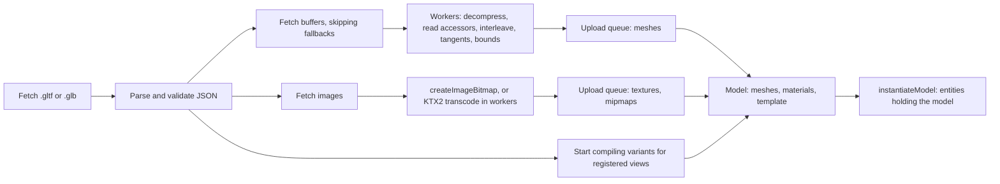

# Design 11: glTF and Asset Lifetime

|                                       |                                                                                                                                                                                                                                                                                                                                                                                                                                                                           |
| ------------------------------------- | ------------------------------------------------------------------------------------------------------------------------------------------------------------------------------------------------------------------------------------------------------------------------------------------------------------------------------------------------------------------------------------------------------------------------------------------------------------------------- |
| **Status**                            | Draft, for review (revised after solution review, §7)                                                                                                                                                                                                                                                                                                                                                                                                                     |
| **Kind**                              | Feature and breaking refactor                                                                                                                                                                                                                                                                                                                                                                                                                                             |
| **Engine version at time of writing** | `0.26.1`                                                                                                                                                                                                                                                                                                                                                                                                                                                                  |
| **Program**                           | [Forge 3D](./README.md), milestone M4. Phase 1 ships earlier, after [05 GPU device layer](./05-gpu-device.md) Phase 3: it builds on the device's textures and context-loss restore, and doesn't need 3D                                                                                                                                                                                                                                                                   |
| **Depends on**                        | [03 ECS foundations](./03-ecs-foundations.md) (declared queries, journals, singletons, stages); [05 GPU device layer](./05-gpu-device.md) (textures, samplers, vertex formats, context loss); [08 Meshes, materials and shaders](./08-meshes-materials-and-shaders.md); [10 PBR and environment lighting](./10-pbr-and-environment-lighting.md) for materials; [12 Skeletal and morph animation](./12-skeletal-and-morph-animation.md) for the skin, morph and clip types |
| **Lands with**                        | [12 Skeletal and morph animation](./12-skeletal-and-morph-animation.md) (Phase 4 here and Phase 1 there ship together)                                                                                                                                                                                                                                                                                                                                                    |
| **Related**                           | [04 Transforms](./04-transforms.md) (`addTransformComponent`, static subtrees), [06 Render pipeline](./06-render-pipeline.md) (bins, GPU scene, levels of detail, cameras), [09 Lighting](./09-lighting-and-shadows.md) (`KHR_lights_punctual`), [01 Testing and benchmarks](./01-testing-and-benchmarks.md) (B9, goldens)                                                                                                                                                |

## 0. Targeted modules

| Path                                                              | Change        | Notes                                                                                                                                                                                                                                                                     |
| ----------------------------------------------------------------- | ------------- | ------------------------------------------------------------------------------------------------------------------------------------------------------------------------------------------------------------------------------------------------------------------------- |
| `src/asset-loading/` (`@forge-game-engine/forge/asset-loading`)   | Modified      | `AssetStore`, `AssetHandle`, `AssetKind`, the load context, byte and JSON fetching with progress and cancellation, the worker pool; `AssetHandlesEcsComponent`, its index singleton, the collection system and `registerAssets`; `binaryAsset`, `jsonAsset`, `imageAsset` |
| `src/asset-loading/asset-cache.ts`, `asset-caches/image-cache.ts` | Removed       | `AssetCache<T>` and `ImageCache` are replaced by asset kinds in one store. `AssetRegistry` is unchanged                                                                                                                                                                   |
| `src/rendering/texture-cache.ts`                                  | Removed       | Replaced by the `textureAsset` kind                                                                                                                                                                                                                                       |
| `src/rendering/textures/` (new)                                   | New           | `textureAsset`; KTX2 parsing and Basis Universal transcoding with format selection from design 05's capabilities                                                                                                                                                          |
| `src/rendering/render-context.ts`                                 | Modified      | `imageCache` and `textureCache` removed (and `RenderContextOptions.imageCache`); the upload queue (§6.3.4)                                                                                                                                                                |
| `src/audio/sound-asset-cache.ts`                                  | Removed       | Replaced by the `soundAsset` kind                                                                                                                                                                                                                                         |
| `src/text/font-atlas/font-atlas-cache.ts`                         | Removed       | Replaced by the `fontAtlasAsset` kind                                                                                                                                                                                                                                     |
| `src/gltf/` (new module, `@forge-game-engine/forge/gltf`)         | New           | `modelAsset`, `Model`, validation, accessors, meshes, materials, nodes, the model template, `instantiateModel`, model components, extensions, mesh decompression                                                                                                          |
| `src/gltf/vendor/`, `src/rendering/textures/vendor/` (new)        | New           | Pinned upstream builds of the meshopt decoder, the Draco glTF decoder and the Basis Universal transcoder, with their licenses                                                                                                                                             |
| `scripts/build-decoders.js` (new), `package.json`                 | New, Modified | Builds the lazily imported decoder chunks; the `gltf` export path; `src/index.ts` exports the module                                                                                                                                                                      |
| `THIRD_PARTY_NOTICES.md` (new)                                    | New           | Licenses of the vendored decoders (Apache-2.0 for Draco and Basis Universal, MIT for meshoptimizer)                                                                                                                                                                       |
| `demo/`, `e2e/`, `documentation-site/src/pages/demos/**`          | Modified      | About 55 files move from the caches to the asset store (plus about 30 in `/src` and 15 guides)                                                                                                                                                                            |
| `e2e/golden/models/`, `e2e/specs/gltf-*.spec.ts` (new)            | New           | Golden renders of the sample models, loading and lifetime specs                                                                                                                                                                                                           |
| `bench/`                                                          | Modified      | B9; load-time and instantiation benchmarks                                                                                                                                                                                                                                |
| `documentation-site/docs/docs/asset-loading/`                     | Modified      | Rewritten for the store and handles                                                                                                                                                                                                                                       |
| `documentation-site/docs/docs/models/` (new)                      | New           | The models section                                                                                                                                                                                                                                                        |

---

## 1. Summary

Forge loads assets through four separate caches today, and none of them
knows when an asset is no longer used:

- `AssetCache<T>` (`src/asset-loading/asset-cache.ts:6-32`) is an interface
  with an `assets` map, `get`, `load` and `getOrLoad`.
- `ImageCache` (`src/asset-loading/asset-caches/image-cache.ts`) loads with
  a bare `new Image()` (line 36), with no `crossOrigin`, and doesn't share
  loads still in progress: two `getOrLoad` calls for one path load it twice
  (lines 64-70).
- `TextureCache` (`src/rendering/texture-cache.ts`) shares in-flight loads
  (lines 75-87) and owns its textures (`OwnedTexture`, whose `dispose`
  throws, `owned-texture.ts:118-122`). There is no way to free them. It
  keys textures by URL, `filter` and `wrap` (lines 114-118), so one file
  sampled two ways is two textures.
- `SoundAssetCache` (`src/audio/sound-asset-cache.ts`) is the only code that
  loads an `ArrayBuffer` (`fetch`, then `arrayBuffer()` at line 98);
  `FontAtlasCache` (`src/text/font-atlas/font-atlas-cache.ts:131-142`)
  fetches its JSON on its own.

There's no reference counting, no eviction, no disposal, no cancellation and
no progress. The image and sound caches let a game delete entries from their
`assets` maps; the texture and font atlas caches keep everything for the
render context's lifetime. That's workable for a 2D game whose art fits in
memory. A 3D game streams levels whose textures and meshes are hundreds of
megabytes of GPU memory, so it has to be able to release them.

This design adds:

- **One asset store** with **asset kinds** (textures, sounds, font atlases,
  models, binary, JSON, images), **handles** with reference counts, shared
  in-flight loads, `AbortSignal` cancellation, progress, and release. Game
  code holds handles and releases them; entities hold handles in an
  **asset handles component**, which a collection system releases when the
  component or its entity is removed, from its query's removal journal
  (design 03). An asset is freed once no handle holds it. The four caches
  are deleted.
- **glTF 2.0 loading** of `.gltf` (with external or data-URI buffers and
  images) and `.glb`, with validation that names the file, the JSON path and
  every unsupported required extension. Meshes, materials (design 10),
  textures, cameras, lights, skins, morph targets and animations (design 12)
  are converted to Forge's types.
- A **model**: the parsed, GPU-ready resources plus a precomputed node
  template. `instantiateModel(world, modelHandle)` turns it into entities in
  one pass and returns the root; the instance's entities keep the model
  loaded. Instances share meshes and materials, so the render pipeline's
  bins (design 06) draw every copy of a part in one instanced draw.
- **Compressed content**: KTX2 textures transcoded to the best compressed
  format the GPU has, meshopt and Draco meshes, quantized vertices, WebP.
  Decoders ship inside Forge, load only when a file needs them, and run in
  workers, as does all heavy geometry processing, so loading doesn't block
  the main thread.

---

## 2. Scope

### In scope

- The asset store, handles, kinds, the load context, cancellation, progress,
  release, handles held by entities and collection; migrating every cache
  and caller.
- Byte, JSON and image loading; data URIs; a game-supplied `fetch`.
- Workers for decoding, and paced GPU uploads.
- Which data is kept for WebGL context loss (design 05) and which is
  released after upload.
- glTF 2.0 core: containers, buffers, buffer views, accessors (all component
  types, normalized, strides, sparse), meshes (attributes, indices, every
  primitive mode, morph targets), materials, textures, samplers, images,
  nodes, scenes, cameras, skins, animations, names and extras.
- The extensions in §6.15, the decoders they need, and how those are
  delivered.
- The model, its template, instantiation, finding named nodes, material
  variants, freeing.
- Tests against the Khronos sample models, malformed-file tests, load-time
  and instantiation benchmarks (B9), and the models section of the docs.

### Out of scope

- **Skinning, morphing and clip playback.** Design 12. This design parses
  skins, morph targets and animations into design 12's types and adds design
  12's components when it instantiates a model.
- **The PBR shading model and the `KHR_materials_*` parameters' meaning.**
  Design 10. This design maps glTF material JSON onto design 10's material.
- **Exporting glTF**, and a Forge scene format. README non-goal.
- **Other formats** (FBX, OBJ, USD). README non-goal.
- **`KHR_animation_pointer`, `KHR_materials_diffuse_transmission`,
  `KHR_materials_pbrSpecularGlossiness`, `KHR_interactivity`,
  `KHR_gaussian_splatting`, `KHR_node_selectability`,
  `KHR_node_hoverability`, `KHR_audio_emitter`, `EXT_lights_ies`,
  `EXT_lights_image_based`, `EXT_mesh_manifold`.** §6.15 says what happens
  to files that use them.
- **Physics colliders from glTF.** No physics extension is ratified; a game
  can read its own with a custom extension handler (§6.16), and design 14
  open question 7 tracks the Khronos drafts.
- **Texture streaming by mip level** (loading low resolutions first). Open
  question 5.
- **Hot reloading** of assets during development. The store's design allows
  it later (an asset's value can be replaced behind its handles); not
  needed for the program.

---

## 3. Phases

### Phase 1: Asset store and lifetime

Ships after design 05 Phase 3, in or after M2. It builds on the device's
`Texture` (a GPU texture and a sampler), its unpack settings and its
context-loss registry, and needs no 3D.

| #   | Task                     | Description                                                                                                                                                                                                                                                                                 | Size |
| --- | ------------------------ | ------------------------------------------------------------------------------------------------------------------------------------------------------------------------------------------------------------------------------------------------------------------------------------------- | ---- |
| 1.1 | Store, handles, kinds    | §6.2.1 to §6.2.4: keys, shared in-flight loads, reference counts, retained dependencies, failure and retry                                                                                                                                                                                  | M    |
| 1.2 | Handles held by entities | §6.2.5: `AssetHandlesEcsComponent`, the index singleton, the collection system's release from its `removed` journal and pending list, `registerAssets`, `collect()`, `dispose()`                                                                                                            | M    |
| 1.3 | Fetching and progress    | §6.3.1: bytes, text and JSON with `AbortSignal`; data URIs; URL resolution; a game-supplied `fetch`; batch progress                                                                                                                                                                         | M    |
| 1.4 | Images                   | §6.3.2: EXIF orientation cleared in the bytes, `createImageBitmap` without color conversion, the image-element path where its options aren't honored                                                                                                                                        | S    |
| 1.5 | Kinds                    | `binaryAsset`, `jsonAsset`, `imageAsset`, `textureAsset` (keyed by URL, color space and mipmaps), `soundAsset`, `fontAtlasAsset` (§6.5)                                                                                                                                                     | M    |
| 1.6 | Context loss sources     | §6.4: textures keep their encoded bytes and restore through design 05's asynchronous restore sources (§6.10 there)                                                                                                                                                                          | M    |
| 1.7 | Migration and deletions  | Every caller in `/src`, `/demo`, `/e2e` and the docs site (about 100 files); `ImageCache`, `TextureCache`, `SoundAssetCache`, `FontAtlasCache` and the `AssetCache` interface deleted; guides rewritten                                                                                     | L    |
| 1.8 | Changelog                | `#### Changed` with the migration (`renderContext.textureCache.getOrLoad(url, { filter: 'nearest' })` → `(await assets.load(textureAsset, url)).value.withSampler({ magFilter: 'nearest', minFilter: 'nearest' })`; images decoded without EXIF orientation); `#### Removed` for the caches | S    |

**Definition of done:** nothing imports the removed caches; every e2e spec
and golden passes unchanged (design 05 Phase 3 already uploads images
without their color chunks, §6.3.2); releasing the last handle to a texture
frees it at the next collection (the device's texture count drops);
removing an entity whose handles component holds the last handle frees the
asset at that frame's collection, including an entity created and removed
between two collections; two concurrent loads of one URL make one request;
aborting every requester cancels the request; one image used with two
samplers is fetched, decoded and uploaded once.

### Phase 2: glTF core and instantiation

| #   | Task                   | Description                                                                                                                                         | Size |
| --- | ---------------------- | --------------------------------------------------------------------------------------------------------------------------------------------------- | ---- |
| 2.1 | Containers             | §6.6.1: `.glb` chunks, `.gltf` with external and data-URI buffers and images, URI resolution                                                        | S    |
| 2.2 | Validation             | §6.6.2: structural checks with `GltfError` (file, JSON pointer, code); required extensions listed at once; warnings on the model                    | M    |
| 2.3 | Accessors              | §6.7: every component type and accessor type, normalized values, strides, matrix column padding, sparse                                             | M    |
| 2.4 | Meshes                 | §6.8: primitives as parts, attribute union, primitive mode conversion, index widths, bounds, flat normals and tangent generation                    | L    |
| 2.5 | Materials and textures | §6.9: core metallic-roughness onto design 10's material, one GPU texture per image and color space, samplers per use, mipmaps, the default material, the photometric scale (GA29) | M    |
| 2.6 | Model and template     | §6.13: nodes (TRS or decomposed matrix), scenes, the default scene, names and extras, precomputed template                                          | M    |
| 2.7 | Instantiation          | §6.14: `instantiateModel` with a model handle, model components, the handles components (GA26), `findModelNode` with liveness checks, static nodes  | M    |
| 2.8 | Golden and unit tests  | The core rows of §6.18.2; malformed files (§6.18.1)                                                                                                 | M    |

Geometry processing runs on the main thread in this phase, through the same
functions Phase 5 moves into workers. Until Phase 4, a file's skins, morph
targets and animations are left out with a warning; until Phase 5, files
that require a compression extension fail with the unsupported-extension
error.

**Definition of done:** the core models in §6.18.2 load and match their
goldens; every malformed fixture fails with its expected error code;
1,000 instances of `BoxTextured` draw in one instanced draw; removing an
instance's root frees the model at that frame's collection.

### Phase 3: Extensions without decoders

| #   | Task               | Description                                                                                                                                              | Size |
| --- | ------------------ | -------------------------------------------------------------------------------------------------------------------------------------------------------- | ---- |
| 3.1 | Extension registry | §6.15, §6.16: built-in handlers, custom handlers, supported-name checks                                                                                  | S    |
| 3.2 | Materials          | `KHR_materials_*` onto design 10, `KHR_materials_unlit`, `KHR_texture_transform`, `KHR_materials_variants` and `selectModelVariant`                      | M    |
| 3.3 | Geometry           | `KHR_mesh_quantization`, with integer positions and UVs through design 08's integer-attribute mesh features (GA25, §6.1.1 there); `EXT_mesh_gpu_instancing` | M    |
| 3.4 | Scene              | `KHR_lights_punctual`, cameras (`addModelCameraComponent`), `KHR_node_visibility`, `MSFT_lod`, `EXT_texture_webp`, `KHR_xmp_json_ld` kept as data        | M    |
| 3.5 | Golden tests       | The extension rows of §6.18.2 that need no decoder                                                                                                       | S    |

**Definition of done:** those models match their goldens;
`MaterialsVariantsShoe` switches variants without new pipelines per
variant; `SimpleInstancing`'s instances draw instanced; the
`glTF-Quantized` variants of `Duck`, `Avocado` and `Lantern` match the
uncompressed goldens within their tolerance.

### Phase 4: Skins, morph targets and animations (ships with design 12 Phase 1)

| #   | Task          | Description                                                                                                                                      | Size |
| --- | ------------- | ------------------------------------------------------------------------------------------------------------------------------------------------ | ---- |
| 4.1 | Skins         | Joints, inverse bind matrices and skeleton roots into design 12's skin type; up to eight influences (§6.8.5); joint bounds per (mesh, skin) pair | M    |
| 4.2 | Morph targets | Target deltas into the mesh's morph data (design 12), default weights from the mesh and node, each target's longest position delta               | M    |
| 4.3 | Animations    | Samplers and channels (translation, rotation, scale, weights; step, linear, cubic spline) into design 12's clips                                 | M    |
| 4.4 | Instantiation | Design 12 §6.4.4's components; animated nodes, joints, and skinned and morphed nodes stay dynamic under `isStatic`                               | S    |
| 4.5 | Golden tests  | The animation rows of §6.18.2 at fixed sample times                                                                                              | M    |

**Definition of done:** the skinned, morphed and animated models in
§6.18.2 match their goldens at every sampled time.

### Phase 5: Workers, compression and paced uploads

| #   | Task                 | Description                                                                                                                                                                                           | Size |
| --- | -------------------- | ----------------------------------------------------------------------------------------------------------------------------------------------------------------------------------------------------- | ---- |
| 5.1 | Worker pool          | §6.3.3: Blob-URL workers, shared compiled WASM modules, idle shutdown, cancellation                                                                                                                   | M    |
| 5.2 | Geometry in workers  | §6.8 per mesh, MikkTSpace tangents (design 08 §6.1.4) and joint bounds, off the main thread                                                                                                           | M    |
| 5.3 | Mesh decompression   | §6.11: `EXT_meshopt_compression`, `KHR_meshopt_compression`, `KHR_draco_mesh_compression`; fallback buffers never fetched                                                                             | M    |
| 5.4 | KTX2                 | §6.10: KTX2 parsing, Basis Universal transcoding, format selection, mip handling; `KHR_texture_basisu`; `.ktx2` for `textureAsset`; uncompressed, BC6H and cube KTX2 for design 10's environment maps | L    |
| 5.5 | Decoder delivery     | §6.12: vendored builds, `scripts/build-decoders.js`, lazy chunks, licenses                                                                                                                            | M    |
| 5.6 | Upload pacing        | §6.3.4: the upload queue and its time slices; compiling pipelines at parse time against registered views (§6.9.1)                                                                                     | M    |
| 5.7 | Golden and e2e tests | Compressed variants of §6.18.2; long-task and cancellation specs (§6.18.4)                                                                                                                            | M    |

**Definition of done:** every compressed variant in §6.18.2 matches the
uncompressed golden within its tolerance; loading `FlightHelmet`
(`glTF-KTX-BasisU`) while a scene renders produces no main-thread task
longer than 50 ms; aborting a load mid-transcode frees everything it
created.

### Phase 6: Performance, conformance and documentation

| #   | Task                     | Description                                                                                                                                                                                                | Size |
| --- | ------------------------ | ---------------------------------------------------------------------------------------------------------------------------------------------------------------------------------------------------------- | ---- |
| 6.1 | B9                       | §6.17: the Sponza KTX2 asset, the measurement, the budget breakdown                                                                                                                                        | M    |
| 6.2 | Sample Viewer comparison | The sample models added to design 10's reference renders (§6.16.3 there): the pinned Khronos Sample Renderer draws each with the golden's camera and environment, and the difference is reported (§6.18.3) | M    |
| 6.3 | Benchmarks               | Accessor reading, interleaving, transcoding throughput per format, instantiation per node (§6.18.5)                                                                                                        | S    |
| 6.4 | Guides and demo          | The models section (§6.19); a model viewer demo in a new `models` demo category                                                                                                                            | M    |
| 6.5 | Changelog                | `#### Added` for the `gltf` module                                                                                                                                                                         | S    |

**Definition of done:** B9 meets its budget on the desktop reference and
is no slower than Three.js on the same asset; every golden in §6.18.2 was
checked against the Sample Viewer; the guides and demo are on the docs site.

---

## 4. Decision log

| #    | Decision                                                         | Options                                                                                                                                                                                                                                                                                                                                                                                                                                       | Chosen | Rationale, trade-offs, assumptions                                                                                                                                                                                                                                                                                                                                                                                                                                                                                                                                                                                                                                                                                                                                                                                                                                                        |
| ---- | ---------------------------------------------------------------- | --------------------------------------------------------------------------------------------------------------------------------------------------------------------------------------------------------------------------------------------------------------------------------------------------------------------------------------------------------------------------------------------------------------------------------------------- | ------ | ----------------------------------------------------------------------------------------------------------------------------------------------------------------------------------------------------------------------------------------------------------------------------------------------------------------------------------------------------------------------------------------------------------------------------------------------------------------------------------------------------------------------------------------------------------------------------------------------------------------------------------------------------------------------------------------------------------------------------------------------------------------------------------------------------------------------------------------------------------------------------------------- |
| GA1  | Asset lifetime                                                   | (a) Handles with reference counts: game code holds and releases its own, and an `AssetHandlesEcsComponent` holds an entity's, released by the collection system from its fixed query's `removed` journal; (b) caches that keep everything (today); (c) release through `FinalizationRegistry`; (d) `(world, entity)` keep-alive records on the store, polled with `isAlive` (first draft); (e) a handle in every component that uses an asset | (a)    | GPU memory needs a release the game controls, and JavaScript has no destructors: `FinalizationRegistry` callbacks may run late or never. Bevy frees an asset when its last strong handle is dropped, which happens when the component holding it is removed. Design 03's `removed` journal is Forge's equivalent of that drop, and design 08 already frees GPU scene slots from it, so a component that holds handles behaves the same way with no hook on component removal. Unity's Addressables count handles and instances in the same spirit. (d) leaked: an entry with a live record was taken off the unused list, and nothing put it back when the entity died. It also kept world state in a service (README §4.4). (e) would change design 08's mesh component and the sprite components to hold handles, and a model's meshes and materials aren't store entries of their own. |
| GA2  | When an unused asset is freed                                    | (a) In the collection system's run in the `last` stage, after it has released the handles of components removed since its previous run; (b) as soon as a count reaches zero                                                                                                                                                                                                                                                                   | (a)    | Nothing is freed while the frame's bins still reference it (mesh extraction dropped removed entities' slots in the `render` stage); releasing and loading the same asset within a frame reuses it; component removals are applied in one place. Bevy also frees unused assets from a system that runs each frame. Trade-off: memory comes back at the end of the frame, not at the release call.                                                                                                                                                                                                                                                                                                                                                                                                                                                                                          |
| GA3  | One store or a cache per asset type                              | (a) One `AssetStore` with asset kinds imported from their modules; (b) a cache per type, as today                                                                                                                                                                                                                                                                                                                                             | (a)    | A loading screen needs one progress value and one way to cancel; a model's textures and a sprite's texture share entries; dependencies are released with the asset that loaded them. Bevy's asset server, Godot's resource loader and PlayCanvas's asset registry are single stores. Kinds are values a game imports, rather than loaders registered by file extension, so a 2D game never bundles the glTF loader.                                                                                                                                                                                                                                                                                                                                                                                                                                                                       |
| GA4  | Loading images                                                   | (a) Fetch the bytes, clear any EXIF orientation in them, decode with `createImageBitmap(blob, { colorSpaceConversion: 'none', premultiplyAlpha: 'none' })`; decode through an image element from a Blob URL where those options aren't honored; (b) image elements with `crossOrigin`, as today                                                                                                                                               | (a)    | glTF says color information in images MUST be ignored and EXIF SHOULD be, and design 05 stores images as authored. Clearing the orientation tag in the bytes works on every decode path, where `imageOrientation: 'none'` doesn't: before Firefox 111 and the matching WebKit change it meant "take the orientation from the image" (Firefox bug 1809740, WebKit bug 250476), and image elements apply EXIF orientation regardless. Fetching the bytes gives progress, cancellation, data URIs and a game-supplied `fetch`, and a cross-origin file without CORS headers fails at load with a clear message instead of a `SecurityError` at upload. A Blob URL is same-origin, so `crossOrigin` is never needed. Older Safari (README open question 3) takes the image-element path with design 05's unpack settings.                                                                     |
| GA5  | What a texture keeps for context loss                            | (a) The encoded file bytes, decoded or transcoded again on restore; (b) the decoded pixels; (c) nothing, fetching the URL again on restore                                                                                                                                                                                                                                                                                                    | (a)    | Encoded images are typically 5 to 10 times smaller than decoded ones, and browsers may keep Blobs outside the JavaScript heap. (c) fails offline, after cache eviction and for embedded images. Restore becomes asynchronous (§6.4.2), which design 05 §6.10 supports; nothing draws until it completes, which is acceptable after a GPU reset.                                                                                                                                                                                                                                                                                                                                                                                                                                                                                                                               |
| GA6  | Which work runs in workers                                       | (a) Geometry processing, tangents, joint bounds, mesh decompression and KTX2 transcoding in a worker pool; JSON parsing, image decoding (already off-thread inside `createImageBitmap`) and GPU work on the main thread; (b) everything on the main thread; (c) the whole loader in a worker                                                                                                                                                  | (a)    | (b) blocks the main thread for hundreds of milliseconds on Sponza-sized files. (c) still needs materials, GPU objects and entities created on the main thread, and would move small JSON work across threads for nothing. Worker tasks are pure functions, so unit tests run them in-process.                                                                                                                                                                                                                                                                                                                                                                                                                                                                                                                                                                                             |
| GA7  | How decoders are provided                                        | (a) Pinned upstream builds vendored in Forge's package, loaded by dynamic `import()` only when a file needs them, run in Blob-URL workers; (b) optional peer dependencies; (c) URLs the game configures and hosts, as Three.js's `setDecoderPath` and Babylon's decoder URLs                                                                                                                                                                  | (a)    | No configuration, decoder versions tested with Forge's goldens, no third-party CDN at runtime, and no npm dependency added. Bevy and Godot compile their decoders in, which is the native-engine form of (a). (b) can't cover Basis Universal, whose transcoder has no official npm package, and leaves version matching to every game. (c) fails at runtime when a game forgets to copy files. Trade-offs: the installed package grows (§6.12); a site's Content Security Policy must allow `worker-src blob:` and `'wasm-unsafe-eval'`; decoder updates arrive with Forge releases. Open question 1.                                                                                                                                                                                                                                                                                    |
| GA8  | glTF meshes and primitives                                       | (a) One `Mesh` per glTF mesh with a part per primitive, the union of their attributes, missing ones filled with glTF's defaults; split only where normals' presence differs; (b) an entity per primitive, as Bevy spawns them                                                                                                                                                                                                                 | (a)    | Matches design 08's mesh with parts and material slots, and Godot's and Unity's importers; one entity per node keeps names, transforms, skins and morph weights one-to-one with the file. Trade-off: attributes padded for primitives that lack them; per-part culling is open question 2.                                                                                                                                                                                                                                                                                                                                                                                                                                                                                                                                                                                                |
| GA9  | Primitive modes                                                  | (a) Strips and fans become lists and line loops become line strips at load; points and lines are kept; (b) keep strips and fans                                                                                                                                                                                                                                                                                                               | (a)    | WebGPU has no fans or loops (README P1), and strips can't share an index buffer with other parts in one multi-draw. Conversion costs only index memory.                                                                                                                                                                                                                                                                                                                                                                                                                                                                                                                                                                                                                                                                                                                                   |
| GA10 | Primitives without normals                                       | (a) Design 08's flat-normals mesh feature (§6.1.4 there), whose shaders take the face normal (and, when normal mapped, the tangent frame) from screen-space derivatives; (b) give every triangle its own three vertices on the CPU, with its face normal                                                                                                                                                                                      | (a)    | glTF gives such primitives implicit flat normals, and their morph targets flat normals "adjusted for the vertex position deltas". Derivatives give the exact normal of whatever was rasterized, after morphing and skinning, with no extra memory; the Khronos Sample Viewer does the same. (b) triples the vertex count (no vertex can be shared once every face has its own normal) and fixes the normals to the rest shape. MikkTSpace tangent generation (§6.8.4) also changes vertex counts, but it only splits vertices along UV seams and mirrored UVs, and it has no derivative equivalent: normal maps are baked against its frame, which the derivative frame only approximates (design 08 MS8).                                                                                                                                                                                |
| GA11 | Texture color space                                              | (a) From the material slot that uses the texture, as glTF specifies; an image used both ways becomes two GPU textures; (b) from image metadata                                                                                                                                                                                                                                                                                                | (a)    | glTF requires ignoring color information in images; the slot defines the transfer function. Sharing one GPU texture between an sRGB and a linear use is impossible, since the format differs.                                                                                                                                                                                                                                                                                                                                                                                                                                                                                                                                                                                                                                                                                             |
| GA12 | Texture coordinate origin                                        | (a) No flip anywhere: images upload with `UNPACK_FLIP_Y_WEBGL` false and glTF texture coordinates are used unchanged; (b) flip images on upload and V in shaders                                                                                                                                                                                                                                                                              | (a)    | glTF's `(0, 0)` is the image's upper-left corner, and with flipping off the image's top row is the row sampled at `v = 0` (§6.13.4). Three.js sets `flipY = false` on glTF textures for the same reason. `KHR_texture_basisu` requires KTX2 orientation `rd`, the same layout.                                                                                                                                                                                                                                                                                                                                                                                                                                                                                                                                                                                                            |
| GA13 | Cameras in models                                                | (a) Camera nodes become entities whose node component names the glTF camera; `addModelCameraComponent` makes one a Forge camera; (b) every glTF camera becomes a rendering camera                                                                                                                                                                                                                                                             | (a)    | A camera renders the whole scene again, through its own targets and output pass, composited by `order` (design 06 §6.4.3), so an instantiated prop with a camera would double a game's rendering. Viewers opt in with one call. Lights don't have this problem and are instantiated (GA14).                                                                                                                                                                                                                                                                                                                                                                                                                                                                                                                                                                                               |
| GA14 | Lights in models                                                 | (a) Instantiated as design 09 light components: point and spot intensity in candela times 4π gives lumens, lux is unchanged, linear color becomes an sRGB `Color`, `range` is kept or design 09's default; (b) ignored                                                                                                                                                                                                                        | (a)    | Lights are scene content. Design 09 decision L4 makes a spot's lumens `4π` times its candela, so the conversion is exact for both point and spot lights. glTF allows an infinite range, which clusters can't bound; design 09 L9 gives such lights the 10 m default, as Bevy's loader does.                                                                                                                                                                                                                                                                                                                                                                                                                                                                                                                                                                                               |
| GA15 | `EXT_mesh_gpu_instancing`                                        | (a) Each instance becomes a static child entity sharing the node's mesh and materials; design 06 instances them automatically; (b) an instanced-mesh component with its own instance buffer                                                                                                                                                                                                                                                   | (a)    | One rendering path, with culling, shadows and picking per instance. B1 budgets 50,000 static entities at 4 ms. Trade-off: an entity per instance costs a few hundred bytes, against 40 bytes in a raw buffer.                                                                                                                                                                                                                                                                                                                                                                                                                                                                                                                                                                                                                                                                             |
| GA16 | Static models                                                    | (a) An `isStatic` instantiation option that tags every node except animation targets, joints, and skinned and morphed nodes; (b) the game tags entities afterwards                                                                                                                                                                                                                                                                            | (a)    | Level geometry and moving props genuinely differ, and the model already knows which nodes animate, which a game would have to work out. Static children of animated nodes still follow them (design 04 §6.3.2). Skinned and morphed nodes stay dynamic because their bounds change while their node may not move (design 12 §6.10.5).                                                                                                                                                                                                                                                                                                                                                                                                                                                                                                                                                                                                                                                                           |
| GA17 | Pacing GPU uploads                                               | (a) Uploads run as separate tasks of at most 2 ms between frames until the queue is empty; `prepare()` waits for it; (b) a per-frame budget drained by the render system, as Unity's `QualitySettings.asyncUploadTimeSlice` (milliseconds per frame) and Bevy's `RenderAssetBytesPerFrame` (bytes per frame) are; (c) upload everything as soon as it's ready                                                                                 | (a)    | Forge games usually load before their loop runs (`await assets.load(...)`, then `await renderContext.prepare(world)`), when no frames run. A budget drained per frame would never drain then, and `prepare()` couldn't finish. That is the reason to deviate from Unity and Bevy. Tasks between frames drain at full speed when no frames run; while frames run, a frame waits for at most one slice, the bound a per-frame budget also gives, and slices use idle time between frames that a per-frame budget leaves unused. (c) causes hitches when a game loads during play. The slice stays fixed until a game needs another value.                                                                                                                                                                                                                                                   |
| GA18 | Validation                                                       | (a) Structural checks of everything the loader reads, with errors naming the file and JSON pointer; the Khronos glTF-Validator used in tests; (b) the Khronos validator at runtime                                                                                                                                                                                                                                                            | (a)    | The validator is large and slow to run on every load, and most of its checks happen anyway while reading. Tests run it over the fixtures so Forge's errors and the validator's agree on what's malformed.                                                                                                                                                                                                                                                                                                                                                                                                                                                                                                                                                                                                                                                                                 |
| GA19 | Switching material variants                                      | (a) `selectModelVariant(world, root, name)`, which writes the instance's mesh components' materials through `updateMeshComponent`; (b) a variant field on a component, applied by a system                                                                                                                                                                                                                                                    | (a)    | Switching is a rare, one-off action that writes inputs, as `setWorldPosition` does (design 04). `updateMeshComponent` records the change for mesh extraction, which moves only the changed parts between bins (design 08 MS11). A system would cost a check every frame for nothing.                                                                                                                                                                                                                                                                                                                                                                                                                                                                                                                                                                                                      |
| GA20 | UV sets and joint influences beyond the fixed attributes         | (a) `uv0` and `uv1`; a texture on `texCoord` 2 or more gets `uvSet: 0` and a warning; four or eight influences (`joints0`/`weights0`, plus `joints1`/`weights1`), more reduced to the eight largest and renormalized, with a warning (design 12 AN6); (b) refuse such files                                                                                                                                                                   | (a)    | Design 05's attribute table has two UV sets, and design 12 places the second joint set at locations 8 and 9. Refusing valid files is worse than a documented approximation.                                                                                                                                                                                                                                                                                                                                                                                                                                                                                                                                                                                                                                                                                                               |
| GA21 | `KHR_animation_pointer`                                          | (a) Not in this design: pointer channels are skipped with a warning, and a file that requires it fails; (b) implement it here                                                                                                                                                                                                                                                                                                                 | (a)    | It animates arbitrary properties (material factors, light intensities, camera fields), which needs a binding layer from JSON pointers to component fields. That belongs with design 12's property animation; the extension is ratified, so it's a planned follow-up.                                                                                                                                                                                                                                                                                                                                                                                                                                                                                                                                                                                                                      |
| GA22 | Game-defined extensions                                          | (a) Handlers passed to the model kind: their names count as supported, and a node hook adds components per instance; (b) none                                                                                                                                                                                                                                                                                                                 | (a)    | Games put spawn points, colliders and gameplay data in glTF. Godot's importer has document extensions for this; Bevy exposes extras as components. Extras are always kept (§6.14.2), so simple data needs no handler.                                                                                                                                                                                                                                                                                                                                                                                                                                                                                                                                                                                                                                                                     |
| GA23 | Texture identity and samplers                                    | (a) A texture asset is keyed by URL, color space and mipmaps; a sampler is chosen where the texture is used, with `texture.withSampler` (design 05 §6.4), which shares the GPU texture; (b) the sampler in the key (first draft, and `TextureCache` today)                                                                                                                                                                         | (a)    | With (b), one image used with two samplers is fetched, decoded, uploaded and kept twice. WebGPU binds textures and samplers separately, and design 05's `Texture` already pairs a GPU texture with a sampler, so pairing at the point of use is the device's own model. Godot 4 moved filtering and repeat from textures to the materials and canvas items that sample them for the same reason. A single `filter` and `wrap` also can't express a glTF sampler's separate S and T wrapping or its separate filters (`TextureSettingsTest`). Trade-off: a 2D game that wants `nearest` filtering adds a `withSampler` call.                                                                                                                                                                                                                                                               |
| GA24 | Models from bytes the game already has                           | (a) One loading path, the store: bytes from IndexedDB, an archive or a download of the game's own come through the game-supplied `fetch`, or a `.glb` through a `blob:` URL; (b) a separate `createModel(renderContext, bytes)` whose caller owns and disposes the model (first draft)                                                                                                                                                        | (a)    | (b) was a second way to load with a second ownership rule: its models had no handle, so instances couldn't keep them loaded, and `Model` would need a `dispose` used by one path only. The `fetch` hook already exists for authenticated servers and tests, and serves relative files too, which a `blob:` URL can't (it isn't hierarchical, so nothing resolves against it).                                                                                                                                                                                                                                                                                                                                                                                                                                                                                                             |
| GA25 | Unnormalized integer positions and UVs (`KHR_mesh_quantization`) | (a) Kept in WebGPU's integer formats (`uint16x4`, `sint8x4`, ...) on both backends, read as `uvec`/`ivec` shader inputs and converted in `forge/vertex`, selected by mesh features (design 08 §6.1.1); (b) a format that reads integers as floats (`vertexAttribPointer` with `normalized` false, first draft); (c) expanded to `float32` at load                                                                                         | (a)    | WebGPU's vertex formats have no type that reads integers as floats. (b) would put a WebGL-only format into a device interface that uses WebGPU's formats (design 05 D5) and leave the WebGPU backend a shader path nothing had tested. (c) gives up the memory quantization saves: positions grow from 8 to 12 bytes and UVs from 4 to 8. The conversion is one instruction, and joints are integer inputs already (design 12). The quantized sample models store positions, and most of them UVs, this way (§6.8.1). Trade-off: up to three more mesh-feature bits in the variant key; a file usually uses one scheme throughout.                                                                                                                                                                                                                                                        |
| GA26 | Which entities of an instance hold the model                     | (a) The root and every entity given a mesh component from the model; (b) the root only; (c) every entity the instance creates                                                                                                                                                                                                                                                                                                                 | (a)    | A node the game moves out of an instance (a sword taken from a character) keeps drawing the model's mesh after the instance is removed; with (b), removing the root would free that mesh under it. Bevy's spawned mesh entities hold their own mesh and material handles for the same reason. Joints, lights and cameras use none of the model's GPU resources, so (c) adds a component per joint (6,000 in B4) for nothing. Trade-off: a handle and a component per mesh entity.                                                                                                                                                                                                                                                                                                                                                                                                         |
| GA27 | Load progress                                                    | (a) A fraction over the files discovered so far, weighted by size, held at its highest value within a batch of loads; counts and bytes reported beside it; (b) bytes over total bytes, null until every size is known (first draft); (c) files done over files discovered                                                                                                                                                                     | (a)    | (b) can't be monotonic: totals grow as a glTF's buffers and images are discovered and as loads join, and `Content-Length` counts encoded bytes when a response has `Content-Encoding`, so some sizes are never known. (c), what Three.js's loading manager reports, treats a 50 MB buffer like a 1 KB image. Holding the highest value keeps a loading bar from moving backwards; it pauses while newly discovered work catches up.                                                                                                                                                                                                                                                                                                                                                                                                                                                       |
| GA28 | When a model's pipelines start compiling                         | (a) At parse time, for the views of every world rendered with the store's render context, without waiting; `prepare()` waits; (b) only in `prepare()`                                                                                                                                                                                                                                                                                         | (a)    | A variant key combines the file's material and mesh features, known once the JSON is parsed, with the pass, pipeline features, target format, sample count, prepass and fog of a view (design 08 §6.5.1), known only from cameras. With cameras in place, compiling during fetching and transcoding hides up to 500 ms of B9 (§6.17.1). Without them there is nothing to compile against, and (b) is what happens. Three.js's `compileAsync` takes the camera for the same reason.                                                                                                                                                                                                                                                                                                                                                                                                        |
| GA29 | Applying README P5's photometric scale                           | (a) A `modelAsset` load option, in the key, applied to the model's materials and lights when it's built; (b) an `instantiateModel` option applied per instance                                                                                                                                                                                                                                                                                        | (a)    | A model's materials are shared by every instance (§6.14.2), and emissive strength is a material value, so a per-instance scale would need a material per instance or a per-object emissive input, which breaks instancing. One scale per loaded model is also what P5 decided. Lights are instantiated from the model's converted values, so they take the same scale with no per-instance work. Trade-off: one file loaded with two scales is two store entries, with two copies of its materials. |

---

## 5. Open questions

In priority order.

1. **Content Security Policy for decoders.** Blob-URL workers and WASM need
   `worker-src blob:` and `'wasm-unsafe-eval'`. Options: (a) as designed,
   documented; (b) also let a game point at decoder files it hosts; (c)
   decode on the main thread when workers are refused. Proposal: (a); add
   (b) if a game with a strict policy needs it, since it's a second path to
   test.
2. **Per-part culling.** Sponza is one glTF mesh of 103 primitives on one
   node, so it culls and casts shadows as one object (GA8). Design 08 gives
   parts their own bounds (§6.1.1 there) so they can be culled one by one,
   but design 06 culls per GPU scene slot (§6.8 there). Options: (a) design
   06 culls the parts of large meshes individually; (b) the loader splits
   large multi-primitive meshes into an entity per primitive. Proposal:
   (a), decided in design 06 with B5 measurements, since it helps meshes
   built in code as well.
3. **Instantiation cost.** Each node costs an entity, a parent link and
   several component adds, each updating memberships (design 03), and each
   mesh entity also gets a handles component (GA26). Options: (a) a batch
   creation API in design 03, like Bevy's batch spawning; (b) none.
   Proposal: measure `NodePerformanceTest` in Phase 2 against §6.17.3
   first.
4. **Memory kept for context loss.** Encoded bytes for Sponza's textures
   are tens of megabytes. Options: (a) keep them (GA5); (b) re-fetch
   URL-backed files on restore and keep only embedded ones. Proposal: (a),
   revisited with mobile measurements in M4.
5. **Loading textures low resolution first.** Large scenes could show
   small mips while full ones load. Proposal: a later design, since it
   needs KTX2 level ranges and residency tracking.

---

## 6. Design

### 6.1 Loading a model

```ts
import {
  createAssetStore,
  registerAssets,
} from '@forge-game-engine/forge/asset-loading';
import { instantiateModel, modelAsset } from '@forge-game-engine/forge/gltf';

const { world, renderContext } = createGame('app');
const assets = createAssetStore({ renderContext });
registerAssets(world, assets);

const helmet = await assets.load(modelAsset, '/models/DamagedHelmet.glb', {
  signal: abortController.signal,
  onProgress: (progress) => loadingBar.set(progress.fraction),
});

const root = instantiateModel(world, helmet, {
  position: { x: 0, y: 1, z: 0 },
});
await renderContext.prepare(world); // design 08: compile what the scene needs
helmet.release(); // the instance's entities keep the model loaded (§6.2.5)
```



### 6.2 The asset store

#### 6.2.1 API

```ts
export interface AssetStoreServices {
  /** Needed by kinds that create GPU resources (textures, font atlases, models). */
  renderContext?: RenderContext;
  /** Needed by kinds that decode audio (sounds). */
  soundMixer?: SoundMixer;
  /** Fetches every URL the store loads. Default: the browser's `fetch`. */
  fetch?: (url: string, init: RequestInit) => Promise<Response>;
}

export function createAssetStore(services?: AssetStoreServices): AssetStore;
/** Adds the handle index singleton and the collection system (stage `last`) to the world (§6.2.5). */
export function registerAssets(world: EcsWorld, assets: AssetStore): void;

export interface AssetStore {
  /** Loads an asset, or shares the load or the loaded asset. Each call returns a new handle. */
  load<T, TOptions>(
    kind: AssetKind<T, TOptions>,
    url: string,
    options?: AssetLoadOptions & Partial<TOptions>,
  ): Promise<AssetHandle<T>>;
  /** A new handle to an asset that has finished loading. Throws if it hasn't. */
  retainLoaded<T, TOptions>(
    kind: AssetKind<T, TOptions>,
    url: string,
    options?: Partial<TOptions>,
  ): AssetHandle<T>;
  /** Every load in progress, for loading screens (§6.3.1). */
  readonly progress: AssetProgress;
  /** Counts and bytes per kind, for the stats overlay (design 06). */
  stats(): readonly AssetKindStats[];
  /**
   * Frees every asset no handle holds. Each registered world's collection system calls it once per frame;
   * handles held by components are released there, so assets of entities removed this frame are freed then.
   */
  collect(): void;
  /** Frees everything, cancels every load and stops the workers. The store can't be used afterwards. */
  dispose(): void;
}

export interface AssetLoadOptions {
  signal?: AbortSignal;
  onProgress?: (progress: AssetProgress) => void;
}

export interface AssetHandle<T> {
  readonly kind: string;
  /** The absolute URL. */
  readonly url: string;
  /** Throws once this handle is released. */
  readonly value: T;
  readonly isReleased: boolean;
  /** Another handle to the same asset, released separately. */
  retain(): AssetHandle<T>;
  /** Throws if this handle was already released. */
  release(): void;
}
```

The store is a service the game creates once, like the render context and
the sound mixer, and passes to the code that loads. It owns its entries and
their reference counts, and holds no world state: what each world's
entities hold is recorded in a singleton of that world (§6.2.5), and the
collection system holds the store only as an injected service (README
§4.4).

#### 6.2.2 Asset kinds

```ts
export interface AssetKind<T, TOptions> {
  /** Names the kind in keys, errors and stats: 'texture', 'model'. */
  readonly name: string;
  readonly defaultOptions: TOptions;
  /** The options that make two loads of one URL different assets, as a string. */
  key(options: TOptions): string;
  load(context: AssetLoadContext, url: string, options: TOptions): Promise<T>;
  dispose(asset: T): void;
  measure(asset: T): { cpuBytes: number; gpuBytes: number };
}

export interface AssetLoadContext {
  readonly signal: AbortSignal;
  readonly renderContext: RenderContext; // throws if the store has none
  readonly soundMixer: SoundMixer; // throws if the store has none
  fetchBytes(
    url: string,
    options?: { expectedBytes?: number },
  ): Promise<ArrayBuffer>;
  fetchJson(url: string): Promise<unknown>;
  resolveUrl(relative: string, base: string): string;
  /** Loads a dependency; its handle is released when this asset is freed. */
  load<U, UOptions>(
    kind: AssetKind<U, UOptions>,
    url: string,
    options?: Partial<UOptions>,
  ): Promise<U>;
  /** Runs a task in the store's worker pool (§6.3.3). */
  runTask<TOutput>(
    program: WorkerProgram,
    task: string,
    input: unknown,
    transfer: Transferable[],
  ): Promise<TOutput>;
  /** Counts input bytes this load has finished processing, for progress. */
  reportProcessed(bytes: number): void;
}
```

A kind's options go through `withDefaults(kind.defaultOptions, options)`, and
the entry's key is `kind.name`, the absolute URL and `kind.key(options)`, so
options left out and options given as their defaults share an entry, as the
texture cache's keys do today (`texture-cache.ts:114-118`).

#### 6.2.3 Entries and shared loads

Each key has one entry: `loading`, `loaded` or `failed`.

- `load` on a `loaded` entry resolves with a new handle on the next
  microtask.
- `load` on a `loading` entry joins it. The underlying load has its own
  `AbortController`; each requester's `signal` only rejects that
  requester's promise. When every requester has aborted, the store aborts
  the load, which cancels its fetches, removes its queued worker tasks and
  uploads, and frees what it already created. A task already running in a
  worker finishes and its result is dropped, since WASM can't be
  interrupted mid-call.
- A failed load rejects every requester, releases the dependencies it took,
  frees what it created and removes the entry, so a later `load` tries
  again (as `TextureCache` does today).
- Dependencies loaded through `context.load` are retained by the parent
  entry and released when the parent is freed. A model's external images
  are dependencies, so two models using one texture file share it.

#### 6.2.4 Handles

Each `load`, `retain` and `retainLoaded` returns a separate handle object,
and each must be released exactly once. Releasing twice throws, naming the
kind and URL, so an extra release is found where it happens instead of
freeing an asset that another owner still uses. `value` throws after
release. The entry's count is the number of unreleased handles, whoever
holds them. An entry whose count reaches zero goes on the store's unused
list, and `collect()` frees what is still on it:

```text
collect():
  for each entry on the unused list:
    take it off the list
    if its count is above zero: continue          // retained again since
    kind.dispose(value); release its dependencies; delete the entry
```

Values handed out by the store belong to it: a store texture's `dispose`
throws, naming the store, as an `OwnedTexture` does today. After the store's
`dispose()`, releasing one of its handles does nothing, so entities that
still hold handles can be removed normally.

#### 6.2.5 Handles held by entities

```ts
export interface AssetHandlesEcsComponent {
  /** Handles the entity owns, released by the collection system when this component or the entity is removed. */
  readonly handles: readonly AssetHandle<unknown>[];
}
export const assetHandlesId =
  createComponentId<AssetHandlesEcsComponent>('asset-handles');

/**
 * Adds the component with a new handle (`retain()`) for each one given; the caller keeps, and releases, its own.
 * Replaces a component the entity already has; that one's handles are released at the next collection.
 * Throws when `registerAssets` hasn't run for this world, since nothing would release the handles.
 */
export function addAssetHandlesComponent(
  world: EcsWorld,
  entity: number,
  handles: readonly AssetHandle<unknown>[],
): AssetHandlesEcsComponent;

/** Singleton added by registerAssets: what this world's entities hold, for releasing after they're gone. */
export interface AssetHandleIndexEcsComponent {
  /** The handles component each entity had when the collection system last ran. */
  readonly recorded: Map<number, AssetHandlesEcsComponent>;
  /** Components added since then, with their entities (written by addAssetHandlesComponent). */
  readonly pendingEntities: number[];
  readonly pendingComponents: AssetHandlesEcsComponent[];
}
```

A game uses the component for anything an entity draws or plays that
nothing else holds, and `instantiateModel` uses it for the model (GA26):

```ts
const crate = await assets.load(textureAsset, '/textures/crate.png');
addAssetHandlesComponent(world, crateEntity, [crate]);
crate.release(); // crateEntity now keeps the texture loaded
```

Handles in the component count from the moment it's added, so an asset is
never freed while a live component holds it, whichever world collects
first. `createAssetCollectionEcsSystem(assets)` releases them after the
component is gone. It declares `stage: 'last'` and
`query: [assetHandlesId]`, and keeps nothing in its closure but `assets`:

```text
run(world, result):
  index = world.getSingleton(assetHandleIndexId)
  for entity in result.removed:                     // component removed or replaced, or entity removed
    release every handle of index.recorded[entity]; delete it
  for entity in result.added:
    index.recorded[entity] = the entity's AssetHandlesEcsComponent
  for each (entity, component) in the pending lists, then empty them:
    if index.recorded[entity] isn't this component:
      release its handles                           // added and gone before this run (design 03 E8)
  assets.collect()

cleanup(world):                                     // the system removed, or the world stopped
  release every recorded and pending component's handles; clear the index
```

- The `removed` journal (design 03 §6.2) covers removing the component,
  replacing it, and removing the entity, descendants included. Its entities
  may no longer be alive, which is why the index keeps the component.
- An entity that gains the component and loses it (or is removed) between
  two runs appears in neither journal (design 03 E8), so
  `addAssetHandlesComponent` also appends to the pending lists, the way
  `updateMeshComponent` feeds design 08's change list: producers append,
  the one consumer drains. A component replaced twice between runs has its
  middle copy released through the same check.
- Frees happen after rendering, never while the frame's bins reference a
  mesh (GA2). An asset whose last holder was removed in frame `f` is freed
  in frame `f`'s `last` stage.
- A store shared by several worlds is registered with each. Each world's
  index is its own singleton, and counts are the store's, so a world that
  doesn't run (paused, or not yet updated) keeps what its entities hold
  loaded and never frees what another world holds.
- Handles belong to the entity's handles component, not to the component
  that uses the asset. Removing a node's mesh component keeps the model
  loaded until the node or its handles component goes. Bevy ties a handle
  to the component that uses it; a model's meshes and materials aren't
  store entries of their own (GA1), so there is no per-mesh handle to tie.
- A level transition loads the next level before releasing the previous
  one, so shared assets are kept. Releasing first and loading in a later
  frame loads them again; the guide shows the order.

### 6.3 Loading primitives

#### 6.3.1 Fetching and progress

- `fetchBytes` reads `response.body` in chunks, counting received bytes.
  When the size is known in advance, it reads into one preallocated
  buffer; otherwise it collects chunks and joins them once. A size is known
  from a glTF buffer's declared `byteLength`, or from `Content-Length` on a
  response without `Content-Encoding`. With an encoding, `Content-Length`
  counts encoded bytes while the body stream yields decoded ones, so it's
  ignored.
- A non-OK response fails with the URL and status. A network or CORS
  failure fails with the URL and a sentence saying that a cross-origin
  file needs CORS headers to be used by WebGL.
- `data:` URIs are decoded by the store (base64 or percent-encoded), not
  passed to the game's `fetch`, which may not handle them.
- Relative URIs resolve against the referring file's absolute URL with the
  `URL` constructor; glTF requires reserved characters in URIs to be
  percent-encoded, which `URL` keeps (tested with `Box With Spaces` and
  `Unicode❤♻Test`).
- The game-supplied `fetch` is the one hook for authenticated servers,
  custom headers, files from IndexedDB or an archive, and tests. Every
  request goes through it with the load's signal (GA24).

**Progress** (GA27):

```ts
export interface AssetProgress {
  readonly pendingLoads: number;
  /** Files discovered so far in the batch, and how many have been fetched. */
  readonly files: number;
  readonly filesFetched: number;
  /** Bytes received, after HTTP content decoding. */
  readonly fetchedBytes: number;
  /** The sizes known in advance, summed. */
  readonly knownBytes: number;
  /** 0 to 1. Never decreases within a batch; 1 when the batch is done. */
  readonly fraction: number;
}
```

- A **batch** of the store is its loads from when it was idle until it's
  idle again; `assets.progress` describes the current one. A load's own
  `onProgress` receives the same structure over that load's files only.
- Each file has a weight, its known size, or the mean known size in the
  batch when its own isn't known (1 when none is). Its own progress is half
  fetching (bytes received over its size when known; 0 until done when
  not) and half processing (input bytes its kind reported with
  `reportProcessed`).
- `fraction` is the weighted mean of the files' progress, but never below
  the last value reported in the batch: discovering a glTF's buffers and
  images, or a new load joining, adds weight that would move it backwards.

#### 6.3.2 Images

```text
decodeImage(bytes, mimeType, maxSize):
  clear EXIF orientation in bytes: JPEG APP1 "Exif", IFD0 tag 0x0112 set to 1 (either byte order);
    PNG eXIf chunk the same, CRC recomputed; WebP EXIF chunk the same
  blob = new Blob([bytes], { type: mimeType })
  if createImageBitmap honors its options here:
    createImageBitmap(blob, { colorSpaceConversion: 'none', premultiplyAlpha: 'none',
                              resizeWidth/Height when over maxSize })
  else:
    image element from URL.createObjectURL(blob), await image.decode(), revoke the URL
    (uploaded with design 05's unpack settings, which also ignore color information)
```

- Orientation is cleared in the bytes rather than with
  `imageOrientation: 'none'`, whose meaning changed: browsers before
  Firefox 111 and the matching WebKit change used `'none'` for "orient
  from the image" (GA4),
  and image elements apply EXIF orientation whatever the option. The scan
  reads markers or chunks up to the image data, a few hundred bytes.
- Every texture follows the same rule, not only glTF's: design 05 stores
  images as authored. A sprite image saved sideways with an EXIF rotation
  shows sideways; the textures guide says to save it upright.
- Whether `createImageBitmap`'s options are honored is detected once per
  store by decoding a tiny embedded PNG (2×1, one pixel with alpha 0.5, a
  `gAMA` chunk) and checking that neither a gamma correction nor
  premultiplied alpha changed its values, not by reading the user agent.
- Images larger than design 05's `MAX_TEXTURE_SIZE` are scaled down in the
  decode, with a warning.
- The decoded bitmap is uploaded and then closed; the texture keeps a Blob
  of the cleared bytes (§6.4.2).

Today nothing in `/src` sets pixel storage state (no `UNPACK_*` parameter), so
image uploads use the browser's default color-space conversion. Design 05
Phase 3 sets `UNPACK_COLORSPACE_CONVERSION_WEBGL` to `NONE`, which already
changes images with color chunks: 1,500 of the demo and docs-site PNGs (the
Kenney packs) carry `gAMA` 1/2.2 and 14 carry `cHRM`. The e2e fixtures
load only `assets/fonts/default/default.png`, which has none. Phase 1 ships
after design 05 Phase 3, so the change in decoded values lands there, not
here (design 05's Phase 3 definition of done says so).

#### 6.3.3 Workers

The store owns one worker pool, created on first use:

- At most `min(4, navigator.hardwareConcurrency - 1)` workers (at least 1),
  shared by every worker program. A **worker program** is a script and the
  tasks it implements: the glTF geometry program, the Basis Universal
  program, the Draco program.
- Workers are created from Blob URLs of the program's source, which the
  build embeds as a string in a lazily imported module (§6.12), so they
  work under any bundler without configuration.
- A program's WASM is compiled once on the main thread with
  `WebAssembly.compile` (which compiles off the main thread) and the
  compiled `WebAssembly.Module` is posted to each worker that runs the
  program, which instantiates it.
- Tasks queue per program; a free worker takes the oldest. Inputs and
  outputs are transferred, never copied twice: the main thread copies the
  byte ranges a task reads out of shared buffers once (at memory speed) and
  transfers the copy. No `SharedArrayBuffer`, so pages need no cross-origin
  isolation.
- A worker idle for 5 seconds is terminated, which returns its WASM memory
  after loading; the next task starts a new one.
- Every task is a pure function of its input, so unit tests call it
  directly in Node without a worker.

#### 6.3.4 Upload pacing

GPU uploads from loads go into the render context's upload queue instead of
running when their data arrives (GA17):

- The queue runs as separate tasks, scheduled with a `MessageChannel` so
  they interleave with `requestAnimationFrame` callbacks. Each task runs
  uploads until 2 ms have passed (always at least one), then schedules the
  next. While no frames run (a game awaiting its loads before starting its
  loop), the queue runs back to back, at full speed; while a game renders,
  a frame waits for at most one slice.
- Large uncompressed uploads (RGBA fallbacks, big buffers) are split into
  row bands or byte ranges with `texSubImage2D` and `bufferSubData`, so one
  item stays near the slice.
- Mipmaps are generated in the same item as the upload of the level they
  derive from.
- A load resolves after its uploads have run. `renderContext.prepare()`
  (design 08 §6.10.2) resolves only after the queue is empty.
- While the context is lost, queued items record their data on the
  resource and touch no GL (design 05).

### 6.4 Context loss

#### 6.4.1 Kept and released

| Data                                        | After upload                                    | Why                                                                         |
| ------------------------------------------- | ----------------------------------------------- | --------------------------------------------------------------------------- |
| Mesh vertex and index data                  | Kept by the `Mesh` (design 08, MS9)             | Context loss, mesh colliders (design 14), triangle picking (design 15)      |
| PNG, JPEG and WebP file bytes               | Kept, as a `Blob`, orientation cleared          | Restore decodes them again (GA5)                                            |
| KTX2 file bytes                             | Kept, as a `Blob`                               | Restore transcodes them again; files are smaller than the transcoded levels |
| Decoded `ImageBitmap`s                      | Closed                                          | Rebuilt from the bytes                                                      |
| Transcoded KTX2 levels, RGBA fallbacks      | Dropped                                         | Rebuilt from the bytes                                                      |
| glTF buffers (`.bin`, the GLB binary chunk) | Dropped                                         | Their data now lives in meshes, skins and clips                             |
| Draco and meshopt compressed data           | Dropped                                         | Decoded into meshes                                                         |
| glTF JSON                                   | Dropped, except names and extras                | The model and its template hold everything else                             |
| Material parameters                         | Kept by the material (its CPU block, design 08) | Uploaded again                                                              |
| Skins, morph targets, animation clips       | Kept (design 12)                                | Sampled on the CPU every frame                                              |

#### 6.4.2 Asynchronous restore

A texture created from encoded bytes registers an asynchronous restore
source with the device (design 05 §6.10, which also defines the
`isContextLost` semantics below; `AGENTS.md`'s "GPU Resources and Context
Loss" describes them):

- On restore, the device recreates every resource, giving each texture
  with an asynchronous source empty storage of its size and format, so
  render targets and bind groups that use it are valid at once.
- It then decodes or transcodes those textures' bytes through the same
  paths as loading (workers included) and uploads them.
- `renderContext.isContextLost` stays `true` until every asynchronous
  source has finished, so engine draws keep returning early, and
  `onContextRestored` is raised then. Today `_restore` clears the flag
  first and raises the event at the end of one synchronous pass
  (`render-context.ts:506-532`). The device restores against the live
  context internally while the public flag is still `true`; resources game
  code creates in that window record their data, as they do while lost,
  and are created when the restore finishes.
- A source that fails (a worker refused by a tightened policy, for
  example) is reported with the restore's other failures, as rebuild
  failures are thrown together today, and its texture stays empty.

The `webgl-context-loss` e2e spec gains a scene with a loaded model,
including KTX2 textures.

### 6.5 Asset kinds Forge ships

| Kind             | Module          | Value                   | Options (in the key)                              | Replaces                  |
| ---------------- | --------------- | ----------------------- | ------------------------------------------------- | ------------------------- |
| `binaryAsset`    | `asset-loading` | `ArrayBuffer`           | none                                              | `SoundAssetCache`'s fetch |
| `jsonAsset`      | `asset-loading` | `unknown` (parsed JSON) | none                                              | `FontAtlasCache`'s fetch  |
| `imageAsset`     | `asset-loading` | `ImageBitmap`           | none                                              | `ImageCache`              |
| `textureAsset`   | `rendering`     | `Texture`               | `colorSpace`, `mipmaps` (design 05 §6.4)          | `TextureCache`            |
| `soundAsset`     | `audio`         | `SoundAsset`            | none                                              | `SoundAssetCache`         |
| `fontAtlasAsset` | `text`          | `FontAtlas`             | `imageUrl` (the URL argument is the metrics file) | `FontAtlasCache`          |
| `modelAsset`     | `gltf`          | `Model`                 | `extensions` (custom handlers, by name); `photometricScale` (§6.9.1, GA29) | –                         |

- `textureAsset` accepts PNG, JPEG, WebP and KTX2 (detected from the file's
  first bytes, not the extension), so 2D games can use compressed textures
  too. Its texture is owned by the store and has design 05's default
  sampler. A different sampler is chosen where the texture is used:
  `texture.withSampler(options)` (design 05 §6.4) returns a
  `Texture` that shares the GPU texture with another sampler, owns no GPU
  memory of its own, and is valid while the asset is loaded (GA23). The
  sampler isn't part of the key, so a file sampled two ways is loaded once.

  ```ts
  const tiles = (await assets.load(textureAsset, '/art/tiles.png')).value;
  const pixelArt = tiles.withSampler({
    magFilter: 'nearest',
    minFilter: 'nearest',
  });
  ```

- `fontAtlasAsset` keeps today's checks (the image size matches the
  metrics) and loads its image through `textureAsset` as a dependency, with
  `colorSpace: 'linear'` (design 07 §6.6.1).
- Values that are plain data (`jsonAsset`, `binaryAsset`) are shared between
  every handle; the guide says not to mutate them.
- Other designs add their own kinds the same way: design 10's environment
  maps become an `environmentMapAsset` kind over its `createEnvironmentMap`
  (PB36 there), whose load passes the file's bytes to
  `createEnvironmentMap(renderContext, bytes)`. The format (`.hdr` or KTX2)
  is detected from the bytes, so the kind has no `kind` option and there
  is no `loadEnvironmentMap`. It can decode `.hdr` files in the store's
  worker pool.

### 6.6 Reading a glTF file

#### 6.6.1 Containers

- **`.glb`**: a 12-byte header (magic `glTF`, version 2, total length),
  then a JSON chunk, then an optional binary chunk; chunks are 4-byte
  aligned. Buffer 0 without a `uri` is the binary chunk. The JSON is decoded
  with `TextDecoder` straight from the chunk.
- **`.gltf`**: JSON with buffers and images referenced by relative URI or
  `data:` URI. The container is detected from the first bytes, not the
  file extension.
- Buffers are fetched as soon as the JSON is parsed, in parallel with
  images, each with its declared `byteLength` as the expected size (exact
  progress weights). A buffer that only serves as a meshopt fallback
  (`"fallback": true`) is never fetched (§6.11).
- Images in a buffer view are copied out of the view, their orientation
  cleared (§6.3.2), and decoded with the image's `mimeType`.

#### 6.6.2 Validation and errors

```ts
export class GltfError extends Error {
  readonly code: GltfErrorCode; // 'unsupportedRequiredExtensions', 'accessorOutOfBounds', ...
  readonly url: string;
  /** A JSON pointer to the offending value: '/meshes/3/primitives/1/attributes/NORMAL'. */
  readonly pointer: string;
}
```

```text
models/robot.glb: /meshes/3/primitives/1/attributes/NORMAL: accessor 17 is
UNSIGNED_BYTE VEC3, but NORMAL must be FLOAT VEC3 (or normalized BYTE or
SHORT with KHR_mesh_quantization, which this file doesn't use).
```

- **Version**: `asset.version` must be `2.x`, and `asset.minVersion`, when
  present, at most `2.0`.
- **Extensions**: every name in `extensionsRequired` that Forge doesn't
  support (built in or through a custom handler) is listed in one error,
  with the supported ones named. Unsupported names only in `extensionsUsed`
  are ignored with one warning listing them.
- **References**: every index (`mesh`, `material`, `accessor`, `bufferView`,
  `texture`, `sampler`, `image`, `skin`, `camera`, light, node, scene) is in
  range.
- **Bounds**: buffer views lie inside their buffers; accessors (with their
  stride, offset and count) inside their buffer views; strides are multiples
  of 4 between 4 and 252 and at least the element size; vertex accessors are
  4-byte aligned.
- **Types**: each attribute semantic has an allowed type and component type
  (core, plus `KHR_mesh_quantization`'s extra ones when used); indices are
  unsigned scalars; all attributes of a primitive have one count; index
  counts suit the mode.
- **Index values** are checked against the vertex count while the worker
  reads them, since it reads every index anyway.
- **Hierarchy**: nodes form disjoint trees (no cycles, no node with two
  parents); scene roots are roots; a node with `matrix` isn't the target of
  translation, rotation or scale channels.
- **Sparse**: indices strictly increase and stay below the count.
- **Animation**: sampler inputs are scalar floats that never decrease;
  output counts match the interpolation (three values per key for cubic
  spline).
- Problems the specification allows a viewer to tolerate (a missing
  sampler, an unknown used extension, a texture coordinate set Forge
  doesn't have, extra joint influences) become warnings, collected in
  `model.warnings` and logged once per model.

### 6.7 Accessors and buffer views

| Component type   | Code | Normalized value       |
| ---------------- | ---- | ---------------------- |
| `BYTE`           | 5120 | `max(c / 127, -1)`     |
| `UNSIGNED_BYTE`  | 5121 | `c / 255`              |
| `SHORT`          | 5122 | `max(c / 32767, -1)`   |
| `UNSIGNED_SHORT` | 5123 | `c / 65535`            |
| `UNSIGNED_INT`   | 5125 | not allowed normalized |
| `FLOAT`          | 5126 | not allowed normalized |

- One reader handles `SCALAR`, `VEC2`–`VEC4` and `MAT2`–`MAT4`, any stride,
  and the column padding glTF requires for `MAT2` and `MAT3` with 1- and
  2-byte components (each column starts on a 4-byte boundary).
- Reads use typed-array views over the buffer when the offset and stride
  are aligned to the component size (the common case), and `DataView` reads
  otherwise. glTF data is little-endian, as every target platform is.
- **Vertex data that stays quantized** (normalized or integer attributes the
  GPU can read) is copied as bytes into the interleaved layout, never
  expanded to floats. **CPU data** (animation keys, inverse bind matrices,
  instancing transforms, morph target deltas) is read into `Float32Array`s
  with normalization applied.
- **Sparse accessors** start from the buffer view's data (or zeros when the
  accessor has none), copied, and overwrite the listed elements.
- Accessor `min` and `max` are read for bounds, dequantized for quantized
  data, and replaced by computed values when absent.

### 6.8 Meshes

#### 6.8.1 Primitives to parts

Each glTF mesh becomes one `Mesh` (design 08) whose parts are its primitives
in order, and whose material slots are the primitives' materials (GA8):

| glTF attribute          | Forge attribute (design 05 location)      | Formats kept                                                                                                                   |
| ----------------------- | ----------------------------------------- | ------------------------------------------------------------------------------------------------------------------------------ |
| `POSITION`              | `position` (0)                            | `float32x3`; normalized `snorm8x4`, `unorm8x4`, `snorm16x4`, `unorm16x4`; integer `sint8x4`, `uint8x4`, `sint16x4`, `uint16x4` |
| `NORMAL`                | `normal` (1)                              | `float32x3`, `snorm8x4`, `snorm16x4`                                                                                           |
| `TANGENT`               | `tangent` (2)                             | `float32x4`, `snorm8x4`, `snorm16x4`                                                                                           |
| `TEXCOORD_0`, `_1`      | `uv0` (3), `uv1` (4)                      | `float32x2`; normalized `unorm8x2`, `snorm8x2`, `unorm16x2`, `snorm16x2`; integer `uint8x2`, `sint8x2`, `uint16x2`, `sint16x2` |
| `COLOR_0`               | `color0` (5)                              | `float32x4`, `unorm8x4`, `unorm16x4` (`VEC3` gets alpha 1)                                                                     |
| `JOINTS_0`              | `joints0` (6)                             | `uint8x4`, `uint16x4`                                                                                                          |
| `WEIGHTS_0`             | `weights0` (7)                            | `float32x4`, `unorm8x4`, `unorm16x4`                                                                                           |
| `JOINTS_1`, `WEIGHTS_1` | `joints1` (8), `weights1` (9) (design 12) | As `JOINTS_0` and `WEIGHTS_0`                                                                                                  |

- 8- and 16-bit `VEC3` attributes are read as `x4` formats: glTF pads each
  element to 4 bytes, and WebGPU has no 3-component small formats.
- **Integer positions and UVs** (unnormalized, allowed by
  `KHR_mesh_quantization`) mean the same values as floats. They keep
  WebGPU's integer formats on both backends (GA25): WebGL2 binds them with
  `vertexAttribIPointer`, the variant declares the input as `uvec4` or
  `ivec4` (`uvec2` or `ivec2` for UVs), and `forge/vertex` converts it to
  floats. Which attributes are integer, and signed or unsigned, are mesh
  features in the variant key (design 08 §6.1.1 and §6.5.1); only
  normalized formats need no variant. The `glTF-Quantized` sample models store
  positions as unnormalized `UNSIGNED_SHORT` (`Duck`, `Avocado`, `Lantern`,
  `AnimatedMorphCube`), and texture coordinates too in the first three, so
  goldens cover this path.
- `KHR_mesh_quantization` restores the original scale through transforms
  the exporter writes: the node's transform for positions and
  `KHR_texture_transform` for texture coordinates. Forge applies both like
  any other.
- `TEXCOORD_2` and above, `COLOR_1` and above, and influences past the
  second joint set are handled by GA20. Attributes whose name starts with
  `_` (application specific) are kept on the model's mesh as CPU data, not
  uploaded.

#### 6.8.2 One layout for all parts

All parts of a `Mesh` share one interleaved layout (design 08). When
primitives of one glTF mesh have different attribute sets, the layout is
their union and each missing attribute is filled with glTF's meaning of
"absent":

| Missing in a primitive  | Filled with                                                                                                                                                               |
| ----------------------- | ------------------------------------------------------------------------------------------------------------------------------------------------------------------------- |
| `COLOR_0`               | White, which is what glTF's absent vertex color means                                                                                                                     |
| `TEXCOORD_n`            | Zeros (no texture of that primitive's material reads it)                                                                                                                  |
| `TANGENT`               | Generated with MikkTSpace when the primitive's material has a normal texture, else zeros                                                                                  |
| `JOINTS_0`, `WEIGHTS_0` | Joint 0 with weight 1, when other primitives are skinned (glTF requires all of a skinned node's primitives to be skinned, so this only happens in files that are invalid) |
| Morph target attributes | Zero deltas                                                                                                                                                               |
| Formats                 | The widest of the primitives' formats for that attribute; an integer and a float format for one attribute widen to the float format                                       |

Primitives with and without `NORMAL` can't share a layout (GA10), so a glTF
mesh mixing them becomes one `Mesh` per group; the extra groups go on child
entities of the node's entity with an identity transform. This is rare and
tested with a hand-made fixture.

#### 6.8.3 Modes and indices

| glTF mode            | Forge part topology | Conversion                                                   |
| -------------------- | ------------------- | ------------------------------------------------------------ |
| `POINTS` (0)         | `point-list`        | none                                                         |
| `LINES` (1)          | `line-list`         | none                                                         |
| `LINE_LOOP` (2)      | `line-strip`        | indices with the first vertex appended                       |
| `LINE_STRIP` (3)     | `line-strip`        | none                                                         |
| `TRIANGLES` (4)      | `triangle-list`     | none                                                         |
| `TRIANGLE_STRIP` (5) | `triangle-list`     | every other triangle's winding flipped to keep it consistent |
| `TRIANGLE_FAN` (6)   | `triangle-list`     | `(0, i, i + 1)` for each `i`                                 |

- Point and line parts are drawn one pixel wide (the only point and line
  size WebGL2 guarantees). When they have no normals they're shaded unlit
  with their material's color and texture. That is an assumption, checked
  against the Sample Viewer's output for `MeshPrimitiveModes` in Phase 2.
- Parts' indices are rebased onto the merged vertex buffer. The index type
  is `uint16` when the merged mesh has at most 65,535 vertices, else
  `uint32`. Non-indexed primitives get sequential indices when other parts
  of the mesh are indexed; a mesh whose primitives are all non-indexed stays
  non-indexed, with parts as vertex ranges.

#### 6.8.4 Normals, tangents and bounds

- Without `NORMAL`, the mesh has design 08's flat-normals feature (§6.1.4
  and §6.5.1 there; GA10), and any `TANGENT` is ignored, as glTF requires.
- With normals and a normal-mapped material but no `TANGENT`, tangents are
  generated with design 08's `generateTangents` (MikkTSpace, decision MS8
  there) from the positions, normals and the normal texture's UV set, in
  the worker, before the mesh is created. MikkTSpace splits vertices where
  tangent frames differ (UV seams, mirrored UVs) and re-welds the rest, so
  it changes the vertex count and the indices. Every other attribute is
  carried through the same re-indexing: the other UV set, colors, joints
  and weights, and every morph target's deltas, so skinned and morphed
  primitives stay consistent. Morph targets have no tangent deltas in such
  files, so tangents follow the base shape; that's an assumption, compared
  with the Sample Viewer on `MorphStressTest`.
- Bounds (box and sphere, design 02) come from dequantized positions, for
  the base shape. Each morph target records its longest position delta for
  design 12's per-frame sphere growth (§6.11.5 there), rather than widening
  the bounds at load. Skinned meshes are bounded by design 12's per-joint
  spheres (AN8 there), computed in the worker per (mesh, skin) pair, since
  one mesh can be used with several skins (`RecursiveSkeletons`).

#### 6.8.5 Skins and morph targets

- **Morph targets**: every primitive of a mesh has the same targets in the
  same order (glTF requires it). Target deltas for positions, normals and
  tangents are interleaved per target into design 12's morph data on the
  `Mesh`; missing ones are zeros. Default weights come from `mesh.weights`,
  or zeros; target names from `mesh.extras.targetNames`, the convention
  exporters use.
- **Joint influences**: one or two sets are kept as they are (design 12
  AN6). With three or more, the eight largest weights per vertex are kept
  in `joints0`/`joints1` and `weights0`/`weights1` and renormalized (GA20).
  Weights that don't sum to 1 are renormalized; that's a warning, not an
  error, since exporters round. Design 12's shader doesn't renormalize.

### 6.9 Materials, textures and samplers

#### 6.9.1 Materials

Each glTF material becomes one material, shared by every primitive and
instance that uses it. Design 10 §6.14 defines the mapping; this design
applies it:

| glTF                                                                                   | Forge                                                                                          | Conversion                                                   |
| -------------------------------------------------------------------------------------- | ---------------------------------------------------------------------------------------------- | ------------------------------------------------------------ |
| `pbrMetallicRoughness`                                                                 | `PbrMaterial`: `baseColor`, `metallic`, `roughness` and the core slots                         | Color factors from linear with `Color.fromLinear` (below)    |
| Texture references (`index`, `texCoord`, `scale`, `strength`, `KHR_texture_transform`) | `MaterialTextureBinding` (`texture`, `uvSet`, `transform`), `normalScale`, `occlusionStrength` | §6.9.4                                                       |
| `KHR_materials_*` (design 10 §6.3)                                                     | `PbrMaterial`'s extension objects (`clearcoat`, `sheen`, ...)                                  | Linear colors with `Color.fromLinear`                        |
| `KHR_materials_unlit`                                                                  | `UnlitMaterial` (design 08)                                                                    | Base color, its texture and alpha mode                       |
| `alphaMode` `OPAQUE`, `MASK`, `BLEND`                                                  | `blendMode` `'opaque'`, `'mask'`, `'blend'`                                                    | `alphaCutoff` (default 0.5) for `MASK`                       |
| `doubleSided`                                                                          | `doubleSided`                                                                                  | none                                                         |
| `emissiveFactor`, `KHR_materials_emissive_strength`                                    | `emissive`, `emissiveStrength`                                                                 | `Color.fromLinear`; strength (1 when absent) times the model's `photometricScale` |
| No `material` on a primitive                                                           | The model's default material                                                                   | glTF's default: white base color, metallic 1, roughness 1    |
| `name`                                                                                 | The material's label: the file name and the glTF name or index                                 | So design 10's warnings and the stats overlay name the asset |

- glTF color factors are linear; Forge's `Color` holds sRGB as authored and
  converts to linear on upload (design 07 §6.6.2). The loader converts with
  design 10's `Color.fromLinear`, the exact inverse of that conversion.
  Light colors (§6.14.3) convert the same way.
- **Photometric scale** (README P5, design 10 PB39, decision GA29).
  glTF has no exposure, and most files are authored for viewers that show
  an emissive or light value of 1 as white, so under Forge's physical
  exposure they'd be too dark. `modelAsset` takes a `photometricScale`,
  applied at load to every material's emissive strength and to every
  light's intensity, one value for both:

  ```ts
  const helmet = await assets.load(modelAsset, '/models/DamagedHelmet.glb'); // looks as in the Sample Viewer
  const lamp = await assets.load(modelAsset, '/models/street-lamp.glb', {
    photometricScale: 1, // glTF's physical units taken literally, for physically lit scenes
  });
  ```

  The default, `defaultModelAssetOptions.photometricScale`, is
  `1.2 · 2^12 ≈ 4,915`: the reciprocal of design 10's exposure multiplier
  at the default EV100 12, so under the default exposure a file writes the
  values the Khronos glTF Sample Viewer writes at its default exposure of
  1. A game that changes the camera's exposure or uses auto exposure
  keeps the model's ratios. The scale is in the asset's key, since the
  model's shared materials carry it.
- Vertex colors multiply base color whenever `COLOR_0` is present, which is
  a property of the primitive, not the material: it's a mesh feature in the
  variant key (design 10, decision PB6), so one material serves primitives
  with and without colors.
- A material gets at least 9 fragment texture units on a 16-unit device
  (design 05 §6.6). When its textures don't fit, design 10 §6.4 leaves out
  extensions by priority and warns once per material, naming its label.
- Lit materials draw only in HDR views, which need float color buffers
  (README P4); on a device without them, the render pipeline throws when it
  creates the view (design 05 D11), naming the extension. Unlit-only
  models draw in any view.
- **Pipelines start compiling at parse time** (GA28). Everything a variant
  key takes from the file is known once the JSON is parsed: material
  features (bound slots with their UV sets and transforms, alpha mode,
  double-sided, unlit) and mesh features from the accessors (normals or
  flat normals, tangents present or to be generated, `color0`, `uv1`,
  integer positions and UVs, four or eight influences, morph targets). The
  rest comes from views: pass, pipeline features, target format and sample
  count, prepass type and fog (design 08 §6.5.1). The loader takes those
  from every world rendered with the store's render context, which
  `registerRendering` records (design 08 §6.10.2): each camera's view, and
  each shadow-casting light's shadow pass, as `prepare(world, { content })`
  collects them. It issues the compiles and doesn't wait, through design
  08's `renderContext.compileContent(content)` (§6.10.2 there);
  `prepare()` later finds them compiled or compiling. A model loaded before
  any world has a camera compiles nothing early, and its variants compile
  in `prepare()`, which also accepts a loaded model as content
  (`prepare(world, { content: [model] })`) for one not yet instantiated.

#### 6.9.2 Textures and color space

| Images used by                                                                                                                         | Load as                                                                                                          |
| -------------------------------------------------------------------------------------------------------------------------------------- | ---------------------------------------------------------------------------------------------------------------- |
| Base color, emissive, sheen color, specular color                                                                                      | sRGB                                                                                                             |
| Everything else: normal, metallic-roughness, occlusion, clearcoat (all three), transmission, thickness, iridescence (both), anisotropy | Linear                                                                                                           |
| Only alpha-reading slots (sheen roughness, specular strength)                                                                          | Whatever the image's other uses need; linear when none, since sRGB formats don't encode alpha (design 10 §6.2.2) |

- A glTF texture is an image plus a sampler. Each image becomes one GPU
  texture per color space it's used in (GA11), with format
  `rgba8unorm-srgb` or `rgba8unorm` (or a compressed format, §6.10),
  mipmapped when any use's sampler needs mipmaps (§6.9.3). A mipmapped
  texture also serves a sampler without mip filtering, which reads level 0.
- Each distinct (image, color space, sampler) gets one `Texture`: the GPU
  texture paired with that sampler through `withSampler` (GA23). Files
  often pack occlusion, roughness and metallic into one image, sometimes
  through separate texture entries with the same sampler; those map to one
  `Texture`, which design 10 §6.4 binds to one unit. One image with two
  samplers is decoded and uploaded once (`TextureSettingsTest`).
- Source preference: `KHR_texture_basisu`'s KTX2, then `EXT_texture_webp`'s
  WebP, then `source`. A file that lists one of those extensions as
  required has no fallback, and the extension's source is used.
- External image files load through `textureAsset` as dependencies, keyed by
  URL, color space and mipmaps, so models and sprites share them whatever
  sampler each uses. Images embedded in buffers or data URIs belong to the
  model.

#### 6.9.3 Samplers and mipmaps

glTF samplers map onto design 05's sampler descriptor, which has separate
U and V address modes and separate magnification, minification and mipmap
filters (§6.4 there, whose public sampler options replace today's single
`filter` and `wrap`):

| glTF sampler                     | Design 05 sampler                                                                                        |
| -------------------------------- | -------------------------------------------------------------------------------------------------------- |
| `magFilter` `NEAREST`, `LINEAR`  | `magFilter` `'nearest'`, `'linear'`                                                                      |
| `minFilter` (six values)         | `minFilter` and `mipmapFilter`; no mipmap filter for `NEAREST` and `LINEAR`                              |
| `wrapS`, `wrapT`                 | `addressModeU`, `addressModeV`, each independently: `'clamp-to-edge'`, `'mirror-repeat'`, `'repeat'`     |
| No sampler, or filters undefined | Repeat wrapping; linear magnification; trilinear minification; anisotropy 8 where the device supports it |

- Mipmaps are generated (on the GPU, right after upload) when a use's
  minification filter needs them or is undefined, and not otherwise,
  saving the memory and time for textures that never minify with mips.
- WebGL2 has no restrictions on non-power-of-two textures, so
  `BoxTexturedNonPowerOfTwo` needs no special path.

#### 6.9.4 `KHR_texture_transform` and texture coordinates

Each slot is a `MaterialTextureBinding` (design 08 §6.3.4): `uvSet` is
glTF's `texCoord` (`0` or `1`; GA20 for higher sets) and `transform` is
`KHR_texture_transform`'s `offset`, `rotation` and `scale`, which design 10
composes as glTF specifies (§6.2.4 there). The extension's own `texCoord`,
when present, overrides the slot's. UV coordinates are used as they are in
the file (§6.13.4).

#### 6.9.5 Material variants

`KHR_materials_variants` lists variant names on the file and, per
primitive, which material each variant uses. The model keeps
`model.variants` (names) and, per mesh, a materials array for each variant
(and one for the file's defaults), shared by every instance.
`selectModelVariant(world, root, name | null)` calls `updateMeshComponent`
with the variant's array for every mesh entity in the instance (`null`
restores the file's defaults), so mesh extraction moves only the parts
whose material changed between bins (design 08 MS11), and records the name
on the instance component. Every variant's materials are created at load,
so switching compiles and uploads nothing new once `prepare()` has seen
them.

### 6.10 KTX2 and Basis Universal

`KHR_texture_basisu` images are KTX2 files with Basis Universal data: ETC1S
with BasisLZ, or UASTC with optional Zstandard. Transcoding runs in the
Basis program's workers (the upstream transcoder's KTX2 reader handles both
supercompression schemes). The target format is chosen on the main thread from
design 05's capabilities, the file's format and channels (from its data
format descriptor), and the texture's color space:

| Source                  | Order of preference (first the device supports)                                            |
| ----------------------- | ------------------------------------------------------------------------------------------ |
| ETC1S, RGB or RGBA      | ETC2 (`etc2-rgb8`, `etc2-rgba8`) → BC7 → BC1 (RGB) or BC3 (RGBA) → ASTC 4×4 → `rgba8unorm` |
| ETC1S, red or red-green | EAC R11 or RG11 → BC4 or BC5 → `rgba8unorm`                                                |
| UASTC, color            | ASTC 4×4 → BC7 → ETC2 → BC3 → `rgba8unorm`                                                 |
| UASTC, non-color        | ASTC 4×4 → BC7 → `rgba8unorm` (KHR_texture_basisu: avoid low-quality formats for data)     |

- sRGB textures use the sRGB variant of the chosen format, and skip a format
  whose sRGB variant the device lacks (BC1 and BC3 need
  `WEBGL_compressed_texture_s3tc_srgb`).
- PVRTC is never chosen: it needs square power-of-two images, and devices
  that have it also have ETC2 or ASTC through WebGL2.
- The file's mip levels are transcoded and uploaded as they are. When a
  sampler needs mipmaps and the file has none, the texture is transcoded to
  `rgba8unorm` and mipmaps are generated, with a warning, since compressed
  formats can't generate mipmaps.
- Levels larger than `MAX_TEXTURE_SIZE` are skipped when smaller levels
  exist; otherwise the load fails naming the image.
- The file's color space (its descriptor's transfer function) must match the
  slot's (KHR_texture_basisu requires sRGB for color, linear for data); a
  mismatch is a warning and the slot's color space wins.
- Dimensions that aren't multiples of 4 fail validation, as the extension
  requires.
- The same code serves `textureAsset` for `.ktx2` files outside glTF (§6.5).
- The KTX2 reader also reads files that aren't Basis Universal: uncompressed
  and BC6H data in 2D and cube textures (`faceCount` 6). glTF doesn't use
  them, but design 10's environment maps do (`rgba16float`, `rgb9e5ufloat`,
  `rg11b10ufloat`, BC6H); their levels upload without transcoding.

### 6.11 Mesh compression

- **`EXT_meshopt_compression` and `KHR_meshopt_compression`** (a release
  candidate at the time of writing, adding a color filter) compress buffer
  views. Each compressed view is decoded in a worker with the meshopt
  decoder (mode `ATTRIBUTES`, `TRIANGLES` or `INDICES`; filters `NONE`,
  `OCTAHEDRAL`, `QUATERNION`, `EXPONENTIAL`, `COLOR`) before accessors read
  it. The decoder runs at about 1 GB/s with WASM SIMD, so decoding happens
  in the geometry task that needs the view, not in a separate pass. Buffers
  marked `fallback` aren't fetched.
- **`KHR_draco_mesh_compression`** compresses whole primitives. The worker
  decodes the primitive's buffer view with the Draco decoder, maps its
  attribute ids to glTF semantics, and passes the decoded arrays into the
  same layout code as any other primitive. When the extension isn't
  required, the uncompressed accessors are ignored; when it is, the
  primitive's accessors describe counts and types only.
- **`KHR_mesh_quantization`** needs no decoder: quantized attributes upload
  as they are, integer ones through the mesh features of §6.8.1.

### 6.12 How decoders are delivered

- The meshopt decoder (from the `meshoptimizer` project, MIT), the Draco
  glTF decoder (Google's Draco, Apache-2.0) and the Basis Universal
  transcoder (Binomial, Apache-2.0) are committed under `vendor/` folders at
  pinned upstream versions, unmodified, with their licenses, and listed in
  `THIRD_PARTY_NOTICES.md` (GA7).
- `scripts/build-decoders.js` runs in `npm run build`. For each decoder it
  writes a module that exports the worker program's source as a string and
  the WASM as base64 (the meshopt decoder already ships this way). The
  geometry program, which contains Forge's own worker code, is built the
  same way.
- The engine imports each module with dynamic `import()` the first time a
  file needs it. Bundlers emit these as separate chunks; a game that never
  loads a Draco file never downloads the Draco chunk, and a 2D game that
  doesn't import `gltf` doesn't emit the glTF chunks at all.
- Estimated chunk sizes before HTTP compression, to be measured in Phase 5:
  meshopt about 30 KB, Draco about 400 KB, Basis Universal about 800 KB
  (base64 adds a third; gzip removes most of it).
- The models guide states the Content Security Policy needed
  (`worker-src blob:`; `script-src 'wasm-unsafe-eval'`) and the failure a
  stricter policy produces: the load rejects with an error naming the
  directive.

### 6.13 The model

#### 6.13.1 Types

```ts
export interface Model {
  readonly label: string; // the file's URL
  readonly meshes: readonly ModelMesh[]; // by glTF mesh index
  readonly materials: readonly Material[]; // by glTF material index
  readonly defaultMaterial: Material;
  readonly textures: readonly Texture[]; // every Texture its materials bind, one per (image, color space, sampler)
  readonly cameras: readonly ModelCamera[];
  readonly lights: readonly ModelLight[]; // KHR_lights_punctual, converted to design 09's units and scaled by photometricScale
  readonly photometricScale: number; // the scale applied to emissive strength and lights at load (GA29)
  readonly skins: readonly Skin[]; // design 12
  readonly animations: readonly KeyframeClip[]; // design 12
  readonly nodes: readonly ModelNode[];
  readonly scenes: readonly ModelScene[];
  readonly defaultScene: number;
  readonly variants: readonly string[]; // KHR_materials_variants
  readonly bounds: BoundingBox; // the default scene at rest, model space
  readonly extras: unknown;
  readonly metadata: unknown; // KHR_xmp_json_ld packets, uninterpreted
  readonly warnings: readonly GltfWarning[];
}

export interface ModelNode {
  readonly name: string;
  readonly parent: number; // -1 for roots
  readonly children: readonly number[];
  readonly translation: Vector3;
  readonly rotation: Quaternion;
  readonly scale: Vector3;
  readonly mesh: number; // -1 when none, likewise below
  readonly skin: number;
  readonly camera: number;
  readonly light: number;
  readonly weights: Float32Array | null; // morph weights overriding the mesh's
  readonly isAnimated: boolean; // targeted by a channel, or a joint
  readonly extras: unknown;
}
```

A model exists only as a store asset, and has no `dispose` of its own:
`modelAsset`'s `dispose` runs when its entry is freed, disposing the
meshes, materials and GPU textures it created and releasing its dependency
handles (external textures). `withSampler` textures own nothing and need
no disposal. A game with a file's bytes in hand (IndexedDB, an archive, a
download of its own) serves them through the store's `fetch`, or loads a
`.glb` from a `blob:` URL (`URL.createObjectURL`); a `.gltf` with relative
files needs the `fetch`, since nothing resolves against a `blob:` URL
(GA24).

#### 6.13.2 Nodes

- A node's `matrix`, when present, is decomposed into translation,
  rotation and scale with design 02's `Mat4.decompose`. glTF requires such
  matrices to be decomposable and forbids animating their nodes' TRS, so
  nothing is lost.
- Rotations are glTF's `[x, y, z, w]`, the order of Forge's quaternions
  (README §4.1).
- A negative scale (an odd number of negative axes) is kept; design 06's
  mirrored flag in the GPU scene puts the object in a bin whose pipeline
  flips the winding (§6.6.1 there; `NegativeScaleTest`).

#### 6.13.3 Scenes and the template

`defaultScene` is the file's `scene`, or 0 when it's undefined (glTF lets a
viewer choose; Three.js chooses 0 too). A file with no scenes is
a library: its meshes, materials and clips are usable, and
`instantiateModel` without a scene throws, saying so.

The template is built once per scene at load and stores, in flat arrays:

- node indices in parent-first order, and each entry's parent position in
  that order;
- local translation, rotation and scale (ten numbers per node, a
  `Float64Array`);
- per node, a bit set of what to add (mesh, skin, morph weights, light,
  visibility, instancing children, level of detail, custom handler
  callbacks), so instantiation doesn't re-read glTF JSON or branch on
  optional fields.

#### 6.13.4 Conventions

- **Axes**: glTF is right-handed, Y up, with a model's front facing `+Z`.
  That is Forge's convention (README §4.1); models are never rotated on
  import (design 04, decision X10).
- **Units**: meters, as Forge's 3D units; no scaling on import.
- **Texture coordinates**: glTF puts `(0, 0)` at the upper-left corner of
  an image, with `v` increasing downwards. Design 05 uploads with
  `UNPACK_FLIP_Y_WEBGL` false, which stores the image's top row as the
  texture's first row, the row `v = 0` samples. So a glTF UV samples the
  intended texel with no change to the UV, the image or the shader (GA12).
  KTX2 files in glTF must have orientation `rd` (rows run downwards), the
  same layout, and compressed blocks upload in file order.
- **Color**: images' embedded color information and orientation are
  ignored (§6.3.2); color space comes from usage (§6.9.2); factors are
  linear (§6.9.1).
- **Lights**: candela and lux (§6.14.3).

### 6.14 Instantiation

#### 6.14.1 API

```ts
export interface InstantiateModelOptions {
  scene?: number | string; // default model.defaultScene
  position?: Vector2 & { z?: number }; // the root's transform, as addTransformComponent takes it (design 04 §6.2)
  rotation?: Quaternion | number;
  scale?: Vector2 & { z?: number };
  isStatic?: boolean; // default false (GA16)
  variant?: string | null; // default null: the file's materials
}

/** Throws if the handle is released, or registerAssets hasn't run for this world. */
export function instantiateModel(
  world: EcsWorld,
  model: AssetHandle<Model>,
  options?: InstantiateModelOptions,
): number;

/** The first node with this name in file order; null if none, or if its entity was removed. */
export function findModelNode(
  world: EcsWorld,
  root: number,
  name: string,
): number | null;
/** Null for a node outside the instance's scene, or whose entity was removed. */
export function getModelNodeEntity(
  world: EcsWorld,
  root: number,
  nodeIndex: number,
): number | null;
export function selectModelVariant(
  world: EcsWorld,
  root: number,
  variant: string | null,
): void;
export function addModelCameraComponent(
  world: EcsWorld,
  entity: number,
): CameraEcsComponent;
```

`instantiateModel` creates a root entity (a scene can have several root
nodes), the scene's nodes under it, and returns the root. The root and
every entity it gives a mesh component also get an
`AssetHandlesEcsComponent` holding a new handle to the model (GA26), so
the caller can release its own handle at once. Removing the root removes
the instance (`removeEntity` removes descendants), and the model is freed
at that frame's collection if nothing else holds it (§6.2.5). A node the
game moves out of the instance before removing the root keeps the model
loaded until it's removed too.

#### 6.14.2 What each node gets

```ts
export interface ModelInstanceEcsComponent {
  // on the root
  readonly model: Model;
  readonly scene: number;
  /** The entity created for each glTF node index; -1 for nodes outside the scene. May go stale: read through findModelNode and getModelNodeEntity. */
  readonly nodes: readonly number[];
  /** Written only by selectModelVariant. */
  readonly variant: string | null;
}

export interface ModelNodeEcsComponent {
  // on every node entity
  readonly model: Model;
  readonly node: number;
  readonly name: string;
  readonly extras: unknown; // shared with the model; read-only by convention
}
```

| From the node                 | Components on its entity                                                                                                                                                                      |
| ----------------------------- | --------------------------------------------------------------------------------------------------------------------------------------------------------------------------------------------- |
| Always                        | `TransformEcsComponent` from `addTransformComponent` with the template's values, `ModelNodeEcsComponent`, parent set with `world.setParent` to its parent's entity                            |
| `isStatic`, and not animated, a joint, skinned or morphed | `staticTransformTag`                                                                                                                                                              |
| `mesh` (without instancing)   | `MeshEcsComponent` from `addMeshComponent`: the shared `Mesh`, the mesh's shared materials array for the file's defaults or the chosen variant, shadows on; `AssetHandlesEcsComponent` (GA26) |
| `skin`                        | Design 12's skin component, joints resolved through the instance's node table                                                                                                                 |
| Mesh with morph targets       | Design 12's morph-weight component, from `weights`, else `mesh.weights`, else zeros                                                                                                           |
| `KHR_lights_punctual`         | A design 09 light component (§6.14.3)                                                                                                                                                         |
| `KHR_node_visibility` `false` | `VisibilityEcsComponent` with `visible: false`, which already hides the subtree, as the extension specifies                                                                                   |
| `EXT_mesh_gpu_instancing`     | No mesh component; one static child entity per instance with its transform, the mesh and a handles component (GA15, GA26)                                                                     |
| `MSFT_lod`                    | `MeshEcsComponent.levelsOfDetail` (design 08 §6.2.3, design 06 §6.8.4) from the LOD nodes' meshes, each level with its own materials, and `MSFT_screencoverage` (§6.15)                       |
| Custom handler                | Whatever its node callback adds (§6.16)                                                                                                                                                       |
| `camera`                      | Nothing extra; `addModelCameraComponent` adds the camera (GA13)                                                                                                                               |

With design 12 Phase 1 (which ships with Phase 4 here), the root also gets
the clip playback component and the bound nodes their pose-target
components (design 12 §6.4.4).

- Meshes, materials and textures are shared by every instance. Design 06's
  bins, keyed by (pipeline variant, material, mesh part), hold every
  instance's GPU scene slot, and each bin draws as one instanced draw that
  reads its slots from the view's object index list at the draw's offset
  (design 06 §6.6.2 and §6.6.3).
- Each instance gets its own component objects. The materials arrays are
  shared, one per (mesh, variant) on the model: the field is `readonly`,
  and `updateMeshComponent` replaces the array rather than editing it
  (design 08 MS11), so sharing is safe and instantiation allocates none.
- Animated nodes, joints, and skinned and morphed nodes never get
  `staticTransformTag`, even with `isStatic`: a deformed mesh's bounds
  change while its node may not move (design 12 §6.10.5). Their static
  descendants follow them (design 04 §6.3.2).
- `findModelNode` uses a name-to-node-indices map built at load, then the
  instance's node table: constant time. glTF names aren't unique; it
  returns the first node in file order, and `model.nodes` lists them all.
- `getModelNodeEntity` is the lookup by index. Both check the table's
  entity with `world.isAlive`, whose handles carry a generation, so a node
  entity the game removed reads as null and a reused id never matches. A
  node the game reparented is still returned: it's still the instance's
  node. Design 12's clip binding fills its entity tables from the same
  table through these checks, so a removed node's entry is `-1` (design 12
  §6.4.2).

#### 6.14.3 Lights and cameras

| `KHR_lights_punctual`             | Design 09                                                                                                     |
| --------------------------------- | ------------------------------------------------------------------------------------------------------------- |
| `directional`, `intensity` in lux | `DirectionalLightEcsComponent`, `illuminance` = `intensity × photometricScale`                                |
| `point`, `intensity` in candela   | `PointLightEcsComponent`, `intensity` = `4π × intensity × photometricScale` lumens (decision L4, GA29)        |
| `spot`                            | `SpotLightEcsComponent`, the same conversion; `innerConeAngle`, `outerConeAngle` unchanged                    |
| `range`                           | `range`, or design 09's default (10 m) when absent (decision L9)                                              |
| `color` (linear)                  | `Color.fromLinear`                                                                                            |
| Default `intensity` 1             | The converted value; `radius`, `angularDiameter` and `castsShadows` keep design 09's defaults (0, 0, `false`) |

glTF lights shine along their node's `-Z` and ignore scale for their
parameters, as design 09's lights do. A light without a range in the file
is lit only to 10 m, which may be shorter than its author intended; the
models guide says to set `range` on such lights after instantiating.

`addModelCameraComponent(world, entity)` reads the camera of the node on
`entity`:

| glTF camera                             | Forge (design 06 §6.2)                                                                                                         |
| --------------------------------------- | ------------------------------------------------------------------------------------------------------------------------------ |
| `perspective`: `yfov`, `znear`, `zfar`  | `PerspectiveProjection`: `verticalFieldOfView`, `near`, `far`; no `zfar` (infinite) gives the default far plane (decision R15) |
| `aspectRatio`                           | Not used: the viewport's aspect applies, keeping the vertical field of view, which glTF allows as content adaptation           |
| `orthographic`: `ymag`, `znear`, `zfar` | `OrthographicProjection` with `fixedHeight` scaling of `2 × ymag`; `xmag` follows the viewport                                 |

The camera's other fields keep design 06's defaults: it renders into its
own targets and its output pass writes the canvas, unless the game sets a
`renderTarget`, which is then its final destination (design 06 §6.4.3).

### 6.15 Extensions

| Extension                                                                                                                                                                                 | Status in Forge                                                                                                                                                                                                                                                                                                                                                             |
| ----------------------------------------------------------------------------------------------------------------------------------------------------------------------------------------- | --------------------------------------------------------------------------------------------------------------------------------------------------------------------------------------------------------------------------------------------------------------------------------------------------------------------------------------------------------------------------- |
| `KHR_materials_*` (emissive strength, clearcoat, sheen, transmission, volume, IOR, specular, iridescence, anisotropy, dispersion)                                                         | Supported as design 10 implements each (§6.3 there); this design maps the JSON (Phase 3)                                                                                                                                                                                                                                                                                    |
| `KHR_materials_diffuse_transmission`                                                                                                                                                      | Not supported: a release candidate, out of design 10's scope. Ignored when only used, listed in the error when required                                                                                                                                                                                                                                                     |
| `KHR_materials_unlit`                                                                                                                                                                     | Supported (`UnlitMaterial`)                                                                                                                                                                                                                                                                                                                                                 |
| `KHR_materials_variants`                                                                                                                                                                  | Supported (§6.9.5)                                                                                                                                                                                                                                                                                                                                                          |
| `KHR_texture_transform`                                                                                                                                                                   | Supported (§6.9.4)                                                                                                                                                                                                                                                                                                                                                          |
| `KHR_texture_basisu`                                                                                                                                                                      | Supported (§6.10)                                                                                                                                                                                                                                                                                                                                                           |
| `EXT_texture_webp`                                                                                                                                                                        | Supported: decoded like PNG and JPEG; every target browser decodes WebP                                                                                                                                                                                                                                                                                                     |
| `KHR_mesh_quantization`                                                                                                                                                                   | Supported (§6.8.1, §6.11)                                                                                                                                                                                                                                                                                                                                                   |
| `EXT_meshopt_compression`, `KHR_meshopt_compression`                                                                                                                                      | Supported (§6.11)                                                                                                                                                                                                                                                                                                                                                           |
| `KHR_draco_mesh_compression`                                                                                                                                                              | Supported (§6.11)                                                                                                                                                                                                                                                                                                                                                           |
| `EXT_mesh_gpu_instancing`                                                                                                                                                                 | Supported (GA15); custom attributes (`_ID` and similar) kept on the model as CPU data                                                                                                                                                                                                                                                                                       |
| `KHR_lights_punctual`                                                                                                                                                                     | Supported (§6.14.3)                                                                                                                                                                                                                                                                                                                                                         |
| `KHR_node_visibility`                                                                                                                                                                     | Supported (`VisibilityEcsComponent`)                                                                                                                                                                                                                                                                                                                                        |
| `KHR_xmp_json_ld`                                                                                                                                                                         | Kept as data (`model.metadata`), not interpreted                                                                                                                                                                                                                                                                                                                            |
| `MSFT_lod`                                                                                                                                                                                | Supported when each LOD node holds a mesh and no children, mapped onto design 06's levels of detail. `MSFT_screencoverage` values become design 06's screen-height thresholds (the extension doesn't define the measure), and below the last one the mesh isn't drawn. Other forms use the highest level of detail, with a warning. A vendor extension, but widely exported |
| `KHR_animation_pointer`                                                                                                                                                                   | Not supported (GA21): pointer channels skipped with a warning; a file requiring it fails                                                                                                                                                                                                                                                                                    |
| `KHR_materials_pbrSpecularGlossiness`                                                                                                                                                     | Not supported: archived by Khronos. Files that only use it load with their metallic-roughness fallback and a warning; files requiring it fail (`SpecGlossVsMetalRough`, which requires it, is the test)                                                                                                                                                                     |
| `KHR_audio_emitter`, `KHR_physics_rigid_bodies`, `KHR_implicit_shapes`                                                                                                                    | Not supported: not ratified at the time of writing. Ignored when only used, listed in the error when required. Design 15 (open question 7) maps audio emitters and design 14 (open question 7) physics once ratified; a game can read them earlier with a custom handler (§6.16)                                                                                            |
| `KHR_interactivity`, `KHR_gaussian_splatting`, `KHR_node_selectability`, `KHR_node_hoverability`, `EXT_lights_ies`, `EXT_lights_image_based`, `EXT_mesh_manifold`, `KHR_techniques_webgl` | Not supported; ignored when only used, listed in the error when required                                                                                                                                                                                                                                                                                                    |

### 6.16 Custom extension handlers

```ts
export interface GltfExtensionHandler {
  /** The extension's name, which then counts as supported in extensionsRequired. */
  readonly name: string;
  /** Called at load for each node with this extension. The returned function runs for each instance. */
  node?(
    data: unknown,
    node: ModelNode,
    model: Model,
  ): ((world: EcsWorld, entity: number) => void) | null;
}

const level = await assets.load(modelAsset, '/levels/castle.glb', {
  extensions: [spawnPointsExtension],
});
```

Handlers are configuration a game builds once (README §4.4); their names
are part of the model asset's key, so the same file loaded with and without
a handler is two models.

### 6.17 Performance

#### 6.17.1 B9

B9 measures, on the desktop reference with a warm HTTP cache, the time from
calling `assets.load(modelAsset, sponzaUrl)` (store created, no decoder
loaded yet) to the end of the first frame in which every part of Sponza
draws (no skipped draws, every texture resident). The scene's world,
`registerRendering` with the lighting feature, the camera and the shadowed
sun exist before the call, so pipelines compile against their views while
textures transcode (GA28). The asset is the Khronos Sponza (one mesh of
103 primitives, 25 materials, 69 textures, about 262,000 triangles)
converted with glTF-Transform and KTX-Software at pinned versions: ETC1S
for color textures, UASTC for normal and data textures, meshopt for
geometry. Because KTX-Software is a native tool, the converted file is
published as a release asset that the bench script downloads, as design 01
does for other assets.

Estimated breakdown, steps overlapping as §6.1's diagram shows; replaced by
measurements in Phase 6:

| Step                                                                             | Estimate                     |
| -------------------------------------------------------------------------------- | ---------------------------- |
| Fetch the glTF, buffer and 69 KTX2 files from cache                              | ≤ 100 ms                     |
| Parse and validate the JSON                                                      | ≤ 10 ms                      |
| Import decoder chunks, compile WASM, start workers                               | ≤ 150 ms, during fetching    |
| Geometry: meshopt decode, layout, bounds, on workers                             | ≤ 100 ms                     |
| Transcode 69 textures on 4 workers                                               | ≤ 400 ms                     |
| Compile pipelines for the scene's views (parallel compilation), started at parse | ≤ 500 ms, during transcoding |
| Uploads (main thread, in 2 ms slices)                                            | ≤ 150 ms total               |
| Instantiate and first frame                                                      | ≤ 20 ms                      |
| **Total**                                                                        | **≤ 1.5 s**                  |

The same asset and measurement run for Three.js (`GLTFLoader` with
`KTX2Loader` and the meshopt decoder, `compileAsync` with the camera) on
the same run (README §5: ≤ 1×).

#### 6.17.2 Keeping the main thread free

- No main-thread task longer than 50 ms while a model loads (measured with
  the Long Tasks API in the e2e and bench runners).
- A model loading in the background adds at most one upload slice (2 ms)
  plus 1 ms of bookkeeping to any frame.

#### 6.17.3 Instantiation and steady state

| Scenario                                                             | Estimate                                                     |
| -------------------------------------------------------------------- | ------------------------------------------------------------ |
| Instantiating, per node with a mesh (its handles component included) | ≤ 5 µs                                                       |
| `NodePerformanceTest`                                                | measured in Phase 2 (open question 3)                        |
| 1,000 instances of a 10-node prop                                    | ≤ 50 ms                                                      |
| `findModelNode`                                                      | constant time                                                |
| Collection system, nothing added or removed                          | ≈ 0: empty journals, pending and unused lists                |
| Removing an instance                                                 | Proportional to its mesh entities, at the frame's collection |

Loading and instantiating allocate, as they must. After loading, a frame
with any number of instances allocates nothing in this design's code (the
collection system is in the allocation specs), and the instances add no
per-frame work beyond what their components cost in their own systems.

### 6.18 Testing

#### 6.18.1 Unit tests

- Asset store: keys and defaults; shared loads; each requester aborting;
  all aborting cancels; failure and retry; dependency release; double
  release throws; `retainLoaded`; `dispose()`, and releasing afterwards.
- Handles held by entities: released when the component is removed or
  replaced and when its entity (or an ancestor) is removed; an entity
  created and removed between two runs, and a component replaced twice
  between runs (no leak, no double release); an asset held only by a
  component added this frame survives a `collect()` from another world; a
  store registered with two worlds where one hasn't run; `cleanup` when
  the world stops; `addAssetHandlesComponent` without `registerAssets`
  throws.
- Progress: `fraction` never decreases within a batch while files are
  discovered and loads join, reaches 1, and starts again for the next
  batch; `Content-Length` ignored with `Content-Encoding`; sizes from
  `byteLength`.
- Fetching: chunked reads with and without a known size; data URIs (base64
  and percent-encoded); relative resolution with spaces and Unicode; the
  game-supplied `fetch`; a `.glb` from a `blob:` URL.
- Images: EXIF orientation cleared in JPEG (both byte orders), PNG `eXIf`
  (CRC recomputed) and WebP; files without EXIF untouched.
- Accessors: every component type × normalized × accessor type, with and
  without stride, matrix column padding, sparse with and without a buffer
  view.
- Meshes: mode conversions (winding of converted strips), attribute union
  and fill values, the normals split, index rebasing and widths, integer
  positions and UVs kept with their mesh features, bounds with
  quantization, per-target longest deltas, tangent generation carrying
  joints and morph deltas, eight-influence reduction.
- Materials: every mapped field, linear-to-sRGB colors, default material,
  color space by slot, an image used in both color spaces, one image with
  two samplers (one GPU texture, two `Texture`s), sampler mapping with
  separate S and T wrapping, texture transforms, variant tables.
- Photometric scale (GA29): the default is `1.2 · 2^12`; it multiplies
  emissive strength (1 when the file has none) and every light's
  intensity, for each light type; `1` leaves glTF's values; two loads of
  one URL with different scales are two entries.
- KTX2: target selection for every capability set and source kind, sRGB
  availability, missing mips, oversized levels; reading uncompressed, BC6H
  and cube files.
- Template and instantiation: parent-first order, components per node,
  handles components on the root and mesh entities only, static with
  animated nodes, instancing children, `findModelNode` and
  `getModelNodeEntity` returning null for removed nodes and never a reused
  id, `selectModelVariant` through `updateMeshComponent`, lights (including
  the default range) and camera conversions.
- **Malformed files**, each with its expected `GltfError` code: truncated
  GLB; wrong magic; GLB version 1; chunk length past the file; JSON chunk
  not first; missing `asset`; `asset.version` `"3.0"`; `minVersion` `"2.1"`;
  unsupported required extensions (all listed); buffer view outside its
  buffer; accessor outside its buffer view; stride not a multiple of 4,
  under the element size or over 252; unaligned vertex accessor; attribute
  counts that differ; missing `POSITION`; wrong type for a semantic;
  unsigned-int normalized; index beyond the vertex count; sparse indices not
  increasing; a node cycle; a node with two parents; a scene root that has a
  parent; TRS channel on a `matrix` node; decreasing animation input; a
  cubic-spline sampler with the wrong output count; out-of-range indices of
  every kind; a bad data URI; a missing external file (the error names the
  URI and the JSON path that referenced it); an image with an unsupported
  type; KTX2 dimensions not multiples of 4; a corrupt Draco buffer; a
  corrupt meshopt stream.
- The fixtures are checked with the Khronos glTF-Validator (a pinned dev
  dependency) in a Node test, so each malformed fixture is invalid for the
  reason it claims and the valid ones are valid.

#### 6.18.2 Sample models

From the Khronos glTF-Sample-Assets repository at a pinned commit, fetched
by the test script and cached, not committed (design 01). Each row is a
golden scene, and where it says so, also the variants named:

| Model                                                                                  | Variants                                                                                   | Covers                                                                 |
| -------------------------------------------------------------------------------------- | ------------------------------------------------------------------------------------------ | ---------------------------------------------------------------------- |
| `Triangle`, `TriangleWithoutIndices`                                                   | `glTF`, `glTF-Embedded`                                                                    | Minimal files, data URIs, non-indexed primitives                       |
| `Box`                                                                                  | `glTF`, `glTF-Binary`, `glTF-Embedded`, `glTF-Draco`                                       | Containers, Draco                                                      |
| `BoxInterleaved`                                                                       | `glTF`                                                                                     | Shared buffer views with a stride                                      |
| `BoxTextured`, `BoxTexturedNonPowerOfTwo`                                              | `glTF`, `glTF-Binary`                                                                      | Textures, non-power-of-two                                             |
| `BoxVertexColors`, `VertexColorTest`                                                   | `glTF`                                                                                     | Vertex colors, formats                                                 |
| `Box With Spaces`, `Unicode❤♻Test`                                                     | `glTF`                                                                                     | URI encoding, Unicode names                                            |
| `SimpleMeshes`                                                                         | `glTF`                                                                                     | One mesh on two nodes (shared, instanced)                              |
| `MultipleScenes`                                                                       | `glTF`                                                                                     | Default scene and scene selection                                      |
| `OrientationTest`                                                                      | `glTF`                                                                                     | Axes, rotations, model front                                           |
| `NegativeScaleTest`                                                                    | `glTF`                                                                                     | Mirrored transforms                                                    |
| `MeshPrimitiveModes`, `PrimitiveModeNormalsTest`                                       | `glTF`                                                                                     | Every mode, conversions, flat normals                                  |
| `SimpleSparseAccessor`                                                                 | `glTF`                                                                                     | Sparse accessors                                                       |
| `Cameras`                                                                              | `glTF`                                                                                     | Perspective and orthographic cameras through `addModelCameraComponent` |
| `NodePerformanceTest`                                                                  | `glTF-Binary`                                                                              | Many nodes: instantiation time                                         |
| `TextureCoordinateTest`                                                                | `glTF`                                                                                     | The UV origin (GA12)                                                   |
| `TextureSettingsTest`                                                                  | `glTF`                                                                                     | Sampler wrap and filter modes, one image with several samplers (GA23)  |
| `TextureLinearInterpolationTest`                                                       | `glTF`                                                                                     | sRGB decoded before filtering                                          |
| `TextureEncodingTest`                                                                  | `glTF`                                                                                     | Color space by usage                                                   |
| `MultiUVTest`                                                                          | `glTF`                                                                                     | Two UV sets                                                            |
| `NormalTangentTest`, `NormalTangentMirrorTest`                                         | `glTF`                                                                                     | Tangents, MikkTSpace, mirrored UVs                                     |
| `AlphaBlendModeTest`                                                                   | `glTF`                                                                                     | Opaque, mask with cutoff, blend                                        |
| `MetalRoughSpheres`, `MetalRoughSpheresNoTextures`                                     | `glTF`                                                                                     | Core material mapping                                                  |
| `DamagedHelmet`, `WaterBottle`, `BoomBox`                                              | `glTF-Binary`; `BoomBox` also `glTF-Draco`                                                 | Full core materials                                                    |
| `Duck`, `Avocado`, `Lantern`                                                           | `glTF`, `glTF-Quantized`; `Duck` also `glTF-Draco`                                         | `KHR_mesh_quantization` with integer positions and UVs (GA25), Draco   |
| `MeshoptCubeTest`                                                                      | `glTF-Meshopt`                                                                             | `KHR_meshopt_compression`                                              |
| `BrainStem`                                                                            | `glTF`, `glTF-Meshopt`, `glTF-Meshopt-EXT`, `glTF-Draco`                                   | Both meshopt extensions, Draco, a large skinned model                  |
| `FlightHelmet`                                                                         | `glTF`, `glTF-KTX-BasisU`                                                                  | KTX2 against PNG                                                       |
| `ChronographWatch`                                                                     | `glTF-KTX-BasisU`, `glTF-WEBP`                                                             | KTX2, WebP                                                             |
| `CarConcept`                                                                           | `glTF-KTX-BasisU-Draco`, `glTF-WEBP`                                                       | KTX2 with Draco, variants, material extensions                         |
| `ABeautifulGame`                                                                       | `glTF-Binary-KTX-ETC1S-Draco`                                                              | ETC1S, Draco, many materials                                           |
| `SimpleInstancing`                                                                     | `glTF`                                                                                     | `EXT_mesh_gpu_instancing`                                              |
| `MaterialsVariantsShoe`                                                                | `glTF-Binary`                                                                              | `KHR_materials_variants`, every variant                                |
| `TextureTransformTest`, `TextureTransformMultiTest`                                    | `glTF`                                                                                     | `KHR_texture_transform`                                                |
| `UnlitTest`                                                                            | `glTF`                                                                                     | `KHR_materials_unlit`                                                  |
| `EmissiveStrengthTest`                                                                 | `glTF`                                                                                     | Emissive strength                                                      |
| `LightsPunctualLamp`, `PointLightIntensityTest`, `DirectionalLight`                    | `glTF`                                                                                     | Light types and unit conversion                                        |
| `NodeVisibilityTest`, `LightVisibility`                                                | `glTF`                                                                                     | `KHR_node_visibility`                                                  |
| `SimpleMorph`, `AnimatedMorphCube`, `MorphPrimitivesTest`, `MorphStressTest`           | `glTF`; `AnimatedMorphCube` also `glTF-Quantized`; `MorphPrimitivesTest` also `glTF-Draco` | Morph targets (Phase 4)                                                |
| `SimpleSkin`, `RiggedSimple`, `RiggedFigure`, `CesiumMan`, `Fox`, `RecursiveSkeletons` | `glTF`                                                                                     | Skins (Phase 4)                                                        |
| `AnimatedTriangle`, `BoxAnimated`, `InterpolationTest`                                 | `glTF`                                                                                     | Clips; step, linear and cubic-spline interpolation (Phase 4)           |
| `AnimationPointerUVs`                                                                  | `glTF`                                                                                     | Loads with pointer channels skipped and a warning                      |
| `SpecGlossVsMetalRough`                                                                | `glTF`                                                                                     | Fails listing the archived required extension                          |
| `XmpMetadataRoundedCube`                                                               | `glTF`                                                                                     | Metadata kept                                                          |
| `Sponza`                                                                               | `glTF` and B9's KTX2 conversion                                                            | B5 and B9                                                              |

Design 10 adds the material-extension models (`Compare*`, clearcoat, sheen,
transmission and the rest) to its own goldens through this loader.

#### 6.18.3 Goldens and the Sample Viewer

- Golden scenes frame the model from its bounds with a fixed camera, use
  the environment and exposure of design 10's reference renders, and
  render at design 01's golden size, in design 01's pinned SwiftShader
  environment, which has float color buffers. Animated models are captured
  at fixed clip times.
- Each sample model is also a reference scene in design 10's reference
  tooling (§6.16.3 there): the pinned Khronos glTF Sample Renderer, the
  renderer of the Khronos Sample Viewer, draws the same file in the golden
  container with the same camera, environment, exposure and output size,
  and `npm run test:reference` reports the difference. Design 01's review
  rule applies: a new or changed golden is checked against it and the pull
  request notes the result. Expected differences (anti-aliasing, Forge's
  shadows from the model's lights) are listed per model.
- Compressed and quantized variants are compared against the uncompressed
  golden with a looser tolerance per variant (quantization and texture
  compression change pixels slightly), so a decoder bug shows up as a
  difference beyond it.

#### 6.18.4 Browser tests

- Loading: progress reaches 1 and never decreases; aborting at each stage
  (fetch, decode, transcode, upload) leaves the device's resource counts
  (design 05) where they started.
- Lifetime: a released model's GPU memory is freed at the next collection;
  removing an instance's root frees the model at that frame's collection;
  a mesh node reparented out of the instance keeps it loaded until the
  node is removed; a model instantiated and removed in the same frame is
  freed; a shared external texture survives releasing one of two models.
- Main thread: the long-task spec loads `FlightHelmet` (`glTF-KTX-BasisU`)
  and `BrainStem` (`glTF-Meshopt`) while stepping a scene and fails on any
  task over 50 ms.
- Context loss: a scene with a KTX2 model and a PNG model loses and
  restores its context and renders the same image afterwards;
  `isContextLost` stays `true` until the KTX2 textures have been
  transcoded again.
- Workers: decoders load only when a file needs them (no Draco chunk
  request for a meshopt file); idle workers stop.
- Allocation: a scene with 100 instances of `CesiumMan` and a static Sponza
  allocates nothing per frame in this design's code (design 01 §6.3).

#### 6.18.5 Benchmarks

- Microbenchmarks (Node): accessor reads and interleaving (vertices per
  second, per format); index conversion; template building; instantiation
  per node; `findModelNode`.
- Browser microbenchmarks: transcoding throughput per Basis source and
  target format; meshopt and Draco decode throughput; image decode.
- Scene benchmark: B9, with the Three.js comparison.

### 6.19 Documentation

- **`asset-loading/`** rewritten: `index.md` (the store, kinds, handles),
  `loading-assets.md` (load, progress, cancel, the game-supplied fetch,
  bytes the game already has), `asset-lifetime.md` (release,
  `addAssetHandlesComponent` and what instantiation adds, level
  transitions, what context loss keeps), `asset-registry.md` unchanged.
  `loading-images.md` is replaced; `rendering/textures.md` (with
  `withSampler` and EXIF orientation), `audio/loading-sounds.md` and
  `text/loading-a-font-atlas.md` use the kinds.
- **`models/`** (new section):
  - `index.md`: what a model is; a lit model on screen in under 20 lines
    (README §2); lit models need the lighting feature and float color
    buffers (README P4).
  - `loading-models.md`: `.gltf` and `.glb`, progress, errors and warnings,
    compressed files, decoders and the Content Security Policy they need.
  - `instantiating-models.md`: instances, the root, what keeps a model
    loaded, named nodes, static levels, variants, lights (and their default
    range) and cameras, removing instances.
  - `model-conventions.md`: axes and model front, meters, texture
    coordinates, color spaces, light units and the photometric scale (why
    files look as in the Sample Viewer by default, and when to load with
    `1`); what exporters (Blender) should be set to.
  - `optimizing-models.md`: KTX2, meshopt and quantization with
    glTF-Transform; when to use ETC1S or UASTC; what each costs at load.
  - `supported-extensions.md`: §6.15's table.
  - `custom-extensions.md`: handlers and extras.
- **Demo**: a model viewer in a new `models` demo category (a card in
  `demo-categories.ts`, entries in `demos.ts`) that loads a few sample
  models, switches variants and plays their animations (once design 12
  lands), and shows load time and progress.

---

## 7. Review

`solution-reviewer` verdict on the first draft: **REVISE**. The root cause
(four caches, none of which can free anything) and one shared store were
judged right, and every claim about today's code held. So did the
texture-coordinate origin, the KTX2 format order and the light and camera
conversions. The lifetime mechanism leaked, several dependencies were cited
that designs 05 and 08 didn't have, and some specifics didn't fit the
WebGPU-shaped device. Changes made:

- Entities hold assets through `AssetHandlesEcsComponent`, released by the
  collection system from its fixed query's `removed` journal (design 03),
  with a pending list for components added and removed between two runs
  (E8 there) (GA1, §6.2.5). The first draft's polled `(world, entity)`
  records leaked every model an entity kept alive: an entry with a live
  record was taken off the unused list, and nothing put it back when the
  entity died. They also kept world state in the store. They and
  `keepAliveWithEntity` are gone; each world's index is a singleton of
  that world.
- GA1's claim that handles in components need a hook on every component
  change was wrong: design 03's journals are that hook, as design 08 uses
  them to free GPU scene slots.
- The root and every mesh entity of an instance hold the model (GA26), so
  a node moved out of an instance keeps drawing. `findModelNode` and
  `getModelNodeEntity` check `isAlive` and return null for removed nodes.
- Integer positions and UVs keep WebGPU's integer formats and are converted
  in the shader (GA25, §6.8.1), instead of asking design 05 for a WebGL-only
  format. Design 08's revision had removed its quantized-positions bit and
  says vertex fetch converts integer formats, which holds only for
  normalized ones, so the mesh features are a cross-doc change for design
  08, not an existing feature.
- Texture assets are keyed by URL, color space and mipmaps; the sampler is
  chosen where the texture is used, through `withSampler` (GA23, §6.9.2,
  §6.9.3), so one image with two samplers loads once and glTF's separate
  S and T wrapping can be expressed.
- `createModel` is deleted (GA24); bytes the game has come through the
  store's `fetch` or a `blob:` URL, and `Model` has no `dispose`.
- GA17 now cites Unity's `asyncUploadTimeSlice` and Bevy's
  `RenderAssetBytesPerFrame` as per-frame budgets, option (b), and states
  the reason to deviate: loading usually happens before the loop runs, and
  `prepare()` must drain the queue then.
- Early compilation names its views: every world rendered with the store's
  render context, through a non-waiting entry point in design 08 (GA28,
  §6.9.1). B9's setup creates the camera and sun before loading.
- Asynchronous restore (§6.4.2) is stated as a change design 05 must make
  to §6.10 and to `isContextLost`'s semantics, with today's code cited.
- Progress (GA27, §6.3.1) is a weighted fraction held at its highest value
  within a batch; `Content-Length` is ignored with `Content-Encoding`.
- EXIF orientation is cleared in the image bytes (GA4, §6.3.2), since
  `imageOrientation: 'none'` changed meaning and the probe image didn't
  test orientation.
- GA10 and §6.8.4 say that MikkTSpace also changes vertex counts, carries
  joints, weights and morph deltas through the re-index, and why that's
  acceptable for tangents and not for flat normals.
- Phase 1 ships after design 05 Phase 3, which changes decoded values for
  images with color chunks (1,500 demo and docs PNGs carry `gAMA`), so its
  goldens are unchanged here.
- Consistency with the revised designs: bins and object index lists
  (design 06), `updateMeshComponent` for variant switches and shared
  materials arrays (design 08 MS11), at least 9 fragment units per material
  (design 05 §6.6), the HDR requirement for lit models (README P4), camera
  destinations (design 06 §6.4.3), design 09's default range for lights
  without one (L9), design 12's eight influences (AN6) and morph bounds
  (§6.11.5), design 07 §6.6.1 for font atlases, and `KHR_audio_emitter` and
  the physics drafts listed as unsupported (designs 14 and 15). The
  migration count is corrected to about 100 files.

Changes from designs 05, 08, 09, 10 and 12 and README P5, applied when
the program was reconciled: `modelAsset`'s `photometricScale` (GA29)
applies P5 to emissive and lights; skinned and morphed nodes stay dynamic
under `isStatic` (GA16), and the playback component comes with design 12
Phase 1; `environmentMapAsset` passes bytes to `createEnvironmentMap`,
which detects the format; early compiles go through design 08's
`compileContent`; the design 05 and 08 changes this design asked for are
now in those designs, so their "cross-doc" markers point at sections.
Design 08's request to drop the integer-attribute mesh features from
§6.8.1 was not applied: GA25 is the newer decision on that point, and
design 08 now has the features.

Not acted on, with reasons:

- "Design 08 has no flat-normals feature" and "`prepare()` doesn't wait for
  an upload queue": the revised design 08 has both (§6.1.4 and §6.5.1 for
  flat normals; the last bullet of §6.10.2 for the queue), so they need no
  cross-doc change. This design now cites those sections.
