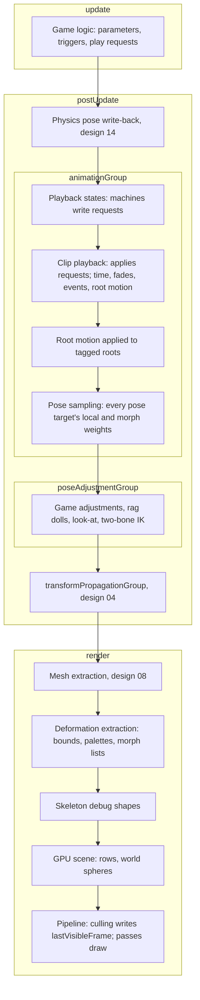
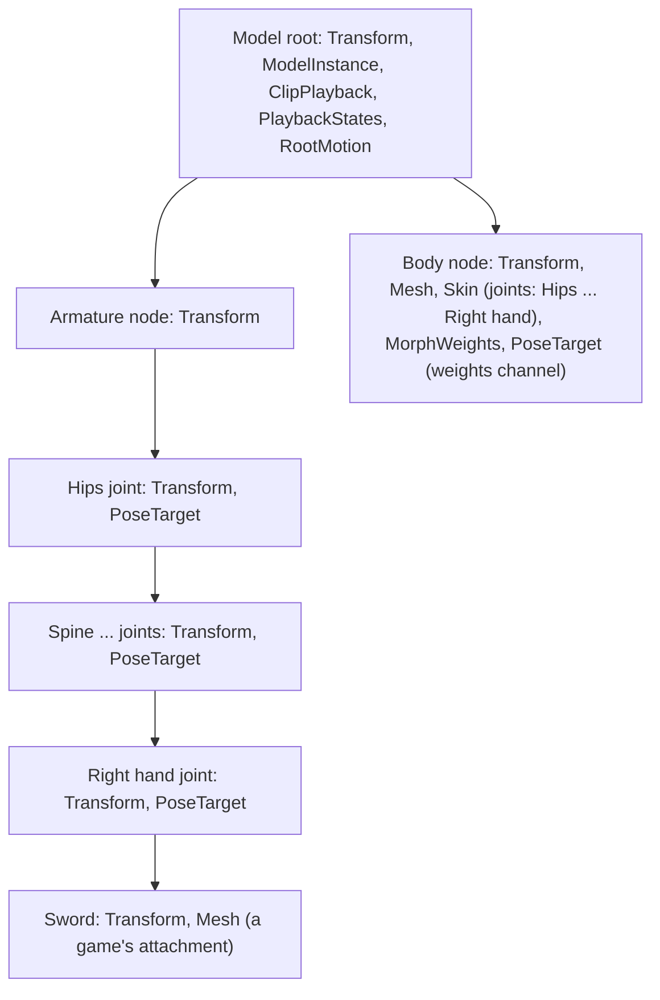

# Design 12: Skeletal and Morph Animation

|                                       |                                                                                                                                                                                                                                                                                                                                                                                                                                                                                                                                                                                                                                                                                                                                                                                                                                                          |
| ------------------------------------- | -------------------------------------------------------------------------------------------------------------------------------------------------------------------------------------------------------------------------------------------------------------------------------------------------------------------------------------------------------------------------------------------------------------------------------------------------------------------------------------------------------------------------------------------------------------------------------------------------------------------------------------------------------------------------------------------------------------------------------------------------------------------------------------------------------------------------------------------------------- |
| **Status**                            | Draft, for review (revised after solution review, §7)                                                                                                                                                                                                                                                                                                                                                                                                                                                                                                                                                                                                                                                                                                                                                                                                    |
| **Kind**                              | Feature and breaking refactor                                                                                                                                                                                                                                                                                                                                                                                                                                                                                                                                                                                                                                                                                                                                                                                                                            |
| **Engine version at time of writing** | `0.26.1`                                                                                                                                                                                                                                                                                                                                                                                                                                                                                                                                                                                                                                                                                                                                                                                                                                                 |
| **Program**                           | [Forge 3D](./README.md), milestone M4 (Phase 6 after it)                                                                                                                                                                                                                                                                                                                                                                                                                                                                                                                                                                                                                                                                                                                                                                                                 |
| **Depends on**                        | [04 Transforms](./04-transforms.md), [08 Meshes, materials and shaders](./08-meshes-materials-and-shaders.md), [11 glTF and asset lifetime](./11-gltf-and-asset-lifetime.md)                                                                                                                                                                                                                                                                                                                                                                                                                                                                                                                                                                                                                                                                             |
| **Lands with**                        | [11 glTF and asset lifetime](./11-gltf-and-asset-lifetime.md) (Phase 1 here and Phase 4 there ship together)                                                                                                                                                                                                                                                                                                                                                                                                                                                                                                                                                                                                                                                                                                                                             |
| **Related**                           | [03 ECS foundations](./03-ecs-foundations.md) (stages, groups, declared queries, journals, change ticks, singletons), [05 GPU device layer](./05-gpu-device.md) (attribute locations, vertex texture units), [06 Render pipeline](./06-render-pipeline.md) (GPU scene texel 3, world culling spheres, the static path, bind group 3, culling and `lastVisibleFrame`, debug drawing), [09 Lighting](./09-lighting-and-shadows.md) (cached shadow tiles and deforming casters), [14 Physics 3D](./14-physics-3d.md) (character controllers read root motion; rag dolls adjust poses; bodies exclude applied root motion), [15 Audio, particles and picking](./15-audio-particles-and-picking-in-3d.md) (picking skinned meshes, sounds from animation events), [01 Testing and benchmarks](./01-testing-and-benchmarks.md) (B4, goldens, allocation specs) |

## 0. Targeted modules

| Path                                                                                                                                                                        | Change   | Notes                                                                                                                                                                                                                                                                                                                                                                 |
| --------------------------------------------------------------------------------------------------------------------------------------------------------------------------- | -------- | --------------------------------------------------------------------------------------------------------------------------------------------------------------------------------------------------------------------------------------------------------------------------------------------------------------------------------------------------------------------- |
| `src/animations/clips/` (new)                                                                                                                                               | New      | `KeyframeClip`, `KeyframeChannel`, sampling with cursors, `createKeyframeClip`, `addClipEvent`, `setAdditiveReference`                                                                                                                                                                                                                                                |
| `src/animations/playback/` (new)                                                                                                                                            | New      | `ClipPlaybackEcsComponent` with layers, motions and requests; `playClip`, `playBlend`, `stopLayer`, `setMotionTime`, `setBlendParameter`; `ClipBlend1d`, a definition naming clips; `JointMask`; `PoseTargetEcsComponent`; the playback and pose sampling systems; `registerAnimation`; the `AnimationWorldEcsComponent` singleton (scratch and the binding registry) |
| `src/animations/states/` (new)                                                                                                                                              | New      | `PlaybackStatesEcsComponent`, holding each driven layer's current state of a shared `FiniteStateMachine`; `PlaybackState`, `PlaybackTransition`, predicates, the states system                                                                                                                                                                                        |
| `src/animations/root-motion/` (new)                                                                                                                                         | New      | `RootMotionEcsComponent`, `applyRootMotionTag`, its system                                                                                                                                                                                                                                                                                                            |
| `src/animations/procedural/` (new)                                                                                                                                          | New      | Pose-space helpers (Phase 5); `JointLookAtEcsComponent`, `TwoBoneIkEcsComponent` and their systems (Phase 6, after M4)                                                                                                                                                                                                                                                |
| `src/animations/types/AnimationClip.ts`, `components/sprite-animation-component.ts`, `systems/sprite-animation-system.ts`                                                   | Modified | `AnimationClip` renamed `SpriteAnimationClip`; its three events, which nothing raises, removed                                                                                                                                                                                                                                                                        |
| `src/animations/components/animation-component.ts`, `systems/animation-system.ts`                                                                                           | Modified | Renamed to property animations: `PropertyAnimationEcsComponent`, `propertyAnimationId`, `addPropertyAnimationComponent`, `createPropertyAnimationEcsSystem`; `createAnimatedProperty` applies its defaults with `withDefaults` instead of a spread                                                                                                                    |
| `src/animations/types/AnimationInputs.ts`, `AnimationCondition.ts`, `AnimationTransition.ts`, `DefaultAnimationStates.ts`, `utilities/create-animation.ts`, and their tests | Removed  | Unexported, with no callers (§6.2)                                                                                                                                                                                                                                                                                                                                    |
| `src/finite-state-machine/finite-state-machine.ts`, `transition.ts`                                                                                                         | Modified | A shared, immutable definition built from its states and transitions; `findTransition(current, input)` returns the transition taken and the caller keeps the current state; transitions from any state; `satisfies` without a closure per call                                                                                                                        |
| `src/rendering/deformation/` (new)                                                                                                                                          | New      | `Skin`, `SkinEcsComponent`, `MorphWeightsEcsComponent`, joint bounds, the deformation extraction system, the animation data texture and deformation records, `computeDeformedPositions`, skeleton debug drawing                                                                                                                                                       |
| `src/rendering/meshes/`                                                                                                                                                     | Modified | `joints1` and `weights1` attributes; `Mesh.morphTargets`; joint-influence count and highest joint index on `Mesh`                                                                                                                                                                                                                                                     |
| `src/rendering/shaders/forge/`                                                                                                                                              | Modified | `forge/skinning` and `forge/morphing` includes; `forge/vertex` calls them; `forge/object` reads the deformation record that texel 3 references                                                                                                                                                                                                                        |
| `src/rendering/gpu-scene/`, `src/rendering/components/mesh-component.ts`                                                                                                    | Modified | Texel 3 references a deformation record in place of the skinned flag; deformed slots' world culling spheres come from the mesh-space bound the deformation extraction supplies; deformed slots never take the static path; `MeshEcsComponent.lastVisibleFrame` from culling results (design 06 §6.8.1)                                                                |
| `src/lighting/shadows/`                                                                                                                                                     | Modified | A kept cached tile counts the dynamic casters of its last render as visible (design 09 §6.5.6)                                                                                                                                                                                                                                                                        |
| `src/gltf/`                                                                                                                                                                 | Modified | With design 11 Phase 4: skins, morph data and clips into these types; up to eight joint influences; skinned and morphed nodes never static; instantiation adds the components (§6.4.4)                                                                                                                                                                                |
| `AGENTS.md`                                                                                                                                                                 | Modified | "Transforms": the pose pipeline (sampling, then adjustments in group order) as the one sanctioned exception to one writer per value (§6.13.1)                                                                                                                                                                                                                         |
| `documentation-site/docs/docs/animations/`, `finite-state-machine/` (new), `asset-loading/asset-registry.md`, `events/index.md`                                             | Modified | §6.19                                                                                                                                                                                                                                                                                                                                                                 |
| `documentation-site/src/pages/demos/space-shooter/_create-explosions.ts`                                                                                                    | Modified | The sprite clip rename                                                                                                                                                                                                                                                                                                                                                |
| `documentation-site/src/pages/demos/animated-characters/` (new)                                                                                                             | New      | The demo in §6.19                                                                                                                                                                                                                                                                                                                                                     |
| `bench/`, `e2e/golden/`, `e2e/allocation/`, `e2e/specs/`                                                                                                                    | Modified | B4 with a generated character; the hidden-walker benchmark; animation goldens; allocation specs; attachment, visibility, cached-shadow, eight-influence and removed-joint specs                                                                                                                                                                                       |

---

## 1. Summary

Forge animates 2D today. `SpriteAnimationEcsComponent` steps a sprite through
the frames of an `AnimationClip` (`src/animations/types/AnimationClip.ts`),
and `AnimationEcsComponent` moves numbers from a start to an end value and
hands each value to a callback (`src/animations/components/animation-component.ts`).
Nothing deforms a mesh, and nothing can play the skins, morph targets and
animations that glTF files carry, which design 11 parses into this design's
types.

This design adds:

- **Keyframe clips.** A glTF animation becomes a `KeyframeClip`: channels
  that animate a node's translation, rotation, scale or morph weights, with
  step, linear and cubic-spline interpolation exactly as glTF defines them.
  Sampling keeps a cursor per key track, so a frame costs constant time per
  channel.
- **Skins.** Joints are ordinary entities with transforms in the hierarchy,
  so anything parented to a joint (a sword in a hand) follows it with no
  extra code. A `SkinEcsComponent` on the skinned mesh's entity names the
  joints and holds the skin's inverse bind matrices. After transform
  propagation, joint matrices relative to the mesh entity are written into
  a data texture that the vertex shader reads (bind group 3) for linear
  blend skinning with four influences, or eight with a second joint set.
  Every copy of a character still draws in one instanced draw.
- **Morph targets.** Deltas for positions, normals and tangents live in a
  texture per mesh; a `MorphWeightsEcsComponent` holds the weights; the
  vertex shader applies up to 16 active targets per instance, the largest
  first, before skinning.
- **Playback.** A `ClipPlaybackEcsComponent` on a model's root plays motions
  (a clip, or a 1D blend of clips by a parameter) in layers that override or
  add, each with a weight and an optional joint mask. Motions cross-fade,
  loop, ping-pong or hold, record **events** in the component when playback
  crosses their times, and publish **root motion** for character
  controllers (design 14). Game code and state machines change playback
  through **requests** on a layer, which only the playback system applies.
- **State machines.** Forge's existing `FiniteStateMachine` becomes a shared
  definition, like a clip: a crowd of characters runs one machine, and each
  character's current state lives in its `PlaybackStatesEcsComponent`.
- **One writer, and one ordered exception.** The pose sampling system, in
  `postUpdate` before transform propagation, writes every animated node's
  local transform and morph weights on every frame it samples, from the
  playback state alone. Procedural adjustments (a game's own, rag dolls,
  look-at, two-bone IK) run in a group after it and before propagation, in a
  fixed order, on a pose that is fresh every frame, so they never
  accumulate. That ordered chain is the one sanctioned exception to one
  writer per value, recorded in `AGENTS.md`.
- **Cost.** B4 (100 characters, 60 joints, two blended clips) fits in
  5 ms. A character that no camera view, shadow view or cached shadow tile
  saw last frame keeps its time, events and root motion, but isn't sampled,
  and its joint matrices aren't recomputed or uploaded; only its culling
  bound follows its joints.

The animations module's existing names also change: "animation clip" and
"animation component" today mean sprite frames and tweens, the least general
things the names could mean once 3D animation exists (§6.2).

---

## 2. Scope

### In scope

- Keyframe clips from glTF and from code; step, linear and cubic-spline
  interpolation; quaternion handling; cursors.
- Binding clips to entities at instantiation, by node index or by node name.
- Skins, joint matrices, the animation data texture, GPU linear blend
  skinning with 4 or 8 influences, skinned bounds for culling.
- Morph targets on the GPU, their weights component, their bounds.
- Playback: layers, override and additive blending with reference poses,
  joint masks, cross-fades, speed, loop modes, 1D blends, events, root
  motion, and the requests through which code changes it.
- Playback driven by `FiniteStateMachine`, and the changes that module needs
  to be shared between characters.
- What happens when joints, pose targets or playback components are removed
  while a character plays.
- Procedural adjustments: where they run and the helpers to work in model
  space (M4); look-at and two-bone IK as the first engine adjustments
  (Phase 6, after M4).
- Skipping sampling and joint matrices for characters nobody sees.
- Skeleton debug drawing.
- Renaming and deleting in the animations module (§6.2).
- Tests, B4, guides and a demo.

### Out of scope

- **Retargeting** between skeletons with different proportions or joint
  names. Clips from another file bind by node name and nothing more.
- **Dual quaternion skinning**, and more than eight influences per vertex
  (extra sets are reduced to the eight largest weights at load).
- **2D blend spaces and blend trees.** Only 1D blends; open question 6.
- **Inertial blending.** Cross-fades sample both motions (decision AN13).
- **`KHR_animation_pointer`**, and animating component fields other than
  transforms and morph weights. Design 11 skips pointer channels (its
  GA21); a follow-up design animates component fields by path, for glTF
  and for property animations alike (open question 5).
- **Physics-driven joints (rag dolls).** Design 14 writes them as a pose
  adjustment (§6.13.1).
- **Full-body IK, foot placement and constraint systems** beyond look-at
  and two-bone IK.
- **Clip compression** (key reduction, quantized keys) and streaming clips.
- **Events for sprite animations.**
- **GPU sampling or skinning in compute.** WebGL2 has no compute shaders.
- **CPU skinning as a rendering path.** `computeDeformedPositions` exists for
  tests and reference renders, not for drawing.

---

## 3. Phases

Each phase adds its changelog bullets; Phases 4 and 5, which have no
guide task, add `#### Added` for `animateWhenHidden` and the pose-space
helpers.

### Phase 1: Clips, skins and morph targets (ships with design 11 Phase 4)

Adds keyframe clips, binding, single-motion playback, skins and morph
targets: enough to play a glTF animation.

| #    | Task                     | Description                                                                                                                                                                                                                                                                                                                         | Size |
| ---- | ------------------------ | ----------------------------------------------------------------------------------------------------------------------------------------------------------------------------------------------------------------------------------------------------------------------------------------------------------------------------------- | ---- |
| 1.1  | Names                    | §6.2: `SpriteAnimationClip`, property animation renames and `withDefaults` in `createAnimatedProperty`, deletions; the space-shooter demo, the sprite and property animation guides, `asset-registry.md` and `events/index.md`                                                                                                      | S    |
| 1.2  | Keyframe clips           | §6.3.1, §6.3.4: types, timelines shared by channels, `createKeyframeClip` with validation                                                                                                                                                                                                                                           | M    |
| 1.3  | Sampling                 | §6.3.3: the three interpolations, clamping, slerp, cubic-spline normalization, cursors                                                                                                                                                                                                                                              | M    |
| 1.4  | Binding and pose targets | §6.4: pose layouts, clip sets shared by a model's instances, channel tables, rest poses, `PoseTargetEcsComponent` and the one-writer check, removed targets and playback components                                                                                                                                                 | M    |
| 1.5  | Single-motion playback   | `ClipPlaybackEcsComponent` with layers that each play one motion; requests and the play functions (§6.5.2); speed, loop modes; the playback and pose sampling systems; `registerAnimation` and its singleton                                                                                                                        | M    |
| 1.6  | Skins                    | §6.10: `Skin`, `SkinEcsComponent`, joint bounds and joint parents; joint matrices, the animation data texture and deformation records referenced from texel 3; mesh-space bounds the GPU scene transforms; deformed slots kept off the static path; removed joints                                                                  | L    |
| 1.7  | Skinning shaders         | §6.10.4: `forge/skinning`, the 4- and 8-influence variants, `joints1` and `weights1` at attribute locations 8 and 9                                                                                                                                                                                                                 | M    |
| 1.8  | Morph targets            | §6.11: `Mesh.morphTargets`, the delta array texture, `MorphWeightsEcsComponent`, active lists, `forge/morphing`, growth in mesh space                                                                                                                                                                                               | L    |
| 1.9  | CPU reference            | `computeDeformedPositions`, the same math as the shaders, for tests and reference renders                                                                                                                                                                                                                                           | S    |
| 1.10 | Skeleton debug drawing   | §6.16                                                                                                                                                                                                                                                                                                                               | S    |
| 1.11 | glTF                     | With design 11 Phase 4: clips, skins and morph data into these types (`Model.animations` holds `KeyframeClip`s); up to eight influences; skinned and morphed nodes never static; instantiation adds the playback, skin, morph-weight and pose-target components (§6.4.4)                                                            | S    |
| 1.12 | Tests                    | §6.18: unit tests; the InterpolationTest reference comparison; goldens for `InterpolationTest`, `CesiumMan`, `Fox`, `RiggedFigure`, `BrainStem`, `RecursiveSkeletons`, `AnimatedMorphCube`, `MorphPrimitivesTest`; the generated eight-influence mesh; models instantiated with `isStatic`; removed joints; the attachment e2e spec | L    |
| 1.13 | `AGENTS.md`              | "Transforms": the pose pipeline as the one sanctioned exception to one writer per value (§6.13.1)                                                                                                                                                                                                                                   | S    |
| 1.14 | Guides and changelog     | `keyframe-clips.md`, `skinning.md`, `morph-targets.md`, `playing-clips.md`; `#### Added` for clips, skins, morphs and playback, `#### Changed` for the renames with their migration                                                                                                                                                 | M    |

**Definition of done:** design 11 Phase 4's animated, skinned and morphed
goldens match at every sampled time; InterpolationTest's nine channels
sampled by Forge equal the reference evaluation within `1e-6`; a box
parented to a joint renders where the joint projects (e2e, relative
measurement); 100 instances of `Fox` draw in one instanced draw per part
in the color pass and in each shadow view; the generated eight-influence
mesh renders as its `computeDeformedPositions` reference does; a `Fox`
instantiated with `isStatic` is culled by its animated pose; removing a
joint entity hides the vertices it moved and throws nothing; nothing
imports the removed or renamed names.

### Phase 2: Layers and blending

Adds playback layers, cross-fades, 1D blends, additive layers and joint
masks.

| #   | Task                     | Description                                                                                                                                                 | Size |
| --- | ------------------------ | ----------------------------------------------------------------------------------------------------------------------------------------------------------- | ---- |
| 2.1 | Layers                   | §6.7: override and additive layers, layer weights, per-target coverage, the rest pose under everything                                                      | M    |
| 2.2 | Cross-fades              | §6.6.2: fade weights per motion, interruption from current weights, a bounded number of motions per layer                                                   | M    |
| 2.3 | 1D blends                | §6.6.3: `createClipBlend1d`, a definition naming clips that any number of characters share; weights from the layer's blend parameter; phase synchronization | M    |
| 2.4 | Additive reference poses | §6.3.5: `setAdditiveReference`; reference values per channel computed at binding                                                                            | S    |
| 2.5 | Joint masks              | `createJointMask`, by name, with descendants                                                                                                                | S    |
| 2.6 | Tests and demo           | Blending unit tests; `Fox` goldens for a Walk and Run blend and a cross-fade; the `animated-characters` demo                                                | M    |
| 2.7 | Guide and changelog      | `layers-and-blending.md`; `#### Added`                                                                                                                      | S    |

**Definition of done:** `Fox` blends Walk and Run by a speed parameter
with both clips' feet in phase; an interrupted cross-fade changes no joint
by more than one frame's worth of either motion's own movement (no pop);
an additive layer sampled at its reference time leaves the pose unchanged
within `1e-9`.

### Phase 3: Events, root motion and state machines

Adds clip events, root motion and playback states on shared state
machines.

| #   | Task                 | Description                                                                                                                                                                                    | Size |
| --- | -------------------- | ---------------------------------------------------------------------------------------------------------------------------------------------------------------------------------------------- | ---- |
| 3.1 | Clip events          | §6.8: `addClipEvent`, records on the playback component, crossings across loops, ping-pong and negative speed                                                                                  | S    |
| 3.2 | Root motion          | §6.9: extraction from a joint, removal from the pose, deltas and velocities in model space, `applyRootMotionTag`                                                                               | M    |
| 3.3 | `FiniteStateMachine` | §6.12.1: a shared definition built from states and transitions; `findTransition(current, input)`; transitions from any state; `satisfies` as a loop                                            | S    |
| 3.4 | Playback states      | §6.12.2: the component with each driven layer's current state; the states system writing requests with cross-fades; parameters, triggers, exit time; the play functions throw on driven layers | M    |
| 3.5 | Tests                | Events, root motion at 20 to 240 fps, state machines, the FSM changes, requests on driven layers                                                                                               | M    |
| 3.6 | Guides and changelog | `animation-events.md`, `root-motion.md`, `animation-states.md`, a new `finite-state-machine/index.md`; `#### Added`, `#### Changed` for the FSM's shape                                        | M    |

**Definition of done:** the demo's character runs on a three-state machine
(idle, a locomotion blend, a jump on a trigger), and its 100-character crowd
runs the same machine and blend definitions, with no per-character graph;
`playClip` on a layer a machine drives throws; a straight walking loop's
root motion over 10 simulated seconds equals the clip's per-loop
displacement times the loops played, within `1e-6`, at frame rates from 20
to 240 fps; every event fires exactly once per crossing.

### Phase 4: Performance

Makes deformation change-driven and skips hidden characters, to meet B4.

| #   | Task                                 | Description                                                                                                                                                                                                                                 | Size |
| --- | ------------------------------------ | ------------------------------------------------------------------------------------------------------------------------------------------------------------------------------------------------------------------------------------------- | ---- |
| 4.1 | Visibility feedback                  | `MeshEcsComponent.lastVisibleFrame` from culling results: camera views, shadow views and the casters of kept cached tiles (design 06 §6.8.1, design 09 §6.5.6); sampling skipped for hidden instances (§6.7.4)                              | M    |
| 4.2 | Change-driven deformation            | Joint matrices recomputed and uploaded only for visible instances whose joints changed; hidden instances refresh only their mesh-space bound; morph lists only when weights changed; dirty row ranges; the deformation tick design 09 reads | M    |
| 4.3 | Shared palettes                      | Skin components with the same skin, joints and mesh world matrix share one palette (several skinned meshes on one skeleton)                                                                                                                 | S    |
| 4.4 | B4                                   | The generated character with translation, rotation and scale on every joint (§6.17.1), the Forge scene, plain and optimized Three.js versions, measured budgets replacing the estimates                                                     | M    |
| 4.5 | Hidden characters                    | The hidden-walker benchmark, deformation cost and uploads included; the cached-shadow-tile e2e spec (§6.18.3)                                                                                                                               | S    |
| 4.6 | Microbenchmarks and allocation specs | §6.18.4, §6.18.5                                                                                                                                                                                                                            | M    |

**Definition of done:** B4 meets 5 ms on the desktop reference and is no
slower than the optimized Three.js version; the crowd allocation spec
records no allocation in this design's code; 100 hidden, walking characters
cost at most 0.3 ms per frame in the animation and deformation systems,
compute no joint matrices and upload no palette bytes (propagating their
joints as their roots move is design 04's cost); an off-screen character
whose only view is its shadow in a cached spot tile animates again, and its
shadow with it, after a pause.

### Phase 5: Pose adjustments

The group, the order of its writers and the helpers games write adjustments
with. Design 14's rag dolls build on this phase.

| #   | Task               | Description                                                                                                                                              | Size |
| --- | ------------------ | -------------------------------------------------------------------------------------------------------------------------------------------------------- | ---- |
| 5.1 | Pose-space helpers | §6.13.1: model-space matrices from current local values; the root's current world matrix through design 04's `getCurrentWorldMatrix`; model-space writes | S    |
| 5.2 | Game adjustments   | The contract tested with an adjustment system in `poseAdjustmentGroup`; the demo's character leans into turns with one                                   | S    |
| 5.3 | Guide              | `procedural-adjustments.md`: the group and its order, the helpers, writing an adjustment, hidden characters, customizing a rest pose                     | S    |

**Definition of done:** the demo's lean runs; 1,000 frames at a constant
turn rate leave the adjusted pose identical to the first frame's (no
accumulation); the helpers equal propagated world matrices within `1e-9`.

### Phase 6: Look-at and two-bone IK (after M4)

Engine solvers on top of Phase 5. They ship when the M6 sample game, or a
game, needs them; until then games write adjustments with Phase 5's
helpers.

| #   | Task               | Description                                                                                       | Size |
| --- | ------------------ | ------------------------------------------------------------------------------------------------- | ---- |
| 6.1 | Look-at            | §6.13.2: `JointLookAtEcsComponent` with weight, angle limit and the joint's front axis            | M    |
| 6.2 | Two-bone IK        | §6.13.3: `TwoBoneIkEcsComponent` with a pole and weight; analytic solution                        | M    |
| 6.3 | Tests, demo, guide | Unit tests; the demo's character looks at the pointer and plants a hand; the solvers in the guide | M    |

**Definition of done:** the demo runs; 1,000 frames with a fixed target
leave the adjusted pose identical to the first frame's; the IK end joint
reaches a reachable target within `1e-6` m.

---

## 4. Decision log

| #    | Decision                              | Options                                                                                                                                                                                                                                                                                                                                                                                              | Chosen | Rationale, trade-offs, assumptions                                                                                                                                                                                                                                                                                                                                                                                                                                                                                                                                                                                                                                             |
| ---- | ------------------------------------- | ---------------------------------------------------------------------------------------------------------------------------------------------------------------------------------------------------------------------------------------------------------------------------------------------------------------------------------------------------------------------------------------------------- | ------ | ------------------------------------------------------------------------------------------------------------------------------------------------------------------------------------------------------------------------------------------------------------------------------------------------------------------------------------------------------------------------------------------------------------------------------------------------------------------------------------------------------------------------------------------------------------------------------------------------------------------------------------------------------------------------------ |
| AN1  | Names                                 | (a) New names for new types (`KeyframeClip`, `ClipPlaybackEcsComponent`) and the existing ones made specific (`SpriteAnimationClip`, `PropertyAnimationEcsComponent`); (b) reuse `AnimationClip` for keyframe clips and rename the sprite one; (c) keep today's names and add new ones                                                                                                               | (a)    | `AnimationClip` is a list of sprite-sheet frames and `AnimationEcsComponent` a list of tweens. Reusing `AnimationClip` for a different type turns upgrade errors into confusing type mismatches. Keeping both generic names next to 3D animation leaves the most general names meaning the least general things. The new names follow the guides' existing terms ("sprite animations", "property animations"), and none is another engine's class name (no animator, animation player or animation controller).                                                                                                                                                                |
| AN2  | Where skinning and morphing live      | (a) Skins, morph weights and deformation in `rendering` (`src/rendering/deformation/`); clips and playback in `animations`; (b) everything in `animations`                                                                                                                                                                                                                                           | (a)    | Skinning is how a mesh is drawn from joint transforms, whatever moves the joints: clips, IK, physics or game code. Bevy keeps skinned meshes in its rendering crates and animation in its own; Godot's skins belong to the mesh instance. The data flows one way (animation writes transforms and weights, rendering reads them), and playback runs without a renderer (a server computing root motion, unit tests).                                                                                                                                                                                                                                                           |
| AN3  | When joint matrices are computed      | (a) In the render stage, from world transforms, straight into the render context's staging mirror; (b) in `postUpdate`, into an array on the skin component                                                                                                                                                                                                                                          | (a)    | They're derived GPU data (README §4.4). Computing them where they're uploaded avoids an intermediate copy of 48 bytes per joint, keeps nothing on the component, and lets the render stage skip them for instances no view saw (AN20). CPU code that needs deformed vertices uses `computeDeformedPositions`, which reads transforms.                                                                                                                                                                                                                                                                                                                                          |
| AN4  | Where palettes live on the GPU        | (a) One `rgba32float` animation data texture per world, 2,048 texels wide, three texels per joint, found per instance through a deformation record (AN31); (b) a uniform block per draw; (c) a texture per skin instance                                                                                                                                                                             | (a)    | Instanced draws of many characters need per-instance palettes, which a per-draw block can't give, and blocks are guaranteed only 16 KB (about 340 joints as 3x4 matrices). A texture per instance costs a bind per instance and breaks instancing. One texture per world, like the GPU scene (design 06, R3, R4), keeps 100 characters in one draw. 2,048 is WebGL2's guaranteed `MAX_TEXTURE_SIZE`. Three.js reads bones from a texture per skeleton; this extends that to instancing.                                                                                                                                                                                        |
| AN5  | Frame of reference for joint matrices | (a) Relative to the skinned mesh entity: `inverse(meshWorld) × jointWorld × inverseBind`, in 64-bit; the shader applies the entity's transform from the GPU scene; (b) absolute world matrices                                                                                                                                                                                                       | (a)    | The mesh entity's transform cancels, so the result is exactly glTF's, which says "the transform of the skinned mesh node MUST be ignored", while large translations stay on the GPU scene's camera-relative path (README §4.3). `float32` world matrices would jitter far from the origin. Three.js changes frame with its `bindMatrixInverse` the same way. A mesh-relative palette also doesn't change when the whole character moves rigidly.                                                                                                                                                                                                                               |
| AN6  | Influences per vertex                 | (a) Four, or eight when the mesh has `joints1`/`weights1` (attribute locations 8 and 9), as variants; more reduced to the eight largest at load; (b) always four (design 11's GA20); (c) any number, from a texture                                                                                                                                                                                  | (a)    | Four covers most content; scanned characters and some exporters write eight, and glTF allows any number of sets. The second set costs two attribute locations and 12 more texel fetches, only in its own variant. (c) needs per-vertex loops and a texture fetch per influence. Design 11's GA20 and design 05's location table (§6.5 there) include the second set.                                                                                                                                                                                                                                                                                                           |
| AN7  | Skinning method                       | (a) Linear blend skinning; (b) dual quaternion skinning                                                                                                                                                                                                                                                                                                                                              | (a)    | glTF defines skinning as a weighted sum of joint matrices, and content is authored and checked against that (the Sample Viewer). Dual quaternions change the result (no candy-wrapper twists, but no scale). A later variant could add them.                                                                                                                                                                                                                                                                                                                                                                                                                                   |
| AN8  | Culling bounds of skinned meshes      | (a) Per joint, the sphere of the vertices it moves, in its bind space, computed at load; each frame the joints' world matrices pose them, and their union becomes a bound in the mesh entity's space that the GPU scene transforms like any mesh's bounds; (b) bind-pose bounds with a margin; (c) CPU skinning of every vertex                                                                      | (a)    | (b) misses poses far from the bind pose (crouching, lying down) and culls visible characters. (c) costs per vertex per frame. (a) costs a point transform per joint, is conservative for any pose (radii scale with the matrices' largest axis scale), and is what Godot 4's per-bone bounds do. Handing the GPU scene a mesh-space bound, rather than a world sphere, leaves world spheres to one writer for every slot (design 06).                                                                                                                                                                                                                                          |
| AN9  | Morph target storage and limit        | (a) Deltas in a float texture per mesh; per instance, a list of at most 16 active targets, the largest weights first; (b) deltas as vertex attributes, a few targets per draw; (c) every target for every vertex                                                                                                                                                                                     | (a)    | Attributes cap targets at the free locations and force rebinding buffers as weights change. (c) costs per vertex per target even at weight 0, and face rigs carry 50 or more targets. A sorted, capped list bounds the cost and drops only the smallest contributions. Babylon.js and current Three.js keep deltas in textures. The cap is open question 1.                                                                                                                                                                                                                                                                                                                    |
| AN10 | Order of deformation                  | (a) Morph, skin, vertex hook, object transform; (b) the vertex hook before skinning                                                                                                                                                                                                                                                                                                                  | (a)    | glTF applies morph displacements "before any transformation matrices". Design 08 put the vertex hook in object space after skinning, which is what Godot and Unity shader authors see (skinned positions), so wind or wobble applies to the animated shape.                                                                                                                                                                                                                                                                                                                                                                                                                    |
| AN11 | Who writes animated nodes             | (a) The pose sampling system writes every pose target on every sampled frame, the rest value where no active motion animates it; adjustments follow it in group order; (b) write only the channels of active clips                                                                                                                                                                                   | (a)    | With (b), a joint whose clip faded out keeps its last value forever, and any adjustment applied on top accumulates frame after frame. Writing every target makes the pose a function of the playback state alone, so each frame starts fresh; Godot 4's deterministic mixing and Unity's Write Defaults do the same. Sampling and the adjustments after it are several writers of one field, in a fixed order within a frame: the one sanctioned exception to one writer per value, recorded in `AGENTS.md` (§6.13.1). Trade-off: game code can't pose a bound node in `update`; it adjusts in the pose adjustment group or changes the rest pose (§6.4.3).                    |
| AN12 | Where procedural adjustments run      | (a) A group between sampling and propagation; adjustments compose model-space transforms from current local values with pose-space helpers; (b) after propagation, writing `local` and calling `propagateTransform`; (c) inside the sampler                                                                                                                                                          | (a)    | In Bevy, systems that adjust animated transforms are ordered after the animation systems and before transform propagation, and Godot's skeleton modifiers run on the animated pose; both work on the pose before it's propagated. (b) propagates subtrees twice per frame. (c) closes the extension point. World transforms aren't current in the group, so the helpers compose locals up to the model root, a few multiplies for a limb.                                                                                                                                                                                                                                      |
| AN13 | Cross-fades                           | (a) Each motion in a layer has a fade weight; a cross-fade fades the new motion in and the others out, linearly from their current weights, sampling all of them; (b) a frozen snapshot of the outgoing pose; (c) inertial blending                                                                                                                                                                  | (a)    | Linear fades that start from weights summing to 1 keep summing to 1, so interrupting a cross-fade with another has no pop. Bevy's animation transitions and Unity's cross-fades sample both motions the same way. (b) freezes the outgoing motion, so a running character's legs stop mid-fade. (c) needs per-joint velocities and a different authoring model; it can be added later.                                                                                                                                                                                                                                                                                         |
| AN14 | Rotation math                         | (a) Slerp between keys, as glTF requires; a weighted sum of sign-aligned quaternions, normalized, to blend motions and layers; (b) slerp everywhere; (c) normalized lerp everywhere                                                                                                                                                                                                                  | (a)    | glTF specifies slerp between linear keys and InterpolationTest checks it. Blending more than two poses has no closed slerp form; normalized weighted sums after sign alignment are what engines use and are accurate for the small angles between blended poses. Design 02's `Quat.nlerp` exists for this.                                                                                                                                                                                                                                                                                                                                                                     |
| AN15 | State machines                        | (a) `FiniteStateMachine` as a shared, immutable definition; each character's current state, state time and input in its `PlaybackStatesEcsComponent`; states name clips or blend definitions; (b) a machine object per character that holds its current state (the first draft); (c) a new animation state machine with string-keyed parameters, as the removed `AnimationInputs` sketched; (d) none | (a)    | Unity's animator controllers, Godot's `AnimationNodeStateMachine` and Bevy's `AnimationGraph` are shared assets with playback state per instance. With (b), a 100-character crowd builds 100 graphs, blends and sets of closures, and each character's state lives inside an object instead of a component (README §4.4). The FSM has no callers outside its tests, so reshaping it costs no migration. Predicates over a typed object need no parameter registry and are checked by TypeScript; `AnimationInputs`' four maps of named values were never wired to anything. The FSM gains two things every user needs: which transition fired, and transitions from any state. |
| AN16 | Triggers                              | (a) A set on the states component that games add to and the states system clears after each run; (b) booleans the game sets and clears; (c) cleared only when a transition consumes them                                                                                                                                                                                                             | (a)    | One owner clears the latch, as with design 03's fixed-step input latch (E12). (c) keeps an unconsumed trigger until a state that reads it is reached, sometimes seconds later, a known source of bugs. A trigger lasts exactly one evaluation.                                                                                                                                                                                                                                                                                                                                                                                                                                 |
| AN17 | Animation events                      | (a) Records of the events crossed since the last run, in an array on the playback component; (b) `ForgeEvent`s raised from inside the playback system; (c) a world-wide event queue                                                                                                                                                                                                                  | (a)    | Events stay data, which any system reads in its own order: a gameplay system reacts when it runs, a hidden character's footsteps are still recorded, and no listener runs inside the playback loop where it could remove the entity being processed. Trade-off: a system in `update` sees an event one frame after it was crossed.                                                                                                                                                                                                                                                                                                                                             |
| AN18 | Events from blends                    | (a) From every active motion, recorded with its weight; in a 1D blend, only from the entry with the highest weight; (b) from every blend entry                                                                                                                                                                                                                                                       | (a)    | (b) fires a walk's and a run's footsteps together while blending between them. Unreal's blend spaces offer a mode that triggers notifies only from the highest-weighted animation for this reason. Recording the weight lets games drop events from motions fading out.                                                                                                                                                                                                                                                                                                                                                                                                        |
| AN19 | Root motion                           | (a) From one designated joint: its movement in the model's horizontal plane and its turn about up, removed from the pose and published as a model-space delta and velocity; applied by an opt-in tag or read by a character controller; (b) the joint's whole motion, as Godot extracts it; (c) applied to the root automatically                                                                    | (a)    | Horizontal movement and heading are the motion a character moves by; leaving vertical motion and the rest of the rotation in the pose keeps a walk's bob and sway, and works both for rigs with a dedicated root joint and for rigs rooted at the hips. (c) would make the animation module a second writer of the root's transform next to a character controller (design 14), which is also why a tagged root with a body throws (§6.9.3). Vertical root motion is open question 2.                                                                                                                                                                                          |
| AN20 | Characters nobody sees                | (a) Keep time, fades, events and root motion; skip pose sampling, and skip joint matrices and their upload, while no view saw any of the instance's meshes last frame; the mesh-space bound still follows the joints; `animateWhenHidden` keeps sampling; (b) always animate; (c) stop everything                                                                                                    | (a)    | Unity's `CullUpdateTransforms` culling mode keeps the animator running and stops writing transforms for characters whose renderers aren't visible; its `AlwaysAnimate` is `animateWhenHidden`, which games genuinely need per character (hit boxes on an off-screen hand). The bound keeps following the joints, at a point transform per joint, because the pose can still change while hidden (a simulated rag doll, `animateWhenHidden`), and a tick comparison can't tell that from the root moving. Trade-off: a character entering the view shows its last pose for one frame.                                                                                           |
| AN21 | Clip time                             | (a) From 0 to the last key; (b) from the first key to the last                                                                                                                                                                                                                                                                                                                                       | (a)    | glTF: "The inputs of each sampler are relative to t = 0, defined as the beginning of the parent animations entry." Matches the Sample Viewer, which keeps goldens comparable.                                                                                                                                                                                                                                                                                                                                                                                                                                                                                                  |
| AN22 | Binding                               | (a) A channel-to-target table per model and clip, built once; a target-to-entity table per instance; clips from other files matched by node name; (b) target lookups during sampling                                                                                                                                                                                                                 | (a)    | No lookups or allocation per frame, and instances share the tables. Matching by name covers the common workflow of exporting a rig's clips to separate files. Retargeting is out of scope.                                                                                                                                                                                                                                                                                                                                                                                                                                                                                     |
| AN23 | Loop modes                            | (a) Reuse `LoopMode` (`'none' \| 'loop' \| 'pingpong'`); (b) a new type                                                                                                                                                                                                                                                                                                                              | (a)    | The same three behaviors, one name. `'none'` holds a clip's last pose, and removes a property animation; each guide says which.                                                                                                                                                                                                                                                                                                                                                                                                                                                                                                                                                |
| AN24 | Enforcing one writer per node         | (a) A `PoseTargetEcsComponent` on every target, naming its playback root; binding a target another playback owns throws; (b) documentation only                                                                                                                                                                                                                                                      | (a)    | Nested model instances, or clips that target another instance's nodes, would otherwise give a node two writers that silently fight. Design 06 enforces one controller per camera the same way. The component also tells adjustments which root a joint belongs to, and lets physics' write-back leave pose targets alone (design 14).                                                                                                                                                                                                                                                                                                                                          |
| AN25 | Morphed meshes in the mesh pool       | (a) Meshes with morph targets keep their own vertex buffer; (b) pooled, with a base vertex passed per draw                                                                                                                                                                                                                                                                                           | (a)    | The shader finds a vertex's deltas by `gl_VertexID`, which is the mesh's own index only in its own buffer. A morphed mesh binds its own delta texture, so it could never join another mesh's multi-draw anyway. Design 08's MS7 already says so.                                                                                                                                                                                                                                                                                                                                                                                                                               |
| AN26 | How animation learns what was seen    | (a) The render pipeline writes `MeshEcsComponent.lastVisibleFrame` from culling results: camera views, shadow views, and the dynamic casters a kept cached shadow tile drew at its last render; (b) the frame a pass drew the mesh (the first draft's §6.7.4); (c) playback reads the render context's culling results; (d) playback culls on its own                                                | (a)    | An output field any system can read, with one writer; Bevy's `ViewVisibility` component is the same idea. (b) freezes characters: a cached tile has no shadow view (design 09), so a character seen only through its shadow there is never drawn, never sampled, never deforms, and so never invalidates the tile. Counting a kept tile's casters keeps it sampled, and its next deformation re-renders the tile. Culling results are also known whether or not a draw was skipped (a pipeline still compiling). Playback keeps no dependency on rendering's internals, and nothing culls twice. Cost: one store per visible mesh, plus one per dynamic caster of a kept tile. |
| AN27 | Additive reference pose               | (a) A property of the clip: its own pose at time 0 unless `setAdditiveReference` names another clip and time; (b) a property of the layer                                                                                                                                                                                                                                                            | (a)    | An additive clip is authored against a particular pose, so the reference belongs with the clip, as in Unity's clip settings and Unreal's additive base pose on the asset. One clip played additively on several layers then means the same thing on each.                                                                                                                                                                                                                                                                                                                                                                                                                      |
| AN28 | Clip times in a 1D blend              | (a) One normalized phase for the blend; each clip's time is the phase times its duration; the phase advances at the weighted average of the clips' rates; (b) independent clip times                                                                                                                                                                                                                 | (a)    | Locomotion clips of different lengths only blend without foot sliding when their cycles are aligned. Unity's blend trees and Godot's blend spaces synchronize the same way.                                                                                                                                                                                                                                                                                                                                                                                                                                                                                                    |
| AN29 | How code changes what a layer plays   | (a) Requests on the layer (play or stop, seek, blend parameter) that only the playback system applies; the functions throw for a layer a state machine drives, and the states system writes that layer's requests; (b) functions that change motions directly, with the guide telling games not to call them on driven layers (the first draft)                                                      | (a)    | With (b), a game's `playClip` and the states system both write a driven layer's motions, and which one wins depends on the guide being read: the documentation-only enforcement AN24 rejects. Requests give motions and the blend parameter one writer, and each layer's requests one producer. Unity's `Animator.CrossFade` and Godot's state machine `travel` also take effect at the animation's next update. Trade-off: a request made after `animationGroup` has run applies the next frame.                                                                                                                                                                              |
| AN30 | Removing joints and pose targets      | (a) A removed pose target is dropped from its instance's table and its channels skipped; a removed joint's palette entry collapses to a point at its nearest remaining ancestor joint, so the vertices it moved disappear into the stump; (b) throw; (c) keep the removed joint's last matrix                                                                                                        | (a)    | Removing part of a skeleton is how games dismember characters and delete attachments that carry pose targets, so it can't be an error. (c) leaves the removed limb's vertices floating where it was. Collapsing them is what Unreal's hide-bone does, which games use for dismemberment. Vertices shared with remaining joints are pulled towards the stump. A game that wants a clean cut swaps the mesh for one without the limb.                                                                                                                                                                                                                                            |
| AN31 | How a slot finds its deformation data | (a) Texel 3's flags value also holds the index of a deformation record in the animation data texture, replacing the skinned flag; (b) a sixth GPU scene texel for every object (the first draft); (c) a separate per-slot texture                                                                                                                                                                    | (a)    | (b) makes every mesh's object data 20% larger for values only deformed slots have, and leaves design 06's skinned flag duplicating the variant bits. (c) costs a vertex texture unit. A record index needs 22 bits and the remaining flags two, so both fit in one integer below 2²⁴, stored exactly in `float32`. Deformed variants fetch the record (one texel) where they'd have fetched a sixth texel; other variants read nothing more.                                                                                                                                                                                                                                   |

---

## 5. Open questions

In priority order.

1. **Active morph targets and delta precision.** Up to 16 active targets per
   instance, and `rgba32float` deltas, are starting points. A 10,000-vertex
   face with 52 targets of positions and normals takes 16.6 MB at 32 bits,
   both used and allocated, since the texture is sized from the data
   (§6.11.3).
   Options: (a) keep both; (b) `rgba16float` deltas, half the memory, about
   1 mm of error on a 2 m delta; (c) 32 active targets. Proposal: measure
   `MorphStressTest` and a 52-target face in Phase 4 on the reference
   devices, and decide (b) if the golden difference is within tolerance.
2. **Vertical root motion.** Climbing and vaulting clips move the character
   up, which AN19 leaves in the pose. Options: (a) a per-clip field that
   also extracts vertical movement; (b) games sample the joint themselves.
   Proposal: (a), added when the M6 sample game or a user needs it, since
   it's a property of how a clip was authored.
3. **Playback in the fixed step.** A physics-driven character reads root
   motion as a velocity one frame late (§6.9.3). Options: (a) keep that; (b)
   let a playback component advance in `fixedUpdate`, like Unity's
   physics update mode. Design 14's `animated` bodies no longer need (b):
   they spread each frame's motion over its steps (design 14 PH33), so
   root-motion latency is the only reason left (design 14 open question
   8). Proposal: (a); revisit with design 14's character mover scenarios.
4. **Lower sampling rates for small characters.** It needs a screen-size
   output from design 06's level-of-detail selection. Options: (a) sample
   every visible character every frame; (b) sample far characters every
   second or fourth frame, staggered. Proposal: (a) until B4 and the M6
   sample game are measured.
5. **Animating component fields** (`KHR_animation_pointer`, and a path-based
   successor to property animations' callbacks). Options: (a) a follow-up
   design after M4 that binds clip channels to component fields by path,
   with the one-writer rule; (b) leave `KHR_animation_pointer` unsupported
   and keep property animations' callbacks. Proposal: (a).
6. **2D blend spaces** (direction and speed for strafing). Options: (a) one
   1D blend per layer; (b) 2D blend spaces for direction and speed.
   Proposal: (a) until the M6 sample game shows (b) is needed.
7. **Events read in the fixed step.** Records live from one playback run to
   the next, so a `fixedUpdate` system sees them zero or several times per
   frame. Options: (a) a latch like design 03's input latch; (b) the guide
   shows copying them into a game component in `update`. Proposal: (b)
   until a game needs (a).

---

## 6. Design

### 6.1 A frame



`registerAnimation(world)` adds the animation systems, with the world's
clock (`world.time`, design 03 §6.7.1), creates
`animationGroup` and `poseAdjustmentGroup` in `postUpdate`, both before
design 04's `transformPropagationGroup`, and adds the module's singleton,
`AnimationWorldEcsComponent`: the sampling scratch (§6.7.1) and the
registry of bindings by root (§6.4.5). The deformation extraction and
skeleton debug systems are registered with the mesh extraction system
(design 08), since skinning is part of how a mesh is drawn (AN2). Sprite and
property animation systems stay in `update`, unchanged in behavior.

Entities of an instantiated character:



### 6.2 Names in the animations module

What exists in `0.26.1`:

- `src/animations/types/index.ts` exports only `AnimationClip` and the
  `AnimationFrame` type. `AnimationInputs`, `AnimationCondition` and its five
  subclasses, `AnimationTransition` and `DEFAULT_ANIMATION_STATES` sit in
  the same folder, unexported, used only by their own tests: the remains of
  a state-machine design that was never wired up.
- `src/animations/utilities/create-animation.ts` (`createAnimation`) isn't
  exported by `utilities/index.ts` (lines 1 to 2), though
  `documentation-site/docs/docs/asset-loading/asset-registry.md` imports it
  (lines 31 and 37) in an example that can't compile.
- `AnimationClip` creates `onAnimationStartEvent`, `onAnimationEndEvent` and
  `onAnimationFrameChangeEvent` (`AnimationClip.ts:53-56`), and nothing
  raises them (`createSpriteAnimationEcsSystem` in
  `src/animations/systems/sprite-animation-system.ts` never does), though
  `documentation-site/docs/docs/events/index.md` (line 12) cites one as an
  example. Being on a clip shared by every entity that plays it, they
  couldn't say which entity anyway.
- `AnimationEcsComponent` (key `'animation'`, `animation-component.ts:88`),
  `addAnimationComponent` and `createAnimationEcsSystem` are the tween
  system the guide calls "property animations"; `LoopMode` is defined beside
  them. `createAnimatedProperty` applies its defaults with a spread
  (`animation-component.ts:111-114`), which `AGENTS.md` forbids because a
  field passed as `undefined` then replaces its default.
- `FiniteStateMachine` (`src/finite-state-machine/`) keeps its current state
  inside the machine (`_currentState`, `finite-state-machine.ts:12`), and
  `update` returns a boolean (line 100). `Transition.satisfies` calls
  `every` with an arrow function that captures the input (`transition.ts:11`).
  The machine has no callers outside its tests; `Transition`'s only other
  user is the unexported `AnimationTransition`. There is no guide.

Changes (Phase 1, one `#### Changed` bullet with the migration and one
`#### Removed` bullet; the FSM's changes are Phase 3's):

| `0.26.1`                                                                                                                   | After                                                                                                                                                    |
| -------------------------------------------------------------------------------------------------------------------------- | -------------------------------------------------------------------------------------------------------------------------------------------------------- |
| `AnimationClip` (sprite frames), `OnAnimationFrameChangeEvent`                                                             | `SpriteAnimationClip`; the three events and their type removed                                                                                           |
| `createSpriteAnimationEcsSystem(time, AssetRegistry<AnimationClip>)`                                                       | The same, over `AssetRegistry<SpriteAnimationClip>`                                                                                                      |
| `AnimationEcsComponent`, `animationId`, `addAnimationComponent`, `createAnimationEcsSystem`, `animationDefaults`           | `PropertyAnimationEcsComponent`, `propertyAnimationId`, `addPropertyAnimationComponent`, `createPropertyAnimationEcsSystem`, `propertyAnimationDefaults` |
| `createAnimatedProperty` spreads its defaults                                                                              | Applies them with `withDefaults`, so a field passed as `undefined` takes its default                                                                     |
| `AnimatedProperty`, `LoopMode`                                                                                             | Unchanged; `LoopMode` is shared with clip playback (AN23)                                                                                                |
| `AnimationInputs`, `AnimationCondition` and subclasses, `AnimationTransition`, `DefaultAnimationStates`, `createAnimation` | Deleted; `PlaybackTransition` and the predicates in §6.12 serve the purpose they sketched                                                                |

The renamed property animation component also gets a key that names it
(`'property-animation'`).

### 6.3 Keyframe clips

#### 6.3.1 Types

```ts
export type KeyframeInterpolation = 'step' | 'linear' | 'cubicSpline';
export type KeyframePath = 'translation' | 'rotation' | 'scale' | 'weights';

export interface KeyframeChannel {
  /** Index of the key times this channel uses, in the clip's `timelines`. */
  readonly timeline: number;
  readonly interpolation: KeyframeInterpolation;
  readonly path: KeyframePath;
  /**
   * Values per key: 3 for translation and scale, 4 for rotation (x, y, z, w),
   * the morph target count for weights. A cubic-spline key holds its
   * in-tangent, value and out-tangent, in that order.
   */
  readonly values: Float32Array;
  readonly componentCount: number;
  /** The animated node's index in the clip's source (-1 for clips built in code) and its name. */
  readonly targetNode: number;
  readonly targetName: string;
}

export interface KeyframeClip {
  readonly name: string;
  /** Seconds from 0 to the last key of any channel. */
  readonly duration: number;
  /** Distinct key-time arrays, each shared by every channel that uses it. */
  readonly timelines: readonly Float32Array[];
  readonly channels: readonly KeyframeChannel[];
  /** What `targetNode` numbers: the `Model` for glTF clips; null for clips built in code. */
  readonly source: object | null;
  /** Named times, sorted by time. */
  readonly events: readonly ClipEvent[];
  /** The pose additive layers subtract. Default: this clip at time 0. */
  readonly additiveReference: {
    readonly clip: KeyframeClip;
    readonly time: number;
  };
}

export interface ClipEvent {
  readonly name: string;
  readonly time: number;
}
```

Clips are shared, immutable assets, kept on the CPU for the model's lifetime
(design 11 §6.4.1). Two calls change them at setup, before they're played:
`addClipEvent(clip, name, time)` (throws outside `[0, duration]`) and
`setAdditiveReference(clip, referenceClip, time)`. Both describe how the
clip was authored, so they belong on the clip, as Unity and Godot keep
events and additive settings on the clip.

`source` is typed `object` so `animations` doesn't import `gltf`; binding
compares it by identity (§6.4.2).

#### 6.3.2 From glTF

Design 11 Phase 4 builds clips while parsing:

- One `KeyframeClip` per glTF animation, named from the file (or
  `animation_<index>`), in `model.animations`.
- Sampler inputs that refer to the same accessor become one timeline. glTF
  exporters write one time accessor per clip (or per bone), so a 60-joint
  clip usually has one or two timelines and one cursor each to advance
  (§6.3.3).
- Outputs are read into `Float32Array`s with normalization applied (design
  11 §6.7), so normalized integer rotations and weights become floats once.
- Rotation keys of a linear channel are made sign-continuous at load
  (each key negated when its dot product with the previous one is
  negative), so sampling and blending never meet a sign flip within a
  channel. Cubic-spline rotation keys are kept as written, since their
  tangents are written against those signs.
- glTF's three sampler interpolations map to the three of §6.3.3 by name. A
  `weights` channel's component count is the target node's morph target
  count; design 11's validation already checks output counts.
- Channels that target a node with `matrix` are rejected by design 11's
  validation; `KHR_animation_pointer` channels are skipped (design 11 GA21).

#### 6.3.3 Sampling

For time `t` on a channel with key times `t₀ … tₙ` and values `v`:

| Case                   | Value                                                                                                                                                                                                                            |
| ---------------------- | -------------------------------------------------------------------------------------------------------------------------------------------------------------------------------------------------------------------------------- |
| `t ≤ t₀`, or one key   | `v₀` (glTF: "output MUST be clamped to the nearest end of the input range")                                                                                                                                                      |
| `t ≥ tₙ`               | `vₙ`                                                                                                                                                                                                                             |
| `step`                 | `vₖ` for `tₖ ≤ t < tₖ₊₁`                                                                                                                                                                                                         |
| `linear`, not rotation | `vₖ + s (vₖ₊₁ − vₖ)`, with `s = (t − tₖ) / (tₖ₊₁ − tₖ)`                                                                                                                                                                          |
| `linear`, rotation     | `slerp(vₖ, vₖ₊₁, s)` along the shorter arc (design 02's `Quat.slerp`)                                                                                                                                                            |
| `cubicSpline`          | `(2s³ − 3s² + 1) vₖ + d (s³ − 2s² + s) bₖ + (−2s³ + 3s²) vₖ₊₁ + d (s³ − s²) aₖ₊₁`, where `d = tₖ₊₁ − tₖ`, `bₖ` is key `k`'s out-tangent and `aₖ₊₁` key `k+1`'s in-tangent; a rotation is normalized afterwards, as glTF requires |

A **cursor** per timeline holds the index `k` found last time. Advancing
forward checks `k` and `k + 1` first, which covers nearly every frame,
and falls back to binary search after a seek, a wrap or a jump of more than
four keys. Cursors are per playing motion, in the playback component
(§6.5): the state rule (README §4.4) puts state a later tick reads in
components, and two characters playing one clip at different times can't
share them. Arithmetic is 64-bit; keys are `float32` as the file stores
them.

#### 6.3.4 Clips built in code

```ts
const doorOpen = createKeyframeClip({
  name: 'open',
  channels: [
    {
      target: 'door',
      path: 'rotation',
      interpolation: 'linear',
      times: [0, 0.8],
      values: [0, 0, 0, 1, 0, 0.7071068, 0, 0.7071068],
    },
  ],
});
```

`createKeyframeClip` merges identical time arrays into timelines and throws,
naming the clip and channel, when times decrease, a value count doesn't
match the keys (times three for cubic splines), or a rotation key isn't
unit length within `1e-3`. Channels target nodes by name (§6.4.2).

#### 6.3.5 Additive reference poses

An additive layer adds the difference between a clip's pose and its
reference pose. The reference defaults to the clip at time 0 and can be
another clip at a time (`setAdditiveReference(breathe, idle, 0)`), which
is how additive clips are usually authored. Reference values are sampled
once per channel when the clip is bound (§6.4.2), so playing additively
costs nothing extra per frame. For each channel:

| Path        | Delta                               | Applied to the pose underneath with weight `a` |
| ----------- | ----------------------------------- | ---------------------------------------------- |
| Translation | `v − r`                             | `p + a (v − r)`                                |
| Rotation    | `r⁻¹ v`                             | `p · nlerp(identity, r⁻¹ v, a)`                |
| Scale       | `v / r` per axis (`r` of 0 gives 1) | `p × (1 + a (v / r − 1))`                      |
| Weights     | `v − r`                             | `p + a (v − r)`                                |

### 6.4 Binding clips to entities

#### 6.4.1 Pose layouts and targets

A **pose layout** lists what a playback component animates: its **pose
targets** (nodes with a transform, and nodes whose morph weights a clip
animates), each target's nearest ancestor that is also a target, and the
**rest pose** (ten numbers per transform target, the default weights per
weights target). For a model it's built once from the model's nodes and
shared by every instance; for a hierarchy built in code it's built per
component.

A **binding** is a pose layout plus, per instance, the entity of each
target (an `Int32Array`, `-1` for a target that was removed, §6.4.5) and the
instance's mesh entities (for visibility, §6.7.4). A clip is bound to a
layout once: a channel-to-target table (`Int32Array`, `-1` for channels with
no matching node) and, for additive use, the reference values per channel.

A model's own clips, their tables and the map from clip name to clip index
form the model's **clip set**, cached on its layout and shared by every
instance, so a crowd of one model holds one copy. An instance given more
clips (`addPlaybackClips`) gets its own copy of the list and the map,
allocated once, at setup. Tables for clips from other sources are cached
per layout in a `WeakMap` keyed by the clip. All of these are derived data,
rebuilt from the clips and the layout.

#### 6.4.2 By node index and by name

- A clip whose `source` is the model the instance came from binds by node
  index. This is the normal case and needs no names.
- Any other clip binds by node name: each channel's `targetName` is looked up
  among the layout's targets (the instance's node names, first in file order
  as `findModelNode` does, design 11 §6.14.2), or in the `targets` map given
  to `addClipPlaybackComponent` for hierarchies built in code. This serves
  rigs whose clips are exported to separate files.
- Channels with no match are ignored, with one warning per clip and layout
  naming the first few unmatched names. A clip matching nothing throws, since
  it was almost certainly made for another rig.
- Binding a clip whose target isn't yet in the layout (a weights channel on a
  node the model's own clips never animated) adds the target, which grows
  the layout and every existing instance's entity table. This allocates once,
  at setup.

#### 6.4.3 Pose targets and the one-writer check

Binding adds a `PoseTargetEcsComponent` to each target entity:

```ts
export interface PoseTargetEcsComponent {
  /** The entity with the ClipPlaybackEcsComponent that writes this node. */
  readonly root: number;
  /** The node's index in that component's pose layout. */
  readonly index: number;
}
```

Adding it to an entity that already has one from another root throws,
naming both roots (AN24). Design 14's physics write-backs (2D and 3D)
exclude entities with it, so a body on a pose target is written as a pose
adjustment (§6.13.1), never by a write-back; until design 14's rag dolls
(its Phase 10), physics throws for a dynamic or kinematic body on a pose
target, since nothing would write it. Both land with design 12 Phase 1 or
design 14 Phase 2, whichever ships later (design 14 §6.2.2).

The rest pose comes from the model, so an instance whose game code changed a
bound node's `local` at spawn (longer legs for a character creator) would
see it overwritten by the next sample. `captureRestPose(world, root)`
copies the targets' current local values into a rest pose owned by that
instance, and the guide shows it.

#### 6.4.4 At instantiation

With design 11 Phase 4, `instantiateModel(world, model, options)`, which
takes an `AssetHandle<Model>` (design 11 §6.14.1), adds, per instance:

- on the root, when the model has clips, a `ClipPlaybackEcsComponent` with
  the model's clip set bound and nothing playing;
- the `PoseTargetEcsComponent`s of §6.4.3;
- on each node with a skin, a `SkinEcsComponent` (§6.10.1); on each node
  whose mesh has morph targets, a `MorphWeightsEcsComponent` (§6.11.2).

With design 11's `isStatic`, animated nodes, joints, and skinned and
morphed nodes stay dynamic (design 11 GA16): a deformed mesh's bounds
change while its node may not move (§6.10.5).

A binding's entity table is filled from the instance's node table through
design 11's `getModelNodeEntity`, which checks `world.isAlive`, so a node
the game removed before a clip is bound gets `-1`, including when a later
binding grows the table (§6.4.2). `Model.animations` holds the file's
`KeyframeClip`s.

A model without clips gets no playback component; its skins still draw in
whatever pose game code gives the joints.

#### 6.4.5 Removed targets and playback components

Entities of a binding can be removed while the character plays: a
dismembered limb (with its subtree, since `removeEntity` removes
descendants), an attachment that carries a model of its own, or a node whose
`PoseTargetEcsComponent` a game removes to hand the node to physics.

- The pose sampling system declares `targets: [poseTargetId]`. On a run whose
  `targets` journal has removals (rare), it checks every binding: an entry
  whose entity is no longer alive, or whose pose target no longer names this
  root, becomes `-1`. Its channels are skipped from then on, in that instance
  only; the shared layout, clip tables and masks don't change. A run with no
  removals costs nothing extra.
- A removed root motion joint makes the root motion outputs zero (§6.9).
- Removing a `ClipPlaybackEcsComponent`, or its entity, removes the
  `PoseTargetEcsComponent`s it added from entities that are still alive.
  The component is gone by the time the pose sampling system reads its
  `removed` journal, so `AnimationWorldEcsComponent` keeps each root's
  binding, keyed by entity: the system looks it up, removes the targets'
  components and drops the entry. That map is state a later run needs, so
  it lives in the subsystem's singleton (README §4.4).
- Removed joints of a skin are the deformation extraction's (§6.10.6).

### 6.5 The playback component

#### 6.5.1 Types and functions

```ts
export interface ClipPlaybackEcsComponent {
  /** Multiplies every motion's speed. Input, default 1. */
  speed: number;
  /** Sample the pose even when no view saw the instance last frame. Input, default false. */
  animateWhenHidden: boolean;
  /** Bottom first. Layer 0 is an override layer created with the component. */
  readonly layers: readonly ClipLayer[];
  /** The clips this entity can play, in the order they were added; a model's instances share them. */
  readonly clips: readonly KeyframeClip[];
  /** Events crossed during the playback system's latest run. Output. */
  readonly events: readonly ClipEventRecord[];
  /** The change tick of the latest sampled pose; 0 before the first. Output. */
  readonly poseTick: number;
  /** Pose layout, entity table and clip set. Output. */
  readonly binding: PoseBinding;
}

export interface ClipLayer {
  readonly name: string;
  readonly blend: 'override' | 'additive';
  /** 0 to 1. Input. */
  weight: number;
  /** The targets the layer affects; null for every target. Input. */
  mask: JointMask | null;
  /** Read by a 1D blend playing in this layer. Output: set through a request. */
  readonly blendParameter: number;
  /** At most four motions with their fade weights. Output, written only by the playback system. */
  readonly motions: readonly LayerMotion[];
  /** What was asked of the layer since the playback system last ran. */
  readonly request: LayerRequest;
}

export interface LayerMotion {
  readonly clip: number; // index into `clips`; -1 for a blend
  readonly blend: ClipBlend1d | null;
  /** Seconds into the clip; for a blend, the phase times the dominant entry's duration. */
  readonly time: number;
  /** Cycles completed plus the fraction of the current one. */
  readonly normalizedTime: number;
  readonly speed: number;
  readonly loop: LoopMode;
  readonly fadeWeight: number;
  /** The motion the layer is fading to. */
  readonly isTarget: boolean;
  /** A `'none'` motion that reached its end. */
  readonly finished: boolean;
}

export interface LayerRequest {
  /** The last play or stop asked for since the playback system's last run, or 'none'. */
  readonly action: 'none' | 'play' | 'stop';
  /** For 'play': a clip index, or -1 with `blend`. */
  readonly clip: number;
  readonly blend: ClipBlend1d | null;
  readonly fadeSeconds: number;
  readonly speed: number;
  readonly loop: LoopMode;
  readonly startTime: number;
  readonly restart: boolean;
  /** Seconds to seek the target motion to, after the play or stop; NaN for none. */
  readonly seekTime: number;
  /** The layer's next blend parameter; NaN for none. */
  readonly blendParameter: number;
}

/** A 1D blend: entries sorted by `at`, naming clips. Shared by every character that plays it. */
export interface ClipBlend1d {
  readonly entries: readonly { readonly clip: string; readonly at: number }[];
}
```

A motion's cursors, previous time, ping-pong direction, resolved blend
entries and root-motion sample (§6.9) are further output fields,
preallocated with the layer: each layer holds four motion slots, sized for
the largest clip and blend it has played, so playing allocates nothing after
the first time.

Functions games call:

```ts
addClipPlaybackComponent(world, root, {
  clips, // KeyframeClip[]; a model instance gets its model's clip set automatically
  layers: [{ name: 'upperBody', blend: 'override' }], // added above layer 0
  targets: { door: doorEntity }, // name → entity, for hierarchies built in code
});
addPlaybackClips(world, root, clips); // binds more clips, by node name when from another file

// A definition, made once and shared by every character that plays it.
const locomotion = createClipBlend1d([
  { clip: 'Walk', at: 1.2 }, // the blend parameter's value at which only Walk plays
  { clip: 'Run', at: 4.0 },
]);

playClip(world, root, 'Run', {
  layer: 0,
  fadeSeconds: 0.25,
  speed: 1,
  loop: 'loop',
  startTime: 0,
});
playBlend(world, root, locomotion, { fadeSeconds: 0.2 });
setBlendParameter(world, root, 0, speed); // layer 0's blend reads it
stopLayer(world, root, 1, { fadeSeconds: 0.3 });
setMotionTime(world, root, 0, 1.25); // seeks the layer's target motion

const upperBody = createJointMask(world, root, {
  include: ['spine_02'],
  exclude: ['neck'],
});
world.getComponentRequired(root, clipPlaybackId).layers[1].mask = upperBody;
```

`createClipBlend1d` throws when entries aren't sorted by distinct `at`
values. A **joint mask** is a byte per target of one pose layout: `include`
names targets whose subtrees (through the layout's ancestor links) the mask
covers, and `exclude` removes subtrees from it. Masks are binary, as in
Unity and Godot.

#### 6.5.2 Requests

`playClip`, `playBlend`, `stopLayer`, `setMotionTime` and
`setBlendParameter` don't change motions. Each validates its arguments and
writes the layer's `request`:

- an unknown clip name, or a blend entry naming a clip the component
  doesn't have, throws, listing the available names; a missing layer
  throws;
- a play or a stop replaces any play or stop asked for earlier since the
  last playback run: the last one wins;
- a seek and a blend parameter are kept separately and applied after the
  play or stop, so `playClip` followed by `setMotionTime` seeks the new
  motion.

The playback system applies and clears every request at the start of its
run (§6.6), so it is the only writer of motions and of the layer's
`blendParameter`. A request made in `update` takes effect in the same
frame; one made in `postUpdate` after `animationGroup` takes effect in the
next.

A layer that a `PlaybackStatesEcsComponent` on the same root drives
(§6.12.2) takes requests only from the states system: the five functions
throw for it, naming the layer and that it's driven by a state machine. A
game that needs to override a driven layer for a while (a cutscene, a
reaction the machine doesn't know) plays on an override layer above it and
fades that layer's weight, or adds the reaction to the machine as a
transition from any state.

Options are applied with `withDefaults` over a defaults object (`layer: 0`,
`fadeSeconds: 0`, `speed: 1`, `loop: 'loop'`, `startTime: 0`,
`restart: false`). The states system fills its layers' requests from its
states directly, without an options object, so its transitions allocate
nothing.

Requests are a queue with one producer per layer (the game, or the states
system for a driven layer) and one consumer (the playback system), like
design 08's mesh change list and design 03's input latch.

### 6.6 The playback system

`createClipPlaybackEcsSystem(time)`, `postUpdate`, `animationGroup`,
declares `[clipPlaybackId]` and, as a secondary query, `rootMotion:
[clipPlaybackId, rootMotionId]`. For each component, for each layer, it
applies the layer's request (a play or stop, then a seek, then the blend
parameter) and clears it, then advances the layer's motions. It writes
motions (times, fades, cursors, finished flags), the layer's
`blendParameter`, `events` and the root motion component's outputs. It
doesn't touch transforms.

#### 6.6.1 Time and loop modes

Each frame, `Δ = time.deltaTimeInSeconds × playback.speed × motion.speed`
(design 03: `postUpdate` sees the frame delta, already scaled by
`timeScale`). With `t₀` the previous time and `d` the clip's duration:

| Loop mode    | New time                                                                   | Crossed intervals (for events and root motion)        |
| ------------ | -------------------------------------------------------------------------- | ----------------------------------------------------- |
| `'none'`     | `clamp(t₀ + Δ, 0, d)`; `finished` when it reaches the end in its direction | `(t₀, t]`                                             |
| `'loop'`     | `t₀ + Δ` wrapped into `[0, d)`, counting wraps                             | `(t₀, d]`, then `[0, d]` per full wrap, then `[0, t]` |
| `'pingpong'` | Reflected at 0 and `d`, flipping the direction                             | The same, alternating direction                       |

Negative `Δ` runs the same rules backwards. A clip of duration 0 holds its
pose and, with `'none'`, is finished at once. Times stay in `[0, d]`, so
long-running loops never lose precision.

#### 6.6.2 Fades and cross-fades

A play request with `fadeSeconds = c`:

- if the requested motion is already the layer's target and `restart` is
  false, only its speed and loop mode change;
- if it's active but fading out and `restart` is false, it becomes the
  target and fades back in from its current weight, keeping its time;
- otherwise it takes a free slot (or the slot of the lowest-weight motion,
  which then stops) at `startTime`, with weight 0, or 1 when `c` is 0;
- the target's fade rate is `(1 − w) / c`, and every other motion's is
  `w / c` towards 0, each from its current weight `w`.

Each frame, every motion's weight moves towards its goal at its rate (in
frame seconds, not scaled by motion speed), and motions that reach 0 and
aren't the target free their slots. Weights that summed to 1 keep summing
to 1, so an interrupted cross-fade continues smoothly (AN13). A stop
request fades every motion out; the layer then contributes nothing
(§6.7.2).

#### 6.6.3 1D blends

A `ClipBlend1d` names its entries' clips. When a play request starts a
blend, the playback system resolves the names to clip indices into the
motion slot, so per-frame work reads indices only, and a blend definition
is shared by any number of characters, whatever order their clips are in.
With the layer's `blendParameter` `x`:

- below the first `at`, the first entry has weight 1; above the last, the
  last;
- between neighbors `i` and `i + 1`, weights are `1 − u` and `u`, with
  `u = (x − atᵢ) / (atᵢ₊₁ − atᵢ)`.

The blend keeps one phase `φ` (cycles). It advances by
`Δ × Σ wⱼ / dⱼ`, the weighted average of the entries' cycle rates, and each
entry's clip time is `fract(φ) × dⱼ` (AN28). Entries with weight 0 aren't
sampled. A blend's loop mode applies to `φ`.

### 6.7 The pose sampling system

`createPoseSamplingEcsSystem(time)`, `postUpdate`, `animationGroup`,
after the playback and root motion systems, declares `[clipPlaybackId]`
and `targets: [poseTargetId]` (§6.4.5). It writes every pose target's
`transform.local` and `MorphWeightsEcsComponent` weights, and `poseTick`,
and keeps bindings current when targets or playback components are removed.

#### 6.7.1 Algorithm

```text
for each playback component P:
  if not shouldSample(P): continue
  pose ← P's rest pose                                            // every target
  for each layer L, bottom first, with L.weight > 0:
    clear L's accumulators for the targets it touches
    for each motion M in L with M.fadeWeight > 0:
      for each clip C of M with weight c > 0 (one clip, or the blend's nonzero entries):
        w ← M.fadeWeight × c
        for each channel of C bound to target i:
          v ← sample(channel, M's time in C, M's cursors)
          if L is additive: v ← delta(v, reference)
          accumulate w·v into target i's path; coverage[i, path] += w
    for each target i and path the layer touched:
      a ← L.weight × min(1, coverage[i, path]) × (L.mask ? L.mask[i] : 1)
      normalize the accumulated value by coverage[i, path]
      override: pose[i] ← mix(pose[i], layerValue[i], a)
      additive: pose[i] ← apply(pose[i], layerDelta[i], a)
  remove the root motion joint's extracted motion from pose
  write pose into each target's transform.local and morph weights, skipping removed targets (-1)
  P.poseTick ← world.changeTick
```

Accumulators and the pose live in `AnimationWorldEcsComponent`, the module's
singleton: `Float64Array`s grown to the largest layout and fully written
before they're read, so no run depends on another's contents and nothing
is allocated in steady state (README §4.4). Writing an unchanged value is
harmless: design 04 compares local values, so a joint whose sampled pose
didn't change isn't recomposed or stamped.

#### 6.7.2 Blending math

- **Translation, scale, weights:** weighted sums divided by the coverage.
- **Rotation:** before adding `w·q`, `q` is negated when its dot product with
  the first rotation accumulated for that target is negative; the sum is
  normalized (AN14). Mixing into the pose uses `Quat.nlerp`, with the same
  sign alignment.
- **Coverage** is kept per target and path, and counts only motions whose
  clips animate that path of that target. In a cross-fade from a clip that
  animates the arms to one that animates the legs, the arms fade towards
  the layer below as their clip fades out, rather than snapping.
- A layer's coverage below 1 (every motion fading out after `stopLayer`)
  fades the whole layer towards what lies beneath. For layer 0, that's the
  rest pose.

#### 6.7.3 What reads the pose

The pose adjustment group (§6.13), propagation, and through it the
deformation extraction, read what this system wrote. A system that needs
"the pose was resampled this frame" compares `poseTick` with its own
`lastRunTick` (design 03 §6.3).

#### 6.7.4 Characters nobody sees

`shouldSample(P)` is true when `P.animateWhenHidden`, when `P` has never
sampled (`poseTick` is 0), when the binding lists no meshes, or when any of
its meshes that is still alive has `lastVisibleFrame ≥ time.frames − 1`.

`lastVisibleFrame` is written by the render pipeline from culling results,
not from what passes drew (AN26; design 06 §6.8.1, design 08 §6.2.1, design 09 §6.5.6). After
culling, every mesh whose slot is visible in a camera view or a shadow view
gets the current frame, and so does every dynamic caster that a kept cached
shadow tile drew at its last render. The last rule closes a gap: a cached
local tile has no shadow view and culls nothing (design 09 §6.5.5). Take an
off-camera character whose shadow falls on screen from a cached spot tile,
which pauses and then resumes. Counted only from views, it's never visible,
so never sampled, so it never deforms, its deformation tick never advances,
and the tile is never invalidated: its shadow stays frozen. Counted from
the tile's last render, it's sampled; while it holds still nothing changes
and the tile stays cached; when it moves, its deformation tick invalidates
the tile (design 09 §6.5.6, rule 4), which then re-renders through a shadow
view.

A skipped character still advances its motions, records events and
produces root motion (the playback system doesn't check visibility), so
gameplay and movement are unaffected. Its joints keep their last pose and
follow the root through propagation. Its joint matrices aren't recomputed
or uploaded, but its mesh-space bound follows its joints (§6.14), so it's
culled correctly when it walks back into view, and sampled the frame after
(AN20). Adjustments skip it too (§6.13.1).

### 6.8 Clip events

When the playback system moves a motion across an interval (§6.6.1), every
event of the clip inside it is recorded:

```ts
export interface ClipEventRecord {
  readonly name: string;
  readonly clip: KeyframeClip;
  readonly layer: number;
  /** The motion's fade weight times the layer's weight, when it fired. */
  readonly weight: number;
  /** The event's time in the clip. */
  readonly time: number;
}
```

- An interval `(t₀, t]` fires events with `t₀ < e ≤ t` (reversed for
  backward playback). A motion's first advance after starting at `s`
  includes `s`, so an event at 0 fires when a clip starts from 0.
- A frame that wraps more than once (only a clip shorter than a frame can)
  fires events for its last two passes only, so a long frame can't flood
  the list.
- In a 1D blend, only the entry with the highest weight fires (AN18).
- Additive layers fire events like any other.

`events` is refilled each run: records are pooled objects in the component,
reused, with the array's length reset. A system in `postUpdate` after
`animationGroup` sees the events of this frame; a system in `update` sees
them on the next frame. Footstep sounds (design 15) and damage frames read
it:

```ts
for (const record of playback.events) {
  if (record.name === 'footstep' && record.weight > 0.5) {
    playFootstep(entity);
  }
}
```

### 6.9 Root motion

#### 6.9.1 The component

```ts
export interface RootMotionEcsComponent {
  /** The joint whose movement moves the model. Input. */
  joint: number;
  /** This frame's movement in the model root's space (+Y up, +Z the model's front). Output. */
  readonly deltaPosition: Vector3;
  /** This frame's turn about +Y. Output. */
  readonly deltaRotation: Quaternion;
  /** `deltaPosition` per second of this frame. Output. */
  readonly velocity: Vector3;
  /** Radians per second about +Y. Output. */
  readonly angularVelocity: number;
  readonly changedTick: number;
}

export const applyRootMotionTag = createTagId('apply-root-motion');
```

`addRootMotionComponent(world, root, { joint })` throws unless `joint` is
a pose target of the root's playback component.

#### 6.9.2 Extraction

For each clip a layer samples, the playback system samples the joint's
channels at the motion's new time, compares them with the sample it kept
from the previous frame and handles wraps with the clip's start and end
samples, which are computed once at binding:

```text
delta = sample(t) − last                                   if no wrap
delta = (end − last) + (loops − 1)(end − start) + (sample(t) − start)   if it wrapped
```

Rotations do the same with `q₁ q₀⁻¹` products. Deltas are then:

1. moved from the joint's parent space into the model root's space, with
   `inverse(root.world) × jointParent.world` (last frame's values: armature
   nodes don't animate in practice; if one does, root motion lags it by a
   frame, which the guide says);
2. reduced to what's extracted (AN19): translation projected on the model's
   horizontal plane, rotation reduced to its twist about `+Y`
   (swing-twist decomposition, cross-doc for design 02's `Quat`);
3. blended across motions and layers with the same weights as the pose
   (override layers whose mask covers the joint; additive layers
   contribute none).

The pose sampling system removes the same parts from the joint's sampled
pose: its horizontal position is set to the rest pose's, and its twist about
`+Y` (in model space) to the rest pose's twist. A walk's bob and sway stay
in the pose; the forward motion and turning go to the component.

#### 6.9.3 Using it

- **Kinematic characters** carry `applyRootMotionTag`. The root motion system
  (`postUpdate`, `animationGroup`, after playback, before sampling) adds
  `deltaPosition` rotated by the root's `local.rotation` and scaled by its
  `local.scale` to `local.position`, and multiplies `local.rotation` by
  `deltaRotation`. It's the only animation code that writes a root's
  transform, and only for tagged roots.
- **Physics-driven characters** (design 14's character mover) don't
  carry the tag. The mover system reads `velocity` and `angularVelocity` in
  `fixedPostUpdate`, before the step (design 14 §6.16.3), rotates them into
  world space, and moves the body. Reading a velocity rather than a delta
  stays correct whether a frame runs zero, one or several fixed steps, at
  one frame of latency (open question 3). Unity exposes `Animator.velocity`
  for the same purpose.
- **Not both.** A root with `applyRootMotionTag` must not have a body that
  physics owns (dynamic or kinematic, 2D or 3D, the ones with
  `physicsOwnedTransformTag`), whose write-back would be a second writer
  of its `local`, and must not be a character mover's `rootMotionSource`,
  which would apply the same motion twice. An `animated` body follows its
  entity's transform (design 14 PH33), so it may carry the tag. Physics
  enforces both: its 2D and 3D sync systems declare bodies with
  `physicsOwnedTransformTag` and `applyRootMotionTag` and throw from that
  query's `added` journal, whichever was added first, and the mover throws
  when its source has the tag (design 14 §6.2.2). The check lives in
  physics because physics already imports this module (`poseTargetId`,
  `RootMotionEcsComponent`) and this module doesn't import physics. It
  lands with design 12 Phase 3 or design 14 Phase 2, whichever ships
  later.
- A removed root motion joint (§6.4.5) leaves the outputs at zero.

### 6.10 Skins

#### 6.10.1 Types and the component

```ts
export interface Skin {
  readonly name: string;
  readonly jointCount: number;
  /** 16 numbers per joint, column-major, from mesh bind space to the joint's space. Identity when the file has none. */
  readonly inverseBindMatrices: Float64Array;
  /** Per joint, the largest axis scale of its inverse bind matrix, for bounds. Computed by createSkin. */
  readonly inverseBindScales: Float32Array;
  readonly jointNames: readonly string[];
}

export interface SkinEcsComponent {
  readonly skin: Skin;
  /** The entity of each joint, in skin order. Entities with transforms. */
  readonly joints: readonly number[];
  /** Per joint, the index in `joints` of its nearest ancestor that is also a joint, or -1. Computed when the component is added. */
  readonly jointParents: Int16Array;
  /** Per joint: center (x, y, z) and radius of the vertices it moves, in its bind space. */
  readonly jointBounds: Float32Array;
}

export function createSkin(options: {
  name?: string;
  inverseBindMatrices?: Float64Array;
  jointNames: string[];
}): Skin;
export function addSkinComponent(
  world: EcsWorld,
  meshEntity: number,
  options: { skin: Skin; joints: number[]; jointBounds?: Float32Array },
): SkinEcsComponent;
```

`addSkinComponent` throws when the entity has no `MeshEcsComponent`, when
the mesh has no `joints0`/`weights0`, when the mesh references a joint index
at or above `skin.jointCount` (`Mesh` records its highest joint index at
creation), or when a joint entity has no transform. Without `jointBounds` it
computes them from the mesh's kept vertex data (design 08, MS9). glTF skins
get theirs from design 11's workers, per (mesh, skin) pair, since one mesh
can be used with several skins whose bind spaces differ
(`RecursiveSkeletons`). `jointParents` serves removed joints (§6.10.6) and
skeleton drawing (§6.16).

Joints are entities in the hierarchy, written by sampling and adjustments
like any other node. That's all attachments need:

```ts
const hand = findModelNode(world, knight, 'hand_R');
world.setParent(sword, hand);
```

The sword's world transform is composed from the hand's in the same
propagation pass, so it never lags.

#### 6.10.2 Joint matrices

In the render stage, for each skin instance that a view saw last frame and
whose joints or mesh entity changed since its palette was written (§6.14):

```text
meshInverse ← invertAffine(meshEntity.world.matrix)            // 64-bit
for each joint j:
  A ← meshInverse × joints[j].world.matrix                     // the joint relative to the mesh entity
  M ← A × inverseBind[j]
  write rows 0 to 2 of M as float32 into the palette (3 texels)
```

The shader then applies the mesh entity's transform from the GPU scene, so
vertices land at `jointWorld × inverseBind × v`, glTF's definition, with the
large translations kept on the camera-relative path (AN5). A singular mesh
matrix (a zero scale) skips the instance's draw, counted in the stats.

A skinned slot's mirrored flag (design 06 puts mirrored slots in bins that
flip `frontFace`) comes from the determinant of the first joint's `M`, not
from the mesh entity, since the entity's transform cancels. The deformation
extraction supplies it to the GPU scene with the palette.

#### 6.10.3 The animation data texture and deformation records

Per world, the render context keeps one `rgba32float` **animation data
texture**, 2,048 texels wide (WebGL2's guaranteed `MAX_TEXTURE_SIZE`) and
as tall as needed, up to 2,048 rows, with a CPU mirror. Each deformed
instance owns one contiguous range of it:

| Texels               | Contents                                                                                                                 |
| -------------------- | ------------------------------------------------------------------------------------------------------------------------ |
| The first            | The **deformation record**: palette start, morph list start (texel indices), active morph count, the mesh's vertex count |
| Then three per joint | The palette: rows 0 to 2 of each joint's 3x4 matrix (skinned instances)                                                  |
| Then up to eight     | The morph list: up to 16 (target, weight) pairs, two per texel (morphed instances, §6.11.3)                              |

- The values are integers stored exactly in `float32` (below `2²⁴`), not bit
  patterns, which some drivers would flush to zero.
- Texel 0 is reserved, so a record index of 0 means "not deformed".
- Ranges come from a free-list allocator, given out from the deformation
  extraction's `added` journals and returned from `removed` (design 03),
  like GPU scene slots. When the texture runs out of rows it doubles its
  height and re-uploads the mirror. A world that would need more than
  2,048 × 2,048 texels (about 23,000 characters of 60 joints) throws when
  the extraction allocates the range that doesn't fit, naming the counts.
- Shaders compute a texel's coordinate from its linear index,
  `ivec2(i & 2047u, i >> 11u)`, so ranges may cross rows.
- A record's palette start may point into another instance's range when
  palettes are shared (§6.14, Phase 4).

**Texel 3.** Design 06's object data stays at five texels per object. Its
texel 3 holds the low parts of the translation and, in its fourth value,
flags as an integer. This design packs the record index into that value in
place of design 06's "skinned" flag, which duplicated what the slot's
variant bits already say (AN31, design 06 §6.7.2):

```text
texel3.w = receivesShadows + 2 × mirrored + 4 × recordIndex     // recordIndex < 2²², 0 when not deformed
```

The GPU scene writes texel 3, as it writes every row. Its inputs have one
owner each: the mesh extraction supplies `receivesShadows` (design 08), and
the deformation extraction supplies the record index and, for skinned
slots, the mirrored flag (§6.10.2). Deformed variants fetch the record, one
texel; other variants never read it.

The animation data texture and the mesh's morph deltas are bound in bind
group 3 (design 05 §6.6), with the GPU scene and the object index list. The
vertex stage then uses four texture units, against the 16 every WebGL2
device provides for vertex shaders, and vertex hooks get the rest (design
08 §6.3.5). Skinning and morphing use no fragment units, so a material's
share (at least 9 on a 16-unit device, design 05 §6.6) is unchanged. The CPU
mirror is the texture's restore source, so context loss (design 05 §6.10)
restores it without waiting for joints to move.

#### 6.10.4 The shader

`forge/vertex` (design 08 §6.7) runs, under the mesh's variant bits:

```glsl
// Order: morph targets, skinning, the material's vertex hook, the object transform.
#if defined(FORGE_MORPHED) || defined(FORGE_SKINNED)
  forge_readDeformationRecord();
#endif
#ifdef FORGE_MORPHED
  forge_applyMorphTargets(vertex);
#endif
#ifdef FORGE_SKINNED
  forge_applySkin(vertex);
#endif
  forge_vertex(vertex);                      // the hook, when the material has one
  // forge_objectToView(...)
```

```glsl
vec4 forge_animationTexel(uint i) {
  return texelFetch(forge_animationData, ivec2(i & 2047u, i >> 11u), 0);
}

void forge_readDeformationRecord() {
  vec4 record = forge_animationTexel(uint(forge_objectTexel3.w) >> 2u);
  forge_paletteStart = uint(record.x);
  forge_morphListStart = uint(record.y);
  forge_morphCount = uint(record.z);
  forge_morphVertexCount = uint(record.w);
}

mat3x4 forge_jointRows(uint joint) {
  uint texel = forge_paletteStart + joint * 3u;
  return mat3x4(forge_animationTexel(texel), forge_animationTexel(texel + 1u), forge_animationTexel(texel + 2u));
}

void forge_applySkin(inout ForgeVertex vertex) {
  mat3x4 m = a_weights0.x * forge_jointRows(a_joints0.x) + a_weights0.y * forge_jointRows(a_joints0.y)
           + a_weights0.z * forge_jointRows(a_joints0.z) + a_weights0.w * forge_jointRows(a_joints0.w);
#ifdef FORGE_SKIN_INFLUENCES_8
  m += a_weights1.x * forge_jointRows(a_joints1.x) + /* ... y, z, w */;
#endif
  vec4 p = vec4(vertex.position, 1.0);
  vertex.position = vec3(dot(m[0], p), dot(m[1], p), dot(m[2], p));
  mat3 basis = mat3(m[0].xyz, m[1].xyz, m[2].xyz); // rows; transposed on use
  vertex.normal = normalize(vertex.normal * basis);
  vertex.tangent.xyz = normalize(vertex.tangent.xyz * basis);
}
```

- `a_joints0` is an integer attribute (`uvec4`, from `uint8x4` or
  `uint16x4`, design 05). Weights may be normalized integers or floats;
  design 11 renormalizes them at load, so the shader doesn't.
- Normals use the blended 3x3 rather than its inverse transpose, which is
  exact for rotations and uniform scale and the standard approximation
  otherwise; the object's normal matrix (design 06) is applied afterwards as
  for any mesh.
- Mesh variant bits (design 08 §6.5): `FORGE_SKINNED` and
  `FORGE_SKIN_INFLUENCES_8`. They're set for a slot when its entity has a
  `SkinEcsComponent` and its mesh has the attributes; a skinned mesh on an
  entity without the component draws in its bind pose.
- Depth and shadow variants skin too (design 08 MS4), so shadows follow the
  animated pose.

Attribute locations (design 05 §6.5's table, decision D10):
`joints1` at 8 and `weights1` at 9. Locations 8 to 15 are otherwise
per-instance data (sprites and text, design 07; mesh particles, design 15),
and no pipeline reads both, so the overlap is safe.

#### 6.10.5 Bounds

For each joint `j`, `jointBounds` holds the bounding sphere, in the joint's
bind space (`inverseBind[j] × v`), of the vertices with a nonzero weight
for `j`. Design 15's picking reads the same spheres.

The deformation extraction computes an instance's bound whenever its
joints, its mesh entity or its morph growth changed, visible or not (§6.14):

```text
G ← the instance's morph growth in mesh units (§6.11.5); 0 without morph targets
box ← empty
for each joint j whose entity is alive (§6.10.6):
  W ← joints[j].world.matrix
  box ← box ∪ sphere(W × center[j], (radius[j] + inverseBindScales[j] × G) × maxAxisScale(W))
meshInverse ← invertAffine(meshEntity.world.matrix)
bound ← sphere(meshInverse × center(box), halfDiagonal(box) × maxAxisScale(meshInverse))
```

- A skinned vertex is a weighted average of points that each lie in one of
  its joints' spheres, so it lies inside their union's box. That holds for
  any pose of rotations, translations and scales; a property test checks it
  with CPU skinning (§6.18.1).
- Morphing displaces a vertex by at most `G` before skinning (AN10), in mesh
  bind space, so the growth is scaled by the inverse bind matrix and then by
  the joint's world matrix, like the radius.
- `maxAxisScale` is the largest column length of the matrix's 3x3, not
  `world.scale`, so it stays conservative under a rotated child of a
  non-uniformly scaled parent (design 04's X9).
- It costs a point transform and three column lengths per joint, about
  60 of each per character.

**The GPU scene writes the world sphere.** The bound is in the mesh
entity's space, the same space as a mesh's own bounds. The deformation
extraction supplies it to the GPU scene as the slot's local bound, in place
of the mesh's, and the GPU scene turns local bounds into world culling
spheres for every slot, whenever a slot's transform or its local bound
changed (design 06 §6.7.2; this design's first draft and design 06's had
both written deformed slots' spheres). When the whole character moves
rigidly, the mesh-space bound doesn't change and the GPU scene moves the
sphere as it moves any mesh's.

**Deformed slots are never static.** Their local bound changes while their
transform may not. Design 06 culls slots with `staticTransformTag` through a
tree built from fixed bounds and never scans their rows again, so the GPU scene
keeps every deformed slot on the dynamic path whatever its tags (design 06
§6.7.2), and design 11 doesn't tag skinned or morphed nodes when a model is
instantiated with `isStatic` (design 11 GA16).

#### 6.10.6 Removed joints

A skin's joints can be removed while it draws, most often by removing a
limb's entity, which removes its subtree. The deformation extraction checks
that each joint is alive as it reads its tick (§6.14), one comparison per
joint in a loop that already runs:

- A removed joint's palette entry becomes a matrix that maps every vertex
  to its nearest remaining ancestor joint's origin (found through
  `jointParents`; the mesh entity's origin if none remains), with that
  joint's orientation scaled by `10⁻⁶`. Vertices it moved alone collapse to
  that point and disappear; vertices it shared with remaining joints are
  pulled towards the stump (AN30). The scale is tiny rather than zero so
  the blended normal matrix never becomes zero and normalizing it stays
  defined.
- Its sphere is left out of the bound.
- A removal counts as a change, so the palette is rewritten the next time
  a view has seen the instance (§6.14).
- `joints` keeps the dead handle; nothing reads through it again.

Removing the skinned mesh's entity, or its `SkinEcsComponent`, frees its
range from the `removed` journal. Attachments that carry no pose target or
joint (a sword in a hand) need nothing: they go with their subtree.

### 6.11 Morph targets

#### 6.11.1 Mesh data

```ts
export interface MeshMorphTargets {
  readonly count: number;
  readonly names: readonly string[];
  /** Which attributes the targets displace. */
  readonly attributes: {
    readonly position: boolean;
    readonly normal: boolean;
    readonly tangent: boolean;
  };
  /** 3 floats per vertex, per present attribute, per target, kept on the CPU. */
  readonly deltas: Float32Array;
  /** Per target, the longest position delta, for bounds. */
  readonly maxDisplacement: Float32Array;
  readonly defaultWeights: Float32Array;
}
```

`createMesh` (design 08) accepts `morphTargets`; `mesh.morphTargets` is
null for meshes without. Design 11 fills it from glTF (`mesh.weights` and
`extras.targetNames`). The deltas stay on the CPU for context loss,
`computeDeformedPositions` and bounds (design 11 §6.4.1).

A morphed mesh keeps its own vertex buffer rather than joining design
08's pool (AN25).

#### 6.11.2 The weights component

```ts
export interface MorphWeightsEcsComponent {
  /** One weight per target. Written in place. */
  readonly weights: Float32Array;
}

export function addMorphWeightsComponent(
  world: EcsWorld,
  meshEntity: number,
  options?: { weights?: ArrayLike<number> }, // default: the mesh's defaultWeights
): MorphWeightsEcsComponent;
```

The pose sampling system writes the weights of nodes that are pose targets
(a clip animates them); game code writes the others, for example a face
driven by speech. Weights outside `[0, 1]` are allowed, as in glTF.

#### 6.11.3 Delta texture and active lists

Each morphed mesh gets an `rgba32float` 2D array texture, created from the
CPU deltas when the mesh is first drawn with weights: texel
`(target × attributeCount + attribute) × vertexCount + vertex`, `xyz` the
delta. The texture is sized from the data, since a full 2,048 × 2,048
`rgba32float` layer is 64 MiB: rows are 2,048 texels wide; a texture that
fits in one layer is `ceil(texelCount / 2048)` rows tall, and a larger
one has `ceil(texelCount / 2048²)` layers of 2,048 rows, WebGL2's
guaranteed size (it guarantees 256 layers, about a billion texels). A
texel's coordinate is `ivec3(i & 2047u, (i >> 11u) & 2047u, i >> 22u)` in
both cases, since a one-layer texture's rows are all below 2,048. A
10,000-vertex face with 52 targets of positions and normals is 1,040,000
texels: one layer of 2,048 × 508 texels, 16.6 MB allocated. The texture
is a GPU resource of the mesh, released with it.

Per instance, the deformation extraction compares the weights with the
copy it last processed (design 04's compare-instead-of-mark approach, since
game code writes the array without a stamp). When they differ, it picks the
up to 16 targets with the largest `|w|` above `1e-4` (a fixed-size
insertion, no sort of the whole array, no allocation), writes them as
(target, weight) pairs into the instance's morph list and its count into
the deformation record (§6.10.3), and recomputes the instance's growth
(§6.11.5). Dropping the smallest weights loses the least (AN9). Morph lists
aren't held back for hidden instances, unlike palettes: a list is at most
eight texels, and a clip-driven face that isn't sampled doesn't change its
weights anyway.

#### 6.11.4 The shader

```glsl
void forge_applyMorphTargets(inout ForgeVertex vertex) {
  for (uint i = 0u; i < forge_morphCount; ++i) {
    vec4 pair = forge_animationTexel(forge_morphListStart + i / 2u);
    uint target = uint((i & 1u) == 0u ? pair.x : pair.z);
    float weight = (i & 1u) == 0u ? pair.y : pair.w;
    // FORGE_MORPH_ATTRIBUTE_COUNT is the mesh's layout; a depth variant may read fewer attributes.
    uint base = target * FORGE_MORPH_ATTRIBUTE_COUNT * forge_morphVertexCount + uint(gl_VertexID);
#ifdef FORGE_MORPH_POSITIONS
    vertex.position += weight * forge_morphDelta(base).xyz;
    base += forge_morphVertexCount;
#endif
#ifdef FORGE_MORPH_NORMALS
    vertex.normal += weight * forge_morphDelta(base).xyz;
    base += forge_morphVertexCount;
#endif
#ifdef FORGE_MORPH_TANGENTS
    vertex.tangent.xyz += weight * forge_morphDelta(base).xyz;
#endif
  }
  // normals and tangents normalized after the loop
}
```

Variant bits: `FORGE_MORPHED`, `FORGE_MORPH_POSITIONS`, `FORGE_MORPH_NORMALS`,
`FORGE_MORPH_TANGENTS`. Depth and shadow variants leave out normal and
tangent deltas unless the material has a vertex hook, which may read them.
Morphing comes before skinning, as glTF requires (AN10), so a skinned face
morphs in bind space and then follows the head.

#### 6.11.5 Bounds

Design 11 keeps a mesh's bounds for its base shape and records each target's
longest position delta in `maxDisplacement` (design 11 §6.8.4), instead of
widening the bounds at load for weights in `[0, 1]`. An instance's **growth** is
`G = Σ |w[i]| × maxDisplacement[i]` over its active targets, in mesh units,
which holds for any weights, including those outside `[0, 1]`.

- A morphed mesh without a skin supplies its base sphere, grown by `G`, as
  its local bound; the GPU scene scales it into world space with the rest
  of the slot (§6.10.5).
- A skinned and morphed mesh adds `G` to every joint sphere, scaled by the
  inverse bind and joint matrices (§6.10.5), because it morphs in bind
  space before it's skinned.

### 6.12 State machines

#### 6.12.1 Changes to `FiniteStateMachine`

A machine becomes a definition: its states and transitions, fixed when
it's created. It holds no current state. Whoever runs it keeps that, in a
component (README §4.4), and passes it in, so any number of entities share
one machine.

```ts
export class Transition<TInput> {
  public readonly predicates: readonly Predicate<TInput>[];
  constructor(...predicates: Predicate<TInput>[]);
  /** Whether every predicate holds for `input`. */
  public satisfies(input: TInput): boolean;
}

export interface StateTransition<TState extends State, TTransition> {
  /** null: from any state except `to`. */
  readonly from: TState | null;
  readonly to: TState;
  readonly transition: TTransition;
}

export interface FiniteStateMachineOptions<
  TInput,
  TState extends State,
  TTransition extends Transition<TInput>,
> {
  readonly states: readonly TState[];
  /** Default: the first state. */
  readonly initialState?: TState;
  /** In priority order. */
  readonly transitions: readonly StateTransition<TState, TTransition>[];
}

export class FiniteStateMachine<
  TInput,
  TState extends State,
  TTransition extends Transition<TInput> = Transition<TInput>,
> {
  public readonly states: readonly TState[];
  public readonly initialState: TState;
  constructor(options: FiniteStateMachineOptions<TInput, TState, TTransition>);
  /**
   * The first transition out of `current` whose predicates all hold: transitions from any
   * state first (skipping those to `current`), then `current`'s own, each in the order given.
   * Null when none holds.
   */
  public findTransition(
    current: TState,
    input: TInput,
  ): StateTransition<TState, TTransition> | null;
}
```

- The constructor throws, naming the state, when there are no states, a
  state appears twice, or `initialState` or a transition's state isn't one
  of `states`. It groups transitions by `from` once, so `findTransition`
  reads the any-state list and one list for the current state.
- `findTransition` returns the stored `StateTransition`, so a caller reads
  the data the transition carries (here, a cross-fade time) and nothing is
  allocated. A caller that only needs whether the state changed compares
  with `null`.
- `addState`, `addTransition`, `currentState` and `update` are removed:
  they made each machine one entity's, so a crowd needed a machine per
  character (AN15). It's a breaking change with no callers outside the
  module's tests.
- `Transition.satisfies` loops over its predicates instead of calling
  `every` with an arrow function that captures the input, which can
  allocate a closure per call; the allocation spec (§6.18.5) runs it every
  frame.

The finite-state-machine guide shows the pattern for any machine a game
runs, with the current state in the game's own component:

```ts
interface DoorEcsComponent {
  state: DoorState;
}

// in the game's system, for each door:
const step = doorMachine.findTransition(door.state, input);

if (step) {
  door.state = step.to;
}
```

#### 6.12.2 Playback states

```ts
export interface PlaybackState<TParameters> extends State {
  readonly name: string;
  /** A clip name, or a 1D blend definition, resolved through each character's clips. */
  readonly motion: string | ClipBlend1d;
  readonly speed: number; // default 1
  readonly loop: LoopMode; // default 'loop'
  /** For a blend: the layer's blend parameter, from the parameters, each run. */
  readonly blendParameter: ((parameters: TParameters) => number) | null;
}

export interface PlaybackStateInput<TParameters> {
  readonly parameters: TParameters;
  readonly triggers: ReadonlySet<string>;
  /** Cycles of the state's motion played since the state was entered. */
  readonly normalizedTime: number;
  /** Seconds since the state was entered. */
  readonly stateSeconds: number;
}

export class PlaybackTransition<TParameters> extends Transition<
  PlaybackStateInput<TParameters>
> {
  public readonly fadeSeconds: number; // default 0.2
  constructor(
    predicates: Predicate<PlaybackStateInput<TParameters>>[],
    options?: { fadeSeconds?: number },
  );
}

export type PlaybackStateMachine<TParameters> = FiniteStateMachine<
  PlaybackStateInput<TParameters>,
  PlaybackState<TParameters>,
  PlaybackTransition<TParameters>
>;

export interface PlaybackStatesEcsComponent<TParameters = unknown> {
  /** The game's values transitions read. Input. */
  parameters: TParameters;
  /** One entry per layer a machine drives. */
  readonly layers: readonly PlaybackStatesLayer<TParameters>[];
  /** Triggers set since the last run; cleared by the states system. */
  readonly triggers: ReadonlySet<string>;
}

export interface PlaybackStatesLayer<TParameters> {
  readonly layer: number;
  /** A definition, shared by every character that runs it. */
  readonly machine: PlaybackStateMachine<TParameters>;
  /** Output: null until the states system's first run. */
  readonly currentState: PlaybackState<TParameters> | null;
  /** Output. */
  readonly stateSeconds: number;
  /** Reused every run. Output. */
  readonly input: PlaybackStateInput<TParameters>;
}

export const exitTimeReached =
  (fraction: number) => (input: PlaybackStateInput<unknown>) =>
    input.normalizedTime >= fraction;
export const triggerSet =
  (name: string) => (input: PlaybackStateInput<unknown>) =>
    input.triggers.has(name);
```

`createPlaybackState` and `createPlaybackStateMachine` fill in the generics
and defaults. The definitions are made once, and every character uses them:

```ts
interface Locomotion {
  speed: number;
}

const idle = createPlaybackState<Locomotion>({ name: 'idle', motion: 'Idle' });
const move = createPlaybackState<Locomotion>({
  name: 'move',
  motion: locomotion, // a ClipBlend1d
  blendParameter: (p) => p.speed,
});
const jump = createPlaybackState<Locomotion>({
  name: 'jump',
  motion: 'Jump',
  loop: 'none',
});

const locomotionMachine = createPlaybackStateMachine<Locomotion>({
  states: [idle, move, jump],
  transitions: [
    {
      from: idle,
      to: move,
      transition: new PlaybackTransition([
        (input) => input.parameters.speed > 0.1,
      ]),
    },
    {
      from: move,
      to: idle,
      transition: new PlaybackTransition(
        [(input) => input.parameters.speed <= 0.1],
        {
          fadeSeconds: 0.3,
        },
      ),
    },
    {
      from: null,
      to: jump,
      transition: new PlaybackTransition([triggerSet('jump')], {
        fadeSeconds: 0.1,
      }),
    },
    {
      from: jump,
      to: idle,
      transition: new PlaybackTransition([exitTimeReached(0.95)]),
    },
  ],
});

// per character
const states = addPlaybackStatesComponent(world, character, {
  parameters: { speed: 0 },
  machines: [{ layer: 0, machine: locomotionMachine }],
});

// game logic, in update:
states.parameters.speed = Vec3.magnitude(velocity);

if (jumpPressed) {
  setPlaybackTrigger(world, character, 'jump');
}
```

`addPlaybackStatesComponent` throws when the entity has no
`ClipPlaybackEcsComponent`, a machine names a layer it doesn't have, or two
machines drive one layer.

`createPlaybackStatesEcsSystem(time)`, `postUpdate`, `animationGroup`,
first, declares `[playbackStatesId, clipPlaybackId]`. For each component,
for each driven layer `D`:

```text
if D.currentState is null: D.currentState ← D.machine.initialState; request its motion with no fade
D.stateSeconds += time.deltaTimeInSeconds
D.input.normalizedTime ← the layer's target motion's normalizedTime (0 while its request is pending)
D.input.stateSeconds ← D.stateSeconds
step ← D.machine.findTransition(D.currentState, D.input)
if step:
  D.currentState ← step.to; D.stateSeconds ← 0
  request step.to's motion: from 0 (restart), step.transition.fadeSeconds, the state's speed and loop
if D.currentState.blendParameter: request the layer's blend parameter ← blendParameter(parameters)
after every layer: clear the component's triggers
```

- Entering a state restarts its motion from 0, as Unity's transitions start
  their destination state at its offset (0 by default), so the motion's
  `normalizedTime` is the cycles played since the state was entered.
- `D.input`'s `parameters` and `triggers` are the component's own objects,
  set when it's added.
- A machine, its states, transitions, predicates and blends are
  definitions: a 100-character crowd running one locomotion machine holds
  one graph and one set of closures. Each character's component holds its
  current state, its state time and one input object per driven layer
  (README §4.4); the system keeps nothing between runs.
- Driven layers take requests only from this system (§6.5.2), so what a
  driven layer plays is decided in one place.

### 6.13 Procedural adjustments

#### 6.13.1 Where and how (Phase 5)

`poseAdjustmentGroup` runs after `animationGroup` and before
`transformPropagationGroup`. Systems in it read the sampled `local` values
of pose targets and adjust them.

**The pose pipeline.** A pose target's `local` has an ordered chain of
writers each frame: pose sampling writes every target from the playback
state alone, then each system in `poseAdjustmentGroup` adjusts it in group
order (game adjustments, design 14's rag doll pose, look-at, two-bone IK),
each reading what the previous one wrote. This is the one sanctioned
exception to one writer per value. It stays safe because:

- every sampled frame starts from a freshly written pose, so the chain is a
  function of the playback state and the adjustments' inputs and never
  accumulates (AN11);
- the order is the group's, not registration order;
- nothing outside the group writes a pose target: the one-writer check
  keeps other playback components out (§6.4.3), and design 14's write-back
  excludes pose targets.

Bevy orders systems that adjust animated transforms the same way, after its
animation systems and before transform propagation. Phase 1 records the
exception in `AGENTS.md`'s "Transforms" section, which otherwise says that
game code and systems write `local` and that every field has one owner.

An adjustment applies to a character only on frames whose pose was sampled
(`poseTick > lastRunTick`, design 03 §6.3). On other frames the targets
still hold last frame's adjusted values, and adjusting them again would
compound, so a hidden character keeps last frame's adjusted pose. Design
14's rag doll pose follows the same rule for blend weights below 1 (its
§6.17); at weight 1 the physics pose doesn't depend on the sampled one,
so it's written whenever the bodies move.

World transforms aren't current in this group (propagation hasn't run), so
adjustments work in model space with helpers that compose current local
values:

| Helper                                           | What it does                                                                                                                                                   |
| ------------------------------------------------ | -------------------------------------------------------------------------------------------------------------------------------------------------------------- |
| `getModelSpaceMatrix(out, world, entity)`        | The pose target's transform relative to its playback root, composed from `local` values up the chain                                                           |
| `getCurrentWorldMatrix(out, world, root)`        | Design 04's helper (§6.5 there): the root's world matrix this frame, composed from current `local` values up the chain, so a root that moved this frame counts |
| `setModelSpaceRotation(world, entity, rotation)` | Writes `local.rotation` so the target's model-space rotation is `rotation`                                                                                     |
| `worldToModelSpace(out, world, root, point)`     | A world point (a look-at target) in the root's model space, through `getCurrentWorldMatrix`                                                                    |

A limb is three to five multiplies. A game's own adjustment (a spine leaning
into a turn, a turret bone following the mouse, a hand on a door handle) is
a system with `group: poseAdjustmentGroup` that declares its own component
with `poseTargetId` and `transformId` and uses these helpers. Targets given
as entities are read through their `world` values, which are last frame's
for anything that isn't a root (design 04 §6.6); the guide says so.

#### 6.13.2 Look-at (Phase 6)

`JointLookAtEcsComponent` on a joint (a head, a neck): `target` (an entity or
a world point), `weight`, `maxAngle`, and `front`, the joint-space axis that
should face the target (default `+Z`, the model front of README §4.1). The
system rotates the joint by the shortest arc from its front to the target
direction, clamped to `maxAngle` and scaled by `weight` with `Quat.slerp`.

#### 6.13.3 Two-bone IK (Phase 6)

`TwoBoneIkEcsComponent` on an end joint (a hand, a foot): `target` (an entity
whose world position, and rotation when `matchTargetRotation`, the end
should reach), `pole` (an entity the middle joint bends towards, or null to
keep the current bend plane), and `weight`. The system solves the upper and
middle joints analytically (the law of cosines for the middle angle, then
the upper joint's rotation to aim the chain), clamps unreachable targets to
full extension, and blends with the sampled pose by `weight`.

### 6.14 Deformation extraction

`createDeformationExtractionEcsSystem(renderContext)`, `render` stage,
after mesh extraction (design 08) and before the GPU scene's update (design
06), declares two queries:

- `skins`: `[skinId, meshId, transformId]`;
- `morphs`: `[morphWeightsId, meshId]`.

Per instance it keeps a record on the render context, a derived GPU cache
per world (README §4.4): its range, the change tick its bound and its
palette were last computed at, the weights and growth it last processed,
and its joints' transform references. Per run:

1. From `removed` journals, free ranges and clear the slot's record index.
   From `added`, allocate a range, write the record, and give the GPU scene
   the slot's record index and its deformation: the slot moves to the bin
   of its skinned or morphed variant (design 06), and stays on the dynamic
   path (§6.10.5).
   Design 08's `updateMeshComponent` can change a skinned or morphed
   entity's mesh without a journal entry (its MS11), so for the instances
   it iterates, the system also compares `MeshEcsComponent.changedTick`
   with its `lastRunTick` and, when the mesh changed, reallocates the
   palette or morph ranges for the new mesh's joint and target counts and
   rewrites the record.
2. For each morphed instance whose weights differ from the processed copy,
   rebuild its active list and growth (§6.11.3, §6.11.5). Morphed instances
   without a skin give the GPU scene their grown base sphere when the
   growth changed.
3. For each skin instance, read the latest `world.changedTick` among its
   mesh entity and joints, checking each joint is alive (§6.10.6). A still
   character costs 61 reads.
   - If it's newer than the bound's tick, or the growth changed: recompute
     the mesh-space bound (§6.10.5) and give it to the GPU scene.
   - If a view saw the instance last frame (its mesh's
     `lastVisibleFrame ≥ time.frames − 1`, §6.7.4) and the tick is newer
     than the palette's: recompute the palette (§6.10.2), mark its rows
     dirty and give the GPU scene the mirrored flag. A hidden instance's
     palette tick stays old, so the palette is recomputed on the frame
     after a view first sees it again.
4. For every slot whose palette or morph list changed, stamp its
   **deformation tick** in the GPU scene. The GPU scene's update, which runs
   next, records each slot whose tick advanced in its per-frame change list
   with its previous and new culling sphere (design 06 §6.7.2), since a
   character can deform in place without its transform changing. Design
   09's shadow cache reads that list (its §6.5.6, rule 4) instead of
   comparing deformation stamps per tile.
5. Upload the mirror's dirty rows with `texSubImage2D`, once.

Visibility is last frame's because this system runs before this frame's
culling, which needs the bounds it supplies. A character entering view
draws one frame with its last palette (AN20).

Gating the palette on visibility is what keeps hidden characters cheap.
Design 04 restamps every joint when the root moves (its §6.3.3), so a tick
comparison alone would recompute 6,000 joint matrices and upload 288 KB a
frame for 100 hidden walkers, though a mesh-relative palette (AN5) doesn't
change when the whole character moves rigidly. With the gate, a hidden
walker costs the tick reads and its bound: no palette and no upload. The
bound can't be skipped the same way: a tick can't tell a rigid move from a
pose that changed while hidden (a simulated rag doll, `animateWhenHidden`),
and a stale bound would keep the character culled when it comes into view.

Skin components with the same `Skin`, the same joint entities and equal
mesh world matrices (several skinned meshes on one skeleton under one node)
share a palette range (Phase 4): the palette is computed when any of them
was seen.

### 6.15 Systems, stages and ownership

| System                                                            | Stage, group                                                 | Declares                                                         | Writes                                                                                                                                                                 |
| ----------------------------------------------------------------- | ------------------------------------------------------------ | ---------------------------------------------------------------- | ---------------------------------------------------------------------------------------------------------------------------------------------------------------------- |
| Playback states                                                   | `postUpdate`, `animationGroup`, first                        | `[playbackStatesId, clipPlaybackId]`                             | Each driven layer's current state, state time and input; the requests of driven layers; clearing triggers                                                              |
| Clip playback                                                     | `postUpdate`, `animationGroup`                               | `[clipPlaybackId]`; `rootMotion: [clipPlaybackId, rootMotionId]` | Motions (times, fades, cursors, finished flags) and each layer's `blendParameter`, from requests, which it clears; `events`; root motion outputs                       |
| Root motion                                                       | `postUpdate`, `animationGroup`, after playback               | `[rootMotionId, transformId]`, tag `applyRootMotionTag`          | Tagged roots' `transform.local`: the animation module's only write to a root (§6.9.3)                                                                                  |
| Pose sampling                                                     | `postUpdate`, `animationGroup`, last                         | `[clipPlaybackId]`; `targets: [poseTargetId]`                    | The first write of every pose target's `transform.local` on a sampled frame; pose targets' morph weights; `poseTick`; entries of removed targets; the binding registry |
| Game adjustments, rag doll pose (design 14), look-at, two-bone IK | `postUpdate`, `poseAdjustmentGroup`                          | Their components with `poseTargetId`, `transformId`              | The later writes of pose targets' `local`, in group order (the pose pipeline, §6.13.1)                                                                                 |
| Transform propagation (design 04)                                 | `postUpdate`, `transformPropagationGroup`                    |                                                                  | `transform.world`                                                                                                                                                      |
| Deformation extraction                                            | `render`, after mesh extraction, before the GPU scene update | `skins`, `morphs` (§6.14)                                        | Ranges, deformation records, palettes, morph lists; deformed slots' mesh-space bounds, record indices, mirrored flags and deformation ticks, as the GPU scene's inputs |
| GPU scene update (design 06)                                      | `render`, after extraction                                   |                                                                  | Object rows, texel 3 included, and every slot's world culling sphere                                                                                                   |
| Skeleton debug drawing                                            | `render`, before debug shape extraction                      | `[skinId]`, tag `drawSkeletonTag`                                | Its debug shapes                                                                                                                                                       |
| Visibility (design 06)                                            | `render`, after culling                                      |                                                                  | `MeshEcsComponent.lastVisibleFrame`                                                                                                                                    |

Every value has one writer except a pose target's `local`, whose ordered
chain of writers is the pose pipeline (§6.13.1). Inputs written by games:
playback `speed` and `animateWhenHidden`; a layer's `weight` and `mask`;
requests, through the five functions, on layers no machine drives; states'
`parameters` and triggers (through `setPlaybackTrigger`);
`RootMotionEcsComponent.joint`; the weights of morphed meshes that aren't
pose targets; the procedural components' fields. Requests and triggers are
queues with one producer each (per layer for requests, enforced by the
functions) and one consumer. Every factory declares its stage, so
registration order doesn't matter (design 03).

### 6.16 Debug drawing

`drawSkeletonTag` on a skinned mesh entity draws, through design 06's debug
drawing singleton, in the overlay (not depth tested):

- a line from each joint's world position to its parent joint's (through
  `jointParents`) and a small cross at each joint, leaving out removed
  joints;
- the instance's culling sphere, from the same bound function the
  deformation extraction uses (§6.10.5).

It runs in the `render` stage, after propagation and before debug shapes
are extracted, so it draws this frame's pose and allocates nothing (the
singleton's arrays are reused).

### 6.17 Performance

#### 6.17.1 B4

No Khronos sample character has 60 joints and two locomotion clips
(`Fox`, for example, has 24 joints and Survey, Walk and Run clips). B4 uses
a generated character instead: `bench/` writes, from a seed, a glTF file
with a 60-joint humanoid tree, a skinned mesh of about 5,000 vertices with
four influences, and a walk and a run clip at 30 keys per second with
translation, rotation and scale channels on every joint. That's what
Blender's glTF exporter writes for every bone by default (its option to
drop unchanging channels is off by default), so the benchmark samples what
real content makes it sample: 180 channels per clip, 36,000 channel samples
per frame for 100 characters blending two clips. Both engines load the same
file (design 01 §6.2.2). The scene places 100 instances, each blending walk and run by a speed
parameter that changes over time, under one shadowed sun.

- **Forge:** instances of one model; one blend definition and one state
  machine shared by every character; every character visible (the worst
  case).
- **Three.js plain:** `SkeletonUtils.clone` per character, an
  `AnimationMixer` each with two actions and weights.
- **Three.js optimized:** the same, with shared geometry and materials and
  frozen matrices for the static ground. Three.js has no instanced skinning,
  so each character remains its own draw.

A second scene, **hidden walkers**, has the same 100 characters walking with
root motion outside every view and shadow view. It measures the animation
and deformation systems and the device's texture upload bytes (§6.18.4).

#### 6.17.2 Budget

Estimates on the desktop reference, to be replaced by Phase 4's
measurements. B4's 5 ms is the whole frame's main-thread time.

| Work (100 characters, 60 joints, 2 clips each, all visible)                 | Budget        | Reasoning                                                              |
| --------------------------------------------------------------------------- | ------------- | ---------------------------------------------------------------------- |
| Playback states and playback: requests, time, fades, events, root motion    | ≤ 0.15 ms     | About 1.5 µs per character                                             |
| Pose sampling and blending: 36,000 channel samples, 6,000 targets written   | ≤ 1.4 ms      | About 35 ns per channel sample including accumulation                  |
| Transform propagation of 6,100 changed transforms                           | ≤ 0.8 ms      | Design 04's estimate of about 100 ns per composition, plus the walk    |
| Joint matrices (6,000) and bounds (6,000 joint spheres)                     | ≤ 0.5 ms      | Two affine products, a point transform and a `float32` write per joint |
| Palette upload (288 KB in dirty rows)                                       | ≤ 0.3 ms      | One `texSubImage2D`                                                    |
| Everything else: extraction, culling, cascades, about 10 draws with shadows | ≤ 1.5 ms      | All instances of a part in one instanced draw per view                 |
| **Total**                                                                   | **≤ 4.65 ms** | Under B4's 5 ms                                                        |

Scaling:

- A hidden character costs its playback (about 1.5 µs) and, when its joints
  moved (its root walked), its bound: a point transform per joint, about
  1 µs. No sampling, joint matrices or upload. 100 hidden walkers cost at
  most 0.3 ms in the animation and deformation systems (Phase 4's
  definition of done), plus design 04's propagation of their joints.
- A still, visible character (speed 0 or a held pose) costs sampling, but
  its joints aren't recomposed (design 04's comparison), and its palette and
  bound aren't recomputed (tick comparison).
- Memory per instance: its pose targets' components, about 4 KB of motion
  state, requests and cursors, 48 bytes per joint of palette and one record
  texel. Clips, clip sets, layouts, blends and machines are shared.
- Nothing in this design allocates per frame in steady state: motion slots,
  requests, event records, state inputs, scratch, ranges and mirrors are all
  reused (§6.18.5).

### 6.18 Testing

#### 6.18.1 Unit tests

- **Sampling:** each interpolation for each path; before the first and after
  the last key; one key; slerp along the shorter arc; cubic-spline tangents
  scaled by the key interval; cubic rotations normalized; cursors equal to
  binary search after forward steps, wraps, seeks and jumps (seeded
  random sequences, design 01's generators).
- **InterpolationTest:** the nine clips (step, linear and cubic spline for
  translation, rotation and scale, one cube each) sampled at 101 times from
  −0.5 s to `duration + 0.5` s, forwards and in seeded random order, equal a
  reference evaluation written in the test from the specification's
  formulas (binary search, no cursors), within `1e-6`.
- **Loop modes and time:** `'none'` holds and finishes; `'loop'` wraps and
  counts cycles; `'pingpong'` reflects; negative speed; duration 0.
- **Blending:** weights summing to 1; quaternion sign alignment; coverage
  for motions that animate different targets; layer weight 0 and 1;
  additive at the reference pose leaves the pose unchanged; masks affect
  only covered targets; the rest pose under every layer.
- **Cross-fades:** weights over time; interruption mid-fade keeps the sum at 1
  and every joint continuous; fading back in an outgoing motion keeps its
  time; the fifth motion replaces the lowest weight.
- **1D blends:** weights at, between and beyond thresholds; phase
  synchronization of clips of different lengths; one definition played by
  two components whose clips are in different orders resolves to each
  one's clips.
- **Requests:** the last play or stop wins; a seek after a play seeks the
  new motion; motions don't change until the playback system runs; each of
  the five functions throws on a layer a machine drives, on an unknown clip
  and on a missing layer.
- **Events:** each crossing fires once; events at 0 and at `duration`;
  wraps, multiple wraps, ping-pong, negative speed; only the dominant blend
  entry; records reused without allocation.
- **Root motion:** a straight-line clip's displacement per loop; wraps at
  frame rates from 20 to 240 fps total the same distance; twist extraction
  about `+Y`; a rotated, scaled armature node; blending; additive layers
  contribute none; the joint's pose keeps its vertical motion and swing; a
  removed root motion joint gives zero.
- **Binding:** by index; by name from a second file; unmatched channels warn;
  a clip matching nothing throws; a second root binding a target throws;
  `captureRestPose`; a model's instances share one clip set and
  `addPlaybackClips` copies it for one; removing a target entity, or its pose
  target, clears that instance's entry and no other's; removing the
  playback component removes its pose targets.
- **States:** transitions request cross-fades with their time; exit time;
  triggers last one run; any-state transitions skip their own destination;
  the blend parameter is requested every run; 100 components running one
  machine keep separate states.
- **`FiniteStateMachine`:** `findTransition` returns the stored transition or
  null; any-state transitions before the current state's own; construction
  errors; one machine run from two current states; existing tests ported.
- **Skins:** joint matrices against `jointWorld × inverseBind` computed
  independently; the mesh entity's transform cancels; mirrored flag from the
  joints; `jointParents`; validation errors of `addSkinComponent`; a removed
  joint's entry maps its vertices to its nearest remaining ancestor's origin
  and its sphere leaves the bound, without throwing.
- **Bounds:** for random poses of `CesiumMan` and `Fox`, every vertex skinned
  with `computeDeformedPositions` is inside the world sphere the GPU scene
  makes from the mesh-space bound; morph growth with weights outside
  `[0, 1]`; morph growth on a skinned mesh whose joints and inverse bind
  matrices scale; joints moved without sampling (a hidden rag doll) move
  the bound.
- **Morphs:** active-list selection (largest `|w|` first, at most 16,
  threshold); change detection from the processed copy.
- **Deformation extraction:** with design 01's recording WebGL: range
  allocation and reuse from journals; the record and texel 3's packing
  round-trip; nothing uploaded for still characters; hidden instances
  compute no joint matrices and upload nothing, and do both on the frame
  after a view sees them; dirty rows coalesced; texture growth.
- **Static instantiation:** a model instantiated with `isStatic` keeps its
  skinned and morphed nodes dynamic; a deformed slot whose entity has
  `staticTransformTag` stays out of the static tree and its row and sphere
  follow its parent.
- **Procedural:** pose-space helpers against propagated world matrices;
  adjustments skip frames without a fresh pose; (Phase 6) look-at limits and
  weight; two-bone IK reach, clamping and pole; 1,000 frames with a fixed
  target change nothing after the first.

#### 6.18.2 Goldens

Design 11 §6.18.2's animation rows, captured at fixed clip times (each
checked once against the Sample Viewer, design 01 §6.4.3):

| Model                 | Captures                                                                                   |
| --------------------- | ------------------------------------------------------------------------------------------ |
| `InterpolationTest`   | All nine clips, one per layer (each animates only its own cube), at four times             |
| `CesiumMan`           | Its clip at 0, ¼, ½ and ¾ of the duration                                                  |
| `Fox`                 | Survey, Walk and Run at two times each; a 50% Walk-Run blend; a cross-fade halfway through |
| `RiggedFigure`        | Its clip at three times                                                                    |
| `BrainStem`           | Its clip at three times (one mesh of many parts on one skin)                               |
| `RecursiveSkeletons`  | One mesh on several skins, several skins on one skeleton                                   |
| `AnimatedMorphCube`   | Its weights clip at three times; also the `glTF-Quantized` variant                         |
| `MorphPrimitivesTest` | Static weights of 0.5 on two primitives                                                    |

Each golden also renders the shadow of the pose, so shadow variants are
covered.

#### 6.18.3 Browser tests

- **Attachments:** a box parented to `Fox`'s head joint; the box's rendered
  bounds are measured before and after the clip advances, and their change
  matches the joint's projected movement (`worldToViewport`), the relative
  pattern `AGENTS.md` asks for.
- **Hidden characters:** a character moved off-screen stops being sampled
  (`poseTick` stops advancing) and computes no joint matrices (device
  counters) while its root motion continues; one whose shadow is on-screen
  keeps sampling; it resumes the frame after it returns.
- **Cached shadow tile:** a character outside the camera's view whose
  shadow, from a cached spot light, falls on screen pauses (speed 0) for
  30 frames, then resumes. `poseTick` advances throughout, and the shadow's
  rendered bounds, measured before and after resuming, change. With
  visibility taken from drawing instead of culling (AN26), this test fails.
- **Eight influences:** none of the sample models in §6.18.2 has a second
  joint set, so a generated mesh (a bent tube with eight joints of nonzero
  weight per vertex, through `joints1` and `weights1`) is drawn skinned and,
  beside it, as a static mesh built from `computeDeformedPositions`' output
  for the same pose. The two renders match within the golden tolerance, in
  the color pass and in their shadows.
- **Removed joints:** removing `Fox`'s head joint entity, with a hat
  attached to it, removes the hat and collapses the head's vertices: the
  character's rendered bounds lose the head's extent, and it keeps
  animating.
- **Shader variants:** every skinning and morph variant, with and without a
  vertex hook, compiles and links (design 01's shader-variant spec).
- **Context loss:** a scene with skinned and morphed instances loses and
  restores its context and renders the same image without any joint moving.

#### 6.18.4 Benchmarks

- Scenes: B4 against Three.js plain and optimized (§6.17.1); hidden walkers,
  measuring the animation and deformation systems and the palette bytes
  uploaded (zero).
- Microbenchmarks (Node): channel sampling per interpolation and path; cursor
  advance against binary search; blending two and four motions; pose writing;
  joint matrices for 6,000 joints; bounds for 100 characters; morph list
  selection; propagation of 100 trees of 60 joints (design 04's benchmark
  file).

#### 6.18.5 Allocation specs

A crowd scene (B4 at 20 characters sharing one state machine, with a trigger
every second, a blend parameter set every frame through
`setBlendParameter`, events every step, root motion on tagged roots,
`AnimatedMorphCube` instances, a lean adjustment and, from Phase 6, look-at
and IK) runs 2,000 frames and records no allocation in the animation,
deformation or FSM code (design 01 §6.3). The play functions with options
apply `withDefaults`, which builds an object per call; games call them on
events, not every frame, so the spec drives playback through the states
system, which writes requests without options objects.

### 6.19 Documentation

Guides under `documentation-site/docs/docs/animations/`, written with the
`document-feature` skill:

- `index.md`: the four kinds of animation (sprite, property, keyframe clips
  with skins and morph targets, procedural adjustments) and which to use.
- `keyframe-clips.md`: clips from models and from code, channels,
  interpolation, clip time, events and additive references.
- `playing-clips.md`: the playback component, the play functions and the
  requests they write (when they take effect, why driven layers reject
  them), speed, loop modes, seeking, hidden characters and
  `animateWhenHidden`.
- `layers-and-blending.md`: layers, override and additive, masks,
  cross-fades, 1D blends as definitions any character can play.
- `animation-states.md`: machines as definitions every character shares,
  the states component and its current states, parameters, triggers, exit
  time, any-state transitions, overriding a driven layer from a layer above.
- `animation-events.md`: adding events, reading records, weights, events in
  fixed-step gameplay.
- `root-motion.md`: choosing the joint, kinematic and physics-driven
  characters, what stays in the pose, why a root can't both apply root
  motion and have a body.
- `skinning.md`: skins and joints, attachments, eight influences, how
  culling follows the pose, removing joints, skeleton debug drawing,
  building a skin in code.
- `morph-targets.md`: weights, driving them from clips or code, the active
  target limit.
- `procedural-adjustments.md`: the pose adjustment group and the order of
  its writers, adjusting only on sampled frames, pose-space helpers,
  writing an adjustment, customizing a rest pose; look-at and two-bone IK
  from Phase 6.
- `sprite-animations.md`, `property-animations.md`: the renames.

Elsewhere:

- `finite-state-machine/index.md` (new): a machine as a definition shared
  by its users, the current state in a component, `findTransition`,
  any-state transitions, predicates.
- `AGENTS.md`, "Transforms" (Phase 1): a paragraph stating that a pose
  target's `local` is the one exception to one writer per value. Pose
  sampling writes it from the playback state on every sampled frame, the
  systems in `poseAdjustmentGroup` then adjust it in group order, and
  nothing else writes it. It is written without citing this design, as
  `AGENTS.md` requires of its own text.
- `asset-loading/asset-registry.md`: the example uses `selectAnimationFrames`
  and `SpriteAnimationClip` instead of the unexported `createAnimation`.
- `events/index.md`: an example of an event that exists
  (`UiInteractableEcsComponent`'s `onInvoke`).
- The models section's `instantiating-models.md` (design 11) links to
  `playing-clips.md`.

**Demo:** `animated-characters`, in the `animations` and `models` demo
categories (`demos.ts`): `Fox` instances on a plane, one driven by the
keyboard through a playback state machine (idle, a Walk-Run blend, a
look-around state), others wandering with root motion on the same machine
and blend definitions, a hat attached to a head joint, the keyboard
character leaning into turns with a game adjustment (Phase 5) and, from
Phase 6, its head following the pointer; toggles for skeleton drawing and a
100-character crowd with the stats overlay.

---

## 7. Review

`solution-reviewer` verdict on the first draft: **REVISE**. Splitting skins
(rendering) from clips and the pose (animation) was judged the right
layering, and the skin component, pose targets, rest-pose writes, per-joint
bounds, hidden-character culling and the palette texture were found to
match Bevy, Godot 4, Unity and Three.js. The review's claims about current
code were checked against `src/` and hold. Changes made:

- **State machines.** `FiniteStateMachine` is a shared, immutable definition
  with `findTransition(current, input)`; each character's current state
  lives in `PlaybackStatesEcsComponent`, and 1D blends are definitions that
  name clips, resolved through each character's clips. A crowd shares one
  machine and one blend, as the shared animation graphs of Unity, Godot and
  Bevy do (AN15, §6.12).
- **Requests.** Code changes playback through requests that only the
  playback system applies. `playClip`, `playBlend`, `stopLayer`,
  `setMotionTime` and the new `setBlendParameter` throw on a layer a
  machine drives, and the states system writes that layer's requests
  (AN29, §6.5.2). The first draft settled that conflict by documentation.
- **Hidden characters.** Joint matrices and their upload are gated on
  visibility, so 100 hidden walkers no longer recompute 6,000 matrices and
  upload 288 KB a frame (§6.14). Bounds are kept in the mesh entity's
  space, as proposed, but they're still refreshed for a hidden instance
  whose joints moved, at one point transform per joint: a pose can change
  while hidden (a simulated rag doll, `animateWhenHidden`), and ticks can't
  tell that from a rigid move. Phase 4's limit for 100 hidden walkers is
  0.3 ms with that cost included, replacing a 0.2 ms the first draft
  couldn't meet.
- **Visibility.** `lastVisibleFrame` comes from culling results, and a kept
  cached shadow tile counts the dynamic casters of its last render (AN26,
  §6.7.4). Culling alone wouldn't fix the frozen shadow the review
  described, because a cached tile culls nothing; design 09 gets that rule.
- **One writer for culling spheres.** The deformation extraction supplies a
  mesh-space bound and the GPU scene writes every world sphere. Deformed
  slots never take the static path, and design 11 no longer tags skinned or
  morphed nodes static (§6.10.5).
- **Five texels.** Design 06's skinned flag in texel 3 is replaced by the
  deformation record's index, and the first draft's sixth texel is gone, so
  every object keeps five texels (AN31, §6.10.3).
- **Ownership.** The pose pipeline is named as the one sanctioned exception
  to one writer per value and goes into `AGENTS.md` in Phase 1 (§6.13.1).
  Adjustments skip frames without a fresh pose, where they would compound.
  A root with `applyRootMotionTag` that has a body, or that a mover uses as
  its root motion source, throws in physics (§6.9.3).
- **Removal.** Removed pose targets are dropped from their instance's table,
  removing a playback component removes its pose targets, and a removed
  joint's vertices collapse to its nearest remaining ancestor (AN30,
  §6.4.5, §6.10.6).
- **Technical fixes.** The animation data texture is 2,048 texels wide and
  the morph delta texture is a 2,048 × 2,048 array texture, both within
  WebGL2's guaranteed size. B4's generated character has translation,
  rotation and scale on every joint, so the budget's 36,000 samples are
  real. Morph growth in skinned bounds is scaled by the inverse bind and
  joint matrices. The first draft also transformed bind-space spheres by the
  palette, which applies the inverse bind matrix twice; bounds now use the
  joints' world matrices, as design 15's picking does.
- **`createAnimatedProperty`** applies its defaults with `withDefaults`
  (§6.2).
- **Tests added:** the eight-influence variant against
  `computeDeformedPositions` on a generated mesh, models instantiated with
  `isStatic`, removed joints and targets, the cached-tile freeze, requests
  on driven layers, and the hidden walkers' deformation cost and uploads.
- **Scope.** Look-at and two-bone IK move to Phase 6, after M4. Phase 5
  keeps the group, its order and the helpers, which games write adjustments
  with and design 14's rag dolls need.

Changes from designs 04, 06, 08, 09, 11 and 14, applied when the program
was reconciled: the pose-space helpers use design 04's
`getCurrentWorldMatrix` in place of `getRootWorldMatrix`; the mover reads
root motion in `fixedPostUpdate`, and the "not both" check covers only
bodies physics owns, so an `animated` body may carry `applyRootMotionTag`;
the pose-target exclusion and the tag check land with whichever of this
design's and design 14's phases ships later; the GPU scene records
deforming slots in its change list (design 06 §6.7.2); the deformation
extraction notices a mesh changed through `updateMeshComponent` by its
`changedTick`; entity tables are filled through design 11's liveness
checks; the cross-doc changes this design asked of designs 01, 05, 06, 08,
09, 11 and 14 are now in those designs.
