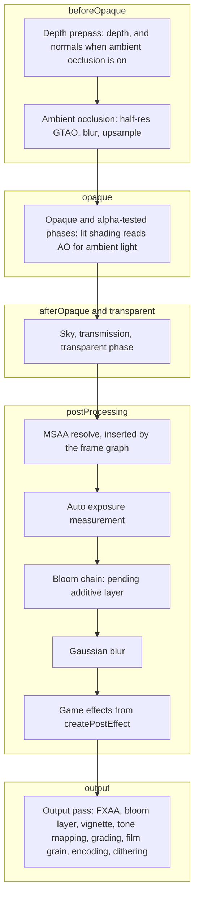
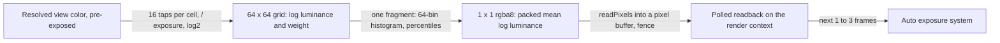

# Design 13: Post-processing and Anti-aliasing

|                                       |                                                                                                                                                                                                                                                                                                                                                                      |
| ------------------------------------- | -------------------------------------------------------------------------------------------------------------------------------------------------------------------------------------------------------------------------------------------------------------------------------------------------------------------------------------------------------------------- |
| **Status**                            | Draft, for review (revised after solution review, §7)                                                                                                                                                                                                                                                                                                                |
| **Kind**                              | Feature and breaking refactor                                                                                                                                                                                                                                                                                                                                        |
| **Engine version at time of writing** | `0.26.1`                                                                                                                                                                                                                                                                                                                                                             |
| **Program**                           | [Forge 3D](./README.md), milestone M3. Phases 1 and 2 ship in M2 with designs 06 and 07, because M2 deletes the systems they port (§3); README §7 and §8 change to list them (§6.19)                                                                                                                                                                                  |
| **Depends on**                        | [06 Render pipeline](./06-render-pipeline.md); [08 Meshes, materials and shaders](./08-meshes-materials-and-shaders.md) (alpha-to-coverage, the prepass normals variant); [10 PBR and environment lighting](./10-pbr-and-environment-lighting.md) (exposure, the ambient light that ambient occlusion darkens)                                                       |
| **Related**                           | [03 ECS foundations](./03-ecs-foundations.md) (declared queries, journals, stages), [05 GPU device layer](./05-gpu-device.md) (MSAA resolves, formats, readback, texture-unit budgets), [07 2D on the render pipeline](./07-2d-on-the-render-pipeline.md) (2D views, output encoding), [09 Lighting and shadows](./09-lighting-and-shadows.md) (the `lighting()` feature), [01 Testing and benchmarks](./01-testing-and-benchmarks.md) (golden, analytic and allocation tests) |

## 0. Targeted modules

| Path                                                                                                                                                                      | Change   | Notes                                                                                                                                                                                                             |
| ------------------------------------------------------------------------------------------------------------------------------------------------------------------------- | -------- | ----------------------------------------------------------------------------------------------------------------------------------------------------------------------------------------------------------------- |
| `src/rendering/post-processing/` (new)                                                                                                                                    | New      | `bloom()` and `gaussianBlur()` features and their passes; the output pass's effect stages; `createPostEffect`; the color lookup table bake and the `.cube` loader                                                  |
| `src/rendering/post-processing/shaders/` (new)                                                                                                                            | New      | Bloom chain, blur, output (resampling, tone mapping operators, FXAA, grading, vignette, film grain, dithering), `forge/post-effect` include                                                                       |
| `src/rendering/post-processing/test-helpers/` (new)                                                                                                                       | New      | TypeScript references: tone mapping operators, the direct grading formula, half-float rounding, the exposure reduction                                                                                            |
| `src/rendering/components/bloom-component.ts`                                                                                                                             | Modified | `passes` replaced by `spread`; `threshold` default `1` and no longer limited to `[0, 1]`                                                                                                                          |
| `src/rendering/components/gaussian-blur-component.ts`                                                                                                                     | Modified | `passes` replaced by `radius`, a fraction of the view's height                                                                                                                                                    |
| `src/rendering/components/tone-mapping-component.ts`                                                                                                                      | Modified | `exposure` removed (design 10 PB7; `ColorGradingEcsComponent.postExposure` scales a whole view, decision PP26); default operator `pbrNeutral`                                                                      |
| `src/rendering/enums/tone-mapping-operator.enum.ts`                                                                                                                       | Modified | `pbrNeutral` and `agx` added; `aces` becomes the Hill fit                                                                                                                                                         |
| `src/rendering/components/camera-component.ts` (modified by design 06)                                                                                                    | Modified | `renderScale` (§6.4.4, decision PP27; a change to design 06 §6.2)                                                                                                                                                  |
| `src/rendering/components/color-grading-component.ts`, `vignette-component.ts`, `film-grain-component.ts`, `post-processing-debug-view-component.ts`, `fxaa-tag.ts` (new) | New      | Camera components and the FXAA tag                                                                                                                                                                                |
| `src/rendering/components/sprite-component.ts`                                                                                                                            | Modified | `SpriteEmissive.color`'s doc comment (line 51) names `BloomEcsComponent` and the `bloom()` feature instead of `createBloomEcsSystem` on an `hdr` render target                                                    |
| `src/rendering/systems/bloom-system.ts`, `gaussian-blur-system.ts`, `tone-map-system.ts` and their tests                                                                  | Removed  | Replaced by passes (Phase 1)                                                                                                                                                                                      |
| `src/rendering/fullscreen-pass.ts`, `ping-pong-target.ts` and their tests                                                                                                 | Removed  | `beginFullscreenReplacePass`, `beginPostProcessPass`, `drawFullscreenQuad`, `PingPongTarget`; replaced by the frame graph's transient textures, `PassContext.drawFullscreen` (design 06) and `createPostEffect`   |
| `src/rendering/render-target.ts`, `render-target.test.ts`                                                                                                                 | Modified | The second color buffer and `swapBuffers` removed, with their test cases (`render-target.test.ts:250-383`): nothing post-processes a camera's destination in place any more                                    |
| `src/rendering/context-loss.test.ts`                                                                                                                                      | Modified | Its cases that draw with `drawFullscreenQuad` (lines 235, 485) and swap a target's buffers (line 398) move onto a frame-graph pass with transient textures                                                         |
| `src/rendering/shaders/post-process/`                                                                                                                                     | Removed  | `bloom-threshold`, `bloom-composite`, `box-downsample`, `cross-fade`, `gaussian-blur`, `tone-mapping` and the passthrough shaders                                                                                 |
| `src/rendering/pipeline/` (created by design 06)                                                                                                                          | Modified | `beginPostProcess` and pending additive layers on the frame graph builder; `addPass` ordering options; output pass variants and render-scale resampling; the missing-feature check; the prepass's location-0 attachment |
| `src/rendering/materials/` (modified by design 08)                                                                                                                        | Modified | Alpha-tested items in multisampled views: alpha-to-coverage in the prepass, an `equal` depth test in the color pass (§6.4.2)                                                                                     |
| `src/lighting/ambient-occlusion/` (new)                                                                                                                                   | New      | `AmbientOcclusionEcsComponent`, the GTAO passes, the `forge/ambient-occlusion` include design 10's shaders read                                                                                                   |
| `src/lighting/auto-exposure/` (new)                                                                                                                                       | New      | `AutoExposureEcsComponent`, the measurement passes (metering grid, partial histograms, reduction), the adaptation system                                                                                          |
| `src/lighting/feature.ts` (created by design 09)                                                                                                                          | Modified | `lighting()` registers ambient occlusion and auto exposure                                                                                                                                                        |
| `e2e/fixtures/scenes/bloom-over-background.ts`, `hdr-tint-bloom.ts`, `post-process-pixel-ratio.ts`, `webgl-context-loss.ts` and their specs                               | Modified | Migrated (§6.15)                                                                                                                                                                                                  |
| `e2e/specs/post-*.spec.ts`, `alpha-coverage.spec.ts`, `render-scale.spec.ts`, `e2e/golden/post-processing/` (new)                                                       | New      | Analytic, behavioral and golden tests (§6.17)                                                                                                                                                                     |
| `bench/scenes/post/` (new)                                                                                                                                                | New      | Full-screen GPU timing per effect; the grading bake's CPU time                                                                                                                                                    |
| `documentation-site/src/pages/demos/space-shooter/`                                                                                                                       | Modified | Features instead of systems (`_create-game.ts:121-168, 305-307`); spread and radius sliders replace the passes sliders (`index.tsx:113-144`, `_BloomControls.tsx`, `_GaussianBlurControls.tsx`); the comment at `_create-player.ts:54` |
| `documentation-site/src/pages/demos/post-processing/` (new)                                                                                                               | New      | A 3D scene with every effect and its controls                                                                                                                                                                     |
| `documentation-site/docs/docs/rendering/`                                                                                                                                 | Modified | `bloom.md`, `gaussian-blur.md`, `hdr-rendering.md` rewritten; post-processing sections leave `multipass-rendering.md`; new `post-processing.md`, `anti-aliasing.md`, `color-grading.md`, `custom-post-effects.md` |
| `documentation-site/docs/docs/lighting/` (created by design 09)                                                                                                           | Modified | New `ambient-occlusion.md`; `light-units-and-exposure.md` gains auto exposure                                                                                                                                     |
| `AGENTS.md`                                                                                                                                                               | Modified | Screen-space effect sizes are fractions of the view's height; the bloom file named in "Alpha Blending"; `drawFullscreenQuad` in "GPU Resources and Context Loss" becomes `PassContext.drawFullscreen`               |

---

## 1. Summary

Forge has three post-processing effects today: bloom, a Gaussian blur and
tone mapping. Each is a system that runs on its camera's render target
after the render system. Each keeps its own scratch targets in a `WeakMap`
keyed by render target and a `processedTargetsThisFrame` set in its closure
(`src/rendering/systems/bloom-system.ts`, `gaussian-blur-system.ts`,
`tone-map-system.ts`), and processes the target in place through the
target's second color buffer (`beginPostProcessPass` in
`src/rendering/fullscreen-pass.ts`). The order in which a game registers the
systems is the order the effects run in, and the guides spend a caution box
on it.

Design 06 replaces that model: effects are camera components, passes read
them per view, the frame graph provides intermediate textures, and an
output pass writes every camera's destination with sRGB encoding. This
design builds the post-processing and anti-aliasing a 3D engine needs on
that model:

- **Anti-aliasing**: multisampling per camera (design 06's `msaaSamples`)
  with resolves placed by the frame graph, alpha-to-coverage for
  alpha-tested materials in multisampled views, and FXAA in the output
  pass. No SMAA, and no temporal anti-aliasing (there are no motion
  vectors).
- **Ambient occlusion**: GTAO from the depth prepass's depth and normals at
  half resolution, denoised and upsampled with depth-aware filters, and
  read by design 10's lit shaders for ambient light only.
- **Bloom**, rebuilt as a downsample and upsample chain whose shape is
  relative to the view, with a soft threshold and firefly suppression.
- **Gaussian blur**, ported, with a radius instead of a pass count.
- **Tone mapping** with four operators (Reinhard, ACES, Khronos PBR
  Neutral, AgX), on exposure from design 10, and **auto exposure** from a
  luminance histogram, adapting over time.
- **Color grading** through a 3D lookup table baked on the CPU from simple
  controls (white balance, contrast, saturation, lift, gamma, gain) or
  loaded from a `.cube` file, plus **vignette**, **film grain** and
  **dithering** before 8-bit output.
- **Custom effects** through `createPostEffect`, a one-pass full-screen
  effect at the `postProcessing` insertion point that reads the view's
  color and depth.

Tone mapping, grading, vignette, grain, dithering, FXAA and, when nothing
follows it, the bloom composite all run inside the output pass, so a
typical 3D camera does one full-screen pass after its last effect.

---

## 2. Scope

### In scope

- Moving today's three effects onto the frame graph with identical output
  (Phase 1), then reworking bloom and blur (Phase 3).
- The output pass's color path: tone mapping operators, premultiplied
  alpha, sRGB encoding into each destination, dithering.
- MSAA as it meets post-processing (resolves, the HDR resolve limitation),
  alpha-to-coverage, FXAA.
- Screen-space ambient occlusion and its prepass normals.
- Auto exposure.
- Color grading, authored lookup tables, vignette, film grain.
- `createPostEffect` for game effects.
- Which effects need an HDR view, what each costs, and the float-buffer
  requirement.
- Debug views, a demo, guides, and the migration of every demo, e2e scene
  and guide that uses today's effects.

### Out of scope

- **Temporal anti-aliasing, motion blur, motion vectors, temporal
  upscaling.** Design 06 excludes motion vectors from this program.
  Without them, temporal accumulation ghosts.
- **SMAA.** Decision PP12.
- **Depth of field, chromatic aberration, lens flares, lens dirt.** Depth
  of field needs gather or scatter bokeh passes in near and far layers, a
  design of its own; design 10 already keeps the physical camera to
  exposure only. Chromatic aberration is the custom-effect guide's
  example (§6.10). Decision PP16.
- **HDR display output.** The canvas is an 8-bit SDR surface in WebGL2.
- **Grading in HDR** (a log-encoded lookup table before tone mapping, as
  Unity's HDR grading mode does). Forge outputs SDR only (decision PP14).
- **Effect volumes** (blending settings by camera position, as Unity's
  volumes and Godot's world environments do). Settings are components a
  game writes; blending two values is one line of game code.
- **Backdrop blur for UI** (a panel that blurs what's behind it). A UI
  feature that would read the view's color under a rectangle; not
  requested.
- **Multi-bounce and bent-normal ambient occlusion**, and temporal
  accumulation of ambient occlusion.
- **2D lighting effects** (design 07 keeps sprites display-referred).

---

## 3. Phases

Phases 1 and 2 port and finish what 2D games already use; they ship in M2
alongside designs 06 and 07, because design 06 Phase 2 makes camera render
targets destinations and design 07 Phase 2 adds sRGB output, and today's
effects can't survive either. The rest is M3.

### Phase 1: Today's effects on the frame graph (M2, with design 06 Phase 2 and design 07 Phase 1)

| #   | Task                            | Description                                                                                                                                                          | Size |
| --- | ------------------------------- | -------------------------------------------------------------------------------------------------------------------------------------------------------------------- | ---- |
| 1.1 | Builder support                 | §6.3: `graph.beginPostProcess(view)` and pending additive layers on design 06's frame graph builder                                                                  | M    |
| 1.2 | `bloom()`, `gaussianBlur()`     | Today's algorithms and fields as passes on transient textures (§6.15.1); no `WeakMap`s, no per-frame sets, no `new Float32Array` per frame                           | M    |
| 1.3 | Tone mapping in the output pass | Today's operators and `exposure`, as an output pass variant (§6.5)                                                                                                   | S    |
| 1.4 | Feature check                   | A camera with an effect component whose feature isn't in the pipeline throws when its view is set up, naming the feature (§6.2.2)                                    | S    |
| 1.5 | `createPostEffect`              | §6.10, with the multipass guide's custom effect rewritten on it                                                                                                      | M    |
| 1.6 | Removals                        | The three systems, `fullscreen-pass.ts`, `PingPongTarget`, `RenderTarget.swapBuffers` and its second color buffer, the `post-process` shaders                        | S    |
| 1.7 | Migration                       | §6.15: the space-shooter demo, four e2e scenes, `bloom.md`, `gaussian-blur.md`, `hdr-rendering.md`; new `post-processing.md` and `custom-post-effects.md`; changelog | M    |
| 1.8 | Tests                           | Pass activation, the feature check, color versioning and layer flushing (unit); an allocation spec for a two-camera bloom-and-blur scene                             | S    |

**Definition of done:** `bloom-over-background`, `hdr-tint-bloom`,
`post-process-pixel-ratio` and `webgl-context-loss` pass with unchanged
assertions; the 2D bloom, blur and tone-mapping goldens (design 01 Phase 3)
are unchanged; the allocation allow-list has no entry from post-processing;
nothing in `src` keeps post-processing state outside components and the
render context.

### Phase 2: Output color (M2, with design 07 Phase 2)

| #   | Task                      | Description                                                                                                         | Size |
| --- | ------------------------- | ------------------------------------------------------------------------------------------------------------------- | ---- |
| 2.1 | Premultiplied output      | §6.5.3: coverage and glow separated before sRGB encoding, so bloom over a transparent camera still only adds light  | S    |
| 2.2 | Dithering                 | §6.5.5, for every 8-bit destination                                                                                 | S    |
| 2.3 | Operators                 | §6.5.4: `aces` becomes the Hill fit; `pbrNeutral` and `agx` added; `pbrNeutral` the default                         | M    |
| 2.4 | Reference curves          | `src/rendering/post-processing/test-helpers/reference-tone-mapping.ts`, the TypeScript oracle for the analytic spec | S    |
| 2.5 | Analytic and golden tests | `post-tone-mapping.spec.ts` (§6.17.2); goldens regenerated in the same reviewed change as design 07 Phase 2's       | M    |
| 2.6 | Guide and changelog       | `hdr-rendering.md`: operators with their curves, which to choose; `#### Added`, `#### Changed`                      | S    |

**Definition of done:** every operator's output matches its reference
within 2/255 on CI's SwiftShader and the reference devices; a dark ramp
golden shows no 8-bit bands; `bloom-over-background` passes with sRGB
output.

### Phase 3: Bloom and blur rework (M3)

| #   | Task                | Description                                                                                                                    | Size |
| --- | ------------------- | ------------------------------------------------------------------------------------------------------------------------------ | ---- |
| 3.1 | Bloom chain         | §6.6: thresholded, Karis-averaged first downsample; 13-tap downsamples to a fixed level 0; tent upsamples weighted by `spread` | M    |
| 3.2 | Bloom component     | `passes` → `spread`; `threshold` default `1`; composite fused into the output pass when nothing follows it                     | S    |
| 3.3 | Blur                | §6.7: `radius`, a downsampled separable Gaussian, tent upsampling, `intensity` fused into the last upsample                    | M    |
| 3.4 | View-relative sizes | `AGENTS.md`'s convention (decision PP9); `post-process-view-size.spec.ts`                                                      | S    |
| 3.5 | Analytic tests      | Bloom energy and blur edge profile against closed forms, on a float destination (§6.17.2)                                      | M    |
| 3.6 | Migration           | Space-shooter demo and its sliders, `post-process-pixel-ratio` thresholds, `bloom.md`, `gaussian-blur.md`, goldens, changelog  | M    |

**Definition of done:** bloom and blur look the same at device pixel
ratios 1 and 2 and at canvas heights 600 and 1200 CSS pixels (the two
specs); the energy and profile tests pass; at 1080p the integrated-GPU
reference meets the §6.16 budgets for both.

### Phase 4: Color grading, vignette and film grain (M3)

| #   | Task                    | Description                                                                                                              | Size |
| --- | ----------------------- | ------------------------------------------------------------------------------------------------------------------------ | ---- |
| 4.1 | Lookup table bake       | §6.8.2: controls → 32³ `rgb10a2unorm` table, baked when the camera's settings differ from the cached bake                | M    |
| 4.2 | Authored tables         | §6.8.3: `.cube` files and strip images, composed into the bake                                                           | M    |
| 4.3 | Output stage            | The table lookup in the output pass for each destination kind                                                            | S    |
| 4.4 | Vignette and film grain | §6.9                                                                                                                     | S    |
| 4.5 | Tests                   | Bake unit tests against a reference implementation; goldens per control; allocation spec with grading animated per frame | M    |
| 4.6 | Guide and changelog     | `color-grading.md`; `#### Added`                                                                                         | S    |

**Definition of done:** neutral settings bake an identity table (within one
10-bit step); animating every control each frame allocates nothing and
costs ≤ 0.3 ms of CPU per change on the desktop reference.

### Phase 5: Exposure (M3, with design 10 Phase 1)

| #   | Task                          | Description                                                                                          | Size |
| --- | ----------------------------- | ---------------------------------------------------------------------------------------------------- | ---- |
| 5.1 | Tone mapping without exposure | `ToneMappingEcsComponent.exposure` removed in the same release as design 10's `ExposureEcsComponent` | S    |
| 5.2 | Measurement                   | §6.12.2: metering grid, histogram and percentile reduction, packed result, polled readback           | M    |
| 5.3 | Adaptation                    | §6.12.3: the auto exposure system and component                                                      | M    |
| 5.4 | View setup                    | Design 10's view setup reads `AutoExposureEcsComponent.ev100` when present                           | S    |
| 5.5 | Tests                         | Adaptation and percentile math (unit); convergence on a known luminance (analytic); allocation spec  | M    |
| 5.6 | Guide and changelog           | The auto exposure section of `light-units-and-exposure.md`; `#### Added`, `#### Removed`             | S    |

**Definition of done:** a view of a uniform surface of known luminance
converges to the metered value within 0.1 EV; a step change adapts at the
configured rates; the measurement costs ≤ 0.05 ms of GPU time and never
blocks on a readback.

### Phase 6: Anti-aliasing (M3, after design 08 Phase 2)

| #   | Task                | Description                                                                                                                      | Size |
| --- | ------------------- | -------------------------------------------------------------------------------------------------------------------------------- | ---- |
| 6.1 | Resolves            | §6.4.1: a resolve before every read that follows a write; sample counts clamped per format; MSAA cost measured on the references | S    |
| 6.2 | Coverage spike      | Whether alpha-to-coverage works in a depth-only pass on ANGLE's D3D11, Metal and OpenGL backends (§6.4.2)                        | S    |
| 6.3 | Alpha-to-coverage   | Sharpened alpha in the color and depth variants of alpha-tested materials in multisampled views                                  | M    |
| 6.4 | FXAA                | §6.4.3: in the output pass, on exposed color, with tone-mapped weights; `fxaaTag`                                                | M    |
| 6.5 | Tests               | Goldens: MSAA 1 and 4, alpha-tested foliage with and without coverage, FXAA on thin lines; the no-holes spec                     | M    |
| 6.6 | Guide and changelog | `anti-aliasing.md`; `#### Added`                                                                                                 | S    |

**Definition of done:** alpha-tested foliage in a multisampled view has
anti-aliased edges and no holes where the prepass and color pass disagree;
FXAA meets its budget.

### Phase 7: Ambient occlusion (M3, with design 10 Phase 2)

| #   | Task                 | Description                                                                                                   | Size |
| --- | -------------------- | ------------------------------------------------------------------------------------------------------------- | ---- |
| 7.1 | Prepass normals      | §6.11.2: the `depthNormals` pass variant (design 08), view-space normals in `rgba8unorm`, resolved under MSAA | M    |
| 7.2 | GTAO                 | §6.11.3: half-resolution linear depth, the horizon search                                                     | L    |
| 7.3 | Denoise and upsample | §6.11.4: bilateral blur, joint bilateral upsample to full resolution                                          | M    |
| 7.4 | Binding              | §6.11.5: the view-group texture, `forge/ambient-occlusion` for design 10's shaders                            | S    |
| 7.5 | Tests and budgets    | Analytic open-plane and corner tests; goldens per quality level; budgets on the references                    | M    |
| 7.6 | Guide and changelog  | `lighting/ambient-occlusion.md`; `#### Added`                                                                 | S    |

**Definition of done:** an unoccluded plane reads 1 within 2%; contact
shadows appear under objects on a plane; `medium` meets its budget at 1080p
on the integrated-GPU reference.

### Phase 8: Debug views, demo and measured budgets (M3)

| #   | Task           | Description                                                                                        | Size |
| --- | -------------- | -------------------------------------------------------------------------------------------------- | ---- |
| 8.1 | Debug views    | §6.14: bloom, ambient occlusion and false-color luminance                                          | S    |
| 8.2 | Demo           | `post-processing`: a lit scene with every effect, its controls and the debug views                 | M    |
| 8.3 | Benchmarks     | `bench/scenes/post/` on the reference devices; §6.16's starting budgets replaced with measurements | M    |
| 8.4 | Overview guide | `post-processing.md` finished: every effect, order, cost table, choosing settings for mobile       | S    |

**Definition of done:** the demo is in the docs site's rendering category;
the M3 benchmark report lists per-effect GPU times on every reference
device.

---

## 4. Decision log

| #    | Decision                                       | Options                                                                                                                                                                                                                                                                           | Chosen | Rationale, trade-offs, assumptions                                                                                                                                                                                                                                                                                                                                                                                                                                                                                               |
| ---- | ---------------------------------------------- | --------------------------------------------------------------------------------------------------------------------------------------------------------------------------------------------------------------------------------------------------------------------------------- | ------ | -------------------------------------------------------------------------------------------------------------------------------------------------------------------------------------------------------------------------------------------------------------------------------------------------------------------------------------------------------------------------------------------------------------------------------------------------------------------------------------------------------------------------------- |
| PP1  | Where effects keep their resources             | (a) Passes that declare transient textures in the frame graph; settings in camera components; (b) systems with private scratch targets, as today                                                                                                                                  | (a)    | Design 06 R1 and R12. Today's `WeakMap`s are GPU caches kept in system closures, and `processedTargetsThisFrame` is state in a closure (design 03 §6.5's audit). The frame graph pools the textures, sizes them to the view and frees them; each view's settings are read from its camera each frame. Unity's render graph and Bevy's view targets do the same.                                                                                                                                                                  |
| PP2  | How effects reach a pipeline                   | (a) Effects with their own passes come from features (`bloom()`, `gaussianBlur()`; ambient occlusion and auto exposure from `lighting()`); output-pass effects are always there; a missing feature throws; (b) every effect built into every pipeline; (c) features with no check | (a)    | (b) puts bloom, blur and ambient occlusion code in every 2D bundle, against README goal "3D features cost a 2D game nothing" and its bundle-size check. (c) lets a camera with a `BloomEcsComponent` silently do nothing. Output-pass effects are a few hundred lines of GLSL compiled only per used variant. Ambient occlusion and auto exposure only affect lit shading, so they travel with `lighting()`.                                                                                                                     |
| PP3  | What runs in the output pass                   | (a) Tone mapping, grading, vignette, grain, dithering, FXAA and a trailing bloom composite, fused; (b) one pass per effect                                                                                                                                                        | (a)    | Every full-screen pass at 1080p reads and writes about 33 MB on an `rgba16float` view; fusing saves that bandwidth per effect, which dominates on integrated and mobile GPUs. Unity's uber post pass, Godot's tone mapping shader and Bevy's tone mapping node all fuse these. Effects that need neighbors from a previous effect (bloom, blur, custom effects) stay separate passes.                                                                                                                                            |
| PP4  | Whether a lit camera is tone mapped by default | (a) Only cameras with a `ToneMappingEcsComponent`; others clamp at output; (b) every camera in a pipeline with `lighting()`; (c) decided from what the view drew                                                                                                                  | (a)    | Design 06 R12: a camera's effects are its components. Tone mapping changes display-referred content (sprites, unlit materials, UI, design 10 PB10), so whether it applies must be visible on the camera. (b) tone maps UI canvas cameras in lit pipelines; (c) flips the look when the first lit object enters view. Godot, Unity's URP and Three.js also start without tone mapping; Bevy adds tone mapping to its 3D camera bundle, a camera type Forge doesn't have. Trade-off: a 3D quick start has one more line.           |
| PP5  | Tone mapping operators and default             | (a) Reinhard, ACES, Khronos PBR Neutral, AgX; default PBR Neutral; (b) keep Reinhard and ACES, default ACES; (c) add Tony McMapface (Bevy's default)                                                                                                                              | (a)    | glTF is Forge's only 3D format, and the Khronos Sample Viewer, which glTF assets are checked against, defaults to PBR Neutral: base colors up to 0.76 pass through less a 0.04 offset, with no hue shift, so models and 2D colors look as authored. AgX is Blender's default and handles saturated highlights by desaturating to white. All four match Three.js's implementations, so design 01's comparison scenes use identical curves. Tony McMapface needs a 3D lookup texture asset; AgX covers the same role analytically. |
| PP6  | Which ACES fit                                 | (a) Stephen Hill's RRT and ODT fit with the sRGB-to-AP1 matrices and a 1/0.6 input scale; (b) Narkowicz's per-channel fit, as today                                                                                                                                               | (a)    | The Hill fit is what Three.js, Bevy (`AcesFitted`) and Godot (by way of MJP's BakingLab) call ACES; its matrices desaturate bright colors as ACES does, where the per-channel fit pushes them to the primaries. The 1/0.6 scale is Three.js's, for SDR viewing, and the Khronos Sample Renderer offers the same variant ("Hill, exposure boost"). Mid-gray 0.18 maps to 0.21 instead of today's 0.27; the changelog says so.                                                                                                     |
| PP7  | Bloom algorithm                                | (a) A downsample and upsample chain (Jimenez 2014): 13-tap downsamples, a Karis average and soft threshold in the first, 3 × 3 tent upsamples, additive composite; (b) today's threshold, block average and repeated 9-tap blur                                                   | (a)    | (a) is what Unity, Bevy and Godot use. It reaches a wide glow in a fixed number of small passes, where (b)'s reach grows with pass count and cost. The Karis average stops single bright pixels from flickering as they move. The composite stays additive with alpha untouched, the contract in `AGENTS.md`. A threshold of 0 gives the physically based look (every pixel scatters a little); games keep a threshold to isolate emissive 2D sprites, as the space shooter does.                                                |
| PP8  | Bloom fields                                   | (a) Keep `threshold` and `intensity`; replace `passes` with `spread` (0 to 1); `threshold` defaults to 1; (b) keep `passes`; (c) add a composite mode (energy-conserving or additive)                                                                                             | (a)    | `passes` names an implementation detail that no longer exists. `spread` is continuous, so the demo's slider animates smoothly (Unity's `scatter` does the same). A default threshold of 1 means "light brighter than white glows" in 2D and 3D alike. (c) would be an option that picks between two looks nobody asked to switch between; additive is what the alpha contract needs. No compatibility shim: the changelog maps old values.                                                                                       |
| PP9  | Units of screen-space effect sizes             | (a) Fractions of the view's height; (b) CSS pixels, `AGENTS.md`'s current rule                                                                                                                                                                                                    | (a)    | A 2D view's world scale follows its height (`fixedHeight` scaling) and a perspective view's angles do too, so an effect sized in CSS pixels shrinks relative to the scene when the canvas grows. A fraction of the view's height is independent of the pixel ratio (the reason for today's rule) and of the canvas size. Unity and Bevy size bloom from the target's size. Ambient occlusion's radius is in meters.                                                                                                              |
| PP10 | Gaussian blur parameters                       | (a) `radius` (three standard deviations, as a fraction of view height) and `intensity`; (b) keep `passes`                                                                                                                                                                         | (a)    | Strength in `passes` grows with its square root and cost grows linearly, and both depend on the display. A radius is how CSS `blur()` and engines' blur settings work, and it can be met at any size with a fixed cost by blurring at a lower level.                                                                                                                                                                                                                                                                             |
| PP11 | Premultiplied color in the output pass         | (a) Tone map premultiplied color as light; split it into the part coverage explains and the excess before sRGB encoding; (b) unpremultiply everything                                                                                                                             | (a)    | Bloom adds light to transparent pixels (alpha 0, color above 0), so (b) divides by zero exactly where `bloom-over-background` looks. Tone mapping premultiplied color is exact for opaque pixels, as Bevy and today's Forge do. The split keeps the glow additive after encoding.                                                                                                                                                                                                                                                |
| PP12 | Anti-aliasing techniques                       | (a) MSAA, alpha-to-coverage and FXAA; (b) add SMAA; (c) add TAA                                                                                                                                                                                                                   | (a)    | MSAA handles geometry and FXAA the rest (specular, alpha-tested edges without MSAA, 2D). SMAA 1× is sharper than FXAA but adds three passes and two lookup textures, and its benefit is largest where MSAA is too expensive, on phones whose pixel ratio already hides aliasing. TAA needs motion vectors (README). Revisit SMAA with M3's mobile measurements (open question 4); `createPostEffect` and custom passes can add it without engine changes.                                                                        |
| PP13 | Where FXAA runs                                | (a) Inside the output pass, before tone mapping, on exposed color, with luma from tone-mapped luminance and taps weighted by `1/(1 + luma)`; (b) a separate pass after tone mapping into an 8-bit texture                                                                         | (a)    | Godot runs FXAA this way in its tone mapping shader. (b) costs a full-screen write and read and needs a texture whose alpha can't also hold luma, since alpha carries coverage between cameras. Karis's weights make a blended HDR edge behave like blending after tone mapping, which is what (b) would give.                                                                                                                                                                                                                   |
| PP14 | Color grading space                            | (a) After tone mapping, on display values, through a 32³ table in the sRGB-encoded domain; (b) before tone mapping through a log-encoded table, as Unity's HDR mode                                                                                                               | (a)    | Forge outputs SDR only, so grading the displayed values is what the game sees. Controls behave as in image editors, authored `.cube` files expect display-encoded input, and 2D views without tone mapping grade the same way. A 32-point table is accurate in a perceptual domain.                                                                                                                                                                                                                                              |
| PP15 | Where the grading table is built               | (a) On the CPU when settings change, into `rgb10a2unorm`; (b) on the GPU, one draw per slice; (c) in the shader, per pixel                                                                                                                                                        | (a)    | The task statement's approach. 32,768 entries take about 0.3 ms in TypeScript and 128 KB to upload, only when a value changes. (c) costs ALU per pixel every frame for values that rarely change. Ten bits per channel avoid banding that an 8-bit table would add before the final 8-bit write.                                                                                                                                                                                                                                 |
| PP16 | Which extra effects are in                     | (a) Vignette and film grain in the output pass; chromatic aberration as the custom-effect example; depth of field out; (b) all four in                                                                                                                                            | (a)    | Grain only looks right in display space, after tone mapping, which only the output pass reaches; vignette is a multiply. Chromatic aberration resamples the image, which conflicts with FXAA in the same pass, and works fine as a custom effect before output. Depth of field needs several passes and near and far layers (design 10 already keeps the physical camera to exposure).                                                                                                                                           |
| PP17 | Dithering                                      | (a) Always, for 8-bit destinations, ±0.5 of an 8-bit step, a fixed per-pixel pattern; (b) a camera option; (c) triangular noise of ±1 step                                                                                                                                        | (a)    | Rectangular noise of half a step never changes a value that is exactly representable, so flat 2D colors and pixel art keep their exact pixels while gradients (sky, fog, bloom, vignette) lose their bands. No game needs banding, so it isn't an option. Bevy enables dithering on 3D cameras; the formula is Vlachos's (GDC 2015), as Godot uses. A fixed pattern keeps goldens reproducible.                                                                                                                                  |
| PP18 | Ambient occlusion algorithm                    | (a) GTAO at half resolution with spatial filtering of its noise; (b) hemisphere SSAO (Crytek, Unity URP); (c) HBAO                                                                                                                                                                | (a)    | GTAO (Jimenez et al. 2016) integrates cosine-weighted visibility along horizons and matches ray-traced references closely for the same sample count; Unreal offers it, Bevy's ambient occlusion is a port of Intel's XeGTAO, and Three.js has a GTAO pass. Half resolution keeps it near 1 ms on integrated GPUs. Without temporal accumulation, noise is removed spatially, which costs some contact detail.                                                                                                                    |
| PP19 | Normals for ambient occlusion                  | (a) The prepass writes vertex normals (after the vertex hook) in view space to an `rgba8unorm` attachment when ambient occlusion is on; (b) reconstruct from depth; (c) normal-mapped normals                                                                                     | (a)    | Design 06 already plans prepass normals for this. `n · 0.5 + 0.5` survives an MSAA resolve (the average renormalizes), where an octahedral encoding doesn't. (c) adds texture fetches to every material's prepass; small-scale occlusion is the material's occlusion map's job, combined by design 10's minimum. Reconstruction from depth breaks at every depth edge.                                                                                                                                                           |
| PP20 | Auto exposure metering                         | (a) A histogram with percentile filtering, built by gathering in a fragment shader; (b) a log average through mipmaps; (c) a histogram by scattering points with blending                                                                                                         | (a)    | Unity's HDRP, Unreal and Bevy meter with histograms so a bright sky or a dark corner doesn't swing exposure; (b) can't exclude them. (c) needs float blending and loses counts above 2,048 in half floats. Gathering 4,096 grid cells into 64 bins in one fragment needs neither and costs microseconds.                                                                                                                                                                                                                         |
| PP21 | Auto exposure state and latency                | (a) The adapted EV100 in `AutoExposureEcsComponent`, written by a `render`-stage system from a measurement read back asynchronously one to three frames late; (b) adaptation on the GPU in a 1 × 1 texture                                                                        | (a)    | Design 10 pre-exposes in every lit shader (PB8), so the CPU must know the exposure to put it in the view block. State a game can read belongs in a component (README §4.4). Adaptation takes seconds, so a few frames of latency is invisible; Filament and Unreal's pre-exposure also use the previous frame's value. The readback never blocks.                                                                                                                                                                                |
| PP22 | Alpha-tested materials under MSAA              | (a) Alpha-to-coverage with sharpened alpha in the color and depth passes; discard in shadows and in single-sampled views; (b) discard everywhere                                                                                                                                  | (a)    | Discard gives one coverage bit per pixel, so foliage and fences alias however many samples there are. Sharpening (Golus 2017) makes the coverage edge sit at the cutoff with one pixel of anti-aliasing. The prepass must produce the same coverage or the color pass's depth test leaves holes, so both use it.                                                                                                                                                                                                                 |
| PP23 | Custom effects                                 | (a) `createPostEffect`: one full-screen pass at `postProcessing`, active for cameras that have the game's component, reading color and optionally depth and normals; (b) only design 06's general pass API                                                                        | (a)    | Most game effects are one shader over the screen; the helper makes them a component, a shader and one `addPass`. Multi-pass effects use design 06's pass API, as engine effects do. The helper replaces `beginPostProcessPass` and `PingPongTarget`; the frame graph does the ping-pong.                                                                                                                                                                                                                                         |
| PP24 | Bloom texture format                           | (a) `rg11b10ufloat` where `EXT_color_buffer_float` makes it renderable, `rgba16float` otherwise; (b) always `rgba16float`                                                                                                                                                         | (a)    | Bloom needs no alpha and no negatives; half the bytes halves the chain's bandwidth. Unreal and Unity use the same format for bloom. Six-bit mantissas band slightly in smooth glows; dithering at output hides it.                                                                                                                                                                                                                                                                                                               |
| PP25 | First phase                                    | (a) A faithful port with unchanged output, then reworks; (b) port and rework at once                                                                                                                                                                                              | (a)    | M2's definition of done requires every 2D golden unchanged except design 07's documented color-space change. A port with identical pixels proves the frame graph migration on its own; the reworks then change images in reviewed steps.                                                                                                                                                                                                                                                                                         |

---

## 5. Open questions

In priority order.

1. **Display-referred content under auto exposure.** Design 10 keeps
   unlit materials, sprites and UI unexposed (PB10). Metering divides every
   pixel by the exposure to get scene luminance, so a view dominated by
   unexposed content (an unlit sky dome) meters wrongly and drifts to the
   EV100 limit. Options: (a) document it, and rely on the limits; (b)
   exclude unexposed pixels with a stencil bit written by lit materials,
   which costs a stencil attachment and a test in every lit draw; (c) the
   per-material exposure weight of design 10's open question 1. Proposal:
   (a) now, (c) if design 10 adopts it.
2. **Effects in display space written by games.** `createPostEffect` runs
   before the output pass, on HDR color. A CRT or palette effect on a
   tone-mapped camera wants the displayed values. Options: (a) an output
   hook, a GLSL function the output pass calls after grading, chosen per
   camera by a component; (b) nothing, since 2D views without tone mapping
   are already display values. Proposal: (b) until a game needs it, then
   (a), which fits design 08's hook model.
3. **MSAA on HDR views.** WebGL2 resolves with a box filter, so a very
   bright pixel next to a dark one averages before tone mapping and the
   edge stays aliased (Karis's tone-mapped resolve needs to read samples,
   which WebGL2 can't). Options: (a) accept it, and recommend FXAA for
   scenes with strong highlights; (b) clamp the scene's color at a lower
   value than design 10's 64,000 before the resolve. Proposal: (a); the
   WebGPU backend can resolve in a shader.
4. **SMAA and mobile defaults.** Design 06's open question 1 decides MSAA
   on phones after M3's measurements. If MSAA is off there, FXAA may be too
   soft for text-heavy 3D UI. Proposal: decide SMAA with that measurement.
5. **Metering controls.** Percentiles (40% and 90%) and center weighting
   are fixed (§6.12.2). Unity and Unreal expose them. Proposal: keep them
   fixed until a game shows a case compensation can't handle.
6. **Alpha coverage in mipmaps.** Alpha-tested textures thin out in
   distant mips because averaging lowers alpha. The fix (scaling each mip's
   alpha to preserve coverage at the cutoff, Castaño 2010) belongs where
   mipmaps are made: design 05 for runtime mipmaps, design 11 for KTX2.
   Proposal: a cross-design task once A2C lands.
7. **Bloom defaults.** `intensity: 1` and `spread: 0.7` are starting
   values. Confirm at the M3 golden review together with design 10's open
   question 2.

---

## 6. Design

### 6.1 Overview



Every box after the prepass runs only for views whose camera asks for it.
A 2D camera with no effects runs the output pass alone, as design 07
already requires.

| Effect               | On the camera                                   | Comes from         | Passes                                   | Needs an HDR view |
| -------------------- | ----------------------------------------------- | ------------------ | ---------------------------------------- | ----------------- |
| MSAA                 | `CameraEcsComponent.msaaSamples`                | Design 06          | Resolves                                 | No                |
| Alpha-to-coverage    | Automatic with MSAA                             | Design 08 variants | None                                     | No                |
| FXAA                 | `fxaaTag`                                       | Output pass        | None                                     | No                |
| Ambient occlusion    | `AmbientOcclusionEcsComponent`                  | `lighting()`       | 4 at half resolution, 1 at full          | Yes (lit)         |
| Auto exposure        | `AutoExposureEcsComponent`                      | `lighting()`       | 2 tiny                                   | Yes (lit)         |
| Bloom                | `BloomEcsComponent`                             | `bloom()`          | About 14, at 540 rows and below at 1080p | Yes               |
| Gaussian blur        | `GaussianBlurEcsComponent`                      | `gaussianBlur()`   | 2, plus 2 per halving                    | No                |
| Tone mapping         | `ToneMappingEcsComponent`                       | Output pass        | None                                     | Yes               |
| Color grading        | `ColorGradingEcsComponent`                      | Output pass        | None (a table baked on change)           | No                |
| Vignette, film grain | `VignetteEcsComponent`, `FilmGrainEcsComponent` | Output pass        | None                                     | No                |
| Dithering            | Automatic for 8-bit destinations                | Output pass        | None                                     | No                |
| Game effect          | The game's component                            | `createPostEffect` | 1                                        | No                |

### 6.2 Effects on cameras

#### 6.2.1 Components

Every effect is a component on the camera entity (design 06 R12), with an
`add<Name>Component` factory using `withDefaults`, as today's
`addBloomComponent` does; FXAA, which has no settings, is a tag. The game
is the only writer of every setting; the engine writes only the output
fields of `AutoExposureEcsComponent` (§6.12). Passes read the components
when the view is set up in the `render` stage, so a change made during
`update` shows in the same frame, and removing the component turns the
effect off.

```ts
const pipeline = createRenderPipeline(renderContext, {
  features: [lighting(), bloom()],
});
registerRendering(world, renderContext, pipeline);

const camera = createCamera(world, { projection: { kind: 'perspective' } });

addToneMappingComponent(world, camera); // PBR Neutral
addBloomComponent(world, camera, { threshold: 1.5 });
addAmbientOcclusionComponent(world, camera);
addAutoExposureComponent(world, camera, { compensation: 0.5 });
world.addTag(camera, fxaaTag);
```

A setting that makes an effect do nothing (`intensity: 0`) makes its passes
return `null` from `setup`, so the frame graph drops them and the effect
costs nothing, the way today's systems skip `intensity <= 0`.

#### 6.2.2 Features and the missing-feature check

`bloom()` and `gaussianBlur()` add their passes to a pipeline;
`lighting()` (design 09) adds ambient occlusion and auto exposure. The
output pass's stages are part of every pipeline (decision PP2).

Design 06's camera extraction declares one secondary query per engine
effect component (`[cameraId, bloomId]`, `[cameraId, gaussianBlurId]`,
`[cameraId, ambientOcclusionId]`, `[cameraId, autoExposureId]`). When one
matches a camera and the pipeline lacks the feature, setting up the view
throws:

```text
Camera entity 12 has a BloomEcsComponent, but its render pipeline has no bloom() feature.
Add bloom() to createRenderPipeline's features.
```

The queries import only component keys, which are a few bytes each, so
the check doesn't pull effect code into a 2D bundle.

#### 6.2.3 View formats and the float-buffer requirement

Design 06 §6.4.2 makes a view's color `rgba16float` when the pipeline has
`lighting()` or the camera has an effect that needs HDR. This design fixes
that list: `BloomEcsComponent`, `ToneMappingEcsComponent` and
`AutoExposureEcsComponent`. Blur, grading, vignette, grain, FXAA and game
effects work on `rgba8unorm-srgb` views too, so a 2D camera that only
blurs keeps an 8-bit view.

An HDR view requires `EXT_color_buffer_float` or
`EXT_color_buffer_half_float`; without either, creating it throws (README
P4, design 05 D11). For 2D games this is a change: today a bloomed camera
with an 8-bit render target works on every device. Formats chosen inside
the effects:

| Texture                        | With `EXT_color_buffer_float` | With only `EXT_color_buffer_half_float` | Without either     |
| ------------------------------ | ----------------------------- | --------------------------------------- | ------------------ |
| HDR view color                 | `rgba16float`                 | `rgba16float`                           | HDR views throw    |
| Bloom chain                    | `rg11b10ufloat`               | `rgba16float`                           | Bloom needs HDR    |
| Ambient occlusion linear depth | `r32float`                    | `r16float`                              | Lit views need HDR |
| Prepass normals, AO results    | `rgba8unorm`, `r8unorm`       | Same                                    | Lit views need HDR |
| Metering grid                  | `rg16float`                   | `rg16float`                             | Lit views need HDR |
| Exposure result                | `rgba8unorm` (packed)         | Same                                    | Lit views need HDR |
| Blur chain                     | The view's format             | The view's format                       | The view's format  |
| Grading table                  | `rgb10a2unorm`, 3D            | Same (sampled only)                     | Same               |

### 6.3 Frame graph support

#### 6.3.1 Replacing the view's color

Today a post-processing pass swaps a render target's two color buffers
(`RenderTarget.swapBuffers`). On the frame graph, the view's `color` is a
resource handle that later passes read. This design adds one builder call
to design 06's `FrameGraphBuilder`, modeled on Bevy's
`ViewTarget::post_process_write`:

```ts
interface PostProcessTextures {
  /** The view's color so far, declared as read by the calling pass. Resolved if multisampled. */
  source: FrameGraphTexture;
  /** A new transient texture with the same descriptor, declared as written. */
  destination: FrameGraphTexture;
}

interface FrameGraphBuilder {
  // ...design 06's members
  /** Makes `destination` the view's color for every later pass, after flushing pending layers. */
  beginPostProcess(view: ViewResources): PostProcessTextures;
  /** Adds light to the view's color later: in the output pass, or before the next beginPostProcess. */
  addPendingLayer(
    view: ViewResources,
    texture: FrameGraphTexture,
    intensity: number,
  ): void;
}
```

The pool hands the old color texture to the next pass that needs one of the
same descriptor, so two effects in a row use two textures, the same as
today's pair of buffers.

#### 6.3.2 Pending additive layers

Bloom's result is light to add to the view. Adding it in a pass of its own
costs a full-screen read and write; adding it in the output pass costs one
texture fetch. Which is possible depends on whether another effect reads
the view's color after bloom, which bloom's `setup` can't know, because it
runs first. So bloom doesn't composite: it calls `addPendingLayer`. Then:

- `beginPostProcess` first adds every pending layer in an engine composite
  pass, so a later effect (the blur, a game effect) sees the bloomed color;
- otherwise the output pass adds pending layers as it reads the color.

A camera with bloom and nothing after it gets the composite for free, and
bloom then blur behaves as it does today: the glow is blurred with the rest.

#### 6.3.3 Order of engine passes

Engine passes take fixed places in `postProcessing`, whatever order the
features are listed in:

| Order | Pass                                | Reads                                | Writes                         | Resolution           |
| ----- | ----------------------------------- | ------------------------------------ | ------------------------------ | -------------------- |
| 1     | `autoExposureMeasure`               | Color                                | Metering grid, exposure result | 64 × 64, 1 × 1       |
| 2     | `bloom`                             | Color                                | Bloom chain; a pending layer   | 512 rows and down    |
| 3     | `gaussianBlur`                      | Color (via `beginPostProcess`)       | New color                      | Reduced, then full   |
| 4     | Game passes                         | Their choice                         | Their choice                   | Their choice         |
| –     | `output` (insertion point `output`) | Color, pending layers, grading table | The camera's destination       | Destination viewport |

Metering runs first so the exposure measures the scene, not its glow.
Bloom before blur keeps today's documented order. Game passes added with
`pipeline.addPass('postProcessing', pass)` run after the engine's, in the
order added; `addPass` gains `{ before, after }`, naming another pass,
for an effect that must run earlier (a heat haze that should bloom).

### 6.4 Anti-aliasing

#### 6.4.1 MSAA and resolves

A camera's `msaaSamples` (design 06 §6.2, `1` or `4`, default `4`) makes its
view's color and depth multisampled renderbuffers (design 05 D6), clamped to
what the format supports. Post-processing changes two things:

- **Resolves happen before every read that follows a write**, not only
  before the first read (a cross-doc change to design 06 §6.5): design 10's
  transmission copy resolves the color mid-frame, the transparent phase
  then draws into the multisampled color again, and post-processing
  resolves it a second time.
- **Depth and normals are resolved for ambient occlusion** with
  `blitFramebuffer`. WebGL2 resolves multisampled depth to an
  implementation-chosen value between the pixel's samples, which is good
  enough for occlusion; normals resolve by averaging, which is why they're
  stored as `n · 0.5 + 0.5` (decision PP19).

Resolving is a box filter. On an HDR view a highlight of 50 next to a
background of 0.1 averages to 25 before tone mapping and the edge looks
aliased (open question 3). FXAA after it softens that edge.

A 4× `rgba16float` color plus 4× depth is about 100 MB at 1080p. Phones
resolve on chip and discard the samples (`storeOp: 'discard'`, design 05);
desktop integrated GPUs pay the memory. Pixel-art cameras set
`msaaSamples: 1`.

#### 6.4.2 Alpha-to-coverage

In a multisampled view, a material with `blendMode: 'mask'` (design 08
§6.4) uses the variant with `multisample.alphaToCoverage: true` (design 05
§6.5) in its color and depth passes. The variant key already contains the
target's sample count (design 08 §6.5). Its fragment code replaces the
discard with a sharpened alpha (Golus 2017):

```glsl
float forge_coverageAlpha(float alpha, float cutoff) {
  return clamp((alpha - cutoff) / max(fwidth(alpha), 1e-4) + 0.5, 0.0, 1.0);
}
```

The coverage edge sits exactly at the cutoff and is one pixel wide, so the
silhouette matches the single-sampled discard but with four coverage
levels. Shadow passes, which are never multisampled, and single-sampled
views keep the discard.

The prepass and the color pass compute the same alpha at the same pixel,
so they produce the same coverage, and the color pass's depth test finds
exactly the samples the prepass wrote. Alpha-to-coverage takes the alpha of
the fragment's location-0 output; whether drivers keep that output in a
pass with no color attachment is unverified on ANGLE's backends. Phase 6
starts with a spike: if it works everywhere, the depth-only prepass stays;
otherwise the prepass of a multisampled view with alpha-tested items binds
its normals attachment (§6.11.2) at location 0 even when ambient occlusion
is off, writes the sharpened alpha into its alpha channel, and discards the
attachment at the end of the pass. A no-holes spec checks the result on
every backend CI and the reference devices offer.

#### 6.4.3 FXAA

`fxaaTag` on a camera turns on FXAA 3.11 (Lottes), quality preset 12, the
default of its reference implementation (edge threshold 0.166, minimum
0.0833, subpixel 0.75), inside the output pass:

- It samples the view's resolved color with bilinear filtering, before
  tone mapping, as Godot does (decision PP13).
- Luma for edge detection is `sqrt(l / (1 + l))` of each tap's luminance,
  so thresholds tuned for gamma-encoded LDR images behave the same on HDR
  values.
- The final blend averages its taps with weights `1 / (1 + l)` (Karis
  2014), so a bright tap doesn't dominate the edge, approximating a blend
  after tone mapping.
- It blends premultiplied RGBA, so the edges of a transparent-cleared
  camera are smoothed in coverage too.

A camera may have both MSAA and FXAA: MSAA for geometry, FXAA for specular
aliasing and alpha-tested edges. FXAA is off by default and is the
anti-aliasing for cameras with `msaaSamples: 1`.

### 6.5 The output pass

#### 6.5.1 Order of operations

Design 06 §6.4.3 defines the output pass: it reads a view's final color and
writes the camera's destination inside its viewport, encoding sRGB. This
design adds its effect stages, in this order:

```glsl
void main() {
  vec4 color = forge_readViewColor();                    // resolved, premultiplied, exposed
#ifdef FORGE_FXAA
  color = forge_fxaa(color);                              // §6.4.3
#endif
  color.rgb += forge_pendingLayers();                     // bloom when nothing followed it (§6.3.2)
  color.rgb *= forge_vignette();                          // §6.9, 1 when off
#ifdef FORGE_TONE_MAPPING
  color.rgb = forge_toneMap(color.rgb);                   // §6.5.4, one operator per variant
#endif
  forge_writeDestination(color);                          // §6.5.3: split, grade, grain, encode, dither
}
```

Variants are keyed by the tone mapping operator (or none), FXAA, grading,
the number of pending layers (0 or 1) and the destination kind. Vignette,
grain and dithering are uniform-driven (design 08 MS3: cheap toggles are
uniforms), so they don't multiply variants. A pipeline compiles only the
combinations its cameras use.

#### 6.5.2 Destinations

| Destination                             | Encoding                                  | Dithering             | Clamp                                                       |
| --------------------------------------- | ----------------------------------------- | --------------------- | ----------------------------------------------------------- |
| The canvas (`rgba8unorm`, no sRGB mode) | In the shader                             | Yes                   | `[0, 1]`                                                    |
| A `rgba8unorm-srgb` render target       | By the hardware; the shader writes linear | Yes, in encoded space | `[0, 1]`                                                    |
| A `rgba8unorm` render target            | In the shader                             | Yes                   | `[0, 1]`                                                    |
| A `rgba16float` render target           | None (linear)                             | No                    | Not clamped; tone mapping, when present, already compresses |

A float destination without tone mapping keeps HDR values, so a camera
that renders a mirror or a portal into a texture leaves tone mapping to
the camera that shows it.

#### 6.5.3 Premultiplied color

The view holds premultiplied color, and bloom adds light where alpha is 0
(`AGENTS.md`). sRGB encoding isn't linear, so premultiplied color can't be
encoded directly, and unpremultiplying divides by zero where the glow
shows. The output pass therefore splits each pixel (decision PP11):

```glsl
void forge_writeDestination(vec4 color) {               // color.rgb is light, tone mapped if the camera tone maps
  vec3 covered = min(color.rgb, vec3(color.a));         // what a straight color at this coverage can explain
  vec3 glow = color.rgb - covered;                      // light beyond coverage: bloom over transparent pixels
  vec3 straight = color.a > 0.0 ? covered / color.a : vec3(0.0);
  vec3 display = forge_grade(forge_encodeSrgb(clamp(straight, 0.0, 1.0)));  // §6.8, identity when off
  display = forge_filmGrain(display);                   // §6.9
  vec3 written = display * color.a + forge_encodeSrgb(clamp(glow, 0.0, 1.0));
  forge_out = vec4(forge_dither(written), color.a);    // §6.5.5
}
```

For an opaque camera (alpha 1 everywhere, as every camera with a clear
color has), `glow` is zero after tone mapping and the pass is the usual
encode. For a camera cleared to transparent over another camera, a
translucent sprite keeps its coverage and the glow around it still only
adds light, so `bloom-over-background` keeps passing after design 07 makes
the output sRGB. The glow isn't graded: grading a zero glow would add
`lift` to every transparent pixel. Tone mapping premultiplied color as
light is exact for opaque pixels and is what Bevy and today's Forge do
(`tone-mapping.frag.glsl` maps `hdr.rgb` and keeps `hdr.a`).

For destinations the hardware encodes, the shader decodes `written` back
to linear. For float destinations it skips the encoding and the glow's
clamp, so `straight · a + glow` gives back the view's light unchanged when
nothing is graded.

#### 6.5.4 Tone mapping operators

```ts
export const TONE_MAPPING_OPERATOR = {
  /** `c / (1 + c)` per channel. Desaturates bright colors early. */
  reinhard: 'reinhard',
  /** Hill's fit of the ACES reference rendering and output transforms, as Three.js, Bevy and Godot use. High contrast, filmic. */
  aces: 'aces',
  /** Khronos PBR Neutral: base colors pass through, highlights compress towards white with no hue shift. The default. */
  pbrNeutral: 'pbrNeutral',
  /** AgX, Blender's default: a log encoding and sigmoid in a wider gamut; bright saturated light goes to white. */
  agx: 'agx',
} as const;

interface ToneMappingEcsComponent {
  /** The curve from the view's exposed linear color to display values in [0, 1]. Default pbrNeutral. */
  operator: TONE_MAPPING_OPERATOR_KEYS;
}
```

Exposure isn't part of tone mapping any more: lit shading is pre-exposed
(design 10 PB8) and display-referred content is written as authored
(PB10). `ToneMappingEcsComponent.exposure` is removed in Phase 5, in the
release that adds design 10's `ExposureEcsComponent`, so there is never
a second exposure.

The input is linear Rec. 709 (Forge's working space, README §4.2); the
output is linear display values in `[0, 1]`, before encoding.

- **`reinhard`**: unchanged from today.
- **`aces`**: `M_out · fit(M_in · c / 0.6)`, clamped, with `M_in` the
  combined sRGB → XYZ → D65-to-D60 → AP1 → reference-rendering saturation
  matrix, `M_out` the output saturation → XYZ → D60-to-D65 → sRGB matrix
  (Hill's values, as in Three.js), and

  ```text
  fit(v) = (v (v + 0.0245786) − 0.000090537) / (v (0.983729 v + 0.4329510) + 0.238081)
  ```

  0.18 maps to 0.21; today's fit maps it to 0.27.

- **`pbrNeutral`**: the Khronos reference (`F90 = 0.04`, `Ks = 0.76`,
  `Kd = 0.15`): subtract the offset `x − 6.25x²` for
  `x = min(r, g, b) < 0.08`, else `0.04`; colors whose peak is below `Ks`
  pass through; above
  it the peak compresses to `1 − (1 − Ks)² / (peak + 1 − 2Ks)` and the
  color mixes towards white by `1 − 1 / (Kd (peak − newPeak) + 1)`. 0.18
  maps to 0.14 and 1.0 to 0.87.
- **`agx`**: Blender's AgX base as Filament and Three.js implement it:
  Rec. 709 → Rec. 2020, the inset matrix, `log2` encoding between −12.47393
  and 4.026069, Wrensch's polynomial fit of the sigmoid, the outset matrix,
  a 2.2 power, back to Rec. 709, clamped.

Each operator also exists as a TypeScript function in
`test-helpers/reference-tone-mapping.ts`, the oracle for the analytic spec
(§6.17.2), and the guide plots all four.

#### 6.5.5 Dithering

Every 8-bit destination gets, after encoding and before the hardware
quantizes:

```glsl
vec3 forge_dither(vec3 encoded) {
  vec3 noise = vec3(dot(vec2(171.0, 231.0), gl_FragCoord.xy));
  noise = fract(noise / vec3(103.0, 71.0, 97.0)) - 0.5;   // Vlachos 2015, per channel
  return encoded + noise * (0.99 / 255.0);
}
```

Noise of less than half a step can't move a value that is already exactly
on a step, so a flat color written as authored keeps its exact pixel value
(decision PP17); a value between steps becomes a mix of its two neighbors,
which removes visible bands in gradients. For `rgba8unorm-srgb`
destinations the noise is applied in encoded space and decoded. The
pattern is fixed per pixel, not animated, so captures are reproducible.

### 6.6 Bloom

#### 6.6.1 Component

```ts
interface BloomEcsComponent {
  /** Luminance, in the view's exposed display units, above which light blooms; a soft knee of half the threshold below it. 0 blooms everything. Default 1. */
  threshold: number;
  /** How much of the bloomed light is added. 0 turns bloom off. Default 1. */
  intensity: number;
  /** 0 to 1: how much of each level's light comes from the wider level below it. Higher spreads the glow further. Default 0.7. */
  spread: number;
}
```

`threshold` keeps today's meaning (relative luminance, Rec. 709 weights)
but is no longer limited to `[0, 1]`, and its default moves from 0.8 to 1,
so by default only light brighter than white glows. `passes` is removed
(decision PP8).

#### 6.6.2 The chain


- **Level 0 is 512 texels tall**, or the view's height in CSS pixels when
  that's smaller, with the view's aspect. The view's color is halved with
  13-tap filters while it is more than twice level 0's height, then
  resampled to level 0 (a ratio between 1 and 2, which the 13-tap
  footprint covers without skipping texels): a 1080-row view is halved to
  540 rows, then resampled to 512. Level 0's size depends only on the
  view's height (in CSS pixels below 512 rows), so the glow has the same
  shape relative to the view at every pixel ratio, and at every view size
  from 512 CSS pixels up (decision PP9). Bevy limits its first level's size
  the same way.
- **The first filter** applies the threshold with a quadratic soft knee
  (`knee = threshold / 2`), and the Karis average: each of the 13-tap
  filter's five 2 × 2 groups is weighted by `1 / (1 + luminance)`, so one
  very bright pixel can't light up a whole block and flicker as it moves.
- **Further downsampling** continues with the 13-tap filter (Jimenez 2014) to the
  first level under 16 texels tall (seven levels from 512).
- **Upsamples** run from the smallest level back up: each level becomes
  `mix(down[k], tent(up[k + 1]), spread)`, with a 3 × 3 tent filter. Each
  level's weight in the result is `(1 − spread) · spread^k` (the smallest
  level takes the remainder), which sums to one, so the glow carries
  exactly the thresholded light times `intensity`.
- **Outside the view is black**: taps outside the texture return zero,
  as today (`gaussian-blur.frag.glsl`'s bounded sampling), since light
  outside the frame is unknown.
- The result is added as a pending layer (§6.3.2) with `intensity`: by the
  output pass when nothing follows bloom, else by the composite before the
  next effect. Alpha is never changed.

The chain uses `rg11b10ufloat` (decision PP24), about 3 MB of transient
textures at 1080p for both directions together.

### 6.7 Gaussian blur

```ts
interface GaussianBlurEcsComponent {
  /** How far the blur reaches: three standard deviations, as a fraction of the view's height. Default 0.02. */
  radius: number;
  /** 0 to 1: how much of the blurred view shows over the sharp one. Default 1. */
  intensity: number;
}
```

For a standard deviation `σ = radius · height / 3` in device pixels:

1. Halve the view's color with the 13-tap filter `k` times, the smallest
   `k` that leaves `σ / 2^k` at or below 2 texels.
2. Blur that level with a separable 13-tap Gaussian (7 bilinear fetches per
   direction) whose variance `σ_k²` is the requested variance at that level
   less what the downsampling and upsampling filters add, so the total is
   the requested Gaussian.
3. Upsample with the tent filter back to full resolution; the last
   upsample mixes with the sharp view color by `intensity`, writing the new
   view color through `beginPostProcess` (no cross-fade pass).

Taps outside the view clamp to the edge, so an opaque blurred background
stays opaque at the frame's edges. Today's blur treats the outside as
transparent black, which fades the edges of a full-screen blur; that
behavior is changed outright in Phase 3.

The cost hardly depends on the radius: a large blur works at a smaller
level, and the full- and half-resolution passes are the same for every
radius. Like bloom, the size is relative to the view, so a background
blurred by 2% of the screen's height looks the same at any canvas size and
pixel ratio.

### 6.8 Color grading

#### 6.8.1 Component

```ts
interface RgbValues {
  r: number;
  g: number;
  b: number;
}

interface ColorGradingEcsComponent {
  /** White balance from cooler (-1) to warmer (1). Default 0. */
  temperature: number;
  /** White balance from green (-1) to magenta (1). Default 0. */
  tint: number;
  /** Around perceptual mid-gray; 1 leaves it unchanged. Default 1. */
  contrast: number;
  /** 0 is gray, 1 unchanged. Default 1. */
  saturation: number;
  /** Raises shadows per channel. Default { r: 0, g: 0, b: 0 }. */
  lift: RgbValues;
  /** Bends mid-tones per channel. Default 1 per channel. */
  gamma: RgbValues;
  /** Scales highlights per channel. Default 1 per channel. */
  gain: RgbValues;
  /** An authored table applied after the controls, or null. Default null. */
  lookupTable: ColorLookupTable | null;
}
```

`lift`, `gamma` and `gain` aren't `Color`s: they can be negative and
aren't sRGB-authored colors.

#### 6.8.2 The bake

The output pass samples a 32 × 32 × 32 `rgb10a2unorm` 3D texture with
trilinear filtering. Its input and output are display values in the
sRGB-encoded domain, so 32 points are evenly spaced in perceived
brightness. For each entry, in this order:

1. decode to linear; **white balance**: a von Kries adaptation in LMS
   (CAT02) from D65 to the white point that `temperature` and `tint` give
   on and across the daylight locus, as Unity's white balance does;
2. encode; **contrast** around 0.5: `(x − 0.5) · contrast + 0.5`;
3. **lift, gamma and gain**, per channel:
   `pow(max(gain · (x + lift · (1 − x)), 0), 1 / gamma)`;
4. decode; **saturation**: `mix(luma, c, saturation)` with Rec. 709 luma;
   encode;
5. the **authored table**, interpolated trilinearly on the CPU;
6. clamp to `[0, 1]`.

The render context keeps one table per camera entity with grading (a
derived GPU cache, README §4.4), together with a copy of the settings and
the `ColorLookupTable` it was baked from. While setting up the view, the
output pass compares the camera's component with that copy (about twenty
numbers and one reference); only on a difference does it bake into a
reused `Uint32Array` and upload. A color grading extraction system in the
`render` stage declares `[cameraId, colorGradingId]` and frees a camera's
table from its `removed` journal. The bake for a camera that animates its
grading costs ≤ 0.3 ms of CPU per frame and allocates nothing.

#### 6.8.3 Authored tables

```ts
const table = await loadColorLookupTable('grades/dusk.cube'); // Adobe and Resolve .cube
const strip = await loadColorLookupTable('grades/noir.png'); // N² × N strip image
const custom = createColorLookupTable(size, rgbFloat32Data); // built in code
```

- `.cube`: `LUT_3D_SIZE` up to 64, `DOMAIN_MIN` and `DOMAIN_MAX`, comments
  and title; 1D tables are rejected with an error naming the file.
- Strip images: square slices side by side (the layout Unity, Godot and
  Unreal read), decoded without color-space conversion (design 05 §6.4).
- Both expect display-encoded input, which is what grading tools export
  for SDR.

A table is plain CPU data; it becomes part of each bake that uses it.

### 6.9 Vignette and film grain

```ts
interface VignetteEcsComponent {
  /** How much the corners darken, 0 to 1. Default 0.4. */
  intensity: number;
  /** How far towards the center the darkening starts, 0 to 1. Default 0.6. */
  smoothness: number;
  /** The color the edges are filtered towards. Default Color.black. */
  color: Color;
}

interface FilmGrainEcsComponent {
  /** 0 to 1. Default 0.2. */
  intensity: number;
  /** Grain height as a fraction of the view's height. Default 1 / 720. */
  size: number;
}
```

- **Vignette** runs before tone mapping, as lens vignetting happens before
  the sensor. With `r` the distance from the center, scaled so the
  corners are at 1, the color is multiplied by
  `mix(linear(color), 1, 1 − intensity · smoothstep(1 − smoothness, 1, r))`.
  The falloff is an ellipse matching the view, as Unity's default is.
- **Film grain** runs after grading, in display space: value noise over
  cells `size` tall, re-seeded every frame from the frame block's frame
  index (design 05 §6.6), added with an amplitude of
  `0.15 · intensity · (1 − 0.6 · luma)`, so it shows most in shadows and
  mid-tones. Golden scenes fix the frame index.

### 6.10 Custom post effects

```ts
interface SepiaEcsComponent {
  strength: number;
}
const sepiaId = createComponentId<SepiaEcsComponent>('sepia');

const sepia = createPostEffect(renderContext, {
  name: 'sepia',
  component: sepiaId, // the effect runs for cameras that have this component
  fragment: sepiaShader, // a ForgeShaderSource
  reads: [], // add 'depth' and/or 'normals' to read them
  setUniforms(material, settings) {
    material.setUniform('u_strength', settings.strength);
  },
});

pipeline.addPass('postProcessing', sepia);
world.addComponent(camera, sepiaId, { strength: 0.8 });
```

```glsl
#version 300 es
#pragma forge name(sepia.frag)
#pragma forge include(forge/post-effect)

precision highp float;

uniform float u_strength;

void main() {
  vec4 color = forge_viewColorAt(forge_uv);
  vec3 sepia = vec3(
    dot(color.rgb, vec3(0.393, 0.769, 0.189)),
    dot(color.rgb, vec3(0.349, 0.686, 0.168)),
    dot(color.rgb, vec3(0.272, 0.534, 0.131))
  );
  forge_writeColor(vec4(mix(color.rgb, sepia, u_strength), color.a));
}
```

- `createPostEffect` returns a design 06 `RenderPassNode`. Its `setup`
  returns `null` for views whose camera lacks `component`, and otherwise
  calls `beginPostProcess`, so the effect reads the current color
  (resolved, with pending layers added) and writes a new one.
- `forge/post-effect` provides `forge_uv`, `forge_viewColorAt(uv)`,
  `forge_viewSize`, and, when `reads` names them, `forge_linearDepthAt(uv)`
  (meters from the camera), `forge_viewPositionAt(uv)` (camera-relative)
  and `forge_viewNormalAt(uv)`. The depth functions handle both depth
  conventions (README G8) and both projections, so an effect never reads
  raw depth.
- Color is premultiplied and, on an HDR view, exposed and not yet tone
  mapped. The effect writes the whole view (`forge_writeColor`).
- `setUniforms` runs once per view the effect runs for, writing the
  material's block (design 08 §6.3); it allocates nothing.
- An effect that needs several passes or its own intermediate textures is
  a design 06 pass, built the same way as `bloom()`. The custom-passes
  guide shows one.

The guide's main example is chromatic aberration (three offset color
reads), and a depth-based example draws outlines where `forge_linearDepthAt`
jumps.

### 6.11 Ambient occlusion

#### 6.11.1 Component

```ts
interface AmbientOcclusionEcsComponent {
  /** World-space radius in meters within which geometry occludes. Default 0.5. */
  radius: number;
  /** Exponent on the result: 1 as computed, higher darker, 0 off. Default 1. */
  intensity: number;
  /** 'low' (1 slice, 4 steps per side), 'medium' (2, 6), 'high' (3, 8). Default 'medium'. */
  quality: 'low' | 'medium' | 'high';
}
```

`quality` is an option because devices genuinely differ: `low` is for
phones and `high` for desktops with discrete GPUs (Bevy offers the same
levels). It lives in the lighting module because it only darkens ambient
light (design 10 §6.8.4), and `lighting()` registers it.

#### 6.11.2 Prepass normals

When a view's camera has ambient occlusion, its depth prepass (design 06
R13) uses the `depthNormals` pass variant (a cross-doc change to design 08's
pass list) and writes, at location 0, view-space normals as `n · 0.5 + 0.5`
into an `rgba8unorm` attachment, multisampled like the view:

- the normal is the interpolated vertex normal after the material's
  vertex hook, flipped towards the viewer on double-sided materials, with
  no normal map (decision PP19);
- alpha-tested items write their sharpened alpha into the alpha channel
  (§6.4.2); others write 1.

Under MSAA the frame graph resolves depth and normals before the
occlusion passes read them; the averaged normals are renormalized when
read.

#### 6.11.3 GTAO

1. **Downsample** (half resolution): one depth and normal sample per 2 × 2
   block, at a fixed position, written as linear view depth (`r32float`)
   and normals.
2. **Horizon search** (half resolution), after Jimenez et al. 2016: per
   pixel, `slices` directions rotated by a 4 × 4 interleaved pattern; per
   slice and side, `steps` samples along the projected radius (with a
   per-pixel jitter from the same pattern) find the maximum horizon angle;
   samples fade out over the outer 40% of `radius` so distant occluding geometry
   doesn't pop; the visible arc is integrated against the normal projected
   onto the slice plane, cosine-weighted. The radius in pixels is
   `radius` projected at the pixel's depth, capped at a quarter of the
   view's height so far-reaching samples don't thrash the cache.
   Orthographic views use a constant view direction and pixel scale.
3. **Bilateral blur** (half resolution), horizontal then vertical, nine
   taps each, weighted by depth similarity relative to the center's depth,
   which removes the 4 × 4 pattern without bleeding across silhouettes.
4. **Joint bilateral upsample** to full resolution (`r8unorm`): each pixel
   takes the four nearest half-resolution results, weighted by bilinear weights
   and by how close their depth is to the full-resolution depth, then raises
   the result to `intensity`.

Without temporal accumulation, noise must go in one frame, which is why
there is a 4 × 4 pattern and a blur covering it; the cost is softer
contact detail than a temporally accumulated GTAO.

#### 6.11.4 What it applies to

Design 10 §6.8.4 combines it as `min(materialOcclusion, screenSpaceAo)` for
diffuse and specular environment light only. Punctual lights are never
occluded by it, since their shadows do that. Only opaque and alpha-tested
variants read it: it's computed from their depth, so a transparent or
transmissive surface would receive the occlusion of whatever is behind it
(a cross-doc change to design 10 §6.8.4, which doesn't say so yet).

#### 6.11.5 Binding

The result is a view resource bound in the view group on the engine
texture unit design 05 reserves for ambient occlusion (shared with design
10's transmission copy in transmissive variants, PB21). Lit variants
compile the read when the pipeline has `lighting()`; a view without
ambient occlusion binds the render context's 1 × 1 white texture and sets
`forge_ambientOcclusionMaxCoord` to `(0, 0)` in the view block, so the same
variant serves cameras with and without it:

```glsl
float forge_screenSpaceAmbientOcclusion() {
  ivec2 pixel = min(ivec2(gl_FragCoord.xy), forge_ambientOcclusionMaxCoord);
  return texelFetch(forge_ambientOcclusion, pixel, 0).r;
}
```

### 6.12 Auto exposure

#### 6.12.1 Component

```ts
interface AutoExposureEcsComponent {
  /** Darkest and brightest exposure allowed, in EV100. Defaults -2 and 16. */
  minEv100: number;
  maxEv100: number;
  /** EV added to the metered exposure: positive brightens the image. Default 0. */
  compensation: number;
  /** Rate, per second, of adapting to a brighter scene. Default 3. */
  lightAdaptationSpeed: number;
  /** Rate, per second, of adapting to a darker scene. Default 1. */
  darkAdaptationSpeed: number;
  /** Output, written by the auto exposure system: the EV100 in use. Initialized from the factory's options, default 12. */
  readonly ev100: number;
  /** Output: the last metered scene EV100, or null before the first measurement arrives. */
  readonly measuredEv100: number | null;
}
```

Design 10 §6.7.1 already states the rule: while a camera has this
component, the lighting feature's view setup puts its `ev100` in the view
block instead of the `ExposureEcsComponent`'s. The auto exposure system is
the only writer of the two output fields, the way the transform module is
the only writer of `transform.world` (design 04), and they're read-only in
the public type for the same reason.

#### 6.12.2 Measurement (GPU)



1. **Metering grid** (64 × 64, `rg16float`): each cell takes 16 taps spread
   over its block of the resolved view color, divides each tap's
   luminance by the exposure the view used this frame (the view block's
   `forge_exposure`), so the value is scene luminance in cd/m², and stores
   the mean `log2` and a center weight `1 − 0.5 r²` (`r` the cell's
   distance from the center, 1 at the corners).
2. **Histogram and reduction** (1 × 1): one fragment reads the 4,096 cells,
   builds a 64-bin weighted histogram over `log2` luminance from −10 to 22
   (half an EV per bin) in a local array, drops the darkest 40% and the
   brightest 10% of the weight, and averages the rest. It writes the mean
   as 24-bit fixed point into an `rgba8unorm` texel, which every device can
   read back (decision PP20).
3. **Readback**: the result is copied into a pixel buffer with a fence
   through design 05's asynchronous readback, polled each frame. The
   pixel buffers and fences are a derived GPU cache on the render context,
   keyed by camera entity, reused every frame (no promise per frame; a
   cross-doc change to design 05 task 4.2's `readTextureAsync`).

#### 6.12.3 Adaptation (CPU)

The auto exposure system runs in the `render` stage before the pipeline
system, declares `[cameraId, autoExposureId]`, and for each camera:

1. polls the camera's readback; if a measurement completed,
   `measuredEv100 = log2(L · 100 / 12.5)` (a reflected-light meter with
   calibration constant 12.5, the same as design 10's presets);
2. computes the target,
   `clamp(measuredEv100 − compensation, minEv100, maxEv100)`;
3. on the first measurement, sets `ev100 = target`, so a scene doesn't
   fade in from the default; afterwards moves
   `ev100 += (target − ev100) · (1 − exp(−speed · Δt))`, with
   `lightAdaptationSpeed` when `target > ev100` (the scene got brighter)
   and `darkAdaptationSpeed` otherwise, using `time.deltaTimeInSeconds`
   (paused with `timeScale`);
4. frees the readback state of cameras in its `removed` journal.

At convergence, a surface of luminance `L` is metered at
`EV100 = log2(8L)` and exposed by design 10's `1 / (1.2 · 2^EV100)`, so it
displays at `1 / 9.6 ≈ 0.104` before tone mapping, times
`2^compensation`. The analytic test checks that value.

### 6.13 2D cameras

- A 2D camera with no effects has an `rgba8unorm-srgb` view and only the
  output pass, which encodes and dithers (design 07 §6.5).
- **Bloom on a 2D camera** makes its view `rgba16float` (§6.2.3). With the
  default threshold of 1, only HDR tints and emissive colors above 1
  glow, which is what today's guide teaches with `threshold` near 1. The
  output clamps at 1 unless the camera also tone maps; a 2D game that wants
  bright glows to roll off adds `ToneMappingEcsComponent` (the space shooter
  keeps `aces`).
- A camera cleared to transparent and composited over another camera by
  `order` keeps its glow additive over the camera below (§6.5.3).
- Blur, grading, vignette, grain and FXAA work on 8-bit 2D views.
- Ambient occlusion and auto exposure need lit content and do nothing
  useful in 2D views; adding them to a camera in a pipeline without
  `lighting()` throws (§6.2.2).

### 6.14 Debug views

`PostProcessingDebugViewEcsComponent { channel }` on a camera replaces its
output with one intermediate, through an output pass variant:

| Channel              | Shows                                                                             |
| -------------------- | --------------------------------------------------------------------------------- |
| `'bloom'`            | The bloom result before `intensity`, tone mapped for display                      |
| `'ambientOcclusion'` | The full-resolution occlusion as gray                                             |
| `'luminance'`        | False color in EV steps around mid-gray of the exposed image, for tuning exposure |

The stats overlay (design 06 §6.9) lists each post-processing pass's GPU
time by its label when profiling is on (design 05 §6.12).

### 6.15 Migration

#### 6.15.1 Phase 1: the port

| Today                                                          | After Phase 1                                                                                                  |
| -------------------------------------------------------------- | -------------------------------------------------------------------------------------------------------------- |
| `world.addSystem(createBloomEcsSystem(renderContext))`         | `bloom()` in the pipeline's features                                                                           |
| `world.addSystem(createGaussianBlurEcsSystem(renderContext))`  | `gaussianBlur()` in the pipeline's features                                                                    |
| `world.addSystem(createToneMapEcsSystem(renderContext))`       | Nothing: the output pass tone maps cameras with the component                                                  |
| Registration order of the three systems                        | Fixed engine order (§6.3.3)                                                                                    |
| A camera `renderTarget` created for post-processing            | Dropped (design 06 task 2.4); the view's textures are the frame graph's                                        |
| `beginPostProcessPass`, `PingPongTarget`, `drawFullscreenQuad` | `createPostEffect` (§6.10), or a design 06 pass with `graph.beginPostProcess` and `PassContext.drawFullscreen` |
| `RENDER_TARGET_FORMAT.hdr` target so bloom sees values above 1 | Automatic: bloom makes the view HDR                                                                            |

The bloom pass keeps today's threshold block average (4 CSS pixels),
`passes` 9-tap blurs and composite, and the blur pass today's CSS-pixel
downsample, repeated 9-tap passes and cross-fade, on transient textures:
the shaders move unchanged, and the `u_texelSize` vectors that
`bloom-system.ts` and `gaussian-blur-system.ts` allocate each frame are
written into the material block instead. The composite becomes a pending
layer, which adds the same light in the output pass. The one visible
difference: a camera that bloomed an 8-bit target with tints above 1 now
blooms those values, since its view is HDR.

#### 6.15.2 Demos, e2e scenes and guides

- **Space shooter** (`_create-game.ts`): features `[bloom(), gaussianBlur()]`;
  the two render targets go (design 06). In Phase 3, `bloomDefaults`
  becomes `{ threshold: 1, intensity: 1.5, spread: 0.75 }` and
  `blurDefaults` becomes `{ radius: 0.025, intensity: 0.6 }`, retuned
  against the current look; the tone mapping component sets
  `operator: aces`. The page's passes sliders become spread and radius
  sliders.
- **`bloom-over-background`**: drops its render targets; Phase 3 replaces
  `passes: 6` with `spread`. Assertions unchanged: the glow adds red and
  never lowers blue.
- **`hdr-tint-bloom`**: drops its render target and the `format`
  assertion, since an HDR view now throws instead of falling back to 8
  bits, and the existing page-error capture fails the test. The halo
  comparison is unchanged.
- **`post-process-pixel-ratio`**: Phase 3 converts its settings; its
  assertions (same profile in CSS pixels at ratios 1 and 2) still hold and
  gain a sibling, `post-process-view-size`, for canvas size.
- **`webgl-context-loss`**: drops its render target; the 3D scene design
  05 adds gains bloom, ambient occlusion and grading, and must render the
  same after restore (transient textures are recreated by the pool, the
  grading table is baked again from the component).
- **Guides**: `bloom.md`, `gaussian-blur.md` and `hdr-rendering.md` drop
  their system registration and caution boxes; `multipass-rendering.md`'s
  "Writing a full-screen pass", "Writing a post-processing effect" and
  "Alternating between two render targets" sections move, rewritten, to
  `custom-post-effects.md`.

#### 6.15.3 Changelog

Each phase adds its bullets under `## [Unreleased]`, written for
consumers, with the mapping for every breaking change: systems to
features (Phase 1), `aces`'s new curve and the new default operator
(Phase 2), `passes` to `spread` and `radius` with suggested values and the
change from CSS pixels to view height (Phase 3), `exposure` removed from
tone mapping (Phase 5).

### 6.16 Performance

Starting budgets at 1080p, GPU time on the integrated-GPU reference
(README open question 1), replaced with measurements in Phase 8 as design
04 and design 10 do:

| Work                                                                                          | Budget    |
| --------------------------------------------------------------------------------------------- | --------- |
| Output pass: pending bloom layer, vignette, tone mapping, grading, grain, encoding, dithering | ≤ 0.25 ms |
| FXAA, added to the output pass                                                                | ≤ 0.35 ms |
| Bloom chain (7 levels from 512 rows, both directions)                                         | ≤ 0.5 ms  |
| Pending-layer composite pass, when an effect follows bloom                                    | ≤ 0.15 ms |
| Gaussian blur, any radius                                                                     | ≤ 0.3 ms  |
| Ambient occlusion, `medium`, including downsample, blurs and upsample                         | ≤ 1.0 ms  |
| Depth and normals resolve for ambient occlusion, MSAA 4×                                      | ≤ 0.3 ms  |
| Color resolve, `rgba16float`, MSAA 4×                                                         | ≤ 0.4 ms  |
| Auto exposure measurement                                                                     | ≤ 0.05 ms |
| A one-pass game effect doing a passthrough                                                    | ≤ 0.15 ms |

A B5-style camera with MSAA 4×, ambient occlusion, bloom and tone mapping
spends about 2.4 ms of its 16.7 ms frame here.

CPU, desktop reference:

| Work                                             | Budget                              |
| ------------------------------------------------ | ----------------------------------- |
| Setup of every post-processing pass, per view    | ≤ 0.03 ms                           |
| Auto exposure system, per camera                 | ≤ 0.01 ms                           |
| Grading table bake and upload                    | ≤ 0.3 ms, only when settings change |
| Allocation per frame, any combination of effects | None                                |

Transient memory at 1080p, pooled by the frame graph so passes whose uses
don't overlap share textures: bloom about 3 MB, blur at most a quarter of
the view, ambient occlusion about 15 MB single-sampled (plus 33 MB of
multisampled normals under MSAA 4×), auto exposure 16 KB. Persistent: 128
KB per graded camera.

### 6.17 Testing

#### 6.17.1 Unit

- Pass activation: each pass's `setup` returns `null` without its
  component, with `intensity: 0`, and (ambient occlusion) when the view
  has no prepass; the missing-feature error names the feature.
- Frame graph support: `beginPostProcess` versions the view's color,
  flushes pending layers once, and the output pass picks up layers left
  over; engine pass order is independent of feature order; `before` and
  `after` on `addPass`.
- Output variants: the variant key for every combination of components
  and destination kinds.
- Tone mapping references: each TypeScript operator against published
  values (Khronos's PBR Neutral examples, Three.js's outputs for the same
  inputs), the mid-gray values in §6.5.4, monotonicity and range.
- The premultiplied split (a TypeScript mirror): opaque pixels encode
  normally; alpha 0 with light gives the encoded glow; continuity where
  `rgb == a`.
- Dithering (a TypeScript mirror): exact 8-bit values are never moved;
  the mean of a dithered constant equals the constant within 0.05 of a
  step.
- Bloom: level 0 size for view heights from 100 to 4,000 at pixel ratios
  1, 1.5, 2 and 3; level weights sum to 1 for any `spread`; soft-knee
  curve continuity.
- Blur: level and `σ_k` selection; the combined variance equals the
  requested `σ²` within 2%.
- Grading bake: neutral settings give identity within one 10-bit step;
  saturation 0 gives Rec. 709 gray; contrast keeps 0.5 fixed; lift, gamma
  and gain against the formula; white balance at 0 is identity; an
  authored identity table changes nothing; no bake without a change.
- `.cube` and strip parsing: sizes, domains, comments, malformed files.
- Auto exposure: the meter formula; first-measurement snap; adaptation
  after `t` seconds equals `1 − exp(−speed · t)` of the step at several
  frame rates; clamps; compensation sign; the percentile reduction (a
  TypeScript mirror of the shader) on synthetic histograms.
- Ambient occlusion: projected radius and its cap; the slice and step
  counts per quality.

#### 6.17.2 Analytic (design 01 §6.4.4)

- **Tone curves** (`post-tone-mapping.spec.ts`): sprites tinted to known
  linear values from 0.01 to 64 (tints computed with the inverse of design
  07 §6.5's conversion, so above 1 a tint is linear intensity) on a camera
  with each operator; each sampled center
  matches `encode(T(v))` from the TypeScript reference within 2/255.
- **Dithering**: a ramp from 0 to 0.05 across 320 pixels averages, per
  column, to the ramp's encoded value within half a step.
- **Bloom energy**: one bright square on black, threshold 0, on a camera
  whose destination is an `rgba16float` render target with no tone
  mapping; the light added around the square sums to `intensity` times the
  square's light within 5%.
- **Blur profile**: a half-white, half-black view blurred to a known
  radius, read back from a float destination, matches the Gaussian's error
  function within 3% at 10 points across the edge.
- **Auto exposure convergence**: a uniformly lit plane of known luminance
  (design 10's known-illuminance setup), no tone mapping; after 3 seconds
  of stepped frames the center reads `encode(0.104 · 2^compensation)`
  within 2/255, for compensation −1, 0 and 1.
- **Ambient occlusion**: an open plane reads 1 within 2% everywhere away
  from the view's edges; inside a 90° corner, occlusion increases towards
  the crease; under a box resting on the plane, the contact is darker than
  the open plane.

#### 6.17.3 Behavioral e2e

- `post-process-view-size.spec.ts`: bloom and blur at canvas heights 600
  and 1,200 CSS pixels; the glow and blur extents, measured as fractions
  of the canvas height, match within 2%.
- `alpha-coverage.spec.ts`: an alpha-tested quad in front of a contrasting
  background, MSAA 4×; no pixel inside the shape reads the background
  (no holes), and edge pixels take intermediate values.
- The four migrated specs (§6.15.2).
- A two-camera scene with blur on one and bloom on the other (design 06's
  per-camera effects test), plus a game effect added with
  `{ before: 'bloom' }`.

#### 6.17.4 Golden

In `e2e/golden/post-processing/`, at design 01's golden size, with fixed
time and frame index:

- tone mapping: a log ramp from 2⁻⁸ to 2⁸ and saturated swatches, one
  golden per operator;
- bloom: 2D emissive sprites; a lit 3D scene with a sun-lit specular
  highlight at threshold 0 and 1;
- blur at three radii, with and without `intensity` 0.5;
- color grading: each control at a non-neutral value, and an authored
  table, over a color checker;
- vignette and film grain;
- anti-aliasing: a rotated box and thin wires at MSAA 1 and 4 with and
  without FXAA; foliage cards with discard and with alpha-to-coverage;
- ambient occlusion at each quality on a corner, a sphere on a plane and
  a stair; the debug view;
- a transparent-cleared bloomed camera over a background camera;
- the custom effect guide's chromatic aberration.

Each new golden is checked once against a reference where one exists
(design 01 §6.4.3): the PBR Neutral and ACES ramps against the Khronos
Sample Renderer (whose default is PBR Neutral, and whose "Hill, exposure
boost" ACES is this design's `aces`), and the AgX ramp against Three.js on
the same values.

#### 6.17.5 Allocation and benchmarks

- Allocation specs: a 3D scene with every effect; a 2D two-camera bloom and
  blur scene; a scene that changes grading and bloom settings every frame.
- `bench/scenes/post/`: a full-screen 1080p scene per effect, timed per
  pass by the device profiler on the reference devices (design 01 §6.6);
  the CPU setup of all effects in the B5 scene in CI.

### 6.18 Documentation

- `rendering/post-processing.md` (new): effects as camera components,
  features, the fixed order, HDR views and the float-buffer requirement,
  the cost table, choosing effects for phones.
- `rendering/bloom.md` (rewritten): threshold, intensity, spread; bloom
  in 2D (emissive sprites, threshold 1) and 3D (threshold 0, small
  intensity); over another camera.
- `rendering/gaussian-blur.md` (rewritten): radius and intensity.
- `rendering/hdr-rendering.md` (rewritten): HDR views, tone mapping and
  the four operators with plots and when to use each, why exposure lives
  elsewhere.
- `rendering/color-grading.md` (new): the controls, authored tables and
  how to make one, vignette, film grain, dithering.
- `rendering/anti-aliasing.md` (new): MSAA and its cost, alpha-to-coverage,
  FXAA, pixel art.
- `rendering/custom-post-effects.md` (new): `createPostEffect`, reading
  depth, chromatic aberration and outline examples, multi-pass effects with
  design 06's passes.
- `rendering/multipass-rendering.md`: the post-processing sections move
  out (design 06 rewrites the rest).
- `lighting/ambient-occlusion.md` (new) and the auto exposure section of
  `lighting/light-units-and-exposure.md`.
- `AGENTS.md`: "Device Pixels vs. CSS Pixels" says screen-space effect
  sizes are fractions of the view's height; "Alpha Blending" names the
  output pass's pending layers instead of `bloom-composite.frag.glsl`.
- Demos: the space shooter (migrated) and `post-processing` (new, in the
  rendering category of `demos.ts`).
