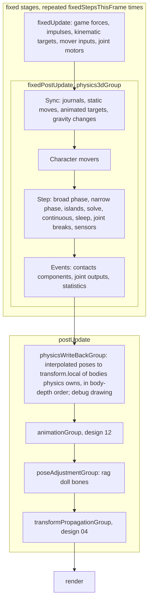
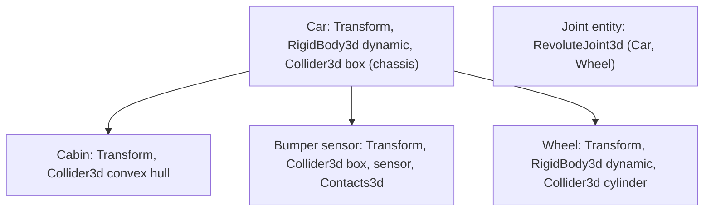
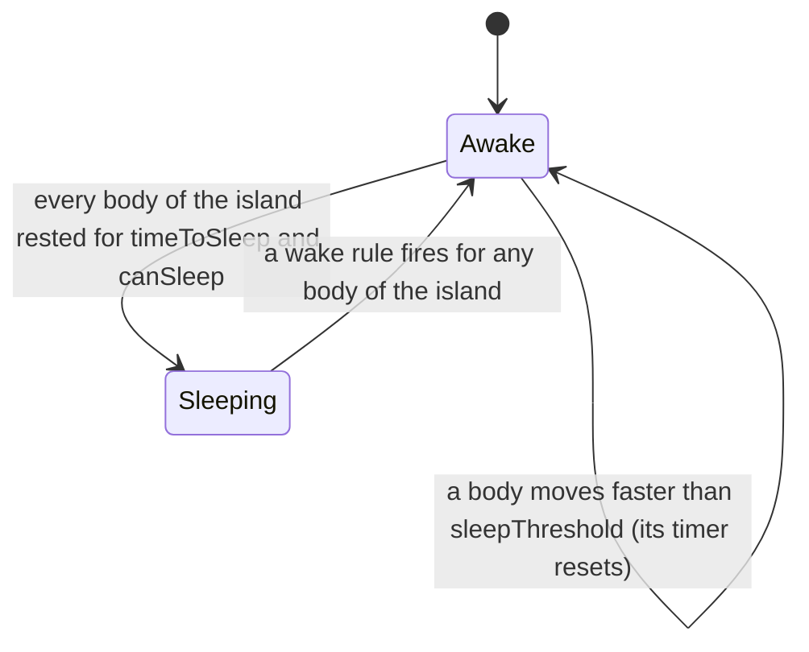

# Design 14: Physics 3D

|                                       |                                                                                                                                                                                                                                                                                                                                                                                                                                                                                                                                                                                                                                        |
| ------------------------------------- | -------------------------------------------------------------------------------------------------------------------------------------------------------------------------------------------------------------------------------------------------------------------------------------------------------------------------------------------------------------------------------------------------------------------------------------------------------------------------------------------------------------------------------------------------------------------------------------------------------------------------------------- |
| **Status**                            | Draft, for review (revised after solution review, §7)                                                                                                                                                                                                                                                                                                                                                                                                                                                                                                                                                                                  |
| **Kind**                              | Feature and breaking refactor                                                                                                                                                                                                                                                                                                                                                                                                                                                                                                                                                                                                          |
| **Engine version at time of writing** | `0.26.1`                                                                                                                                                                                                                                                                                                                                                                                                                                                                                                                                                                                                                               |
| **Program**                           | [Forge 3D](./README.md), milestone M5, built in parallel with M2 to M4. Task 9.4 (root motion) needs design 12's Phase 3; Phase 10 (rag dolls) needs design 12's Phases 1 and 5 (§6.2.2)                                                                                                                                                                                                                                                                                                                                                                                                                                               |
| **Depends on**                        | [02 Math](./02-math.md), [03 ECS foundations](./03-ecs-foundations.md) (with `Time.fixedStepIndex`, cross-doc), [04 Transforms](./04-transforms.md) (with `getCurrentWorldMatrix`, cross-doc)                                                                                                                                                                                                                                                                                                                                                                                                                                          |
| **Related**                           | [01 Testing and benchmarks](./01-testing-and-benchmarks.md) (B6, physics scenarios, allocation specs), [06 Render pipeline](./06-render-pipeline.md) (debug drawing), [08 Meshes, materials and shaders](./08-meshes-materials-and-shaders.md) (mesh data for colliders, matching primitives), [11 glTF and asset lifetime](./11-gltf-and-asset-lifetime.md) (no physics extension), [12 Skeletal and morph animation](./12-skeletal-and-morph-animation.md) (root motion, pose adjustments, rag dolls), [15 Audio, particles and picking](./15-audio-particles-and-picking-in-3d.md) (picking through physics queries, impact sounds) |

## 0. Targeted modules

| Path                                                                                                                  | Change               | Notes                                                                                                                                                                                                                                                           |
| --------------------------------------------------------------------------------------------------------------------- | -------------------- | --------------------------------------------------------------------------------------------------------------------------------------------------------------------------------------------------------------------------------------------------------------- |
| `src/physics/` → `src/physics-2d/`                                                                                    | Renamed and modified | Export path `@forge-game-engine/forge/physics-2d`; names that collide with 3D names get a `2d` suffix (§6.2.1)                                                                                                                                                  |
| `src/physics-2d/systems/*`                                                                                            | Modified             | Run in `fixedPostUpdate`; read and write body poses; state in `PhysicsWorld2dEcsComponent`; no longer exported (§6.20)                                                                                                                                          |
| `src/physics-2d/systems/broad-phase-system.ts`, `narrow-phase-system.ts`                                              | Modified             | The all-pairs loop becomes dynamic AABB trees and a persistent pair cache; sensors move to their own pass (§6.9.9)                                                                                                                                              |
| `src/physics-2d/components/rigidbody-component.ts`, `apply-impluse.ts`, `apply-torque.ts`, `apply-explosive-force.ts` | Modified             | `velocity`, `angularVelocity` and `type` become read-only, changed through functions shaped like 3D's (§6.20)                                                                                                                                                   |
| `src/physics-2d/components/gravity-component.ts`, `systems/gravity-system.ts`                                         | Removed              | World gravity on the singleton and `gravityScale` on the body (decision PH5)                                                                                                                                                                                    |
| `src/physics-2d/register-physics-2d.ts`, `components/physics-world-2d-component.ts`                                   | New                  | `registerPhysics2d`, the singleton, `teleportBody2d`, the body functions, the write-back system                                                                                                                                                                 |
| `src/physics-shared/` (new, internal)                                                                                 | New                  | Soft-constraint coefficients, the friction and restitution mixing rules, category filtering, the dynamic AABB tree, the sensor pass and the write-back's ordering, used by both engines. Not a public module: not in `src/index.ts` or `package.json` `exports` |
| `src/common/collision-categories.ts`                                                                                  | New                  | `allCollisionCategories`, moved from `physics`, shared by both physics modules and picking (design 15)                                                                                                                                                          |
| `src/common/physics-owned-transform-tag.ts`                                                                           | New                  | `physicsOwnedTransformTag`, on every dynamic and kinematic body of either module, written only by the physics modules (§6.6.4, PH36)                                                                                                                            |
| `src/physics-3d/` (new)                                                                                               | New                  | The 3D engine: components, shapes, broad phase, narrow phase, solver, joints, islands, continuous collision, sensors, queries, character mover, rag dolls, debug drawing, `registerPhysics3d` (§6.2.2)                                                          |
| `src/index.ts`, `package.json` `exports`                                                                              | Modified             | `./physics` becomes `./physics-2d`; `./physics-3d` added                                                                                                                                                                                                        |
| `documentation-site/docs/docs/physics/` → `physics-2d/`                                                               | Renamed and modified | Fixed step, interpolation, world gravity, `registerPhysics2d`, `teleportBody2d`, body functions, sensors, suffixed names                                                                                                                                        |
| `documentation-site/docs/docs/physics-3d/` (new)                                                                      | New                  | Guides listed in §6.24                                                                                                                                                                                                                                          |
| `documentation-site/src/pages/demos/**` (14 physics demos), `demo/src/game.ts`                                        | Modified             | Imports, `registerPhysics2d`, world gravity; the five demos that write velocities directly call the body functions (§6.20)                                                                                                                                      |
| `documentation-site/src/pages/demos/physics-3d/`, `joints-3d/`, `character-mover/`, `rag-doll/`                       | New                  | §6.24; entries in `documentation-site/src/data/demos.ts`                                                                                                                                                                                                        |
| `bench/scenes/b6-physics-pile/`                                                                                       | New                  | B6 for Forge and Rapier (informational)                                                                                                                                                                                                                         |
| `e2e/allocation/`, `e2e/specs/`, `e2e/golden/`, `e2e/fixtures/scenes/`                                                | New                  | Allocation specs, interpolation spec, debug-drawing golden (§6.23)                                                                                                                                                                                              |
| `AGENTS.md`, `CHANGELOG.md`                                                                                           | Modified             | Repository structure, "Transforms" (physics-owned transforms), a "Physics" section under "Common Patterns"; changelog entries per phase                                                                                                                         |

`getCurrentWorldMatrix` (`src/common/transform-helpers.ts`) is design 04's
(cross-doc) and `Time.fixedStepIndex` design 03's (cross-doc); this design
uses both.

---

## 1. Summary

Forge's physics module simulates 2D rigid bodies with a chain of systems
that games register in a fixed order and wire together with arrays they
create and pass to the factories. It runs once per rendered frame with the
frame's delta time, integrates into `position.local`, tests every pair of
colliders against each other, and has no sleeping. Section 6.1 describes
it in detail.

This design adds a native 3D physics engine in TypeScript (README P3) and
moves 2D physics onto the same stepping model.

The 3D engine:

- **Lives in the ECS.** Bodies, colliders, joints, contacts and a
  character mover are components. Everything the simulation keeps between
  steps (trees, the pair cache with warm-starting impulses, sleeping
  islands, solver scratch) is in one singleton,
  `PhysicsWorld3dEcsComponent`. Systems hold nothing between runs.
- **Runs on the fixed step.** It steps in `fixedPostUpdate` (design 03).
  Each body has a physics-owned world pose; a write-back system in
  `postUpdate`, the only writer of a dynamic or kinematic body's
  `transform.local`, writes it from the pose interpolated between the last
  two steps, through the parent's current world transform, so bodies can
  sit anywhere in a hierarchy.
- **Uses the established algorithms.** Dynamic AABB trees with fat bounds
  and a persistent pair cache; specialized contact functions, the
  separating axis test with clipping for boxes and hulls, and GJK with EPA
  for curved shapes; contact manifolds of up to four points with feature
  ids; the _soft step_ solver of Box2D v3 and Box3D (substeps, soft
  constraints, warm starting, relaxation, restitution) with an implicit
  gyroscopic term; per-step islands built with union-find and sleeping;
  speculative contacts plus time-of-impact sweeps that include rotation;
  a sensor pass at the end of each step that ignores body type and sleep,
  as Box2D v3.1 has.
- **Covers what 3D games need.** Spheres, capsules, boxes, cylinders,
  cones, convex hulls, static triangle meshes (one-sided by winding unless
  marked double-sided) with internal-edge handling, height fields and
  compounds. Fixed, revolute, prismatic, spherical, distance and
  six-degree-of-freedom joints with limits, motors, springs and breaking.
  Ray casts, shape casts, overlap and closest-point queries that allocate
  nothing. A kinematic character mover with steps, slopes, ground
  snapping, moving platforms, pushing and root motion. Rag dolls blended
  with animation.
- **Is measured.** B6 (README §5): 1,000 boxes and spheres falling into a
  pile at 60 Hz in at most 4 ms per step while awake and 0.5 ms once
  asleep. Allocation specs, scenario tests and repeatability tests run in
  CI.

2D physics keeps its solver and shapes but moves to the fixed step with the
same poses and interpolated write-back, keeps its state in
`PhysicsWorld2dEcsComponent`, takes gravity from the world, changes body
velocities and types through the same functions as 3D, runs sensors in the
same separate pass, and replaces its all-pairs broad phase with dynamic
trees.

---

## 2. Scope

### In scope

- Renaming `physics` to `physics-2d`, with `2d` suffixes where names would
  collide with 3D names (README §4.5).
- 2D physics on the fixed step, with poses, interpolated write-back,
  `teleportBody2d`, velocity and type functions, a singleton, world
  gravity, an `animated` body type, the sensor pass and a dynamic-tree
  broad phase.
- The `physics-3d` module: components, shapes and mass properties, scale
  rules, compound bodies, broad phase, narrow phase, solver with gyroscopic
  torque, joints, islands and sleeping, continuous collision, sensors,
  queries, contact events, character mover, rag dolls, debug drawing and
  statistics.
- B6, microbenchmarks, unit, scenario, repeatability and allocation tests,
  demos and guides for both modules.

### Out of scope

- **Soft bodies, cloth, ropes as continua, fluids, destruction.** Ropes
  are chains of bodies and joints.
- **A vehicle module** (raycast wheels, tire models). Vehicles can be built
  from bodies, revolute joints and six-degree-of-freedom joints; a
  dedicated module is a later design.
- **Determinism across machines, rollback networking.** README non-goals.
  Repeatability on one machine is in scope (§6.21).
- **Running physics in a worker or in WebAssembly.** README P3; open
  question 6.
- **Rolling resistance, anisotropic friction and per-triangle surface
  materials.** Contacts and query hits report the triangle index, so a game
  can look up its own surface data (footstep sounds). Open question 9.
- **Characters on arbitrary up directions** (planets) and gravity fields.
  Games apply forces for these.
- **Convex decomposition** of meshes for dynamic bodies. Use an offline tool
  and load the parts as hulls or a compound.
- **Physics colliders from glTF.** No physics extension is ratified
  (design 11). Open question 7.
- **Physical animation beyond six-degree-of-freedom drives** (per-bone
  controllers that track an animation with strength curves).
- **Sleeping, substepping and an allocation-free solver for 2D.** 2D keeps
  its solver in this design; open question 3.

---

## 3. Phases

Each phase ships on its own: after it, the engine builds, every demo runs,
and the unit, e2e, golden, allocation and benchmark suites pass. Phase 1
depends only on designs 03 and 04, and can ship as soon as M1 does.
Phases 2 to 9 need debug drawing (design 06, Phase 5) for their demos;
demos switch to meshes when design 08 lands. Debug lines draw in an
`rgba8unorm-srgb` view, so the debug-drawn demos run on any WebGL2 device;
once they use lit meshes (design 09), they need a float color buffer like
every lit 3D view (README P4). The physics itself never touches the GPU.

### Phase 1: Physics 2D on the fixed step

The three 2D defects in §6.1.3 are fixed before this phase, separately.

| #    | Task                         | Description                                                                                                                                                                                                                               | Size |
| ---- | ---------------------------- | ----------------------------------------------------------------------------------------------------------------------------------------------------------------------------------------------------------------------------------------- | ---- |
| 1.1  | Rename                       | `src/physics` to `src/physics-2d`, the export path, the names in §6.2.1, `allCollisionCategories` to `common`                                                                                                                             | M    |
| 1.2  | Singleton and registration   | `PhysicsWorld2dEcsComponent` holds what the passed-in arrays held; `registerPhysics2d(world, time, settings)` adds it and the systems; system factories and wiring types become internal                                                  | M    |
| 1.3  | Poses                        | `RigidBody2dEcsComponent.pose` and `previousPose`; integration, joints, contacts and continuous collision read and write poses; static colliders read `transform.world`                                                                   | M    |
| 1.4  | Fixed step and write-back    | Systems in `fixedPostUpdate`; the interpolating write-back in `postUpdate`, the only writer of a physics-owned body's `local`, in body-depth order; `physicsOwnedTransformTag`; moving bodies may have parents; `teleportBody2d` (§6.6.4) | M    |
| 1.5  | Body state through functions | `velocity`, `angularVelocity` and `type` become read-only; the velocity, impulse, force, kinematic-target and type functions of §6.2.1; the five demos that write velocities call them (§6.20)                                            | M    |
| 1.6  | World gravity                | `gravity` on the singleton, `gravityScale` on the body; the gravity component and system deleted                                                                                                                                          | S    |
| 1.7  | `animated` bodies            | A body type that follows its transform, covering each frame's motion evenly over that frame's steps (§6.5.1, §6.10.4)                                                                                                                     | S    |
| 1.8  | Broad phase                  | The shared dynamic trees, a persistent pair cache, contact constraints matched through it instead of a linear search; equivalence with the all-pairs result on seeded scenes                                                              | M    |
| 1.9  | Sensors                      | The sensor pass (§6.9.9): overlaps whatever the bodies' types; contact pairs need a dynamic body (§6.6.1)                                                                                                                                 | M    |
| 1.10 | Tests                        | Frame-rate independence (30, 60, 144 and 240 Hz give the same body states at the same simulated times), interpolation, parented bodies, teleports, sensors for every body type, `animated` bodies in frames with several steps            | M    |
| 1.11 | Migration                    | 14 demos, `demo/src/game.ts`, the physics guides moved to `physics-2d/` and rewritten for registration, the fixed step and the body functions; changelog                                                                                  | L    |

**Definition of done:** every 2D physics demo behaves the same at 30, 60
and 144 Hz; nothing imports `@forge-game-engine/forge/physics`; no demo
writes a body's velocity or a physics-owned transform; the broad-phase
equivalence test passes (contact pairs equal the all-pairs result
restricted to pairs with a dynamic body, sensor overlaps equal it
unrestricted); the guides no longer list a system registration order.

### Phase 2: Rigid bodies with primitive shapes

| #    | Task                     | Description                                                                                                                                                                                            | Size |
| ---- | ------------------------ | ------------------------------------------------------------------------------------------------------------------------------------------------------------------------------------------------------ | ---- |
| 2.1  | Module and registration  | `src/physics-3d`, `registerPhysics3d`, the singleton, settings, statistics (§6.4)                                                                                                                      | S    |
| 2.2  | Components               | `RigidBody3dEcsComponent`, `Collider3dEcsComponent`, `Contacts3dEcsComponent`, `sleepingBodyTag`, factories (§6.5, §6.6, §6.15)                                                                        | M    |
| 2.3  | Primitive shapes         | Sphere, capsule and box; mass properties; scale baking; compound bodies from child entities (§6.7)                                                                                                     | M    |
| 2.4  | Sync and poses           | Registration from journals, body slots, poses, the write-back from its members and `removed` journal in body-depth order, teleports, the body functions, kinematic and `animated` targets (§6.5, §6.6) | L    |
| 2.5  | Broad phase              | Four dynamic trees, fat bounds, the move buffer and the pair cache (§6.8)                                                                                                                              | L    |
| 2.6  | Narrow phase             | Sphere, capsule and box pairs, manifolds, feature ids, speculative points, contact recycling (§6.9)                                                                                                    | L    |
| 2.7  | Solver                   | Gather, prepare, the gyroscopic term, substeps with soft constraints and relaxation, friction, restitution, locked axes, scatter (§6.10)                                                               | L    |
| 2.8  | Contacts, sensors, debug | `Contacts3dEcsComponent` (§6.15), the sensor pass (§6.9.9), debug drawing of shapes and contacts (§6.19), `castRay` against primitives                                                                 | L    |
| 2.9  | Microbenchmarks          | Solver rows, box-box, box-sphere and sphere-sphere contacts, a recorded B6 substep, tree moves and queries, in V8 under Node and in the browser runner (§6.22.2)                                       | S    |
| 2.10 | Tests and demo           | Unit tests, the 10-box stack scenario, repeatability, allocation spec, the `physics-3d` demo with debug drawing                                                                                        | M    |

**Definition of done:** a stack of 10 boxes stays within 1 cm of its start
for 10 simulated seconds; two runs of the same scenario are bit-identical;
the allocation spec reports no physics allocations in steady state; the
microbenchmarks are recorded against §6.22.2, and if the solver row or
box-box figure misses its target by more than 20%, open question 1 is
decided and the B6 table revised before Phase 3 starts.

### Phase 3: Islands, sleeping and B6

| #   | Task             | Description                                                                                                   | Size |
| --- | ---------------- | ------------------------------------------------------------------------------------------------------------- | ---- |
| 3.1 | Islands          | Per-step union-find over awake bodies and their touching contacts and joints (§6.12)                          | M    |
| 3.2 | Sleeping         | Sleep timers, sleeping islands, the tag, wake rules, `wakeBody`, `sleepBody` and `isBodyAsleep`               | M    |
| 3.3 | B6               | The Forge and Rapier versions in `bench/`; per-phase timing and per-frame step counts in the report (§6.22.3) | M    |
| 3.4 | Tuning           | Profile and meet the budget in §6.22 (SoA layout, precomputed rows, the friction decision of open question 1) | L    |
| 3.5 | Pyramid scenario | A 20-level pyramid comes to rest and sleeps                                                                   | S    |

**Definition of done:** B6 meets its budget on the desktop reference; the
pyramid sleeps within 5 simulated seconds of settling; a sleeping scene
costs at most 0.5 ms per step.

### Phase 4: Queries

| #   | Task                        | Description                                                                                 | Size |
| --- | --------------------------- | ------------------------------------------------------------------------------------------- | ---- |
| 4.1 | Ray casts                   | `castRayAll` with a visitor, filters, every shape kind (§6.14)                              | S    |
| 4.2 | Shape casts                 | `castShape` through GJK ray casting                                                         | M    |
| 4.3 | Overlaps and closest points | `overlapShape`, `overlapBounds`, `overlapPoint`, `findClosestPoint`                         | M    |
| 4.4 | Explosions and helpers      | `applyExplosiveForce3d`, `getVelocityAtPoint3d`; tests against brute force; allocation spec | S    |

**Definition of done:** every query agrees with a brute-force reference on
seeded scenes and allocates nothing when given an output object.

### Phase 5: Continuous collision

| #   | Task           | Description                                                                             | Size |
| --- | -------------- | --------------------------------------------------------------------------------------- | ---- |
| 5.1 | Time of impact | Conservative advancement with GJK distances over sweeps that include rotation (§6.13)   | L    |
| 5.2 | Fast bodies    | Sweeps against static geometry for fast dynamic bodies; `continuous` bodies against all | M    |
| 5.3 | Speed limits   | Maximum linear speed, angular speed per substep                                         | S    |
| 5.4 | Scenarios      | The 100 m/s thin-wall test; a spinning plank against a thin wall                        | S    |

**Definition of done:** a 0.5 cm wall stops a 10 cm sphere at 100 m/s and a
`continuous` sphere fired at a moving dynamic box hits it.

### Phase 6: Convex hulls, cylinders, cones and compound shapes

| #   | Task            | Description                                                                         | Size |
| --- | --------------- | ----------------------------------------------------------------------------------- | ---- |
| 6.1 | Convex hulls    | Quickhull, face merging, the hull's edge and face data, mass properties (§6.7.3)    | L    |
| 6.2 | Polyhedra SAT   | Box-hull and hull-hull with Gauss-map pruning and clipping (§6.9.3)                 | M    |
| 6.3 | GJK and EPA     | For cylinders, cones and mixed pairs, with manifolds from supporting faces (§6.9.4) | L    |
| 6.4 | Compound shapes | `CompoundShape` with a child tree, mass from children                               | M    |
| 6.5 | Benchmarks      | GJK, EPA and hull-hull microbenchmarks (box-box is Phase 2's)                       | S    |

**Definition of done:** every convex pair has a contact function tested
against brute-force sampling; the microbenchmarks meet §6.22.

### Phase 7: Static meshes and height fields

| #   | Task                | Description                                                                                                                                   | Size |
| --- | ------------------- | --------------------------------------------------------------------------------------------------------------------------------------------- | ---- |
| 7.1 | Triangle mesh shape | Binned-SAH tree, one-sided and double-sided triangles, ray casts, `createTriangleMeshShapeFromMesh` (§6.7.4)                                  | M    |
| 7.2 | Convex against mesh | Per-triangle contacts and manifold merging                                                                                                    | M    |
| 7.3 | Internal edges      | Active-edge flags and normal correction (§6.9.6)                                                                                              | M    |
| 7.4 | Height fields       | Grid, holes, upward contacts at any depth, a min-max tree for ray casts and bounds queries (§6.7.5)                                           | M    |
| 7.5 | Scenarios           | A box sliding across mesh seams with no vertical bump; a sphere rolling on a height field; a box pressed partway into a floor rising back out | S    |

**Definition of done:** a box sliding at 5 m/s across a flat 1,000-triangle
mesh never gains more than 1 cm/s of upward velocity; a 1 m box pushed
0.4 m into a one-sided floor mesh, and into a height field, comes back to
rest on top; ray casts against a 100,000-triangle mesh meet §6.22.

### Phase 8: Joints

| #   | Task                       | Description                                                                                                                                          | Size |
| --- | -------------------------- | ---------------------------------------------------------------------------------------------------------------------------------------------------- | ---- |
| 8.1 | Joint framework            | Frames, world anchors, the soft rows, warm starting, `collideConnected` (§6.11)                                                                      | M    |
| 8.2 | Fixed, revolute, prismatic | With limits, motors and springs                                                                                                                      | M    |
| 8.3 | Spherical and distance     | Swing and twist limits; distance limits and springs                                                                                                  | M    |
| 8.4 | Six degrees of freedom     | Per-axis motion, cone limits, drives                                                                                                                 | L    |
| 8.5 | Breaking and outputs       | Force and torque outputs; `brokenJointTag`, written only by physics; joints whose body is removed break; repair by replacing the component (§6.11.4) | S    |
| 8.6 | Scenarios and demo         | The 50-link chain, a bridge, motor speed and spring frequency tests; the `joints-3d` demo                                                            | M    |

**Definition of done:** the 50-link chain stays connected (no link more
than 1 cm from its anchor) while swinging; a revolute motor reaches its
target speed within 1%; a spring oscillates at its frequency within 2%.

### Phase 9: Character mover

Task 9.4 needs design 12's Phase 3 (root motion); the rest doesn't.

| #   | Task                  | Description                                                                      | Size |
| --- | --------------------- | -------------------------------------------------------------------------------- | ---- |
| 9.1 | Component and slide   | `CharacterMoverEcsComponent`, recovery, the plane solver, move and slide (§6.16) | L    |
| 9.2 | Steps, slopes, ground | Step-up, slope limit, ground probe and snapping, moving platforms                | M    |
| 9.3 | Pushing               | Impulses on dynamic bodies with the body's mass, characters against characters   | S    |
| 9.4 | Root motion           | `rootMotionSource` from design 12, read in `fixedPostUpdate`                     | S    |
| 9.5 | Scenarios and demo    | Steps, slopes, platforms and pushing scenarios; the `character-mover` demo       | M    |

**Definition of done:** the character scenarios pass (design 01 §6.5 and
§6.23.2): the mover
climbs 0.25 m steps with a 0.3 m step height, stops at 0.35 m, walks up
40° and slides back down 50° slopes with a 45° limit, stays on a moving
platform, and stays grounded walking down a 30° slope at 6 m/s.

### Phase 10: Rag dolls

Needs design 12's pose targets and `poseAdjustmentGroup` (its Phases 1
and 5).

| #    | Task               | Description                                                                                                                                                                                                                                                               | Size |
| ---- | ------------------ | ------------------------------------------------------------------------------------------------------------------------------------------------------------------------------------------------------------------------------------------------------------------------- | ---- |
| 10.1 | Pose write-back    | The rag doll pose system in `poseAdjustmentGroup`: blends only on sampled frames below weight 1, writes every frame at weight 1, in body-depth order; `RagDollEcsComponent.weight`; the sync system's error for dynamic and kinematic bodies on pose targets goes (§6.17) | M    |
| 10.2 | Building rag dolls | `createRagDoll`, `setRagDollSimulated`                                                                                                                                                                                                                                    | M    |
| 10.3 | Demo and guide     | The `rag-doll` demo with a glTF character                                                                                                                                                                                                                                 | S    |

**Definition of done:** a character switches from animation to rag doll
keeping its momentum, falls without joint separation, and blends back to an
animation over a chosen time; a blend at weight 0.5 on a character nobody
sees doesn't drift between frames.

---

## 4. Decision log

| #    | Decision                                        | Options                                                                                                                                                                                                                                                                                        | Chosen                            | Rationale, trade-offs, assumptions                                                                                                                                                                                                                                                                                                                                                                                                                                                                                                                                                                                                                                                                                                                                                                                         |
| ---- | ----------------------------------------------- | ---------------------------------------------------------------------------------------------------------------------------------------------------------------------------------------------------------------------------------------------------------------------------------------------- | --------------------------------- | -------------------------------------------------------------------------------------------------------------------------------------------------------------------------------------------------------------------------------------------------------------------------------------------------------------------------------------------------------------------------------------------------------------------------------------------------------------------------------------------------------------------------------------------------------------------------------------------------------------------------------------------------------------------------------------------------------------------------------------------------------------------------------------------------------------------------- |
| PH1  | Engine                                          | (a) Native TypeScript in the ECS; (b) a WebAssembly engine (Rapier, Jolt) behind components                                                                                                                                                                                                    | (a)                               | README P3. A WebAssembly engine keeps a second copy of the world that every frame must synchronize in both directions, can't read components or the transform hierarchy, and has its own memory and lifetime model. Trade-off: scalar JavaScript is slower than SIMD C; the design compensates with typed-array data, precomputed constraint rows, sleeping and contact recycling, and B6 holds it to a budget.                                                                                                                                                                                                                                                                                                                                                                                                            |
| PH2  | Solver                                          | (a) Soft step: substeps with soft constraints, warm starting and a relaxation pass (Box2D v3, Box3D); (b) projected Gauss-Seidel with position correction (Box2D v2, Bullet); (c) temporal Gauss-Seidel (PhysX); (d) extended position-based dynamics                                          | (a)                               | Erin Catto's Solver2D study compared these solvers on stacking, mass ratios and joints, and chose soft step for Box2D v3; Box3D uses it in 3D. Forge's 2D solver already uses the same soft-constraint coefficients (`solve-soft-constraint.ts`), so both engines share the model and its parameters. Position-based methods handle friction and restitution less directly and need care to conserve momentum at joints.                                                                                                                                                                                                                                                                                                                                                                                                   |
| PH3  | Where a body's pose lives                       | (a) A physics-owned world pose on the body; a write-back writes `transform.local`; (b) physics writes `transform.local` directly during the step; (c) synchronize in both directions with change detection                                                                                     | (a)                               | The solver needs a world pose at every step regardless of hierarchy, and presentation needs a pose between steps. (b) can't interpolate and puts hierarchy conversion inside the solver. (c) gives the transform two writers, which design 03's change detection (E3) can't arbitrate. Unity, Godot and Bevy's physics plugins all keep the body pose separate from the presented transform.                                                                                                                                                                                                                                                                                                                                                                                                                               |
| PH4  | Interpolation                                   | (a) Always interpolate between the last two steps; (b) a per-body choice of none, interpolate or extrapolate                                                                                                                                                                                   | (a)                               | Without interpolation, motion stutters whenever the display rate isn't a multiple of the step rate (144 Hz displays show 60 Hz steps unevenly). Extrapolation overshoots on every contact. A per-body switch would exist only to opt out of correct behavior. Cost: presentation lags the simulation by at most one step (16.7 ms at 60 Hz), which Godot's physics interpolation and Unity's interpolated bodies also accept.                                                                                                                                                                                                                                                                                                                                                                                              |
| PH5  | Gravity                                         | (a) World gravity on the singleton and `gravityScale` per body, for 2D and 3D; (b) a per-entity gravity component, as 2D has today                                                                                                                                                             | (a)                               | Every engine Forge compares with (Box2D, Box3D, Jolt, Unity, Godot) has world gravity with a per-body scale. A per-entity component means every falling body needs one more component, and forgetting it is a common bug; a game wanting no gravity sets it once. 2D moves too, so the two modules share one model; its demos change from `addGravityComponent` to a world setting. Directional or radial gravity per body (planets) is done with forces in `fixedUpdate`.                                                                                                                                                                                                                                                                                                                                                 |
| PH6  | Body types                                      | (a) `dynamic`, `kinematic` (moved by velocity, physics writes the transform), `animated` (follows a transform written at frame rate, physics derives a velocity), `static`; (b) three types, kinematic moved by velocity only; (c) three types, kinematic follows its transform                | (a)                               | Both kinds of kinematic body are needed and they differ in who writes the transform. Scripted movers moved by velocity from `fixedUpdate` are interpolated like the bodies riding them (Box2D, Box3D, Jolt). Hit boxes on animated bones and scenery moved by animation clips must follow a transform someone else writes once per frame (Godot's bodies that follow animation); PH33 covers how they reach it. Rapier also has both kinds as separate body types. Making it the type keeps the one-writer rule explicit, and `physicsOwnedTransformTag` (PH36) follows it.                                                                                                                                                                                                                                                |
| PH7  | Compound bodies                                 | (a) Colliders on child entities belong to the nearest ancestor body, and a `CompoundShape` holds many shapes in one collider; (b) child entities only; (c) compound shapes only                                                                                                                | (a)                               | Child entities give each part its own entity for contacts, filters and sensors, as Unity's compound colliders do. A compound shape keeps thousands of static boxes in one broad-phase entry with its own tree, as Jolt's compound shapes and Box3D's baked compounds do. Each serves a case the other handles badly.                                                                                                                                                                                                                                                                                                                                                                                                                                                                                                       |
| PH8  | Broad phase                                     | (a) Dynamic AABB trees for static, kinematic, dynamic and sensor proxies with fat bounds and a move buffer (Box2D v3, Box3D); (b) sweep and prune (Bullet, PhysX); (c) a uniform grid                                                                                                          | (a)                               | Trees need no world bounds or cell size, handle mixed object sizes, and serve ray and shape queries as well as pair finding. Separate trees mean static geometry is never re-inserted and never queried against itself, and sensors are found without walking the contact trees. Sweep and prune degrades when many objects overlap along its sort axis, as a tall pile does on the vertical axis.                                                                                                                                                                                                                                                                                                                                                                                                                         |
| PH9  | Narrow phase                                    | (a) Specialized functions for sphere and capsule pairs, the separating axis test with clipping for polyhedra, GJK and EPA for curved shapes, manifolds from supporting faces; (b) GJK and EPA for everything with incremental manifolds                                                        | (a)                               | SAT with clipping gives exact, stable multi-point manifolds and feature ids for boxes and hulls (Dirk Gregorius, GDC 2013 and 2015), which is what stacks need. GJK and EPA give one point per call; incremental manifolds (Bullet) jitter. Jolt builds manifolds from supporting faces after GJK and EPA, which (a) uses for curved shapes.                                                                                                                                                                                                                                                                                                                                                                                                                                                                               |
| PH10 | Friction                                        | (a) Two tangent rows per contact point with a circular clamp (Box2D, Jolt); (b) patch friction at the manifold center with a twist row (PhysX)                                                                                                                                                 | (a), revisited by open question 1 | Proven and simple to warm start. (b) has fewer rows and could be needed to meet B6; Phase 3 measures both.                                                                                                                                                                                                                                                                                                                                                                                                                                                                                                                                                                                                                                                                                                                 |
| PH11 | Islands                                         | (a) Rebuilt every step with union-find over awake bodies (Jolt); (b) persistent islands merged on contact and split later by search (Box2D v3)                                                                                                                                                 | (a)                               | Single-threaded, awake sets of a few thousand bodies link in well under 0.1 ms, and there's no split bookkeeping to get wrong. Sleeping islands are stored, so waking one restores all of its bodies at once.                                                                                                                                                                                                                                                                                                                                                                                                                                                                                                                                                                                                              |
| PH12 | Sleep state                                     | (a) `sleepingBodyTag` only, written by physics, with `isBodyAsleep(world, entity)` for reading one body; (b) a read-only `isAwake` field and the tag (the first draft); (c) the field only                                                                                                     | (a)                               | The tag makes sleeping bodies leave declared queries (design 03 `without`), so the write-back and game systems cost nothing for them, and journals tell a game when bodies fall asleep or wake (Bevy's physics plugins use a marker component the same way). A field beside it would be a second copy of the same fact. `isBodyAsleep` reads the body's slot for code that checks one body.                                                                                                                                                                                                                                                                                                                                                                                                                                |
| PH13 | Continuous collision                            | (a) Speculative contacts for all, time-of-impact sweeps against static geometry for every fast dynamic body, and against all bodies for bodies marked `continuous` (Box2D v3, Box3D); (b) opt-in per body only (Unity, Godot, Jolt)                                                            | (a)                               | Fast bodies passing through static walls is a bug, not a setting, so it's handled without a flag. Sweeps only run for bodies that move more than half their smallest extent in a step, so slow scenes pay nothing. Sweeps against moving bodies cost more and are rarely needed, so they're a per-body choice.                                                                                                                                                                                                                                                                                                                                                                                                                                                                                                             |
| PH14 | How games change body state                     | (a) Velocities, pose, type and sleep are read-only fields changed through functions that also wake the body, in 2D and 3D; (b) writable fields                                                                                                                                                 | (a)                               | A write to a sleeping body's field can't wake it, because nothing observes plain field writes (design 03 E3), and scanning sleeping bodies for writes would make sleep cost proportional to scene size. Functions are also the physics module writing its own state. `applyForce3d` turns a force into one step's impulse at once, so there's no force accumulator that both the game and physics write. 2D gets the same functions in Phase 1 although it has no sleeping yet, so the step owns its velocities and porting it to sleeping (open question 3) doesn't change its API a second time.                                                                                                                                                                                                                         |
| PH15 | Changing a collider's shape, offset, filter     | (a) Replace the component (the journals re-register it); (b) setter functions; (c) detect changes every step                                                                                                                                                                                   | (a)                               | Shape, offset, density, category, mask and sensor change the broad phase, the pairs or the mass; Box2D and Box3D also recreate shapes for these. Replacing the component goes through design 03's journals, so there's no extra API and no per-step scan. Friction and restitution are read every step and stay writable.                                                                                                                                                                                                                                                                                                                                                                                                                                                                                                  |
| PH16 | Combining friction and restitution              | (a) One rule for the world, shared by 2D and 3D: the geometric mean for friction and the maximum for restitution (Box2D v3, Box3D, Jolt); (b) a combine rule per collider, resolved by priority when two differ (PhysX, Unity, Rapier; the first draft)                                        | (a), pending open question 2      | The maximum makes a bouncy ball bounce on ordinary ground, and the geometric mean makes ice (friction near 0) slippery against anything: the two cases the first draft gave per-collider rules for. Box2D v3 and Jolt use one rule per world; PhysX, Unity and Rapier resolve per-collider rules by priority. A per-collider rule is an option most games never set, and Forge adds options only when games need different values, asking first when unsure, so open question 2 asks the product owner. 2D's geometric-mean restitution is a defect fixed before Phase 1 (§6.1.3).                                                                                                                                                                                                                                         |
| PH17 | Scale                                           | (a) Bake the entity's world scale into the shape exactly, and throw where a shape can't represent it; (b) approximate (a sphere takes the largest axis, as Unity does)                                                                                                                         | (a)                               | Jolt accepts only scales a shape can represent. A silently wrong collider is worse than an error naming the entity and shape.                                                                                                                                                                                                                                                                                                                                                                                                                                                                                                                                                                                                                                                                                              |
| PH18 | Triangle meshes and height fields               | (a) Static, kinematic and animated bodies only; (b) allowed on dynamic bodies                                                                                                                                                                                                                  | (a)                               | A mesh has no volume, so no mass or inertia, and mesh-against-mesh contacts are unstable. Jolt and Box3D make the same restriction. Dynamic bodies use hulls or compounds of hulls.                                                                                                                                                                                                                                                                                                                                                                                                                                                                                                                                                                                                                                        |
| PH19 | Joint names and axes                            | (a) Revolute and prismatic as in 2D (suffixed), plus fixed, spherical, distance and six-degree-of-freedom; the joint frame's X axis is the hinge, slide and twist axis; `entityA: null` is the world; (b) hinge and slider names                                                               | (a)                               | One name per concept across 2D and 3D, as Box2D and Box3D keep. The X-axis convention is PhysX's D6 joint's and is documented once for all joints.                                                                                                                                                                                                                                                                                                                                                                                                                                                                                                                                                                                                                                                                         |
| PH20 | Character controller                            | (a) A kinematic capsule moved by queries (move and slide), as Box3D's mover, Godot's character bodies, Unity's character controller and Jolt's virtual character do; (b) a dynamic capsule held upright by constraints                                                                         | (a)                               | Kinematic movers give exact control over steps, slopes and snapping and don't bounce or slide on slopes. A dynamic capsule needs friction and damping tricks to stand still on a slope. The component is named `CharacterMoverEcsComponent`, after what it does, not after Unity's class.                                                                                                                                                                                                                                                                                                                                                                                                                                                                                                                                  |
| PH21 | How a mover affects dynamic bodies              | (a) The mover stops at dynamic bodies like walls, then pushes them with impulses limited by `maxPushForce`; (b) the solver treats the mover's body as infinitely heavy                                                                                                                         | (a)                               | With (b), a character walks through a car by pushing it. Jolt's virtual character pushes with a limited strength for the same reason. Dynamic bodies still land on and bounce off the mover's kinematic body through normal contacts.                                                                                                                                                                                                                                                                                                                                                                                                                                                                                                                                                                                      |
| PH22 | Rag doll pose                                   | (a) Physics writes bones with dynamic bodies as a pose adjustment after animation sampling, blended by a weight; (b) disable animation on rag doll bones                                                                                                                                       | (a)                               | Design 12 makes pose sampling the writer of every pose target and lets adjustments follow it (its §6.13 and §6.15). Godot's physical bone simulator is a skeleton modifier after animation with an influence, and Unreal blends physics with a weight. The weight is what get-up transitions and partial rag dolls need. Below weight 1 the blend runs only on frames whose pose was sampled (design 12 §6.13.1), so it never blends with its own previous output.                                                                                                                                                                                                                                                                                                                                                         |
| PH23 | Contact events                                  | (a) An opt-in component per entity, rewritten every step, read in `fixedUpdate`; (b) a world-wide event list per step                                                                                                                                                                          | (a)                               | Matches 2D's `ContactsEcsComponent`, and keeps events on the entities a game cares about. Unity and Godot deliver contact callbacks in the physics loop for the same reason: a frame can run zero or several steps.                                                                                                                                                                                                                                                                                                                                                                                                                                                                                                                                                                                                        |
| PH24 | Solver data                                     | (a) Components hold what games read; each step gathers awake bodies into structure-of-arrays typed arrays in the singleton, solves, and scatters back; (b) the typed arrays are the truth and components are views                                                                             | (a)                               | Components stay the one place games read, as in the rest of Forge, and the hot loops run over contiguous `Float64Array`s. Gathering costs a few tens of nanoseconds per awake body.                                                                                                                                                                                                                                                                                                                                                                                                                                                                                                                                                                                                                                        |
| PH25 | Number types                                    | (a) `Float64Array` for body state, constraints and trees; `Float32Array` for mesh vertices and mesh tree bounds; (b) `Float32Array` everywhere                                                                                                                                                 | (a)                               | README G4: JavaScript arithmetic is 64-bit, and storing to `float32` would round every intermediate. Mesh data comes from glTF as `float32` and is large, so it stays that size; mesh tree bounds are rounded outwards.                                                                                                                                                                                                                                                                                                                                                                                                                                                                                                                                                                                                    |
| PH26 | Shapes                                          | (a) Immutable plain data with a `kind`, built by factories, with functions chosen from tables by kind; (b) classes with methods, as 2D's colliders are                                                                                                                                         | (a)                               | Data-oriented and monomorphic per kind; a pair's contact function is one table lookup (`AGENTS.md` rules out switch statements). Derived data (hull faces, mesh trees, mass properties) is computed once in the factory.                                                                                                                                                                                                                                                                                                                                                                                                                                                                                                                                                                                                   |
| PH27 | Settings                                        | (a) Step settings passed to `registerPhysics3d` and kept by the systems as configuration; gravity and debug flags on the singleton; (b) everything on the singleton                                                                                                                            | (a)                               | README §4.4 lists physics step settings as configuration a game builds once. Gravity and debug flags change at runtime and are read by game code, so they're component state.                                                                                                                                                                                                                                                                                                                                                                                                                                                                                                                                                                                                                                              |
| PH28 | Registration                                    | (a) `registerPhysics2d` and `registerPhysics3d` add the singleton and every system in its stage and group; the system factories are internal; (b) export each system for games to register                                                                                                     | (a)                               | The systems only work together and in one order. Exporting them invited registering a subset in the wrong order, which today's guide spends a section on. Systems for features a game doesn't use cost nothing, since their declared queries are empty.                                                                                                                                                                                                                                                                                                                                                                                                                                                                                                                                                                    |
| PH29 | Mass                                            | (a) Density per collider (default 1,000 kg/m³) and an optional `mass` and `centerOfMass` override per body; (b) mass per body only                                                                                                                                                             | (a)                               | Density gives correct relative masses and inertia for compound bodies; setting a character to 80 kg without knowing its volume needs the override. Jolt and Unity scale the computed inertia to an overridden mass the same way. The center-of-mass override is what vehicles need.                                                                                                                                                                                                                                                                                                                                                                                                                                                                                                                                        |
| PH30 | Sensors                                         | (a) A separate pass at the end of each step that finds a sensor's overlaps whatever the two bodies' types and whether either is asleep, including other sensors; (b) sensors as contact pairs, which need a dynamic body (the first draft)                                                     | (a)                               | Box2D v3.1 moved sensors out of the contact pipeline for this reason: with (b), pickups on static bodies can't detect a kinematic character mover, and an animated hit box can't detect a static trigger. Running at the end of the step reports overlaps at the step's final poses. Forge 2D reports every overlap today, so (a) also keeps 2D's behavior. Unlike Box2D v3.1, sensors detect other sensors, as 2D does and Godot's areas do, because hit boxes and hurt boxes are both sensors; categories and masks filter what a game doesn't want. Only pairs with a moving side are retested, so still sensors cost nothing.                                                                                                                                                                                          |
| PH31 | Gyroscopic torque                               | (a) Erin Catto's implicit gyroscopic term, once per step, for dynamic bodies whose inertia isn't the same on every axis; (b) none (the first draft); (c) the explicit term `−ω × Iω`                                                                                                           | (a)                               | Without it, a tumbling asymmetric body keeps its world angular velocity while its world inertia turns, so angular momentum isn't conserved: thrown planks, spinning coins and tops move wrongly. The first draft's reason for leaving it out (Box2D has none) doesn't carry over, since 2D has no gyroscopic term at all. The explicit term adds energy and makes thin, fast-spinning bodies unstable, which is why engines omitted it; the implicit form (Catto, "Numerical Methods", GDC 2015; Bullet applies it by default) takes one Newton step of Euler's equation in body space and is stable. Cost: a 3x3 solve per such body per step; spheres and cubes skip it, so B6 pays nothing.                                                                                                                             |
| PH32 | Triangle sides                                  | (a) Meshes one-sided by winding (front faces counter-clockwise, as glTF), with `doubleSided` per mesh shape; height fields solid below; (b) both sides, pushing towards the side the convex's center is on (the first draft)                                                                   | (a)                               | With (b), a body whose center sinks past a floor's plane is pushed down through it. A one-sided triangle collides only with a convex whose center is in front of it and always pushes towards the front, so a body that sinks partway is pushed back up; continuous collision (PH13) keeps a center from crossing a surface unseen, since a body that moves more than half its smallest extent in a step is swept. Jolt ignores back faces by default, Godot's mesh shapes make back-face collision a per-shape setting that is off by default, and Box2D's chain segments are one-sided the same way. A height field is terrain with ground below, so it always pushes up, at any depth. `doubleSided` exists because meshes really differ: a fence or sail with no thickness needs both sides, level geometry needs one. |
| PH33 | How `animated` bodies reach a frame-rate target | (a) Each step reads the target from current local values and covers the rest of the motion evenly over the frame's remaining steps; (b) each step targets `transform.world` from the last propagation (the first draft); (c) animation runs in the fixed step, as Unity's Animate Physics mode | (a)                               | (b) puts a frame's whole motion into its first step and none into its second, so platforms move in bursts, and misses transforms written in `fixedUpdate`. With (a), a transform written once per frame is reached at the frame's last step at constant speed, whatever the step count. (c) is design 12's open question 3; correct bodies don't need it, and it would make animation run per step. Trade-off: an `animated` body's physics trails its drawn transform by up to a frame, so bodies riding it appear slightly behind; platforms that carry bodies are `kinematic`, moved with `setKinematicTarget3d` from `fixedUpdate` and interpolated like their riders.                                                                                                                                                 |
| PH34 | Order of the write-back                         | (a) Sort the bodies to write by body depth (physics-owned ancestors) each run, by counting into scratch on the singleton; (b) keep a depth per body in the singleton; (c) rely on query order (the first draft)                                                                                | (a)                               | A nested body's `local` is computed through its parent's current world, so a parent body must be written first. Query order is unspecified (design 03, open question 1). A stored depth goes stale whenever any ancestor is reparented, which the body's own journals don't report. Computing it costs one parent lookup for a root body, and for a nested body a walk up the chain it needs for `getCurrentWorldMatrix` anyway.                                                                                                                                                                                                                                                                                                                                                                                           |
| PH35 | Broken joints                                   | (a) Physics adds `brokenJointTag` and removes it when the joint component is replaced; (b) physics adds it and games remove it to re-enable the joint (the first draft); (c) remove the joint component on break, as Unity does                                                                | (a)                               | (b) gives the tag two writers and re-enables a joint whose bodies may have moved apart, snapping them together. Replacing the component re-registers the joint from its options, which is the repair. (c) loses the joint's settings and makes a break an absence instead of something journals report.                                                                                                                                                                                                                                                                                                                                                                                                                                                                                                                    |
| PH36 | Which bodies the write-back writes              | (a) `physicsOwnedTransformTag` on dynamic and kinematic bodies, kept in step with the type by the physics modules; (b) the write-back matches every body and skips `animated` and `static` ones in its loop (the first draft)                                                                  | (a)                               | A system that matches entities it must not touch means the components don't say what the system needs (`AGENTS.md`). The tag makes the write-back's declaration exactly the bodies it writes, lets falling asleep and type changes reach it through its `removed` journal, and gives games and design 12's root motion check one way to ask whether physics owns a transform. It lives in `common` because both physics modules write it.                                                                                                                                                                                                                                                                                                                                                                                  |

---

## 5. Open questions

In priority order.

1. **Friction rows and substeps for B6.** Per-point friction (PH10) gives
   three rows per contact point; patch friction gives one per point plus
   three per manifold. Options: (a) per-point friction with four substeps;
   (b) patch friction with four substeps; (c) per-point friction with
   three substeps. Proposal: build (a) in Phase 2 and measure its rows
   there (§6.22.2); switch to (b) only if B6 misses the budget by more than
   20% after Phase 3's tuning, since (b) changes behavior on rotating
   contacts.
2. **Per-collider combine rules (PH16), for the product owner.** Friction
   and restitution combine with one rule for the world: the geometric mean
   and the maximum, as in Box2D v3 and Jolt. Options: (a) keep that; (b) a
   combine rule per collider (geometric mean, average, minimum, multiply,
   maximum) with a priority when two differ, as PhysX, Unity and Rapier
   have, which also lets a dead floor stop a bouncy ball; (c) a world-level
   mixing function a game can replace, as Box2D v3's friction and
   restitution callbacks. Proposal: (a); (c) when a game needs a surface the
   world rule can't express, since it adds no field to every collider.
3. **2D on the 3D solver's structure.** 2D keeps its allocating,
   single-pass solver and has no sleeping. After Phase 1 its body state
   goes through the same functions as 3D's, so a port wouldn't change its
   API. Options: (a) a follow-up design after M5 ports 2D onto the soft
   step, structure-of-arrays data, islands and sleeping, sharing code with
   3D; (b) leave 2D as is. Proposal: (a); it also removes 2D's entries
   from the allocation allow-list.
4. **Renaming 2D shape classes.** 2D calls its shapes `CircleCollider`,
   `PolygonCollider` and `TerrainCollider`; 3D calls them shapes. Options:
   (a) rename them `CircleShape`, `PolygonShape` and `TerrainShape` in
   Phase 1, while every 2D caller changes anyway; (b) keep them. Proposal:
   (a), if the product owner agrees to the extra churn in Phase 1.
5. **Warning about writes to physics-owned transforms.** A game that writes
   the `transform.local` of a body with `physicsOwnedTransformTag` sees it
   overwritten at the next write-back. Options: (a) in development builds,
   the write-back compares each member's `local` with what it wrote last
   frame (kept in the body's slot) and warns once per entity; (b)
   documentation only. Proposal: (a); it costs ten comparisons per awake
   body and is stripped from production builds.
6. **Physics in a worker.** A worker needs the body data in a
   `SharedArrayBuffer`, which needs cross-origin isolation that many
   hosting sites don't set. Proposal: no; revisit if B6 shows the main
   thread can't fit physics and rendering.
7. **glTF physics extensions.** Khronos has rigid-body and implicit-shape
   extensions in development but none ratified (design 11). Proposal:
   support them through design 11's extension handlers once ratified.
8. **Root motion latency.** The mover system reads root motion in
   `fixedPostUpdate`, and it was produced in the previous frame's
   `postUpdate`, so it's one frame late (design 12, its open question 3).
   Options: (a) keep it; (b) let playback advance in `fixedUpdate`.
   Proposal: measure in the Phase 9 scenarios and decide with design 12.
   Moving bodies doesn't depend on it: `animated` bodies already follow
   frame-rate transforms correctly (PH33).
9. **Rolling resistance and per-triangle materials.** Proposal: add rolling
   resistance (Box3D has it) and a material index per triangle when the
   M6 sample game needs them.

---

## 6. Design

### 6.1 Physics 2D today

#### 6.1.1 The systems

The physics guide (`documentation-site/docs/docs/physics/index.md`)
registers the systems in this order, after `createTransformEcsSystem`, all
in the default group and so in `update`, once per rendered frame with the
frame's `time.deltaTimeInSeconds`:

| Order | System (file under `src/physics/systems/`)           | What it does                                                                                                                                                                                                                                                                                                                                                                                                                                                                                                                                                                             |
| ----- | ---------------------------------------------------- | ---------------------------------------------------------------------------------------------------------------------------------------------------------------------------------------------------------------------------------------------------------------------------------------------------------------------------------------------------------------------------------------------------------------------------------------------------------------------------------------------------------------------------------------------------------------------------------------- |
| 1     | `gravity-system.ts`                                  | Adds `GravityEcsComponent.amount × dt` to the velocity of each dynamic body that has a gravity component.                                                                                                                                                                                                                                                                                                                                                                                                                                                                                |
| 2     | `linear-spring-system.ts`, `linear-damper-system.ts` | Hooke's-law and damping impulses between two anchors, as force generators with no warm starting.                                                                                                                                                                                                                                                                                                                                                                                                                                                                                         |
| 3     | `broad-phase-system.ts`                              | Recomputes every collider's `aabb` from `position.world` and the rotation, then tests every pair (`O(n²)`) for category and mask (`collision/collision-filter.ts`) and overlap, pushing new pair objects into the `collisionPairs` array passed to the factory.                                                                                                                                                                                                                                                                                                                          |
| 4     | `narrow-phase-system.ts`                             | Runs the detector for each pair's shape types from a `Map` (`collision/detect-collision.ts`): circle and polygon pairs with the separating axis test, terrain against circles and polygons edge by edge (several manifolds per pair). Writes manifolds with feature ids into `collisionManifolds`. Owns every `ContactsEcsComponent` and rewrites `touching`, `started` and `ended` with new arrays each tick; sensor overlaps are recorded there and never resolved.                                                                                                                    |
| 5     | `collision-resolution-system.ts`                     | Matches this tick's manifolds with the previous `contactConstraints` by entity pair and feature id (a `findIndex` and `splice` per point), then sequential impulses: warm start, 10 iterations of a soft normal constraint (`solve-soft-constraint.ts`: contact hertz 30 capped at `0.25 / dt`, damping ratio 10, push speed capped at 3, slop 0.002) and Coulomb friction (geometric-mean coefficients), then one restitution pass for new contacts (geometric-mean restitution, 1 m/s threshold). Penetration is measured once per tick; there are no substeps and no relaxation pass. |
| 6     | `revolute-joint-system.ts`                           | A soft, warm-started two-row point constraint solved with `Matrix2x2` (60 Hz, damping ratio 2, one iteration), and an angle limit that isn't warm-started.                                                                                                                                                                                                                                                                                                                                                                                                                               |
| 7     | `prismatic-joint-system.ts`                          | A perpendicular row and an angular lock, warm-started, and a translation limit that isn't.                                                                                                                                                                                                                                                                                                                                                                                                                                                                                               |
| 8     | `angular-velocity-motor-system.ts`                   | Drives a body's angular velocity to a target, clamped by `maxTorque × dt`.                                                                                                                                                                                                                                                                                                                                                                                                                                                                                                               |
| 9     | `euler-integration-system.ts`                        | Semi-implicit Euler (velocities were updated by the systems above first): adds `angularVelocity × dt` to `rotation.local` and `velocity × dt` to `position.local`, correcting for an off-origin center of mass; applies `angularDrag`. Throws for a moving body with a parent.                                                                                                                                                                                                                                                                                                           |
| 10    | `continuous-collision-system.ts`                     | Sweeps each dynamic circle's center from `position.world` (where detection saw it) to `position.local` (where integration put it) against static circles, polygons and terrain, and moves it back to the time of impact if it would sink more than a tenth of its radius. Polygons aren't swept; rotation isn't swept.                                                                                                                                                                                                                                                                   |

Other parts:

- **Bodies** (`components/rigidbody-component.ts`): `velocity`,
  `angularVelocity`, `angularDrag` and `type` (`dynamic`, `kinematic`
  moved by its velocity, `static`). A collider with no body is static.
- **Mass** (`rigid-body-mass-data.ts`) comes from the entity's collider
  (`colliders/collider.ts`: `mass`, `momentOfInertia`,
  `localCenterOfMass`), computed from area and density (default 1).
- **Shapes**: `CircleCollider`, `PolygonCollider` (convex, validated in its
  constructor) and `TerrainCollider` (a heightmap chain whose neighboring
  edges act as ghost geometry, as Box2D chain shapes do).
- **Colliders** (`components/collider-component.ts`): friction (0.6),
  restitution (0.05), `category`, `mask`, `sensor`, and an output `aabb`.
- **Queries**: `raycast` (`raycast/raycast.ts`) runs `world.query` per call,
  filters first with each collider's `aabb`, and returns a new sorted array.
- **Forces**: `applyImpulse`, `applyTorque` (converted to a velocity change
  with a delta the caller passes) and `applyExplosiveForce`.

#### 6.1.2 What this design changes, and why

- **State outside the ECS.** `collisionPairs`, `collisionManifolds` and
  `contactConstraints` are arrays the game creates and passes to three
  factories. `contactConstraints` is solver state carried between ticks for
  warm starting. Design 03's audit (§6.5) assigns them to this design.
- **No fixed step.** Every system integrates with the frame delta, so the
  simulation differs between a 60 Hz and a 144 Hz display, and a slow
  frame takes one large step.
- **Allocation.** Every tick allocates pair, manifold and constraint
  objects, `Set`s and `Map`s in the narrow phase, new contact arrays, and
  vector clones throughout.
- **Cost.** The broad phase is `O(n²)`; contact matching is `O(n²)` in the
  number of contact points.
- **No sleeping or islands.**
- **Hierarchy.** Moving bodies must be roots, because velocity is added to
  `local`.

#### 6.1.3 Three defects found while mapping

These are 2D defects, fixed separately under the `fix-defect` skill with a
failing test each, before Phase 1. They aren't part of this design.

1. **Prismatic joint velocity error counts angular velocity twice.** In
   `prismatic-joint-system.ts`, `solvePerpendicular` computes
   `dot(relVel, perp) + s2·ωB − s1·ωA`, where `relVel` comes from
   `velocityAtPoint` (`joints/velocity-at-point.ts`), which already
   includes `ω × r` at each anchor. The Jacobian's angular terms (`s1`,
   `s2`) are then added a second time. Box2D's prismatic joint uses the
   centers' linear velocities, `dot(perp, vB − vA) + s2·ωB − s1·ωA`.
   `solveLimit` has the same error with `a1` and `a2`. The impulses are
   applied correctly, so the joint still converges, but with a wrong
   velocity error whenever the bodies turn. Checked:
   `revolute-joint-system.ts` is not affected (`solvePoint` uses only
   `velocityAtPoint`, `solveLimit` only angular velocities).
2. **Polygon moment of inertia is twice too large.**
   `calculatePolygonMomentOfInertia` (`colliders/polygon-math.ts`) returns
   `(mass / 3) · Σ|cᵢ|(pᵢ·pᵢ + pᵢ·pᵢ₊₁ + pᵢ₊₁·pᵢ₊₁) / Σ|cᵢ|`. The polar
   moment of a triangle fan about the centroid gives `mass / 6`. For a 2 × 2
   square this returns `4m/3` instead of `m(w² + h²)/12 = 2m/3`.
   `PolygonCollider` and `TerrainCollider` use it, so polygon bodies resist
   torque twice as much as they should. Existing tests only compare two
   polygons with each other (`polygon-collider.test.ts`), which is why
   it went unnoticed.
3. **Restitution combines with the geometric mean.**
   `collision-resolution-system.ts` (lines 243 and 244) combines both
   friction and restitution with `Math.sqrt(a × b)`. For restitution
   that's the wrong default: a ball with restitution 0.9 on ground with the
   default 0.05 bounces with 0.21. Box2D v3, Box3D and Jolt use the maximum,
   so a bouncy object bounces on anything; friction keeps the geometric
   mean. The brick-breaker demo works around the defect by giving its
   paddle, walls and bricks `restitution: 1` as well as its ball
   (`_create-paddle.ts`, `_create-boundaries.ts`, `_create-bricks.ts`); the
   fix deletes those three. Shared mixing code in `physics-shared` (PH16)
   then serves both engines.

### 6.2 Modules and names

#### 6.2.1 `physics` becomes `physics-2d`

README §4.5: a name takes a suffix only where a 2D and a 3D version both
exist and would collide in `src/index.ts`.

| Today                                                                                                                                                                                                                                                                                                                          | After Phase 1                                                                                                                                                                                                                                                                                                                                                                                                    |
| ------------------------------------------------------------------------------------------------------------------------------------------------------------------------------------------------------------------------------------------------------------------------------------------------------------------------------ | ---------------------------------------------------------------------------------------------------------------------------------------------------------------------------------------------------------------------------------------------------------------------------------------------------------------------------------------------------------------------------------------------------------------- |
| `@forge-game-engine/forge/physics`                                                                                                                                                                                                                                                                                             | `@forge-game-engine/forge/physics-2d`                                                                                                                                                                                                                                                                                                                                                                            |
| `RigidBodyEcsComponent`, `rigidBodyId`, `addRigidBodyComponent`, `RigidBodyType`                                                                                                                                                                                                                                               | `RigidBody2dEcsComponent`, `rigidBody2dId`, `addRigidBody2dComponent`, `RigidBody2dType`                                                                                                                                                                                                                                                                                                                         |
| `ColliderEcsComponent`, `colliderId`, `addColliderComponent`, its option types                                                                                                                                                                                                                                                 | `Collider2dEcsComponent`, `collider2dId`, `addCollider2dComponent`, `Collider2dDefaultedOptions`, `Collider2dRequiredOptions`                                                                                                                                                                                                                                                                                    |
| `ContactsEcsComponent`, `contactsId`, `addContactsComponent`                                                                                                                                                                                                                                                                   | `Contacts2dEcsComponent`, `contacts2dId`, `addContacts2dComponent`                                                                                                                                                                                                                                                                                                                                               |
| `RevoluteJointEcsComponent`, `PrismaticJointEcsComponent` and their ids, factories, options                                                                                                                                                                                                                                    | `RevoluteJoint2dEcsComponent`, `PrismaticJoint2dEcsComponent`, and so on                                                                                                                                                                                                                                                                                                                                         |
| `applyImpulse`, `applyTorque`, `applyExplosiveForce`; writable `velocity`, `angularVelocity` and `type`                                                                                                                                                                                                                        | Read-only `velocity`, `angularVelocity` and `type`, changed through `setLinearVelocity2d`, `setAngularVelocity2d`, `setKinematicTarget2d`, `setBodyType2d`, `applyImpulse2d` (its point becomes optional, the center of mass by default), `applyAngularImpulse2d`, `applyForce2d`, `applyTorque2d` (reads the step itself; the delta parameter goes), `applyExplosiveForce2d` and `getVelocityAtPoint2d` (§6.20) |
| `GravityEcsComponent`, `gravityId`, `addGravityComponent`, `createGravityEcsSystem`                                                                                                                                                                                                                                            | Removed: `PhysicsWorld2dEcsComponent.gravity` and `RigidBody2dEcsComponent.gravityScale` (PH5)                                                                                                                                                                                                                                                                                                                   |
| `allCollisionCategories`                                                                                                                                                                                                                                                                                                       | Moved to `common` (shared by both engines and picking), beside the new `physicsOwnedTransformTag`                                                                                                                                                                                                                                                                                                                |
| The 12 `create*EcsSystem` factories and their option types                                                                                                                                                                                                                                                                     | Internal; `registerPhysics2d(world, time, settings)` registers them; `PhysicsSettings2d` merges the three option types                                                                                                                                                                                                                                                                                           |
| `CollisionPair`, `CollisionManifold`, `NarrowPhaseManifold`, `ContactConstraint`, `CollisionBody`, the `detect*` and `sweep*` functions, `aabbsOverlap`, `collidersCanCollide`, `velocityAtPoint`, `applyPointImpulse`, `resolveJointBody`, `getJointLeverArm`, `JointBody`, `getSoftConstraintParams`, `SoftConstraintParams` | Internal: they existed for games to wire the passed-in arrays, or are solver details                                                                                                                                                                                                                                                                                                                             |
| `getRigidBodyMassData`, `RigidBodyMassData`                                                                                                                                                                                                                                                                                    | `getRigidBody2dMassData`, `RigidBody2dMassData`                                                                                                                                                                                                                                                                                                                                                                  |
| New                                                                                                                                                                                                                                                                                                                            | `PhysicsWorld2dEcsComponent`, `physicsWorld2dId`, `registerPhysics2d`, `PhysicsSettings2d`, `PhysicsStats2d`, `teleportBody2d`, `Pose2d`                                                                                                                                                                                                                                                                         |

Unchanged: `CircleCollider`, `PolygonCollider`, `TerrainCollider` and
`Collider` (open question 4), `raycast` and its types, `Aabb`, `SweepHit`,
the polygon math helpers, `LinearSpringEcsComponent`,
`LinearDamperEcsComponent` and `AngularVelocityMotorEcsComponent` (3D has
none of these: its distance joint has a spring, and its six-degree-of-freedom
joint has drives).

3D's names follow the same rule. A function both modules have carries a
suffix in each (`setLinearVelocity2d` and `setLinearVelocity3d`); one
only 3D has (`wakeBody`, `sleepBody`, `isBodyAsleep`, the queries) has
none.

#### 6.2.2 `physics-3d`

```text
src/physics-3d/
  index.ts
  register-physics-3d.ts         registerPhysics3d, the groups
  components/                    bodies, colliders, contacts, the singleton, tags
  joints/                        joint components, factories and their solver rows
  shapes/                        factories, mass properties, scale baking, hull building, mesh and height field trees
  broad-phase/                   the four trees, the move buffer, the pair cache
  narrow-phase/                  the pair table, contact functions, SAT, GJK, EPA, clipping, manifold reduction, internal edges, recycling
  solver/                        body and constraint arrays, prepare, gyroscopic term, substeps, restitution
  islands/                       union-find, sleep
  continuous/                    sweeps, time of impact
  sensors/                       the sensor pass and its pair cache (with `physics-shared`)
  queries/                       ray, shape, overlap, closest point
  character/                     the mover and its plane solver
  rag-doll/                      rag doll pose write-back, building helpers
  debug/                         debug drawing
  systems/                       the systems in §6.3
  body-functions.ts              teleports, velocities, impulses, forces, kinematic targets, type, sleep
  test-helpers/                  a scenario world builder (excluded from the build)
```

`physics-3d` imports `poseTargetId`, `applyRootMotionTag`,
`poseAdjustmentGroup` and `RootMotionEcsComponent` from `animations`
(design 12), the debug drawing singleton from `rendering`, and `Mesh` as a
type for the mesh helpers. None of those modules imports `physics-3d`, so a
game that doesn't use 3D physics doesn't bundle it.

Design 12 can ship before or after this design's phases, so each part that
needs `animations` lands with whichever of the two ships later:

| Part                                                                                                                                                                                           | Lands with                                   |
| ---------------------------------------------------------------------------------------------------------------------------------------------------------------------------------------------- | -------------------------------------------- |
| The write-back's exclusion of pose targets (§6.6.4), and the sync system's error for a dynamic or kinematic body on a pose target, since nothing writes such a body's transform until Phase 10 | This design's Phase 2 or design 12's Phase 1 |
| The sync system's error for a body with `physicsOwnedTransformTag` and `applyRootMotionTag` (design 12 §6.9.3), and the mover's error for a source with the tag                                | This design's Phase 2 or design 12's Phase 3 |
| Root motion for movers (task 9.4)                                                                                                                                                              | After design 12's Phase 3                    |
| Rag dolls (Phase 10), which replace the pose-target error with the rag doll pose system                                                                                                        | After design 12's Phases 1 and 5             |

`physics-2d` does the same for 2D bodies: its write-back excludes pose
targets, and it rejects the root motion tag on a body it owns.

#### 6.2.3 Shared internals

`src/physics-shared/` holds code both engines use and doesn't export
anything publicly: the soft-constraint coefficients (moved from
`solve-soft-constraint.ts`), the friction and restitution mixing rules, the
category filter, the dynamic AABB tree, the sensor pair cache and the
write-back's body-depth sort. The tree stores bounds with a stride of 4
(2D) or 6 (3D) numbers and chooses its cost (perimeter in 2D, surface area
in 3D) and overlap functions when it's created.

### 6.3 A frame with physics



`registerPhysics3d(world, time, settings)` adds the singleton, creates
`physics3dGroup` in `fixedPostUpdate` and `physicsWriteBackGroup` in
`postUpdate` (ordered before design 12's `animationGroup` and design 04's
`transformPropagationGroup`) unless `registerPhysics2d` already created
it, and registers the systems. 2D does the same with `physics2dGroup` and
its own write-back system in the same `physicsWriteBackGroup`.

| System           | Stage, group                                    | Declares                                                                                                                                                                                       | Sole writer of                                                                                                                                                                                                                |
| ---------------- | ----------------------------------------------- | ---------------------------------------------------------------------------------------------------------------------------------------------------------------------------------------------- | ----------------------------------------------------------------------------------------------------------------------------------------------------------------------------------------------------------------------------- |
| Sync             | `fixedPostUpdate`, `physics3dGroup`, first      | `[rigidBody3dId, transformId]`; `colliders: [collider3dId, transformId]`; `colliderParents: [collider3dId, parentId]`; one per joint type; `movers`; the combinations §6.2.2 and §6.5.1 reject | Body slots, proxies and baked shapes in the singleton; `Collider3dEcsComponent.body`; initial poses; `animated` bodies' per-step targets; removing `physicsOwnedTransformTag` from an entity whose body component was removed |
| Character movers | `fixedPostUpdate`, `physics3dGroup`, after sync | `[characterMoverId, rigidBody3dId, collider3dId]`                                                                                                                                              | Mover outputs; the movers' kinematic velocities and targets                                                                                                                                                                   |
| Step             | `fixedPostUpdate`, `physics3dGroup`             | None of its own: it works on the singleton                                                                                                                                                     | Trees, contact and sensor pairs, manifolds, impulses, islands; bodies' `pose`, `previousPose` and velocities; `sleepingBodyTag`; `brokenJointTag`; joint `force` and `torque`                                                 |
| Events           | `fixedPostUpdate`, `physics3dGroup`, last       | `[contacts3dId]`                                                                                                                                                                               | Every `Contacts3dEcsComponent`; `PhysicsWorld3dEcsComponent.stats`                                                                                                                                                            |
| Write-back       | `postUpdate`, `physicsWriteBackGroup`           | `[rigidBody3dId, transformId]` with tag `physicsOwnedTransformTag`, without `sleepingBodyTag` and `poseTargetId`                                                                               | `transform.local` position and rotation of every body physics owns (dynamic and kinematic, movers included) that isn't a pose target                                                                                          |
| Rag doll pose    | `postUpdate`, `poseAdjustmentGroup`             | `[rigidBody3dId, transformId, poseTargetId]` with tag `physicsOwnedTransformTag`                                                                                                               | Its write of those bodies' `transform.local` in design 12's pose pipeline (§6.17)                                                                                                                                             |
| Debug drawing    | `postUpdate`, `physicsWriteBackGroup`, last     | `[collider3dId]`                                                                                                                                                                               | Its shapes in design 06's debug drawing singleton                                                                                                                                                                             |

The physics module's functions (§6.5.3) and component factories are part
of the same owner: they write the same fields and tags, between steps.
`physicsOwnedTransformTag` follows the body type: `addRigidBody3dComponent`
and `setBodyType3d` add or remove it, and the sync system removes it when a
body component goes.

What games write:

- in `fixedUpdate`: forces, impulses and velocities through the functions,
  kinematic targets, mover inputs, joint motor and drive targets;
- at frame rate (`update`, or animation in `postUpdate`): the transforms of
  `animated` bodies and of static colliders;
- any time: body inputs (damping, gravity scale, locked axes and so on),
  collider friction and restitution, `gravity`, `debugDraw`;
- by replacing a component: a collider's shape, offset, density, filter or
  sensor flag (PH15), a joint's bodies or `collideConnected`, and a broken
  joint (§6.11.4).

Nothing else writes `transform.local` of a dynamic or kinematic body. A
game moves one with `teleportBody3d`.

The step runs once per fixed step, so a frame runs it zero or more times
(design 03 §6.7). Every system holds only the `time` service and its
settings; everything else is in components and the singleton.

### 6.4 The physics world singleton

```ts
export interface PhysicsWorld3dEcsComponent {
  /** m/s². Input. Changing it wakes every body. Default (0, -9.81, 0). */
  gravity: Vector3;
  /** What the debug drawing system draws (§6.19). Input. All false by default. */
  debugDraw: PhysicsDebugDrawFlags;
  /** Counts and timings of the last step. Output. */
  readonly stats: PhysicsStats3d;
  /** Trees, pair cache, sleeping islands, solver scratch. Engine-owned; its type isn't exported. */
  readonly state: PhysicsState3d;
}

export const physicsWorld3dId =
  createComponentId<PhysicsWorld3dEcsComponent>('physics-world-3d');

export function registerPhysics3d(
  world: EcsWorld,
  time: Time,
  settings?: Partial<PhysicsSettings3d>,
): PhysicsWorld3dEcsComponent;
```

`registerPhysics3d` adds the singleton with `world.addSingleton` (design 03
§6.4); it throws if one exists.

| Setting                | Default  | Meaning                                                                                              |
| ---------------------- | -------- | ---------------------------------------------------------------------------------------------------- |
| `substepCount`         | 4        | Substeps per fixed step                                                                              |
| `contactHertz`         | 30       | Contact stiffness, capped at a quarter of the substep rate; contacts with static bodies use twice it |
| `contactDampingRatio`  | 10       | Contact damping                                                                                      |
| `maxContactPushSpeed`  | 3 m/s    | The fastest a contact pushes overlapping bodies apart                                                |
| `restitutionThreshold` | 1 m/s    | Approach speed below which nothing bounces                                                           |
| `sleepThreshold`       | 0.05 m/s | Speed (linear, plus angular times the body's extent) below which a body counts as resting            |
| `timeToSleep`          | 0.5 s    | How long every body of an island must rest before it sleeps                                          |
| `maxLinearSpeed`       | 400 m/s  | A clamp that stops a numerical blow-up from producing infinite positions                             |

Box2D v3 exposes nearly the same set. The contact
defaults are Forge 2D's (`collision-resolution-system.ts`), which are
Box2D's; the sleep defaults are Box2D's and Box3D's. Fixed
constants, not settings: a linear slop of 0.005 m, a speculative distance
of 0.02 m (four slops), a fat-bounds margin of 0.1 m, and an angular speed
limit of a quarter turn per substep. All of these assume meters (README
§4.1).

`PhysicsStats3d` holds body, awake body, pair, sensor pair, manifold,
contact point, island and sleeping island counts, and the last step's time
per stage (sync, movers, broad phase, narrow phase, islands, solver,
continuous, sensors, events), in milliseconds.

Memory: about 0.6 KB per body (slots, solver arrays, proxies) and 0.4 KB
per manifold, plus shape data. Arrays grow by doubling and never shrink
during a session, so steady state allocates nothing.

### 6.5 Bodies

#### 6.5.1 The component

```ts
export type RigidBody3dType = 'dynamic' | 'kinematic' | 'animated' | 'static';

export interface Pose3d {
  position: Vector3;
  rotation: Quaternion;
}

export const LockedAxis = {
  translationX: 1,
  translationY: 2,
  translationZ: 4,
  rotationX: 8,
  rotationY: 16,
  rotationZ: 32,
} as const;

export interface RigidBody3dEcsComponent {
  /** How the body moves (table below). Change it with `setBodyType3d`. */
  readonly type: RigidBody3dType;

  /** 1/s. Input. Default 0. */
  linearDamping: number;
  /** 1/s. Input. Default 0.05. */
  angularDamping: number;
  /** Multiplies the world's gravity for a dynamic body, and for a character mover's fall. Input. Default 1. */
  gravityScale: number;
  /** World axes the body can't move along or turn about, `LockedAxis` bits. Input. Default 0. */
  lockedAxes: number;
  /** Sweep against moving bodies too, not only static ones (§6.13). Input. Default false. */
  continuous: boolean;
  /** Input. Default true. */
  canSleep: boolean;
  /** kg, or null to take it from the colliders' densities. A character mover pushes with it. Input. Default null. */
  mass: number | null;
  /** In the entity's local space, or null to take it from the colliders. Input. Default null. */
  centerOfMass: Vector3 | null;

  /** World pose of the entity's origin at the end of the last step. Output. */
  readonly pose: Readonly<Pose3d>;
  /** The pose at the start of the last step. Output. */
  readonly previousPose: Readonly<Pose3d>;
  /** Velocity of the center of mass, m/s, world space. Output. */
  readonly linearVelocity: Readonly<Vector3>;
  /** rad/s, world space. Output. */
  readonly angularVelocity: Readonly<Vector3>;
}

export const rigidBody3dId =
  createComponentId<RigidBody3dEcsComponent>('rigid-body-3d');
/** On a sleeping body. Written only by physics (§6.12). */
export const sleepingBodyTag = createTagId('sleeping-body');
```

`addRigidBody3dComponent(world, entity, options)` accepts the inputs plus
`type`, `linearVelocity` and `angularVelocity` as initial values and
`asleep` (default `false`), which registers the body in a sleeping island
of its own, as a level that starts settled needs. It copies every vector,
applies defaults with `withDefaults`, and adds `physicsOwnedTransformTag`
for `dynamic` and `kinematic` bodies (PH36). It throws if the entity has
`staticTransformTag` and the type is `dynamic`, `kinematic` or `animated`,
since the transform system would never show the body move (design 04
§6.3.2); the sync system throws the same error if the tag is added later
(it declares the combination and checks its `added` journal).

Sleep is the tag and nothing else (PH12): physics adds and removes
`sleepingBodyTag` (the step, `wakeBody`, `sleepBody`, the factory's
`asleep`), declared queries exclude or select sleeping bodies, and
`isBodyAsleep(world, entity)` answers for one body.

| Type        | Moved by                                                                                                                                                                               | Mass     | Transform written by  | Collides with  |
| ----------- | -------------------------------------------------------------------------------------------------------------------------------------------------------------------------------------- | -------- | --------------------- | -------------- |
| `dynamic`   | Forces, contacts, joints                                                                                                                                                               | Finite   | Physics               | Everything     |
| `kinematic` | Its velocities, set in `fixedUpdate` through the functions or by `setKinematicTarget3d`                                                                                                | Infinite | Physics               | Dynamic bodies |
| `animated`  | Its transform, written at frame rate by the game, animation or a moving parent; each step moves it towards that transform, covering the motion evenly over the frame's steps (§6.10.4) | Infinite | The game or animation | Dynamic bodies |
| `static`    | Nothing; moving its transform moves it without a velocity                                                                                                                              | Infinite | The game              | Dynamic bodies |

A collider with no body on itself or any ancestor is static, as in 2D.
Kinematic, animated and static bodies never get contacts with each other
(Box2D's rule), but movers query them (§6.16) and sensors detect them
(§6.9.9). A moving platform that carries dynamic bodies is `kinematic`: it
is interpolated like its riders, while an `animated` body's physics trails
its drawn transform by up to a frame, so riders would appear a little
behind it (PH33).

#### 6.5.2 Mass properties

A body's mass, center of mass and inertia tensor are the sum of its
colliders' (§6.7), each at its pose in the body and with its density.
`mass` scales the total so it matches, keeping the center (inertia scales
with it). `centerOfMass` replaces the center and moves the inertia tensor
with the parallel-axis theorem. A dynamic body with no colliders and no
`mass` has a mass of 1 kg and unit inertia, as in Box2D. Locked axes zero
the matching components of the inverse mass (per world axis) and the rows
and columns of the inverse inertia. Kinematic bodies' mass is computed the
same way, for movers to push with, but the solver treats it as infinite. A
dynamic body whose inertia tensor isn't a multiple of the identity is
flagged for the gyroscopic term (§6.10.4); spheres and cubes aren't.

Mass properties are recomputed when a collider is registered, removed or
re-baked (§6.7.7), or when `mass` or `centerOfMass` differ from the values
last used (compared during gather, so only for awake bodies).

#### 6.5.3 Functions

| Function                                                               | What it does                                                                                                                                                                                                                                                                                            |
| ---------------------------------------------------------------------- | ------------------------------------------------------------------------------------------------------------------------------------------------------------------------------------------------------------------------------------------------------------------------------------------------------- |
| `teleportBody3d(world, entity, position, rotation?)`                   | Sets `pose` and `previousPose` to the new pose (so nothing interpolates from the old place), moves the proxies and wakes the body; the next write-back writes `transform.local`. Velocities are kept. For an `animated` body, takes the pose from its current transform, with no velocity for that step |
| `setLinearVelocity3d(world, entity, velocity)`, `setAngularVelocity3d` | Sets the velocity and wakes the body                                                                                                                                                                                                                                                                    |
| `applyImpulse3d(world, entity, impulse, point?)`                       | N·s at a world point (the center of mass by default)                                                                                                                                                                                                                                                    |
| `applyAngularImpulse3d(world, entity, impulse)`                        | N·m·s                                                                                                                                                                                                                                                                                                   |
| `applyForce3d(world, entity, force, point?)`                           | N for one fixed step: applies `force × step` as an impulse. Call it from `fixedUpdate`; calling it again next step continues the force (PH14)                                                                                                                                                           |
| `applyTorque3d(world, entity, torque)`                                 | N·m for one fixed step                                                                                                                                                                                                                                                                                  |
| `applyExplosiveForce3d(world, center, impulse, radius, filter?)`       | A radial impulse on dynamic bodies within `radius`, falling off linearly, through an overlap query                                                                                                                                                                                                      |
| `setKinematicTarget3d(world, entity, position, rotation)`              | For `kinematic` bodies: sets the velocities that reach the pose at the end of the next step (Box3D's target transform, Jolt's kinematic move). They stay until changed, so call it from `fixedUpdate` every step while the body moves, as Unity's kinematic moves are called from its fixed update      |
| `setBodyType3d(world, entity, type)`                                   | Moves the proxies between trees, adds or removes `physicsOwnedTransformTag`, recomputes mass and wakes the body and what it touches. Velocities carry over, so an `animated` bone that becomes `dynamic` keeps its momentum                                                                             |
| `wakeBody(world, entity)`, `sleepBody(world, entity)`                  | Wakes or sleeps the body's whole island                                                                                                                                                                                                                                                                 |
| `isBodyAsleep(world, entity)`                                          | Whether the body has `sleepingBodyTag`, read from its slot                                                                                                                                                                                                                                              |
| `getVelocityAtPoint3d(out, world, entity, point)`                      | `v + ω × (point − center)`                                                                                                                                                                                                                                                                              |

Impulses and forces are no-ops on non-dynamic bodies. Each function throws
for an entity without a body, and the velocity functions throw for a mover's
body, whose velocity belongs to the mover.

Since the write-back is the only writer of a physics-owned body's `local`
(§6.6.4), a teleported body's `transform.local` keeps its old value until
the write-back runs later in the frame, while queries see the new pose at
once. Unity and Godot also copy a body's new position to its transform at
their next synchronization.

### 6.6 Colliders, compound bodies and poses

#### 6.6.1 The component

```ts
export interface Collider3dEcsComponent {
  /** Replace the component to change any read-only field (PH15). */
  readonly shape: CollisionShape;
  /** The shape's pose relative to the entity. Default identity. */
  readonly offset: Readonly<Pose3d>;
  /** kg/m³. Default 1000. */
  readonly density: number;
  /** Default 1. */
  readonly category: number;
  /** Default allCollisionCategories. */
  readonly mask: number;
  /** Detects overlaps and never resolves them (§6.9.9). Default false. */
  readonly sensor: boolean;

  /** Input. Default 0.6. */
  friction: number;
  /** Input. Default 0. */
  restitution: number;

  /** The body entity this collider belongs to, or null when it's static. Output. */
  readonly body: number | null;
}
```

Two touching colliders use the geometric mean of their frictions and the
larger of their restitutions, in 2D and in 3D (PH16).

**Contacts.** Two non-sensor colliders get a contact pair when each one's
`category` shares a bit with the other's `mask` (2D's rule), they belong to
different bodies, at least one belongs to a dynamic body, and no joint
between their bodies has `collideConnected: false`.

**Sensors.** A sensor reports every collider it overlaps whose `category`
and `mask` match its own and that isn't part of its own body, other sensors
included, whatever the two bodies' types and whether either is asleep
(§6.9.9, PH30). Joints don't filter sensors.

#### 6.6.2 Compound bodies



A collider belongs to the nearest entity, itself included, that has a
`RigidBody3dEcsComponent`, walking up the hierarchy. In the diagram, the
cabin and bumper are parts of the car's body; the wheel has its own body,
so its collider is its own, and its joint connects it to the car.

The sync system resolves a collider's body when the collider is
registered, when its entity is reparented (the `colliderParents`
declaration's journals, as design 04 §6.3.2 does for static parents), and
when a body is added to or removed from an ancestor (it then walks that
entity's subtree with `world.getChildren`). A part reparented under another
body moves to it: its proxy is re-created for the new body, both bodies'
mass properties are recomputed and both are woken. Reparented where no
ancestor has a body, it becomes a static collider.

#### 6.6.3 Body-space pose and current world transforms

A collider's shape is placed in its body's frame by

```text
M = scale(bodyEntity.world.scale) × L(chain) × offset
```

where `L(chain)` is the product of the `local` transforms from the
collider's entity up to, but not including, the body's entity (identity for
a collider on the body's own entity). `M` is decomposed into a rotation, a
translation and a scale; the scale is baked into the shape (§6.7.7) and the
rest is the collider's pose in the body. The physics body frame itself has
no scale: poses are rigid.

For an awake body, the sync system compares each child collider's chain of
`local` values with what it baked (as design 04's change detection does)
and re-bakes on a difference. A sleeping body's child colliders are checked
when it wakes.

Registration, `animated` targets and the write-back need an entity's
current world transform, including `local` values written this frame that
propagation hasn't composed yet. They use design 04's
`getCurrentWorldMatrix(out, world, entity)` (cross-doc), which composes
`local` values up the chain. Design 12's pose adjustments use the same
helper, so there is one definition of "where this entity is now".

#### 6.6.4 Poses, the write-back and interpolation

Each step:

1. the step copies `pose` into `previousPose` for every awake body, then
   writes the new `pose` at the end;
2. after the fixed stages, `time.fixedInterpolationAlpha` (design 03) is
   the fraction of a step since the last one.

The write-back is the only writer of a physics-owned body's
`transform.local`. It declares `[rigidBody3dId, transformId]` with the tag
`physicsOwnedTransformTag`, without `sleepingBodyTag` and `poseTargetId`,
so its members are exactly the awake dynamic and kinematic bodies (movers
included) that aren't pose targets (PH36). Once per frame:

1. **Bodies that fell asleep.** From its `removed` journal it takes the
   entities that are still alive and still have a body,
   `physicsOwnedTransformTag` and no pose target, but now have
   `sleepingBodyTag`: they fell asleep since its last run, or were put to
   sleep with `sleepBody`. Their final pose is written once. Entities that
   left for other reasons (the body removed, the type changed to `animated`
   or `static`, made a pose target) aren't written. An entity that fell
   asleep and woke between two runs appears in both journals (design 03
   §6.2) and is written as a member.
2. **Order.** It orders those and its members by body depth, the number of
   bodies with `physicsOwnedTransformTag` among each one's ancestors,
   computed this run by walking parents and sorted by counting into scratch
   on the singleton (PH34). A root body costs one parent lookup.
3. **Writing**, in that order:

```text
presented.position = lerp(previousPose.position, pose.position, alpha)   // pose, for a body that fell asleep
presented.rotation = nlerp(previousPose.rotation, pose.rotation, alpha)  // shortest arc
parentWorld        = getCurrentWorldMatrix(parent), or identity at the root
local.position     = inverse(parentWorld) × presented.position
local.rotation     = inverse(rotation of parentWorld) × presented.rotation
```

Parents come first, so `getCurrentWorldMatrix` composes a parent body's
`local` as written in this run.

`local.scale` is never touched. Under a parent with non-uniform scale, a
rotated body's composed world matrix includes the parent's skew, so it's
drawn slightly differently from its physics pose; design 04's X9 accepts
the same for every rotated child. The guide advises against bodies under
non-uniformly scaled parents.

Consequences:

- A body can sit under any parent: a rag doll bone under another bone, a
  crate inside a moving ship. A dynamic body's world pose belongs to
  physics, so moving its parent doesn't move it; Godot's rigid bodies
  behave the same.
- Reparenting a body keeps it where it is in the world.
- A teleport sets `pose` and `previousPose` and leaves `local` to the
  write-back (§6.5.3).
- Kinematic bodies are interpolated like dynamic ones, so riders stay in
  step with platforms.
- `animated` and `static` bodies don't have `physicsOwnedTransformTag` and
  are never written: their transforms are inputs. Each step, the sync
  system reads an `animated` body's target with `getCurrentWorldMatrix`, so
  a write since the last propagation counts (§6.10.4), and reads a static
  collider's pose from `transform.world` when it changed (§6.8.2).
- The write-back runs before design 12's `animationGroup`, so pose
  adjustments (feet placed on the ground under a mover) see this frame's
  body positions. The cost: a dynamic or kinematic body parented to an
  animated bone is positioned against the bone's transform before sampling
  rewrites it, and is drawn off by the bone's motion that frame. The guide
  says to parent bodies to a character's root, not to its bones; rag doll
  bones are pose targets and have their own system (§6.17).

#### 6.6.5 Registration

The sync system registers a body from its declaration's `added` journal:
it takes the initial pose from `getCurrentWorldMatrix` (so a body created
under a parent in `fixedUpdate` starts in the right place), allocates a
slot, and creates proxies for its colliders. A body added with `asleep`
goes into a sleeping island of its own. `removed` journals free them; the
bodies it touched are woken, its joints break (§6.11.4), and its contacts
and sensor overlaps end with the next events run. A component that was
replaced appears in both journals and is re-registered (PH15).

### 6.7 Shapes and mass properties

#### 6.7.1 Shape kinds

```ts
export type ConvexShape =
  | SphereShape
  | CapsuleShape
  | BoxShape
  | CylinderShape
  | ConeShape
  | ConvexHullShape;
export type CollisionShape =
  ConvexShape | TriangleMeshShape | HeightFieldShape | CompoundShape;
```

| Factory                                                               | Defaults    | Notes                                                              |
| --------------------------------------------------------------------- | ----------- | ------------------------------------------------------------------ |
| `createSphereShape({ radius })`                                       | `0.5`       |                                                                    |
| `createCapsuleShape({ radius, height })`                              | `0.5`, `2`  | Along local Y; `height` is tip to tip, at least `2 × radius`       |
| `createBoxShape({ size })`                                            | `(1, 1, 1)` | Full extents, centered                                             |
| `createCylinderShape({ radius, height })`                             | `0.5`, `1`  | Along local Y, centered                                            |
| `createConeShape({ radius, height })`                                 | `0.5`, `1`  | Along local Y, centered on its half height, apex at `+Y`           |
| `createConvexHullShape({ points })`                                   |             | `Float32Array` or `Vector3[]`; quickhull, at most 256 vertices     |
| `createConvexHullShapeFromMesh(mesh)`                                 |             | Reads `mesh.readAttribute('position')` (design 08)                 |
| `createTriangleMeshShape({ positions, indices, doubleSided })`        | `false`     | Static, kinematic and animated bodies only (PH18); sides in §6.7.4 |
| `createTriangleMeshShapeFromMesh(mesh, { doubleSided })`              | `false`     | Reads positions and `mesh.readIndices()`; triangle-list parts only |
| `createHeightFieldShape({ heights, columns, rows, spacing, holes? })` |             | Centered on X and Z; static, kinematic and animated bodies only    |
| `createCompoundShape({ children })`                                   |             | Convex children, each with a `Pose3d`                              |

The defaults and orientations match design 08's mesh primitives, so a
`createBoxMesh()` and a `createBoxShape()` line up (cross-doc). Shapes are
immutable, are shared between colliders, and hold their derived data:
bounds, mass properties per unit density, hull topology, trees.

Each factory validates its input and throws with the reason: a
non-positive dimension, a capsule shorter than its diameter, fewer than
four non-coplanar hull points (flat input names `createBoxShape` with a
small thickness as the alternative), indices out of range, a height field
smaller than 2 × 2.

#### 6.7.2 Primitives

Support functions and mass properties have closed forms. With density `ρ`:

| Shape                                         | Mass                               | Inertia about the center of mass                                                                                                        |
| --------------------------------------------- | ---------------------------------- | --------------------------------------------------------------------------------------------------------------------------------------- |
| Sphere, radius `r`                            | `ρ·4/3·π·r³`                       | `2/5·m·r²` on every axis                                                                                                                |
| Box, half extents `a, b, c`                   | `ρ·8abc`                           | `Ixx = m(b² + c²)/3`, and so on                                                                                                         |
| Capsule, radius `r`, cylinder half height `h` | `m_c = ρπr²·2h`, `m_s = ρ·4/3·πr³` | `Iyy = m_c·r²/2 + m_s·2r²/5`; `Ixx = Izz = m_c(h²/3 + r²/4) + m_s(2r²/5 + h² + 3hr/4)` (hemispheres moved by the parallel-axis theorem) |
| Cylinder, radius `r`, half height `h`         | `ρπr²·2h`                          | `Iyy = m·r²/2`; `Ixx = Izz = m(r²/4 + h²/3)`                                                                                            |
| Cone, radius `r`, height `H`                  | `ρπr²H/3`                          | Center of mass `H/4` above the base; `Iyy = 3/10·m·r²`; `Ixx = Izz = m(3r²/20 + 3H²/80)`                                                |

#### 6.7.3 Convex hulls

- **Building.** Quickhull (Barber, Dobkin and Huhdanpaa; the incremental
  version from Dirk Gregorius's GDC 2014 talk) with a tolerance relative to
  the input's extent. Faces whose normals differ by less than a small angle
  are merged into convex polygons, so a box given as eight points becomes
  six quads, not twelve triangles. Above 256 vertices, the hull is reduced
  by dropping the vertices that change its volume least.
- **Data.** Vertices; faces as vertex loops with planes; a half-edge
  structure for edges and adjacency, which the Gauss-map pruning in SAT
  (§6.9.3) walks; the centroid.
- **Mass properties.** The volume, centroid and inertia tensor of the
  closed triangle surface by summing signed tetrahedra from an interior
  point (Blow and Binstock, 2004; Mirtich, 1996), then moving the tensor to
  the center of mass.

#### 6.7.4 Triangle meshes

- **Data.** Positions (`Float32Array`), triangle indices (`Uint32Array`),
  a tree, and per-triangle active-edge flags (§6.9.6).
- **Tree.** Built top-down with a binned surface-area heuristic (12 bins),
  leaves of up to four triangles, nodes in flat arrays with `float32`
  bounds rounded outwards and child indices, traversed with a fixed-size
  integer stack.
- **Memory.** About 12 bytes per vertex, 13 per triangle and 40 per node
  (roughly one node per two triangles): a 100,000-triangle level is about
  4 MB.
- **Sides** (PH32). Front faces wind counter-clockwise, as in glTF. A
  one-sided triangle, the default, collides only with a convex whose
  center is in front of its plane, and its contacts always push towards
  the front, so a body that sinks partway into a floor is pushed back up,
  never down through it. Rays hit front faces only. With `doubleSided`,
  every triangle collides from both sides, pushing towards the side the
  convex's center is on, and rays hit both sides: for geometry with no
  thickness, such as fences and sails. Mirroring scale flips the winding
  (§6.7.7), so front faces stay in front.

#### 6.7.5 Height fields

A grid of `columns × rows` heights (`Float32Array`), a spacing on X and Z,
and optional holes (a `Uint8Array` per cell). Each cell is two triangles,
generated on demand, split along a fixed diagonal. A min-max tree over the
grid (each level halves the resolution) serves ray casts and bounds queries
without visiting every cell. Edges between cells get the same active-edge
treatment as meshes, computed from neighboring heights.

A height field is ground with solid below it (PH32). Its triangles face up,
and a contact always pushes along the triangle's upward normal, whatever
the depth, so a body pressed into terrain rises out of it. Rays hit it from
above.

#### 6.7.6 Compounds

A `CompoundShape` holds convex children with poses, a tree over their
bounds, and mass properties combined with the parallel-axis theorem.
Contacts against a compound carry the child index in their feature ids,
and query hits report it.

#### 6.7.7 Scale

A collider's scale (§6.6.3) is baked into a scaled copy of its shape when
it's registered and when the scale changes. Baking allocates, so changing
scale every frame is slow; the guide says so.

| Shape                           | Uniform scale   | Non-uniform scale                                                                                                                              | Negative scale                      |
| ------------------------------- | --------------- | ---------------------------------------------------------------------------------------------------------------------------------------------- | ----------------------------------- |
| Sphere                          | Radius scaled   | Throws                                                                                                                                         | Absolute value                      |
| Capsule, cylinder, cone         | Scaled          | Allowed when X and Z scales are equal; otherwise throws                                                                                        | Absolute value                      |
| Box                             | Scaled          | Exact (half extents scaled per axis)                                                                                                           | Absolute value                      |
| Convex hull, mesh, height field | Scaled          | Exact (points scaled per axis)                                                                                                                 | Mirrored, with face winding flipped |
| Compound                        | Children scaled | Each child by its own rule, after rotating the scale into the child's frame; a rotated child under non-uniform scale throws unless it's a hull | Each child by its own rule          |

The error names the entity, the shape and the scale.

### 6.8 Broad phase

#### 6.8.1 Trees

Four dynamic AABB trees in the singleton: static (static colliders and
static bodies), kinematic (kinematic, animated and mover bodies), dynamic,
and sensor (every sensor collider, whatever its body's type). Each collider
has one proxy, in the sensor tree if it's a sensor and otherwise in its
body type's tree. A tree:

- stores nodes in typed arrays: bounds (`Float64Array`, six per node),
  parent, two children, height, the proxy's collider slot, flags;
- inserts a leaf by choosing the sibling with the lowest surface-area cost
  using branch and bound (Erin Catto, "Dynamic Bounding Volume
  Hierarchies", GDC 2019; Bittner and others, 2013), then rotates nodes on
  the way up to reduce cost;
- rebuilds the subtrees containing enlarged leaves each step with a binned
  surface-area build, as Box2D v3 does for its dynamic tree;
- builds the static tree in one pass when many static proxies arrive at once
  (a level loading) and incrementally after.

Queries walk the tree with a reused integer stack and test against bounds
or a ray; nothing allocates.

#### 6.8.2 Fat bounds and moving proxies

Proxies on dynamic, kinematic and animated bodies store fat bounds: the
tight bounds grown by 0.1 m. At the end of a step, a proxy whose tight
bounds left its fat bounds gets new fat bounds and goes into the move
buffer, as does every proxy created this step. Static proxies have no
margin and move only when their transform changes: the sync system keeps a
list of static colliders without `staticTransformTag` and compares each
one's `transform.world.changedTick` with its own `lastRunTick` (design 03
§6.3), which is correct across frames that run no step. Static colliders
with the tag are never checked. A static collider moved in `fixedUpdate` is
seen after the next propagation, since static moves are teleports anyway.

#### 6.8.3 Pairs

At the start of each step, for each non-sensor proxy in the move buffer,
the broad phase queries the dynamic tree (and, for dynamic proxies, the
static and kinematic trees) with its fat bounds, applies the contact rules
in §6.6.1, and adds each pair not already in the pair cache. The sensor
tree isn't queried here; the sensor pass finds its own pairs (§6.9.9).

The pair cache is an open-addressing hash table keyed by the two collider
slots (`min × 2²⁶ + max`, exact in a double), with values indexing a pair
pool. Each body keeps a linked list of its pairs in typed arrays, as
Box2D's contact edges do, for waking, removal and contact reports. A pair
whose fat bounds no longer overlap is removed during the narrow phase; if it
was touching, its contacts end.

### 6.9 Narrow phase

#### 6.9.1 Dispatch

Each step updates every pair with at least one awake, non-static body. Its
contact function comes from a table indexed by the two shape kinds; a pair
is ordered so the table only holds one function per unordered pair, and
the normal is flipped when the order was swapped.

| Pair                                        | Method                                                                                                                                                            |
| ------------------------------------------- | ----------------------------------------------------------------------------------------------------------------------------------------------------------------- |
| Sphere and sphere                           | Center distance                                                                                                                                                   |
| Sphere and capsule, capsule pairs           | Closest points between a point or segment and a segment; two points for parallel overlapping capsules                                                             |
| Sphere and box or hull                      | Closest point on the polyhedron; the deepest face when the center is inside                                                                                       |
| Capsule and box or hull                     | SAT with the segment; face contacts clip the segment to the face for two points                                                                                   |
| Box and box, box and hull, hull pairs       | SAT with clipping (§6.9.3)                                                                                                                                        |
| Any pair with a cylinder or cone            | GJK and EPA with supporting faces (§6.9.4)                                                                                                                        |
| Convex and mesh, height field               | The convex's bounds in the mesh's space query its tree; per triangle, the convex-against-triangle function (a triangle is a flat hull); manifolds merged (§6.9.5) |
| Convex and compound                         | The compound's tree; the child pair's function; child index in the feature id                                                                                     |
| Compound and compound, mesh or height field | Each child of the compound against the other shape, as above                                                                                                      |
| Mesh and height field pairs                 | None: neither can be on a dynamic body (PH18)                                                                                                                     |

#### 6.9.2 Manifolds

A manifold has a normal (from the first collider to the second) and up to
four points. Each point has an anchor on each body (relative to its center
of mass), a separation (negative when overlapping), a feature id and the
accumulated normal and friction impulses. Points are kept when their
separation is below the speculative distance (0.02 m), so the solver sees
contacts a step before they touch.

When clipping produces more than four points, four are kept: the deepest,
the one farthest from it, the one that makes the largest triangle with
those two, and the one that adds the most area (Gregorius, GDC 2015; Jolt
prunes the same way). Feature ids encode the features that made each point
(reference face, incident face, clipping edge; or vertex indices), so the
next step matches new points to old ones and carries their impulses
(warm starting). Unmatched points start at zero.

A pair can hold several manifolds when it touches several triangles or
compound children with different normals: up to four, after merging those
whose normals are within 5° (§6.9.5). Every other pair has one.

#### 6.9.3 Polyhedra

Boxes and hulls use the separating axis test of Gregorius's "The
Separating Axis Test between Convex Polyhedra" (GDC 2013):

1. face normals of each shape, keeping the axis of least penetration;
2. edge pairs, pruned with the Gauss map (an edge pair is only a candidate
   when the arcs of the two edges' adjacent face normals intersect), which
   makes hull pairs far cheaper than testing every edge pair;
3. if a face axis wins (with a small bias towards faces for stability), the
   incident face of the other shape is clipped against the reference face's
   side planes (Sutherland-Hodgman), and points below the reference face
   are kept; if an edge axis wins, one point between the closest points of
   the two edges.

The separating axis of the last step is cached in the pair and tested
first, which usually ends the search for separated or resting pairs at
once.

#### 6.9.4 Curved shapes

Pairs with cylinders and cones use GJK (Gilbert, Johnson and Keerthi) on
the support functions for distance; separated shapes within the speculative
distance get the closest points as one contact. Overlapping shapes use EPA
(van den Bergen) for the normal and depth. Then, as Jolt does, each shape
gives its supporting face along the normal (a cylinder's cap as a 16-sided
polygon or its side as a segment; a box face; a sphere a point), and the
faces are clipped against each other to give up to four points. GJK keeps
its simplex from the last step in the pair to start close to the answer.

#### 6.9.5 Merging per-triangle manifolds

A convex resting across several triangles gets one manifold per triangle.
Manifolds whose normals are within 5° merge into one (the area-based
reduction above picks the four points), so a box on a flat mesh has one
four-point manifold, as on a box.

#### 6.9.6 Internal edges

A box sliding over the shared edge of two coplanar triangles can hit the
edge with a normal tilted towards the seam and hop (a ghost collision).
Meshes and height fields store, per triangle edge, whether the edge is
**active**: it is when the two triangles meet at a convex angle of more than
5° or the edge has one triangle. A contact whose feature is an inactive edge
or a vertex with only inactive edges takes the triangle's face normal
instead, when the convex is in front of the face. This is Jolt's
active-edge approach; Bullet's internal-edge utility and Box2D's chain ghost
vertices solve the same problem. The Phase 7 scenario measures it.

#### 6.9.7 Contact recycling

When neither body's pose relative to the other moved more than 1 mm or
turned more than 2° since a pair's manifold was computed, the manifold is
reused: its anchors are kept and separations recomputed from the current
poses, and no contact function runs. Box3D recycles contacts by default,
and Jolt's body pair cache uses these thresholds. It makes resting piles
cheap, and it's what B6 needs while bodies settle.

#### 6.9.8 Touching

A pair is touching when its manifolds have at least one point. Points
exist only within the speculative distance, so a contact begins up to 2 cm
before the surfaces meet, as in Box2D v3; it links islands and reaches the
solver in the same step. Begin and end transitions are recorded in the pair
for the events system (§6.15) and for waking (§6.12). Sensors have no
contact pairs (§6.9.9).

#### 6.9.9 Sensors

Sensors have their own pass at the end of each step, after continuous
collision and the bounds update, so overlaps are reported at the step's
final poses (PH30, as Box2D v3.1 does). It looks at neither body types nor
sleep.

1. **Candidates.** Each proxy in the move buffer (created or moved this
   step) queries the sensor tree with its fat bounds, and a sensor proxy
   also queries the static, kinematic and dynamic trees. A pair that
   passes the sensor rule in §6.6.1 and isn't cached yet goes into the
   sensor pair cache: the same hash table and pool scheme as §6.8.3, kept
   apart from contact pairs, so the narrow phase, islands and solver never
   see sensors.
2. **Overlap.** Each sensor pair with a side that moved this step (a
   collider on an awake body, or a static collider that was registered or
   moved) is retested at the end-of-step poses: removed when the fat bounds
   no longer overlap, otherwise a boolean overlap test (GJK; the shape's
   tree for meshes and height fields). Pairs are found through each
   collider's list of sensor pairs, and stamped with the step so a pair
   with two moving sides is tested once.
3. **Transitions.** A pair whose result changed records a begin or an end
   for the events system (§6.15).

A pair with neither side moving keeps its state. So a body asleep inside a
trigger stays inside it, a sensor on a sleeping body still notices a body
that walks in, a static pickup notices a kinematic mover, an animated hit
box notices a static trigger, and a still level full of sensors costs
nothing per step. Sensor overlaps never wake bodies. A removed collider
ends its sensor pairs at the next events run.

### 6.10 Solver

#### 6.10.1 Data

Each step gathers the awake dynamic, kinematic, animated and mover bodies
into solver arrays (`Float64Array`s in the singleton): center position, rotation, linear and angular velocity,
per-axis inverse mass, world inverse inertia (a symmetric 3x3 as six
numbers, computed once per step from the body inverse inertia and rotation:
`R I⁻¹ Rᵀ`), and the motion since the step began (position delta and
rotation). A static body is solver index `-1`, which maps to a shared entry
with zero inverse mass and zero velocity, so loops have no branches for it.

Constraint rows live in parallel arrays: body indices, the normal or axis,
`I⁻¹(r × n)` for each body (precomputed so a row's solve is a few
multiply-adds), the effective mass, softness coefficients, bias, and the
accumulated impulse.

Bodies are gathered in slot order and constraints in pair-pool order, so a
run is repeatable (§6.21).

#### 6.10.2 One step

```text
h = dt / substepCount                       // dt is the fixed step
prepareJoints(); prepareContacts()          // anchors, effective masses, softness, relative normal speeds
applyGyroscopic(dt)                         // implicit, flagged dynamic bodies (§6.10.4)
for each substep:
  integrateVelocities(h)                    // gravity × gravityScale, damping, locked axes, speed limits
  warmStart()                               // apply last impulses (joints, then contacts)
  solve(useBias = true)                     // joints, then contacts
  integratePositions(h)                     // centers and rotations; accumulate motion
  relax(useBias = false)                    // joints, then contacts
applyRestitution()
storeImpulses()                             // into the pair pool and joint table
```

This is Box2D v3's soft step, with the gyroscopic term added. Around it,
a step runs the broad phase, narrow phase and islands before, and
continuous collision, the bounds update, sleeping, joint breaks and the
sensor pass after (§6.3). Contact points are computed once per step;
each substep updates a point's separation from the bodies' motion instead
of running the contact function again:

```text
s = s₀ + n · [(ΔxB + (ΔqB rB − rB)) − (ΔxA + (ΔqA rA − rA))]
```

where `Δx` and `Δq` are each body's translation and rotation since the
step began and `rA`, `rB` are the anchors at prepare time.

#### 6.10.3 Contact rows

For a point with normal `n` and effective mass `m_n`:

```text
vn = n · (vB + ωB × rB − vA − ωA × rA)
if s > 0:              bias = s / h, massScale = 1, impulseScale = 0        // speculative: close the gap exactly
else if useBias:       bias = max(biasRate · s, −maxContactPushSpeed)      // soft push-out
                       massScale, impulseScale from the softness
else (relax):          bias = 0, massScale = 1, impulseScale = 0
λ = −m_n · massScale · (vn + bias) − impulseScale · λ_acc
λ_acc = max(λ_acc + λ, 0); apply the change to both bodies
```

The softness comes from the shared coefficients (2D's
`getSoftConstraintParams`): contact hertz capped at a quarter of the
substep rate, damping ratio 10; contacts with a static body use twice the
hertz, as Box2D v3 does.

Friction: two tangents per point, built from the normal by a fixed rule
(Jolt's perpendicular construction), so a stable normal gives a stable
basis. The accumulated friction impulse is clamped to a circle of radius
`μ · λ_n`. When the normal changes between steps, the stored friction
impulse is kept as a world vector and projected onto the new tangents
before warm starting.

Restitution, after the substeps: for each point whose relative normal speed
at prepare time was below `−restitutionThreshold` and that received a
normal impulse, `λ = −m_n (vn + e · vn₀)`, accumulated and clamped as
above, with `e` the larger of the two colliders' restitutions (PH16).

#### 6.10.4 Integration

- Velocities: `v += h (g · gravityScale)` for dynamic bodies, then
  `v *= 1 / (1 + h · linearDamping)` and the same for `ω` (2D's damping
  form); locked axes are zeroed; `|v|` is clamped to `maxLinearSpeed` and
  `|ω|` to a quarter turn per substep.
- Positions: `x += h v`; `q += h/2 (ω, 0) q`, then normalized.
- Gyroscopic torque (PH31), once per step before the substeps, for
  dynamic bodies flagged in §6.5.2. In body space, with `I` the body
  inertia and `ω₁` the angular velocity, one Newton step on
  `f(ω) = I(ω − ω₁) + dt · ω × Iω = 0`:

  ```text
  f  = dt · ω₁ × (I ω₁)
  J  = I + dt · (skew(ω₁) · I − skew(I ω₁))
  ω₂ = ω₁ − J⁻¹ f
  ```

  This is Catto's implicit form ("Numerical Methods", GDC 2015), as Bullet
  applies it. It never adds energy, where the explicit term does. It is
  slightly dissipative instead: a prototype of this update (`I` of 1, 2
  and 3 kg·m², tumbling near 2 rad/s at 60 Hz) kept the flip times of a
  fine-stepped reference within 1% over 20 s and lost about 2% of its
  angular momentum in 10 s, far less than the default `angularDamping`
  removes.

- `animated` bodies (PH33). At prepare time the sync system has read each
  one's target `T` with `getCurrentWorldMatrix`, so a transform written
  since the last propagation counts. The body is driven to
  `lerp(pose, T, 1 / r)` (the rotation with `slerp` by the same fraction),
  where `r = time.fixedStepsThisFrame − time.fixedStepIndex` is the number
  of steps left this frame, this one included (cross-doc for design 03). Its
  velocities are that motion over `dt` (the angular one from the logarithm
  of the relative rotation), which is what contacts see. A transform
  written once per frame is reached at the frame's last step at constant
  speed, whether the frame runs one step or four; a motion left over
  because a frame ran no steps is covered by the next frame's. A transform
  written in `fixedUpdate` still counts, but is reached by the frame's last
  step rather than at once: code in `fixedUpdate` moves a `kinematic` body
  with `setKinematicTarget3d` instead.

### 6.11 Joints

#### 6.11.1 Common fields

A joint is a component on its own entity, as in 2D, so a body can have any
number of joints.

```ts
interface JointFields {
  /** A body, or any entity with a transform (static), or null for the world. */
  readonly entityA: number | null;
  readonly entityB: number;
  /** The joint frame in entityA's local space (world space when entityA is null). X is the joint axis. */
  localFrameA: Pose3d;
  localFrameB: Pose3d;
  /** Whether the two bodies' colliders still collide. Default false. */
  readonly collideConnected: boolean;
  /** Softness of the rigid rows. Defaults 60 and 2, as 2D's joints. */
  hertz: number;
  dampingRatio: number;
  /** N and N·m above which the joint breaks. Default Infinity. */
  breakForce: number;
  breakTorque: number;
  /** Constraint force and torque on B over the last step, world space. Output. */
  readonly force: Readonly<Vector3>;
  readonly torque: Readonly<Vector3>;
}
```

The factories take either explicit frames or a world `anchor` (and `axis`
where the joint has one), from which they compute both local frames from
the bodies' current poses:

```ts
addRevoluteJoint3dComponent(world, jointEntity, {
  entityA: doorFrame,
  entityB: door,
  anchor: { x: 0.5, y: 1, z: 0 }, // world point
  axis: Vec3.up, // world direction: the hinge
  enableLimit: true,
  lowerAngle: 0,
  upperAngle: Math.PI / 2,
});
```

Warm-starting impulses and per-step data live in the singleton's joint
table (state, not output). Changing `entityA`, `entityB` or
`collideConnected`, or repairing a broken joint (§6.11.4), means replacing
the component. Joint frames are relative
to the entity's origin, not its center of mass, so they don't move when
colliders change.

#### 6.11.2 Types

| Component                      | Rigid rows                                                   | Optional rows                                                                                                                                                                                                                     |
| ------------------------------ | ------------------------------------------------------------ | --------------------------------------------------------------------------------------------------------------------------------------------------------------------------------------------------------------------------------- |
| `FixedJointEcsComponent`       | 3 linear, 3 angular                                          | None; lower `hertz` gives a soft weld                                                                                                                                                                                             |
| `RevoluteJoint3dEcsComponent`  | 3 linear, 2 angular (keep the X axes aligned)                | `enableLimit`, `lowerAngle`, `upperAngle` within `(−π, π)`; `enableMotor`, `motorSpeed`, `maxMotorTorque`; `enableSpring`, `springHertz`, `springDampingRatio`, `springTargetAngle`. Outputs `angle` in `(−π, π]`, `angularSpeed` |
| `PrismaticJoint3dEcsComponent` | 2 linear (perpendicular to X), 3 angular                     | `enableLimit`, `lowerTranslation`, `upperTranslation`; `enableMotor`, `motorSpeed`, `maxMotorForce`; `enableSpring`, `springHertz`, `springDampingRatio`, `springTargetTranslation`. Outputs `translation`, `speed`               |
| `SphericalJointEcsComponent`   | 3 linear                                                     | `enableSwingLimit`, `swingLimitY`, `swingLimitZ` (half angles of an elliptical cone around X); `enableTwistLimit`, `lowerTwist`, `upperTwist`                                                                                     |
| `DistanceJointEcsComponent`    | 1 along the line between the anchors (the frames' positions) | `length` (default: the distance when added); `enableLimit`, `minLength`, `maxLength`; `enableSpring`, `springHertz`, `springDampingRatio` (makes the length row soft). Output `currentLength`                                     |
| `SixDofJointEcsComponent`      | Per axis                                                     | Below                                                                                                                                                                                                                             |

Flags rather than nullable objects keep toggling a motor or limit
allocation-free, and match 2D's joint fields and Box2D's.

The six-degree-of-freedom joint has six axes: translation along the frame's
X, Y and Z, twist about X, and swing about Y and Z.

```ts
export type SixDofMotion = 'locked' | 'limited' | 'free';

export interface SixDofJointEcsComponent extends JointFields {
  /** Per axis, in the order translation X, Y, Z, twist, swing Y, swing Z. Default all 'locked'. */
  motion: SixDofMotion[];
  /** Per axis limits for 'limited' axes, in meters or radians. For the swings, `upper` is the cone's half angle. */
  lower: number[];
  upper: number[];
  // Drive fields, in the table below.
}
```

When both swings are limited they form an elliptical cone. Drives:

| Field                                                                | Meaning                                                                                                  |
| -------------------------------------------------------------------- | -------------------------------------------------------------------------------------------------------- |
| `linearDriveMode`, `angularDriveMode`                                | `'off'`, `'velocity'` or `'position'`                                                                    |
| `linearDriveTarget`, `linearDriveVelocity`                           | In frame A                                                                                               |
| `angularDriveTarget` (a rotation), `angularDriveVelocity`            | Relative rotation and angular velocity of B's frame in A's                                               |
| `driveHertz`, `driveDampingRatio`, `maxDriveForce`, `maxDriveTorque` | A position drive is a soft spring towards the target; a velocity drive is a motor clamped by the maximum |

A position drive on all three angular axes is what powers a rag doll towards
an animated pose (PhysX's D6 slerp drive does the same).

Angles use the swing-twist decomposition of the relative rotation
`q = inverse(qA · frameA.rotation) · (qB · frameB.rotation)` about X
(design 02's `Quat`), and are wrapped to `(−π, π]` like 2D's revolute angle
after design 04.

#### 6.11.3 Rows

Every row is solved in the same substep loop as contacts, before them,
with the same soft scheme: rigid rows use the joint's `hertz` and
`dampingRatio` capped at a quarter of the substep rate; springs use their
own; limits are one-sided rows with a speculative bias when inside the
limit (`C / h`, so a body reaches the limit without overshoot) and a soft
push when past it; motors are velocity rows clamped by `maxMotorTorque · h`
per substep. All rows are warm-started, limits included (Box2D v3 does; 2D's
unwarmed limits stay as they are).

#### 6.11.4 Breaking

After the step, each joint's force is its linear impulse summed over the
substeps divided by `dt`, and likewise its torque. Above `breakForce` or
`breakTorque`, physics adds `brokenJointTag` to the joint entity, and the
joint is skipped while it has the tag. A joint breaks the same way when
`entityA` or `entityB` is removed or loses its body: the sync system finds
the joint through the body's joint list while it processes its `removed`
journal, and wakes the other body.

Physics is the tag's only writer (PH35). Games react through a declared
query on the tag's `added` journal (design 03), and either remove the joint
or repair it by replacing its component (calling its factory again). The
sync system sees the replacement in both journals, re-registers the joint
from its new options and removes the tag. A game never removes the tag
itself.

### 6.12 Islands and sleeping



**Islands.** After the narrow phase, each step links awake dynamic bodies
with union-find (path halving, union by size) over touching contacts
between two dynamic bodies and joints between two dynamic bodies.
Kinematic, animated, static bodies and movers don't link islands (they would
join everything resting on the same floor).

**Sleep timers.** At the end of the step, each awake body whose
`|v| + |ω| · maxExtent` is below `sleepThreshold` adds `dt` to its timer;
otherwise its timer resets (Box2D's measure). A kinematic or animated body
that moves keeps its timer at zero.

**Falling asleep.** An island whose smallest timer reaches `timeToSleep`,
and whose bodies all have `canSleep`, sleeps: its bodies get
`sleepingBodyTag`, zero velocities and `previousPose = pose`, and the
island is stored (its bodies, pairs and joints). Getting the tag takes the
bodies out of the write-back's membership, which writes their final
transforms from its `removed` journal (§6.6.4). Their pairs keep their
manifolds and impulses, and the narrow phase skips them.

**Waking.** A sleeping island wakes, all at once, when:

- an awake body's pair with one of its bodies starts touching;
- a moving kinematic or animated body touches one of its bodies;
- a static collider touching it moves or is removed;
- one of its bodies is teleported, gets a velocity, impulse, force or torque
  through the functions, changes type, or is woken with `wakeBody`;
- a joint to one of its bodies is added, removed, replaced or breaks;
- a body or collider touching it is removed;
- `gravity` changes (every island wakes).

Sensor overlaps don't wake anything (§6.9.9). A sleeping scene costs, per
step, the gravity comparison and the static move check. No body, pair,
contact or sensor pair is visited.

### 6.13 Continuous collision

**Speculative contacts** (§6.9.2) stop most fast bodies before they reach
anything. Two cases remain: a body that crosses more than the speculative
distance and its fat bounds in one step, and a thin object that sits
between two steps' positions.

**Fast bodies.** After the substeps, a dynamic body is fast when
`|v| · dt + |ω| · dt · maxExtent > 0.5 · minExtent`, where the extents are
the largest and smallest distances from its center of mass to its
colliders' surfaces (Box2D v3's test and safety factor). For each fast body:

1. Query the static tree with the bounds of its sweep: its center and
   rotation at the start and end of the step.
2. For each static collider found (and, when the body is `continuous`,
   each dynamic and kinematic collider that isn't itself `continuous`),
   compute the time of impact with conservative advancement: GJK finds the
   distance between the shapes at the current time, the separating axis
   gives a lower bound on when they can touch, and the root finder advances
   until the distance is within the linear slop (Box2D's time-of-impact
   function; Erin Catto, "Continuous Collision", GDC 2013). Rotation is part
   of the sweep: poses along it interpolate the center linearly and the
   rotation with `nlerp`.
3. Skip colliders the body already touches at the start, and sensors.
4. If the earliest time is below 1, move the body to its sweep at that time.
   Velocities are kept; the next step's speculative contact stops it.

`continuous` bodies are processed after the others, so they sweep against
bodies whose step is final. Bodies stopped early cover less ground that
step, the same trade Box2D makes.

### 6.14 Queries

```ts
export interface PhysicsQueryFilter {
  /** Categories that can be hit. Default allCollisionCategories. */
  mask: number;
  /** Default false. */
  includeSensors: boolean;
  /** Skip every collider of this body (the caller's own). Default null. */
  excludeBody: number | null;
  /** Return false to skip a collider. Default null. */
  predicate: ((collider: number) => boolean) | null;
}

export interface PhysicsHit {
  collider: number;
  body: number | null;
  point: Vector3;
  normal: Vector3;
  /** Along the ray or cast, in meters. */
  distance: number;
  /** The triangle of a mesh or height field, or the child of a compound; −1 otherwise. */
  featureIndex: number;
}

export interface ShapeCast {
  shape: ConvexShape;
  position: Vector3;
  rotation: Quaternion;
  direction: Vector3; // unit length
  maxDistance: number;
}
```

| Function                                                     | Returns                                                                                                                                                                                                |
| ------------------------------------------------------------ | ------------------------------------------------------------------------------------------------------------------------------------------------------------------------------------------------------ |
| `castRay(world, ray, maxDistance, filter?, out?)`            | The closest `PhysicsHit`, or `null`                                                                                                                                                                    |
| `castRayAll(world, ray, maxDistance, filter, visit)`         | Calls `visit(hit)` for each hit, in no order; `visit` returns the new maximum distance (`maxDistance` to go on, the hit's distance to keep only closer ones, `0` to stop), as Box2D's ray callbacks do |
| `castShape(world, cast, filter?, out?)`                      | The first hit of a convex shape moved along a direction, or `null`                                                                                                                                     |
| `overlapShape(world, shape, pose, filter, out)`              | Writes overlapping collider entities into `out` and returns the count                                                                                                                                  |
| `overlapBounds(world, bounds, filter, out)`                  | Colliders whose fat bounds overlap a `BoundingBox` (broad phase only, so possibly not touching)                                                                                                        |
| `overlapPoint(world, point, filter, out)`                    | Colliders containing a point                                                                                                                                                                           |
| `findClosestPoint(world, point, maxDistance, filter?, out?)` | The nearest collider surface point within `maxDistance`, or `null`                                                                                                                                     |

- **Allocation.** With `out` given, nothing allocates; without, a new hit
  is returned (convenient in setup code). `visit` receives one reused hit
  object, documented as valid only during the call. Overlap functions
  write into the caller's array up to its length and return how many they
  found, so the caller sizes the array once.
- **Methods.** Rays walk the static, kinematic and dynamic trees, and the
  sensor tree when the filter includes sensors; each shape has an exact ray
  function (spheres, capsules, cylinders and cones analytic; boxes by slabs;
  hulls by clipping the ray against face planes; meshes by their tree and
  Möller-Trumbore from design 02's `Rays.intersectTriangle`, front faces
  only unless the mesh is double-sided (§6.7.4); height fields from above,
  by stepping through the min-max tree). Shape casts use GJK ray casting
  (van den Bergen, 2004) against convex shapes and per triangle against
  meshes, with the same sides as contacts. Overlaps use GJK. Closest points
  use GJK distance.
- **What they see.** Queries read the trees and poses as of the end of the
  last step, not the interpolated presentation. Colliders added since the
  last step can't be hit yet, as in 2D. `fixedUpdate` systems see exactly
  the state the next step starts from.
- `allCollisionCategories` comes from `common`.

### 6.15 Contacts and events

```ts
export interface ContactPoint3d {
  readonly position: Readonly<Vector3>; // world
  readonly separation: number; // m, negative when overlapping
  readonly normalImpulse: number; // N·s over the last step
}

export interface Contact3d {
  /** This side's collider entity (a part, for a compound body). */
  readonly collider: number;
  readonly other: number;
  readonly otherBody: number | null;
  /** World space, from this side towards the other. */
  readonly normal: Readonly<Vector3>;
  /** The first pointCount are valid. */
  readonly points: readonly ContactPoint3d[];
  readonly pointCount: number;
  readonly normalImpulse: number;
  /** Approach speed along the normal when the contact began, m/s (for impact sounds). */
  readonly approachSpeed: number;
  /** Either collider is a sensor: an overlap with no points, normal or impulse (§6.9.9). */
  readonly sensor: boolean;
  /** Triangle or compound child on the other side, −1 otherwise. */
  readonly otherFeatureIndex: number;
}

export interface Contacts3dEcsComponent {
  /** What this entity touches as of the last step. The first touchingCount are valid. Records are reused. */
  readonly touching: readonly Contact3d[];
  readonly touchingCount: number;
  /** The records in `touching` that began in the last step. The first startedCount are valid. */
  readonly started: readonly Contact3d[];
  readonly startedCount: number;
  /** Contacts that ended in the last step. The first endedCount are valid. */
  readonly ended: readonly ContactEnd3d[];
  readonly endedCount: number;
}

export interface ContactEnd3d {
  readonly collider: number;
  /** May no longer be alive. */
  readonly other: number;
  readonly otherBody: number | null;
}
```

- **Opt-in, with 2D's touching, started and ended lists.** On an entity
  with a body, the component reports every collider of the body; on a
  collider entity without a body (a part or a static collider), that
  collider's contacts. Sensor overlaps appear on both sides, the sensor's
  and the visitor's, as in 2D today.
- **Per step.** The events system rewrites every component at the end of
  each step. `fixedUpdate` systems read each step's events exactly once: a
  frame with no step changes nothing and runs no `fixedUpdate`, and a frame
  with two steps rewrites the components twice, each read by its own
  `fixedUpdate` run. `update` systems would miss events when a frame runs
  two steps and see them twice when it runs none. The guide shows reacting
  in `fixedUpdate`, or copying into a game component there (design 12's
  open question 7 weighs the same choice for clip events).
- **Allocation.** Records and arrays are pooled per component and grow by
  doubling; counts give the valid range, because shrinking a JavaScript
  array's length can release its storage. Ended records whose `other`
  entity was removed are reported once; check `world.isAlive`.
- **Other events.** Sleeping is `sleepingBodyTag` and breaking is
  `brokenJointTag`, both written only by physics and observable with
  declared queries and their journals.

### 6.16 Character mover

#### 6.16.1 The component

A mover is an entity with a `kinematic` `RigidBody3dEcsComponent`, a capsule
`Collider3dEcsComponent` and:

```ts
export interface CharacterMoverEcsComponent {
  // Configuration. Inputs.
  /** Default 0.3 m. */
  stepHeight: number;
  /** Steepest walkable slope, radians. Default π/4. */
  maxSlopeAngle: number;
  /** Gap kept from surfaces. Default 0.02 m. */
  skinWidth: number;
  /** How far down the mover looks to stay on the ground. Default 0.2 m. */
  groundSnapDistance: number;
  /** Default 1000 N; 0 never pushes. */
  maxPushForce: number;

  // Per-step inputs, written by the game.
  /** Desired velocity without gravity, m/s, world space. Its Y part is used only when the body's gravityScale is 0. */
  moveVelocity: Vector3;
  /** Turning speed about +Y, rad/s. */
  turnSpeed: number;
  /** An entity with a RootMotionEcsComponent (design 12) whose motion replaces moveVelocity's horizontal part and turnSpeed, or null. */
  rootMotionSource: number | null;

  // Outputs.
  readonly velocity: Readonly<Vector3>;
  readonly verticalSpeed: number;
  /** Rotation about +Y, radians. */
  readonly heading: number;
  readonly isGrounded: boolean;
  readonly groundNormal: Readonly<Vector3>;
  readonly groundEntity: number | null;
  readonly groundVelocity: Readonly<Vector3>;
  /** `MoverCollision` bits: below, sides, above. */
  readonly collisions: number;
}
```

`MoverCollision` is `{ below: 1, sides: 2, above: 4 }`.
`jumpCharacter(world, entity, speed)` sets `verticalSpeed` and skips ground
snapping for that step. `setCharacterHeading(world, entity, radians)` turns
it at once. `getTurnSpeedTowards(mover, direction, maxTurnSpeed, step)`
returns the `turnSpeed` that turns towards a direction without overshooting
in one step, for the common "face where you walk".

The mover owns its entity's transform through its kinematic body: it
stays upright, and its rotation is `heading` about `+Y`. Adding the mover
to an entity without a kinematic body and a capsule collider throws.

It falls with its body's `gravityScale` (0 for flying, swimming and
ladders) and pushes with its body's mass, so neither is stored twice. A
character's capsule is much bigger than the body it stands for, so at the
default density it would weigh several hundred kilograms; the guide sets
`mass: 80` on the body.

#### 6.16.2 One step

The mover system runs before the step, against the trees and poses at the
end of the last step:

```text
recover:   gather the planes the capsule (grown by skinWidth) penetrates; solve for the
           smallest move that leaves all of them (iterative projection, as Box3D's and
           Box2D's plane solver); apply it
velocity:  horizontal = rootMotion ? rotate(rootMotion.velocity, heading) : moveVelocity
           (projected onto the ground plane when grounded)
           verticalSpeed: 0 when grounded and not jumping; else += gravity.y × body.gravityScale × dt
           displacement d = (horizontal + up × verticalSpeed + groundVelocity) × dt
slide:     up to 4 times: cast the capsule along d (castShape internals); move to the hit
           less skinWidth; keep the hit plane:
             walkable (normal · up ≥ cos maxSlopeAngle): project the rest of d onto it
             too steep: remove the upward part of its normal first, then project (no climbing)
             two planes: move along their crease; three: stop
           a blocking hit low on the capsule tries a step-up (below)
step-up:   cast up by stepHeight (less if a ceiling is lower), forward by the rest of the
           horizontal motion, down by stepHeight + groundSnapDistance; keep it if it lands on
           a walkable surface and got further than without stepping
ground:    unless jumping (verticalSpeed > 0), cast down by groundSnapDistance if it was
           grounded last step, otherwise by skinWidth; on a walkable hit, snap to it and record
           ground normal, entity and velocity (getVelocityAtPoint for a body)
push:      for each dynamic body hit while sliding, an impulse along the horizontal part of
           −normal: min(body mass × approach speed, maxPushForce × dt)
turn:      heading += (rootMotion ? its angular velocity : turnSpeed) × dt, plus the ground
           body's turn about up
target:    setKinematicTarget to the new position and heading
```

Platforms: the next step carries the mover by `groundVelocity`, and turns
it with a rotating platform. Characters treat other movers as obstacles
through the kinematic tree. Sensors don't block the mover, and their
overlaps are reported through `Contacts3dEcsComponent` like any other body.

#### 6.16.3 Root motion

With `rootMotionSource` set, the mover system reads that entity's
`RootMotionEcsComponent.velocity` (model space, `+Z` the model front) and
`angularVelocity` (design 12 §6.9) in `fixedPostUpdate`, before the step
(design 12 §6.9.3 says `fixedUpdate`; cross-doc). Reading a velocity rather
than a delta stays correct whether a frame runs zero, one or several steps,
at one frame of latency (open question 8). The source is usually the model root, a child
of the mover entity offset down so its feet meet the capsule's bottom; it
must not carry `applyRootMotionTag`.

### 6.17 Rag dolls

A rag doll is bodies on a character's joint entities (design 12's pose
targets) connected by spherical and revolute joints.

- **Animated.** The bones' bodies are `animated`: they follow the animated
  bones, reaching each frame's pose by the end of the next frame's steps
  (§6.10.4), push dynamic bodies and are hit by queries. A character nobody
  sees isn't sampled (design 12 §6.7.4), so its hit boxes stay at its last
  pose unless its playback has `animateWhenHidden` (design 12 AN20).
- **Simulated.** `setRagDollSimulated(world, root, true)` switches them to
  `dynamic`. Their velocities carry over from the animation, so the
  character keeps its momentum.

Pose sampling writes every pose target's `local` (design 12 §6.4.3), so
the write-back excludes pose targets, and the rag doll pose system in
design 12's `poseAdjustmentGroup`, after sampling, writes them for bodies
physics owns. It declares `[rigidBody3dId, transformId, poseTargetId]` with
the tag `physicsOwnedTransformTag` and writes in body-depth order, as the
write-back does (§6.6.4). Unlike the write-back it doesn't exclude sleeping
bodies, because sampling rewrites a sleeping bone too.

```text
physicsLocal = local from the interpolated pose, through the parent's current world (§6.6.4)
weight       = RagDollEcsComponent.weight on the playback root, or 1
sampled      = the root's poseTick > this system's lastRunTick         // design 12 §6.13.1
if sampled:          local = blend(sampled local, physicsLocal, weight)  // lerp positions, slerp rotations
else if weight = 1:  local = physicsLocal
else:                leave local as it is                                // last frame's blend
```

Below weight 1 it writes only on frames whose pose was sampled, so it never
blends with its own previous output; a character nobody sees keeps last
frame's blended pose until it's seen again, as design 12's other
adjustments do. At weight 1 the physics pose doesn't depend on the sampled
one and is written every frame, sampled or not.

The weight is what get-up transitions use: play a get-up clip, fade the
weight from 1 to 0, then switch the bodies back to `animated`. Godot's
physical bone simulator and Unreal's physics blend weight work the same
way.

`createRagDoll(world, root, bones)` builds one from a list of bone specs
(the joint name from design 11's `findModelNode`, a capsule radius, the
child bone the capsule reaches, a mass, and joint limits), as a code
equivalent of Unity's rag doll wizard. `RagDollEcsComponent` is added to the
root with `weight: 1`. Adjacent bones don't collide (their joints have
`collideConnected: false`); other bones do.

### 6.18 State and allocation

What the singleton keeps between steps:

| State                   | Structure                                                                                                                                                                                                      |
| ----------------------- | -------------------------------------------------------------------------------------------------------------------------------------------------------------------------------------------------------------- |
| Body slots              | Entity per slot, slot per entity (`Int32Array`, checked against the entity's generation), type, flags (gyroscopic, asleep), mass properties, sleep timer, island, pair and joint list heads, `animated` target |
| Colliders               | Baked shape, pose in the body, proxy and its tree, filter bits, friction and restitution, body slot, sensor pair list head                                                                                     |
| Trees                   | The four trees of §6.8.1                                                                                                                                                                                       |
| Pair cache              | Hash table, pair pool with manifolds, impulses, cached separating axes and GJK simplices, touching flags                                                                                                       |
| Sensor pair cache       | Hash table, pair pool with the overlap flag, begin and end transitions, and the step it was last tested                                                                                                        |
| Joints                  | Type, bodies, frames, accumulated impulses per row, broken flag                                                                                                                                                |
| Sleeping islands        | Bodies, pairs and joints per island                                                                                                                                                                            |
| Move buffer, wake queue | Integer arrays                                                                                                                                                                                                 |

Scratch, fully overwritten every step or run (README §4.4): solver body and
row arrays, union-find arrays, query stacks, clipping buffers, the mover's
plane list, the write-back's and rag doll pose system's body-depth sort.
Every array is a typed array or a pool of objects created once; arrays grow
by doubling. Systems hold nothing.

Body poses, velocities, bounds and the trees are `Float64Array`s in world
space (PH25), so a scene 10,000 km from the origin simulates as it does at
the origin (README §4.3). Mesh and height-field data are `float32` in their
shape's own space, where coordinates stay small.

### 6.19 Debug drawing and statistics

`PhysicsWorld3dEcsComponent.debugDraw` turns on parts:

| Flag       | Draws                                                       |
| ---------- | ----------------------------------------------------------- |
| `shapes`   | Collider outlines, colored by body type, gray when asleep   |
| `bounds`   | Fat bounds                                                  |
| `contacts` | Points, normals scaled by impulse                           |
| `joints`   | Frames, axes and limits                                     |
| `islands`  | Island bounds, one color per island                         |
| `movers`   | Capsules, ground normals, the slide planes of the last step |
| `queries`  | Rays, shape casts and overlaps made by game code            |

The debug drawing system runs once per frame, after the write-back, and
draws shapes at the interpolated poses into design 06's debug drawing
singleton, so outlines sit exactly on meshes. Queries and mover probes
happen inside fixed steps, so they draw into design 06's fixed-step buffer,
which is kept until the next fixed step and so doesn't flicker on frames
without one (cross-doc: design 06 §6.9 names physics shapes as the
fixed-step buffer's user). With every flag off, the system does nothing.

Games and the demos read `stats` directly; design 06's stats overlay shows
rendering counters only.

### 6.20 Physics 2D on the shared model

Phase 1 changes 2D's structure and ownership, not its contact model:

- **Registration.** `registerPhysics2d(world, time, settings)` adds
  `PhysicsWorld2dEcsComponent` (gravity, the trees, the contact pair cache
  with each pair's manifolds and contact constraints, the sensor pair
  cache, statistics) and the existing systems, unchanged in order, in
  `physics2dGroup` in `fixedPostUpdate`. `PhysicsSettings2d` merges
  `CollisionResolutionOptions` and the two joint systems' options.
- **Poses.** `RigidBody2dEcsComponent` gains `pose` and `previousPose`
  (`Pose2d`: a position and an unbounded angle). Integration writes the
  pose; contacts and joints read poses; continuous collision sweeps from
  `previousPose` to `pose`; static colliders read `transform.world`
  (`getWorldAngle` for their angle, design 04).
- **Write-back.** The same algorithm as §6.6.4: the only writer of a 2D
  body's `local` when it has `physicsOwnedTransformTag`, in body-depth
  order, with the angle interpolated linearly and converted through the
  parent's world rotation. Moving bodies may have parents; the throw in
  `euler-integration-system.ts` (lines 63 to 67) goes. 2D has no sleeping,
  so its `removed` journal only matters for type changes and removals.
- **Teleports.** `teleportBody2d(world, entity, position, angle?)`, which
  sets `pose` and `previousPose` as §6.5.3 does.
- **Body state through functions** (PH14). `velocity`, `angularVelocity`
  and `type` become read-only, written by the physics systems and by the
  functions in §6.2.1, which mirror 3D's (§6.5.3). Today gravity, springs,
  dampers, contact resolution, joints, the motor, the apply functions and
  game code all write velocities; after Phase 1 only the physics module
  does. 2D has no sleeping, so the functions wake nothing yet; having them
  now means porting 2D onto sleeping (open question 3) doesn't change its
  API again. The brick-breaker (`_create-ball.ts`), car
  (`_car-reset.system.ts`), rolling-ball (`_jump.system.ts`),
  linear-spring-damper (`_reset.system.ts`) and moving-platform
  (`_platform-mover.system.ts`) demos write velocities directly today and
  call the functions instead.
- **Gravity.** `gravity` on the singleton (default `(0, −9.81)`),
  `gravityScale` on the body (PH5). Demos without gravity (space shooter,
  brick breaker, torque, raycasting) set `gravity` to zero.
- **Body types.** `animated` joins the three existing types, as §6.5.1
  defines it, covering each frame's motion over that frame's steps
  (§6.10.4). `physicsOwnedTransformTag` marks dynamic and kinematic bodies.
- **Broad phase.** The shared trees (static, kinematic, dynamic and sensor)
  with fat bounds and the move buffer; the pair cache keeps each pair's
  contact constraints, so matching by feature id is a lookup in the pair
  instead of a search of every constraint. The 2D collider's output `aabb`
  stays and is written from the tight bounds.
- **Sensors and contacts.** Sensors move to the pass in §6.9.9, so a 2D
  sensor still reports every overlap whatever the bodies' types, as today.
  Non-sensor contacts follow §6.6.1: a pair needs a dynamic body, so two
  static or kinematic colliders that touch are no longer reported in
  `Contacts2dEcsComponent`, as in Box2D. A game that needs that overlap
  makes one of them a sensor; the changelog says so.
- **Mixing.** Friction keeps the geometric mean and restitution takes the
  maximum, from the shared rules (PH16); the restitution change is the
  defect fix of §6.1.3, made before this phase.
- **Revolute angle.** The relative angle comes from the two poses, wrapped
  to `(−π, π]`, as design 04 §6.4 specified.

The 2D solver's allocations stay on design 01's allow-list until open
question 3 is decided.

### 6.21 Repeatability

The same scenario, run twice in one process, gives bit-identical body
states. This is what makes scenario tests stable, and design 01 §6.5
requires it. It holds because:

- bodies take slots in journal order, which is the same for the same
  sequence of operations (design 03), and the solver iterates in slot and
  pool order, never in query result order;
- the contact and sensor pair caches hash slots, never object identity,
  and iterate their pools, not their tables;
- what the write-back writes for a body depends only on its pose and its
  ancestors, which the body-depth order writes first, not on the order of
  bodies at the same depth;
- removal swaps with the last element, in a fixed order;
- union-find, sorting (stable in JavaScript) and clipping have no
  data-dependent randomness;
- nothing reads `Math.random`, the clock or `performance.now` except the
  statistics, which don't feed back.

Results may differ between browsers and machines (`Math.sin` and friends
aren't specified bit-exactly), which README's non-goals accept.

### 6.22 Performance

#### 6.22.1 B6

1,000 dynamic bodies (half 1 m boxes, half spheres of 0.5 m radius) dropped
from a grid into a walled pit, at 60 Hz with four substeps. The budget is
per step on the desktop reference while bodies are awake, which includes
the time the pile spends settling. Contact recycling (§6.9.7) isn't counted
on: while the pile settles, most pairs move more than its thresholds. The
figures below are estimates built from per-operation targets; Phase 2
measures those targets (§6.22.2) and Phase 3 replaces the estimates with B6
measurements.

| Work                                                     | Budget       | Reasoning                                                                                                                                                                                                                       |
| -------------------------------------------------------- | ------------ | ------------------------------------------------------------------------------------------------------------------------------------------------------------------------------------------------------------------------------- |
| Sync and gather                                          | ≤ 0.2 ms     | No structural changes; reading about 20 numbers per awake body                                                                                                                                                                  |
| Broad phase                                              | ≤ 0.25 ms    | Only proxies whose tight bounds left their fat bounds are re-inserted and queried                                                                                                                                               |
| Narrow phase                                             | ≤ 1.35 ms    | About 3,000 touching pairs (six neighbors per body): 750 box-box at ≤ 1.0 µs, 1,500 box-sphere at ≤ 0.25 µs, 750 sphere-sphere at ≤ 0.1 µs; about 1,000 more cached pairs rejected by their cached separating axis at ≤ 0.15 µs |
| Islands and sleep                                        | ≤ 0.1 ms     |                                                                                                                                                                                                                                 |
| Prepare                                                  | ≤ 0.25 ms    | About 5,000 contact points: four per box-box manifold, one per pair with a sphere                                                                                                                                               |
| Substeps                                                 | ≤ 1.6 ms     | About 16,000 rows (a normal and two friction rows per point); four substeps of solve and relax are 8 passes over them at ≤ 10 ns per row, plus warm starting and integration                                                    |
| Restitution, store, continuous, sensors, scatter, events | ≤ 0.25 ms    | B6 has no sensors and no gyroscopic bodies (spheres and cubes)                                                                                                                                                                  |
| **Step total**                                           | **≤ 4.0 ms** | README B6                                                                                                                                                                                                                       |
| Write-back (per frame)                                   | ≤ 0.1 ms     | 1,000 root bodies: one parent lookup each, all at depth 0                                                                                                                                                                       |

The total rests on two figures nobody has measured in V8 yet: about 1.0 µs
for a box-box face contact and about 10 ns per solver row. They're
plausible for scalar code over typed arrays, which is why Phase 2 measures
them before islands and tuning are built on them. If either misses by more
than 20%, open question 1's patch friction (7 rows instead of 12 for a
four-point manifold) is decided then, and this table is revised before
Phase 3.

Once asleep: the step skips every body and pair (§6.12) and the write-back's
membership is empty, so the cost is the per-step checks, well under the
0.5 ms budget.

The benchmark also runs the same scene in Rapier (WebAssembly), reported
for information (design 01 §6.5). Per-stage times come from `stats`.

#### 6.22.2 Microbenchmarks

`src/physics-3d/**/*.bench.ts`, starting estimates on the desktop
reference. They run in V8 under Node in CI, and in Chrome on the reference
devices through design 01's runner. Each lands with the phase in the last
column, so the figures B6 depends on are known in Phase 2:

| Benchmark                                                         | Target              | Phase |
| ----------------------------------------------------------------- | ------------------- | ----- |
| Solver row solve (a normal row, or a friction pair), B6-like data | ≤ 10 ns per row     | 2     |
| Box-box face contact (SAT and clipping)                           | ≤ 1.0 µs            | 2     |
| Box-sphere, sphere-sphere                                         | ≤ 0.25 µs, ≤ 0.1 µs | 2     |
| Box-box with a recycled manifold                                  | ≤ 0.2 µs            | 2     |
| One substep of a recorded B6 pile's constraints                   | ≤ 0.4 ms            | 2     |
| Tree: move 1,000 of 10,000 proxies and find pairs                 | ≤ 0.3 ms            | 2     |
| Tree: bounds query in 10,000 proxies                              | ≤ 1 µs              | 2     |
| `castRay` among 10,000 colliders                                  | ≤ 3 µs              | 4     |
| GJK distance, two 32-vertex hulls                                 | ≤ 1 µs              | 6     |
| EPA, cylinder into box                                            | ≤ 5 µs              | 6     |
| Hull-hull, 32 vertices each                                       | ≤ 4 µs              | 6     |
| Mesh tree build, 100,000 triangles                                | ≤ 100 ms            | 7     |
| Ray cast, 100,000-triangle mesh                                   | ≤ 5 µs              | 7     |
| Box against mesh manifold                                         | ≤ 10 µs             | 7     |
| Mover step on a mesh level                                        | ≤ 20 µs             | 9     |

#### 6.22.3 Frames that run several steps

B6's budget is per step, and a frame's physics costs the number of steps
it runs times that. At 60 Hz, a 30 fps frame runs two steps, up to 8 ms
while the pile is awake, and a frame that reaches design 03's cap of four
steps (E6, from the existing `1/15 s` clamp) costs up to 16 ms. The cap is
what stops a spiral: past four steps a frame doesn't get longer,
simulated time slows down instead.

So that a regression pushing typical frames to two steps shows up, the B6
report records each frame's step count and physics time as well as the
per-step stages, once at the reference's display rate and once with the
frame rate held at 30 fps. A game whose physics doesn't fit reduces the
work (sleeping, fewer bodies, simpler shapes, a lower `substepCount`) or the
step rate (`time.fixedTimestepInSeconds`); the debugging guide shows how to
read `stats` to choose.

### 6.23 Testing

#### 6.23.1 Unit tests

With design 01's matchers and seeded generators:

- **Shapes:** mass properties against closed forms and against Monte Carlo
  integration for hulls; quickhull against brute force (every input point
  inside or on the hull, every face's plane has all points behind it);
  scale rules and their errors.
- **Trees:** invariants after random insert, move and remove sequences;
  pairs equal brute force; queries equal brute force.
- **Contact functions:** for every shape pair, separation and normal against
  dense sampling of the two surfaces; feature ids stable under small
  motions; manifold reduction keeps the deepest point and the largest area.
- **GJK and EPA:** distances against brute force; degenerate simplices;
  touching and deeply penetrating shapes.
- **Triangle sides:** a one-sided triangle gives no contact to a convex
  whose center is behind it and pushes a convex whose center is in front
  towards the front at every depth up to the center; a double-sided
  triangle pushes towards the center's side; a height field pushes up at
  any depth; rays hit one-sided triangles and height fields from the front
  only, double-sided triangles from both sides; mirroring scale keeps the
  front.
- **Internal edges:** a box swept across a flat mesh never gets a contact
  normal more than 1° from the face normal.
- **Solver:** momentum is conserved in a two-body collision; restitution
  gives the expected bounce height; a body resting on a slope with friction
  above `tan(angle)` doesn't slide, and below it does; friction is the
  geometric mean of the two colliders' and restitution the larger, in 2D
  and 3D.
- **Gyroscopic torque:** a free body spun about its intermediate principal
  axis flips when a fine-stepped integration of Euler's equations says it
  does, within 2% over 20 s; a free asymmetric body's kinetic energy never
  increases from one step to the next, and it keeps at least 95% of its
  angular momentum over 10 s of tumbling with no damping; spheres and
  cubes are never flagged.
- **Joints:** each type holds its constraint within tolerance under load;
  limits, motors, springs and drives; breaking at the threshold; removing
  a joint's body, or only its body component, breaks the joint and wakes
  the other body; replacing a broken joint's component repairs it and
  removes the tag.
- **Islands and sleep:** union-find against connected components by search;
  every wake rule; falling asleep writes the final transform; a body added
  with `asleep` sleeps until woken; `isBodyAsleep` matches the tag.
- **Sensors:** a sensor on a static, kinematic, `animated` and dynamic body
  against a visitor of each type, each side awake and asleep: a begin when
  the shapes start overlapping and an end when they stop, no event when a
  body falls asleep or wakes inside one, a sensor on a sleeping body
  detecting a body that walks in, sensors detecting sensors, masks and
  categories honored, nothing woken; a still scene of 1,000 sensors tests
  no pair.
- **Contacts across frames:** frames that run zero, one and two steps: each
  begin and end reaches exactly one `fixedUpdate` run, for contacts and
  sensor overlaps alike.
- **Continuous:** time of impact against fine-stepped references, with
  rotation.
- **Queries:** every query against brute force on seeded scenes.
- **Poses:** interpolation at several alphas; parents, nested bodies,
  non-uniform parent scale; a teleport resets interpolation and leaves
  `local` to the write-back.
- **`animated` bodies:** a transform moved once per frame is covered in
  equal parts by each step of frames that run one, two and four steps and
  reached at the frame's last step; a frame with no step carries the motion
  into the next; the derived velocities equal the motion over the step; a
  transform written in `fixedUpdate` is reached by the end of the frame.
- **Write-back:** it writes only bodies with `physicsOwnedTransformTag`;
  bodies that fall asleep or are put to sleep are written once from its
  `removed` journal; bodies whose type changed to `animated` or `static`,
  or that became pose targets, aren't; nested bodies three deep come out
  right with the membership order shuffled; the tag follows
  `setBodyType3d` and a removed body component.
- **Compound parts:** reparenting a part under another body moves its
  proxy and both bodies' mass and wakes both; reparenting it where no
  ancestor has a body makes it static; removing a part.
- **Ownership:** functions throw on movers' velocities and on
  `staticTransformTag`; the sync system throws for a body physics owns
  with `applyRootMotionTag`, and, before Phase 10, for a dynamic or kinematic
  body on a pose target.
- **Rag dolls** (Phase 10): at weight 0.5, a character nobody sees keeps
  the same pose frame after frame instead of drifting towards the physics
  pose; a sleeping rag doll keeps its pose although sampling rewrites its
  bones.

#### 6.23.2 Scenarios

Run under Node at the fixed step with `test-helpers/` (design 01 §6.5),
asserting positions and sleep state:

| Scenario                   | Pass condition                                                                                                       |
| -------------------------- | -------------------------------------------------------------------------------------------------------------------- |
| Box stack                  | 10 boxes, less than 1 cm drift in 10 simulated seconds                                                               |
| Pyramid                    | 20 levels come to rest and sleep                                                                                     |
| Thin wall                  | A 0.5 cm wall stops a sphere at 100 m/s                                                                              |
| Spinning plank             | A fast-spinning plank doesn't pass a thin wall                                                                       |
| Chain                      | 50 links stay connected while swinging                                                                               |
| Mass ratio                 | A 100 kg box on a 1 kg box on the ground stays stable                                                                |
| Mesh seams                 | §3 Phase 7                                                                                                           |
| Sinking                    | §3 Phase 7: a box pressed partway into a one-sided floor and into a height field comes back up                       |
| Platform                   | Boxes on a moving kinematic platform stay on it and stay put relative to it                                          |
| Animated platform          | Boxes on an `animated` platform moved at frame rate, in frames of one to four steps, ride it without bouncing        |
| Character steps and slopes | §3 Phase 9                                                                                                           |
| Pickups                    | A mover walking through static sensor pickups gets one begin and one end per pickup                                  |
| Far from the origin        | The box stack and the platform at (10,000 km, 0, 10,000 km) pass with the same bounds as at the origin (README §4.3) |
| Repeatability              | Each scenario twice, body states bit-identical; also with bodies added and removed mid-run                           |
| Frame-rate independence    | The same scenario at 30, 60, 144 and 240 Hz frame rates gives the same states at the same simulated times            |

The 2D scenarios (frame-rate independence, parented bodies, teleports,
broad-phase equivalence, sensors on every body type, `animated` bodies in
frames with several steps) run the same way.

#### 6.23.3 Browser tests

- **Allocation specs** (design 01 §6.3): the B6 pile, a mover walking a
  mesh level with sensor pickups, and a scene making 1,000 queries a step,
  each with an empty allow-list for `physics-3d`.
- **Interpolation** (`e2e/specs/physics-interpolation.spec.ts`): a body
  falling at constant velocity, stepped at 144 Hz with 60 Hz physics; the
  rendered landmark's on-screen position, measured on the canvas, changes
  by nearly equal amounts every frame (a relative, same-run measurement, as
  `AGENTS.md` requires). Without interpolation it would move in uneven
  jumps.
- **Golden:** debug drawing of a settled stack, and of joints and a
  mover, from fixed seeds (repeatability makes these stable).

#### 6.23.4 Benchmarks

B6 in `bench/` (Forge and Rapier) with the per-frame report of §6.22.3, the
microbenchmarks above, and a 2D broad-phase benchmark against the `0.26.1`
all-pairs loop.

### 6.24 Documentation and demos

Guides in `documentation-site/docs/docs/physics-3d/`:

- `index.md`: what the module does, `registerPhysics3d`, the fixed step and
  interpolation, what physics owns (§6.3), settings.
- `bodies.md`: types and when to use each (a platform that carries bodies
  is `kinematic`, moved from `fixedUpdate`; a transform moved at frame rate
  by game code or animation is `animated`), mass and density, velocities
  and the functions, teleports, kinematic targets, locked axes for 2.5D
  games, gyroscopic motion.
- `colliders-and-shapes.md`: each shape, which side of a mesh collides and
  when to make it double-sided, height fields, compound bodies and
  compound shapes, scale rules, filtering, friction and restitution and how
  two colliders' values combine.
- `contacts-and-sensors.md`: the component, reading it in `fixedUpdate`,
  impact strength; sensors on any body type, sensors against sensors,
  sleeping bodies inside sensors.
- `joints.md`: frames and anchors, each type, six degrees of freedom,
  breaking and repairing.
- `queries.md`: every query, filters, mesh sides, allocation-free use.
- `continuous-collision.md`: speculative contacts, fast bodies,
  `continuous`.
- `sleeping.md`: islands, wake rules, the tag, `isBodyAsleep`, starting
  asleep.
- `character-mover.md`: setup (the body's mass and gravity scale), inputs,
  jumping and turning, steps, slopes, platforms, pushing, root motion.
- `rag-dolls.md`: building one, switching, blending, characters nobody
  sees.
- `debugging-and-performance.md`: debug flags, statistics, what costs what,
  frames that run several steps (§6.22.3).

`physics-2d/` (moved from `physics/`): `index.md` rewritten for
`registerPhysics2d`, the fixed step, interpolation and world gravity; the
"Registering the physics systems" order list deleted; `rigid-bodies.md`
gains poses, teleports, `animated` and the body functions in place of
writing `velocity`; `collisions.md` describes sensors on any body type,
contacts that need a dynamic body, and the restitution rule; `forces.md`
loses the gravity component and `applyTorque`'s delta; every page uses the
suffixed names. `common/transforms.md` says which transforms physics
writes. `AGENTS.md` gains the module layout, the ownership rule for
physics-owned transforms (`physicsOwnedTransformTag`) in "Transforms", and
a "Physics" section under "Common Patterns" (fixed step, state in the
singleton, functions for body state, X as the joint axis).

Demos (in `documentation-site/src/data/demos.ts`, category `physics`):

- `physics-3d`: a pile of boxes, spheres, capsules and hulls; click to fire
  `continuous` spheres; debug drawing toggles; sleeping shown in gray.
- `joints-3d`: a door with limits and a motor, a chain, a bridge of planks,
  a slider on a spring, a breakable joint that can be repaired, a
  six-degree-of-freedom drive.
- `character-mover`: a third-person mover on a mesh level with steps,
  slopes, a moving platform, crates to push and sensor pickups.
- `rag-doll`: a glTF character that becomes a rag doll on click and gets up
  (after design 12).
- The 2D demos, migrated in Phase 1.

The 3D demos start with debug drawing, which any WebGL2 device shows, and
switch to lit meshes after design 09; from then on they need a float color
buffer (README P4).

Changelog: Phase 1 lists the rename, `registerPhysics2d`, the fixed step,
world gravity, the body functions replacing writes to `velocity`,
`angularVelocity` and `type`, contacts between two non-dynamic bodies no
longer being reported (use a sensor), and the removed and internal names
under `#### Changed` and `#### Removed`, with what callers change. The
restitution defect fix (§6.1.3) has its own `#### Fixed` entry. Later
phases add `#### Added` entries.

---

## 7. Review

`solution-reviewer` verdict on the first draft: **REVISE**. The reviewer
confirmed the description of today's 2D code and its two defects, and
judged the direction right (a singleton, the fixed step, physics-owned
poses written back in a fixed post-update stage as avian does, Box2D v3's
solver, broad phase and continuous collision, Jolt's recycling
thresholds). It found extra writers, four departures from established
engines and gaps against designs 03, 04 and 12. Changes made:

- Sensors run in their own pass at the end of each step, independent of
  body type and sleep, as in Box2D v3.1 (§6.9.9, PH30). The first draft
  paired sensors only through contacts with a dynamic body, which broke
  static pickups against the mover and would have changed 2D, which
  reports every overlap; 2D gets the same pass in Phase 1.
- `animated` bodies read their target from current local values each step
  and cover the motion evenly over the frame's remaining steps (§6.10.4,
  PH33), instead of reaching the last propagation's `world` in a frame's
  first step and standing still in its second. Code in `fixedUpdate` moves
  `kinematic` bodies with targets, and platforms that carry bodies are
  `kinematic`. Design 12's open question 3 doesn't need settling for this.
- The write-back is the only writer of a dynamic or kinematic body's
  `local`. It selects them by `physicsOwnedTransformTag` instead of
  matching every body and skipping by type (PH36), writes bodies that fell
  asleep from its `removed` journal instead of the step writing them,
  and writes in body-depth order (PH34). Teleports set `pose` and
  `previousPose` only.
- Physics alone writes `brokenJointTag`; a game repairs a joint by
  replacing its component (§6.11.4, PH35). A joint whose body is removed
  breaks and wakes the other body.
- Triangle meshes are one-sided by winding, with `doubleSided` per shape,
  and height fields always push up (§6.7.4, §6.7.5, PH32).
- Gyroscopic torque is in scope, with Catto's implicit form (PH31): the
  first draft's reason for leaving it out (Box2D has none) didn't hold,
  since 2D has no gyroscopic term at all.
- 2D's velocities and type go through the same functions as 3D in Phase 1
  (§6.20), so open question 3 can't break its API a second time; five
  demos change. 2D's geometric-mean restitution is a defect fixed before
  Phase 1 (§6.1.3), which deletes the brick-breaker demo's workaround,
  instead of an open question.
- Per-collider combine rules are replaced by one rule for the world
  (PH16), pending the product owner (open question 2), since Forge asks
  before adding an option it isn't sure games need. The reviewer's
  "combine-rule priority" test is replaced by a test of the world rule; it
  comes back if the product owner keeps per-collider rules.
- `isAwake` is gone: the tag is the sleep state, with `isBodyAsleep` and an
  `asleep` factory option (PH12). The mover uses its body's `mass` and
  `gravityScale` instead of its own copies.
- Cross-doc gaps: `getCurrentWorldMatrix` is one design 04 helper, used
  here and by design 12 in place of its `getRootWorldMatrix`; design 03's
  `Time` gains `fixedStepIndex`; the mover reads root motion in
  `fixedPostUpdate`, which design 12 §6.9.3 is to say too; the rag doll
  pose system blends only on sampled frames below weight 1 and doesn't
  exclude sleeping bones; each part that needs `animations` lands with
  whichever design ships later (§6.2.2), and task 9.4's dependency on
  design 12's Phase 3 is listed.
- B6: the narrow-phase budget is recomputed per pair type with no
  recycling, the 10 ns per row figure is stated as an assumption, the
  solver-row and box-box microbenchmarks move into Phase 2 with a gate
  before Phase 3, and §6.22.3 covers frames that run several steps,
  including the 16 ms of a frame at the four-step cap.
- Tests added: sensors for every body type and sleep state, contacts in
  frames with zero and two steps, `animated` bodies in frames with several
  steps, reparented compound parts, removed joint bodies, the world mixing
  rule, gyroscopic motion, triangle sides, the write-back's journal and
  order, rag doll blends on hidden characters, and a scene 10,000 km from
  the origin.
- The claim that `stats` feeds design 06's stats overlay is dropped; that
  overlay shows rendering counters only. The debug-drawn demos are noted
  to run without float color buffers, the lit-mesh versions not (README
  P4).

Two points were done differently from the review's wording:

- The write-back's depth order is computed each run rather than stored
  (PH34): a stored depth goes stale when any ancestor is reparented, and
  the body's own journals don't report that.
- Unlike Box2D v3.1, sensors also detect other sensors (PH30), as 2D does
  today and Godot's areas do, because hit boxes and hurt boxes are both
  sensors.
