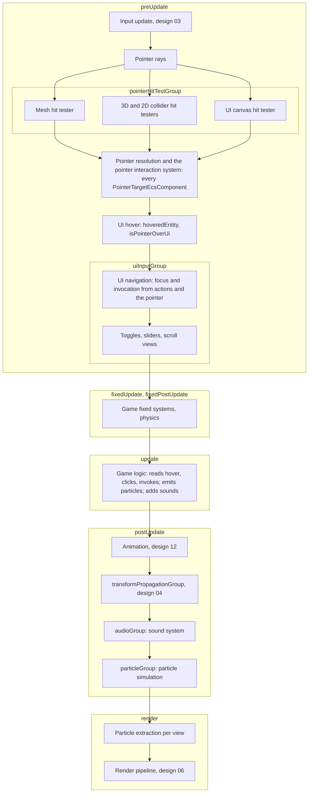
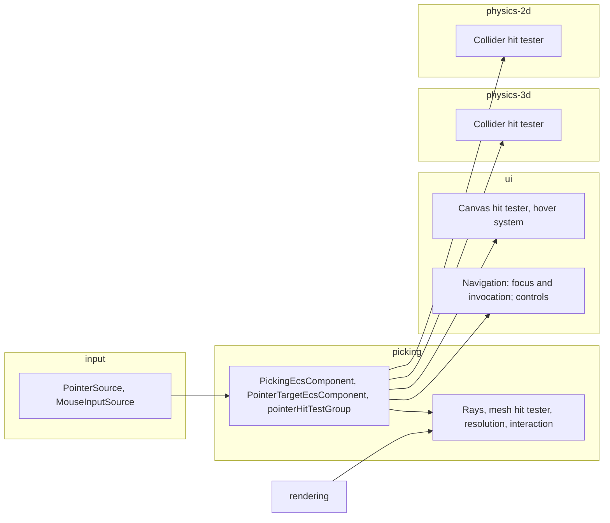

# Design 15: Audio, Particles and Picking in 3D

|                                       |                                                                                                                                                                                                                                                                                                                                                                                                                                                                                                                                                                                                                                                                                                                                                                   |
| ------------------------------------- | ----------------------------------------------------------------------------------------------------------------------------------------------------------------------------------------------------------------------------------------------------------------------------------------------------------------------------------------------------------------------------------------------------------------------------------------------------------------------------------------------------------------------------------------------------------------------------------------------------------------------------------------------------------------------------------------------------------------------------------------------------------------- |
| **Status**                            | Draft, for review (revised after solution review, §7)                                                                                                                                                                                                                                                                                                                                                                                                                                                                                                                                                                                                                                                                                                             |
| **Kind**                              | Feature and breaking refactor                                                                                                                                                                                                                                                                                                                                                                                                                                                                                                                                                                                                                                                                                                                                     |
| **Engine version at time of writing** | `0.26.1`                                                                                                                                                                                                                                                                                                                                                                                                                                                                                                                                                                                                                                                                                                                                                          |
| **Program**                           | [Forge 3D](./README.md), milestone M6                                                                                                                                                                                                                                                                                                                                                                                                                                                                                                                                                                                                                                                                                                                             |
| **Depends on**                        | [04 Transforms](./04-transforms.md), [06 Render pipeline](./06-render-pipeline.md), [14 Physics 3D](./14-physics-3d.md) (collider queries and the shared `TriangleTree`); [12 Skeletal and morph animation](./12-skeletal-and-morph-animation.md) for the sample game                                                                                                                                                                                                                                                                                                                                                                                                                                                                                             |
| **Related**                           | [03 ECS foundations](./03-ecs-foundations.md) (journals, change ticks, singletons, stages, message streams), [05 GPU device layer](./05-gpu-device.md) (instance attribute locations, texture units), [07 2D on the render pipeline](./07-2d-on-the-render-pipeline.md) (transparent sort keys, billboards, world-space canvases), [08 Meshes, materials and shaders](./08-meshes-materials-and-shaders.md) (kept CPU mesh data, materials, variants), [11 glTF and asset lifetime](./11-gltf-and-asset-lifetime.md) (sound and model assets), [13 Post-processing](./13-post-processing-and-anti-aliasing.md) (resolved scene depth), [01 Testing and benchmarks](./01-testing-and-benchmarks.md) (benchmarks, goldens, allocation specs, the comparison report) |

## 0. Targeted modules

| Path                                                                                                                                                                                                                                                                                 | Change   | Notes                                                                                                                                                                                                                                                                                   |
| ------------------------------------------------------------------------------------------------------------------------------------------------------------------------------------------------------------------------------------------------------------------------------------ | -------- | --------------------------------------------------------------------------------------------------------------------------------------------------------------------------------------------------------------------------------------------------------------------------------------- |
| `src/audio/components/sound-component.ts`                                                                                                                                                                                                                                            | Modified | `whenFinished` input; `positionSeconds` output                                                                                                                                                                                                                                          |
| `src/audio/components/spatial-sound-component.ts`                                                                                                                                                                                                                                    | New      | `SpatialSoundEcsComponent`, `addSpatialSoundComponent`                                                                                                                                                                                                                                  |
| `src/audio/components/audio-listener-component.ts`                                                                                                                                                                                                                                   | New      | `AudioListenerEcsComponent`, `addAudioListenerComponent`                                                                                                                                                                                                                                |
| `src/audio/systems/sound-system.ts`                                                                                                                                                                                                                                                  | Modified | Rewritten: journals instead of `trackedSounds`/`updateCount`; spatial processing; `postUpdate`; takes the mixer and the clock                                                                                                                                                           |
| `src/audio/internal/sound-instance.ts`, `audio-internals.ts`                                                                                                                                                                                                                         | Modified | A spatial stage between the instance's gain and the bus: a `PannerNode`, or a `StereoPannerNode` with its own attenuation `GainNode`; position, orientation and pan parameters at `k-rate`, moved by ramps that end; `detune` for doppler; the mixer keeps one sound table per world    |
| `src/audio/internal/spatial-math.ts`                                                                                                                                                                                                                                                 | New      | Listener-relative positions, distance models, cones, doppler                                                                                                                                                                                                                            |
| `src/audio/play-sound-at.ts`, `register-audio.ts`                                                                                                                                                                                                                                    | New      | One-shot spatial sounds as entities; the audio group and system                                                                                                                                                                                                                         |
| `src/audio/test-helpers/fake-audio-context.ts`                                                                                                                                                                                                                                       | Modified | Fake `PannerNode` and `StereoPannerNode`; records `automationRate` and parameter calls                                                                                                                                                                                                  |
| `src/particles/particle-effect.ts`, `shapes.ts`, `curves.ts`                                                                                                                                                                                                                         | New      | `ParticleEffect`, `createParticleEffect`, spawn shapes, directions, curves and gradients                                                                                                                                                                                                |
| `src/particles/components/particle-emitter-component.ts`                                                                                                                                                                                                                             | Modified | One effect per component, structure-of-arrays particle storage, emission state                                                                                                                                                                                                          |
| `src/particles/components/particle-component.ts`, `particle-emitter.ts`                                                                                                                                                                                                              | Removed  | Particles stop being entities; `ParticleEmitter` (class) becomes `ParticleEffect`                                                                                                                                                                                                       |
| `src/particles/systems/particle-emitter-system.ts`, `particle-position-system.ts`, `particle-opacity-system.ts`                                                                                                                                                                      | Removed  | Replaced by one simulation system                                                                                                                                                                                                                                                       |
| `src/particles/systems/particle-simulation-system.ts`, `particle-extraction-system.ts`                                                                                                                                                                                               | New      | Simulation in `postUpdate`; per-view instances in `render`                                                                                                                                                                                                                              |
| `src/particles/utilities/`                                                                                                                                                                                                                                                           | Modified | `emitParticles`, `spawnParticleBurst`, `detachParticleEmitter`, `createParticleMaterial`; `emit-particle-burst.ts`, `spawn-particle.ts` replaced                                                                                                                                        |
| `src/particles/register-particles.ts`                                                                                                                                                                                                                                                | New      | The particle group, simulation and extraction systems                                                                                                                                                                                                                                   |
| `src/common/components/age-scale-component.ts`, `src/common/systems/age-scale-system.ts`                                                                                                                                                                                             | Removed  | Their only user was particles (§6.3.13)                                                                                                                                                                                                                                                 |
| `src/picking/` (new module, `@forge-game-engine/forge/picking`)                                                                                                                                                                                                                      | New      | The picking singleton, `PointerTargetEcsComponent` (UI elements and world objects), rays, the mesh hit tester, resolution and the one pointer interaction system, `raycastMeshes`, `preparePicking`; `package.json` `exports` and `src/index.ts`                                        |
| `src/rendering/meshes/mesh.ts`                                                                                                                                                                                                                                                       | Modified | A `TriangleTree` (design 14, `src/math/geometry/triangle-tree.ts`) built on first use and released with the mesh                                                                                                                                                                        |
| `src/rendering/gpu-scene/`                                                                                                                                                                                                                                                           | Modified | `raycastBounds`: a ray query over the static tree and dynamic spheres                                                                                                                                                                                                                   |
| `src/rendering/shaders/forge/`, `src/rendering/materials/unlit-material.ts`                                                                                                                                                                                                          | Modified | Particle instance variants of `forge/vertex` and `forge/object`; `softDistance` reading the view's scene depth                                                                                                                                                                          |
| `src/rendering/pipeline/`                                                                                                                                                                                                                                                            | Modified | `sceneDepth` view resource, shared with ambient occlusion (design 13)                                                                                                                                                                                                                   |
| `src/input/pointer-source.ts`                                                                                                                                                                                                                                                        | New      | `PointerSource`, moved from `src/ui/types/ui-pointer-source.ts`, with `buttonsHeld` (which `MouseInputSource` already has) and `isLocked`                                                                                                                                               |
| `src/input/mouse/input-sources/mouse-input-source.ts`                                                                                                                                                                                                                                | Modified | Pointer lock (`pointerLock`, `isLocked`), raw movement where the browser offers it; the Y-down `delta` getter removed (§6.4.3)                                                                                                                                                          |
| `src/input/mouse/bindings/mouse-motion-binding.ts`                                                                                                                                                                                                                                   | New      | `MouseMotionBinding`: per-frame movement for an `Axis2dAction`, Y-up                                                                                                                                                                                                                    |
| `src/ui/types/ui-pointer-source.ts`, `src/ui/systems/ui-raycast-system.ts`, `src/ui/systems/ui-interaction-system.ts`                                                                                                                                                                | Removed  | Replaced by `PointerSource`, the canvas hit tester and hover system, and picking's pointer interaction system (§6.4.10)                                                                                                                                                                 |
| `src/ui/components/ui-interactable-component.ts`                                                                                                                                                                                                                                     | Modified | Keeps `interactable`, `focusable`, `isFocused`, `onInvoke`, `wasInvokedThisFrame`. The pointer events, `isHovered`, `isPressed`, `isDragging`, `pressCapture`, `dragThreshold` and `receivesDrag` move to `PointerTargetEcsComponent`; `blocksRaycasts` becomes `pointerTransparentTag` |
| `src/ui/systems/ui-canvas-hit-test-system.ts`, `ui-hover-system.ts`                                                                                                                                                                                                                  | New      | UI canvases as a hit tester; `hoveredEntity` and `isPointerOverUi` from the resolved hit                                                                                                                                                                                                |
| `src/ui/systems/ui-navigation-system.ts`                                                                                                                                                                                                                                             | Modified | The one writer of focus and invocation: submit and navigation actions, and pointer clicks and hover focus read from the picking singleton; `preUpdate`                                                                                                                                  |
| `src/ui/systems/ui-slider-system.ts`, `ui-scroll-rect-system.ts`, `ui-toggle-system.ts`, `ui-transition-system.ts`, `ui-tooltip-system.ts`, `src/ui/types/ui-interaction-visual-state.ts`                                                                                            | Modified | Read pointer state from the element's `PointerTargetEcsComponent` and the pointer from the picking singleton; sliders and scroll views check their own element's interactable state                                                                                                     |
| `src/ui/utilities/create-button.ts`, `create-slider.ts`, `create-toggle.ts`, `create-scroll-view.ts`, `create-text-input.ts`, `create-tooltip.ts`                                                                                                                                    | Modified | Add a `PointerTargetEcsComponent` beside the interactable and return it; the tooltip reads its source's target                                                                                                                                                                          |
| `src/ui/utilities/raycast-ui-canvas.ts`, `resolve-canvas-pointer-position.ts`, `sort-by-draw-order.ts`, `register-ui-systems.ts`                                                                                                                                                     | Modified | Ray-plane hits in the canvas root's space; pointer targets tested; no allocation; no module-scope resolver; no `pointerSource` option                                                                                                                                                   |
| `src/physics-3d/picking/`, `src/physics-2d/picking/` (modules from design 14), `src/physics-2d/overlap/overlap-point-2d.ts`                                                                                                                                                          | New      | Collider hit testers; `overlapPoint2d`, the 2D point query the 2D tester needs                                                                                                                                                                                                          |
| `documentation-site/docs/docs/audio/`, `particles/`, `picking/` (new), `input/mouse.md`, `ui/buttons-and-interaction.md`, `ui/controls.md`, `ui/scroll-views.md`, `ui/creating-a-canvas.md`, `ui/canvas-groups-and-tooltips.md`, `rendering/visibility.md`, `common/index.md`, `3d/` | Modified | §6.10                                                                                                                                                                                                                                                                                   |
| `documentation-site/src/pages/demos/particles/`, `visibility/`, `courtyard/` (new), `src/data/demos.ts`                                                                                                                                                                              | Modified | Migrated particle demos; the M6 sample game                                                                                                                                                                                                                                             |
| `documentation-site/src/pages/demos/` `ui-button/`, `ui-slider/`, `ui-scroll-view/`, `ui-dropdown/`, `ui-text-input/`, `ui-canvas-group/`, `ui-main-menu/`, `ui-toggle/`, `ui-nested-resize/`, `layout-groups/`, `persistent-state/`                                                 | Modified | `registerPicking` instead of `registerUiSystems`'s `pointerSource`; `ui-main-menu`'s rows, built with `addUiInteractableComponent`, add a pointer target                                                                                                                                |
| `e2e/fixtures/scenes/ui-text-input.ts`, `ui-scroll-view.ts`                                                                                                                                                                                                                          | Modified | `registerPicking`; elements built with `addUiInteractableComponent` (the scroll view's items, the text input scene's button and the cover that blocks the pointer) add a pointer target                                                                                                 |
| `e2e/specs/`, `e2e/fixtures/scenes/`, `e2e/golden/`, `e2e/allocation/`, `bench/`                                                                                                                                                                                                     | Modified | §6.9                                                                                                                                                                                                                                                                                    |
| `.claude/skills/create-component/SKILL.md`                                                                                                                                                                                                                                           | Modified | Its naming example (`ageScaleId`/`'ageScale'`) names a component that no longer exists; `particleEmitterId`/`'particleEmitter'` replaces it                                                                                                                                             |
| `AGENTS.md`                                                                                                                                                                                                                                                                          | Modified | `/picking` in the repository structure; particles aren't entities; UI elements and world objects take pointer input through `PointerTargetEcsComponent`                                                                                                                                 |

---

## 1. Summary

Three gameplay features stop at 2D today.

**Audio** plays sounds through a mixer of buses, as one-shots
(`playSound`) or owned by an entity (`SoundEcsComponent`), but every sound
is heard the same wherever it is. Nothing positions a sound
(`src/audio/` has no `PannerNode`). The sound system also keeps the state
design 03 §6.5 names in its closure: a `trackedSounds` map from component
to playing instance and an `updateCount` used to notice removals
(`src/audio/systems/sound-system.ts`).

**Particles** are entities. Each spawn creates an entity with a copied
sprite, a particle component, a lifetime, a removal tag, an age-scale
component and three transform components
(`src/particles/utilities/spawn-particle.ts`). Ten thousand sparks are ten
thousand entities going through structural changes, transform propagation
and sprite extraction. Spawn shapes and directions are 2D.

**Picking** exists only for UI: `createUiRaycastEcsSystem` hit-tests the
pointer against each canvas's rectangles, and `createUiInteractionEcsSystem`
runs hover, press, drag and invoke on `UiInteractableEcsComponent`s.
Nothing tells a game which 3D object is under the pointer, and the mouse
source has no pointer lock for first-person cameras.

This design adds:

- **Spatial audio.** An `AudioListenerEcsComponent` (one per world,
  enforced) and a `SpatialSoundEcsComponent` that makes a sound
  positional. Positions come from `transform.world` after propagation.
  They're sent to Web Audio relative to the listener, which keeps
  precision far from the origin and avoids the listener parameters
  Firefox lacks. 3D sounds use a `PannerNode` (equal-power or HRTF,
  distance models, cones); 2D games use stereo panning by the sound's
  offset along the listener's X, with an attenuation gain of its own.
  Doppler is a per-sound pitch shift. Moving parameters run at `k-rate`
  and move by ramps that end, so the audio thread does per-block work for
  moving sounds and none for still ones. The sound system's closure state
  moves to journals, a table owned by the mixer, and component outputs.
- **3D particles.** An emitter owns its particles in structure-of-arrays
  storage inside its component. A shared, immutable `ParticleEffect`
  describes spawn shapes (point, sphere, hemisphere, cone, box, circle,
  edge), directions, emission, forces, curves over lifetime and how
  particles draw: camera-facing, velocity-stretched or upright billboards,
  or instanced meshes, through design 08 materials, sorted for blending,
  with soft edges against opaque geometry. The 2D particle API is replaced
  outright; a migrated 2D effect's particles start with the same values and
  draw in the same order as before (§6.3.13).
- **Picking.** One pointer pipeline per world. Each frame, rays from the
  cameras under the pointer go to **hit testers**: meshes (design 06's
  bounds tree, then triangle trees over design 08's kept CPU data, joint
  spheres for skinned meshes), 3D and 2D colliders (design 14) and UI
  canvases (including world-space canvases in 3D, by ray against the
  canvas plane). The nearest hit of the topmost camera wins, and one
  pointer interaction system writes hover, press, click and drag state
  onto `PointerTargetEcsComponent`s, for UI elements and world objects
  alike. It replaces UI's own state machine; UI keeps focus, navigation
  and invocation. Pointer lock and raw mouse motion complete first-person
  input.

Phase 6 builds the M6 **sample game**, a small third-person scene on the
docs site that uses every design in the program together, and the
milestone's **comparison report** against Three.js and Unity. Phase 7 adds
the particle features the sample game doesn't need.

---

## 2. Scope

### In scope

- The listener and spatial sound components; 3D and stereo panning;
  distance models and cones; smoothed parameter changes with a budgeted
  audio-thread cost; doppler; spatial one-shots; debug drawing of sound
  ranges.
- Moving the sound system's state out of its closure (design 03 §6.5).
- Particle effects, emitter storage, emission (rate, bursts, and in
  Phase 7 distance), simulation in world or local space, 3D spawn shapes
  and directions, curves and gradients over lifetime, flipbooks, and in
  Phase 7 prewarming.
- Particle rendering: billboards (view, velocity, upright, emitter plane),
  instanced meshes (shadow casting in Phase 7), any design 08 material,
  sorting, soft particles.
- Replacing the 2D particle API, its demos, guides and the age-scale
  component, with no compatibility layer.
- The picking module: rays, hit testers, resolution across cameras and UI,
  pointer targets and the one pointer state machine for UI elements and
  world objects, queries for game code, and preparation of triangle trees
  behind a loading screen.
- UI on the picking pipeline: UI's own hit test and pointer state machine
  are replaced, and UI keeps focus, navigation and invocation;
  world-space canvases hit in 3D; the parented world-space canvas hit-test
  defect (§6.4.9).
- Pointer lock and per-frame mouse motion in the input module.
- The M6 sample game, an e2e integration scene, and the M6 comparison
  report.

### Out of scope

- **Occlusion, obstruction and reverb zones.** Sounds aren't muffled by
  walls, and rooms don't reverberate. Buses can't host effects yet; open
  question 4.
- **Voice limits and virtualizing inaudible sounds.** Open question 2.
- **glTF audio** (`KHR_audio_emitter`). It isn't ratified at the time of
  writing (an assumption); design 11's extension table should list it as
  unsupported.
- **GPU particle simulation.** WebGL2 has no compute shaders; transform
  feedback is possible but the WebGPU backend is the place for it (open
  question 5).
- **Particle collisions** (with physics or the depth buffer), **sub-emitters**,
  **trails and ribbons**, **lit billboards with normal maps**, particle
  lights. Later features; the storage leaves room for them.
- **Several pointers** (multi-touch). One pointer per world; open
  question 1.
- **Exact picking of alpha-tested texels and vertex-hook displacement.**
  Picking tests the mesh's CPU triangles (§6.4.6). A GPU pick pass is
  open question 6.
- **Picking through render-to-texture surfaces** (a camera whose target is
  drawn on a mesh).
- **2D sprite picking without colliders.** 2D games pick through 2D
  colliders and UI, as Unity's 2D raycaster does.
- **Touch as a pointer.** The `PointerSource` shape allows a touch source
  later; the mouse source keeps using mouse events.
- **Pointer events on ancestors.** Enter, exit, press and click go to the
  nearest target only (GP23); only a drag is handed to an ancestor that
  receives drags, as UI does today.

---

## 3. Phases

Every phase lands after M5 (all earlier designs are in place, including
design 14's `TriangleTree` in `src/math/geometry`) and is releasable on its
own. The audio phase (1), the particle phases (2 and 3) and the picking
phases (4 and 5) don't depend on one another; Phase 6 needs all of them;
Phase 7 needs only Phases 2 and 3.

### Phase 1: Spatial audio

| #   | Task                       | Description                                                                                                                                                                                        | Size |
| --- | -------------------------- | -------------------------------------------------------------------------------------------------------------------------------------------------------------------------------------------------- | ---- |
| 1.1 | Sound system state         | §6.2.3: journals replace `trackedSounds`'s removal scan; the mixer's per-world table; `positionSeconds`; `whenFinished`; `postUpdate`                                                              | M    |
| 1.2 | Listener and spatial sound | §6.2.2: components, factories, the one-listener check                                                                                                                                              | S    |
| 1.3 | 3D panning                 | §6.2.4, §6.2.5: listener-relative positions and orientations on a `PannerNode`; cones; distance models                                                                                             | M    |
| 1.4 | Stereo panning             | §6.2.6: a `StereoPannerNode` and an attenuation `GainNode` of the spatial stage's own, with CPU attenuation, for 2D games                                                                          | S    |
| 1.5 | Parameter updates          | §6.2.8: first values set exactly before start; `k-rate` position, orientation and pan parameters; later values by ramps that end; updates only on change                                           | S    |
| 1.6 | Doppler                    | §6.2.9: per-sound level, detune, clamps                                                                                                                                                            | S    |
| 1.7 | `playSoundAt`, debug draw  | §6.2.10, §6.2.11                                                                                                                                                                                   | S    |
| 1.8 | Audio render benchmark     | §6.8.1: an `OfflineAudioContext` scene benchmark of the audio thread's render time, driven by the real sound system                                                                                | S    |
| 1.9 | Tests, guide, changelog    | Unit tests with the fake context's panner nodes; `spatial-audio` e2e and allocation specs; `spatial-audio.md`; `#### Added`, `#### Changed` (`createSoundEcsSystem(mixer, time)`, `registerAudio`) | M    |

**Definition of done:** the spatial-audio e2e spec measures a louder right
channel for a sound to the listener's right, half the level at twice the
reference distance under the inverse model, and the sides swapping when
the listener turns 180°; the main-thread and audio-thread budgets in
§6.8.1 are met; the sound system's closure holds only the mixer and the
clock; the `audio-mixer` spec passes with only its scene's system
registration updated.

### Phase 2: Particle storage and simulation

| #   | Task                       | Description                                                                                                                                                                                                | Size |
| --- | -------------------------- | ---------------------------------------------------------------------------------------------------------------------------------------------------------------------------------------------------------- | ---- |
| 2.1 | `ParticleEffect`           | §6.3.2: options, validation, baked curves and gradients                                                                                                                                                    | M    |
| 2.2 | Shapes and directions      | §6.3.3: point, sphere, hemisphere, cone, box, circle, edge; outward, cone, arc; random draws in today's order                                                                                              | M    |
| 2.3 | Emitter component, storage | §6.3.4: one effect per component; typed arrays sized to `maxParticles`; swap removal; spawn sequence numbers                                                                                               | M    |
| 2.4 | Emission                   | §6.3.5: rate, `emitParticles` with `overSeconds`; sub-frame spreading for streams only                                                                                                                     | M    |
| 2.5 | Simulation                 | §6.3.6, §6.3.7: world and local space, bounds, `whenEmpty`, visibility                                                                                                                                     | M    |
| 2.6 | View-facing billboards     | §6.3.9: extraction into the transparent phase with `view` and `emitter` alignment, through `createParticleMaterial`                                                                                        | M    |
| 2.7 | Migration                  | §6.3.13: the particles and visibility demos, guides, e2e and allocation scenes; age scale removed, and the `create-component` skill's example that names it; `spawnParticleBurst`, `detachParticleEmitter` | M    |
| 2.8 | Benchmarks and changelog   | The 2D particle stress scene measured by design 01's runner on `0.26.1` (its own version of the scene) and on the head; `#### Changed` and `#### Removed` with the migration                               | S    |

**Definition of done:** the spawn-equivalence test (§6.3.13) shows a
seeded burst producing the same start values as the entity-per-particle
code; the migrated 2D particle golden is re-captured with the old and new
images and the reason for each difference in the pull request (design 01
§6.4.3); spawning and expiring 10,000 particles a second allocates nothing;
the 2D particle stress scene is at least five times faster in CPU time
than on `0.26.1`.

### Phase 3: Particles in 3D

| #   | Task                 | Description                                                                                                     | Size |
| --- | -------------------- | --------------------------------------------------------------------------------------------------------------- | ---- |
| 3.1 | Alignments           | §6.3.9: `velocity` (stretched) and `upright` billboards                                                         | S    |
| 3.2 | Sorting              | §6.3.10: back to front by depth, then oldest first, for blended materials; none for additive and multiply       | S    |
| 3.3 | Flipbooks            | Frames over lifetime or at a frame rate                                                                         | S    |
| 3.4 | Soft particles       | §6.3.11: `UnlitMaterial.softDistance`, the shared `sceneDepth` view resource                                    | M    |
| 3.5 | Mesh particles       | §6.3.12: instanced meshes with any material and orientation, in the opaque, alpha-tested and transparent phases | M    |
| 3.6 | Goldens, guide, demo | §6.9; `rendering-particles.md`; a 3D effects demo (fire, smoke, sparks, debris, rain)                           | M    |

**Definition of done:** the particle goldens pass; the soft-particle
analytic test shows a fade along the intersection; the particle benchmark
(§6.8.2) meets its budget.

### Phase 4: Picking: meshes and UI

UI moves onto the picking pipeline in the same release, so a screen-space
button over a 3D target blocks it from the first release that has 3D
targets, and there is one pointer state machine from that release on,
with no interim rule to delete later.

| #    | Task                       | Description                                                                                                                                                                                                                                                                                                          | Size |
| ---- | -------------------------- | -------------------------------------------------------------------------------------------------------------------------------------------------------------------------------------------------------------------------------------------------------------------------------------------------------------------- | ---- |
| 4.1  | `PointerSource`            | §6.4.3: moved to `input` with `buttonsHeld` and `isLocked` (false until Phase 5); `UiPointerSource` deleted, callers updated                                                                                                                                                                                         | S    |
| 4.2  | Singleton, targets, rays   | §6.4.4, §6.4.5: `registerPicking`, `PickingEcsComponent`, `PointerTargetEcsComponent`, `pointerTransparentTag`, `pointerHitTestGroup`                                                                                                                                                                                | M    |
| 4.3  | Mesh triangle trees        | `Mesh` builds design 14's `TriangleTree` on first request and releases it in `dispose`                                                                                                                                                                                                                               | S    |
| 4.4  | Mesh hit tester            | §6.4.6.1: `raycastBounds` on the GPU scene; triangles; joint spheres for skinned meshes                                                                                                                                                                                                                              | M    |
| 4.5  | Resolution and interaction | §6.4.7, §6.4.8: ordering across cameras and ties; the one state machine: hover, press, click, drag with hand-off to a receiving ancestor, cancellation                                                                                                                                                               | M    |
| 4.6  | UI hit tester and hover    | §6.4.9: canvases append hits for pointer targets; `createUiHoverEcsSystem` writes `hoveredEntity`; `createUiRaycastEcsSystem` deleted; no per-frame allocation                                                                                                                                                       | M    |
| 4.7  | World-space canvases in 3D | Ray against the canvas root's plane; rect space from the root's local space (the parented-canvas fix); back faces ignored                                                                                                                                                                                            | M    |
| 4.8  | UI on pointer targets      | §6.4.10: the interactable's pointer fields move to the target; `createUiInteractionEcsSystem` deleted; navigation becomes the one writer of focus and invocation; sliders, scroll views, toggles, transitions and tooltips read targets; `blocksRaycasts` becomes the tag; `registerUiSystems` loses `pointerSource` | L    |
| 4.9  | UI migration               | The eleven UI demos and `visibility` (§0), the `ui-text-input` and `ui-scroll-view` e2e scenes, the `ui/` and `rendering/visibility.md` guides                                                                                                                                                                       | M    |
| 4.10 | Game queries               | §6.4.11: `raycastMeshes`, `preparePicking`, `drawHits`                                                                                                                                                                                                                                                               | S    |
| 4.11 | Tests, guides, changelog   | Unit and property tests; `picking-3d`, `picking-high-dpi` and `ui-world-space-3d` specs with real mouse events; allocation specs; `picking/` guides; `#### Added`, `#### Changed`, `#### Removed`, `#### Fixed`                                                                                                      | L    |

**Definition of done:** every existing UI e2e spec passes with only its
scene's registration and target components updated; in the `picking-3d`
spec, moving the real mouse over a box hovers it, a click on it raises
`onClick` once, a box behind a wall is never hovered, a screen-space button
over a box takes the click, and the hovered box's rendered color changes
(a relative pixel measurement); the `picking-high-dpi` spec does the same
at a device pixel ratio of 2; a world-space canvas on a rotated panel takes
clicks on its button and doesn't when a box stands between it and the
camera; nothing in `/src` but the pointer interaction system writes a
pointer target's outputs; the picking benchmark meets §6.8.3; B8 is no
slower than the baseline and the UI pointer path allocates nothing.

### Phase 5: Colliders and pointer lock

| #   | Task                     | Description                                                                                                                            | Size |
| --- | ------------------------ | -------------------------------------------------------------------------------------------------------------------------------------- | ---- |
| 5.1 | Collider hit testers     | §6.4.6.2, §6.4.6.3: design 14's `castRayAll` (3D) and `overlapPoint2d` (2D, added here), registered by the physics modules             | S    |
| 5.2 | Pointer lock and motion  | §6.4.3: `pointerLock`, `isLocked`, raw movement, `MouseMotionBinding`; the locking press is consumed; `MouseInputSource.delta` removed | M    |
| 5.3 | Tests, guides, changelog | Collider picking unit tests; `pointer-lock` spec; `input/mouse.md`, `picking/index.md`; `#### Added`, `#### Removed`                   | S    |

**Definition of done:** an invisible collider on a target takes clicks; a
2D collider under a pointer target in an orthographic view is hovered and
clicked, the topmost by draw order when two overlap; a click locks the
pointer without triggering a bound action, and mouse movement reaches a
`MouseMotionBinding` with `y` up.

### Phase 6: The sample game and the comparison report

| #   | Task                      | Description                                                                                                                                                               | Size |
| --- | ------------------------- | ------------------------------------------------------------------------------------------------------------------------------------------------------------------------- | ---- |
| 6.1 | Integration scene         | `e2e/fixtures/scenes/gameplay-3d.ts`: a capsule moved by design 14's character mover, a clickable box with a spatial sound, an emitter; spec and allocation spec (§6.9.2) | M    |
| 6.2 | Sample game               | §6.6: the `courtyard` demo, its assets and the `3d/making-a-3d-game.md` walkthrough                                                                                       | XL   |
| 6.3 | Budgets on the references | The sample game and every M6 scene measured on the reference hardware (§6.8)                                                                                              | S    |
| 6.4 | Comparison report         | §6.7: `bench/reports/m6.md` with B1 to B9, the M6 scenes, Three.js (plain and optimized) and Unity (B1 to B5)                                                             | M    |

**Definition of done:** the sample game runs on the docs site within its
budget on the reference hardware; the integration spec and its allocation
spec pass; the M6 report is committed and every README §5 budget is met or
has an open, linked issue; the README's program definition of done is
checked against it.

### Phase 7: Particle extras

Features the sample game doesn't need, kept out of the path to the M6
proof. Each task ships on its own.

| #   | Task                  | Description                                                                                                                                                 | Size |
| --- | --------------------- | ----------------------------------------------------------------------------------------------------------------------------------------------------------- | ---- |
| 7.1 | Distance emission     | §6.3.5: `ratePerMeter`, spread along the emitter's path                                                                                                     | S    |
| 7.2 | Prewarm               | `prewarmSeconds`: the first run simulates that long in 1/30 s steps                                                                                         | S    |
| 7.3 | Mesh particle shadows | §6.3.12: `castsShadows`; instance streams in design 09's shadow views; moving casters invalidate cached local shadow tiles                                  | M    |
| 7.4 | Tests, guides, golden | Distance emission per meter at any speed; prewarming equals simulating; a mesh-particle shadow golden; `effects.md`, `rendering-particles.md`; `#### Added` | S    |

**Definition of done:** a fast emitter with `ratePerMeter` leaves evenly
spaced particles at 20 to 240 fps; a prewarmed emitter's first frame
matches an emitter simulated for the same time; mesh particles with
`castsShadows` cast shadows in the golden; B3 and B5 are unchanged when no
emitter casts.

---

## 4. Decision log

| #    | Decision                                             | Options                                                                                                                                                                                                                                                                                                                 | Chosen | Rationale, trade-offs, assumptions                                                                                                                                                                                                                                                                                                                                                                                                                                                                                                                                                                                                                                                                                          |
| ---- | ---------------------------------------------------- | ----------------------------------------------------------------------------------------------------------------------------------------------------------------------------------------------------------------------------------------------------------------------------------------------------------------------- | ------ | --------------------------------------------------------------------------------------------------------------------------------------------------------------------------------------------------------------------------------------------------------------------------------------------------------------------------------------------------------------------------------------------------------------------------------------------------------------------------------------------------------------------------------------------------------------------------------------------------------------------------------------------------------------------------------------------------------------------------- |
| GP1  | How many listeners                                   | (a) One `AudioListenerEcsComponent` per world, enforced; (b) several, with an `active` flag; (c) a singleton component                                                                                                                                                                                                  | (a)    | Web Audio has one listener per context, and Unity warns on two. The listener belongs on a camera or character entity with a transform, which a singleton (an entity of its own, design 03 §6.4) can't be. The factory throws on a second; the sound system throws if it finds two added another way. Switching listeners is removing one and adding the other.                                                                                                                                                                                                                                                                                                                                                              |
| GP2  | Where spatial settings live                          | (a) A `SpatialSoundEcsComponent` next to the `SoundEcsComponent`; (b) fields on `SoundEcsComponent`; (c) separate 2D and 3D components                                                                                                                                                                                  | (a)    | Composition: a sound without it costs no panner and reads exactly as today. Adding or removing it is structural, so journals see it, and the sound keeps playing while its panner is inserted or removed. Godot splits players by kind; Unity blends with a slider on one component. One component with a `panning` value covers 2D and 3D, following README §4.5 (audio has no suffix).                                                                                                                                                                                                                                                                                                                                    |
| GP3  | How positions reach Web Audio                        | (a) Each panner gets the sound's position and orientation relative to the listener; the Web Audio listener stays at its default; (b) write the listener's position and orientation to `AudioListener`                                                                                                                   | (a)    | `AudioListener`'s position and orientation parameters aren't available in Firefox (assumption, from the compatibility tables and PlayCanvas's reports; only the deprecated `setPosition` exists there), so (b) needs two code paths and can't be smoothed in Firefox. Relative positions are also the audio form of README §4.3: `float32` parameters stay precise near the listener in a world 10,000 km wide. Cost: a moving listener updates every spatial sound, which is 3 parameter calls per sound, 6 with a cone (§6.8.1).                                                                                                                                                                                          |
| GP4  | Panning for 2D                                       | (a) A `StereoPannerNode` panned by the listener-space X offset over `stereoWidth`, with attenuation computed on the CPU by the same distance models and applied by an attenuation `GainNode` of the spatial stage's own; (b) a `PannerNode` with sounds in the XY plane; (c) attenuation written to the instance's gain | (a)    | With (b), a listener in the plane of its sounds (a 2D camera at `z = 0`) hears any sound slightly to the right at 90° azimuth, fully right: equal-power panning projects onto the listener's horizontal plane. Godot's 2D player pans by screen-relative X the same way (a). (c) would give the instance's gain two writers: `setVolume` ramps it for volume changes and `stop` fades it out (`sound-instance.ts`), and an attenuation write would cancel either. The spatial stage owns its own node, as the `PannerNode` owns its distance gain in 3D.                                                                                                                                                                    |
| GP5  | Doppler                                              | (a) A per-sound `dopplerLevel`, default 0, applied as `detune`; (b) none; (c) on by default as in Unity                                                                                                                                                                                                                 | (a)    | The Web Audio specification removed its built-in doppler, so any doppler is computed. On by default shifts the pitch of every voice and footstep whenever the camera moves, which is why Godot defaults it off. `detune` leaves `rate` exact, so `positionSeconds` stays exact for sounds without doppler and drifts by the shift's integral for those with it (documented).                                                                                                                                                                                                                                                                                                                                                |
| GP6  | Sound system state                                   | (a) Removals from journals; playing instances and the values last applied to them in a table the mixer owns per world; the playback position on the component; (b) keep the closure map                                                                                                                                 | (a)    | Design 03's state rule. An instance and the values applied to it are a derived cache of an audio resource, which belongs to its service (README §4.4). Where a paused sound resumes changes behavior and games want to read it, so it's a component output.                                                                                                                                                                                                                                                                                                                                                                                                                                                                 |
| GP7  | When sounds update                                   | (a) One system in `postUpdate` after transform propagation, for playback and spatial processing; (b) playback in `update`, spatial processing in `postUpdate`                                                                                                                                                           | (a)    | A sound started before its panner has a position would play its first block from the listener's own position. One system configures the panner before `start`. Sounds added in `update` or a fixed step still start the same frame.                                                                                                                                                                                                                                                                                                                                                                                                                                                                                         |
| GP8  | Particle storage                                     | (a) Structure-of-arrays storage owned by the emitter, inside its component; (b) an entity per particle, as today                                                                                                                                                                                                        | (a)    | Every engine with a particle system stores particles in arrays its system owns (Unity, Godot, Unreal's Niagara, the Hanabi crate for Bevy). An entity per particle pays a structural change per spawn and expiry, per-particle transform propagation and per-particle extraction. State stays in a component (README §4.4). Trade-off: particles can't carry game components; `onParticleSpawned` goes, and nothing in `/src`, `/demo`, `/e2e` or the docs site uses it.                                                                                                                                                                                                                                                    |
| GP9  | Effect description                                   | (a) An immutable `ParticleEffect`, validated and baked once, shared by any number of emitters; (b) mutable per-emitter options with `setOptions`, as today                                                                                                                                                              | (a)    | Fifty torches share one fire. Curves and gradients bake to lookup tables once, which a mutable object would have to re-bake on every write. Changing an effect is assigning another one (`emitter.effect = brighter`). Godot's process material is shared the same way.                                                                                                                                                                                                                                                                                                                                                                                                                                                     |
| GP10 | Emitters per entity                                  | (a) One effect per component; several effects on child entities; (b) a map of named emitters per component, as today                                                                                                                                                                                                    | (a)    | In 3D each effect wants its own offset (a muzzle flash and its smoke), which a child entity gives. One emitter per component also means one draw item, one bounds and one sort per component. Unity and Godot attach one particle system per object.                                                                                                                                                                                                                                                                                                                                                                                                                                                                        |
| GP11 | Shapes and directions                                | (a) A spawn shape for positions and a direction rule (outward, cone, arc); defaults are today's point and full circle in the emitter's XY plane; (b) direction always from the shape, as Unity's shapes do                                                                                                              | (a)    | Keeps today's `directionRange` and `emitOutward` expressible one-to-one, so 2D effects migrate without changing their look, and lets a 3D shape emit in any rule. Defaults are 2D because a 2D effect with a 3D default would drift in `z` (README §2: 2D stays first-class); 3D effects set `direction`.                                                                                                                                                                                                                                                                                                                                                                                                                   |
| GP12 | Which way shapes point                               | (a) Cones, hemispheres and cone directions open along the emitter's `-Z`; planar shapes lie in its XY plane; (b) along `+Y`                                                                                                                                                                                             | (a)    | README §4.1: anything that aims uses `-Z`, as spot lights and sound cones do. A fountain rotates its emitter up. XY planar shapes are where 2D effects already live.                                                                                                                                                                                                                                                                                                                                                                                                                                                                                                                                                        |
| GP13 | How particles draw                                   | (a) A per-view instance stream (like sprites, design 07 S4) through design 08 materials with particle instance variants; (b) GPU scene slots per particle                                                                                                                                                               | (a)    | Particles change every frame, so a persistent GPU copy would be rewritten whole each frame. Instance variants of the engine shader library mean `UnlitMaterial`, `PbrMaterial` and hooked materials all draw particles, with lights, shadows and fog intact.                                                                                                                                                                                                                                                                                                                                                                                                                                                                |
| GP14 | Sorting                                              | (a) Each emitter is one transparent item; inside it, blended materials sort back to front per view by depth, then oldest first by spawn sequence; additive and multiply don't sort; (b) one global per-particle sort; (c) depth then normalized age                                                                     | (a)    | A global sort of every particle against every transparent surface costs a sort over everything and breaks batching. Per-emitter sorting is what Unity and Godot do; overlapping emitters can pop, which `layer` resolves. Additive and multiply blending are order-independent, so sorting them is wasted work. Normalized age (c) puts a 1 s particle at 0.6 of its life above a 3 s particle spawned later, so a 2D view, where depths tie, wouldn't reproduce "later spawns on top". The spawn sequence is absolute-age order and also breaks ties within a burst.                                                                                                                                                       |
| GP15 | Soft particles                                       | (a) A shared, single-sample `sceneDepth` view resource after the prepass, read by materials with `softDistance`; (b) a depth copy owned by the particle module; (c) none                                                                                                                                                | (a)    | Hard lines where smoke meets the ground are the most visible particle artifact in 3D. WebGL2 can't sample the depth attachment the transparent pass is testing against, so a copy or resolve is needed. Design 13 already resolves depth for ambient occlusion; sharing one resource means at most one copy per view.                                                                                                                                                                                                                                                                                                                                                                                                       |
| GP16 | Where particles simulate                             | (a) On the CPU, in `postUpdate` after propagation, at the frame delta; (b) transform feedback on the GPU; (c) the fixed step                                                                                                                                                                                            | (a)    | Emitters on animated joints need this frame's world transforms. Particles are presentation, so they follow the frame's (scaled) delta as Unity's and Godot's CPU particles do. GPU simulation waits for WebGPU compute (open question 5).                                                                                                                                                                                                                                                                                                                                                                                                                                                                                   |
| GP17 | Hidden and removed emitters                          | (a) Hidden: no spawning, no drawing, simulation continues; removed: particles go with it; `detachParticleEmitter` lets them finish; (b) particles outlive the emitter, as entities do today                                                                                                                             | (a)    | Particles belong to the emitter, as in Unity and Godot. The common case for (b), a trail on a projectile that's destroyed, is `detachParticleEmitter` plus `whenEmpty: 'removeEntity'`. The visibility demo's sparks now hide with their beacon (§6.3.13).                                                                                                                                                                                                                                                                                                                                                                                                                                                                  |
| GP18 | How picking finds what's under the pointer           | (a) CPU rays against bounds, triangles and colliders; (b) a GPU ID buffer read back asynchronously                                                                                                                                                                                                                      | (a)    | Runtime picking in Unity, Godot and Unreal is ray-based. A WebGL2 readback is a frame or more late (or stalls), gives no hit point or normal without more targets, can't hit invisible colliders, and costs a draw pass. CPU rays answer the same frame with point, normal, triangle and joint. Trade-off: alpha-tested texels and vertex-hook displacement aren't exact (open question 6).                                                                                                                                                                                                                                                                                                                                 |
| GP19 | Picking architecture                                 | (a) One pipeline: rays per camera, hit testers owned by the modules that own the geometry, one resolution, one interaction system; (b) separate pickers for UI, meshes and physics                                                                                                                                      | (a)    | Bevy's picking (backends, one hover map) and Unity's event system (one raycaster per camera, one sorted result) work this way. It's the only way a world-space canvas and a mesh in front of it, or a screen UI over a 3D target, resolve correctly. Games add hit testers for their own geometry (height-map terrain, voxels). GP30 covers the state machine that consumes the result.                                                                                                                                                                                                                                                                                                                                     |
| GP20 | What blocks the pointer                              | (a) Every visible mesh and every non-sensor collider; only targets react; (b) only targets are tested                                                                                                                                                                                                                   | (a)    | With (b) a click goes through a wall to a target behind it. Bevy tests every visible mesh by default; Unity and Godot test every collider. Cost stays proportional to what's along the ray (bounds tree first). `pointerTransparentTag` opts an entity out.                                                                                                                                                                                                                                                                                                                                                                                                                                                                 |
| GP21 | Skinned meshes                                       | (a) Design 12's per-joint bounding spheres, posed by the joints' world matrices; (b) CPU skinning with `computeDeformedPositions` per pick                                                                                                                                                                              | (a)    | Joint spheres follow the pose, report which joint was hit, and cost about 60 sphere tests per character on the ray. CPU skinning of a 10,000-vertex character costs about half a millisecond per candidate. Games needing exact hits (head shots) use per-joint colliders, such as design 14's rag doll bodies, as Unity and Unreal games use physics hit boxes.                                                                                                                                                                                                                                                                                                                                                            |
| GP22 | When picking runs                                    | (a) `preUpdate`, after input, against last frame's transforms, layout and GPU scene; (b) `postUpdate`, after propagation                                                                                                                                                                                                | (a)    | The player clicked on last frame's image, which is exactly what (a) tests, and game code in `update` sees this frame's clicks. Bevy picks in `PreUpdate` for the same reason. Colliders are at the last fixed step's pose, which can differ from the interpolated drawn pose by one step of motion (documented).                                                                                                                                                                                                                                                                                                                                                                                                            |
| GP23 | Which entity gets pointer events                     | (a) The nearest of the hit entity and its ancestors with a `PointerTargetEcsComponent`; a drag goes to the nearest of the pressed target and its ancestors with `receivesDrag`; (b) every ancestor in turn (bubbling)                                                                                                   | (a)    | A glTF model is a tree of mesh entities; one target on its root makes the whole model clickable. Unity routes each event to the first handler up the hierarchy the same way, including a drag that starts on a button in a scroll view going to the scroll view, which is today's UI rule. Bubbling to every ancestor adds ordering and stop-propagation rules nothing needs yet.                                                                                                                                                                                                                                                                                                                                           |
| GP24 | Pointer lock                                         | (a) The game sets `pointerLock: 'locked'`; the mouse source requests the lock in its next press handler, with raw movement where supported, and consumes that press; (b) a `requestPointerLock()` call                                                                                                                  | (a)    | Browsers require user activation for the request, and game code runs in systems, not event handlers. Unity's web builds defer a cursor lock to the next user-initiated event for the same reason (assumption, from its documentation). The press that captures the mouse is the player asking for control, not an action. Raw movement (`unadjustedMovement`) is Chromium-only (assumption); elsewhere the lock falls back to accelerated movement.                                                                                                                                                                                                                                                                         |
| GP25 | Mouse motion as an action                            | (a) `MouseMotionBinding`, the frame's movement with `y` up, and `MouseInputSource.delta` removed; (b) a third cursor value type on `MouseAxis2dBinding`; (c) keep `delta` (Y-down) beside the binding                                                                                                                   | (a)    | Positions are DOM measurements (Y-down, as `MouseAxis2dBinding` reports); motion feeds look actions in engine space, where up is positive (`AGENTS.md`: sources translate at the boundary). One binding type with two conventions would be a trap. `delta` would be a second, Y-down way to read the same movement, and nothing in `/src`, `/demo`, `/e2e` or the docs site reads it (only its own test), so it goes.                                                                                                                                                                                                                                                                                                       |
| GP26 | Broad phase for mesh picking                         | (a) The GPU scene's static tree and dynamic sphere arrays (design 06 §6.8); (b) a separate tree owned by picking                                                                                                                                                                                                        | (a)    | The GPU scene already keeps every mesh's world bounds, hidden flags and categories, updated only on change. A second tree would duplicate that upkeep. Dynamic spheres are scanned brute force, which is how culling scans them (R9); 10,000 ray-sphere tests cost tens of microseconds.                                                                                                                                                                                                                                                                                                                                                                                                                                    |
| GP27 | Triangle trees                                       | (a) Design 14's `TriangleTree` in `src/math/geometry`, built for a `Mesh` on first use and kept with its CPU data, with `preparePicking` to build them behind a loading screen; (b) built for every mesh at load; (c) a picking-specific tree                                                                           | (a)    | Most meshes are never under the pointer; building for all would add to B9's load time. Three.js users attach trees to geometries the same way (three-mesh-bvh). The tree is derived from the mesh's own data, so the mesh owns it. One implementation serves mesh colliders and picking; design 14 places it in `math` from M5, so neither module depends on the other and nothing moves later. Open question 3 covers moving builds to workers.                                                                                                                                                                                                                                                                            |
| GP28 | The age-scale component                              | (a) Remove it; (b) keep it                                                                                                                                                                                                                                                                                              | (a)    | Its only user was particles, which now scale through `sizeOverLifetime`. A game scaling an entity over time uses a property animation (design 12). Removing what a fix made unnecessary is the change philosophy.                                                                                                                                                                                                                                                                                                                                                                                                                                                                                                           |
| GP29 | The sample game's content                            | (a) A level built from primitives and a few CC0 assets, one CC0 animated glTF character; (b) a purchased or bespoke asset set                                                                                                                                                                                           | (a)    | Assets must be redistributable on the docs site. Primitives keep the download small and show design 08's meshes. Assumption: a suitable CC0 rigged character with idle, walk, run and jump clips exists (Kenney and Quaternius publish such packs); open question 8.                                                                                                                                                                                                                                                                                                                                                                                                                                                        |
| GP30 | How many pointer state machines                      | (a) One `PointerTargetEcsComponent` and one pointer interaction system for UI elements and world objects; UI keeps focus, navigation and invocation; (b) a picking state machine for world targets beside UI's own on `UiInteractableEcsComponent`                                                                      | (a)    | The first draft had (b): two components with the same events, threshold, hover, press and capture, and two systems running the same rules for one pointer. Unity's event system and Bevy's picking run one state machine for UI and world objects. With one, the rules UI already gets right (enter and press in one frame, capture until release, the drag threshold, hand-off to a receiving ancestor, cancellation on hide) exist once, and a world-space canvas and the mesh behind it can't both believe they're hovered. Trade-off: a UI element that reacts to the pointer carries two components (the `create*` factories add both), and `createUiInteractionEcsSystem` and the UI raycast are deleted, not ported. |
| GP31 | Disabling pointer reactions                          | (a) A pointer target has no `interactable` flag: it always hovers, presses and blocks, and whoever reacts checks its own state (UI controls their interactable and canvas groups, game listeners their own); (b) an `interactable` flag on the target as well as on the UI interactable                                 | (a)    | With (b) a disabled button would need two flags set, or one system writing the other's input. Unity's event system delivers pointer events to a non-interactable `Selectable`, which ignores them; Bevy's `Pickable` controls hovering and blocking, not pressing. A UI element's visual state already shows `disabled` before `pressed` (`ui-interaction-visual-state.ts`), invocation checks interactability, and sliders and scroll views check it before moving (as Unity's `Slider.MayDrag` does). Behavior change: a drag starting inside a disabled scroll view is handed to it and ignored, where today the pressed element keeps it; neither invokes.                                                              |
| GP32 | Drag threshold units                                 | (a) CSS pixels of pointer movement on the page; (b) the canvas's reference pixels, as UI's `dragThreshold` is today                                                                                                                                                                                                     | (a)    | A threshold measures the player's hand, which moves on the screen. A 3D target has no canvas, and a world-space canvas's units shrink with distance from the camera, so (b) would make the same flick a drag up close and a click far away. Unity's `pixelDragThreshold` is in screen pixels. On a screen-space canvas whose reference resolution matches the page, nothing changes; sliders and scroll views use 0 either way.                                                                                                                                                                                                                                                                                             |
| GP33 | How hit testers report                               | (a) Append to `picking.hits`, a per-frame message stream (design 03 §6.5): many systems append, none edits an appended hit, the rays system clears it once per frame, the resolution reads it; each hit names its `tester` as a string; (b) one component per hit tester; (c) a closed `kind` union                     | (a)    | Bevy's backends send `PointerHits` messages that the hover system reads, and Unity's raycasters return results naming their module. A per-tester component would make resolution know every tester, which game testers (terrain, voxels) couldn't join. A closed `kind` union of mesh, collider and UI leaves game testers no value; a string names any tester, and only the UI hover system compares it (with `'ui'`).                                                                                                                                                                                                                                                                                                     |
| GP34 | How moving audio parameters update                   | (a) Position, orientation and pan parameters at `k-rate`, moved each frame by a linear ramp that ends one frame delta later; (b) `setTargetAtTime` each frame on `a-rate` parameters (the first draft); (c) values set once per frame with no smoothing                                                                 | (a)    | A parameter with automation in progress puts a `PannerNode` on its per-sample path in Chromium and WebKit, which recomputes azimuth, elevation and distance gain for every sample; an exponential target never finishes, so (b) keeps every panner there for good, at a cost the main-thread budget never sees. `k-rate` gives one value per 128-sample block, and a ramp that ends leaves still sounds with no automation at all. Three.js's positional audio ramps the same way. (c) steps the gain every frame and clicks. Assumption: where a browser doesn't implement `automationRate`, the assignment has no effect and the render benchmark reports that browser's cost.                                            |
| GP35 | Which spawns spread over the frame                   | (a) Streams only: rate, distance and `overSeconds` emission; a burst spawns at the current pose with age 0; (b) every spawn                                                                                                                                                                                             | (a)    | Spreading turns a stream into an even trail behind a fast emitter. A burst is an event at one instant (an explosion, an impact); spreading it would stagger its particles' ages and smear it along the emitter's path. Unity and Godot emit bursts at one time and interpolate only continuous emission.                                                                                                                                                                                                                                                                                                                                                                                                                    |
| GP36 | A billboard's height                                 | (a) `aspectRatio` (width over height, default 1) on the effect's billboard settings; (b) from the texture's or flipbook frame's aspect                                                                                                                                                                                  | (a)    | The material is any design 08 material: a `PbrMaterial`, a hooked material or a material with several textures has no one texture to measure, and a texture may be shared by sprites of other shapes. An explicit value is the same for every material. Migrated 2D effects set it from the sprite's width and height (§6.3.13).                                                                                                                                                                                                                                                                                                                                                                                            |
| GP37 | Distance emission, prewarm and mesh-particle shadows | (a) A seventh phase after the sample game; (b) inside the particle phases before it                                                                                                                                                                                                                                     | (a)    | The M6 proof doesn't use them: the sample game's dust is bursts, its fire can start cold, and its debris doesn't need shadows. Each is small and additive, so it ships on its own without holding up M6, and remains part of this design.                                                                                                                                                                                                                                                                                                                                                                                                                                                                                   |
| GP38 | Proving 2D effects keep their look                   | (a) A data-level test: a seeded burst produces the same start values as the entity-per-particle code; the 2D golden is re-captured with the reasons for each difference; (b) the new golden must match the old one within the default tolerance (the first draft)                                                       | (a)    | (b) can't hold: stream emission now spreads spawns over the frame (GP35) and the draw path changes from sprite entities to billboards, so pixels change for reasons that are intended. What must not change is what each particle starts with, which (a) checks exactly: shapes, directions and ranges draw random numbers in today's order (§6.3.3), and a new draw (a color blend) happens only when an effect uses it. Design 01 §6.4.3 makes a re-captured golden show old and new images with the reason.                                                                                                                                                                                                              |

---

## 5. Open questions

In priority order.

1. **Several pointers.** One pointer serves mouse games, and single taps on
   phones arrive as mouse events. Multi-touch (two-finger camera control while tapping a target)
   needs several. Options: (a) one pointer now; (b) a list of pointers in
   the singleton, each with its own rays, hover and capture, as Bevy keeps
   pointers as entities. Proposal: (a) in M6. The rays, hits and capture are
   already computed per pointer, so (b) changes the singleton's shape (a
   list of pointer states) without changing the algorithms.
2. **Voice management.** A world with hundreds of looping spatial sounds
   plays all of them, audible or not. Options: (a) a per-bus voice limit
   with priorities, and virtualizing sounds below an audibility threshold
   (keeping their clock, dropping their nodes); (b) leave it to games.
   Proposal: (a), in a follow-up design once the sample game shows where
   the cost is.
3. **Triangle trees at load.** A Sponza-sized mesh builds its tree in about
   100 ms (§6.8.3). Options: (a) `preparePicking` on the main thread, in
   slices; (b) build in design 11's worker pool when a model loads, at the
   cost of every model's load time. Proposal: (a), revisited with B9's
   measurements.
4. **Occlusion and reverb.** Options: (a) bus effects (a reverb send per
   room bus) first, then occlusion as a low-pass filter per sound driven
   by design 14 ray queries; (b) convolution per sound. Proposal: (a), as
   its own design.
5. **GPU particles.** Options: (a) transform feedback on WebGL2; (b) wait
   for the WebGPU backend's compute shaders. Proposal: (b). The CPU path
   meets the budget; transform feedback would be a second simulation to
   maintain for one backend.
6. **Exact picking of alpha-tested and displaced surfaces.** Options: (a) a
   one-pixel GPU pick pass around the pointer, read back asynchronously
   and used to refine CPU hits; (b) sample the alpha texture at the CPU
   hit's UV. Proposal: (b) for alpha-tested materials when a game reports
   the need; (a) only for an editor-like tool.
7. **`KHR_audio_emitter`.** When the extension is ratified, design 11 maps
   its emitters to `SoundEcsComponent` and `SpatialSoundEcsComponent`.
   Proposal: track it; no work in M6.
8. **The sample game's character.** Options: (a) a CC0 character pack; (b)
   design 12's Fox demo model, which has walk and run but no jump. Proposal:
   (a), with (b) as the fallback; the choice is recorded in the demo's
   asset credits.

---

## 6. Design

### 6.1 A frame



Picking reads what was drawn last frame and runs before any game system,
so a click is seen by `update` the frame it happens. The UI systems that
turn the pointer and actions into control state (focus, invocation,
toggles, sliders, scroll views) run right after it in `preUpdate`, so game
code in `update` also sees this frame's invokes and values. Layout stays
in `postUpdate` (design 03 §6.6.2); transitions and tooltips only read
this state, so any later stage serves them. Sounds and particles read
this frame's world transforms after propagation. Nothing in this design
runs in the fixed stages, and nothing audio runs in `preUpdate`: the mixer
unlocks audio itself from DOM gesture listeners (§6.2.1), so design 03
§6.6.2's "audio unlock" entry there is gone.

### 6.2 Spatial audio

#### 6.2.1 What exists today

- `createSoundMixer` owns an `AudioContext` and a tree of gain-node buses;
  it resumes audio on the first user gesture itself, through DOM listeners
  (`src/audio/sound-mixer.ts`). There is no audio system in `preUpdate`.
- A `SoundInstance` is one `AudioBufferSourceNode` into its own `GainNode`
  into the bus's gain (`src/audio/internal/sound-instance.ts`). Volume
  changes ramp that gain with `setTargetAtTime` and a 10 ms time constant
  (`setVolume`; `gainSmoothingSeconds`, `smoothParamTo` in
  `audio-internals.ts`), and `stop` fades the same gain to 0 over 20 ms;
  rate changes are set exactly so the playback position stays computable.
- `createSoundEcsSystem()` keeps a `Map<SoundEcsComponent, TrackedSound>`
  holding each instance, the values last applied, the resume position and
  `lastSeenUpdate`; `updateCount` advances each run and entries not seen
  this run are stopped (`src/audio/systems/sound-system.ts`).

#### 6.2.2 Components

```ts
export interface AudioListenerEcsComponent {
  /** World units per second, for doppler. 343 for meters; set it to the game's scale in 2D. */
  speedOfSound: number;
  /** Output, written only by the sound system: the world position it last used, for doppler. */
  readonly lastPosition: Vector3;
}

export type SoundPanning = 'equalPower' | 'hrtf' | 'stereo';
export type SoundDistanceModel = 'inverse' | 'linear' | 'exponential';

export interface SoundCone {
  /** Radians from the sound's forward (its world -Z) within which it plays at full volume. */
  innerAngle: number;
  /** Radians from forward beyond which it plays at `outerVolume`; between, volume blends linearly. */
  outerAngle: number;
  outerVolume: number;
}

export interface SpatialSoundEcsComponent {
  /** 'equalPower' (default) and 'hrtf' pan in 3D; 'stereo' pans by listener-space X, for 2D games. */
  panning: SoundPanning;
  distanceModel: SoundDistanceModel; // default 'inverse'
  /** World units within which the sound isn't attenuated. Default 1. */
  referenceDistance: number;
  /** World units; the linear model reaches silence here. Ignored by the others, as in Web Audio. Default 10,000. */
  maxDistance: number;
  rolloff: number; // default 1
  /** 'stereo' only: listener-space X offset, in world units, at which the sound is fully left or right. Default 10. */
  stereoWidth: number;
  /** Null (default): the same in every direction. Applies to 3D panning. */
  cone: SoundCone | null;
  /** 0 (default) disables doppler; 1 is physical. */
  dopplerLevel: number;
  /** Output, written only by the sound system: the world position it last used, for doppler. */
  readonly lastPosition: Vector3;
}

export interface SoundEcsComponent {
  // sound, bus, volume, rate, loop, paused, hasFinished: unchanged
  /** 'keep' (default) or 'removeEntity' once `hasFinished` is set. */
  whenFinished: 'keep' | 'removeEntity';
  /** Output, written only by the sound system each frame: seconds into the sound. */
  readonly positionSeconds: number;
}
```

- A spatial sound needs a `SoundEcsComponent` and a `TransformEcsComponent`
  on the same entity. A sound attached to a moving thing is a child entity
  of it, so its offset follows.
- `addAudioListenerComponent` throws when an entity in the world already
  has a listener. The usual place is the active camera; a third-person game
  may put it on the camera and still hear the character's footsteps, since
  footstep sounds are positioned at the feet.
- With no listener, spatial sounds are heard from the world origin facing
  `-Z` (Web Audio's default listener), and the system warns once.
- Cone angles are measured from the axis, as design 09's spot light cones
  are; the system converts them to Web Audio's full angles in degrees.
  Cones aim along `-Z` (README §4.1). A character's voice cone sits on a
  child turned to face the model front (`+Z`, design 04 X10).

#### 6.2.3 The sound system

```ts
export function registerAudio(
  world: EcsWorld,
  mixer: SoundMixer,
  time: Time,
): void;
export function createSoundEcsSystem(
  mixer: SoundMixer,
  time: Time,
): EcsSystem<
  [SoundEcsComponent],
  {
    spatial: [
      SoundEcsComponent,
      SpatialSoundEcsComponent,
      TransformEcsComponent,
    ];
    listeners: [AudioListenerEcsComponent, TransformEcsComponent];
  }
>;
```

`registerAudio` adds `audioGroup` to `postUpdate`, after design 04's
`transformPropagationGroup`, and the sound system to it. The system's
closure holds `mixer` and `time`. Everything else lives in one of three
places:

| State                                                       | Where                                                        | Why                                                                |
| ----------------------------------------------------------- | ------------------------------------------------------------ | ------------------------------------------------------------------ |
| Which sounds left since the last run                        | The declared query's `removed` journal (design 03 §6.2)      | Replaces `lastSeenUpdate` and `updateCount`                        |
| The playing instance, its nodes, the values applied to them | The mixer's sound table for this world, indexed by entity    | A derived cache of audio resources (README §4.4)                   |
| Where playback is; whether it finished                      | `SoundEcsComponent.positionSeconds`, `hasFinished` (outputs) | Games read them, and a paused sound resumes from `positionSeconds` |

The mixer keeps one table per world (created on the world's first run,
released by the system's `cleanup`, which stops the world's sounds). Each
run:

```text
table = mixer's table for this world
for e in sounds.removed: table[e]?.instance.stop(); delete table[e]      // removed first (design 03 §6.2)
for e in sounds.added:   table[e] = new entry for the component object
listener = the only member of listeners, or none (throws if two)
for each sound entity e with component c and entry t:
  if c.hasFinished: continue
  if t.instance ended on its own: c.hasFinished = true; release t's nodes
  else reconcile(c, t) as today: sound changes restart from 0; pause stops and
       keeps positionSeconds; resume starts at positionSeconds; volume, rate,
       loop and bus changes apply to the playing instance
  spatial stage of t follows membership in `spatial` (inserted or removed in place)
  if spatial and (new, or either transform's world.changedTick > lastRunTick):
       write panner or stereo values (§6.2.4 to §6.2.6); first values exact, then ramped (§6.2.8)
  start an instance that should play only after its spatial values are written
  c.positionSeconds = t.instance?.positionSeconds ?? c.positionSeconds
for each finished sound with whenFinished 'removeEntity': world.removeEntity(e)
```

A replaced component object appears in `removed` and `added` (design 03),
so the old sound stops and the new one starts, as today. The chain of a
spatial instance is `source → gain → spatial stage → bus`, where the
spatial stage is a `PannerNode` for 3D panning, or a `StereoPannerNode`
followed by an attenuation `GainNode` for stereo panning. The instance's
own `gain` keeps its one job (volume ramps and the stop fade,
`sound-instance.ts`); the spatial stage owns the nodes it writes (GP4).
Inserting or removing the stage reconnects the gain without restarting
the source.

#### 6.2.4 Listener-relative positions

The Web Audio listener never moves. For each spatial sound, in 64-bit
numbers:

```text
offset   = sound.world.position − listener.world.position
local    = conjugate(listener.world.rotation) × offset          (rotate into listener space)
forward  = conjugate(listener.world.rotation) × (sound.world.rotation × (0, 0, −1))
panner.positionX/Y/Z    ← local        (float32 near the listener: precise)
panner.orientationX/Y/Z ← forward      (only when the sound has a cone)
```

Listener scale is ignored. This is exactly equivalent to moving the
listener (Web Audio's spatial processing depends only on the source relative
to the listener), works where `AudioListener` parameters don't exist
(GP3), and keeps precision far from the origin like the camera-relative
GPU path (README §4.3).

#### 6.2.5 3D panning

| Forge field         | `PannerNode` property                                                                                                                       |
| ------------------- | ------------------------------------------------------------------------------------------------------------------------------------------- |
| `panning`           | `panningModel`: `'equalpower'` or `'HRTF'`                                                                                                  |
| `distanceModel`     | `distanceModel`                                                                                                                             |
| `referenceDistance` | `refDistance`                                                                                                                               |
| `maxDistance`       | `maxDistance`                                                                                                                               |
| `rolloff`           | `rolloffFactor`                                                                                                                             |
| `cone`              | `coneInnerAngle = 2 × innerAngle` and `coneOuterAngle = 2 × outerAngle`, in degrees; `coneOuterGain = outerVolume`; null sets 360°, 360°, 0 |

Settings changes are compared with the values in the table entry and
written only when they differ. HRTF convolves every block, so it's a
per-sound choice for important sounds; equal-power is the default because
it's cheap on phones. Stereo assets are panned as a stereo image by the
`PannerNode`'s channel rules; the guide recommends mono assets for spatial
sounds.

#### 6.2.6 Stereo panning for 2D

With `panning: 'stereo'`, the spatial stage is a `StereoPannerNode` and an
attenuation `GainNode`:

```text
stereoPanner.pan      = clamp(local.x / stereoWidth, −1, 1)
attenuation.gain      = attenuation(|local|)     (the §6.2.7 formulas, on the CPU)
```

Volume stays on the instance's gain, so a `volume` change and a moving
sound never write the same parameter, and stopping fades the instance's
gain whatever the attenuation is doing.

A 2D game puts the listener on its camera; a sound half a screen to the
right pans right in proportion, and the same distance models attenuate it.
Cones don't apply. Because `local` is in listener space, a rotating 2D
camera pans correctly.

#### 6.2.7 Distance models

The Web Audio specification's formulas, used by the `PannerNode` itself
and by the stereo path on the CPU (so 2D and 3D sound the same at the same
distance), with `r` = `referenceDistance`, `m` = `maxDistance`, `f` =
`rolloff`:

| Model         | Gain at distance `d`                                             |
| ------------- | ---------------------------------------------------------------- |
| `linear`      | `1 − f′ × (clamp(d, r, m) − r) / (m − r)`, `f′ = clamp(f, 0, 1)` |
| `inverse`     | `r / (r + f × (max(d, r) − r))`                                  |
| `exponential` | `(max(d, r) / r)^(−f)`                                           |

`inverse` with `f = 1` is the physical inverse-distance law: twice the
reference distance is half the amplitude, which the e2e spec measures.

#### 6.2.8 Parameter updates

A parameter set to a new value once per frame steps, which clicks. A
parameter that is being automated also costs audio-thread time: while any
position or orientation parameter of a `PannerNode` has automation in
progress, Chromium and WebKit take its per-sample path, recomputing
azimuth, elevation, distance gain and cone gain for every sample instead
of once per 128-sample block (assumption, from their `PannerNode` sources;
the render benchmark in §6.8.1 measures it). An exponential approach
(`setTargetAtTime`, which the first draft used) never finishes, so it
would keep every spatial sound on that path for as long as it plays.
Updates work like this instead (GP34):

- When the spatial stage is created, the panner's `positionX/Y/Z` and
  `orientationX/Y/Z` and the stereo panner's `pan` get
  `automationRate = 'k-rate'`: one value per block, which removes the
  per-sample path even while a sound moves. A block is 2.7 ms at 48 kHz,
  well below the frame, so the values still move smoothly. In a browser
  without `automationRate`, the assignment has no effect.
- A new instance's spatial values are written with `setValueAtTime` at the
  current time before the source starts, so it never sweeps in from the
  listener.
- Later values go through `rampParamTo`, one `linearRampToValueAtTime` per
  parameter, ending one frame delta from now (at least one block; `Time`
  caps the delta at 1/15 s). Each ramp starts where the previous one ended,
  so the motion is continuous and lags by at most a frame, as Three.js's
  positional audio does. If the audio clock and the frame clock have
  drifted so the new ramp would end before the previous one, it ends one
  block after it instead; the table entry keeps the previous end time.
- A ramp ends. A sound that stops moving has no automation in progress a
  frame later, so still sounds cost the audio thread nothing beyond their
  fixed panning.
- A sound whose transform and the listener's didn't change since the
  system's last run (their `world.changedTick` is not newer than
  `lastRunTick`, design 03 §6.3) gets no calls at all. Values that moved
  less than 0.1 mm and 0.01 rad in listener space are skipped too.
- The stereo path's attenuation gain and the doppler `detune` move by the
  same ramps. `detune` on an `AudioBufferSourceNode` is `k-rate` by
  specification. The attenuation gain stays `a-rate` (a gain is a multiply
  per sample, and stepping it per block would be audible), and its ramp
  ends like the others.

#### 6.2.9 Doppler

For a sound with `dopplerLevel > 0`, from positions the system recorded in
`lastPosition` on the previous run:

```text
vS = (soundPos − sound.lastPosition) / dt          vL = (listenerPos − listener.lastPosition) / dt
u  = normalize(soundPos − listenerPos)              (listener towards sound)
a  = clamp(level × dot(vL, u), −c/2, c/2)           (listener closing in raises pitch)
b  = clamp(level × dot(vS, u), −c/2, c/2)           (sound moving away lowers pitch)
factor = (c + a) / (c + b), clamped to [0.5, 2];  detune = 1200 × log2(factor) cents, ramped (§6.2.8)
```

`c` is the listener's `speedOfSound`. A frame where either moved faster
than `c` is a teleport and gets factor 1. The shift goes to the source's
`detune`, so `rate` stays exact (GP5).

#### 6.2.10 One-shots at a point and animation events

`playSound` stays for sounds that aren't anywhere (UI clicks, music
stingers). A sound at a point is an entity, because its position relative
to a moving listener has to keep updating:

```ts
export function playSoundAt(
  world: EcsWorld,
  bus: MixerBus,
  sound: SoundAsset,
  position: Vector2 & { z?: number },
  options?: Partial<SoundDefaultedOptions> & {
    spatial?: Partial<Omit<SpatialSoundEcsComponent, 'lastPosition'>>;
  },
): number; // an entity with a transform, a sound (whenFinished: 'removeEntity') and spatial settings
```

Footsteps read design 12's clip events (design 12 §6.8) in a game system in
`postUpdate`, ordered after `transformPropagationGroup` (so the foot
joint's world position is this frame's) and before `audioGroup` (so the
sound starts this frame):

```ts
for (const record of playback.events) {
  if (record.name === 'footstep-left' && record.weight > 0.5) {
    const foot = world.getComponentRequired(leftFootJoint, transformId).world
      .position;
    playSoundAt(world, effectsBus, pickFootstep(), foot, {
      volume: record.weight,
    });
  }
}
```

Impact sounds read design 14's `Contacts3dEcsComponent` the same way:
a contact that `began` plays at its first point, with volume from its
`approachSpeed`.

#### 6.2.11 Debug drawing

`drawSoundRangeTag` on a spatial sound draws, through design 06's debug
singleton, spheres at `referenceDistance` and (linear model)
`maxDistance`, and the cone's inner and outer angles. On the listener it
draws its axes.

### 6.3 Particles

#### 6.3.1 What exists today

- `ParticleEmitter` (`src/particles/components/particle-emitter.ts`) is a
  class holding both configuration (sprite, ranges, spawn shape,
  acceleration, drag, emission rate, callbacks) and runtime state
  (`currentEmitDuration`, `emitCount`, `startEmitting`,
  `emissionRemainder`).
- `ParticleEmitterEcsComponent` holds a `Map<string, ParticleEmitter>`.
- `spawnParticle` creates an entity with a copy of the sprite, a
  `ParticleEcsComponent`, a `LifetimeEcsComponent`, the
  `RemoveFromWorldLifetimeStrategyId` tag, an `AgeScaleEcsComponent`, and
  position, rotation and scale components, then calls
  `onParticleSpawned`.
- Three systems spawn, move and fade them (`src/particles/systems/`); the
  lifecycle systems remove them; the age-scale system shrinks them.
- Shapes are point, circle, ring and box in the XY plane; directions are an
  angle range or outward (`sample-spawn-shape.ts`).
- Only the particles and visibility demos use the module;
  `onParticleSpawned` and `getVelocityOffset` have no users in `/src`,
  `/demo`, `/e2e` or the docs site.

#### 6.3.2 Effects

```ts
export interface ParticleEffectOptions {
  shape: ParticleShape; // default { kind: 'point' }
  direction: ParticleDirection; // default { kind: 'arc', min: 0, max: 2π }
  speed: Range; // world units per second, default 10..20
  lifetime: Range; // seconds, default 1..3
  size: Range; // world units: a billboard's width (height = width / aspectRatio), a mesh's uniform scale; default 1..1
  rotation: Range; // radians; default 0..0
  angularVelocity: Range; // radians per second; default 0..0
  color: { min: Color; max: Color }; // sRGB as authored; per particle a random blend when min ≠ max; default white
  acceleration: Vector2 & { z?: number }; // world space, e.g. gravity; default 0
  drag: number; // share of velocity kept after one second, 0..1, default 1 (as today)
  sizeOverLifetime: ParticleCurve; // multiplies size; default constant 1
  colorOverLifetime: ParticleGradient; // multiplies color, alpha included; default constant white
  space: 'world' | 'local'; // default 'world'
  rate: number; // particles per second while emitting, default 0
  ratePerMeter: number; // particles per world unit the emitter moves, default 0 (Phase 7)
  burstCount: Range; // emitParticles' default count, default 5..10
  maxParticles: number; // storage capacity, default 1000
  prewarmSeconds: number; // default 0 (Phase 7)
  render: ParticleBillboards | ParticleMeshes;
}

export interface ParticleBillboards {
  kind: 'billboards';
  alignment: 'view' | 'velocity' | 'upright' | 'emitter'; // default 'view'
  material: Material; // usually from createParticleMaterial
  /** Width over height of the quad, for every material (GP36). Default 1. */
  aspectRatio: number;
  /** 'velocity' only: length = size × (lengthScale + speed × speedScale). */
  stretch?: { lengthScale: number; speedScale: number };
  flipbook?: {
    columns: number;
    rows: number;
    frames?: number;
    playback: 'lifetime' | { framesPerSecond: number };
  };
}

export interface ParticleMeshes {
  kind: 'meshes';
  mesh: Mesh;
  material: Material;
  orientation: 'random' | 'velocity' | 'emitter'; // default 'random'
  castsShadows: boolean; // default false (Phase 7)
}

export type ParticleCurve = readonly { time: number; value: number }[]; // time in [0, 1] of the lifetime
export type ParticleGradient = readonly { time: number; color: Color }[];

export function createParticleEffect(
  options: Partial<ParticleEffectOptions> &
    Pick<ParticleEffectOptions, 'render'>,
): ParticleEffect;
export function createParticleMaterial(
  renderContext: RenderContext,
  options: {
    texture: Texture;
    blendMode?: 'blend' | 'premultiplied' | 'additive' | 'multiply';
    softDistance?: number;
  },
): UnlitMaterial;
```

`createParticleEffect` applies defaults with `withDefaults`, validates
(ranges with `min ≤ max`, `drag` in `[0, 1]`, non-negative rates, a
positive `aspectRatio`, `maxParticles ≥ 1`, curve times increasing from 0 to 1, a flipbook with
at least one frame) and throws with the field's name, as
`ParticleEmitter`'s constructor does today. It bakes curves and gradients
into 64-entry `Float32Array` lookup tables, with gradient colors converted
to linear once (design 07 §6.5), and freezes the result. A
`ParticleEffect` is immutable and shared (GP9).

`createParticleMaterial` returns an `UnlitMaterial` (design 08 §6.6) with
the texture, the blend mode (default `'blend'`) and `softDistance`
(§6.3.11). `UnlitMaterial` has no vertex-color option: vertex colors come
from a mesh's `color0` (design 10 PB6), and the particle's color reaches
the material as its per-instance tint, multiplying it as a mesh's tint
does (design 08 MS6). Any other material works too: a `PbrMaterial`
for lit smoke, or a material with design 08 hooks (a dissolve, a
heat-haze tint). The billboard's shape comes from `aspectRatio`, never
from a texture, since a material may have several textures or none.
Lit materials draw only in HDR views, which need float color buffers
(README P4); unlit particles draw in any view, 2D included.

#### 6.3.3 Shapes and directions

Positions are sampled in the emitter's space, then placed by the emitter's
world transform (or kept in emitter space, §6.3.7). Cones and hemispheres
open along `-Z`; planar shapes lie in XY (GP12). `thickness` is the
fraction of the radius, from the outside in, that particles spawn in:
`0` is the surface or edge, `1` the whole volume or area (Unity's radius
thickness).

| Shape        | Fields                              | Sampling (uniform, `u` uniform in [0, 1])                                                           |
| ------------ | ----------------------------------- | --------------------------------------------------------------------------------------------------- |
| `point`      |                                     | The origin                                                                                          |
| `sphere`     | `radius`, `thickness` (default 1)   | Uniform direction; `ρ = radius × ∛(lerp((1 − thickness)³, 1, u))`                                   |
| `hemisphere` | `radius`, `thickness`               | As the sphere, with `z` made non-positive (`z = −abs(z)`), so it opens along `-Z`                   |
| `cone`       | `angle`, `radius`, `thickness`      | A point on the base disc of `radius` in XY; with `radius = 0`, the origin                           |
| `box`        | `size` (`Vector2 & { z?: number }`) | Uniform in the box                                                                                  |
| `circle`     | `radius`, `thickness`               | In XY, `ρ = radius × √(lerp((1 − thickness)², 1, u))`; today's `circle` is thickness 1, `ring` is 0 |
| `edge`       | `length`                            | Uniform on the X axis from `−length/2` to `length/2`                                                |

| Direction                   | Meaning                                                                                                                                                                                                                        |
| --------------------------- | ------------------------------------------------------------------------------------------------------------------------------------------------------------------------------------------------------------------------------ |
| `{ kind: 'arc', min, max }` | An angle in the emitter's XY plane, Forge's 2D convention (0 along `+X`, counter-clockwise). Today's `directionRange`                                                                                                          |
| `{ kind: 'cone', angle }`   | Uniform over the cone of half-angle `angle` around `-Z`: `cos θ = lerp(1, cos angle, u)`. `angle = π` is every direction                                                                                                       |
| `{ kind: 'outward' }`       | From the shape's center through the spawn point; for the cone shape, from its apex at `(0, 0, radius / tan(angle))`, so particles leave the base disc spreading up to `angle` at its rim (Unity's cone). Today's `emitOutward` |

A particle spawned exactly at the center under `outward` (a point shape, a
cone of radius 0) gets a uniform direction over the shape's own spread:
the sphere for volumes, the cone's angle for cones, the XY circle for
planar shapes (today's fallback to `directionRange`, whose default is the
full circle).

**Random draws keep today's order** (GP38). Per particle, the spawn
function draws, in this order: the shape (circle and ring: the radial
value only when `thickness > 0`, then the angle, as today's `circle` and
`ring` do; box: `x`, `y`, then `z` only when the box has depth), the
direction (none for `outward` away from the center), speed, size,
rotation, angular velocity, lifetime, and last the color blend, only when
`color.min` and `color.max` differ. A burst's count is drawn from
`burstCount` when the simulation starts the burst, not when
`emitParticles` is called, as today's emitter does. A migrated 2D effect
therefore consumes the seeded `Random` exactly as `spawnParticle` does in
`0.26`, which the spawn-equivalence test checks (§6.3.13).

#### 6.3.4 The emitter component and its storage

```ts
export interface ParticleEmitterEcsComponent {
  /** What to emit. Replace it to change effect; live particles finish with the new effect's look. */
  effect: ParticleEffect;
  /** Whether rate and distance emission run. Default true. */
  isEmitting: boolean;
  /** Multiplies rate, distance emission and burst counts, e.g. an engine's throttle. Default 1. */
  emissionScale: number;
  /** Matched against cameras' cullingMask. Default 1. */
  category: number;
  /** Transparent ordering, as for sprites and meshes (design 07 §6.3). Default 0. */
  layer: number;
  /** 'keep' (default) or 'removeEntity' once nothing is live or scheduled and isEmitting is false. */
  whenEmpty: 'keep' | 'removeEntity';
  /** Output: the live particles. */
  readonly particles: ParticleStorage;
  /** Output: world-space bounds of the live particles, grown by their largest size. */
  readonly bounds: BoundingBox;
  /** Output: particles still to spawn from emitParticles calls spread over time. */
  readonly scheduledCount: number;
  /** Output: particles not spawned because storage was full, since the component was added. */
  readonly droppedCount: number;
}

export interface ParticleStorage {
  readonly capacity: number;
  readonly count: number;
  readonly positions: Float64Array; // 3 per particle; world or emitter space
  readonly velocities: Float32Array; // 3
  readonly ages: Float32Array; // seconds
  readonly lifetimes: Float32Array;
  readonly sizes: Float32Array; // start size
  readonly rotations: Float32Array; // billboards: angle; meshes: see §6.3.12
  readonly angularVelocities: Float32Array;
  readonly colors: Float32Array; // 4, linear start color
  readonly sequences: Uint32Array; // spawn order, for sorting (§6.3.10)
}

export const particleEmitterId: ComponentKey<ParticleEmitterEcsComponent>;
export function addParticleEmitterComponent(
  world: EcsWorld,
  entity: number,
  options: { effect: ParticleEffect } & Partial<
    Pick<
      ParticleEmitterEcsComponent,
      'isEmitting' | 'emissionScale' | 'category' | 'layer' | 'whenEmpty'
    >
  >,
): ParticleEmitterEcsComponent;
```

Storage is allocated once, for `maxParticles`, when the component is added,
and reallocated (copying the live particles) only when `effect` is replaced
by one with a different capacity. Live particles are kept dense: an
expiring particle is overwritten by the last one, so array order isn't
spawn order; `sequences` records it, from a per-emitter counter. About 76
bytes per particle; 50,000 particles are 3.8 MB.

The component also carries, documented as output-only, what the
simulation needs between runs: the emission remainder, the world position
and rotation it last spawned from (for distance emission and sub-frame
spreading), the next spawn sequence number, pending bursts, and whether it
has prewarmed. That is the
state today's `ParticleEmitter` class keeps, now on the component.

The id follows the naming convention (`particleEmitterId`, not today's
`ParticleEmitterId`).

#### 6.3.5 Emission

```ts
/** Schedules a burst; the simulation spawns it after propagation, from the emitter's current pose. */
export function emitParticles(
  world: EcsWorld,
  entity: number,
  options?: { count?: number; overSeconds?: number }, // count defaults to a draw from burstCount
): void;
export function spawnParticleBurst(
  world: EcsWorld,
  effect: ParticleEffect,
  options: Pick<TransformOptions, 'position' | 'rotation'> & { count?: number }, // design 04 §6.2's options
): number; // an emitter entity with isEmitting false and whenEmpty 'removeEntity'
export function detachParticleEmitter(world: EcsWorld, entity: number): number;
```

- **Rate**: `rate × emissionScale × dt` plus the remainder, while
  `isEmitting`.
- **Distance** (Phase 7): `ratePerMeter × emissionScale ×` the distance
  the emitter moved since the last run, while `isEmitting`. Rocket trails
  stay even at any speed.
- **Bursts**: `emitParticles` appends a pending burst; `overSeconds = 0`
  spawns it in the next simulation run, all at the emitter's current pose
  with age 0; otherwise evenly over that time (today's
  `emitDurationSeconds`). Only the particle module writes pending
  bursts: this function and the simulation, as only the transform module
  writes `world` (design 04 X8).
- **Sub-frame spreading**, for streams only (GP35): the particles a run
  spawns from rate, distance and `overSeconds` emission are spread over the
  frame. The `k`-th of `n` starts at the pose interpolated between the
  last and current emitter poses at `(k + ½) / n`, and starts with the age
  `(1 − (k + ½) / n) × dt` it would already have, then is advanced by that
  age. A fast emitter leaves a continuous stream instead of a clump per
  frame. An instant burst isn't spread: an explosion's particles all start
  together, where the emitter is. Spawning in `k` order keeps spawn
  sequence numbers in order of age.
- Storage that's full drops further spawns and counts them in
  `droppedCount` and the stats overlay.

`spawnParticleBurst` replaces today's `emitParticleBurst` (an effect at a
point with no emitter entity): it creates a short-lived emitter that
removes itself once its particles are gone. Its `position` and `rotation`
are `addTransformComponent`'s own options, passed through, so a number is
the angle about Z there exactly as everywhere else (design 04 X7) rather
than a second rule. `detachParticleEmitter` moves
the component to a new root entity at the emitter's world transform, sets
`isEmitting` to false, drops pending bursts and sets `whenEmpty:
'removeEntity'`, so a projectile's trail finishes after the projectile is
removed.

#### 6.3.6 Simulation

`createParticleSimulationEcsSystem(time, random)` runs in `particleGroup`
(`postUpdate`, after `transformPropagationGroup`) and declares
`[particleEmitterId, transformId]`. Per emitter, with `dt` the frame's
scaled delta:

```text
if first run and effect.prewarmSeconds > 0: run the steps below in 1/30 s steps for prewarmSeconds   (Phase 7)
kept = drag ^ dt                                        (once per emitter, not per particle)
g    = acceleration (world; rotated into emitter space for 'local')
for i in 0 .. count−1:
  age[i] += dt
  if age[i] ≥ lifetime[i]: overwrite i with the last particle; count−−; i−−; continue
  velocity[i] = (velocity[i] + g × dt) × kept
  position[i] += velocity[i] × dt
  rotation[i] += angularVelocity[i] × dt
  grow bounds by position[i] ± the largest extent particle i can draw at (size × max of sizeOverLifetime, stretch)
spawn (§6.3.5), unless the emitter is hidden in the hierarchy; spawned particles grow the bounds too
for 'local', transform the bounds by the emitter's world matrix
if whenEmpty is 'removeEntity' and count = 0, nothing scheduled and not emitting: remove the entity
```

`random` is the injected `Random` service, as today, so seeded tests and
goldens are repeatable. Nothing allocates: spawning writes into the
arrays, and the loop reads and writes typed arrays only.

#### 6.3.7 Simulation space

- `'world'` (default, today's behavior): positions and velocities are in
  world space. Particles stay where they were emitted when the emitter
  moves: smoke from a moving torch trails behind it.
- `'local'`: they're in the emitter's space and drawn through its current
  world matrix, so they move with it: a jet engine's flame, a spell
  orbiting a hand. Acceleration is world space, rotated into the emitter's
  space each run.

#### 6.3.8 Visibility

An emitter hidden in the hierarchy (`VisibilityEcsComponent`) doesn't
spawn and isn't drawn; its particles keep simulating and its bursts keep
their timing, so showing it again doesn't release a backlog (today's rule
for spawning, now also for drawing; GP17). Removing the emitter removes
its particles.

#### 6.3.9 Rendering

`registerParticles(world, time, renderContext, random)` adds the
simulation and `createParticleExtractionEcsSystem(renderContext)` in the
`render` stage (design 06 §6.1). Per view, the extraction:

1. skips emitters hidden in the hierarchy, outside the camera's
   `cullingMask`, or whose `bounds` miss the frustum;
2. picks the phase from the material's blend mode (design 08 §6.4).
   Particles have no GPU scene slots, so opaque and alpha-tested mesh
   particles add one instanced draw per emitter to the opaque or
   alpha-tested phase beside its bins (and to the depth prepass and, with
   `castsShadows` in Phase 7, the shadow views). Blended particles go to the
   transparent phase as **one item per emitter**, ordered by design 07's
   keys (`layer`, world order, depth of the bounds' center, or of the
   nearest ancestor with `DrawOrderEcsComponent.depthGroup` when the
   emitter is inside a depth group (design 07 S14), root Y, hierarchy
   order);
3. sorts the emitter's particles when the material needs it (§6.3.10);
4. writes one instance per particle into the device's per-frame staging
   (design 05 §6.3, decision D9), as sprites do (design 07 S4), with sizes
   and colors from the lookup tables at `age / lifetime` and the flipbook
   frame;
5. records an instanced draw of the quad (or the mesh) with the
   particle instance variant of the material.

Billboard instance layout (attribute locations 8 to 12, design 05's
per-instance range):

| Attribute            | Contents                                                                    |
| -------------------- | --------------------------------------------------------------------------- |
| `a_particleCenter`   | Camera-relative center (64-bit subtraction on the CPU, then `float32`)      |
| `a_particleSize`     | Width after `sizeOverLifetime`, and height = width / `aspectRatio`          |
| `a_particleRotation` | Angle about the view axis (or the emitter's Z for `'emitter'`)              |
| `a_particleColor`    | Linear color × gradient, straight alpha, `float16x4` (HDR values for bloom) |
| `a_particleFrame`    | Flipbook UV offset and scale; velocity for `'velocity'` (a variant)         |

About 40 bytes per particle per view. The vertex shader (the
`FORGE_PARTICLE_BILLBOARD` variant of `forge/vertex`) expands the unit
quad on two axes:

| Alignment  | Axes                                                                                                                       |
| ---------- | -------------------------------------------------------------------------------------------------------------------------- |
| `view`     | The view's right and up, turned by the particle's rotation. In a 2D orthographic view this is today's XY quad              |
| `velocity` | Length along the velocity projected on the view plane, width perpendicular to it facing the camera; stretched by `stretch` |
| `upright`  | World `+Y` and the horizontal direction perpendicular to the view (design 07's `'upright'`): grass tufts, flames           |
| `emitter`  | The emitter's world X and Y: ripples on water, 2D effects on a rotated plane                                               |

The fragment path is the material's own, so lighting, fog and hooks apply
as for any mesh. Billboards use the quad's normal facing the camera.

#### 6.3.10 Sorting

Blended materials (`'blend'`, `'premultiplied'`) sort each emitter's
particles per view, back to front, then oldest first; `'additive'` and
`'multiply'` don't sort (their result doesn't depend on order). The key is
64 bits, two 32-bit words, sorted with the transparent phase's stable radix
sort (design 07 §6.3.1) in the render context's frame scratch:

| Word  | Contents                                                                                                                                                                                                                           |
| ----- | ---------------------------------------------------------------------------------------------------------------------------------------------------------------------------------------------------------------------------------- |
| Depth | `dot(position − cameraPosition, cameraForward)` in 64-bit, negated and stored as a sortable `float32`, the encoding design 07 §6.3.2 uses for item depth, far first. Nothing is quantized, so there is no depth range to divide by |
| Spawn | `(sequence − nextSequence) >>> 0`: the spawn sequence relative to the emitter's counter, older first. Exact while no live particle outlives 2³² later spawns of its emitter                                                        |

Spawn order is absolute-age order (a particle spawned later is younger,
whatever its lifetime), and it also orders the particles of one burst,
which share an age (GP14). In a 2D view every particle has the same depth,
the radix sort skips the depth word's bytes (`draw-order.ts`), and the
result is spawn order: particles spawned later draw on top, as particle
entities did. The first draft's key used normalized age and quantized
depth over the emitter's range, which broke both: a 1 s particle at 0.6
of its life sorted above a 3 s particle spawned after it, and a 2D view's
zero depth range divided by zero.

#### 6.3.11 Soft particles

`UnlitMaterial` gains `softDistance` (world units, default 0, off). When it
is above 0 and the view has a `sceneDepth` resource, the material's
variant fades alpha by `saturate((sceneDepth − fragmentDepth) /
softDistance)` in linear view depth, so a billboard fades out as it meets
geometry instead of cutting a hard line.

- `sceneDepth` is a single-sample depth texture of the opaque scene: the
  prepass depth (design 06 R13), resolved when the view is multisampled.
  Design 13 already resolves it for ambient occlusion; the frame graph
  produces it once per view when any pass or draw item declares it.
- WebGL2 can't sample a texture that is attached to the framebuffer being
  drawn (a feedback loop), so the transparent pass can't read its own
  depth attachment; the resolved or copied texture avoids that.
- It binds to the engine fragment unit that ambient occlusion uses in
  opaque variants and design 10's scene color uses in transmissive
  variants (PB21). An unlit transparent variant samples neither, so the
  engine's reservation stays at seven units and a material keeps at least
  nine (design 05 §6.6).
- 2D views have no prepass (no opaque items), so soft particles don't
  apply there, and the variant without the fade is used.

#### 6.3.12 Mesh particles

`render.kind: 'meshes'` draws `mesh` once per particle with the
`FORGE_PARTICLE_MESH` instance variant: a camera-relative 3x4 matrix
(locations 8 to 10) and a color (11). Mesh particles are never skinned, so
design 12's `joints1` and `weights1` at 8 and 9 never apply to them.

- `orientation: 'random'`: a random initial rotation and a random spin
  axis per particle; `rotations` and `angularVelocities` then hold an
  angle about that axis, and a mesh effect's storage adds 7 floats per
  particle for the spin axis and the initial rotation quaternion.
- `'velocity'`: the mesh's `-Z` along the velocity (arrows, shards).
- `'emitter'`: the emitter's rotation turned by the particle's angle.
- Opaque materials draw in the opaque phase, with the depth prepass;
  blended ones draw in the transparent phase as one item, sorted as
  billboards are.
- Shadows (Phase 7): with `castsShadows`, instances also go into shadow
  views (design 09, which already accepts casters drawn from an instance
  stream). They have no GPU scene slots, so design 09 treats them as
  hooked casters: a cached local tile they were drawn into re-renders
  every frame (design 09 §6.5.6, rule 3). Moving casters invalidate cached
  local shadow tiles anyway, so it's off by default. Until Phase 7, mesh
  particles cast no shadows.

#### 6.3.13 2D particles and the migration

| `0.26`                                                                                                                    | After this design                                                                                                             |
| ------------------------------------------------------------------------------------------------------------------------- | ----------------------------------------------------------------------------------------------------------------------------- |
| `new ParticleEmitter(sprite, options)`                                                                                    | `createParticleEffect({ ..., render: { kind: 'billboards', material: createParticleMaterial(renderContext, { texture }) } })` |
| `sprite` width and height × `scaleRange`                                                                                  | `size` = width × `scaleRange` (world units); `aspectRatio` = width / height on the billboard settings                         |
| `sprite.tintColor`                                                                                                        | `color`                                                                                                                       |
| `sprite.layer`, `sprite.category`                                                                                         | `layer`, `category` on the emitter component                                                                                  |
| `numParticlesRange`                                                                                                       | `burstCount`                                                                                                                  |
| `speedRange`, `lifetimeSecondsRange`                                                                                      | `speed`, `lifetime`                                                                                                           |
| `directionRange`                                                                                                          | `direction: { kind: 'arc', min, max }`                                                                                        |
| `emitOutward: true`                                                                                                       | `direction: { kind: 'outward' }`                                                                                              |
| `spawnShape` `circle` / `ring` / `box` / `point`                                                                          | `shape` `circle` (thickness 1) / `circle` (thickness 0) / `box` (`size`) / `point`                                            |
| `rotationRange`, `rotationSpeedRange`                                                                                     | `rotation`, `angularVelocity`                                                                                                 |
| `lifetimeScaleReduction`                                                                                                  | `sizeOverLifetime: [{ time: 0, value: 1 }, { time: 1, value: reduction }]`                                                    |
| `lifetimeOpacity`                                                                                                         | `colorOverLifetime` with alpha from `start` to `end`                                                                          |
| `acceleration` (`Vector2`), `drag`                                                                                        | `acceleration` (`z` defaults to 0), `drag` (same meaning)                                                                     |
| `emissionRate`                                                                                                            | `rate`                                                                                                                        |
| `emitDurationSeconds` with `emit()`                                                                                       | `emitParticles(world, entity, { overSeconds })`                                                                               |
| `emit()`, `emitIfNotEmitting()`                                                                                           | `emitParticles(world, entity)`; `if (emitter.scheduledCount === 0) emitParticles(...)`                                        |
| `emitters: new Map([['spark', a], ['smoke', b]])`                                                                         | Two child entities, one emitter each                                                                                          |
| `emitParticleBurst(world, emitter, position, random, opts)`                                                               | `spawnParticleBurst(world, effect, { position, rotation, count })` (returns the emitter entity)                               |
| `getVelocityOffset`, `onParticleSpawned`, `setOptions`                                                                    | Removed: `space: 'local'` under a scrolling parent; spawn entities for gameplay objects; create a new effect                  |
| `createParticleEcsSystem`, `createParticlePositionEcsSystem`, `createParticleOpacityEcsSystem`, `createAgeScaleEcsSystem` | `registerParticles(world, time, renderContext, random)`                                                                       |
| `ParticleEcsComponent`, `ParticleId`, `AgeScaleEcsComponent`                                                              | Removed                                                                                                                       |

What a 2D game sees:

- Particles draw in the emitter's layer at the emitter's place in the
  hierarchy order, as one item, rather than as root entities created at
  spawn time. In the two demos the emitters are created after everything
  they draw over, so the order doesn't change.
- Hiding an emitter hides its live particles (GP17). The visibility demo's
  description, which says sparks in the air finish their lives, changes.
- Each particle starts with what it started with before. The shapes,
  directions and ranges draw random numbers in `0.26`'s order (§6.3.3), so
  a seeded burst gives every particle the same position, direction, speed,
  size, rotation, angular velocity and lifetime. Phase 2's
  spawn-equivalence test records those values from the entity-per-particle
  code for a few seeded effects (every shape, `outward` and `arc`
  directions) before that code is deleted, and checks the new spawn
  function against them exactly.
- Pixels change, for stated reasons. Rate-emitted particles now spread
  over the frame (GP35), so a stream from a moving emitter is smoother and
  its particles sit slightly apart from where they used to clump; the draw
  path changes from sprite entities to billboards, which rounds
  differently; lifetime curves come from lookup tables. Phase 2
  re-captures the 2D particle golden (the migrated particles demo, seeded
  and stepped at a fixed delta) and the pull request shows the old and new
  images with these reasons, as design 01 §6.4.3 requires for a changed
  golden. Particles of one emitter still draw oldest first (§6.3.10).

### 6.4 Picking

#### 6.4.1 What exists today

- `UiPointerSource` (`src/ui/types/ui-pointer-source.ts`) is the shape UI
  reads: position (CSS pixels, Y-down), scroll, button down and up sets.
  `MouseInputSource` satisfies it.
- `createUiRaycastEcsSystem` calls `raycastUiCanvas` per canvas, which
  converts the pointer through the canvas camera's `viewportToWorld`
  (`resolve-canvas-pointer-position.ts`), runs `world.query`, builds a
  candidate array and a `Map` every call, sorts by draw order with a
  module-scope resolver (`sort-by-draw-order.ts`) and tests rectangles
  topmost first (`raycast-ui-canvas.ts`).
- `createUiInteractionEcsSystem` reads `CanvasEcsComponent.hoveredEntity`
  and runs hover, press capture, drag (with hand-off to ancestors that
  receive drags) and `onInvoke` for the primary button; it builds a `Map`
  and an array per tick (`ui-interaction-system.ts`). Its state lives on
  `UiInteractableEcsComponent`: eight pointer events, `isHovered`,
  `isPressed`, `isDragging`, `pressCapture` (an origin in canvas units),
  `dragThreshold` (8 reference pixels) and `receivesDrag`, beside the
  focus and invocation fields (`ui-interactable-component.ts`). Two systems
  already write `wasInvokedThisFrame` and raise `onInvoke`: this one for
  clicks, `createUiNavigationEcsSystem` for the submit action, which also
  clears the flag each tick (`ui-navigation-system.ts`).
- An interactable's `blocksRaycasts: false` drops it from the hit test;
  `CanvasGroupEcsComponent.blocksRaycasts` and `interactable` apply to a
  whole subtree (`resolve-canvas-group-state.ts`).
- `MouseInputSource` listens to `mousedown`, `mouseup`, `mousemove` and
  `wheel` on the container, already keeps `buttonsHeld`, and accumulates
  `movementX`/`movementY` into a Y-down `delta` that only its own test
  reads; nothing requests pointer lock
  (`src/input/mouse/input-sources/mouse-input-source.ts`).
- 2D physics has `raycast(world, start, end, options)` with a category
  mask and an `includeSensors` flag (`src/physics/raycast/raycast.ts`).

#### 6.4.2 Concepts and modules



- **Picking** owns the pointer state, rays, the mesh hit tester (it
  depends on rendering, which owns meshes and the GPU scene), resolution
  and the one target state machine, for UI elements and world objects
  alike (GP30).
- **UI** owns what only UI has: canvases as a hit tester, focus,
  navigation, invocation and its controls, which read pointer targets
  (§6.4.10).
- **Hit testers** for other geometry live with the module that owns it, as
  Bevy's picking backends do: UI canvases in `ui`, colliders in
  `physics-3d` and `physics-2d`. They import only the picking component
  files and the group constant. Picking never imports `ui` or a physics
  module, so a game without physics bundles none of it.
- Each module's register function adds its hit tester to
  `pointerHitTestGroup` (adding the group to `preUpdate` if the world
  doesn't have it yet), so registration order doesn't matter. A hit tester
  does nothing when the world has no picking singleton.

#### 6.4.3 The pointer source, pointer lock and motion

```ts
// src/input/pointer-source.ts (was src/ui/types/ui-pointer-source.ts)
export interface PointerSource {
  /** CSS pixels from the container's top-left, Y-down. Unchanged while locked. */
  readonly position: Vector2;
  readonly scroll: Vector2;
  readonly buttonsDown: ReadonlySet<number>;
  readonly buttonsUp: ReadonlySet<number>;
  readonly buttonsHeld: ReadonlySet<number>;
  /** While true, picking casts from the container's center (a crosshair). */
  readonly isLocked: boolean;
}

export class MouseInputSource implements PointerSource /* , ...as today, without `delta` */ {
  /** The lock the game wants. 'locked' takes effect on the next press inside the container. Default 'unlocked'. */
  pointerLock: 'locked' | 'unlocked';
  /** Whether the browser has the pointer locked to the container now. */
  get isLocked(): boolean;
}

/** Sets an Axis2dAction to the mouse movement since the last reset, in CSS pixels: x right, y up. */
export class MouseMotionBinding implements InputBinding<Axis2dAction> {
  constructor(action: Axis2dAction);
}
```

- Setting `pointerLock` to `'locked'` records the wish. The source's own
  `mousedown` handler, which has the browser's user activation, calls
  `requestPointerLock({ unadjustedMovement: true })`; on `NotSupportedError`
  (browsers without raw movement) it requests a plain lock. It handles
  browsers whose request returns nothing instead of a promise, and the
  `pointerlockerror` event. That press and its release are consumed: no
  binding and no picking sees them (GP24).
- Setting `'unlocked'` calls `document.exitPointerLock()` at once, which
  needs no activation.
- When the player presses Escape, the browser exits the lock; `isLocked`
  becomes false and `pointerLock` stays `'locked'`, so the next click
  locks again. Browsers refuse a request made right after the player exits
  this way; the source ignores that failure and the following click
  succeeds. The guide shows a "click to play" overlay driven by
  `isLocked`.
- `isLocked` reads `document.pointerLockElement === container`; the source
  keeps no copy.
- `MouseMotionBinding` reports the frame's `movementX` and `-movementY`
  sum (device counts rather than accelerated pixels under raw movement, so
  the guide has games expose look sensitivity as a setting) and withdraws
  it at `reset`, the way the wheel binding's input is
  withdrawn today. Motion is a per-frame value: look systems read it in
  `update` or `postUpdate`, and fixed systems read the resulting yaw, not
  the motion (a frame with two fixed steps would apply it twice).
- `MouseInputSource.delta` is deleted (GP25). It reported the same
  movement Y-down beside a Y-up binding, and nothing but its own test reads
  it; motion is read through `MouseMotionBinding`. The source still sums
  `movementX` and `movementY` internally for the binding.
- `UiPointerSource` is deleted and every caller uses `PointerSource`.
  `buttonsHeld` joins the interface; `MouseInputSource` already has it.

#### 6.4.4 The picking singleton and pointer targets

```ts
export function registerPicking(
  world: EcsWorld,
  renderContext: RenderContext,
  options: { pointerSource: PointerSource },
): PickingEcsComponent;

export interface PickingEcsComponent {
  readonly pointerSource: PointerSource;
  /** Colliders must share a bit with this to be hit (design 14 categories). Default: all. */
  colliderCategories: number;
  /** Draws each frame's hits, normals and the hover through the debug singleton. Default false. */
  drawHits: boolean;
  /** Output: this frame's rays, topmost camera first. */
  readonly rays: readonly PointerRay[];
  /** Output: this frame's hits from every hit tester, in no order. */
  readonly hits: readonly PointerHit[];
  /** Output: what the pointer is over this frame, or null. */
  readonly hover: PointerHit | null;
  /** Output: the target whose isHovered is true, or null. */
  readonly hoveredTarget: number | null;
  /** Output: the target holding the primary button's press, or null. */
  readonly pressedTarget: number | null;
  /** Output: the target that became hovered this frame, or null. UI's hover focus reads it. */
  readonly enteredTarget: number | null;
  /** Output: the target clicked this frame, or null. UI's invocation reads it. */
  readonly clickedTarget: number | null;
}

export interface PointerRay {
  readonly camera: number;
  readonly order: number;
  readonly ray: Ray; // world space, 64-bit
  readonly viewportPosition: Vector2; // CSS pixels, Y-down
}

export interface PointerHit {
  /** The hit tester that produced it: 'mesh', 'collider3d', 'collider2d', 'ui' for the engine's; a game's own name for its testers. */
  readonly tester: string;
  /** What was hit: a mesh entity, a collider entity, a UI element, or whatever a game's tester reports. */
  readonly entity: number;
  /** The nearest of `entity` and its ancestors with a PointerTargetEcsComponent, or null. */
  readonly target: number | null;
  readonly camera: number;
  /** Along the camera's ray, in world units. */
  readonly distance: number;
  readonly point: Vector3;
  /** World space, facing the ray. */
  readonly normal: Vector3;
  /** Skinned meshes: the joint entity whose sphere was hit; otherwise null. */
  readonly joint: number | null;
  /** Meshes: the triangle index and barycentric coordinates, for UVs; otherwise −1. */
  readonly triangle: number;
  readonly barycentric: Vector3;
}

/** Pointer input for anything the pointer reacts to: a UI element, a mesh, a model, a collider. */
export interface PointerTargetEcsComponent {
  /** CSS pixels the pointer moves from the press before it becomes a drag (GP32). Default 8. */
  dragThreshold: number;
  /** Takes drags that start on targets below it in the hierarchy: a scroll view, a slider's track. Default false. */
  receivesDrag: boolean;

  readonly onPointerEnter: ForgeEvent;
  readonly onPointerExit: ForgeEvent;
  readonly onPointerDown: ForgeEvent;
  readonly onPointerUp: ForgeEvent;
  readonly onClick: ForgeEvent;
  readonly onBeginDrag: ForgeEvent;
  readonly onDrag: ForgeEvent;
  readonly onEndDrag: ForgeEvent;

  /** Outputs, written only by the pointer interaction system. */
  readonly isHovered: boolean;
  readonly isPressed: boolean;
  readonly isDragging: boolean;
  readonly wasClickedThisFrame: boolean;
  readonly pressCapture: { viewportPosition: Vector2 } | null;
}

/** On a mesh, collider or UI element: picking ignores it (UI's old `blocksRaycasts: false`). On a camera: it casts no pointer ray. */
export const pointerTransparentTag: TagKey;

export const pointerTargetId: ComponentKey<PointerTargetEcsComponent>;
export function addPointerTargetComponent(
  world: EcsWorld,
  entity: number,
  options?: Partial<
    Pick<PointerTargetEcsComponent, 'dragThreshold' | 'receivesDrag'>
  >,
): PointerTargetEcsComponent;
```

A target on a model's root makes the whole model clickable (GP23); a
listener reads `picking.hover` for the point, normal, joint or triangle.
Any visible mesh or collider blocks the pointer whether or not it's a
target (GP20). On a canvas, only pointer targets are hit (§6.4.9), so a
panel that should stop clicks reaching the world behind it gets a target
with no listeners, as it gets an interactable today.

A target has no `interactable` flag (GP31): it always hovers, presses and
blocks. Whoever reacts decides whether to: a UI element's invocation and
visual state check its `UiInteractableEcsComponent` and canvas groups
(§6.4.10), and a game listener checks its own state (a locked door ignores
`onClick`). This is how Unity's event system treats a non-interactable
`Selectable`, and it keeps "disabled" one flag on a UI button rather than
two.

#### 6.4.5 Rays

`createPointerRaysEcsSystem()` runs first in `preUpdate`'s picking span,
after the input update. It declares `[cameraId, transformId]` with
`without: [pointerTransparentTag]` and:

1. takes the pointer position, or the container's center while
   `isLocked`, in CSS pixels;
2. for each camera that draws to the page's HTML canvas (no `renderTarget`)
   and whose `viewport` contains the position, computes `view.viewportToRay`
   (design 06 §6.3) into a pooled `PointerRay`. The position and the
   viewport are both CSS pixels, measured against the render context's
   `cssWidth` and `cssHeight`, never the drawing buffer's `width` and
   `height`, which differ by `pixelRatio` on a high-density display
   (`AGENTS.md`, "Device Pixels vs. CSS Pixels"); the `picking-high-dpi`
   spec checks it;
3. orders the rays by camera `order`, highest first (the camera composited
   last is on top), ties in composition order;
4. resets `hits` to empty (the pool keeps its objects).

Cameras rendering into their own `renderTarget` cast no rays (picking
through a texture on a mesh is out of scope).

#### 6.4.6 Hit testers

A hit tester is a system in `pointerHitTestGroup` that, for each ray,
appends at most its nearest hit, through `addPointerHit(picking,
rayIndex, tester)`, which returns a pooled hit to fill. Games write their
own the same way (a height-map terrain, a voxel world), naming their
tester.

`hits` is a **message stream** (design 03 §6.5; Bevy
sends picking backends' hits as `PointerHits` messages the same way), not
a field with several owners: hit testers only append, nothing edits or
removes an appended hit, testers never read each other's hits, the pointer
rays system is the one system that clears the stream (once per frame,
before the testers run), and the resolution reads it. Design 06's
debug-draw buffers follow the same rule. `AGENTS.md` names the pattern
beside "one writer per value".

##### 6.4.6.1 Meshes

`createMeshHitTestEcsSystem(renderContext)` declares `[pickingId]` and
reads the render context's GPU scene for this world (design 06 §6.7),
which reflects what was drawn last frame (GP22, GP26):

```text
for each ray r (camera c):
  candidates = gpuScene.raycastBounds(r.ray, c.cullingMask, farDistance(c)) // static tree + dynamic spheres;
                                                                      // hidden slots skipped; (slot, entry distance)
  sort candidates by entry distance (insertion sort: few)
  best = ∞
  for (slot, entry) in candidates:
    if entry ≥ best: break
    e = gpuScene.entityOf(slot)
    if e has pointerTransparentTag: continue
    if e has a SkinEcsComponent:  d = nearest joint sphere hit (below)
    else:                         d = nearest triangle hit (below)
    if d < best: best = d; remember e, point, normal, joint or triangle
  if best < ∞: append hit { tester: 'mesh', entity: e, target: nearest target of e and its ancestors, ... }
```

- **Triangles.** The ray goes into the mesh's local space through the
  inverse of `transform.world.matrix` (64-bit), and `TriangleTree.raycast`
  walks the mesh's tree (built on first use from `mesh.readAttribute` and
  `mesh.readIndices`, design 08 MS9). Back faces count only for parts whose
  material is `doubleSided`, as rendering culls them otherwise; a mirrored
  object (negative determinant) swaps the faces. The hit point goes back
  to world space and the distance is measured there, so non-uniform scale
  is exact. The normal is the triangle's geometric normal through the
  normal matrix, flipped to face the ray.
- **Skinned meshes.** For each joint `j`, design 12's `jointBounds` holds a
  sphere in the joint's bind space; its world center is the joint entity's
  `world.matrix × center`, its radius times the matrix's largest axis
  scale. Joints whose entity is no longer alive are skipped, as design 12
  leaves their spheres out of the bound (its §6.10.6). The nearest sphere
  hit gives the distance, a normal from the sphere's center and `joint`.
  About 60 sphere tests per character whose culling sphere the ray
  crosses (GP21).
- **Morph targets and vertex hooks** are not applied: a morphed or
  hook-displaced mesh is hit as its base shape. Alpha-tested materials are
  hit on the whole triangle. The guide says both.

`TriangleTree` (`src/math/geometry/triangle-tree.ts`) is the tree design
14 builds for mesh colliders in M5 (§6.7.4: a binned surface-area
heuristic with 12 bins, leaves of up to four triangles, flat arrays with
`float32` bounds rounded outwards, a fixed-size traversal stack). Design
14 places it in `math` from the start (its §0 and §6.7.4), so picking and
physics share one implementation without depending on each other and
nothing moves in M6. Its ray query visits children nearest first, stops at
the first hit nearer than the next child's entry, and takes which faces
count from the caller (front only or both, with the winding flipped for a
mirrored instance). Physics hits front faces of one-sided mesh shapes and
both sides of `doubleSided` ones, and its height fields from above
(design 14 §6.7.4, PH32); picking passes the part's material's
`doubleSided`. This design adds no code to it. A `Mesh` builds one
on first request and releases it in `dispose`; it's counted in the stats
overlay's CPU memory.

##### 6.4.6.2 3D colliders

`physics-3d`'s `registerPhysics3d` adds a hit tester that, for each ray,
calls design 14's `castRayAll` (§6.14) with `mask: colliderCategories`
and sensors excluded, through a visitor created once at registration that
skips colliders with `pointerTransparentTag` and keeps the nearest, and
appends it (`tester: 'collider3d'`, the collider entity, its target). The broad phase holds bodies at the last fixed step's
pose, while the drawn pose is interpolated, so a fast body can be hit up
to one step's motion away from where it's drawn (GP22); invisible
colliders (click areas) are hit as they should be. Design 14's rays hit
mesh colliders from the front only unless the shape is `doubleSided`, and
height fields from above (its PH32), so a pointer ray from below a
one-sided floor passes through it, as it does for the drawn floor.

##### 6.4.6.3 2D colliders

`physics-2d`'s `registerPhysics2d` adds a hit tester that, for each 2D
collider whose bounds the ray crosses, finds where the ray meets the XY
plane at the collider entity's world `z` and tests that point for
containment in the collider's shape, keeping the nearest along the ray.
Design 14 keeps 2D's segment `raycast` and has no 2D point query, so this
phase adds one to `physics-2d`, the module that owns 2D queries:
`overlapPoint2d(world, point, filter, out)`, the 2D twin of 3D's
`overlapPoint`, with the same filter. Hits are appended with `tester:
'collider2d'`. In a 2D view every hit is at the same distance, and ties
resolve by draw order (§6.4.7).

##### 6.4.6.4 UI canvases

§6.4.9.

#### 6.4.7 Resolution

`createPointerInteractionEcsSystem()` runs after the group. It picks the
hover:

1. rays in order (topmost camera first); the first ray with any hit
   decides;
2. within it, the smallest `distance`;
3. hits within a relative 1e-6 of each other (2D colliders and UI
   elements in one plane) by draw order, drawn last first: `layer`, world
   order, root Y for y-sorting cameras, then hierarchy order (design 07
   §6.3), compared only among the tied hits with the draw-order resolver
   kept on the singleton.

The winner is `picking.hover`, whether or not it has a target: a click on
bare ground gives game code the ground's point. A screen-space canvas's
camera is above the 3D camera, so a button over a 3D target wins; a
world-space canvas behind a wall loses to the wall.

#### 6.4.8 Target interaction

The same system then advances the targets' state. It is the only pointer
state machine in the engine (GP30): UI elements, meshes, models and
colliders all go through it. It carries over the rules
`createUiInteractionEcsSystem` has today, deriving each frame's
transitions from this frame's facts (the hover, the primary button's down
and up edges) so that an enter, a press and a release in one frame still
resolve:

```text
clear wasClickedThisFrame on clickedTarget; enteredTarget = null; clickedTarget = null
h = hover?.target if that entity is alive, visible in the hierarchy and has no pointerTransparentTag; else null
if h ≠ hoveredTarget:
  if hoveredTarget is alive: hoveredTarget.isHovered = false; hoveredTarget.onPointerExit
  if h: h.isHovered = true; h.onPointerEnter; enteredTarget = h
  hoveredTarget = h
if down edge and h and pressedTarget is null:
  h.pressCapture = { viewportPosition }; h.onPointerDown; pressedTarget = h
p = pressedTarget
if p:
  if p was removed: pressedTarget = null                              (no events; its component is gone)
  else if p became hidden or transparent: cancel: onEndDrag if dragging, onPointerUp, no click; pressedTarget = null
  else:
    if not p.isDragging and the pointer moved ≥ p.dragThreshold CSS px from p.pressCapture:
      r = the nearest of p and its ancestors whose target has receivesDrag, else p          (GP23)
      if r ≠ p: r.pressCapture = p.pressCapture; p.pressCapture = null; p.isPressed = false
                p.onPointerUp (its press ends, no click); pressedTarget = p = r
      p.isDragging = true; p.onBeginDrag
    if p.isDragging: p.onDrag
    p.isPressed = (h is p)                                    (captured and under the pointer, as today)
    if up edge:
      if p.isDragging: p.onEndDrag
      else if h is p: p.wasClickedThisFrame = true; clickedTarget = p; p.onClick
      p.onPointerUp; clear p's capture, isDragging and isPressed; pressedTarget = null
```

- **Hand-off.** A press that crosses the threshold goes to the nearest of
  the pressed target and its ancestors with `receivesDrag`: a drag that
  starts on a button in a scroll view scrolls the view, and the button's
  press ends with `onPointerUp` and no click. This is today's UI rule and
  Unity's (the drag handler is looked up from the pressed object
  upwards). The walk goes to the root rather than stopping at a canvas,
  as Unity's does, so a world-space canvas inside a model hands a drag to
  the model when the model receives drags.
- **Interactability** isn't checked here (GP31). UI's interactable state
  and canvas groups apply where UI reacts (§6.4.10).
- **Cost.** It touches at most four targets a frame (the previous and
  current hover, the captured one and a drag receiver), so its cost
  doesn't grow with the number of targets.
- Events are `ForgeEvent`s raised synchronously, as UI's are. Other
  buttons don't drive targets: a right-click order reads `picking.hover`
  when its own input action triggers.

#### 6.4.9 UI canvases on the picking pipeline

**Canvas hit tester** (`createUiCanvasHitTestEcsSystem(renderContext)`, in
`pointerHitTestGroup`, declared queries for canvases and for pointer
targets with a `RectTransformEcsComponent`). For each canvas whose
`camera` cast a ray:

1. Intersect the ray with the plane of the canvas root entity: through its
   world position, normal along its world `+Z`. A ray from behind the
   canvas (the plane faces away) or that misses doesn't hit, as Unity
   ignores reversed canvases.
2. Convert the hit into the root's local space through the inverse of its
   `world.matrix`, and add the root rect's pivot position: that is the
   space the layout system resolves `rect`s in (it visits each root with a
   zero parent pivot and writes `local = pivot − parentPivot`,
   `ui-layout-system.ts`).
3. Run today's tests on the canvas's pointer targets, topmost first:
   `pointerTransparentTag` (in place of the interactable's
   `blocksRaycasts`), canvas groups' `blocksRaycasts`, visibility, camera
   culling and rect masks. Candidates, draw order and rect lookups use
   scratch arrays on the picking singleton.
4. Append the topmost element as a `tester: 'ui'` hit at the plane's
   distance.

A screen-space canvas's root is unrotated in its own camera's world, so
steps 1 and 2 reduce to today's `viewportToWorld` conversion: screen UI
behaves exactly as before.

**Defect fixed on the way.** Today the pointer's world position is compared
with rects that are relative to the canvas root's parent
(`resolve-canvas-pointer-position.ts` against `ui-layout-system.ts`), so
interactables on a world-space canvas parented to an entity away from the
origin (the documented health-bar-over-an-enemy case) are hit in the wrong
place. Step 2 makes the comparison in the right space for any parent,
rotation or scale. The `ui-world-space-canvas` demo has no interactables,
which is why it never showed.

**Hover** (`createUiHoverEcsSystem`, after the pointer interaction
system): for every canvas, `hoveredEntity = hover.entity` when
`hover.tester` is `'ui'` and the element is on that canvas, otherwise null;
`isPointerOverUi = hoveredEntity !== null`. There is now one hover across
every canvas and the world, so where two screen-space canvases overlap,
only the top canvas's element is hovered (today each canvas computed its
own). Scroll views keep using `hoveredEntity` to route the wheel.

`resolveCanvasPointerPosition` uses the same plane conversion, so sliders
and scroll views work on world-space canvases in 3D. `raycastUiCanvas`
stays a plain function for code that must answer inside a DOM handler (the
text input focusing on a tap), with the plane hit of steps 1 and 2 and the
tests of step 3. It doesn't see 3D geometry in front of the canvas, which
only the resolution knows; the guide says so. The module-scope resolver in
`sort-by-draw-order.ts` moves to the caller's scratch.

#### 6.4.10 UI on pointer targets

UI keeps what is UI's: focus, navigation and invocation. Everything the
pointer does moves to the pointer target (GP30):

| `UiInteractableEcsComponent` keeps                                          | `PointerTargetEcsComponent` takes over                                                                                                                                                                                                        |
| --------------------------------------------------------------------------- | --------------------------------------------------------------------------------------------------------------------------------------------------------------------------------------------------------------------------------------------- |
| `interactable`, `focusable`, `onInvoke`, `isFocused`, `wasInvokedThisFrame` | `onPointerEnter`, `onPointerExit`, `onPointerDown`, `onPointerUp`, `onBeginDrag`, `onDrag`, `onEndDrag`, `isHovered`, `isPressed`, `isDragging`, `pressCapture`, `dragThreshold`, `receivesDrag`; `onClick` and `wasClickedThisFrame` are new |
| `blocksRaycasts` is removed                                                 | `pointerTransparentTag` replaces it                                                                                                                                                                                                           |

- **Composition.** A UI element that takes focus and is invoked has an
  interactable; one that reacts to the pointer has a target; a button has
  both. `createButton`, `createSlider`, `createToggle`, `createScrollView`
  and `createTextInput` add both and return both (`Button` gains
  `pointerTarget`). An element with only an interactable is reachable by
  gamepad and keyboard only; one with only a target (a draggable panel, a
  panel that stops clicks reaching the world) reacts to the pointer and
  blocks it but never takes focus.
- **Focus and invocation have one writer.** `createUiNavigationEcsSystem`
  runs in `preUpdate`'s `uiInputGroup`, after the UI hover system. Each
  run it clears `wasInvokedThisFrame`, applies cancel, navigation and
  submit as today, then reads two singleton outputs. When the entity in
  `picking.enteredTarget` has an interactable that is enabled (its own
  `interactable` and its canvas groups), focusable and visible, it focuses
  it: today's hover-focus policy, still edge-triggered so a resting
  pointer doesn't fight the gamepad. When the entity in
  `picking.clickedTarget` has an enabled interactable, it sets
  `wasInvokedThisFrame` and raises `onInvoke`. Today the interaction and
  navigation systems both write these; after this change only navigation
  does, and `createUiInteractionEcsSystem` is deleted.
- **Controls check their own state.** A slider moves its value only while
  its track's target holds a press and the slider is interactable,
  including its canvas groups, as Unity's `Slider` checks `MayDrag`. A
  scroll view drags only when its viewport's target is dragging and it is
  interactable. Toggles keep reading `wasInvokedThisFrame`. These systems
  run in `uiInputGroup` after navigation, so game code in `update` sees
  this frame's values.
- **Visual state.** `deriveUiInteractionVisualState(interactable, target)`
  returns `disabled` when the interactable isn't interactable, `pressed`
  while the target `isPressed`, `hover` while the target `isHovered` or the
  interactable `isFocused`, and `normal` otherwise: today's order, with
  pointer state read from the target. Transitions and tooltips call it.
- **The pointer position.** Sliders and scroll views read the pointer from
  `picking.pointerSource` through a secondary declared query on
  `pickingId`, and convert it with `resolveCanvasPointerPosition`'s plane
  conversion, so they work on world-space canvases in 3D. When picking
  isn't registered the query is empty and there is no pointer
  interaction, as today without a `pointerSource`. `registerUiSystems`
  loses its `pointerSource` option; a game calls
  `registerPicking(world, renderContext, { pointerSource: mouse })`
  instead, which twelve demos and two e2e scenes change (§0).
- **Drag threshold** is in CSS pixels (GP32). On a screen-space canvas
  whose reference resolution matches the page it means the same distance
  as today's 8 reference pixels; sliders and scroll views use 0.
- **What changes for players.** A disabled scroll view now receives a
  drag that starts inside it and ignores it, where today the pressed
  element kept the drag; neither invokes (GP31). Overlapping screen-space
  canvases hover only the top one. Everything else behaves as today, and
  the existing UI e2e specs pass with only their scenes' registration and
  target components updated.

#### 6.4.11 Queries for game code

```ts
/** The nearest mesh hit along any ray, with the mesh hit tester's rules. */
export function raycastMeshes(
  world: EcsWorld,
  renderContext: RenderContext,
  ray: Ray,
  out: PointerHit,
  options?: { maxDistance?: number; categories?: number },
): boolean;

/** Builds the triangle tree of every mesh in the world, in slices of about 8 ms. */
export function preparePicking(world: EcsWorld): Promise<void>;
```

`raycastMeshes` serves line-of-sight without physics, placement previews
and AI that reads the scene as drawn. Games with physics usually prefer
design 14's queries. `preparePicking` goes behind the loading screen with
`renderContext.prepare(world)` (design 08 §6.10).

### 6.5 Systems, stages and ownership

| System                                   | Stage, group                                    | Declares                                                              | Sole writer of                                                                                                                                                   |
| ---------------------------------------- | ----------------------------------------------- | --------------------------------------------------------------------- | ---------------------------------------------------------------------------------------------------------------------------------------------------------------- |
| Pointer rays                             | `preUpdate`, after the input update             | `[cameraId, transformId]` without `pointerTransparentTag`             | `picking.rays`; clears the `picking.hits` stream                                                                                                                 |
| Mesh, collider and UI canvas hit testers | `preUpdate`, `pointerHitTestGroup`              | `[pickingId]`; UI: canvases, and pointer targets with rect transforms | Nothing: they append to the `hits` stream (§6.4.6)                                                                                                               |
| Pointer interaction                      | `preUpdate`, after `pointerHitTestGroup`        | `[pickingId]`                                                         | `picking.hover`, `hoveredTarget`, `pressedTarget`, `enteredTarget`, `clickedTarget`; every `PointerTargetEcsComponent` output, for UI elements and world objects |
| UI hover                                 | `preUpdate`, after pointer interaction          | `[canvasId]`, `picking: [pickingId]`                                  | `CanvasEcsComponent.hoveredEntity`, `isPointerOverUi`                                                                                                            |
| UI navigation                            | `preUpdate`, `uiInputGroup`, first              | `[canvasId]`; interactables; `picking: [pickingId]`                   | `UiInteractableEcsComponent.isFocused` and `wasInvokedThisFrame`, `onInvoke`, `CanvasEcsComponent.focusedEntity` (through `setUiFocus`)                          |
| UI toggles, sliders, scroll views        | `preUpdate`, `uiInputGroup`, after navigation   | Their components; `picking: [pickingId]`                              | Toggle, slider and scroll rect state, as today                                                                                                                   |
| Sound system                             | `postUpdate`, `audioGroup` after propagation    | `[soundId]`; `spatial`; `listeners`                                   | `hasFinished`, `positionSeconds`, both `lastPosition`s; the mixer's sound table; removal of finished `'removeEntity'` sounds                                     |
| Particle simulation                      | `postUpdate`, `particleGroup` after propagation | `[particleEmitterId, transformId]`                                    | Every `ParticleEmitterEcsComponent` output; removal of empty `'removeEntity'` emitters                                                                           |
| Particle extraction                      | `render`, with the other extraction systems     | `[particleEmitterId, transformId]`                                    | Particle instances and draw items (render context frame scratch)                                                                                                 |

Inputs written by games: sound and spatial settings; the listener's
`speedOfSound`; `pointerLock`; an emitter's `effect`, `isEmitting`,
`emissionScale`, `category`, `layer`, `whenEmpty`; a target's
`dragThreshold` and `receivesDrag`; an interactable's `interactable` and
`focusable`; `colliderCategories` and `drawHits`. `emitParticles` and
`detachParticleEmitter` are particle-module functions, like
`propagateTransform` is the transform module's (design 04 X8). `setUiFocus`
stays UI's function for game code that moves focus. Every factory declares
its stage; registration order doesn't matter (design 03). `pointerLock`
sits on the mouse source with the source's other device state (button
sets, position), since the source owns the DOM listeners that have to act
on it.

### 6.6 The sample game

**Courtyard** (`documentation-site/src/pages/demos/courtyard/`, in the
`games` category of `demos.ts`) is a walled courtyard at dusk. The player
collects five gems and opens the gate with a lever on a signpost.

| Program feature                 | How the sample uses it                                                                                                                                                                                    |
| ------------------------------- | --------------------------------------------------------------------------------------------------------------------------------------------------------------------------------------------------------- |
| Transforms, stages, fixed step  | Everything on `TransformEcsComponent`; gameplay forces in `fixedUpdate`; no system order set by hand                                                                                                      |
| Meshes, materials, shader hooks | The level from design 08 primitives and a few CC0 props; a wind vertex hook on banners                                                                                                                    |
| Lighting, PBR, environment      | A sun with cascades, flickering point lights in braziers, an `.hdr` environment, exposure                                                                                                                 |
| Post-processing                 | Bloom on the fire and gems, tone mapping, MSAA (FXAA in the mobile preset)                                                                                                                                |
| glTF and animation              | A CC0 animated character (idle, walk, run, jump): playback states with a walk-run blend driven by speed, footstep clip events, root motion off                                                            |
| Physics 3D                      | Design 14's `CharacterMoverEcsComponent` driven from `fixedUpdate`; crates and a ball to push; a hinged gate; gem triggers                                                                                |
| Spatial audio                   | Footsteps at the foot joints from clip events; looping brazier fire with a cone-less inverse rolloff; crate impacts from `Contacts3dEcsComponent` at the contact point; music and UI on non-spatial buses |
| Particles                       | Brazier fire (additive, upright, flipbook) and smoke (blended, soft, local wind), footstep dust (bursts), gem sparkles, impact debris (mesh particles)                                                    |
| Picking                         | Hovering a crate tints it (`MeshEcsComponent.tint`, design 08 MS6) and a click pushes it from the hit point; a click on the ground places a marker                                                        |
| UI                              | A screen-space HUD (gem count, pause menu with volume sliders per bus); a world-space canvas on the signpost whose button opens the gate                                                                  |
| Input                           | Keyboard and gamepad movement; an orbit camera following the player (design 06); after a click on the scene, pointer-locked mouse look through `MouseMotionBinding`, released with Escape                 |

Asset budget: under 15 MB, KTX2 textures, credited in the demo. A
walkthrough guide, `documentation-site/docs/docs/3d/making-a-3d-game.md`,
builds a reduced version step by step and links each step to its module's
guide.

Budget on the reference hardware (README open question 1): main-thread CPU
≤ 6 ms per frame on the desktop reference and 60 fps at 1080p on the
integrated-GPU reference; on the mobile references the mobile preset is
measured and reported, and a budget set from those numbers. Load to first
frame ≤ 3 s from a warm cache.

The docs site isn't reachable from `/e2e` (`AGENTS.md`), so the program is
also proven by an e2e scene built from `/src` only (§6.9.2), and the demo
is checked by the docs-site build and a manual run (`CLAUDE.md` step 9).

### 6.7 The comparison report

At M6, following design 01 §6.6, a maintainer runs `npm run bench --
--report` on every reference device and commits `bench/reports/m6.md`:

- B1 to B9 for Forge and Three.js (plain and optimized), B1 to B5 for the
  Unity web builds, with the browser, GPU and driver of each run;
- the M6 scenes (§6.8) for Forge and their Three.js counterparts: picking
  against `Raycaster` (plain: `intersectObjects` over the scene;
  optimized: three-mesh-bvh's accelerated raycast), particles against
  instanced billboards with a JavaScript simulation (optimized only;
  Three.js has no particle system), spatial audio against `PositionalAudio`;
  Unity's built-in particle system in the Unity builds, informational;
- the sample game's frame times;
- for each README §5 budget, met or not, with a linked issue for any that
  isn't. This is the program's definition of done (README §8).

### 6.8 Performance

Budgets are main-thread CPU on the desktop reference. Each phase replaces
an estimate with a measurement before it's merged, as design 04 does.

#### 6.8.1 Audio

Main thread, per frame:

| Work                                           | Budget                                                 |
| ---------------------------------------------- | ------------------------------------------------------ |
| 64 spatial sounds, all moving, listener moving | ≤ 0.3 ms                                               |
| 200 spatial sounds, nothing moving             | ≤ 0.05 ms (no parameter calls)                         |
| 200 spatial sounds, all moving                 | Measured and reported; ≤ 1× Three.js `PositionalAudio` |
| Allocation per frame                           | None                                                   |

Parameter calls dominate: a moving 3D sound costs 3 calls (one ramp per
coordinate), 6 with a cone.

Audio thread, in milliseconds of render time per second of audio (a
48 kHz block is 2.7 ms long, so 100 ms per second is a tenth of the
real-time budget). Starting estimates, replaced in Phase 1 by measurements
as the main-thread figures are:

| Work                                                                                | Budget                                             |
| ----------------------------------------------------------------------------------- | -------------------------------------------------- |
| 64 equal-power spatial sounds, all moving, listener moving                          | ≤ 60 ms, and ≤ 1.5× the same sounds standing still |
| 200 equal-power spatial sounds, nothing moving                                      | ≤ 100 ms                                           |
| 16 HRTF sounds, all moving                                                          | Measured and reported                              |
| The 64-sound scene with `a-rate` parameters and `setTargetAtTime` (the first draft) | Measured and reported, to record what GP34 saves   |
| 64 sounds versus Three.js `PositionalAudio` on the same motion                      | Informational                                      |

The `spatial-audio-render` scene benchmark drives the real sound system
against an `OfflineAudioContext` (stereo, 48 kHz, 10 s of looping mono
sounds). It suspends the context at every 1/60 s of audio time
(`suspend(t)`), runs one frame of the world there, and resumes, so the
parameter calls are exactly the ones a live frame makes. It reports the
wall time of `startRendering()` minus the time spent in those frames, per
second of audio. Audio rendering is CPU work, so unlike GPU timings the CI
numbers mean something, and the scene takes design 01's base-versus-head
gate; the reference devices run it at each milestone (design 01's runner
gains this measurement kind, §6.2.2 there).

#### 6.8.2 Particles

Scene `particles`: 100 emitters, 50,000 live particles, half blended
camera-facing billboards, half additive velocity-stretched, one camera.

| Work                                            | Budget                   |
| ----------------------------------------------- | ------------------------ |
| Simulation, 50,000 particles                    | ≤ 1.0 ms                 |
| Extraction and instances, one view              | ≤ 1.5 ms                 |
| Sorting 25,000 blended particles                | ≤ 0.7 ms                 |
| Draw calls                                      | One per emitter per view |
| Spawning and expiring 10,000 particles a second | No allocation            |
| Versus Three.js optimized                       | ≤ 1×                     |

The 2D particle stress scene (design 01 Phase 1), measured on `0.26.1` with
entity-per-particle and on the head with emitter storage, must be at least
five times faster.

#### 6.8.3 Picking

| Scene and work                                               | Budget per frame                                 |
| ------------------------------------------------------------ | ------------------------------------------------ |
| B1 (50,000 static meshes), pointer moving                    | ≤ 0.15 ms                                        |
| B2 (10,000 moving meshes), pointer moving                    | ≤ 0.2 ms                                         |
| B4 (100 skinned characters), pointer moving                  | ≤ 0.1 ms                                         |
| Sponza, after `preparePicking`                               | ≤ 0.05 ms                                        |
| Sponza's triangle tree build (about 260,000 triangles), once | ≤ 150 ms                                         |
| Resolution and target interaction                            | ≤ 0.02 ms                                        |
| UI canvas hit testing in B8                                  | No slower than `0.26.1`'s raycast; no allocation |
| Versus Three.js optimized (three-mesh-bvh) on B1             | ≤ 1×                                             |

### 6.9 Testing

#### 6.9.1 Unit tests

- **Audio**, with the fake context's new `PannerNode` and
  `StereoPannerNode` (recording parameter calls): listener-relative
  positions and orientations against a moved listener for random
  transforms (property test, design 01 §6.1); each distance model against
  the specification's formulas; cone mapping; stereo pan and attenuation
  on the stage's own gain node, with `setVolume` and `stop` still ramping
  the instance's gain while a sound moves; position, orientation and pan
  parameters created at `k-rate`; first values set exactly before
  `start`, later ones as ramps ending one frame delta later and never
  before the previous ramp; no calls when nothing changed;
  removal from journals stops the instance; replacement restarts it; pause
  and resume at `positionSeconds`; `whenFinished: 'removeEntity'`; two
  listeners throw; doppler for approaching and receding sounds, and sounds
  that jump; `cleanup` stops the world's sounds and only its sounds.
- **Particles**: the spawn-equivalence test (§6.3.13: start values of
  seeded bursts against values recorded from the `0.26` spawn code, for
  every shape and direction rule); shape sampling distributions (radial
  CDFs for spheres, circles and shells; the hemisphere's sign; cone
  directions within the angle and uniform in solid angle; the outward
  cone's apex), seeded;
  integration against closed-form motion with acceleration and drag at
  varying `dt`; swap removal keeps every live particle once; capacity and
  `droppedCount`; rate accumulation over a second at 20 to 240 fps gives
  the same count; `overSeconds` spreads evenly; sub-frame spreading leaves
  even spacing behind a fast emitter, and an instant burst spawns every
  particle at the current pose with age 0; local space follows the
  emitter; hidden emitters; `whenEmpty`; `detachParticleEmitter`; curve
  and gradient baking; sort keys (spawn order across lifetimes from 1 to
  3 s, ties within a burst, equal depths in a 2D view, and wrapping of the
  sequence counter); billboard height from `aspectRatio`; instance layout;
  effect validation errors. Phase 7 adds distance emission per meter and
  prewarming equals simulating.
- **Picking**: picking's face rules on design 14's `TriangleTree`
  (double-sided parts, mirrored instances) against brute force; mesh hit
  tester against brute force with static, dynamic, hidden, culled and
  transparent entities; joint spheres posed by random joint transforms;
  resolution across camera orders, distances, ties and game testers'
  names; every path through the target state machine (enter and press in
  one frame, press and release in one frame, drag, hand-off to a receiving
  ancestor with and without a release in the same frame, cancel on hide,
  removal mid-press), ported from `ui-interaction-system.test.ts` so each
  case UI covers today is covered for every target; rays for both
  projections and viewports, with a mocked `RenderContext` whose CSS and
  drawing-buffer sizes differ (`AGENTS.md`); the locked center; UI plane
  hits for parented, rotated and scaled world-space canvases (the defect's
  regression test).
- **UI**: focus and invocation from `enteredTarget` and `clickedTarget`
  through navigation only; no invocation, focus or slider movement for a
  disabled element or one under a non-interactable canvas group, while its
  target still hovers and presses; visual state from the interactable and
  the target; `pointerTransparentTag` and canvas groups' `blocksRaycasts`
  in the canvas hit tester; one hover across overlapping canvases.
- **Input**: pointer-lock requests only inside the press handler, the
  `NotSupportedError` fallback, the consumed press, unlock, `isLocked`;
  `MouseMotionBinding` sign, accumulation and withdrawal at reset;
  `MouseInputSource` has no `delta`.

#### 6.9.2 Browser tests

Real mouse events through Playwright (`page.mouse`), with positions
computed from the scene handle's `worldToViewport`:

- `picking-3d.spec.ts`: hover and click on boxes in a perspective view;
  occlusion by a wall; a screen-space button over a box takes the click; a
  dragged box follows the pointer; the hovered box's rendered color
  changes (a relative, same-run pixel measurement, as `AGENTS.md`
  requires, not an absolute color).
- `picking-high-dpi.spec.ts`: with `test.use({ deviceScaleFactor: 2 })`,
  as `high-dpi-canvas.spec.ts` does, the real mouse at CSS positions from
  `worldToViewport` hovers and clicks a box in a perspective view and a
  button on a screen-space canvas; the hovered box's tint is measured on
  the rendered canvas around the point the pointer is at (a relative,
  same-run measurement), so a ray built against drawing-buffer pixels,
  which would land at twice the distance from the corner, fails.
- `ui-world-space-3d.spec.ts`: a world-space canvas on a rotated panel
  takes a click on its button; with a box moved between it and the
  camera, it doesn't; a parented canvas on a moving entity takes clicks
  where it's drawn.
- `pointer-lock.spec.ts`: a click requests the lock and isn't seen by a
  bound trigger action; mouse movement reaches a `MouseMotionBinding` with
  `y` up; while locked, picking uses the center. If headless Chromium
  refuses pointer lock, the spec asserts the request and the consumed
  press, and the lock itself is covered by the manual check.
- `spatial-audio.spec.ts`: a scene with a stereo-metered context (a channel
  splitter into two `AnalyserNode`s, extending `audio-mixer`'s metered context)
  and a sine sound; it measures left and right levels for a sound to the
  right, at one and two reference distances, after the listener turns
  180°, and for stereo panning at `±stereoWidth`. Assertions are ratios
  within one run. Like `audio-mixer.spec.ts`, it turns tracing off and
  waits for the scene's console message before evaluating anything.
- `gameplay-3d.spec.ts`: the integration scene drives the character
  mover with the keyboard into a clickable box, clicks the box,
  checks the click's impulse moved it, the box's sound pans as it moves,
  and the emitter's bounds follow it.
- The existing UI e2e specs (`ui-scroll-view`, `ui-text-input`,
  `translucent-ui-compositing`) pass after Phase 4 with only their scenes'
  registration (`registerPicking`) and target components updated.

#### 6.9.3 Goldens

Seeded, fixed-step scenes (design 01 §6.4): each billboard alignment;
velocity stretching; a flipbook; mesh particles with a PBR material (with
shadows in Phase 7); blended particles sorted against a translucent mesh;
soft and hard particles against a plane; the migrated 2D particles demo,
re-captured in Phase 2 as §6.3.13 describes. A soft-particle
analytic test samples a large additive billboard crossing a plane: pixels
near the intersection are darker than pixels far from it, within one run.

#### 6.9.4 Allocation specs and benchmarks

- Allocation specs (design 01 §6.3): `particles-churn` (10,000 spawns a
  second), `spatial-audio` (64 moving sounds), `picking` (pointer moving,
  hover changes, clicks, drags and hand-offs, UI and 3D targets),
  `ui-world-space`, and `gameplay-3d`.
- Microbenchmarks: `particle-simulation.bench.ts` (1,000, 10,000, 100,000
  particles), `particle-sort.bench.ts`, `mesh-hit-test.bench.ts` (design
  14's `triangle-tree.bench.ts` covers the tree's build and query),
  `spatial-audio.bench.ts` (listener-relative math for 1,000 sounds).
- Scene benchmarks: `particles`, `spatial-audio`, `spatial-audio-render`
  (the audio thread, §6.8.1), `picking-b1`,
  `picking-b2`, `picking-b4` and `courtyard-gameplay` (Forge only, the
  integration content at the sample game's scale), with their Three.js
  counterparts as in §6.7.

### 6.10 Documentation

Written with the `document-feature` skill:

- `audio/spatial-audio.md` (new): listeners, spatial sounds, 3D and stereo
  panning, distance models and rolloff, cones, doppler, `playSoundAt`,
  footsteps from animation events, debug drawing, mono assets, the
  precision note, and what moving sounds cost the audio thread.
- `audio/playing-sounds.md`: `whenFinished`, `positionSeconds`, the stage,
  `registerAudio`.
- `particles/index.md` (rewritten): effects and emitters, storage, the
  systems, emitting, visibility, detaching.
- `particles/effects.md` (replaces `emitters.md`): shapes, directions,
  emission (and which emission spreads over the frame), curves and
  gradients, simulation space; distance emission and prewarming in
  Phase 7.
- `particles/rendering-particles.md` (new): billboards, alignments and
  `aspectRatio`, flipbooks, materials and blend modes, sorting, soft
  particles, mesh particles (shadows in Phase 7), particles in 2D.
- `picking/index.md` (new): rays, hit testers, resolution, the singleton,
  what blocks; `picking/pointer-targets.md`: targets, events, dragging and
  drag receivers, models, UI elements and world objects sharing one
  target component; `picking/ray-queries.md`: `raycastMeshes`,
  `preparePicking`, writing a hit tester and naming it.
- `input/mouse.md`: pointer lock, raw movement, `MouseMotionBinding`, the
  "click to play" pattern; `delta` removed.
- `ui/creating-a-canvas.md`: pointer input through `registerPicking`;
  world-space canvases in 3D, back faces, occlusion.
- `ui/buttons-and-interaction.md`: rewritten around the split: the
  interactable for focus and invocation, the pointer target for pointer
  events, state and dragging; the drag threshold in CSS pixels;
  `pointerTransparentTag` in place of `blocksRaycasts`; the one hover
  across canvases.
- `ui/controls.md` and `ui/scroll-views.md`: `registerPicking` in their
  setup code; `receivesDrag` and `dragThreshold` on the target;
  `ui/canvas-groups-and-tooltips.md`: canvas groups disable invocation,
  focus and controls, not pointer state; tooltips read the source's
  target.
- `rendering/visibility.md`: the hidden-element rules (exit, press
  cancelled) on pointer targets.
- `common/index.md`: the age-scale component removed.
- `3d/making-a-3d-game.md` (new): the sample game walkthrough.
- `CHANGELOG.md` per phase: `#### Added` (spatial audio, 3D particles,
  picking, `PointerTargetEcsComponent` for UI and world objects, pointer
  lock, motion binding), `#### Changed` (the sound system factory and
  stage; the particle API, with the §6.3.13 table condensed into what
  consumers change; `registerUiSystems` without `pointerSource`, replaced by
  `registerPicking`; the interactable's pointer fields moved to the target;
  the drag threshold in CSS pixels; `UiPointerSource` renamed
  `PointerSource`), `#### Removed` (age scale, `ParticleEcsComponent`, the
  three particle systems, `createUiRaycastEcsSystem`,
  `createUiInteractionEcsSystem`, `blocksRaycasts` on interactables,
  `MouseInputSource.delta`), `#### Fixed` (world-space canvases parented
  to moving entities are hit where they're drawn).
- `AGENTS.md`: `/picking` in the repository structure; particles live in
  their emitter's storage, not as entities; UI elements and world objects
  take pointer input through `PointerTargetEcsComponent`, and UI keeps
  focus and invocation.
- `.claude/skills/create-component/SKILL.md`: the naming example uses
  `particleEmitterId`/`'particleEmitter'` instead of the removed
  `ageScaleId`.

---

## 7. Review

`solution-reviewer` verdict on the first draft: **REVISE**. Its claims
about current code held (`sound-system.ts`'s closure state, particles as
entities, the parented world-space canvas defect, no pointer lock), and
spatial audio, emitter-owned particle arrays and ray-based picking were
judged to match Unity, Godot, Bevy and Hanabi. The problem was a second
pointer state machine beside UI's, plus several technical errors. Changes
made:

- **One pointer state machine** (GP30, §6.4.8, §6.4.10). The first draft's
  `PointerTargetEcsComponent` copied `UiInteractableEcsComponent`'s
  events, threshold, states and press capture, and a second system ran
  the same rules. Now the pointer interaction system is the only writer of
  pointer state for UI elements and world objects, carrying over UI's
  rules, including the drag hand-off to an ancestor with `receivesDrag`.
  UI keeps focus, navigation and invocation, and navigation becomes their
  one writer (today the interaction and navigation systems both write
  `wasInvokedThisFrame`). `createUiInteractionEcsSystem` is deleted. The
  target has no `interactable` flag (GP31), so a disabled button is one
  flag, as with Unity's `Selectable`. The drag threshold is in CSS pixels
  (GP32), and `blocksRaycasts` becomes `pointerTransparentTag`.
- **Hits are a message stream** (GP33, §6.4.6), named as a pattern in
  design 03 and `AGENTS.md` rather than called an exception. The closed
  `kind` union became an open `tester` name, so game hit testers have a
  value.
- **Stereo attenuation has its own `GainNode`** (GP4, §6.2.6). The first
  draft wrote attenuation to the instance's gain, which `setVolume` and
  `stop` also ramp.
- **Audio-thread cost is designed and budgeted** (GP34, §6.2.8, §6.8.1).
  Position, orientation and pan parameters are `k-rate`, and they move by
  linear ramps that end instead of `setTargetAtTime`, which never finishes
  and would keep every panner on the browser's per-sample path. An
  `OfflineAudioContext` benchmark measures render time per second of
  audio, with budgets. Moving a sound now costs 3 calls, not 6.
- **Particle sorting** (GP14, §6.3.10) uses depth as design 07's sortable
  `float32`, then spawn order from a per-particle sequence number. Spawn
  order is absolute-age order and orders a burst; the first draft's
  normalized age broke "later spawns on top" for mixed lifetimes, and its
  quantized depth divided by zero in a 2D view.
- **Bursts don't spread over the frame** (GP35, §6.3.5); only rate,
  distance and `overSeconds` emission do.
- **The 2D golden claim is replaced** (GP38, §6.3.13). Random draws keep
  `0.26`'s order and a new draw happens only when an effect uses it; a
  spawn-equivalence test checks start values exactly against the old
  code; the golden is re-captured with the reasons for each pixel
  difference, as design 01 §6.4.3 requires.
- **Billboards have an explicit `aspectRatio`** (GP36). A `PbrMaterial` or
  a hooked material has no single texture to measure.
- **The hemisphere row** of the shapes table no longer breaks the table.
- **`MouseInputSource.delta` is removed** (GP25). It reported motion Y-down
  beside the Y-up binding, and only its own test read it.
- **The migration lists everything it touches** (§0, Phase 4): the eleven
  UI demos that pass `pointerSource` plus `visibility`, the `ui-text-input`
  and `ui-scroll-view` e2e scenes, the `ui/controls.md`,
  `ui/scroll-views.md`, `ui/buttons-and-interaction.md`,
  `ui/canvas-groups-and-tooltips.md` and `rendering/visibility.md` guides,
  the UI `create*` factories, and the `create-component` skill's
  `ageScaleId` example.
- **New tests:** `picking-high-dpi.spec.ts` at a device pixel ratio of 2,
  and rays tested against a mocked render context whose CSS and
  drawing-buffer sizes differ; the UI state-machine tests ported to
  pointer targets; the audio render benchmark.
- **Scope** (GP37): distance emission, prewarming and mesh-particle
  shadows move to a Phase 7 after the sample game, so they don't gate the
  M6 proof. They remain part of this design.
- **Consistency with the revised designs:** per-frame instance data goes
  into design 05's staging (the first draft named the ring allocator D9
  removed); the soft-particle depth shares the AO and scene-color unit
  only because unlit transparent variants sample neither, keeping a
  material's nine fragment units; design 14 builds `TriangleTree` in
  `src/math/geometry` from M5, so nothing moves in M6; design 03's
  `preUpdate` loses "audio unlock", since the mixer unlocks itself from DOM
  gesture listeners (`sound-mixer.ts`).

Points not taken, with reasons:

- **`spawnParticleBurst`'s `rotation: Quaternion | number`.** Kept, but
  it's now `addTransformComponent`'s own option type passed through, so
  "a number is the angle about Z" is design 04's one rule (X7) rather than
  a second union. A quaternion-only option would make every 2D call
  convert an angle that every other 2D API accepts directly.
- **The emitter's pending bursts having two writers** (`emitParticles` and
  the simulation). The reviewer accepted it on design 04's X8 precedent;
  nothing changed.
- **Splitting the document.** The reviewer pointed out its scope but
  didn't ask for a split. The README's map and milestone M6 name it as one
  design, and its phases are already independent per subsystem
  (Phase 3 doesn't need Phase 4), so it stays one document with the
  extras deferred to Phase 7.

Changes from designs 07, 08, 09, 12 and 14, applied when the program was
reconciled: `createParticleMaterial` no longer claims a vertex-color
option (design 08); an emitter in a depth group sorts at the group's depth
(design 07 S14); mesh particles that cast shadows are hooked casters for
design 09's tile cache; skinned-mesh picking skips removed joints (design
12); the triangle tree's face rules and physics-based picking's one-sided
meshes follow design 14 PH32. The design 01, 03, 04, 06 and 14 changes
this design asked for are now in those designs.
