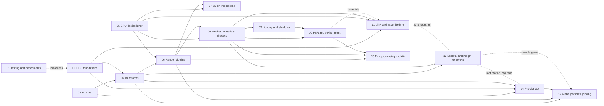

# Forge 3D: Design Program

|                                       |                                                                                   |
| ------------------------------------- | --------------------------------------------------------------------------------- |
| **Status**                            | Draft, for review                                                                 |
| **Kind**                              | Program index: the ordered set of designs that take Forge from 2D to 2D _and_ 3D  |
| **Engine version at time of writing** | `0.26.1`                                                                          |
| **Documents**                         | 15 designs in this folder, numbered in implementation order (see §6 and §7)       |
| **Decided with the product owner**    | WebGL2 backend built WebGPU-ready; one 3D transform; native TypeScript 3D physics; float color buffers required for lit 3D; one photometric scale per imported glTF model (§3) |

## 0. Targeted modules

| Module (export path)                                 | Change                                        | Designs        |
| ---------------------------------------------------- | --------------------------------------------- | -------------- |
| `math`                                               | Modified: quaternions, 4x4 and 3x3 matrices, 3D geometry primitives; `TriangleTree`, shared by mesh colliders and mesh picking | 02, 14         |
| `ecs`                                                | Modified: cached queries, change journals, ticks, singletons, frame stages, fixed step, message streams | 03             |
| `common`                                             | Modified: one `TransformEcsComponent` replaces position, rotation and scale, with world-space helpers (`getCurrentWorldMatrix`); fixed-step `Time` (`fixedStepIndex`); `allCollisionCategories` and `physicsOwnedTransformTag` | 03, 04, 14     |
| `rendering`                                          | Modified (rebuilt internally): GPU device layer, render pipeline, cameras, meshes, materials and material blocks, shader hooks, 2D phases and the mask table, skins and morph targets (`src/rendering/deformation/`), post-processing, render scale, debug drawing | 05, 06, 07, 08, 12, 13 |
| `lighting`                                           | **New**: lights, shadows, PBR materials, environment lighting, sky and fog, exposure; ambient occlusion and auto exposure | 09, 10, 13     |
| `asset-loading`                                      | Modified: one asset store with kinds, binary and JSON loading, asset handles that entities hold, asynchronous context-loss restore | 11             |
| `gltf`                                               | **New**: glTF 2.0 loading, model instantiation, the per-model photometric scale | 11, 12         |
| `animations`                                         | Modified: keyframe clips, playback layers and blends, root motion, playback states on shared machines, pose adjustments; sprite and property animations renamed | 12             |
| `finite-state-machine`                               | Modified: a machine becomes a shared, immutable definition; each user keeps its current state | 12             |
| `physics` → `physics-2d`                             | Renamed and modified: suffixed names, fixed step, interpolation, read-only velocities changed through functions, a sensor pass | 14             |
| `physics-3d`                                         | **New**: native 3D rigid-body physics           | 14             |
| `picking`                                            | **New**: pointer rays, hit testers, `PointerTargetEcsComponent` for UI elements and world objects, one pointer state machine | 15             |
| `ui`                                                 | Modified: pointer handling moves onto `picking`; UI keeps focus, navigation and invocation | 15             |
| `audio`, `particles`, `input`, `text`                | Modified: spatial audio, 3D particle emitters, pointer lock and Y-up mouse motion, migrated to 3D transforms | 04, 07, 15     |
| `e2e`, `bench` (new), `.github/workflows`            | Modified and new: visual, golden-image and performance suites, audio render time | 01             |

---

## 1. Summary

Forge is a code-only, ECS, WebGL2 engine for 2D games. This program makes
it a 2D _and_ 3D engine without making 2D games any harder to write. It's
split into fifteen designs that are built in order. Each one ships on its
own: after each design's last phase, the engine builds, every demo runs,
and the test, visual and performance suites pass.

The result is:

- one transform for every entity (a position, a quaternion rotation and a
  scale, all 3D), so 2D sprites, UI, 3D models, lights and physics bodies
  share one hierarchy and one set of conventions;
- a render pipeline built from passes that games can extend, reorder or
  replace, over a GPU device layer shaped so a WebGPU backend can be added
  later without changing the public API;
- clustered forward lighting with shadows, physically based materials
  following the glTF 2.0 metallic-roughness model, and image-based
  environment lighting;
- shader hooks that let a game change a material's vertex, surface or
  lighting code without losing the engine's lights, shadows, skinning or
  instancing;
- glTF 2.0 as the one 3D asset format, with skins, morph targets,
  animations and compressed meshes and textures;
- a native, data-oriented 3D physics engine, with 2D physics moved onto the
  same fixed-step and interpolation model;
- unit, golden-image visual and performance suites, with the performance
  suite comparing Forge against Three.js on the same scenes in the same
  browser on every pull request.

---

## 2. Goals and non-goals

### Goals

| Goal                       | What it means in practice                                                                                                                                                                                 |
| -------------------------- | --------------------------------------------------------------------------------------------------------------------------------------------------------------------------------------------------------- |
| Fast                       | Meets the budgets in §5 and is never slower than Three.js on the comparison scenes. No per-frame allocation in steady state. Work proportional to what changed, not to scene size, wherever possible. |
| Easy to use                | A lit, shadowed glTF model on screen in under 20 lines. A 2D game written the way it is today, with `x`/`y` positions and an angle.                                                                       |
| Idiomatic                  | Every subsystem uses the technique established engines use for the same problem, or states why it doesn't.                                                                                                |
| Extensible                 | Custom passes, custom materials and shader hooks are public API used by the engine's own features, not a side door.                                                                                       |
| Maintainable               | One owner per value, fixed system queries, no state in systems, no options that pick between old and new behavior.                                                                                       |
| 2D stays first-class       | 2D games keep their draw order, cameras, UI, text, masks and 2D physics. 3D features are opt-in imports and cost a 2D game nothing at runtime.                                                            |
| Production ready           | Context loss, asset lifetime, shader compile hitches, large worlds, mobile GPUs and error reporting are designed in, not deferred.                                                                         |
| Well tested                | Unit tests for all math and systems, golden-image tests for every rendering feature, performance tests with budgets and regression gates.                                                                |

### Non-goals

- **An editor or scene format of Forge's own.** Forge stays code-only; glTF
  is the content format.
- **Other 3D formats** (FBX, OBJ, USD). Convert to glTF.
- **A WebGPU backend.** The device layer is designed for it (design 05); the
  backend itself is a later design.
- **Deferred shading, ray tracing, global illumination, virtual geometry,
  GPU-driven culling.** WebGL2 has no compute shaders; these belong to the
  WebGPU backend's design.
- **Networking, determinism across machines, an AI or navigation mesh
  module.**

---

## 3. Decisions made with the product owner

| #   | Question                                     | Decision                                                                                                                                                                         |
| --- | -------------------------------------------- | -------------------------------------------------------------------------------------------------------------------------------------------------------------------------------- |
| P1  | Graphics backend                             | WebGL2 now. The device layer, render pipeline and resource model are shaped after WebGPU (pipelines, bind groups, passes, uniform buffers) so a WebGPU backend can follow without public API changes. Custom shaders are GLSL ES 3.00. |
| P2  | How 2D and 3D transforms relate              | One 3D transform for every entity. 2D games use `x`/`y`, `z` for depth, and rotate about Z through 2D helpers.                                                                   |
| P3  | How the 3D physics engine is built           | Native TypeScript, data-oriented, in the ECS. No WASM engine, no second copy of the world.                                                                                       |
| P4  | Devices without float color buffers          | Lit 3D and HDR effects require `EXT_color_buffer_float` or `EXT_color_buffer_half_float`; without one, creating an HDR view throws a clear error. No LDR shading path. 2D is unaffected. (Design 13 asks to extend this to 2D cameras with bloom, tone mapping or auto exposure; open question 1.) |
| P5  | Emissive and light values in imported glTF files | One photometric scale per loaded model, applied to its emissive values and its lights together. Its default makes files look under Forge's default exposure (EV100 12) as they do in the Khronos glTF Sample Viewer (`1.2 · 2^12 ≈ 4,915`, the reciprocal of that exposure's multiplier); `1` takes glTF's physical units literally (design 10 PB39, design 11 GA29). |

---

## 4. Conventions every design follows

These are fixed here once. Every design refers to them rather than restating
them, and `AGENTS.md`'s "Common Patterns" gains the ones that don't exist
yet when design 02 lands.

### 4.1 Space

- **Right-handed, Y-up.** `+X` right, `+Y` up, `+Z` towards the viewer. This
  is the glTF convention, and the 2D convention Forge already has (X right,
  Y up) extended by the third axis.
- **Forward is `-Z`** for cameras, lights and anything that aims.
  `Vec3.forward` is `(0, 0, -1)`. A model's front faces `+Z`, as glTF
  specifies, so a model looks _at_ a default camera; `Vec3.modelFront` and
  `Quat.modelLookRotation` name that direction, and imported models are
  never rotated to change it (design 04, decision X10).
- **Units are meters** for 3D. Physics defaults (gravity `-9.81`, sleep and
  contact thresholds) are tuned for meters. 2D keeps its own world units,
  set by the camera's `verticalWorldUnits`.
- **Angles are radians.** A positive rotation about an axis turns
  counter-clockwise when looking down that axis towards the origin (the
  right-hand rule). For the Z axis this is exactly Forge's existing 2D rule:
  angle `0` points along `+X`, and a positive angle turns `+X` towards `+Y`.
- **Rotations are unit quaternions**, stored `{ x, y, z, w }`. Euler angles
  exist only as conversion helpers at the API's edge, in one order:
  yaw about Y, then pitch about X, then roll about Z.
- **Matrices are column-major and act on column vectors** (`M * v`), as
  GLSL does. CPU matrices are 64-bit (plain number arrays); the GPU receives `float32`
  values relative to the camera (§4.3).

### 4.2 Color

- **The working space is linear and HDR.** Textures holding color (base
  color, emissive, sprite images) are sRGB-encoded and decoded by the GPU
  when sampled; data textures (normals, roughness, masks) are linear.
  Rendering happens in linear `RGBA16F` targets, and the output is tone
  mapped and encoded to sRGB once, at the end.
- **`Color` holds straight alpha; destinations hold premultiplied alpha.**
  This is the existing contract in `AGENTS.md` and is unchanged.
- **Physical light units.** Directional lights in lux, point and spot lights
  in lumens, exposure in EV100 (design 09, design 10). glTF's lights
  (`KHR_lights_punctual`, in candela and lux) convert exactly, and values
  carry over from Bevy, which uses the same spot convention: a spot of `Φ`
  lumens has a point light's intensity `Φ / 4π`, masked to the cone
  (design 09 L4). A Three.js spot light's lumens (`power = π · I`) must be
  multiplied by 4. Imported glTF models are scaled by their photometric
  scale (P5) unless loaded with `1`.

### 4.3 Precision

World positions on the CPU are 64-bit floats (JavaScript numbers). The GPU
gets object positions as a high and low `float32` pair and the camera's
position the same way, and subtracts them first, so every vertex is
positioned relative to the camera at close to 64-bit precision. A scene
10,000 km across renders without jitter, and moving the camera never
requires re-uploading object data. Design 06 has the details.

### 4.4 Where state lives

The ECS rule this program applies everywhere:

| Kind of data                                                            | Lives in                                                    | Examples                                                     |
| ----------------------------------------------------------------------- | ----------------------------------------------------------- | ------------------------------------------------------------ |
| Anything a game can read or that changes behavior                       | Components, including singleton components (design 03)      | Transforms, velocities, contact caches, sleep state, animation time |
| Derived, rebuildable caches of GPU or audio resources                   | The service that owns the resource (`RenderContext`, the audio mixer) | Programs, GPU buffers, the GPU-side copy of object transforms |
| Configuration a game builds once                                        | Plain objects passed to a factory                          | A render pipeline's passes, physics step settings            |
| Nothing                                                                 | A system's closure                                          | Systems hold injected services and nothing else between ticks |

A system may keep scratch arrays that it fully overwrites before reading
each tick (so no tick depends on the previous one's contents), purely to
avoid allocating. Those live with the service the system draws through,
or in the singleton component of the subsystem, never in module scope.

Every component field has one writer. The one named pattern beside it is
a **per-frame message stream** (design 03 §6.5): an append-only list on a
singleton that several systems append to, where no system edits or
removes another's entry, one owning system clears it once per frame, and
readers run after the writers (debug-draw shapes, design 06; pointer
hits, design 15). Design 12's pose pipeline is the one sanctioned
exception to one writer: pose sampling writes a pose target's `local`,
then pose adjustments change it in a fixed group order on frames with a
fresh pose (design 12 §6.13.1).

### 4.5 Naming

- Components keep the existing pattern: `<Name>EcsComponent`, a
  `<name>Id` key, an `add<Name>Component` factory. Systems keep
  `create<Name>EcsSystem`.
- A name gets a `2d` or `3d` suffix only where both a 2D and a 3D version
  exist and would collide in `src/index.ts`'s flat export
  (`RigidBody2dEcsComponent`, `RigidBody3dEcsComponent`). Everything that
  works in both (transforms, cameras, sprites, meshes, lights, audio)
  has no suffix.
- Forge names things after what they do, not after another engine's
  classes. A glTF scene loaded into Forge is a **model**, a renderable mesh
  on an entity is a **mesh component**, a pass that draws is a **render
  pass** in a **render pipeline**.

---

## 5. Performance targets

Forge has to be at least as fast as Three.js on the same scene, and meet
an absolute budget on reference hardware. Design 01 defines the harness,
the scenes and how each is measured; the table here is the contract the
designs are held to.

| #   | Scene                   | Content                                                                                       | Budget (desktop reference, main-thread CPU per frame) | Versus Three.js           |
| --- | ----------------------- | --------------------------------------------------------------------------------------------- | ---------------------------------------------------- | ------------------------- |
| B1  | Static city             | 50,000 static meshes from 200 unique meshes and 50 materials, 1 shadowed sun, camera flying through | ≤ 4 ms                                               | ≤ 0.5× (instancing is automatic in Forge, manual in Three.js) |
| B2  | Moving swarm            | 10,000 meshes, all moving every frame                                                         | ≤ 6 ms                                               | ≤ 1×                      |
| B3  | Many lights             | 256 point lights, 20,000 meshes, 1080p                                                        | ≤ 5 ms CPU; 60 fps on the integrated-GPU reference   | ≤ 1×                      |
| B4  | Crowd                   | 100 skinned characters, 60 joints each, 2 blended clips each                                  | ≤ 5 ms                                               | ≤ 1×                      |
| B5  | Shadowed sponza         | The Khronos Sponza glTF, sun with 4 shadow cascades, 8 shadowed spot lights                    | ≤ 3 ms CPU; 60 fps at 1080p on the integrated-GPU reference | ≤ 1×               |
| B6  | Physics pile            | 1,000 dynamic boxes and spheres falling into a pile, 60 Hz                                    | ≤ 4 ms per step until asleep, ≤ 0.5 ms once asleep   | n/a (vs. Rapier, informational) |
| B7  | Sprites                 | 50,000 moving sprites, 20 textures                                                            | No slower than the `0.26.1` baseline                 | ≤ 1× (Three.js sprites)   |
| B8  | UI and text             | The existing UI stress test                                                                   | No slower than the `0.26.1` baseline                 | n/a                       |
| B9  | Load time               | Sponza from a warm HTTP cache to first frame                                                  | ≤ 1.5 s with KTX2 textures                           | ≤ 1×                      |

Every frame of every scene also has to:

- allocate nothing in steady state (verified by the allocation tests in
  design 01);
- never block on shader compilation after a game's loading screen
  (programs compile in parallel and can be prepared ahead, design 08);
- keep draw calls proportional to unique mesh and material pairs that are
  visible, not to visible objects.

The Unity comparison uses Unity web builds of B1 to B5 made outside this
repository and run on the reference devices at each milestone, because a
Unity build can't run in CI. Design 01 covers it.

---

## 6. Document map

| #   | Design                                                                 | Delivers                                                                                                         | Depends on        | Size |
| --- | ---------------------------------------------------------------------- | ---------------------------------------------------------------------------------------------------------------- | ----------------- | ---- |
| 01  | [Testing and benchmarks](./01-testing-and-benchmarks.md)               | Benchmark harness and scenes (CPU frame time and audio render time), Three.js comparisons, allocation tests, golden-image and analytic visual tests, CI gates | –                 | L    |
| 02  | [3D math](./02-math.md)                                                | Quaternions, 4x4 and 3x3 matrices, rays, planes, frustums, boxes, spheres; conventions in `AGENTS.md`              | –                 | M    |
| 03  | [ECS foundations](./03-ecs-foundations.md)                             | Allocation-free cached queries, change journals, world ticks, singleton components, message streams, frame stages, fixed step | –                 | L    |
| 04  | [Transforms](./04-transforms.md)                                       | `TransformEcsComponent`; propagation with change detection; every module migrated; 2D and world-space helpers (`getCurrentWorldMatrix`) | 02, 03            | L    |
| 05  | [GPU device layer](./05-gpu-device.md)                                 | WebGPU-shaped resources over WebGL2: buffers, textures, samplers, pipelines, bind groups, passes, state cache; material uniform blocks (design 08 §6.3, built in its Phase 3); asynchronous context-loss restore; readback | –                 | XL   |
| 06  | [Render pipeline](./06-render-pipeline.md)                             | Passes and the frame graph, cameras and projections, visibility, sorting, instancing, GPU scene and its change list, debug drawing | 04, 05            | XL   |
| 07  | [2D on the render pipeline](./07-2d-on-the-render-pipeline.md)         | Sprites, text, UI, the mask table and terrain as transparent-phase items; linear blending; billboards and depth groups; 2D in 3D and 3D in 2D; the rotated-text fix (Phase 0) | 05, 06            | L    |
| 08  | [Meshes, materials and shaders](./08-meshes-materials-and-shaders.md)  | Mesh assets and primitives, the material system on uniform blocks (specified here, built with design 05), shader variants and pass variants, shader hooks, custom and unlit materials, `prepare()` | 05, 06            | XL   |
| 09  | [Lighting and shadows](./09-lighting-and-shadows.md)                   | Directional, point and spot lights in physical units; clustered light lists for lit views; cascades per lit view and local light tiles in one shadow map array, with caching; soft shadows | 08 (03, 05, 06)   | XL   |
| 10  | [PBR and environment lighting](./10-pbr-and-environment-lighting.md)   | Metallic-roughness BRDF, glTF material extensions, image-based lighting, sky, fog, exposure, transmission        | 08, 09            | XL   |
| 11  | [glTF and asset lifetime](./11-gltf-and-asset-lifetime.md)             | One asset store with handles entities hold, binary loading, glTF 2.0 with extensions and compression, model instancing, the photometric scale (P5) | 03, 05, 08 (10 for materials, 12 for skins and clips) | XL |
| 12  | [Skeletal and morph animation](./12-skeletal-and-morph-animation.md)   | Keyframe clips, skins, GPU skinning, morph targets, blending, layers, events, root motion, shared state machines, pose adjustments | 04, 08, 11        | XL   |
| 13  | [Post-processing and anti-aliasing](./13-post-processing-and-anti-aliasing.md) | MSAA, alpha-to-coverage, FXAA, render scale, ambient occlusion, bloom, blur, tone mapping, color grading, auto exposure on the pipeline | 06, 08, 10 | XL |
| 14  | [Physics 3D](./14-physics-3d.md)                                       | Native 3D rigid bodies, shapes, BVH broad phase, GJK/EPA and SAT, soft-step solver, joints, sleeping, sensors, gyroscopic torque, CCD, queries, character mover, rag dolls; 2D physics on the same stepping model | 02, 03, 04 (12 for root motion and rag dolls) | XL+ |
| 15  | [Audio, particles and picking in 3D](./15-audio-particles-and-picking-in-3d.md) | Spatial audio, 3D particle emitters, pointer picking against meshes, physics and UI with one pointer state machine | 04, 06, 14 (12 for the sample game) | XL |

Sizes follow each design's own phase tables. 10, 12, 13 and 15 were
estimated L or M before their phases were written, and their task tables
come to about twice design 05's or 08's.

### Dependency graph

Physics (14) only needs the foundations (02 to 04), so it can be built in
parallel with the renderer (05 to 13); its root motion task and rag dolls
wait for design 12's Phases 3 and 5. Design 11's asset store (its Phase 1)
needs only designs 03 and 05 and can ship in M2; the rest of design 11
ships in M4 with design 12, each needing the other's types.

---

## 7. Milestones

The designs group into milestones. Each milestone is a minor release with a
changelog, updated guides, demos and passing suites.

### M0: Baselines

Design 01, Phases 1 and 2. The benchmark harness exists and has measured
today's 2D engine (B7, B8), so every later change is compared against
`0.26.1`.

**Definition of done:** `npm run bench` runs B7 and B8 locally and in CI,
and the baseline report is committed.

### M1: Foundations

Designs 02, 03 and 04. Every 2D game runs on `TransformEcsComponent`,
cached queries and the fixed step. Nothing draws in 3D yet.

**Definition of done:** every demo and e2e scene is migrated; B7 and B8 are
no slower than the baseline; per-frame allocation in the 2D demos is zero.

### M2: The new renderer

Designs 05, 06 and 07. All drawing goes through the device layer and the
render pipeline. Sprites, text, UI and post-processing are pipeline passes.
Perspective cameras, depth buffers, camera controllers and debug drawing exist.

**Definition of done:** every 2D e2e and golden-image test passes unchanged
except for the documented color-space difference (design 07); a demo with
a perspective camera, orbit and fly controllers and debug-drawn shapes
runs; B7 is no slower than the baseline. (The first mesh draws in M3, with
design 08.)

### M3: Lit 3D

Designs 08, 09, 10 and 13. Meshes, materials, shader hooks, lights,
shadows, PBR, environment lighting and post-processing.

**Definition of done:** B1, B2, B3 and B5 (with a hand-built scene until
glTF lands) meet their budgets; the golden-image suite covers every
material feature and light type.

### M4: Content

Designs 11 and 12. glTF models with skins, morph targets and animation.

**Definition of done:** the Khronos sample models listed in design 11 load
and match their reference renders within tolerance; B4, B5 and B9 meet
their budgets.

### M5: Physics 3D

Design 14 (in parallel with M2 to M4). 3D rigid bodies, joints, queries and
a character controller; 2D physics on the fixed step.

**Definition of done:** B6 meets its budget; the stacking, joint and CCD
scenarios in design 14 pass; every 2D physics demo still runs.

### M6: 3D gameplay

Design 15. Spatial audio, 3D particles, picking. A complete 3D sample game
on the docs site (a small third-person scene with physics, animation,
audio and UI) proves the pieces together.

---

## 8. Phases

The program's phases are the milestones in §7. Each design has its own
phases and tasks; this table is the order to take them in.

| #   | Task                                                    | Description                                                                 | Size |
| --- | ------------------------------------------------------- | --------------------------------------------------------------------------- | ---- |
| 1   | M0: benchmark harness and baselines                     | Design 01, Phases 1 to 2                                                    | M    |
| 2   | M1: math                                                | Design 02, all phases                                                       | M    |
| 3   | M1: ECS foundations                                     | Design 03, all phases                                                       | L    |
| 4   | M1: transforms and migration                            | Design 04, all phases                                                       | L    |
| 5   | M1: golden-image suite                                  | Design 01, Phase 3, so the renderer rewrite is checked against today's output | M    |
| 6   | M2: device layer, pipeline, 2D phases                   | Designs 05, 06, 07                                                          | XL   |
| 7   | M3: meshes, materials, lights, PBR, post-processing     | Designs 08, 09, 10, 13                                                      | XL   |
| 8   | M4: glTF and animation                                  | Designs 11, 12                                                              | XL   |
| 9   | M5: physics 3D (parallel with 6 to 8)                   | Design 14                                                                   | XL   |
| 10  | M6: spatial modules and the sample game                 | Design 15; Three.js and Unity comparison report                             | L    |

**Definition of done for the program:** every budget in §5 is met on the
reference hardware, every design's definition of done is met, and the docs
site has a 3D section with guides, demos and the sample game.

---

## 9. Decision log

| #   | Decision                                   | Options considered                                                                                                 | Chosen                                     | Rationale, trade-offs and assumptions                                                                                                                                                                                                                                                                                                                                                                                                                   |
| --- | ------------------------------------------ | ------------------------------------------------------------------------------------------------------------------ | ------------------------------------------ | ------------------------------------------------------------------------------------------------------------------------------------------------------------------------------------------------------------------------------------------------------------------------------------------------------------------------------------------------------------------------------------------------------------------------------------------------------- |
| G1  | One engine or a separate 3D product        | (a) 3D added to the same engine and pipeline; (b) a separate 3D package with its own renderer                       | (a)                                        | Mixing 2D and 3D (UI over 3D, sprites in 3D, models in 2D games) is the common case, and two renderers double every fix. Every established engine renders 2D and 3D with one pipeline. Trade-off: 2D's renderer is rewritten (design 07), with a golden-image suite (design 01) guarding its output.                                                                                                                                                    |
| G2  | Shading model                              | (a) Clustered forward; (b) deferred; (c) plain forward with a per-object light limit                               | (a)                                        | WebGL2 deferred shading needs several float render targets per pixel, has no MSAA and handles transparency and varied materials poorly; mobile GPUs pay for the bandwidth. Plain forward caps lights per object. Clustered forward handles hundreds of lights, keeps MSAA and transparency, and is what Godot (Forward+), Bevy and PlayCanvas use. Light lists are built on the CPU, since WebGL2 has no compute (design 09).                          |
| G3  | Color pipeline                             | (a) Linear HDR for everything, 2D included; (b) linear for 3D, gamma-space blending for 2D                          | (a)                                        | Lighting is only correct in linear space, and a pipeline with two color spaces needs conversions wherever 2D and 3D meet. Bevy renders everything linear; Unity defaults new projects to linear. Trade-off: translucent 2D blends and gradients look slightly different after M2. Design 07 lists the e2e and golden changes and the changelog says so.                                                                                                   |
| G4  | CPU number type and large worlds           | (a) `Float32Array` math everywhere; (b) 64-bit on the CPU, camera-relative `float32` on the GPU                     | (b)                                        | JavaScript numbers are already 64-bit, so 64-bit CPU math costs nothing and avoids `float32` rounding on every write. The high/low split (§4.3) keeps GPU object data valid while the camera moves. Trade-off: 12 more bytes per object on the GPU and two subtractions per vertex.                                                                                                                                                                    |
| G5  | Shader language for hooks and materials    | (a) GLSL ES 3.00 with Forge's preprocessor; (b) WGSL with translation to GLSL; (c) a node or TypeScript shader DSL | (a)                                        | Follows P1. Forge's shaders and the include preprocessor are GLSL today. A DSL is a large project of its own and an extra language to learn. Hooks are small functions with fixed signatures (design 08), so porting them to WGSL for a later backend is mechanical. Trade-off: a WebGPU backend will need a translation step or WGSL versions of engine shaders.                                                                                      |
| G6  | Order of the designs                       | (a) Benchmarks and foundations first; (b) renderer first                                                           | (a)                                        | A baseline can only be measured before the code changes, and every renderer design depends on transforms and cached queries. Physics only needs the foundations, so it proceeds in parallel.                                                                                                                                                                                                                                                       |
| G7  | Euler order                                | (a) One order (yaw Y, pitch X, roll Z); (b) a parameter                                                              | (a)                                        | Euler angles are only conversion helpers. A parameter would add a choice nobody needs; yaw-pitch-roll is the order cameras and characters use, and Godot uses the same default.                                                                                                                                                                                                                                                                        |
| G8  | Depth convention                           | (a) Standard depth, 24-bit; (b) reversed-Z with a float depth buffer                                               | (a), with (b) when `EXT_clip_control` exists | Reversed-Z only helps with a `[0, 1]` clip range, which WebGL2 gets only through `EXT_clip_control`. The device layer uses reversed-Z when the extension is present and standard depth otherwise; the choice is internal (shaders read depth through engine functions), so it isn't an option. Assumption: the extension's availability, which design 05 measures.                                                                                       |

---

## 10. Open questions

In priority order.

1. **Reference hardware for the absolute budgets.** Options: (a) a 2021
   M1 MacBook Air and a mid-range Windows laptop with integrated graphics
   for desktop, a Pixel 7 and an iPhone 13 for mobile; (b) whatever the
   maintainers own, recorded in the report. (a) makes the budgets
   reproducible; (b) is cheaper. Proposal: (a), with mobile budgets set
   after M3's first measurements.
2. **Unity comparison builds.** Options: (a) maintain Unity projects for
   B1 to B5 in a separate repository and run them each milestone; (b)
   compare against published Unity web benchmarks; (c) drop Unity and keep
   Three.js only. (a) is the only fair comparison but needs a Unity
   license and someone to maintain it. Proposal: (a), owned by the
   maintainers outside this repository.
3. **Minimum browsers.** WebGL2 is everywhere Forge already runs. The
   designs assume the current Forge baseline (evergreen Chrome, Edge,
   Firefox, Safari 15+). Confirm, since Safari 15's WebGL2 lacks some
   extensions the faster paths use (designs 05 and 06 have fallbacks).
4. **Bundle size budget.** A 2D game shouldn't grow when 3D lands. Options:
   (a) a CI check that the 2D demos' bundles grow by no more than 5%;
   (b) no check. Proposal: (a), in design 01.
5. **When the WebGPU backend design starts.** Proposal: after M3, when the
   device layer's interface has been used by every rendering feature and
   is unlikely to change.

---

## 11. Review

Each design was reviewed with the `solution-reviewer` agent
(`.claude/agents/solution-reviewer.md`) for root cause, ownership of every
value, comparison with established engines, Forge's ECS rules and cost.
The verdicts and what changed are recorded at the end of each design.

---

## 12. Glossary

| Term                 | Meaning in these designs                                                                                                             |
| -------------------- | ------------------------------------------------------------------------------------------------------------------------------------ |
| Pass                 | One step of the render pipeline that reads and writes GPU resources: a shadow pass, the opaque pass, a bloom pass.                  |
| Phase                | The set of draw items a pass draws, with their sort order: opaque, alpha-tested, transparent, 2D, UI, shadow casters.                |
| Frame graph          | The per-frame plan of passes and the resources they read and write, from which the pipeline orders passes and allocates targets.     |
| GPU scene            | The GPU-side copy of every renderable's transform and bounds, updated only for what changed.                                         |
| Model                | A loaded glTF scene: meshes, materials, skins, animations and a node tree that can be instantiated into entities any number of times. |
| Shader hook          | A GLSL function a material supplies, which the engine calls at a fixed point of its own shaders.                                     |
| Singleton component  | A component exactly one entity has, read with `world.getSingleton`, holding a subsystem's state.                                     |
| Fixed step           | Systems that run zero or more times per frame at a constant timestep (physics), with the remainder used to interpolate.              |
| Stage                | One of the world's built-in, ordered system groups that make up a frame (design 03).                                                 |
