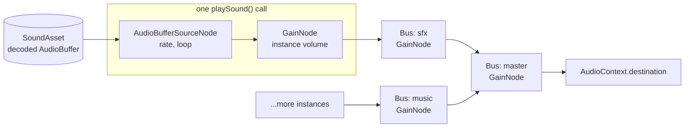

# Design: Sound Mixer, Sound Assets and Playback

|                                       |                                                                                                                                                                                                                                                           |
| ------------------------------------- | --------------------------------------------------------------------------------------------------------------------------------------------------------------------------------------------------------------------------------------------------------- |
| **Status**                            | Draft, for review                                                                                                                                                                                                                                         |
| **Kind**                              | Missing feature                                                                                                                                                                                                                                           |
| **Found in**                          | Galactic Journey demo: `src/audio/audio-mixer.ts`, `src/speed/create-speed-sounds.ts`, `src/explosions/create-explosions.ts`, `src/gun/gun.system.ts`, `src/enemy/enemy.system.ts`, `src/music/create-music.ts`, `src/main-menu/create-settings-panel.ts` |
| **Engine version at time of writing** | `0.25.8`                                                                                                                                                                                                                                                  |
| **Related**                           | [`demo-findings.md`](./demo-findings.md), [`persistent-preferences.md`](./persistent-preferences.md), [`generational-entity-ids.md`](./generational-entity-ids.md)                                                                                        |

## 0. Targeted modules

| Path                                                                 | Change      | Notes                                                                                                                      |
| -------------------------------------------------------------------- | ----------- | -------------------------------------------------------------------------------------------------------------------------- |
| `src/audio/sound-mixer.ts`                                           | **New**     | `createSoundMixer`: owns the browser `AudioContext`, the bus tree, unlocking on user gestures, and `stop()`                |
| `src/audio/mixer-bus.ts`                                             | **New**     | `MixerBus`: a named, nestable volume/mute stage                                                                            |
| `src/audio/sound-asset.ts`                                           | **New**     | `SoundAsset`, `createSoundAsset` (from PCM samples)                                                                        |
| `src/audio/sound-asset-cache.ts`                                     | **New**     | `SoundAssetCache`: loads and decodes each sound once; concurrent loads shared                                              |
| `src/audio/play-sound.ts`                                            | **New**     | `playSound`: one-shot or controllable playback, no entity required                                                         |
| `src/audio/components/sound-component.ts`                            | **New**     | `SoundEcsComponent`: a sound that plays as long as its entity has it                                                       |
| `src/audio/systems/sound-system.ts`                                  | **New**     | `createSoundEcsSystem`: reconciles `SoundEcsComponent`s, stops sounds whose entity or component was removed                |
| `src/audio/components/audio-component.ts`, `systems/audio-system.ts` | **Removed** | `AudioEcsComponent`, `audioId`, `addAudioComponent` and `createAudioEcsSystem`                                             |
| `package.json`, `documentation-site/package.json`, both lock files   | Modified    | `howler` and `@types/howler` removed                                                                                       |
| `README.md`, `AGENTS.md`                                             | Modified    | Stop listing Howler                                                                                                        |
| `documentation-site/docs/docs/audio/`                                | Modified    | Rewritten around the mixer, buses, sound assets, `playSound` and sound components                                          |
| `documentation-site/src/pages/demos/space-shooter/`                  | Modified    | The only docs-site demo that uses audio (`_create-game.ts`, `_create-music.ts`, `_create-explosions.ts`, `_gun.system.ts`) |
| `documentation-site/src/hooks/useGame.ts`                            | Modified    | Stops the mixer when a demo unmounts                                                                                       |

---

## 1. Summary

Forge's audio module is a thin wrapper around Howler.js: an
`AudioEcsComponent` holds a `Howl` and a `playSound` flag, and
`createAudioEcsSystem` calls `play()` when the flag is set. There's no way
to group sounds, set a volume for a group, mute, or play a sound without
building an entity for it.

The demo built all of that itself:

- **A mixer** (`src/audio/audio-mixer.ts`, 139 lines): music and sound
  effect categories under a master volume, a mute switch that keeps the
  volumes, every `Howl` created through it so its volume can be rescaled
  whenever a setting changes, and a set of all live `Howl`s pruned as they
  unload.
- **One-shot sounds as entities**: every explosion creates a second entity
  carrying only an `AudioEcsComponent`, a 6-second `LifetimeEcsComponent`
  and a removal tag (`explosions/create-explosions.ts`), because the sound
  is longer than the explosion's sprite. The speed-change "whoosh" does the
  same with a 0.55-second lifetime (`speed/create-speed-sounds.ts`). Both
  lifetimes are guesses, because nothing reports when a sound ends.
- **Procedural sound through a data URL**: the whoosh is synthesized as
  PCM samples, encoded into a 16-bit WAV file by hand, base64-encoded into
  a `data:` URL, and handed to Howler, which decodes it straight back into
  samples (`speed/create-speed-sounds.ts`, 90 of its 138 lines).
- **A sound per system instance**: the gun and enemy systems create their
  own `Howl` "so each game restart gets its own Howl, since the audio
  system unloads any sound still playing when the world stops"
  (`gun/gun.system.ts`, `enemy/enemy.system.ts`). The docs-site space
  shooter does the same.

This design gives Forge a mixer of its own, built on the Web Audio API
that Howler itself uses underneath:

- **Buses**: named stages with a volume and a mute flag, nested under a
  master bus. Every sound plays through one.
- **Sound assets**: decoded audio, loaded once through a cache, or created
  directly from PCM samples.
- **`playSound`**: plays a sound on a bus, overlapping freely, and returns
  a handle to stop it or change its volume. No entity needed.
- **`SoundEcsComponent`**: a sound that belongs to an entity, stops when
  the entity (or the component) is removed, and reports when it finishes.

Howler is removed as a dependency.

---

## 2. Scope

### In scope

- A mixer object owning the browser's `AudioContext` and the master bus,
  unlocking playback on user gestures (browsers start audio suspended),
  and closing the context when stopped.
- Nestable buses with `volume` and `muted`.
- Sound asset loading and caching, and creating a sound from PCM samples.
- `playSound` with per-play volume, playback rate and looping, returning a
  handle.
- `SoundEcsComponent` and `createSoundEcsSystem`, which pauses, resumes and
  stops sounds as the component says, stops them when the entity or
  component is removed, and reports when one finishes.
- Removing Howler, `AudioEcsComponent` and the old system, and migrating
  the space-shooter docs demo, the audio guides, the README and AGENTS.md.

### Out of scope

- **Saving the player's volume settings.** The mixer exposes the values; a
  game stores them with its other settings
  ([`persistent-preferences.md`](./persistent-preferences.md)).
- **Positional (panned or attenuated) audio.** A follow-up once sounds are
  entity-bound (Phase 2), not needed by the demo.
- **Effects on buses** (filters, reverb, compression, ducking). A bus is
  built so an effect chain can be inserted later, but none ships here.
- **Voice limiting** (a cap on simultaneous instances of a sound). Open
  question 3.
- **Pausing audio while the page is hidden.** A game decision; the mixer
  exposes `suspend()`/`resume()` for it (open question 4).
- **Streaming long tracks.** Open question 1.

---

## 3. Background

### 3.1 What Forge has

```ts
export interface AudioEcsComponent {
  sound: Howl; // a Howler sound
  playSound: boolean; // set true to play on the next tick
}
```

`createAudioEcsSystem` (`src/audio/systems/audio-system.ts`) plays a sound
when `playSound` is set and resets the flag, so the flag has two writers:
game code sets it and the system clears it. Its `cleanup` stops and
_unloads_ every sound still playing when the world stops. The guide
(`audio/playing-sounds.md`) warns that removing an entity does nothing to
its sound, and that callers must stop and unload it themselves.

So the engine has:

- no grouping, and so no volume or mute per group. Howler has a global
  volume and mute and a per-`Howl` volume, nothing in between;
- no sound asset separate from its playback: a `Howl` is both the decoded
  audio and the player, and unloading it on world stop breaks any other
  entity sharing it, which is why the demo creates `Howl`s per system
  instance;
- no way to play a sound except through an entity and a flag;
- no way to know when a sound has finished;
- no way to play audio that wasn't loaded from a URL.

### 3.2 What the demo built, and why each part is general

| Demo code                                                                     | What it really needs                                          | General?                                                   |
| ----------------------------------------------------------------------------- | ------------------------------------------------------------- | ---------------------------------------------------------- |
| `createAudioMixer`: master, music, sfx, mute; rescales every `Howl` on change | Buses with volume and mute                                    | Every game with a settings screen                          |
| `createSound(category, options)` tracks each `Howl`                           | Sounds routed to a bus, so changes apply to all of them       | Same                                                       |
| Explosion and whoosh sounds on throwaway entities with guessed lifetimes      | Fire-and-forget playback, and knowing when a sound ends       | Every game with sound effects                              |
| WAV encoder + base64 data URL for the synthesized whoosh                      | A sound made from samples                                     | Procedural audio, audio generated at runtime               |
| `Howl` per system "since the audio system unloads any sound still playing"    | Sound assets that outlive one playback and one world          | Any shared sound                                           |
| Laser sound on the bullet entity                                              | (Accidental) Today removing the bullet leaves its sound alone | Sounds that should stop with their entity are also general |

Only the choice of buses (music and sfx), the default volumes, and saving
them are specific to the game.

---

## 4. How established engines handle this

| Engine        | Grouping                                                                                                                      | Asset vs. playback                                                                           | One-shots                                                    |
| ------------- | ----------------------------------------------------------------------------------------------------------------------------- | -------------------------------------------------------------------------------------------- | ------------------------------------------------------------ |
| **Unity**     | A mixer asset with nested groups, attenuation in dB, snapshots                                                                | An audio asset; a source component on a GameObject plays it (volume linear 0-1)              | `PlayOneShot` on a source, overlapping                       |
| **Godot**     | `AudioServer` buses (Master plus named buses), volume in dB, mute                                                             | `AudioStream` resource; `AudioStreamPlayer` plays it, `bus` property, `volume_db`            | Instance a player, or `max_polyphony` on one                 |
| **Bevy**      | `GlobalVolume` built in. `bevy_kira_audio` adds channels; Bevy is moving to Firewheel (`bevy_seedling`), with buses and pools | An audio asset; an entity with `AudioPlayer` (or `SamplePlayer` in `bevy_seedling`) plays it | Spawn an entity whose playback settings despawn it when done |
| **Web Audio** | `GainNode`s connected into a tree ending at the destination                                                                   | `AudioBuffer`; one-use `AudioBufferSourceNode` per playback                                  | Create and start a source node; they're cheap                |

The shared model: an **asset** is decoded once and shared; each playback is
a cheap **instance**; instances feed **buses** arranged in a tree under a
**master**; bus volume and mute apply to everything routed through them,
including sounds already playing.

All three engines play a one-shot through an emitter (a component, a node
or an entity) that names its bus. Forge, being code-only, also offers an
entity-free `playSound` for the common case where the sound has no other
data, and gives entity-bound sounds a completion report, so neither needs
a guessed lifetime.

Web Audio is that model natively. A bus is a `GainNode`, and connecting
nodes builds the tree. That's why this design builds on Web Audio directly
rather than on Howler, which hides the graph behind a per-sound API with
one global volume.

---

## 5. Design

### 5.1 The audio graph



A bus's gain is `muted ? 0 : volume`. Effective loudness is the product of
the instance's volume and every bus gain up to the master, which Web Audio
computes for free.

### 5.2 API

```ts
import {
  addSoundComponent,
  createSoundAsset,
  createSoundEcsSystem,
  createSoundMixer,
  playSound,
  SoundAssetCache,
} from '@forge-game-engine/forge/audio';

// Once per game, like the render context.
const mixer = createSoundMixer();

const music = mixer.createBus('music'); // a child of mixer.master
const sfx = mixer.createBus('sfx');

music.volume = 0.8;
mixer.master.muted = true; // keeps every volume as it was

// Sound assets: loaded and decoded once, then shared.
const sounds = new SoundAssetCache(mixer);
const laser = await sounds.getOrLoad(laserUrl);

// Fire and forget: overlapping instances are fine.
playSound(sfx, laser, { volume: 0.1 });

// The same sound, pitched down and quieter, for enemies.
playSound(sfx, laser, { volume: 0.06, rate: 0.6 });

// A handle, for sounds the game wants to stop or fade itself.
const theme = playSound(music, themeSound, { loop: true });
theme.volume = 0.3;
theme.stop();

// A sound made from samples, no file involved.
const whoosh = createSoundAsset({
  sampleRate: 44100,
  channels: [samples], // Float32Array per channel, in [-1, 1]
});

// When the game is torn down.
mixer.stop();
```

A bus knows its mixer, so `playSound` takes the bus and the sound, and
nothing else needs the mixer passed in. Playing a sound on a bus from a
different mixer throws.

#### `SoundMixer`

```ts
interface SoundMixer {
  /** The root bus; everything ends up here. */
  readonly master: MixerBus;
  /** Creates a bus under `parent` (default: `master`). Names are unique. */
  createBus(name: string, parent?: MixerBus): MixerBus;
  getBus(name: string): MixerBus;
  /** Mirrors the context's state; `'interrupted'` is Safari's (a call, another app). */
  readonly state: 'suspended' | 'running' | 'interrupted' | 'closed';
  suspend(): Promise<void>;
  resume(): Promise<void>;
  /** Stops every sound, closes the context and removes the gesture listeners. */
  stop(): Promise<void>;
}

function createSoundMixer(context?: AudioContext): SoundMixer;
```

The context parameter is ordinary dependency injection (unit tests pass a
fake); by default the mixer creates its own `AudioContext`.

**Unlocking.** Browsers refuse to start audio until the page has had a
user gesture, and only some events count: per the HTML specification a
touch activates on `pointerup`/`touchend`, not `pointerdown`, and Escape
doesn't count as a key press for this. The mixer listens on the window for
`pointerup`, `touchend`, `click` and `keydown`, and on each one it sets an
internal "has had a gesture" flag synchronously and calls
`context.resume()`. It keeps listening until the context reports
`'running'`, because a resume attempted from an event that didn't count
fails silently, and it starts listening again whenever the context drops
back to `'suspended'` or `'interrupted'` without the game asking (Safari
interrupts audio for calls and other apps; output device changes can
suspend it). `stop()` removes the listeners.

**Teardown.** `stop()` stops every sound and closes the context, the same
way `createContainerResizeSync` and the input sources clean up after
themselves. The docs site's `useGame` hook stops the mixer when a demo
unmounts, so moving between demo pages doesn't leak contexts or leave
music playing.

#### `MixerBus`

```ts
interface MixerBus {
  readonly name: string;
  readonly parent: MixerBus | null;
  /** Linear gain, 0 (silent) to 1 (unchanged). */
  volume: number;
  /** Silences the bus without changing `volume`. */
  muted: boolean;
}
```

Setting `volume` or `muted` ramps the bus's gain over a few milliseconds
(`setTargetAtTime`) instead of jumping, which avoids an audible click on
sounds already playing. Volume is linear gain, matching how games store a
slider's value; converting a slider to a perceptual curve is the game's
choice (open question 2).

#### Sound assets

```ts
interface SoundAsset {
  readonly buffer: AudioBuffer;
  readonly durationSeconds: number;
}
```

`SoundAssetCache` lives in the audio module (the asset-loading module
doesn't depend on feature modules) and follows the same `get`/`getOrLoad`
shape as `ImageCache`. It fetches and decodes with `decodeAudioData`, and
records each load when it starts, so concurrent requests for the same URL
share one decode (decoding a music track twice costs tens of megabytes).
`decodeAudioData` detaches the `ArrayBuffer` it's given, so the fetched
bytes are used once. A format the browser can't decode rejects with an
error naming the URL; the audio guide lists which formats every major
browser decodes, since there's no Howler-style list of alternative files.

`createSoundAsset({ sampleRate, channels })` builds an `AudioBuffer`
directly from `Float32Array`s (`new AudioBuffer`, which needs no context).
The demo's whoosh becomes its synthesis loop plus one call; the WAV
encoder and data URL go away.

#### `playSound`

```ts
interface PlaySoundOptions {
  /** Instance gain, multiplied with the bus chain. Default 1. */
  volume: number;
  /** Playback rate; also shifts pitch. Default 1. */
  rate: number;
  /** Default false. */
  loop: boolean;
}

interface PlayingSound {
  volume: number;
  readonly isPlaying: boolean;
  stop(): void;
}

function playSound(
  bus: MixerBus,
  sound: SoundAsset,
  options?: Partial<PlaySoundOptions>,
): PlayingSound;
```

The bus is the first parameter and required. Every sound has to land
somewhere the player's settings can reach, and a default bus would make
"forgot to pick the sfx bus" a silent bug where the sound ignores the sfx
slider.

Stopping a sound ramps its instance gain to zero over a few milliseconds
before stopping the source node, so stopping mid-sound (including when an
entity is removed) doesn't click. Nodes are disconnected when they end.

#### `SoundEcsComponent`

For a sound that belongs to an entity: an engine's hum, a looping alarm on
a pickup, music owned by a scene's root.

```ts
interface SoundEcsComponent {
  sound: SoundAsset;
  bus: MixerBus;
  volume: number; // default 1
  rate: number; // default 1
  loop: boolean; // default false
  /** Pauses in place; clearing it resumes from the same position. Default false. */
  paused: boolean;
  /**
   * Output, written only by `createSoundEcsSystem`: `true` once a
   * non-looping sound has played to its end (or was dropped, §5.4).
   */
  readonly hasFinished: boolean;
}
```

The game writes every field except `hasFinished`; the system writes only
`hasFinished`, the same split as `LifetimeEcsComponent.hasExpired` and
`position.world`. `createSoundEcsSystem()` reconciles each component with
the instance it started, every tick:

- **No instance yet**, not `paused`, not finished: start one.
- **`paused` set**: stop the source node and remember the playback
  position (elapsed time times `rate`); **cleared**: start a new source
  node from that position. This is a real pause, as in every engine in
  §4.
- **`volume`/`rate` changed**: applied to the instance (ramped).
- **`loop` changed**: applied to the source node directly (Web Audio
  allows it on a playing node).
- **`bus` changed**: the instance's gain node is reconnected to the new
  bus, without restarting.
- **`sound` changed**: the instance is stopped and the new sound starts
  from the beginning.
- **A non-looping instance ended**: `hasFinished` becomes `true` and
  nothing more is started. To play it again, the game adds the component
  again (a new component is a new playback); for repeated one-shots,
  `playSound` is the simpler tool.
- **The component or entity is gone** since last tick (the system keeps a
  map of its instances, keyed by component): the instance is stopped. This
  is what the old guide told callers to do by hand.

`cleanup` stops every instance the system started. Sound assets aren't
touched: they belong to the cache, not to a world, so a restarted world can
play them again. That removes the reason the demo creates a `Howl` per
system.

### 5.3 What the demo looks like afterwards

```ts
// create-game.ts
const mixer = createSoundMixer();
const music = mixer.createBus('music');
const sfx = mixer.createBus('sfx');

// settings panel: sliders and the mute toggle write the buses directly
onValueChanged.registerListener((value) => {
  music.volume = value;
});

// explosion: no second entity, no lifetime guess
playSound(sfx, explosionSound, { volume: 0.12 });
```

`audio-mixer.ts` shrinks to loading and saving the three volumes and the
mute flag. The explosion and speed-sound entities, their lifetimes and
removal tags, the WAV encoder and the per-system sound creation all go.

### 5.4 Sounds requested before the first gesture

Until the first user gesture nothing is audible. The rule is based on
whether a gesture has happened, not on the context's state: `resume()` is
asynchronous, so the sound triggered by the very click that unlocks audio
(a menu click, the first shot) arrives while the context still reports
`'suspended'`, and it must play.

- **Looping sounds** (music, ambience), from `playSound` or a component:
  started, so they're audible from the beginning as soon as the context
  runs.
- **Non-looping sounds before any gesture**: dropped. `playSound` returns
  a handle whose `isPlaying` is `false`; a component reports
  `hasFinished: true`. A sound effect that fires before the player has
  touched anything (an explosion during an attract loop) must not be
  replayed late, all at once, on the first click.
- **After a gesture**, every sound is scheduled, even while the context is
  still resuming; it starts as soon as the context runs.

### 5.5 Platform notes for the guide

- iOS's hardware silent switch mutes Web Audio. Howler's Web Audio mode
  behaves the same, so this isn't a regression, but the guide says so.
- The audio guide lists the decodable formats (open question 1 covers
  streaming).

### 5.6 Performance

- An `AudioBufferSourceNode` plus a `GainNode` per playback is the
  standard Web Audio pattern: both are lightweight, one-use objects that
  the browser collects once they finish and are disconnected.
- Decoding happens once per asset. The demo decodes its music today as
  well (Howler's default is to decode fully), so memory use is unchanged.
- Bus volume changes cost one parameter ramp, however many sounds are
  playing. The demo's mixer loops over every live `Howl`.

---

## 6. Phases

### Phase 1: The mixer replaces the Howler wrapper

One phase, because shipping the mixer next to the Howler-based component
would leave a release where some sounds ignore the buses. The work splits
into reviewable PRs (1.1-1.4, then 1.5-1.7, then 1.8-1.11), merged
together before a release.

| #    | Task                                                                                                                                                | Size |
| ---- | --------------------------------------------------------------------------------------------------------------------------------------------------- | ---- |
| 1.1  | `createSoundMixer`: context, master bus, gesture unlocking with re-arming, `suspend`/`resume`/`stop`                                                | M    |
| 1.2  | `MixerBus` with ramped `volume`/`muted`, nesting, unique names, `getBus`                                                                            | S    |
| 1.3  | `SoundAsset`, `SoundAssetCache` (fetch, `decodeAudioData`, shared in-flight loads), `createSoundAsset`                                              | M    |
| 1.4  | `playSound` and `PlayingSound`, including the gesture rule (§5.4) and click-free stops                                                              | M    |
| 1.5  | `SoundEcsComponent`, `addSoundComponent`                                                                                                            | S    |
| 1.6  | `createSoundEcsSystem`: reconcile (pause/resume, live changes, finish report), stop on removal, `cleanup`                                           | M    |
| 1.7  | Unit tests against a small fake `AudioContext` (graph wiring, gains, gesture rule, pause position, stop on removal)                                 | M    |
| 1.8  | e2e: a real click to unlock, an `AnalyserNode` on the master bus, relative levels of a muted and a half-volume bus                                  | M    |
| 1.9  | Remove `AudioEcsComponent`, `audioId`, the old system, `howler` and `@types/howler` (both `package.json`s and lock files)                           | S    |
| 1.10 | Migrate the space-shooter docs demo; stop the mixer in `useGame`; rewrite the audio guides; update README and AGENTS.md                             | M    |
| 1.11 | Changelog under `#### Changed`/`#### Removed`, naming what replaces `AudioEcsComponent`, `audioId` and `addAudioComponent`, and that Howler is gone | S    |

**Definition of done:** a game can create buses, load or synthesize
sounds, play overlapping sounds through them, and change bus volume and
mute while they play; the first tap on a phone unlocks audio and plays the
sound it triggered; removing an entity stops its sound; a world can be
stopped and restarted without reloading sounds; Forge has no Howler
dependency; the docs demo and guides use the new API; `npm run build` and
the docs-site build pass.

### Phase 2 (future, not designed here): positional audio

Pan and attenuate entity-bound sounds by their position relative to a
listener entity (usually the camera), using `StereoPannerNode`. Listed so
the bus and component shapes above leave room for it: the instance chain
gains one node between the instance gain and the bus.

---

## 7. Decision log

### DL-1: Build on Web Audio directly instead of Howler

**Options.** (a) Keep Howler and build buses on top by tracking every
`Howl` (the demo's approach). (b) Keep Howler and reach into its internal
Web Audio nodes to insert bus gains. (c) Use the Web Audio API directly.

**Decision: (c).**

**Rationale.** Buses are what the Web Audio graph is: (a) re-implements
mixing in JavaScript and loops over every sound on each change; (b)
depends on Howler internals (only its context and master gain are
public). Every browser that runs WebGL 2 (which Forge requires) has an
unprefixed `AudioContext` with promise-based decoding, so Howler's HTML5
Audio fallback isn't needed. Removing it also removes a peer dependency
every Forge game currently has to install.

**Trade-off.** Howler does more than the fallback, and Forge takes on what
this design needs of it: robust unlocking (retrying until audio actually
runs, recovering from Safari's interruptions), and decoding. It doesn't
take on Howler's automatic suspend after 30 seconds of silence, its choice
between alternative file formats, its HTML5 streaming (open question 1) or
its spatial plugin (Phase 2).

### DL-2: Fire-and-forget playback without entities

**Options.** (a) One-shots are entities that remove themselves when the
sound ends, as in Bevy. (b) A `playSound` function returning a handle,
plus entity-bound sounds that report when they finish.

**Decision: (b).**

**Rationale.** The demo's one-shots don't need any other component: the
entity exists only to carry the sound and a guessed lifetime. A function
call says what's happening and allocates nothing in the world. Sounds that
_do_ belong to an entity get the component, stop with it, and report
`hasFinished`, which is what removes the guessed lifetimes.

### DL-3: A bus is required for every sound

**Options.** (a) Default to `master`. (b) Require the bus.

**Decision: (b).**

**Rationale.** A sound played without a bus by mistake would ignore the
player's music or sfx setting with no error. Requiring it costs one
argument per call and makes the routing visible where the sound is played.

### DL-4: Linear volume, not decibels

**Options.** (a) Linear gain 0-1. (b) Decibels, as Godot uses throughout
and Unity's mixer groups use (Unity's per-source volume is linear).

**Decision: (a).**

**Rationale.** A settings slider's value is naturally 0-1, and that's what
the demo stores. Decibels suit mixing engineers and a mixer UI, which
Forge doesn't have. A game that wants a perceptual slider can map the
slider value before assigning it (open question 2).

### DL-5: Non-looping sounds requested before the first gesture are dropped

**Options.** (a) Queue them and play on resume. (b) Drop them; start loops.

**Decision: (b).**

**Rationale.** (a) plays a burst of stale effects on the player's first
click. Loops are state (music should be playing), so starting them is
right; one-shots are events, and an event the player couldn't hear is
over. The rule keys off the gesture, not the context's state, so the
sounds of the unlocking click itself play.

### DL-6: Completion is a system-owned output field

**Options.** (a) The system writes the game's input (`paused = true`)
when a sound ends. (b) The system tracks completion privately. (c) A
`hasFinished` field that only the system writes.

**Decision: (c).**

**Rationale.** (a) gives `paused` two writers. (b) leaves games guessing
when a sound ends, which is the demo's lifetime problem. (c) keeps one
writer per field, like `LifetimeEcsComponent.hasExpired`.

---

## 8. Open questions

1. **Streaming long tracks.** Decoding a three-minute stereo track holds
   tens of megabytes of samples. A streamed asset would play an `<audio>`
   element through a `MediaElementAudioSourceNode` into the same bus.
   - (a) Add a streamed asset kind in Phase 1. (b) Defer until a game
     needs it (proposed: the demo's music decodes fine today, as it
     already does under Howler).
2. **Perceptual volume helpers.** Should Forge ship
   `decibelsToGain`/`gainToDecibels` (or a slider curve helper)?
   - (a) Add to `math`. (b) Leave to games (proposed until a second game
     asks).
3. **Voice limiting.** A rapid-fire gun can stack dozens of instances of
   one sound.
   - (a) `maxInstances` per asset, stealing the oldest. (b) Leave it to the
     game (proposed: the demo's fire rate stays well below where this
     matters).
4. **Page visibility.** Browsers throttle the game loop in a hidden tab but
   keep Web Audio running, so music keeps playing over a paused game.
   - (a) The mixer suspends on `visibilitychange` automatically. (b)
     Games call `suspend`/`resume` themselves (proposed: muting a tab in
     the background is a product decision, and some games want music to
     continue).

---

## 9. Testing considerations

- jsdom has no Web Audio, so unit tests inject a minimal fake
  `AudioContext` (gain nodes record their connections and values, source
  nodes record `start`/`stop` and their offsets).
- Gesture rule: a sound requested in the same handler as the first
  `pointerup` plays; one requested before any gesture is dropped; a loop
  requested before any gesture starts.
- Re-arming: a fake context going to `'interrupted'` re-adds the
  listeners; `stop()` removes them.
- Component reconciliation: pause and resume continue from the same
  position (scaled by `rate`); `bus`, `loop` and `sound` changes; removing
  the entity stops its sound; `hasFinished` set once.
- `SoundAssetCache`: concurrent `getOrLoad` calls decode once; an
  undecodable file rejects with its URL.
- e2e (Chromium): a real click unlocks audio; an `AnalyserNode` on the
  master bus compares levels relative to each other (a muted bus is
  silent, a bus at half volume is about half the amplitude of one at full
  volume), following the "relative, same-run measurement" rule of the
  rendering e2e tests.

## 10. Documentation and migration

- Rewrite `audio/index.md` and `audio/playing-sounds.md` around the mixer,
  buses, sound assets, `playSound` and sound components, including the
  supported formats and the iOS silent switch. Remove the cleanup caution,
  since the system handles it.
- Changelog: `AudioEcsComponent`, `audioId`, `addAudioComponent` and
  `createAudioEcsSystem` are replaced by `playSound` (for one-shots),
  `SoundEcsComponent` with `createSoundEcsSystem` (for sounds that belong
  to an entity) and `createSoundMixer`; `howler` is no longer a
  dependency, so games can uninstall it.
- The demo's own `audio-mixer.ts` keeps only its saved-settings code;
  `create-speed-sounds.ts` drops its WAV encoder.
