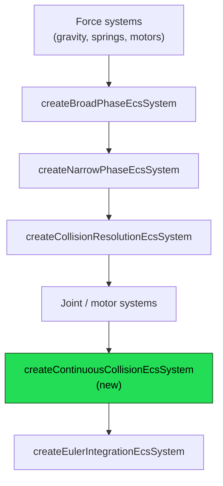

# Design: Continuous Collision Detection (CCD) for Fast-Moving Bodies

|                                        |                                                                                                                                                                                                                                                        |
| -------------------------------------- | ------------------------------------------------------------------------------------------------------------------------------------------------------------------------------------------------------------------------------------------------- |
| **Status**                             | Phases 1 and 2 implemented: sweep primitives (`src/physics/ccd/` - `sweepCircleCircle`/`sweepCirclePolygon`/`sweepCircleTerrain`/`SweepHit`), `createContinuousCollisionEcsSystem`, `RigidBodyEcsComponent.continuousDetection`, and Car demo wiring have landed on `dev`, documented at `documentation-site/docs/docs/physics/continuous-collision-detection.md`. Two things changed from what's proposed below during Phase 2 implementation - see §8 Open Question 1 (the `continuousDetectionThreshold` default is `0.15`, not `0.5`) and the note added to §5.4 (the clamp is only applied for a strictly-positive TOI, not `t = 0`). Phase 3 (swept polygon-vs-static shapes) remains out of scope, per §6/§8 Open Question 5.                                                                                                                                                                                                  |
| **Target module**                      | `/src/physics` → `@forge-game-engine/forge/physics`                                                                                                                                                                                                  |
| **Engine version at time of writing**  | `0.25.4`                                                                                                                                                                                                                                              |
| **Modules**                            | See §1 table below                                                                                                                                                                                                                                   |

## 0. Targeted modules

| Path                                                       | Change   | Notes                                                                                              |
| ------------------------------------------------------------ | -------- | --------------------------------------------------------------------------------------------------- |
| `src/physics/ccd/` | **New** | Pure sweep math: `sweep-circle-polygon.ts`, `sweep-circle-terrain.ts`, `sweep-circle-circle.ts`, `index.ts` |
| `src/physics/systems/continuous-collision-system.ts`         | **New**  | `createContinuousCollisionEcsSystem` - the ECS system wiring sweeps into the simulation loop        |
| `src/physics/types/sweep-hit.ts`                              | **New**  | `SweepHit` return type for the sweep functions                                                       |
| `src/physics/components/rigidbody-component.ts`               | Modified | Adds `continuousDetection` to `RigidBodyDefaultedOptions`                                            |
| `src/physics/systems/index.ts`, `src/physics/components/index.ts`, `src/physics/index.ts` | Modified | Export the new system/module                                                                         |
| `documentation-site/docs/docs/physics/`                       | Modified | New `continuous-collision-detection.md` doc page; cross-links from `terrain.md`/`rigid-bodies.md`    |
| `documentation-site/src/pages/demos/car/_create-game.ts`      | Modified | Registers the new system, once implemented (Phase 2's definition of done)                            |

Nothing is removed.

---

## 1. Summary

A fast-moving `CircleCollider` body (a car's wheel, a thrown/launched projectile) can pass partway - or, at high enough speed, entirely - through a static `TerrainCollider`/`PolygonCollider` within a single physics tick. The engine's discrete-time narrow-phase only tests for overlap at each tick's *start* position; if a body's velocity carries it past a thin obstacle before the *next* tick's test runs, the collision either resolves late (as a large, already-established penetration) or is missed outright.

This was diagnosed directly, not inferred: driving the Car demo (`documentation-site/src/pages/demos/car`) at highish speed and landing wheel-first (chassis pitched ~40-55°, not flipped) produces a measured, repeatable ~25-30 unit penetration of the rear wheel into the terrain (`wheelRadius` is `100`), lasting several ticks before the solver's normal penetration correction clears it. Two solver-tuning knobs were tried and empirically ruled out as fixes: quadrupling `CollisionResolutionOptions.maxBiasSpeed` (300 → 1200) changed peak penetration by less than 3 units; quadrupling `contactHertz` (30 → 120) similarly made no meaningful difference. Neither is the bottleneck - the penetration already exists by the time either knob gets a chance to correct it, because it was created in a single discrete step of motion that outran detection. Only preventing that step from ever landing inside the terrain in the first place fixes it, which is what CCD does.

This document proposes adding **continuous collision detection for dynamic bodies against static bodies**, implemented as a swept-shape query that runs once per tick, per qualifying fast body, between the existing collision-resolution step and Euler integration. It reuses this engine's existing `src/physics/raycast/` primitives (specifically the ray-vs-convex-polygon math already used by `raycastPolygon`/`raycastTerrain`) via the standard technique of inflating the target shape by the moving circle's radius (a Minkowski sum), rather than building an unrelated geometry pipeline from scratch.

**Explicitly excluded from this design: substep integration.** Substepping (running the solver at a higher internal frequency than the rest of the engine's tick) improves general solver stiffness, joint convergence, and stacking stability - a different problem from tunneling, and a much larger architectural change, since this engine's physics systems currently run at the same fixed frequency as every other system in an `EcsWorld` (there is no independent physics clock to subdivide). CCD, as implemented by this design, does not require it: it is a self-contained swept query inserted into the existing single-rate tick, matching how Box2D itself implements CCD - as a post-integration-candidate TOI (time-of-impact) pass for fast bodies, independent of and shipped long before Box2D ever gained substepping. See §7 (Decision Log, DL-1) for the full reasoning, and §9 for how a future substepping design would compose with this one rather than compete with it.

---

## 2. Scope

### In scope

- Swept collision detection for a **dynamic `CircleCollider` body** moving against a **static `PolygonCollider` or `TerrainCollider` body** (matching `RigidBodyEcsComponent.type !== 'dynamic'`, i.e. `'static'`/`'kinematic'`, and the pre-existing convention that a collider entity with no `RigidBodyEcsComponent` at all is static).
- A new `createContinuousCollisionEcsSystem`, registered between `createCollisionResolutionEcsSystem` and `createEulerIntegrationEcsSystem`, that:
  - Identifies which dynamic bodies are moving fast enough this tick to risk tunneling.
  - For each, sweeps against nearby static bodies and finds the earliest time of impact (TOI) in `[0, 1]` across this tick's translation.
  - If a TOI is found, clamps that body's effective translation for this tick's Euler integration step to stop at (fractionally before) the surface, leaving a small, correctly-signed contact for the *next* tick's ordinary broad/narrow-phase and resolution to pick up and solve normally (including warm-starting).
- An automatic, threshold-based decision for "is this body moving fast enough to need a sweep this tick," so existing demos (including the Car demo) benefit without any per-entity opt-in - with a documented, overridable option for a demo/game author who wants to force it on or off for a specific body.
- Unit tests for the sweep primitives themselves (`src/physics/ccd/*.test.ts`), and an integration regression test reproducing the exact wheel-through-terrain scenario measured during diagnosis (mirroring `src/physics/systems/terrain-resting-contact.test.ts`'s existing full-pipeline style).
- Updating the Car demo to register the new system, and documenting the feature under `documentation-site/docs/docs/physics/`.

### Out of scope

- **Substep integration.** See §1 and §7 (DL-1).
- **Dynamic-vs-dynamic CCD** (e.g. two fast circles colliding with each other). Box2D itself defaults to the same restriction ("bullets" don't sweep against other bullets) because a two-body sweep is materially more expensive (both endpoints move during the query) and rarer in practice; nothing in the diagnosed bug or this engine's existing demos needs it. A future phase could add it once a real need appears - see §8, Open Question 4.
- **Swept polygon-vs-polygon or polygon-vs-terrain CCD** (e.g. the car's chassis itself tunneling through terrain, as opposed to its wheels). The diagnosed bug is specifically the wheels (circles); the chassis is a `PolygonCollider`. A correct polygon sweep needs full conservative advancement (or a GJK-based swept test), not the inflate-and-raycast trick this design uses for circles - a materially larger effort that does not block fixing the reported bug. Flagged as a natural Phase 3 in §6, not designed here.
- **Speculative contacts / predictive margins** as an alternative strategy (used by some engines, e.g. Rapier, instead of true TOI sweeps). Considered and rejected in §7 (DL-2).
- Any change to `createCollisionResolutionEcsSystem`'s existing solver (`maxBiasSpeed`, `contactHertz`, `contactDampingRatio`, `slop`) - already empirically shown not to fix this class of bug (§1).
- Broad-phase spatial partitioning (the engine's broad-phase is currently an all-pairs `O(n²)` AABB scan with no spatial structure - see §8, Open Question 2). CCD's own cost-control is handled independently via the fast-body threshold in §5.3, not by fixing broad-phase's own complexity, which is a pre-existing, separate concern.

---

## 3. Background: why this happens

The current per-tick pipeline (see e.g. `documentation-site/src/pages/demos/car/_create-game.ts`'s system registration order) is:

1. Apply forces (`createGravityEcsSystem`, springs, motors) - mutates `velocity`.
2. `createBroadPhaseEcsSystem` - recomputes AABBs from *this tick's* (i.e. last tick's already-integrated) position/rotation, all-pairs overlap test.
3. `createNarrowPhaseEcsSystem` - exact SAT test on broad-phase's candidate pairs, using the same pre-integration position.
4. `createCollisionResolutionEcsSystem` - resolves impulses from this tick's manifolds, further mutating `velocity`.
5. Joint/motor systems.
6. `createEulerIntegrationEcsSystem` - `position.world += velocity * deltaTimeInSeconds` (semi-implicit Euler: position integrates using the *already-resolved* velocity).

Steps 2-4 see the body's position from *before* this tick's motion is applied - they cannot know where the body is about to end up. If a body's velocity is large enough that `velocity * deltaTimeInSeconds` exceeds the gap between its current position and a thin obstacle, step 6 can move it clean through - or deep into - that obstacle in one step, and nothing catches it until *next* tick's step 3, by which point the manifold already reports a large, "pre-existing" penetration.

Measured directly in the Car demo: a wheel (`CircleCollider`, `radius: 100`) traveling at roughly 1200-1500 world units/second covers 20-25 units per 60Hz tick (`1200 / 60 ≈ 20`, `1500 / 60 ≈ 25`) - consistent with the ~25-30 unit penetrations actually observed (the chassis's own rotational momentum, still settling from an asymmetric landing, added a few more ticks before the contact fully arrested). This is not a solver-strength problem; it is a **missed-detection-window** problem, and no amount of tuning the resolution step's correction rate changes when detection first happens.

---

## 4. Prior art

| Engine | Technique | Notes |
| --- | --- | --- |
| Box2D | Per-body "bullet" opt-in *and* an automatic fast-body heuristic; conservative-advancement TOI solver against the broad-phase's dynamic tree; clamps position at TOI, leaves final resolution to the next normal step | This engine already follows Box2D's precedent elsewhere (`b2FindMaxSeparation`'s tie-break bias, `contactPushMaxSpeed` → `maxBiasSpeed`, the soft-constraint solver's `biasRate`/`massScale`/`impulseScale` formulation) - this design continues that precedent rather than inventing an unrelated scheme |
| Bullet Physics | Conservative advancement + GJK, opt-in via `CCD_MOTION_THRESHOLD`/`CCD_SWEPT_SPHERE_RADIUS` per body | Confirms the "opt-in with an automatic distance threshold" shape is a well-worn API, not novel to Box2D |
| Rapier | Nonlinear CCD via bisection search on predicted trajectories, opt-in per rigid body (`.ccd_enabled`) | An alternative "predictive/speculative" family (§7 DL-2) rather than a true swept-shape TOI; considered and rejected here for reasons in that entry |
| PhysX | Both speculative contacts (default, cheap, approximate) and true swept CCD (opt-in, exact) | Two-tier approach; this design's threshold-gated sweep (§5.3) is closer in spirit to PhysX's swept-CCD tier, applied automatically rather than requiring an explicit flag |

---

## 5. Algorithm and pipeline integration

### 5.1 Swept circle vs. convex polygon (the core primitive)

A circle of radius `r` sweeping from point `A` to point `B` first touches a convex polygon at the same parametric time as an infinitely thin ray from `A` to `B` first touches that polygon **inflated by `r`** - each edge offset outward along its own normal by `r`, each vertex rounded into an arc of radius `r`. This is the standard circle-vs-convex-shape Minkowski sweep technique, and it lets this design reuse rather than replace the existing `raycastConvexPolygon` (`src/physics/raycast/raycast-convex-polygon.ts`) - the same function `raycastPolygon`/`raycastTerrain` already call - by:

1. Offsetting each of the target polygon's edges outward along its own `normals[i]` by `r` (matching how `TerrainSegment`'s `vertices`/`normals` are already structured for `detectCircleTerrainCollision`/`raycastTerrain`).
2. Additionally testing the swept ray against a circle of radius `r` centered on each of the polygon's original vertices (to correctly round the Minkowski sum's corners) - reusing `raycastCircle`'s own math, called once per vertex.
3. Taking the earliest (smallest-`t`) hit across both.

`sweepCirclePolygon(circleBody, staticPolygonBody, startPosition, endPosition): SweepHit | null` in `src/physics/ccd/sweep-circle-polygon.ts` implements this. `sweepCircleTerrain` (`src/physics/ccd/sweep-circle-terrain.ts`) is the terrain-collider equivalent, mirroring `raycastTerrain`'s own segment-scan structure (iterate `terrainCollider.segments` whose local x-range overlaps the swept path, delegate each to the same inflated-edge test, keep the earliest hit) - including the same fixed, ascending-segment-index iteration order `detectCircleTerrainCollision`/`raycastTerrain` already use, for the reason in §8, Open Question 3.

```
SweepHit {
  point: Vector2;   // world-space point of first contact
  normal: Vector2;  // outward surface normal at point
  t: number;        // 0..1, the fraction of the swept translation completed at first contact
}
```

### 5.2 Pipeline placement



`createContinuousCollisionEcsSystem` runs **after** every system that can change `velocity` this tick and **before** `createEulerIntegrationEcsSystem`, so it sees the tick's final, fully-resolved velocity - the same value integration is about to use - and can act on exactly what's about to happen, not a stale prediction.

It does not itself move anything or apply impulses. For each qualifying fast dynamic body (§5.3), it computes the *candidate* end position integration is about to produce (`position.world + velocity * deltaTimeInSeconds`, the same expression `createEulerIntegrationEcsSystem` uses), sweeps from the current position to that candidate against nearby static bodies, and - only if a hit is found - writes a **per-tick translation clamp** that `createEulerIntegrationEcsSystem` respects instead of the body's full velocity-derived translation (§5.4 covers precisely how that hand-off works without modifying the existing integration system's own logic).

This mirrors the same design choice this session already validated for `TerrainCollider` narrow-phase's own segment tie-breaking: keep the *existing*, already-tested system (`createEulerIntegrationEcsSystem`, in that case `detectCircleTerrainCollision`'s core loop) untouched wherever possible, and add new behavior as a bounded, single-purpose addition around it, rather than reworking a system that many other things already depend on.

### 5.3 The fast-body threshold

Sweeping every dynamic body every tick against every nearby static body would add cost with no benefit for the overwhelming majority of ticks, where ordinary discrete detection is already correct (a body only needs a sweep when its own tick's translation is large relative to its own size). `createContinuousCollisionEcsSystem` only sweeps a body when:

```
translationDistance = |velocity * deltaTimeInSeconds|
translationDistance > continuousDetectionThreshold * collider's own bounding radius
```

`continuousDetectionThreshold` defaults to `0.15`, tuned empirically during Phase 2 (see §8 Open Question 1) - `0.5` was the initial estimate below, drawn from Bullet Physics's `CCD_MOTION_THRESHOLD`/Box2D's own automatic fast-body heuristic, but turned out too high to actually catch the diagnosed Car demo scenario. This keeps CCD's added cost proportional to how many bodies are actually moving fast, not to the world's total entity count.

### 5.4 Applying the clamp without touching `createEulerIntegrationEcsSystem`

Two options were considered for how `createContinuousCollisionEcsSystem`'s finding reaches integration; see §7 DL-3 for the comparison. The chosen approach: the new system writes a **temporary, single-tick-lived clamp** onto the body's own `RigidBodyEcsComponent` (a new, system-managed field, not caller-facing configuration - the same pattern `GroundContactEcsComponent.groundContacts` and `AirControlEcsComponent.airborneDuration` already establish for "state a system writes and a different system reads, both scoped to the current or a bounded recent window"). `createEulerIntegrationEcsSystem` gains a small, additive check: if that clamp is set this tick, integrate the clamped translation instead of the full `velocity * deltaTimeInSeconds`, then clear it. This is the one small, mechanical touch point `createEulerIntegrationEcsSystem` needs (a few added lines, not a rewrite) - everything else about CCD lives entirely in the new module.

**Found during Phase 2 implementation:** the clamp is only ever written for a strictly-positive TOI (`t > 0`); a sweep result of exactly `t = 0` (the body already touches the target at the tick's *start* position) is left alone. A body resting/rolling in ordinary contact - a wheel climbing a slope fast enough to clear the §5.3 threshold, say - is exactly this shape: large velocity magnitude, but already touching, with this same tick's broad/narrow-phase and `createCollisionResolutionEcsSystem` already having seen and correctly resolved that exact contact (including leaving its tangential/rolling velocity alone). Clamping the *entire* translation to zero for a `t = 0` hit would zero out that legitimate tangential motion too, not just the (already-resolved) into-the-surface component - freezing the body in place every tick for as long as it stayed in fast contact. This was caught by manually driving the Car demo (see §10): the car would climb partway up a hill and then stop dead, with no further input response, until confirmed against `continuous-collision-system.test.ts`'s dedicated regression case for it.

### 5.5 Why "stop at the surface, let next tick resolve it" instead of resolving the impact immediately

Clamping translation at the TOI leaves the body just touching (or a hair's breadth from touching) the static surface, with its *velocity* still unresolved for that contact. The very next tick's ordinary broad-phase/narrow-phase/resolution pipeline then sees a small, ordinary, correctly-signed overlap - exactly the case it's already built, tested, and (as of this session's earlier work) warm-starting-stable for. This avoids duplicating any part of the existing contact-resolution logic (Coulomb friction, restitution, warm-started accumulated impulses) inside the new CCD system; CCD's only job is to prevent the *geometric* miss, not to re-implement the *physical* response to it.

---

## 6. Phases

Each phase is independently completable and releasable, per this engine's own `feat`/`fix`-per-PR, squash-merge-to-`dev` convention.

### Phase 1: Sweep primitives (pure functions, no simulation wiring)

**Goal:** prove the core geometry is correct in isolation before touching the live tick. Definition of done: `sweepCirclePolygon`/`sweepCircleTerrain`/`sweepCircleCircle` exist, are unit-tested (including edge cases: sweep starting already overlapping, sweep that grazes a vertex, sweep entirely missing, sweep exactly reaching but not passing the surface), and are exported from `@forge-game-engine/forge/physics`, but nothing in the engine calls them yet.

| Task | Description | Size |
| --- | --- | --- |
| `SweepHit` type | `src/physics/types/sweep-hit.ts`, mirroring `RaycastShapeHit`'s shape (`point`, `normal`, plus `t` in place of `distance`) | S |
| `sweepCirclePolygon` | Inflated-edge + rounded-vertex sweep against a static `PolygonCollider`, reusing `raycastConvexPolygon`/`raycastCircle` | M |
| `sweepCircleTerrain` | Segment-scan wrapper over `sweepCirclePolygon`, mirroring `raycastTerrain`'s structure | M |
| `sweepCircleCircle` | Swept-circle-vs-static-circle (simpler closed form: shrink the sweep to a ray from the moving circle's center, inflate the static circle's radius by the moving one's) - included since it's a small addition once the polygon case exists, and static circle colliders already exist in the engine (e.g. `Newton's Cradle`) | S |
| Unit tests | Exhaustive per-function cases per the "definition of done" above, plus a couple of tests replaying the exact velocity/geometry measured in the Car demo diagnosis (§1) as a fixed regression case at the pure-math level | M |

### Phase 2: Wire into the simulation loop

**Goal:** the diagnosed bug no longer reproduces in the Car demo. Definition of done: `createContinuousCollisionEcsSystem` exists and is registered in the Car demo between resolution and integration; a full-pipeline integration test (mirroring `terrain-resting-contact.test.ts`) reproduces the exact wheel-through-terrain scenario and asserts bounded, small penetration instead of the previously-measured ~25-30 units; the Car demo is driven in a real browser (per this repo's standard demo-verification process) under the same sustained-throttle, highish-speed, wheel-first-landing conditions that originally reproduced the bug, confirming no visible embedding.

| Task | Description | Size |
| --- | --- | --- |
| `RigidBodyEcsComponent.continuousDetection` | New field on `RigidBodyDefaultedOptions` (default `true` for dynamic bodies against static bodies - matches "the reported bug is an ordinary wheel, not something a demo author should have to know to flag," §7 DL-4); settable `false` per body to opt out | S |
| `createContinuousCollisionEcsSystem` | The system itself: threshold check (§5.3), candidate-end-position computation, nearby-static-body query (reusing `AabbEcsComponent`/`aabbsOverlap` over a swept AABB spanning start→end), sweep dispatch, clamp write-back | L |
| `createEulerIntegrationEcsSystem` clamp support | The small addition in §5.4 | S |
| Integration regression test | Full-pipeline test reproducing the diagnosed scenario | M |
| Car demo wiring + manual verification | Register the system; browser-verify per AGENTS.md's "Documentation Site Demos" process | S |
| Changelog + docs | `CHANGELOG.md` entry; new `documentation-site/docs/docs/physics/continuous-collision-detection.md` page, cross-linked from `terrain.md` and the rigid-bodies guide | S |

### Phase 3 (future, not designed here): swept polygon-vs-static shapes

Extending CCD to a fast-moving `PolygonCollider` (e.g. the car's chassis itself, or any other polygon body) against static `PolygonCollider`/`TerrainCollider` bodies. Needs full conservative advancement or a GJK-based swept test rather than the inflate-and-raycast trick this design uses for circles, since a rotating, translating polygon's swept volume isn't a simple offset of its target. Not designed here because it isn't needed to fix the reported bug (the wheels are circles) and deserves its own focused design once a concrete need for it appears - see §8, Open Question 5.

---

## 7. Decision log

| # | Decision | Options considered | Chosen | Rationale / tradeoffs |
| --- | --- | --- | --- | --- |
| DL-1 | CCD vs. substep integration | (a) Substep the whole solver at a higher internal rate; (b) swept-shape CCD at the existing tick rate; (c) both | (b), CCD only | Substepping solves a broader class of problems (general stiffness, stacking, joint convergence) but requires decoupling the physics tick from the rest of the engine's single shared frequency - a materially larger architectural change with its own design surface (how do render-visible transforms interpolate between substeps? do all systems substep, or only physics?). CCD alone directly and fully addresses the diagnosed bug (confirmed by ruling out solver-tuning fixes in §1) without that dependency. Requested explicitly in scope discussion; (a)/(c) may be worth a future, separate design once a concrete need beyond tunneling appears. |
| DL-2 | True swept TOI vs. speculative/predictive contacts | (a) True swept-shape TOI (this design); (b) Rapier-style speculative contacts: generate a contact constraint slightly before actual touching, let the solver's own velocity constraint prevent penetration reactively | (a) | Speculative contacts are cheaper (no sweep math) but only prevent penetration the solver can react to *before* it's already deep - they still fundamentally rely on detecting the contact before integration, which is only reliable if the speculative margin exceeds the body's own per-tick travel, i.e. they still need a distance-based threshold to be effective at all, at which point the complexity saved is marginal while the exactness lost (a true TOI, vs. an approximate margin) is not. A true sweep also composes more simply with existing warm-starting (§5.5) since it hands off a clean, ordinary contact to the next tick rather than an early/approximate one this tick. |
| DL-3 | Where the CCD-found clamp is applied | (a) `createContinuousCollisionEcsSystem` mutates `position.world` directly, bypassing integration entirely for the clamped body this tick; (b) it mutates `velocity` for this tick only, letting the existing integration formula naturally land at the right spot; (c) it writes a small, explicit, system-managed clamp field that `createEulerIntegrationEcsSystem` checks | (c) | (a) duplicates integration's own math in a second place (rotation integration, kinematic-body handling) - a maintenance hazard. (b) is tempting but wrong: scaling velocity down to avoid tunneling this tick would also feed a smaller, incorrect value into anything else reading `velocity` this same tick (friction, next tick's resting-contact expectations) before it's restored. (c) keeps `velocity` as the single source of truth for "how fast is this body actually going," touches `createEulerIntegrationEcsSystem` with a small additive check instead of a rewrite, and matches this codebase's established pattern of small, system-managed state fields (`GroundContactEcsComponent.groundContacts`, `AirControlEcsComponent.airborneDuration`) read by a different system than the one that writes them. |
| DL-4 | Opt-in flag vs. automatic threshold | (a) Off by default, a Box2D-"bullet"-style explicit per-body flag; (b) on by default for all dynamic-vs-static pairs, gated only by the speed threshold (§5.3); (c) on by default, with a per-body override in either direction | (c) | The diagnosed bug is an *ordinary wheel* on an *ordinary* demo - not a specially-flagged "fast projectile" a demo author would think to mark. An opt-in-only design (a) would have shipped this exact bug unfixed by default. Fully unconditional CCD for every dynamic body regardless of speed (dropping §5.3's threshold entirely) would cost more than needed for the common case of slow-moving bodies. (c) defaults to safe (fixes the reported class of bug for everyone automatically) while still letting a game opt a specific body out (e.g. a deliberately fast "ghost" trigger volume that should be allowed to pass through geometry) or force it on below the automatic threshold. |
| DL-5 | Scope: dynamic-vs-static only, not dynamic-vs-dynamic | (a) Support both from the start; (b) static only for v1 | (b) | Matches Box2D's own default restriction (§4) for the same reason: a two-moving-body sweep is materially more expensive and more complex (both endpoints move during the query window), and every occurrence of the diagnosed bug, and every existing demo in this repository, is a fast body against a static one (terrain, a wall, a floor). Deferred to a future phase per §8, Open Question 4, rather than speculatively built now. |

---

## 8. Open questions

1. **What `continuousDetectionThreshold` (§5.3) is right?** ~~`0.5` (half the collider's own bounding radius per tick) is a reasonable starting point drawn from other engines' defaults, but needs empirical tuning against both the Car demo (confirm the diagnosed scenario is caught) and a synthetic slow-body benchmark (confirm normal resting/rolling contacts are *not* needlessly swept every tick). Should be resolved during Phase 2 implementation, not blocking Phase 1.~~ **Resolved in Phase 2:** `0.5` turned out too high - the diagnosed Car demo scenario itself (a `wheelRadius: 100` wheel translating ~20-25 units/tick at its measured 1200-1500 unit/second range) sits at a ratio of `0.2`-`0.25`, below that default, so it wouldn't have engaged the sweep at all. `0.15` catches that whole measured range with margin, confirmed both by `continuous-collision-system.test.ts`'s direct threshold/clamp assertions and by manually driving the Car demo in a browser.
2. **How does the nearby-static-body query for a sweep avoid duplicating the broad-phase's own `O(n²)` all-pairs cost?** The current broad-phase (`createBroadPhaseEcsSystem`) is already an all-pairs AABB scan with no spatial structure. A naive CCD implementation that re-queries "all static bodies" per fast dynamic body would compound that cost. The most direct option is extending each qualifying body's *own* AABB to cover its swept path for one extra broad-phase-style pass restricted to bodies already found to need a sweep (typically a small subset of the world) - bounding the added cost to "fast bodies × static bodies," not "all bodies × all bodies." Whether that's sufficient at scale, or whether this motivates finally adding a spatial structure to broad-phase generally (a separate, pre-existing concern per §2's Out of Scope), should be settled with a benchmark early in Phase 2, before the system's query shape is finalized.
3. **Should terrain sweeps use the same fixed-order, tolerance-biased tie-break this session already had to add to `detectCircleTerrainCollision`?** That fix (topology-keyed feature ids, `DEPTH_TIE_TOLERANCE`) exists because floating-point noise could otherwise flip which of two near-coplanar segments "wins" a discrete contact from tick to tick, breaking warm-starting. A sweep's TOI result feeds into *which* segment's contact gets resolved next tick, so the same class of noise-driven instability is plausible here too. Needs a dedicated pass at the same rigor once `sweepCircleTerrain` exists, using the same reproduction technique (a wide body swept across many near-coplanar segments, perturbed by sub-pixel jitter) - likely reuses the existing `DEPTH_TIE_TOLERANCE` constant and reasoning directly rather than inventing a parallel one.
4. **Is dynamic-vs-dynamic CCD (§2 Out of Scope, §7 DL-5) worth a future phase, and if so, when?** No current demo or reported bug needs it. Worth revisiting if a future feature (e.g. fast projectiles that can hit each other, not just terrain) makes it concrete rather than speculative.
5. **When does swept polygon-vs-polygon/terrain CCD (§6 Phase 3) become worth designing?** The car's chassis (a `PolygonCollider`) can in principle tunnel the same way its wheels can, just less often in practice (it's larger, and the wheels take the brunt of ground contact in normal play). Worth a dedicated design once either a concrete reproduction of chassis tunneling appears, or another polygon-heavy use case (e.g. a fast melee weapon hitbox) surfaces the same need independently.
6. **Should `SweepHit`/the sweep functions be part of the public `@forge-game-engine/forge/physics` API surface (usable directly by game code, the way `raycast` already is), or purely an internal implementation detail of `createContinuousCollisionEcsSystem`?** Leaning toward public, mirroring `raycast`'s own precedent (useful standalone for "will this fast-moving thing hit that wall if I don't do anything" queries, e.g. AI or gameplay-scripted dodges) - but should be confirmed before Phase 1 locks in the module's exported shape.

---

## 9. Relationship to a possible future substepping design

Nothing in this design forecloses substepping being added later. If it is, the two compose rather than conflict: substepping would change how many times *all* physics systems run per rendered frame (a broader, orthogonal change to the engine's tick model), while CCD's sweep would simply run once per *sub-tick* instead of once per tick - the sweep math in §5.1 and the pipeline placement in §5.2 are expressed in terms of "this tick's" start/end position and don't assume anything about how long a tick is or how many run per frame. A future substepping design should treat this document's Phase 1 primitives as reusable as-is.

---

## 10. Testing considerations

- **Pure-math level** (Phase 1): exhaustive unit tests per sweep function, including the exact velocity/geometry combination measured in the Car demo diagnosis, asserting the correct TOI and normal.
- **Full-pipeline level** (Phase 2): an integration test in the style of `src/physics/systems/terrain-resting-contact.test.ts` - real `EcsWorld`, real gravity/broad-phase/narrow-phase/resolution/CCD/integration systems, a `CircleCollider` body given a velocity and starting position chosen to reproduce the diagnosed tunneling geometry against a `TerrainCollider`, asserting the body's final penetration stays bounded (near the solver's existing `slop`) rather than reaching the previously-measured tens of units.
- **Demo-level** (Phase 2, manual): per AGENTS.md's "Documentation Site Demos" process - rebuild, browser-verify the Car demo under the same sustained-throttle/highish-speed conditions that originally reproduced the bug, confirming no visible wheel/chassis embedding on a hard, wheel-first landing.
- **Regression guard for §8 Open Question 3** (once resolved): a wide-body-across-many-segments jitter test mirroring `detect-circle-terrain-collision.test.ts`'s own "should never flip feature ids for a wide body..." test, applied to the sweep path.
