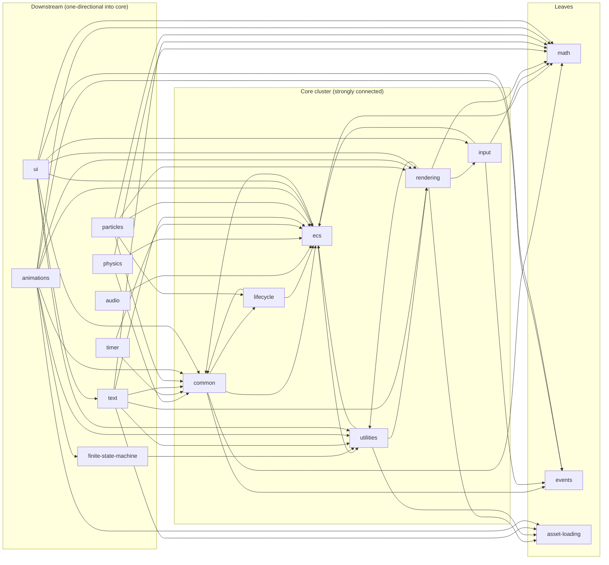
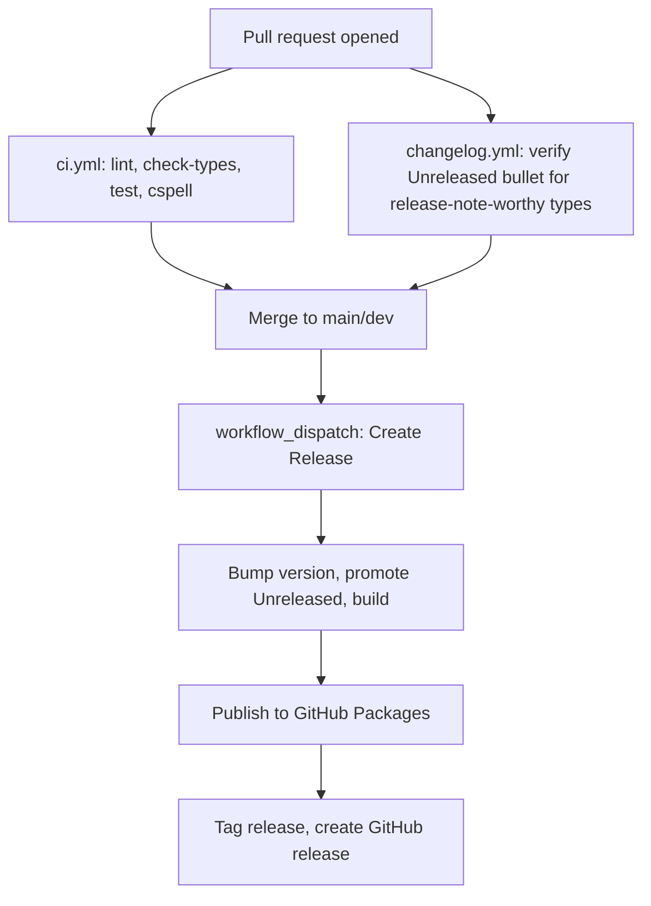

# Splitting Engine Modules Into Individual Repositories

|                                  |        |
| -------------------------------- | ------ |
| Engine version at time of design | 0.25.0 |

## Targeted Modules

| Module (current `/src` path)                                                                                   | Status   | Notes                                                                                                                                                                                                                                                                                                                             |
| -------------------------------------------------------------------------------------------------------------- | -------- | --------------------------------------------------------------------------------------------------------------------------------------------------------------------------------------------------------------------------------------------------------------------------------------------------------------------------------- |
| `math`                                                                                                         | Modified | Extracted to its own repo/package (`@forge-game-engine/math`). No source changes required — already a dependency-free leaf.                                                                                                                                                                                                       |
| `events`                                                                                                       | Modified | Extracted to its own repo/package (`@forge-game-engine/events`). Already a leaf.                                                                                                                                                                                                                                                  |
| `asset-loading`                                                                                                | Modified | Extracted to its own repo/package (`@forge-game-engine/asset-loading`). Already a leaf.                                                                                                                                                                                                                                           |
| `common`, `ecs`, `lifecycle`, `utilities`, `rendering`, `input`                                                | Modified | Merged into a single new repo/package, `@forge-game-engine/core` — see [The Core Cluster](#the-core-cluster). Some files move between these modules and/or a few imports are rewritten to break existing circular imports before the split (see Phase 0).                                                                         |
| `audio`                                                                                                        | Modified | Extracted to its own repo/package (`@forge-game-engine/audio`).                                                                                                                                                                                                                                                                   |
| `finite-state-machine`                                                                                         | Modified | Extracted to its own repo/package (`@forge-game-engine/fsm`), matching the existing `./fsm` export alias.                                                                                                                                                                                                                         |
| `physics`                                                                                                      | Modified | Extracted to its own repo/package (`@forge-game-engine/physics`).                                                                                                                                                                                                                                                                 |
| `timer`                                                                                                        | Modified | Extracted to its own repo/package (`@forge-game-engine/timer`).                                                                                                                                                                                                                                                                   |
| `text`                                                                                                         | Modified | Extracted to its own repo/package (`@forge-game-engine/text`).                                                                                                                                                                                                                                                                    |
| `particles`                                                                                                    | Modified | Extracted to its own repo/package (`@forge-game-engine/particles`).                                                                                                                                                                                                                                                               |
| `animations`                                                                                                   | Modified | Extracted to its own repo/package (`@forge-game-engine/animations`).                                                                                                                                                                                                                                                              |
| `ui`                                                                                                           | Modified | Extracted to its own repo/package (`@forge-game-engine/ui`).                                                                                                                                                                                                                                                                      |
| `@forge-game-engine/forge` (root package)                                                                      | Modified | Stops being a published, re-exporting package — see [Decision Log](#decision-log). The `Forge` repo continues to exist, hosting only `/documentation-site` and `/e2e`; the old npm package is deprecated on the registry once the split completes (Phase 5), pointing consumers at the individual packages via a migration guide. |
| `@forge-game-engine/dev-config`                                                                                | New      | Shared ESLint/TypeScript/Prettier/commitlint configuration package, consumed by every new repo so lint/format/type rules don't drift across repos.                                                                                                                                                                                |
| `forge-game-engine/ci-templates` (new GitHub repo)                                                             | New      | Shared reusable GitHub Actions workflows (`ci.yml`, `changelog.yml`, `create-release.yml`) that every package repo calls into, instead of duplicating five workflow files per repo.                                                                                                                                               |
| No `/src` module is removed by this design — only the root `@forge-game-engine/forge` npm artifact is retired. |          |                                                                                                                                                                                                                                                                                                                                   |

## Summary

The engine currently ships as a single npm package (`@forge-game-engine/forge`) built from
one `/src` tree with per-module `exports` entries (`/ecs`, `/rendering`, `/physics`, ...).
Everything lives in one GitHub repository, is versioned together, and is released together.

This document designs a path to splitting the engine's modules into independently
versioned, independently released packages, each living in its own GitHub repository under
the `forge-game-engine` organization. The goal is to let consumers depend on, and the team
release, individual subsystems (physics, rendering, ui, ...) without every change to one
module forcing a version bump and a re-test of every other module, and without every
module's CI running on every commit regardless of what changed.

A full dependency audit of the current `/src` tree (see [Current Dependency
Graph](#current-dependency-graph)) found that six of the seventeen modules
(`common`, `ecs`, `lifecycle`, `utilities`, `rendering`, `input`) form a single strongly
connected component: every one of the six can reach every other one of the six through a
chain of imports, including several direct two-way imports between module pairs. A package
manager cannot install two packages that depend on each other's not-yet-published version,
so this cluster cannot be split apart until those cycles are broken, and breaking all of them
is a substantial refactor in its own right. This design treats that cluster as a single
`core` package for now, and proposes breaking the cycles as a prerequisite phase rather than
a blocking dependency of the whole effort.

This design deliberately does not keep the root `@forge-game-engine/forge` package alive as a
permanent umbrella that re-exports every extracted package. An umbrella dependency that pulls
in the whole engine regardless of what a consumer actually uses defeats the purpose of
splitting the engine into independently versioned pieces in the first place, and it becomes a
new synchronization point of its own. Instead, the `Forge` repository continues on as the home
for `/documentation-site` and `/e2e`, migrating onto each package as it's extracted,
and the old package is deprecated on the registry with a migration guide once the split is
done — see the [Decision Log](#decision-log).

## Scope

### In scope

- Auditing and documenting the current inter-module dependency graph.
- A plan to break the circular imports that block splitting `common`, `ecs`, `lifecycle`,
  `utilities`, `rendering`, and `input` apart.
- Proposed repository and package boundaries, and the order in which they should be
  extracted.
- Versioning and publishing strategy across multiple repositories.
- CI/CD pipeline design for N repositories (build, test, lint, changelog, release).
- How `/documentation-site` and `/e2e` (which currently consume the engine via a
  single `file:..` dependency) adapt to consuming multiple packages.
- Migration guidance for existing consumers of `@forge-game-engine/forge/<module>` imports
  onto the individual packages, and how the old package is retired on the registry.
- Shared tooling/config strategy (ESLint, TypeScript, Prettier, commitlint) across repos.

### Out of scope

- Actually resolving every circular import inside the `core` cluster down to independently
  modules that can be split apart. Phase 0 (below) removes the imports that are easy wins and clearly
  don't belong where they are; fully decomposing `core` into e.g. separate `ecs`, `common`,
  `rendering`, `input`, `lifecycle`, and `utilities` packages is left as a follow-up design,
  to be written once the team has experience operating the multi-repo pipeline this design
  introduces.
- Changing any public API surface, component, or system behavior. This is a packaging and
  process change, not a feature change.
- Choosing a build system replacement (esbuild, tsup, Rollup, etc.) for `tsc`. Each new
  package repo reuses the existing `tsc --project tsconfig.build.json` build approach.
- Monetization, licensing, or governance changes to any extracted package.
- Automating the actual GitHub repository creation/transfer (out of this document's remit —
  it specifies what should exist, not the mechanical `gh repo create` steps).

## Current Dependency Graph

Every direct cross-module import in `/src` (excluding test files' internal-only imports and
each module's own internal folders), as of engine version 0.25.0:

| Module                 | Imports from                                                                                         |
| ---------------------- | ---------------------------------------------------------------------------------------------------- |
| `animations`           | `asset-loading`, `common`, `ecs`, `events`, `finite-state-machine`, `math`, `rendering`, `utilities` |
| `asset-loading`        | _(none — leaf)_                                                                                      |
| `audio`                | `ecs`                                                                                                |
| `common`               | `ecs`, `events`, `lifecycle`, `math`                                                                 |
| `ecs`                  | `common`, `events`, `math`, `utilities`                                                              |
| `events`               | _(none — leaf)_                                                                                      |
| `finite-state-machine` | `utilities`                                                                                          |
| `input`                | `common`, `ecs`, `events`, `math`                                                                    |
| `lifecycle`            | `common`, `ecs`                                                                                      |
| `math`                 | _(none — leaf)_                                                                                      |
| `particles`            | `common`, `ecs`, `lifecycle`, `math`, `rendering`                                                    |
| `physics`              | `common`, `ecs`, `math`                                                                              |
| `rendering`            | `asset-loading`, `common`, `ecs`, `input`, `math`, `utilities`                                       |
| `text`                 | `asset-loading`, `common`, `ecs`, `math`, `rendering`, `utilities`                                   |
| `timer`                | `common`, `ecs`                                                                                      |
| `ui`                   | `common`, `ecs`, `events`, `input`, `math`, `rendering`, `text`, `utilities`                         |
| `utilities`            | `asset-loading`, `common`, `ecs`, `rendering`                                                        |

### The Core Cluster

Six modules form a strongly connected component — there is a path from any one of them to
any other, and back again:

| Cyclic edge pair                                             | Concrete example                                                                                                                                                                                                                                                |
| ------------------------------------------------------------ | --------------------------------------------------------------------------------------------------------------------------------------------------------------------------------------------------------------------------------------------------------------- |
| `common` ↔ `ecs`                                             | `common/systems/age-scale-system.ts` imports `EcsWorld` from `ecs`; `ecs/ecs-world.ts` imports `Stoppable`/`Updatable` from `common`.                                                                                                                           |
| `common` ↔ `lifecycle`                                       | `common/systems/age-scale-system.ts` imports `LifetimeComponent` from `lifecycle`; `lifecycle/systems/lifetime-tracking-system.ts` imports `Time` from `common`.                                                                                                |
| `ecs` ↔ `utilities`                                          | `ecs/ecs-component.ts` and `ecs/ecs-world.ts` import `Brand`, `DirectedAcyclicGraph`, `SparseSet` from `utilities`; `utilities/game.ts`/`create-game.ts` import `EcsWorld` from `ecs`.                                                                          |
| `utilities` ↔ `rendering`                                    | `utilities/game.ts`/`create-game.ts` import `RenderContext`, `createCanvas`, `createRenderContext` from `rendering`; `rendering/materials/material.ts` imports `assertNever`, and `rendering/systems/render-system.ts` imports `matchesMask`, from `utilities`. |
| `rendering` → `input` → (`ecs`/`common`) → ... → `rendering` | `rendering/components/camera-component.ts` imports `Axis1dAction`/`Axis2dAction` from `input`; `input` imports from `ecs` and `common`, which reach back to `rendering` through the edges above.                                                                |

No package registry lets package A's published version depend on package B's not-yet-published
version while B depends on A's — so these six modules must ship as one package (proposed name:
`@forge-game-engine/core`) until the cycles above are broken. The likely shape of that future
untangling (not designed here): `Brand`, `DirectedAcyclicGraph`, and `SparseSet` are genuinely
dependency-free data structures that don't belong in `utilities` importing `rendering` — moving
them to a small leaf package `ecs` can depend on would remove the `ecs` ↔ `utilities` edge.
`game.ts`/`create-game.ts` (the only things in `utilities` that pull in `rendering` and `ecs`) are
arguably an application-composition-root concern, not a "utilities" concern, and could move to
their own package that depends on `core` rather than living inside it. Similar analysis would be
needed for the `common` ↔ `ecs` and `common` ↔ `lifecycle` edges. This document does not commit to
those specific refactors — see [Open Questions](#open-questions) — but flags them as the likely
next step after this design ships.

## Phases

Each phase is independently shippable: the repository/package boundaries and consumer-facing
behavior are stable at the end of every phase, even if later phases haven't started.

### Phase 0 — Break the easy circular imports, add a cycle guard

Goal: reduce the risk of Phase 3 (extracting `core`) by fixing what can be fixed without a
repo split, and make it impossible to silently reintroduce a new cross-module cycle while the
rest of this plan is executed over multiple releases.

| Task                                                                          | Description                                                                                                                                                                                                                            | Size |
| ----------------------------------------------------------------------------- | -------------------------------------------------------------------------------------------------------------------------------------------------------------------------------------------------------------------------------------- | ---- |
| Add a dependency-cycle lint rule                                              | Introduce `eslint-plugin-boundaries` (or `dependency-cruiser` run in CI) configured with the current 17 module boundaries, so any _new_ cross-module cycle fails CI immediately. Existing cycles are allow-listed as a known baseline. | M    |
| Document the baseline                                                         | Commit the dependency table and diagram from this design (or a generated equivalent) so the baseline is checked, not just described in a design doc that can drift.                                                                    | S    |
| Evaluate moving `Brand`/`DirectedAcyclicGraph`/`SparseSet` out of `utilities` | Spike whether these can move to a new dependency-free location `ecs` imports directly, removing the `ecs` ↔ `utilities` edge. Land only if it doesn't destabilize `check-exports`.                                                     | M    |
| Evaluate moving `game.ts`/`create-game.ts` out of `utilities`                 | Spike whether the `Game`/`createGame` composition helpers can move to their own module (or into `core`'s top-level, once `core` exists) instead of living in `utilities`, removing the `utilities` → `rendering` edge.                 | M    |
| Re-run the dependency audit                                                   | Confirm which cycles remain after the two spikes above land (or confirm none do, and record why), and update the cycle-guard allow-list to match reality.                                                                              | S    |

Definition of done: CI fails on any newly introduced cross-module cycle; the design's stated
baseline of remaining cycles matches what the lint rule allow-lists.

### Phase 1 — Rehearse the split inside the existing repo

Goal: prove the proposed package boundaries actually build, type-check, and test
independently, and iron out tooling problems (workspace config, `tsconfig` project
references, `exports` map generation) while everything is still one repo and one `git
revert` away from undone.

| Task                                   | Description                                                                                                                                                                                                                                                                                                     | Size |
| -------------------------------------- | --------------------------------------------------------------------------------------------------------------------------------------------------------------------------------------------------------------------------------------------------------------------------------------------------------------- | ---- |
| Convert to npm workspaces              | Move `/src/<module>` to `/packages/<name>/src`, each with its own `package.json`, `tsconfig.json`, and `vitest` config, wired up as an npm workspace.                                                                                                                                                           | L    |
| Per-package build                      | Each workspace package builds its own `dist` via `tsc`; the root `build` script becomes "build every workspace package in dependency order."                                                                                                                                                                    | M    |
| Per-package test/lint/type-check       | `npm test`, `npm run lint`, `npm run check-types` run per-workspace and are aggregated at the root, matching today's single-command developer experience.                                                                                                                                                       | M    |
| Root package stops publishing          | The root `package.json` drops its `exports` map and publish-related fields; `/documentation-site` and `/e2e` become plain workspace members that depend on the individual workspace packages directly (still via workspace links at this stage, not the registry yet), not through a re-exporting root package. | M    |
| Validate `/documentation-site`, `/e2e` | Confirm all three still build and run against the per-module workspace packages with no behavioral change, only updated import specifiers.                                                                                                                                                                      | M    |

Definition of done: `npm run check-types && npm test && npm run lint && npm run cspell &&
npm run check-exports` all pass against the new workspace layout, and
`/documentation-site` and `/e2e` build and run against the individual workspace packages with the same
behavior as before, using updated (but not yet registry-published) import paths.

### Phase 2 — Extract the leaf packages first

Goal: prove the cross-_repository_ pipeline (a separate GitHub repo, its own CI, its own
release/publish flow, being consumed by the still-monolithic rest of the engine as a real
published dependency rather than a workspace symlink) using the lowest-risk modules: the
three that have zero internal dependencies and are unlikely to change often.

| Task                                                   | Description                                                                                                                                                                                                                        | Size |
| ------------------------------------------------------ | ---------------------------------------------------------------------------------------------------------------------------------------------------------------------------------------------------------------------------------- | ---- |
| Create `forge-game-engine/ci-templates`                | A new repo holding reusable GitHub Actions workflows (build/test/lint/changelog/release) that every subsequent repo calls via `workflow_call`, so the same five-workflow pattern used today isn't hand-copied into every new repo. | M    |
| Create `forge-game-engine/dev-config`                  | A new repo/package holding shared ESLint config, base `tsconfig`, Prettier config, and commitlint config, published so every other repo has one dependency to bump instead of N sets of duplicated config files.                   | M    |
| Extract `math`                                         | New repo, own CI, own `CHANGELOG.md`, published as `@forge-game-engine/math`.                                                                                                                                                      | M    |
| Extract `events`                                       | Same pattern as `math`.                                                                                                                                                                                                            | M    |
| Extract `asset-loading`                                | Same pattern as `math`.                                                                                                                                                                                                            | M    |
| Point workspace `core`-to-be at the published packages | The still-in-monorepo modules that depended on `math`/`events`/`asset-loading` now depend on the published npm packages instead of the workspace-local copies.                                                                     | M    |
| Update `/documentation-site`, `/e2e`                   | These now depend on the published `@forge-game-engine/math`/`events`/`asset-loading` packages instead of the workspace-local copies — the first real proof that a consumer outside the workspace can build against the split.      | S    |

Definition of done: `math`, `events`, and `asset-loading` are independently versioned,
independently released, and consumed by the rest of the engine (still in the main repo) the
same way an external consumer would — over the registry, not a workspace link.
`/documentation-site` and `/e2e` build and run unchanged against the newly published
packages.

### Phase 3 — Extract the core cluster

Goal: extract the highest-risk, highest-blast-radius piece — `common`, `ecs`, `lifecycle`,
`utilities`, `rendering`, and `input` as one repo/package, `@forge-game-engine/core`.

| Task                                   | Description                                                                                                                                                                                                                                                           | Size |
| -------------------------------------- | --------------------------------------------------------------------------------------------------------------------------------------------------------------------------------------------------------------------------------------------------------------------- | ---- |
| Create `forge-game-engine/core` repo   | Move the six-module workspace package into its own repo, own CI (via `ci-templates`), own `CHANGELOG.md`.                                                                                                                                                             | XL   |
| Publish `@forge-game-engine/core`      | First real release, following the versioning strategy from [Design: Versioning and Publishing](#versioning-and-publishing).                                                                                                                                           | M    |
| Re-point remaining in-monorepo modules | `audio`, `finite-state-machine`, `physics`, `timer`, `text`, `particles`, `animations`, `ui` (still workspace packages at this point) depend on published `@forge-game-engine/core` instead of the workspace-local modules.                                           | L    |
| Update `/documentation-site`, `/e2e`   | These now depend on the published `@forge-game-engine/core` package instead of the workspace-local modules.                                                                                                                                                           | S    |
| Full regression pass                   | Run the complete verification checklist (types, tests, lint, cspell, exports, demos, e2e) against the now-multi-repo dependency chain, since this is the first phase where a real published version boundary sits in the middle of the engine's most-used code paths. | L    |

Definition of done: `@forge-game-engine/core` is published and consumed by every remaining
in-monorepo module over the registry; the full verification checklist passes;
`/documentation-site` and `/e2e` behave identically to before the phase.

### Phase 4 — Extract the remaining downstream packages

Goal: extract everything that depends only on `core` and/or the Phase 2 leaves, now that the
riskiest package (`core`) has burned in through at least one release cycle.

| Task                                                                             | Description                                                                                                                                                  | Size |
| -------------------------------------------------------------------------------- | ------------------------------------------------------------------------------------------------------------------------------------------------------------ | ---- |
| Extract `audio`, `finite-state-machine`, `physics`, `timer`, `text`, `particles` | Six repos, each following the Phase 2 pattern. These have no dependencies on each other, so they can be extracted in any order, in parallel.                 | L    |
| Extract `animations`                                                             | Depends on `finite-state-machine`, so extract after it.                                                                                                      | M    |
| Extract `ui`                                                                     | Depends on `text` and `core`'s `input`, so extract last of this phase.                                                                                       | L    |
| Update `/documentation-site`, `/e2e`                                             | Depend on all newly published packages.                                                                                                                      | S    |
| Retire the workspace layout                                                      | `/packages` is removed from the main repo; only `/documentation-site` and `/e2e` remain, each depending purely on published `@forge-game-engine/*` packages. | M    |

Definition of done: every module identified in this design has an independent repo,
package, and release history; the main `Forge` repo contains only the documentation site
and e2e suite, with no package of its own.

### Phase 5 — Retire the old package

Goal: deprecate `@forge-game-engine/forge` on the registry and give any remaining external
consumers still on it a mapping onto the individual packages.
`/documentation-site` and `/e2e` are already fully migrated as of Phase 4, so this phase is
about consumers outside this repository.

| Task                       | Description                                                                                                                                                                                     | Size |
| -------------------------- | ----------------------------------------------------------------------------------------------------------------------------------------------------------------------------------------------- | ---- |
| Publish a migration guide  | A docs page showing the mapping from `@forge-game-engine/forge/<module>` to `@forge-game-engine/<module>`.                                                                                      | S    |
| Deprecate the old package  | `npm deprecate @forge-game-engine/forge` (GitHub Packages' registry supports the same `npm deprecate` mechanism) with a message pointing at the migration guide, on the last published version. | S    |
| Clean up the root manifest | Remove the now-unused `exports` map, `files`, and publish-related scripts from the root `package.json`, since it no longer describes an installable package.                                    | S    |

Definition of done: the migration guide is published; the old package is marked deprecated
on the registry; the root `package.json` no longer describes a publishable package.

## Decision Log

| Decision                                               | Options considered                                                                                                                                                                                                                                                                                                                                                              | Chosen | Rationale / tradeoffs / assumptions                                                                                                                                                                                                                                                                                                                                                                                                                                                                                                                                                                                                                                                                                                  |
| ------------------------------------------------------ | ------------------------------------------------------------------------------------------------------------------------------------------------------------------------------------------------------------------------------------------------------------------------------------------------------------------------------------------------------------------------------- | ------ | ------------------------------------------------------------------------------------------------------------------------------------------------------------------------------------------------------------------------------------------------------------------------------------------------------------------------------------------------------------------------------------------------------------------------------------------------------------------------------------------------------------------------------------------------------------------------------------------------------------------------------------------------------------------------------------------------------------------------------------ |
| Granularity of the initial split                       | (a) One repo per current `/src` module (17 repos); (b) one repo per dependency tier, keeping the strongly-connected cluster together (what this design proposes); (c) one repo per demo-relevant grouping (e.g. "rendering + text + ui")                                                                                                                                        | (b)    | Option (a) is impossible today without first fully untangling the core cluster's cycles, which is a large, separate effort (see Out of Scope). Option (b) ships real value (independent versioning/CI for 11 of 17 modules) without waiting on that untangling. Assumes the team accepts `core` as a coarser-grained package for now; revisit once Phase 0's spikes land.                                                                                                                                                                                                                                                                                                                                                            |
| Versioning strategy across repos                       | (a) Fully independent semver per repo (each tags/releases on its own schedule); (b) a synchronized release train, all packages bumped and released together like Angular's core packages                                                                                                                                                                                        | (a)    | The entire motivation for this split is letting a change to, say, `physics` ship without forcing a version bump and re-test of `ui`. A synchronized train would preserve today's "everything moves together" cost while adding N repos' worth of process overhead, with none of the benefit. Tradeoff: consumers must now reason about compatible version _ranges_ across packages rather than one version number; see the integration-testing open question below.                                                                                                                                                                                                                                                                  |
| Root package's post-split role                         | (a) A permanent umbrella/meta-package that depends on and re-exports every extracted package, so `@forge-game-engine/forge/<module>` keeps resolving; (b) no republished package at all — the `Forge` repo becomes a pure docs/e2e host, migrated onto each package as it's extracted, with the old package deprecated and a migration guide published once the split completes | (b)    | An umbrella that re-exports everything defeats the purpose of the split: installing it still pulls in every package regardless of what a consumer actually uses, and its own version becomes a new cross-package synchronization point — exactly the coupling this design is trying to remove. AGENTS.md's pre-1.0 stance (no upgrade guides required for breaking changes) means consumers can be pointed at a migration guide and cut over directly instead of being shielded indefinitely. Tradeoff: `/documentation-site` and `/e2e` must be migrated incrementally at each extraction phase (Phases 2-4) instead of once at the end, and any external consumer has a real migration to make rather than a silent no-op upgrade. |
| Monorepo tooling for the Phase 1 rehearsal             | (a) npm workspaces; (b) Nx; (c) Turborepo                                                                                                                                                                                                                                                                                                                                       | (a)    | The repo already uses npm exclusively and has no existing pain around build caching or task orchestration at its current size. Introducing Nx or Turborepo adds new tooling surface (and new things for `AGENTS.md`/CI to document) to a project that doesn't yet need distributed build caching. Revisit if Phase 1 reveals build/test times across the eventual 17+ packages are painful without one.                                                                                                                                                                                                                                                                                                                              |
| Where to put shared lint/TS/Prettier/commitlint config | (a) A published `@forge-game-engine/dev-config` package every repo depends on; (b) duplicate config files, copy-pasted per repo                                                                                                                                                                                                                                                 | (a)    | Duplicated config across a dozen-plus repos drifts within a few releases (the exact failure mode this design is trying to avoid for the code itself). A shared config package makes a rule change a version bump away in every repo, the same way the code packages themselves will work.                                                                                                                                                                                                                                                                                                                                                                                                                                            |
| CI/CD workflow reuse                                   | (a) A shared `ci-templates` repo with reusable `workflow_call` workflows; (b) duplicate `ci.yml`/`changelog.yml`/`create-release.yml` per repo, as exists today for the single repo                                                                                                                                                                                             | (a)    | Same reasoning as the config package: five workflow files × ~12 repos duplicated by hand is a maintenance trap. GitHub Actions' `workflow_call` reusable-workflow feature is a native fit and needs no new third-party tooling.                                                                                                                                                                                                                                                                                                                                                                                                                                                                                                      |

## Open Questions

1. **Independent versioning vs. a synchronized release train.** The Decision Log above
   recommends independent versioning, but this needs explicit sign-off before Phase 2 starts,
   since it drives the CI/release tooling design for every subsequent phase and is expensive
   to reverse once packages are publishing independently.
2. **Cross-package integration testing.** Today, `npm test` in one repo sees the whole
   engine, so a breaking change to `ecs` is caught by `ui`'s tests in the same CI run. Once
   packages live in separate repos with separate CI pipelines, nothing plays that role
   automatically. Candidates: a scheduled job in the `Forge` repo (which no longer carries a
   package of its own, but is a natural home for a job like this) that installs the latest
   published version of every package and runs the existing test suite against them; or a
   dedicated `forge-integration-tests` repo. Needs a decision before Phase 3, since `core`
   is the first package whose breakage would be invisible to its own CI.
3. **Are GitHub Packages publish credentials shared across repos, or per-repo?** The current
   `create-release.yml` publishes to `npm.pkg.github.com` using a `BOT_PAT` secret.
   Duplicating that secret into every new repo multiplies the blast radius of a leak; a
   GitHub organization-level secret scoped to the repos that need it is the likely answer,
   but needs confirmation from whoever administers the `forge-game-engine` GitHub
   organization before Phase 2.
4. **Does `/e2e` move, split, or stay?** `/e2e` currently imports straight from `/src`
   (deliberately, per AGENTS.md, to stay unaffected by documentation-site changes) and exercises
   rendering, input, and the game loop together — i.e. exactly the modules landing in
   `core`. It likely stays in the `Forge` repo, importing from published `core` once Phase 3
   completes; needs a decision by Phase 3.
5. **Should `core` be untangled further, and when?** This design deliberately stops at
   "six modules, one package" rather than designing the full breakup of `common`/`ecs`/
   `lifecycle`/`utilities`/`rendering`/`input`. That follow-up design should be scoped once
   the team has operated the multi-repo pipeline for at least one full release cycle, so
   the estimate for "how hard is untangling the rest" is based on real experience rather
   than the Phase 0 spikes alone.

## Design: Versioning and Publishing

- Every extracted package is versioned independently, per [Decision
  Log](#decision-log). Each repo owns its own `CHANGELOG.md` following the existing [Keep a
  Changelog](https://keepachangelog.com/en/1.0.0/) format and `## [Unreleased]` convention
  described in AGENTS.md, and its own `create-release.yml`-style workflow (sourced from
  `ci-templates`).
- Inter-package dependencies (e.g. `core` depending on `math`) are declared with caret ranges
  (`^x.y.z`) against the lowest version known to work, the same convention the root
  `package.json` already uses for its external dependencies.
- Packages that are meant to be used alongside a specific `core` version (i.e. everything
  extracted in Phase 4) declare `core` as a `peerDependency` with a semver range, not a plain
  `dependency` — this prevents a consumer's app from ending up with two different `core`
  versions installed simultaneously (which would break, since ECS component keys and world
  state are expected to be singletons within one `core` instance).
- Publishing continues to target GitHub Packages under the `@forge-game-engine` scope,
  matching the existing `registry-url: https://npm.pkg.github.com/` configuration in
  `create-release.yml`.

## Design: Repository and Package Naming

| Repo (under `forge-game-engine` org)                    | Package name                                                                                                        |
| ------------------------------------------------------- | ------------------------------------------------------------------------------------------------------------------- |
| `Forge` (existing, hosts `/documentation-site`, `/e2e`) | _(no package — `@forge-game-engine/forge` is deprecated on the registry once Phase 5 completes)_                    |
| `core`                                                  | `@forge-game-engine/core`                                                                                           |
| `math`                                                  | `@forge-game-engine/math`                                                                                           |
| `events`                                                | `@forge-game-engine/events`                                                                                         |
| `asset-loading`                                         | `@forge-game-engine/asset-loading`                                                                                  |
| `audio`                                                 | `@forge-game-engine/audio`                                                                                          |
| `fsm`                                                   | `@forge-game-engine/fsm` (matches the existing `./fsm` export alias, not the `finite-state-machine` directory name) |
| `physics`                                               | `@forge-game-engine/physics`                                                                                        |
| `timer`                                                 | `@forge-game-engine/timer`                                                                                          |
| `text`                                                  | `@forge-game-engine/text`                                                                                           |
| `particles`                                             | `@forge-game-engine/particles`                                                                                      |
| `animations`                                            | `@forge-game-engine/animations`                                                                                     |
| `ui`                                                    | `@forge-game-engine/ui`                                                                                             |
| `dev-config`                                            | `@forge-game-engine/dev-config`                                                                                     |
| `ci-templates`                                          | _(no package — workflow files only)_                                                                                |

## Design: CI/CD Pipeline Per Repo

Each extracted package repo runs a small, consistent pipeline, built as thin wrappers around
reusable workflows in `ci-templates`:

This mirrors the current single-repo pipeline (`ci.yml`, `changelog.yml`,
`create-release.yml`) closely enough that existing contributor muscle memory transfers
directly; the only new concept is that these workflow _definitions_ live in `ci-templates`
and are invoked via `workflow_call`, rather than each repo hand-rolling its own copy.

## Testing Considerations

- Unit tests move with their module into its new repo unchanged — they already only import
  from within their own module or modules that will end up in `core`, per the dependency
  audit above.
- `check-exports` (via `@arethetypeswrong/cli`) runs per-repo against that repo's own
  `package.json` `exports` map, catching ESM/type-resolution problems at the package
  boundary before they reach a consumer, same as today.
- Coverage reporting (`test:coverage`) is generated per-repo; there's no single aggregate
  coverage report across all packages post-split, which is an accepted tradeoff of the
  split (see Open Question 3 on integration testing, which is the bigger testing gap this
  design introduces).
- `/e2e`'s Playwright suite, which today imports straight from `/src` to stay independent of
  documentation-site changes, needs to import from the published `core` (and any other) packages
  once the split completes, since there's no longer a `/src` to import from directly in the
  `Forge` repo. This is a deliberate trade: e2e becomes a true integration test against
  published artifacts, closer to what a real consumer experiences, at the cost of no longer
  being testable against uncommitted local changes without a local publish/link step.

## Security Considerations

- Splitting into more repos means more places a leaked publish credential could do damage.
  Prefer an organization-level secret scoped only to the repos that publish (per Open
  Question 4) over per-repo secrets, to keep credential rotation a single action.
- Enable npm package provenance (`npm publish --provenance`) on every new package's release
  workflow, so consumers can verify a published package artifact was actually built by the
  claimed GitHub Actions workflow from the claimed commit — cheap to add while the release
  workflow is already being rebuilt for `ci-templates`, and harder to retrofit later.
- Each new repo needs the same branch protection (required status checks, no direct pushes
  to `dev`/`main`) the main repo already has; this should be templated (e.g. via a
  `.github` org-level repository-settings-as-code tool) rather than configured by hand per
  repo, to avoid a newly created repo shipping with weaker protections by omission.

## Documentation Considerations

- `documentation-site/docs/docs` currently documents the engine as one package. Once
  packages are independently versioned, each conceptual doc page should note which package
  the feature it describes ships in (most naturally as a small badge/callout near the page
  title, e.g. "Package: `@forge-game-engine/physics`").
- The API reference generation (auto-generated per AGENTS.md's `document-feature` skill)
  needs to aggregate output from multiple packages' declaration files instead of one; this
  is a `documentation-site` tooling change, not an engine change, and should be scoped as
  its own task when Phase 5 starts.
- This design document itself should be updated (or superseded by a new one) once Phase 0's
  spikes land, since the exact set of cyclic edges — and therefore the exact contents of
  `core` — may change slightly based on what those spikes find.
