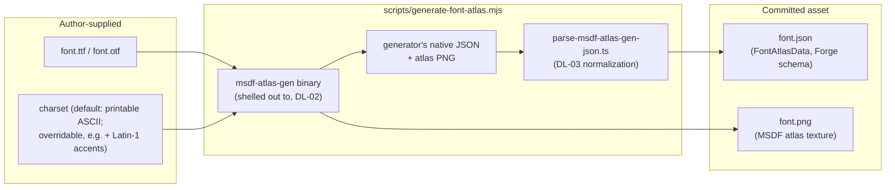

# Design: MSDF Text Rendering

|                                       |                                                                                                                                                             |
| ------------------------------------- | ----------------------------------------------------------------------------------------------------------------------------------------------------------- |
| **Status**                            | Draft — for review                                                                                                                                          |
| **Target module**                     | `/src/text` → `@forge-game-engine/forge/text`                                                                                                               |
| **Engine version at time of writing** | `0.24.2`                                                                                                                                                    |
| **Model**                             | Offline **MSDF atlas generation** tool + a runtime glyph-quad mesher, drawn through the existing instanced sprite pipeline with a dedicated fragment shader |

---

## 1. Summary

Forge has no text rendering of any kind. `grep -ri "font\|fillText" src` returns
only terrain-mesh noise — there is no glyph, no font asset, no shaper, no
draw path for a string of characters. Anyone shipping a game today either
hand-draws numbers as sprite-sheet digits or gives up and overlays DOM on the
canvas, forfeiting the engine's camera, batching, and post-processing model.
This is also the single named blocker in `design/ui-system.md` (its DL-04,
DL-05, and DL-06): a button needs a label and a HUD needs numbers, and that
document explicitly defers the "how" to this one.

This document designs both halves of the problem:

1. **Offline generation** — a build-time tool that turns a `.ttf`/`.otf` font
   into a **multi-channel signed distance field (MSDF) atlas**: one texture
   plus a JSON metrics file describing every glyph's shape, advance, and
   kerning.
2. **Runtime rendering** — an ECS component/system pair that turns a text
   string into a cached mesh of glyph quads, and a render-pipeline extension
   that draws that mesh through the same instanced, batched draw path
   sprites already use, with a small MSDF-aware fragment shader.

MSDF was chosen (not designed here in isolation — reaffirmed from
`design/ui-system.md` DL-04) because it is the only option that is
simultaneously crisp at arbitrary scale, cheap to batch, and cheap to
evaluate: a glyph is drawn from a small (typically 512×512-2048×2048) atlas
that stays sharp whether the text is 12px or 400px, with no per-size atlas
regeneration and no per-string texture upload.

---

## 2. Scope

### In scope

- An offline MSDF atlas generation tool (`npm run generate-font-atlas`),
  wrapping an established MSDF generator rather than reimplementing distance
  field math.
- The **font atlas asset**: its on-disk JSON+PNG format, a runtime
  `FontAtlas` type, and a loader integrated with `/src/asset-loading`.
- `TextEcsComponent` (author-facing: string, font atlas, size, color,
  alignment, wrapping, spacing) and `TextMeshEcsComponent` (the cached,
  shaped output: one quad per visible glyph).
- `createTextShapingEcsSystem`: turns dirty `TextEcsComponent`s into glyph
  quads — kerning, greedy word wrapping, horizontal alignment, line height.
- Render pipeline integration: a generalization of the glyph-quad expansion
  that already exists for nine-slice sprites, so text glyphs batch through
  the same instanced draw call machinery.
- The MSDF fragment shader: median-of-three-channels sampling,
  screen-space-derivative-aware anti-aliasing, and outline/glow/shadow as
  shader parameters (near-free extras of the MSDF technique).
- One **default, pre-generated atlas** shipped with the engine, so
  `createLabel`-style helpers and demos work with zero asset setup.
- Unit tests (shaping, kerning, wrapping — all pure data, no GPU) and a
  documentation-site demo.

### Out of scope

- **Rich text.** Multiple styles (bold mid-sentence, inline color runs,
  inline images) within a single `TextEcsComponent`. v1 is one string, one
  font, one size, one color, one set of effect parameters. A future
  `TextSpan[]` model can build on the same glyph-quad mesh without changing
  this design's foundations.
- **Complex script shaping.** Bidirectional text (Arabic, Hebrew), contextual
  glyph substitution (Arabic joining forms), and complex clustering
  (Devanagari, Thai) are not implemented. Latin, Cyrillic, Greek, and any
  script that is left-to-right with one glyph per character work; anything
  requiring a real shaping engine (HarfBuzz-class) does not.
- **Vertical text** (CJK top-to-bottom layout).
- **Text editing.** Carets, selection, IME composition, and clipboard belong
  to `/src/input` as an input primitive, not to a rendering module. This
  design produces read-only, displayed text only.
- **The UI module itself.** Anchoring, rect layout, and `createLabel`/
  `createButton` helpers belong to `design/ui-system.md`. This document's
  job is to make `TextEcsComponent` a solid enough primitive that the UI
  module can build a label out of it in one step — not to build the label
  helper.
- **Runtime, in-browser MSDF generation.** Atlases are always generated
  offline and shipped as assets. No `FontFace`-to-atlas pipeline runs in the
  browser (this would need a full glyph rasterizer in WASM or JS, which is
  its own multi-month project and unnecessary — see DL-02).
- **SDF icon fonts / arbitrary vector-icon atlases.** The same texture
  technique would work for icon sets, but glyph metrics (advance, kerning)
  are text-specific and out of scope for a general icon atlas here.

---

## 3. Phases

Each phase ships and is useful independently; later phases build on earlier
ones but do not block them from releasing.

### Phase 1 — Atlas pipeline: generation, format, and loading

**Goal.** A `.ttf` can be turned into a loadable `FontAtlas` at runtime, with
no rendering yet. Fully testable without a GPU: the loader parses JSON, and
the generation tool can be verified against fixture fonts in CI.

| Task                                            | Description                                                                                                                                                  | Size |
| ----------------------------------------------- | ------------------------------------------------------------------------------------------------------------------------------------------------------------ | ---- |
| `scripts/generate-font-atlas.mjs` CLI           | Wraps the `msdf-atlas-gen` binary (via the `msdf-atlas-gen` npm package, DL-02) to produce a PNG atlas + JSON metrics from an input font file and a charset. | M    |
| `FontAtlas` runtime type + JSON schema          | Normalizes the generator's JSON output into a stable, versioned Forge type (`FontAtlasData`) decoupled from the generator's own schema (DL-03).              | M    |
| `FontAtlasCache` in `/src/asset-loading`        | Loads the PNG (via the existing `ImageCache`/`createTextureFromImage`) and JSON together, keyed by atlas name, following the `AssetCache<T>` contract.       | S    |
| Atlas JSON validation                           | Throws a descriptive error on a malformed/incompatible-version atlas file rather than failing deep inside the shaping system (§5.13).                        | S    |
| Unit tests for the loader and schema validation | Fixture atlas JSON (valid, malformed, wrong-version) exercised against the loader.                                                                           | S    |

**Definition of done.** `npm run generate-font-atlas -- --font my-font.ttf
--charset ascii --out assets/fonts/my-font` produces a PNG + JSON pair, and
`fontAtlasCache.getOrLoad('assets/fonts/my-font')` resolves to a populated
`FontAtlas` in a test, with no rendering code involved.

### Phase 2 — Static single-line text rendering

**Goal.** A `TextEcsComponent` on an entity renders as crisp, correctly
kerned, single-line text through the existing camera/batching pipeline.

| Task                                              | Description                                                                                                                                          | Size |
| ------------------------------------------------- | ---------------------------------------------------------------------------------------------------------------------------------------------------- | ---- |
| `TextEcsComponent` + `addTextComponent`           | String, font atlas, size, color, letter/word spacing, dirty flag.                                                                                    | S    |
| `TextMeshEcsComponent`                            | Cached glyph quads (`GlyphQuad[]`) and computed bounds; written only by the shaping system.                                                          | S    |
| `createTextShapingEcsSystem`                      | Single-line shaping: advance + kerning walk over the string, emits one `GlyphQuad` per visible (non-whitespace) glyph. Runs only when text is dirty. | M    |
| `createTextRenderable` / MSDF `Material`          | `msdf.vert` (= `sprite.vert`, reused verbatim) + new `msdf.frag`. One `Renderable` per loaded `FontAtlas`.                                           | M    |
| Render pipeline integration                       | Generalizes the nine-slice glyph-quad expansion in `render-system.ts` so `TextMeshEcsComponent` entities push `RenderCommand`s the same way (DL-04). | L    |
| Unit tests for shaping (advance, kerning, bounds) | Golden-value tests against a small fixture atlas with known metrics.                                                                                 | M    |

**Definition of done.** A world with a `PositionEcsComponent` +
`TextEcsComponent` entity renders visible, correctly kerned text through
`createRenderEcsSystem`, batched with other text using the same atlas into a
single draw call.

### Phase 3 — Multi-line layout

**Goal.** Paragraphs of text wrap, align, and space themselves correctly.

| Task                               | Description                                                                                                    | Size |
| ---------------------------------- | -------------------------------------------------------------------------------------------------------------- | ---- |
| Greedy word wrapping               | `maxWidth` on `TextEcsComponent` triggers line breaking at word boundaries (§5.6).                             | M    |
| Horizontal alignment               | `left` / `center` / `right` / `justify`, computed per line against the shaped block's width.                   | S    |
| Line height and vertical alignment | `lineHeight` multiplier; block-level `top`/`middle`/`bottom` vertical alignment against the text's own bounds. | S    |
| Unit tests for wrapping/alignment  | Fixture strings with known break points at various `maxWidth`s.                                                | M    |

**Definition of done.** A `TextEcsComponent` with `maxWidth` set wraps
correctly at word boundaries, and every alignment mode places lines where
the tests expect against the fixture atlas's metrics.

### Phase 4 — Visual effects

**Goal.** The near-free MSDF extras (outline, glow, soft shadow) are exposed
as component fields, not just shader constants.

| Task                                     | Description                                                                                                                           | Size |
| ---------------------------------------- | ------------------------------------------------------------------------------------------------------------------------------------- | ---- |
| Outline parameters on `TextEcsComponent` | `outlineColor`, `outlineWidth` (in screen-pixel-range units, §5.9).                                                                   | S    |
| Glow/soft-shadow parameters              | `shadowColor`, `shadowOffset`, `shadowSoftness` — a second, blurred median sample offset in the frag shader.                          | M    |
| Shader + instance data extension         | A second small instance-data segment (outline/shadow params) combined onto the base sprite segment via `combineInstanceDataSegments`. | M    |
| Demo covering outline/glow               | Documentation-site demo showing base, outlined, and glowing text.                                                                     | S    |

**Definition of done.** Setting `outlineColor`/`outlineWidth` on a
`TextEcsComponent` visibly outlines the text with no additional draw call.

### Phase 5 — Default atlas, docs, and demo polish

**Goal.** `createLabel`-equivalent code paths (this module's own demo, and
later the UI module) work with zero font setup.

| Task                                                  | Description                                                                                                                  | Size |
| ----------------------------------------------------- | ---------------------------------------------------------------------------------------------------------------------------- | ---- |
| Generate and ship a default atlas                     | One permissively-licensed font (open question 1), pre-generated and committed under `/assets/fonts/default`.                 | S    |
| `documentation-site/docs/docs/text/` conceptual guide | Usage, gotchas (dirty tracking, kerning-less fallback fonts, wrapping performance), matching `document-feature` conventions. | M    |
| `documentation-site/src/pages/demos/text` demo        | Interactive demo: live-typed string, size slider, alignment/wrap toggles, outline/glow toggles.                              | M    |

**Definition of done.** `documentation-site`'s text demo renders correctly
with the default atlas and no user-supplied font, verified per
`AGENTS.md`'s "Documentation Site Demos" checklist.

---

## 4. Decision log

### DL-01 — MSDF over the alternatives (reaffirming `ui-system.md` DL-04)

**Options.** (a) Canvas2D `fillText` rendered to a texture per string. (b)
Classic bitmap font atlas (BMFont-style, one raster per glyph per authored
size). (c) MSDF atlas. (d) Runtime vector glyph tessellation (triangulate
each glyph's outline, draw as a mesh).

**Decision: (c).**

**Rationale.** This table is carried over from `ui-system.md` DL-04, which
made this call for the UI module's benefit; it applies identically here
since that document explicitly deferred the "how" to this one.

|                     | Batches                                     | Crisp at any scale          | Toolchain needed | Effects nearly free             |
| ------------------- | ------------------------------------------- | --------------------------- | ---------------- | ------------------------------- |
| Canvas2D → texture  | ✗ one draw per string                       | ✗                           | none             | ✗                               |
| Bitmap atlas        | ✓                                           | ✗ blurs above authored size | atlas generator  | ✗                               |
| **MSDF**            | **✓**                                       | **✓**                       | atlas generator  | **✓ outline/glow/shadow**       |
| Vector tessellation | ✗ (variable vertex count breaks instancing) | ✓                           | none             | partial (no cheap outline/glow) |

(a) re-uploads a texture on every text change, which is fatal for anything
that changes per frame (a score counter, a damage number) and breaks
batching outright — every string becomes its own draw call. (d) produces a
different vertex count per glyph, which does not fit the engine's
fixed-vertex-count instanced quad model without a second, non-instanced draw
path. MSDF's only real cost over (b) is the ~15-line fragment shader in
§5.8, and it buys scale independence plus outline/glow effects that game UI
and world-space text both want.

**Consequences.** A build-time generation step is mandatory (mitigated by
shipping a default atlas, Phase 5). Kerning pairs must ship in the metrics
JSON or text looks subtly wrong at every size — this is a data completeness
requirement on Phase 1, not a runtime one.

---

### DL-02 — The generation tool wraps `msdf-atlas-gen`, not a from-scratch implementation

**Options.** (a) Shell out to the `msdf-atlas-gen` native binary (via its
npm wrapper package). (b) Reimplement MSDF generation in TypeScript. (c) Use
a WASM build of `msdfgen`/`msdf-atlas-gen` so no native binary is required.

**Decision: (a)**, with (c) flagged as a follow-up worth revisiting (see
Open Question 2).

**Rationale.** MSDF generation is a solved, narrow, and finicky problem —
correct multi-channel edge coloring to avoid artifacts at sharp corners is
the entire hard part of the algorithm, and `msdfgen`/`msdf-atlas-gen`
(Viktor Chlumský's reference implementation, the same tool essentially every
MSDF-consuming engine and library wraps) has years of edge-case fixes a
reimplementation would have to rediscover. This is a build-time-only tool —
it never ships to a player's browser — so a native binary dependency is a
developer-machine and CI concern, not a runtime one. (b) is a large, risky
undertaking for a problem that is not this engine's differentiator. (c) is
attractive for zero-native-install DX but is a bigger lift than shelling out
to an existing binary and is not necessary to unblock this design.

**Consequences.** `generate-font-atlas.mjs` (Node, not browser code — this
lives in `/scripts`, mirroring `scripts/copy-shaders.js`'s pattern of a build
tool that isn't part of the published package) needs the `msdf-atlas-gen`
binary available, either as an npm-installed dependency (most such packages
bundle prebuilt binaries per platform) or documented as a manual install
step. CI needs it available to regenerate/verify the default atlas.

---

### DL-03 — Atlas JSON schema: adopt `msdf-atlas-gen`'s own format, normalized by the loader

**Options.** (a) Store `msdf-atlas-gen`'s native JSON output as-is and read
it directly at runtime. (b) Define a distinct Forge-owned `FontAtlasData`
schema, with the loader translating the generator's output into it at load
time (or, equivalently, at generation time).

**Decision: (b).**

**Rationale.** (a) directly couples every consumer of `FontAtlas` to a
third-party tool's schema, which is not versioned for Forge's needs — a
future switch to a different generator (or the WASM path in DL-02's
follow-up) would be a breaking change to every asset in the wild. (b) costs
one small normalization pass in the loader and buys a schema Forge controls,
can validate, and can version independently (`formatVersion` field, per
§5.13).

**Consequences.** The loader (Phase 1) does two things, not one: parse the
generator's JSON, then map it into `FontAtlasData`. This is a natural seam
for the validation in §5.13 to live in.

---

### DL-04 — Glyph quads reuse the nine-slice sub-quad expansion path, generalized

> This is the concrete resolution of `ui-system.md`'s DL-05 ("one sub-quad
> expansion path serves nine-slice and text"), which that document flagged
> as out of scope for itself and belonging here.

**Options.** (a) One child entity per glyph, each with its own
`SpriteEcsComponent`. (b) A wholly separate text render system with its own
command buffer, draw calls, and sort order. (c) Generalize the existing
per-sprite quad expansion in `render-system.ts`'s `pushSpriteRenderCommands`
(already used for nine-slice, expanding one `SpriteEcsComponent` into up to
nine `RenderCommand`s) so a second producer — the text system — can push its
own glyph-derived quads into the same `RenderCommand[]`/sort/batch pipeline.

**Decision: (c).**

**Rationale.** `pushSpriteRenderCommands` already proves the shape this
needs: build a synthetic, per-region `SpriteEcsComponent`-shaped object
(`width`, `height`, `pivot`, `uvOffset`, `uvScale`, inheriting the parent's
`tintColor`) and push a `RenderCommand` carrying it, all reusing the
existing `InstanceComponents`/`bindSpriteInstanceData` machinery unmodified.
A glyph quad is exactly the same shape of object — an offset, a size, and a
UV rect into an atlas texture. (a) creates and destroys potentially hundreds
of entities every time a string changes (a score counter re-strings every
frame), which is the same objection `ui-system.md` raised for per-glyph
entities. (b) cannot interleave text correctly with sprites in a single
depth/layer-sorted draw order — a label would always draw above or always
below a panel behind it, never correctly relative to it, because its
commands live in a different sorted list.

**Consequences.** `render-system.ts` gains a second small
per-entity-type loop, parallel to its existing sprite loop, that queries
`TextMeshEcsComponent` and calls a `pushTextRenderCommands` function
structurally identical to `pushSpriteRenderCommands` — offset/size/UV per
glyph instead of per nine-slice region, and the `renderable` supplied by the
`TextEcsComponent`'s bound `FontAtlas`/MSDF material instead of the sprite's
own. No new `InstanceComponents` shape is needed: a glyph's synthetic
`SpriteEcsComponent` is bound through the exact same
`spriteInstanceDataSegment` that sprites and nine-slice regions already use
(§5.7). This is a genuine, if small, refactor of a hot path with existing
tests — land it behind unchanged nine-slice/sprite behavior first, verified
by the existing `render-system.test.ts` suite before any text-specific
command is added.

---

### DL-05 — MSDF (three-channel), not MTSDF (four-channel), for v1

**Options.** (a) Classic 3-channel MSDF. (b) MTSDF (MSDF + a true, unsigned
distance field in the alpha channel), which additionally sharpens convex
corners and rounds concave ones slightly better at extreme zoom.

**Decision: (a).**

**Rationale.** MTSDF's improvement over MSDF is real but marginal at the
font sizes games actually render (it matters most for things like vector
map rendering zoomed in arbitrarily far); MSDF is the format essentially
every MSDF-consuming game text library ships by default, and a fourth
channel is 33% more atlas texture memory and bandwidth for a difference
that is hard to see below extreme zoom. `msdf-atlas-gen` supports both under
one `-type` flag, so switching later is a regeneration, not a redesign.

**Consequences.** None architecturally — `FontAtlasData` carries a `type`
field so a future MTSDF atlas is a drop-in without a schema change; the
fragment shader would gain one extra channel sample.

---

### DL-06 — Kerning ships in v1

**Options.** (a) Apply kerning pairs from the atlas metrics during shaping.
(b) Defer kerning to a later phase, using flat per-glyph advances only.

**Decision: (a).**

**Rationale.** `msdf-atlas-gen` already emits kerning pairs in its metrics
output at no extra generation cost — this is data the tool produces whether
or not the runtime uses it. Skipping it produces text that is visibly,
specifically wrong (the classic "AV" gap) in exactly the way that makes
generated text look unpolished, and retrofitting kerning into an already
positioned advance-walk later is not meaningfully cheaper than including it
from the start.

**Consequences.** `FontAtlasData.kerning` is a `Map<string, number>` keyed
by `"<leftCodePoint>:<rightCodePoint>"` (§5.5), and the shaping walk in §5.6
looks up each adjacent pair. Fonts with no kerning table (or a charset that
excludes a pair) simply have an empty/partial map — the lookup defaults to
`0`, so this degrades gracefully rather than failing.

---

## 5. Design

### 5.1 Module layout

```
src/text/
  components/
    text-component.ts          TextEcsComponent, addTextComponent
    text-mesh-component.ts     TextMeshEcsComponent (system-owned output)
  systems/
    text-shaping-system.ts     createTextShapingEcsSystem
  font-atlas/
    font-atlas.ts               FontAtlasData, GlyphMetrics, runtime types
    font-atlas-cache.ts          FontAtlasCache (AssetCache<FontAtlas>)
    parse-msdf-atlas-gen-json.ts normalizes generator output → FontAtlasData
  rendering/
    create-text-renderable.ts   builds the MSDF Renderable/Material per atlas
    shaders/
      msdf.frag.glsl
      (msdf.vert.glsl is sprite.vert.glsl, reused verbatim — see §5.7)
    glyph-quad.ts                GlyphQuad type + pushTextRenderCommands
  utilities/
    shape-text.ts                pure shaping function used by the system
    measure-text.ts               bounds-only variant (no mesh), for layout callers
  index.ts

scripts/
  generate-font-atlas.mjs        offline CLI (Node, not published in dist)

assets/fonts/default/
  default.png
  default.json
```

**Why a sibling of `/src/ui`, not inside it.** Restated from
`ui-system.md`: text is generally useful with no UI involved — damage
numbers, dialogue boxes, debug overlays, and diegetic world-space signage
all want it, and none of those want to import a UI module for it.

**Render-pipeline touch point.** `rendering/glyph-quad.ts`'s
`pushTextRenderCommands` is called from `src/rendering/systems/render-system.ts`
(DL-04) — this is the one place `/src/text` reaches into `/src/rendering`
rather than the reverse, mirroring how `nine-slice-options.ts` already lives
in `/src/rendering` for the same kind of reason. `/src/rendering` gains a
narrow, optional dependency on `/src/text`'s public types
(`TextMeshEcsComponent`) for this one integration point.

### 5.2 The offline pipeline



CLI usage:

```bash
npm run generate-font-atlas -- \
  --font ./my-game/assets/fonts/heading.ttf \
  --charset ascii \
  --size 42 \
  --out ./my-game/assets/fonts/heading
```

`--size` is the atlas's authored **distance field resolution** per glyph
(governs atlas sharpness headroom, not the size text renders at — see
§5.9), defaulting to a value that comfortably supports on-screen sizes up to
a few hundred pixels tall without the distance field itself becoming the
limiting factor.

### 5.3 The atlas asset

`FontAtlasData` (the Forge-owned schema from DL-03):

```typescript
export interface GlyphMetrics {
  /** The Unicode code point this glyph represents. */
  codePoint: number;

  /** Horizontal advance to the next glyph's origin, in em units (§5.9). */
  advance: number;

  /**
   * This glyph's quad, in em units relative to the text baseline origin.
   * Empty for glyphs with no visible ink (e.g. space).
   */
  planeBounds: {
    left: number;
    bottom: number;
    right: number;
    top: number;
  } | null;

  /** This glyph's texture rect in the atlas, 0 to 1, or `null` to match `planeBounds`. */
  atlasBounds: {
    left: number;
    bottom: number;
    right: number;
    top: number;
  } | null;
}

export interface FontAtlasData {
  /** Schema version, bumped on any breaking change to this shape (DL-03). */
  formatVersion: 1;

  /** `'msdf'` for v1 (DL-05); reserved for `'mtsdf'` later. */
  type: 'msdf';

  /** Atlas texture path, relative to this JSON file. */
  atlasImage: string;

  /** Atlas texture pixel dimensions. */
  atlasSize: { width: number; height: number };

  /**
   * The distance field's encoded range, in pixels, at the atlas's authored
   * size. Required to compute `screenPxRange` at render time (§5.9).
   */
  distanceRange: number;

  /** Font metrics shared by every glyph: line height, ascender, descender, in em units. */
  metrics: { lineHeight: number; ascender: number; descender: number };

  /** Keyed by Unicode code point. */
  glyphs: Map<number, GlyphMetrics>;

  /** Keyed by `"<leftCodePoint>:<rightCodePoint>"`. Absent pairs kern by `0` (DL-06). */
  kerning: Map<string, number>;
}
```

`FontAtlasCache` follows the existing `AssetCache<T>` contract
(`src/asset-loading/asset-cache.ts`) exactly like `ImageCache`: `load(path)`
fetches and parses `${path}.json`, validates it (§5.13), then loads
`atlasImage` through the existing image-loading path and uploads it as a
texture via `createTextureFromImage` — no new texture-upload code, only a
new asset-shape wrapping the existing one.

### 5.4 What "multi-channel signed distance field" means here

A traditional single-channel SDF encodes, per texel, the signed distance to
the nearest glyph edge — but sharp corners round off, because a single
distance field can't represent a corner losslessly at low resolution. MSDF's
fix: encode **three** independent distance fields, one per color channel,
each computed from a different subset of the glyph's edges (assigned by
"edge coloring" so that any two edges meeting at a sharp corner land in
different channel combinations). At sample time, taking the **median** of
the three channels reconstructs a sharp corner that a single channel could
not represent — this is the whole trick, and it's why the fragment shader is
almost the entire runtime cost of the technique:

```glsl
float median(float r, float g, float b) {
  return max(min(r, g), min(max(r, g), b));
}
```

### 5.5 ECS components

```typescript
export interface TextRequiredOptions {
  /** The string to render. */
  text: string;

  /** The loaded font atlas glyphs are drawn from. */
  fontAtlas: FontAtlas;

  /** Font size, in world units — the rendered em height (§5.9). */
  size: number;
}

export interface TextDefaultedOptions {
  /** Multiplies against the atlas's tint (same semantics as `SpriteEcsComponent.tintColor`). */
  color: Color;

  /** Extra spacing between glyphs, in world units, added to each glyph's advance. */
  letterSpacing: number;

  /** Multiplier on the font's authored line height. */
  lineHeight: number;

  /** Horizontal alignment within `maxWidth` (irrelevant, and ignored, when `maxWidth` is unset). */
  horizontalAlign: 'left' | 'center' | 'right' | 'justify';

  /** Vertical alignment of the whole shaped block relative to the entity's position. */
  verticalAlign: 'top' | 'middle' | 'bottom';

  /** Wraps at word boundaries when a line would exceed this width, in world units. `undefined` = never wrap. */
  maxWidth?: number;

  /** Outline color; `outlineWidth` of `0` (the default) draws no outline regardless. */
  outlineColor: Color;

  /** Outline thickness, in screen-pixel-range units (§5.9, Phase 4). */
  outlineWidth: number;

  /** The draw-order layer, identical semantics to `SpriteEcsComponent.layer`. */
  layer: number;

  /** Whether this text is drawn at all. */
  enabled: boolean;
}

export interface TextEcsComponent
  extends TextRequiredOptions, TextDefaultedOptions {}

export const textId = createComponentId<TextEcsComponent>('text');

export function addTextComponent(
  world: EcsWorld,
  entity: number,
  options: TextRequiredOptions & Partial<TextEcsComponent>,
): TextEcsComponent;
```

```typescript
export interface GlyphQuad {
  /** Offset from the text block's anchor point, in world units, Y-up (matches nine-slice's `offset`). */
  offset: Vector2;

  /** This glyph's rendered size, in world units. */
  size: Vector2;

  /** This glyph's texture rect in the atlas, 0 to 1. */
  uvOffset: Vector2;
  uvScale: Vector2;
}

export interface TextMeshEcsComponent {
  /** One entry per visible (non-whitespace, in-charset) glyph. System-owned — do not write directly. */
  readonly glyphs: readonly GlyphQuad[];

  /** The shaped block's own bounds, in world units, for layout callers (e.g. a future UI content-size fitter). */
  readonly bounds: { width: number; height: number };

  /** The `FontAtlas`-backed `Renderable` these glyphs draw with. */
  readonly renderable: Renderable;
}

export const textMeshId = createComponentId<TextMeshEcsComponent>('textMesh');
```

`TextMeshEcsComponent` is added lazily by `createTextShapingEcsSystem` the
first time it shapes an entity's text — not by `addTextComponent` — the same
ownership split `ui-system.md` uses for its own system-written fields
(`RectTransformEcsComponent.rect`).

### 5.6 Shaping algorithm

`shape-text.ts`'s `shapeText(text, fontAtlas, options): { glyphs, bounds }`
is a pure function — no `EcsWorld`, no entity — so it's unit-testable in
isolation exactly like `resolve-rect.ts` in the UI design.

```
penX = 0, penY = 0, lineStartIndex = 0, lines = []

for each word (split on whitespace, keeping the whitespace as break opportunities):
    measure word width (advance-walk, no kerning across the line-start boundary)

    if maxWidth is set AND penX + wordWidth > maxWidth AND line is non-empty:
        commit current line at lines[]
        penX = 0
        start new line with this word

    for each codePoint in word:
        glyph = fontAtlas.glyphs.get(codePoint) ?? fontAtlas.glyphs.get(TOFU_CODE_POINT)
        kern = fontAtlas.kerning.get(`${prevCodePoint}:${codePoint}`) ?? 0
        penX += kern

        if glyph.planeBounds is not null:               // e.g. not a space
            emit GlyphQuad at (penX + glyph.planeBounds.left * size, penY + glyph.planeBounds.bottom * size, ...)

        penX += (glyph.advance + letterSpacing) * size
        prevCodePoint = codePoint

    penX += spaceAdvance * size   // the whitespace that ended the word, if any

commit final line

blockWidth = max(line.width for line in lines)
blockHeight = lines.length * lineHeight * fontAtlas.metrics.lineHeight * size

for each line:
    lineOffsetX = alignmentOffset(horizontalAlign, blockWidth, line.width)   // 0 / half / full remainder
    shift every glyph in this line by (lineOffsetX, -lineIndex * lineHeight * size)

shift every glyph vertically by verticalAlignOffset(verticalAlign, blockHeight)
```

Unmapped code points (not in the atlas's generated charset) fall back to a
"tofu" glyph if the atlas was generated with one (`msdf-atlas-gen`'s default
behavior for `.notdef`), or are silently skipped if not — never a thrown
error at shape time, since a missing glyph in player-supplied or localized
text is a content problem, not a programming error, and text is exactly the
kind of thing that should degrade rather than crash a running game.

**Dirty tracking.** `createTextShapingEcsSystem` re-shapes an entity only
when a shape-relevant field changed since its last run (`text`, `size`,
`maxWidth`, alignment, spacing, or the `fontAtlas` reference) — tracked the
same way `SpriteAnimationEcsSystem`-style components track their own dirty
state, via a `_lastShapedHash`-style private field the system itself owns,
never exposed on the public component. This matters more here than for most
components: a HUD score counter changes `text` every frame it updates, but a
title screen's heading never changes after creation, and re-shaping (a full
string walk) on every entity on every tick regardless of whether anything
changed would be pure waste for the common case.

### 5.7 Render integration

The critical reuse: a `GlyphQuad` is structurally the same shape of thing as
a `NineSliceRegion` (`offset`, `size`, `uvOffset`, `uvScale`), and
`pushSpriteRenderCommands` already proves that such a region can be turned
into a `RenderCommand` by wrapping it in a synthetic
`SpriteEcsComponent`-shaped object and reusing the existing
`bindSpriteInstanceData`/`setupSpriteInstanceAttributes` pair unmodified —
no new instance data segment, no new vertex attributes, only a different
fragment shader downstream.

```typescript
// rendering/glyph-quad.ts
export function pushTextRenderCommands(
  commands: RenderCommand[],
  textComponent: TextEcsComponent,
  textMesh: TextMeshEcsComponent,
  entityPosition: PositionEcsComponent,
  rotationComponent: RotationEcsComponent | null,
  scaleComponent: ScaleEcsComponent | null,
): void {
  const { renderable, layer } = textMesh;
  const depth = entityPosition.world.y;

  for (const glyph of textMesh.glyphs) {
    const glyphPosition: PositionEcsComponent = {
      local: entityPosition.local,
      world: Vec2.add(Vec2.clone(entityPosition.world), glyph.offset),
    };

    const glyphSprite: SpriteEcsComponent = {
      width: glyph.size.x,
      height: glyph.size.y,
      pivot: { x: 0.5, y: 0.5 },
      uvOffset: glyph.uvOffset,
      uvScale: glyph.uvScale,
      tintColor: textComponent.color,
      renderable,
      enabled: true,
      layer,
    };

    commands.push({
      layer,
      depth,
      renderable,
      components: {
        position: glyphPosition,
        rotation: rotationComponent,
        scale: scaleComponent,
        sprite: glyphSprite,
        flip: null,
      },
    });
  }
}
```

`render-system.ts` gains a second, parallel loop in `buildCameraCommands`
alongside the existing sprite loop, querying `TextMeshEcsComponent` the same
way and calling `pushTextRenderCommands`. Both loops append into the same
`commands` array, so text and sprites sort and batch together downstream —
exactly the outcome DL-04 requires for a label to draw correctly relative to
its background panel.

`createTextRenderable(gl, fontAtlas)` builds one `Renderable` per loaded
`FontAtlas` (cached by atlas, the same way sprite renderables are typically
cached by texture): quad geometry (reuses `createQuadGeometry`, identical to
sprites), the MSDF `Material` (§5.8), and `spriteInstanceDataSegment`
unmodified as its instance data layout. Every `TextMeshEcsComponent`
referencing the same `FontAtlas` shares this one `Renderable`, so all glyphs
of all text entities using the same font batch into a single instanced draw
call per camera, exactly like sprites sharing a texture do today.

### 5.8 The MSDF fragment shader

Vertex shader: **`sprite.vert.glsl`, reused verbatim, no new file.** Nothing
about glyph quads needs a different vertex stage — they're positioned,
pivoted, rotated, and projected exactly like a sprite region already is.

```glsl
#version 300 es

#pragma forge name(msdf.frag)

precision mediump float;

uniform sampler2D u_atlas;
uniform float u_distanceRange;   // FontAtlasData.distanceRange
uniform float u_atlasSize;       // FontAtlasData.atlasSize.height (assumes square texels)
uniform vec4 u_outlineColor;
uniform float u_outlineWidth;    // 0 = no outline

in vec2 v_texCoord;
in vec4 v_tint;
out vec4 fragColor;

float median(float r, float g, float b) {
  return max(min(r, g), min(max(r, g), b));
}

void main() {
  vec3 msdf = texture(u_atlas, v_texCoord).rgb;
  float signedDistance = median(msdf.r, msdf.g, msdf.b) - 0.5;

  // Converts the distance field's abstract units into screen pixels so the
  // anti-aliasing band is exactly one screen pixel wide regardless of how
  // much the glyph is scaled - the entire reason MSDF stays crisp at any
  // size. See screenPxRange derivation in §5.9.
  float screenPxRange = u_distanceRange * u_atlasSize /
      (2.0 * length(fwidth(v_texCoord)) * u_atlasSize);
  float screenPxDistance = signedDistance * screenPxRange;

  float glyphAlpha = clamp(screenPxDistance + 0.5, 0.0, 1.0);

  if (u_outlineWidth <= 0.0) {
    fragColor = vec4(v_tint.rgb, v_tint.a * glyphAlpha);
    return;
  }

  float outlineAlpha = clamp(screenPxDistance + 0.5 + u_outlineWidth, 0.0, 1.0);
  vec3 color = mix(u_outlineColor.rgb, v_tint.rgb, glyphAlpha);
  fragColor = vec4(color, v_tint.a * outlineAlpha);
}
```

Phase 4 extends this with a `u_shadowColor`/`u_shadowOffset` uniform pair
sampling the distance field a second time at an offset UV, blended beneath
the outline/fill result — the same median+`smoothstep`-style pattern, just
evaluated twice.

### 5.9 Scaling, and why the shader needs `fwidth`

`TextEcsComponent.size` is a world-unit em size, exactly analogous to
`SpriteEcsComponent.width`/`height` — the same quantity that's affected by
`ScaleEcsComponent`, camera zoom, and DPI, and none of that needs any special
handling _except_ inside the fragment shader's anti-aliasing band, because
MSDF's crispness guarantee only holds if the shader knows how many **screen
pixels** currently map to one **atlas texel**. That ratio changes continuously
as the camera zooms or the entity scales — `fwidth(v_texCoord)` is exactly
that ratio, evaluated per-fragment via the GPU's screen-space derivatives,
which is why `screenPxRange` is computed in the shader rather than passed in
as a static per-draw uniform. Get this step wrong (e.g. hard-code
`screenPxRange` for one expected on-screen size) and text is crisp at the
size it was tuned for and blurry or aliased everywhere else — precisely the
failure mode MSDF exists to avoid, silently reintroduced by one wrong
uniform.

### 5.10 Performance considerations

- **Batching is per-`FontAtlas`, not per-string or per-entity.** Every text
  entity sharing a font shares one `Renderable` and therefore one draw call
  per camera, identical to how sprites sharing a texture batch today.
- **Shaping is dirty-tracked (§5.6), not per-frame.** A static heading
  shapes once, ever. A live score counter re-shapes only on the frames its
  text actually changes.
- **`GlyphQuad[]` is a flat array reused across shapes where possible** —
  `shapeText` can be given a caller-owned scratch array (mirroring
  `render-system.ts`'s own `ensureInstanceDataBufferCapacity` growable-buffer
  pattern) so a frequently-changing counter doesn't allocate a new array
  every update.
- **Word-wrap measurement does not double-shape.** The greedy algorithm in
  §5.6 measures a word's width using the same advance-walk that will emit
  its glyphs, not a separate text-measurement pass, so wrapping costs one
  walk over the string, not two.
- **Atlas texture memory is bounded by charset, not by usage.** A
  1024×1024 MSDF atlas comfortably covers a few hundred glyphs at generous
  per-glyph resolution — restricting `--charset` to what a game actually
  needs (e.g. ASCII + one language's accented characters, rather than
  "all of Unicode") keeps atlases small without any runtime cost.

### 5.11 Testing considerations

- **Shaping is pure data and needs no GPU** — `shape-text.ts`,
  `measure-text.ts`, kerning lookup, and word wrapping are all unit-testable
  in `jsdom` against a small, hand-authored fixture `FontAtlasData` (a
  handful of glyphs with deliberately distinctive advances and one kerning
  pair), the same way `resolve-rect.ts` is tested in the UI design.
- **The loader/schema layer** gets fixture JSON for the happy path, a
  malformed-JSON case, and a version-mismatch case (§5.13).
- **The render integration** (`pushTextRenderCommands`) is unit-tested the
  same way `render-system.test.ts` already tests
  `pushSpriteRenderCommands`/nine-slice — asserting the right number and
  shape of `RenderCommand`s come out for a known `TextMeshEcsComponent`,
  with a mocked WebGL context, no real draw.
- **Pixel-level rendering assertions belong in `/e2e`, and per the existing
  e2e guidance in `AGENTS.md`, should be relative, not absolute.** An e2e
  text scenario should measure a rendered glyph's on-screen bounding box
  before/after a `size` or camera-zoom change and assert the _ratio_ matches
  what the logic predicts, exactly the pattern
  `camera-pan-zoom.ts`'s `measureGreenSquareBounds()` established — not an
  exact pixel color or coordinate, which the existing SwiftShader
  discrepancy in CI has already shown to be unreliable for reasons unrelated
  to the feature under test.

### 5.12 Security considerations

- **Atlas JSON is a load-time-untrusted input if a game loads
  user-supplied/moddable fonts** — `FontAtlasCache` must validate
  `formatVersion`, bounds-check `glyphs`/`kerning` map sizes against a
  sane maximum before allocating, and reject non-finite/negative
  `atlasSize`/`distanceRange` values, so a malformed or adversarial atlas
  file fails with a descriptive error (matching the codebase's
  throw-early convention) rather than producing a huge allocation or `NaN`
  propagating silently into shader uniforms.
- **No code execution risk.** Unlike a font _file_ itself (parsing
  arbitrary `.ttf` is exactly the kind of untrusted-binary-format surface
  browsers spend significant effort hardening), this design never parses a
  raw font at runtime — only the offline tool touches `.ttf`/`.otf` files,
  and it runs at build time under the developer's control, not against
  player-supplied input.

---

## 6. Open questions

1. **Default shipped font: which one, and confirm its license is
   compatible with Forge's own license.** Needs a permissively licensed
   (OFL or Apache-2.0) typeface with broad Latin/Cyrillic/Greek coverage,
   good hinting at small sizes, and a look that reads as "engine default"
   rather than a strong brand statement (candidates: Inter, Atkinson
   Hyperlegible, Roboto). Blocks Phase 5 only — every earlier phase works
   against test fixtures and a developer-supplied font.
2. **Should the offline tool depend on the native `msdf-atlas-gen` binary
   (DL-02's decision) or a WASM build, long-term?** The native path is
   faster to ship and matches ecosystem convention, but adds a
   platform-specific binary install step for anyone generating their own
   atlas — worth revisiting once the core pipeline is proven, not before.
3. **Where exactly does the render-system integration point live?**
   DL-04 places `pushTextRenderCommands`'s call site directly inside
   `render-system.ts`'s `buildCameraCommands`, mirroring the existing
   sprite/nine-slice loop. An alternative is a registration hook so
   `/src/rendering` doesn't need any compile-time dependency on
   `/src/text` at all (a callback registry populated by whichever
   optional modules are actually in use). The direct-dependency version
   is simpler and matches how nine-slice already lives directly in
   `/src/rendering`; worth confirming this precedent should extend to a
   second, fully independent module before Phase 2 lands.
4. **Justify alignment's word-spacing distribution:** when
   `horizontalAlign: 'justify'` stretches inter-word spacing to fill
   `maxWidth`, should the last line of a paragraph also justify (as some
   text engines do) or stay left-aligned (as most do, since a
   fully-justified last line of one or two words looks stretched and
   broken)? Recommend left-aligned last line; flagging since it's a
   product-feel choice, not a technical one.

---

## 7. Relationship to `design/ui-system.md`

This document resolves that design's DL-04, DL-05, and DL-06, and its gap
table entry "No text rendering of any kind." Once Phase 2 of this design
ships, the UI module's label entity (§5.3 of `ui-system.md`) becomes:

```
Label entity
├── ParentEcsComponent → button
├── RectTransformEcsComponent   (stretch to fill, zero offsets)
└── TextEcsComponent            ('Play', fontAtlas: defaultAtlas, size: 32, horizontalAlign: 'center')
    └── TextMeshEcsComponent    (written by createTextShapingEcsSystem)
```

`ui-system.md`'s DL-06 (`SpriteEcsComponent.sortDepth`) remains that
document's own concern — `TextEcsComponent` above gets its `layer` from
the UI layout system exactly as a sprite would, and needs no changes here
to participate in that ordering scheme once it lands.
