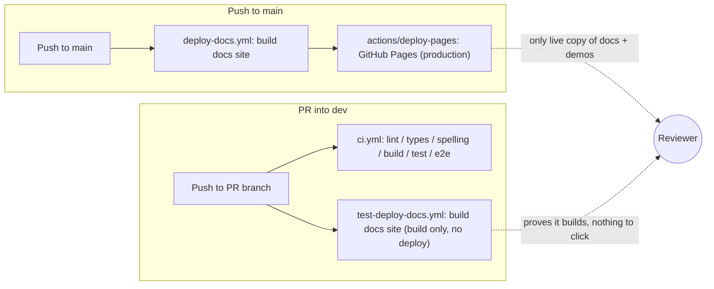

# Design: PR Preview Deployments

|                                       |                                                                                                                                                                                                        |
| ------------------------------------- | ------------------------------------------------------------------------------------------------------------------------------------------------------------------------------------------------------------------------------------------------------------------------------------------------------------------------------------------------------------------------------------------------------------------------------------------------------------------------------------------------------------------------------------------------------------------------------------------------------------------------------------------------------------------------------------------------------------------------------------------------------------------------------------------------------------------------------------------------------------------------------------------------------------------------------------------------------------------------------------------------------------------------------------------------------------------------------------------------------------------------------------------------------------------------------------------------------------------------------------------------------------------------------------------------------------------------------------------------------------------------------------------------------------------------------------------------------------------------------------------------------------------------------------------------------------------------------------------------------------------------------------------------------------------------------------------------------------------------------------------------------------------------------------------------------------------------------------------------------------------------------------------------------------------------------------------------------------------------------------------------------------------------------------------------------------------------------------------------------------------------------------------------------|
| **Status**                            | Proposed - no phase started                                                                                                                                                                          |
| **Target modules**                    | `.github/workflows` (new: `pr-preview.yml`; modified: none of the existing workflows are changed, they continue to own `dev`/`main` CI), `documentation-site` (new: `firebase.json`, `.firebaserc`), `CONTRIBUTING.md`/`AGENTS.md` (modified: document the new workflow). No `/src` module is touched - this is a build/hosting change only. |
| **Engine version at time of writing** | `0.25.0`                                                                                                                                                                                              |

---

## 1. Summary

Today, a reviewer evaluating a PR that changes rendering, physics, UI, or any
of the interactive demos under `documentation-site/src/pages/demos` has to
check the branch out locally, run `npm run build` at the repo root, then
build and start the documentation site, to see the change actually run in a
browser. `test-deploy-docs.yml` proves the docs site *builds* on every PR
into `dev`, but nothing ever *deploys* it anywhere reviewers can click into -
the only live copy of the docs site (and therefore the only live copy of the
demos) is the production one at `forge-game-engine.github.io/Forge`,
rebuilt only on push to `main`.

This document proposes **PR Preview Deployments**: every pull request that
touches the documentation site or the engine surface the demos depend on
gets its own short-lived, publicly reachable deployment of the full
documentation site (demos included), built from that PR's branch. The
preview updates on every push to the PR, is linked from a single
auto-updating PR comment, and is torn down automatically when the PR closes
or after a fixed idle period - whichever comes first. This mirrors the
"preview channel" pattern popularized by Firebase Hosting (and offered in
similar form by several other static-hosting providers, surveyed in §7):
one throwaway, isolated URL per branch, no manual deploy step, no
production-site interference, self-cleaning.

The goal is to make "does this actually work in a browser" answerable by
clicking a link in the PR, not by pulling the branch.

---

## 2. Scope

### In scope

- A new, isolated hosting target for **preview-only** deployments of
  `documentation-site` (which includes every interactive demo, since demos
  are pages within that site - see AGENTS.md's "Documentation Site Demos").
- A GitHub Actions workflow that builds the root package and the
  documentation site from a PR's head branch and deploys the result to a
  preview URL unique to that PR.
- Posting/updating a single PR comment with the preview URL and its status
  (building, ready, failed).
- Automatic teardown of a PR's preview on PR close, plus a time-based
  expiry as a safety net for previews whose teardown step never ran.
- Gating so pushes from outside collaborators don't silently spend hosting
  quota or exercise deploy credentials without a maintainer's say-so.
- A recommendation and rationale for which hosting provider to use, backed
  by a comparison of realistic options.
- Updates to `CONTRIBUTING.md`/`AGENTS.md` describing the new workflow for
  contributors and reviewers.

### Out of scope

- Changing where the **production** documentation site is hosted or how it
  deploys (`deploy-docs.yml`, GitHub Pages, stays exactly as is). Previews
  are additive, not a replacement.
- Previewing anything other than `documentation-site` - there is no
  proposal here to give the `/demo` Vite app, the npm package itself, or
  any other artifact a per-PR URL. `/demo` has no hosted deployment today
  (production or otherwise) and adding one is a separate decision.
- Visual regression testing or automated screenshot diffing against
  previews. A future design could build on top of the preview URLs this
  document produces, but capturing and comparing screenshots is a
  distinct problem with its own tooling choices.
- Preview deployments for forked-repository PRs from first-time or
  untrusted contributors without a maintainer's explicit approval (see the
  security discussion in §8 and Open Question 1). Those PRs still get full
  `dev` CI (lint/types/tests/build) exactly as they do today - they simply
  don't get an auto-deployed preview until a maintainer opts them in.
- Any change to how or when the npm package itself is published/released
  (`create-release.yml`, `changelog.yml`).

---

## 3. Current state

Two structural facts drive this design:

1. **The demos are not a separate deployable** - they are pages inside
   `documentation-site`, resolved against the built engine package via a
   `file:..` dependency (AGENTS.md, "Documentation Site Demos"). Whatever
   hosts `documentation-site`'s build output automatically hosts every demo
   too. A "demo preview" and a "docs site preview" are the same artifact.
2. **`documentation-site/build` is a plain static site.** Docusaurus
   produces static HTML/CSS/JS with no server-side rendering step and no
   backend. This matters for §7: it means *any* static-hosting provider is
   a candidate, not just ones with special framework support.

---

## 4. Phases

Each phase ships and is useful independently; a maintainer could stop after
Phase 2 and already have working previews, with Phases 3-4 as hardening.

### Phase 0 - Provider setup and account ownership

Goal: get a hosting project provisioned and its deploy credential into
repository secrets, with zero changes to CI yet. Definition of done: a
maintainer can run a deploy from their own machine using the chosen
provider's CLI and reach a working preview URL by hand.

| Task | Description | Size |
| --- | --- | --- |
| Choose hosting provider | Confirm the recommendation in §7 (or an alternative) with the project owner; register the account/project. | S |
| Provision the hosting project | Create the hosting site/project (e.g. a Firebase project) scoped to `documentation-site`'s build output only. | S |
| Scope a deploy-only credential | Create the narrowest-privilege credential the provider supports (see §8) - not an account owner's personal token. | M |
| Store the credential as a repository secret | Add it under repository (not org-wide) Actions secrets, named for its purpose (e.g. `PREVIEW_HOSTING_TOKEN`). | S |
| Manual smoke deploy | From a local checkout, build `documentation-site` and deploy once by hand with the provider's CLI to confirm the credential and project work end to end. | S |

### Phase 1 - Preview build and deploy on every push

Goal: a PR gets a real, working preview URL, rebuilt on every push.
Teardown and access control come in later phases - this phase is allowed to
leave previews running indefinitely and to fire for every contributor,
since it's built and validated on trusted (maintainer/internal) branches
first. Definition of done: opening a PR from a maintainer's branch produces
a clickable preview URL showing that branch's docs site and demos, kept in
sync across pushes.

| Task | Description | Size |
| --- | --- | --- |
| `pr-preview.yml` workflow skeleton | New workflow triggered on `pull_request` (`opened`, `synchronize`, `reopened`) targeting `dev`, reusing the build steps from `test-deploy-docs.yml` (root `npm ci && npm run build`, then `documentation-site` `npm ci && npm run build`). | M |
| Per-PR preview identity | Derive a stable identifier from the PR number (e.g. `pr-123`) used as the preview's channel/site/project name, so re-runs update the same preview instead of creating new ones. | S |
| Deploy step | Add the provider's deploy action/CLI call, targeting the per-PR identity from the previous task. | M |
| Concurrency control | Add a `concurrency` group keyed on the PR (e.g. `pr-preview-${{ github.event.pull_request.number }}`) with `cancel-in-progress: true`, so a rapid sequence of pushes doesn't race multiple deploys against the same preview. | S |
| `noindex` for preview builds | Inject a `<meta name="robots" content="noindex">` (or the provider's equivalent header) into preview builds only, so search engines never index throwaway URLs alongside the production docs site. | S |

### Phase 2 - PR comment

Goal: the preview URL is discoverable from the PR itself, without digging
through workflow logs. Definition of done: opening a PR posts one comment
with the preview link and a status; pushing again edits that same comment
rather than adding a new one.

| Task | Description | Size |
| --- | --- | --- |
| Sticky comment on deploy success | Post (or update, if one already exists) a PR comment with the ready preview URL. | S |
| Sticky comment on deploy failure | If the build/deploy step fails, update the same comment to say so with a link to the failed run, instead of leaving a stale "ready" comment. | S |
| Building/in-progress state (optional polish) | Update the comment to a "building..." state as soon as the workflow starts, before the URL is known. | S |

### Phase 3 - Teardown

Goal: previews don't accumulate forever. Definition of done: closing (or
merging) a PR removes its preview within the same workflow run, and a
preview whose teardown step never ran for any reason (workflow disabled
mid-flight, secret rotated, etc.) still disappears on its own within a
bounded time.

| Task | Description | Size |
| --- | --- | --- |
| Teardown workflow/job | Trigger on `pull_request: closed`, delete the PR's preview via the provider's API/CLI. | S |
| Update the sticky comment on teardown | Edit the existing comment to say the preview has been torn down (not just leave a dead link). | S |
| Idle-expiry safety net | Configure the provider's own auto-expiry (e.g. Firebase preview channels' `--expires`) as a backstop, independent of the explicit teardown step. | S |

### Phase 4 - Access control and hardening

Goal: previews are safe to run unattended against external contributions.
Definition of done: a PR from a first-time outside contributor does not
trigger a deploy (or spend the deploy credential) without a maintainer
explicitly allowing it; documentation reflects the shipped behavior.

| Task | Description | Size |
| --- | --- | --- |
| Gate on trusted actor / approval | Use the repository's "require approval for first-time contributors" setting (or an explicit label-gated `pull_request_target` split, see §8) so the deploy job only runs for trusted pushes. | M |
| Path filter | Skip the whole workflow when a PR touches neither `src/**` nor `documentation-site/**`, saving build minutes and hosting quota on unrelated PRs (e.g. changelog-only or CI-only changes). | S |
| Update `CONTRIBUTING.md` / `AGENTS.md` | Document the preview workflow: what triggers it, where the link shows up, how long it lives, and the approval gate for external PRs. | S |
| Quota/cost check-in | Confirm the chosen plan's free-tier limits (storage, bandwidth, concurrent previews) comfortably cover expected PR volume; note the finding here or in the provider project's own README. | S |

---

## 5. Decision log

| # | Decision | Options considered | Chosen | Rationale | Tradeoffs / assumptions |
| - | --- | --- | --- | --- | --- |
| 1 | What gets a preview | (a) The whole `documentation-site`, including demos; (b) demos only, deployed separately from the docs shell | (a) Whole `documentation-site` | Demos are pages inside the docs site, not a separate build artifact (§3) - splitting them out would mean maintaining a second build pipeline for content that already lives in one place. | Assumes the docs site's build time stays reasonable as more demos are added; if it grows large, a separate demos-only bundle could be revisited. |
| 2 | Hosting provider | Firebase Hosting, Netlify, Cloudflare Pages, Vercel, GitHub Pages via a subdirectory-per-PR action | Firebase Hosting (preview channels) - see §7 for the full comparison | Purpose-built preview-channel primitive with built-in expiry, an official GitHub Action that also handles the PR-comment step, and a free tier that comfortably covers a static docs site. Directly matches the workflow the request asked to emulate. | Introduces a second hosting vendor/account beyond GitHub Pages, and a Google Cloud-linked project to own and bill (Open Question 2). Cloudflare Pages is a close second and is called out in §7 as the fallback if that's undesirable. |
| 3 | Trigger event | `pull_request` vs `pull_request_target` | `pull_request` | `pull_request` never exposes repository secrets to a workflow run triggered from a fork, which is exactly the property needed here - a fork PR simply can't reach the deploy credential. `pull_request_target` runs with the base branch's workflow file and secrets always available, which is the wrong default for something that builds and executes a PR's own code. | Means fork PRs get no preview by default until a maintainer manually re-runs the workflow after review (see Open Question 1) or the repo's approval gate lets the job proceed - accepted as the safer default. |
| 4 | Comment strategy | One new comment per push vs one sticky comment edited in place | Sticky, edited in place | Matches the existing low-noise posture the repo already asks for elsewhere (e.g. "be frugal about posting on GitHub"); a PR with a dozen pushes should not accumulate a dozen preview-link comments. | Requires the workflow to look up and update an existing comment (by a marker string or the acting bot's prior comment) rather than always creating a new one. |
| 5 | Production docs deploy | Leave `deploy-docs.yml`/GitHub Pages untouched vs migrate production to the new provider too | Leave untouched | The request is specifically for transient PR previews; migrating the already-working production deploy is a separate, higher-risk change with no requested benefit here. | Production and previews now live on two different hosts/domains. This is normal for this pattern (Firebase/Netlify/Vercel users routinely keep a different production host) and is called out explicitly so it isn't mistaken for an oversight. |
| 6 | Expiry policy | Explicit teardown only vs explicit teardown + provider-side idle expiry | Both | An explicit teardown on PR close is fast and immediate; a provider-side expiry (e.g. 7 days) is a backstop for the case where the teardown job itself never runs (disabled workflow, revoked credential, force-deleted branch protection changes, etc.). | Assumes the provider supports an expiry independent of the deploy workflow, which Firebase Hosting preview channels do natively. |

---

## 6. Open questions

1. **Who approves previews for external/first-time contributors, and how?**
   GitHub's built-in "require approval for first-time contributors" repository
   setting is the simplest mechanism and needs no new workflow logic, but it
   gates *all* workflows for that PR, not just the preview one - is that
   acceptable, or does the deploy job need its own finer-grained gate (e.g.
   a maintainer-applied label such as `preview-ok`) so `ci.yml` keeps running
   unblocked while only the deploy is held back? This determines a chunk of
   Phase 4's design and should be settled before Phase 4 starts.
2. **Who owns the hosting project and its billing?** Whichever provider is
   chosen, someone needs to hold the account (a maintainer's personal
   account, or a project-level org account) and be the point of contact if
   the free tier is ever exceeded. This is an organizational decision, not
   a technical one, and blocks Phase 0's provisioning step.
3. **Does the preview need to run full `dev` CI (lint/types/tests) before
   deploying, or only the build step the deploy itself requires?** Running
   only the build keeps previews fast and available even when, say, lint is
   red on an otherwise-fine branch; requiring full CI first means a preview
   is never live for a PR that wouldn't currently pass review. Leaning
   toward build-only (matching Decision 3's "make it easy to see the change
   running" goal), but worth confirming since it affects whether Phase 1
   depends on `ci.yml` succeeding first.
4. **Preview identifier: PR number or branch name?** PR number (`pr-123`) is
   stable even if a branch is renamed or force-pushed, and is what most
   Firebase/Netlify integrations default to; branch name is more
   human-readable in a URL but breaks on rename. Leaning toward PR number.
5. **Should the preview link also appear as a GitHub deployment/environment
   (visible in the PR's "Environments" sidebar), in addition to the PR
   comment?** This is a small additional integration some providers'
   official actions offer for free; worth doing if the chosen provider's
   action supports it out of the box, but not worth custom work to add.

---

## 7. Hosting provider comparison

All five options below can serve `documentation-site/build`'s static
output as-is, with no framework-specific server required. The comparison
focuses on what differs for *this* use case: per-PR isolation, automatic
expiry, and how much new infrastructure it introduces beyond what the repo
already has.

| | Preview mechanism | Auto PR comment | Auto expiry | New account needed | Free-tier fit for a static docs site | Notes |
| --- | --- | --- | --- | --- | --- | --- |
| **Firebase Hosting** (recommended) | `firebase hosting:channel:deploy <id> --expires <duration>` - an explicit, named preview channel per PR, deployed via an Actions step | Yes - `FirebaseExtended/action-hosting-deploy` posts/updates the PR comment itself | Yes - native `--expires` flag, independent of the workflow that created the channel | Yes - a Firebase (Google Cloud-backed) project | Yes - static hosting free tier (10 GB stored, 360 MB/day transfer) is generous for a docs site this size | Purpose-built for exactly this workflow; the mechanism this document's naming is drawn from. |
| **Cloudflare Pages** | Git-integration preview deployments, one unique URL per branch/commit, generated automatically once the repo is connected | Via Cloudflare's own GitHub App (posts a check + comment) or a community action | Previews persist until the branch is deleted / project settings prune them; no built-in time-boxed expiry like Firebase's | Yes - a Cloudflare account | Yes - generous free tier, no daily bandwidth cap | Strong alternative if avoiding a Google-linked project is preferred; less precise expiry control than Firebase. |
| **Netlify** | "Deploy Previews" - automatic per-PR build once the repo is connected via Netlify's GitHub integration | Yes - built into the integration by default | Previews live as long as the PR is open; deleted on PR close, no separate idle-expiry knob | Yes - a Netlify account | Yes for open-source (free tier covers this), though team/bandwidth limits apply on paid tiers | Least custom workflow code of all options since the GitHub integration does the build itself, but that also means the build runs on Netlify's infrastructure rather than in `.github/workflows`, alongside the repo's other CI. |
| **Vercel** | Same automatic per-PR deploy-preview pattern as Netlify | Yes - built into the integration | Same as Netlify | Yes - a Vercel account | Yes for open-source | Same tradeoff as Netlify: polished DX, but the build step lives outside this repo's own Actions workflows. |
| **GitHub Pages, subdirectory-per-PR** (via a community "PR preview" GitHub Action) | Deploys each PR's build into `pr-preview/pr-<number>/` on the existing `gh-pages`/Pages branch, alongside production | Yes - such actions post a comment | Manual - relies on the action's own cleanup-on-close step; no provider-side idle expiry | No - reuses the GitHub Pages already configured in `deploy-docs.yml` | Free (same Pages quota as production) | Zero new vendors/accounts, but previews share the production site's domain and Pages deployment history, and there's no independent safety-net expiry if a teardown run is missed. |

**Recommendation:** Firebase Hosting preview channels (Decision 2 in §5).
It is the only option with both push-button expiry and an explicit,
narrow-scoped credential model, it keeps the build itself inside this
repo's own `.github/workflows` (unlike Netlify/Vercel, where the build runs
on the provider's infrastructure), and it does not touch the existing,
working GitHub Pages production deploy at all. Cloudflare Pages is the
recommended fallback if a maintainer would rather not create a
Google-Cloud-linked project.

---

## 8. Security considerations

- **Fork PRs must not reach the deploy credential.** Using the `pull_request`
  trigger (Decision 3) rather than `pull_request_target` means a workflow
  run triggered from a fork never has access to `secrets.PREVIEW_HOSTING_TOKEN`
  - GitHub withholds repository secrets from fork-triggered `pull_request`
  runs by design. This is the load-bearing safety property of the whole
  design: it means even a malicious PR diff that tampered with
  `pr-preview.yml` itself couldn't exfiltrate the credential, because the
  modified workflow never runs with it available.
- **Scope the credential as narrowly as the provider allows.** For Firebase,
  that means a service account limited to the Firebase Hosting Admin role on
  the single preview-hosting project from Phase 0 - not a personal account
  token, and not a role with access to any other Firebase/GCP resource.
- **Preview content is not sensitive**, since it's the same public
  documentation and demo source that's already public in the repository and
  on the production docs site - the risk this section addresses is
  credential exposure and unwanted spend, not data exposure.
- **`noindex` on preview builds** (Phase 1) prevents throwaway PR URLs from
  being crawled and surfacing in search results next to (or instead of) the
  production docs site, which would otherwise confuse users landing on a
  stale or abandoned preview.
- **Bound the blast radius of a compromised or runaway build.** The
  concurrency + path-filter tasks in Phases 1 and 4 double as a cost/abuse
  control: they prevent a rapid force-push loop or an unrelated high-PR-volume
  period from spinning up an unbounded number of simultaneous deploys against
  the shared hosting project's quota.

---

## 9. Testing considerations

- The preview workflow's own correctness (does it deploy to the right
  channel, does it edit rather than duplicate the comment, does teardown
  actually remove the channel) should be validated by hand against a real
  scratch PR during Phase 1-3 development, the same way `test-deploy-docs.yml`
  was presumably validated originally - there is no unit-testable surface
  here, it is entirely GitHub Actions YAML and a provider CLI.
- No change is proposed to `ci.yml`, `test-deploy-docs.yml`, or any `/src`
  test suite. Existing coverage (unit tests, e2e, the docs-site build check
  on every PR) is unaffected and keeps running exactly as it does today,
  independent of whether a preview successfully deploys.
- Per Open Question 3, the preview build intentionally does not depend on
  `ci.yml` passing first, so a red lint/test run and a working preview are
  not mutually exclusive - reviewers can see the visual result of a change
  even while other CI feedback is still being addressed.

---

## 10. Documentation considerations

- `CONTRIBUTING.md` should gain a short section explaining that opening a
  PR that touches `documentation-site/**` or `src/**` produces a preview
  link in a PR comment, how long it lives, and that first-time contributors'
  previews need a maintainer's approval to run (Phase 4).
- `AGENTS.md`'s "Documentation Site Demos" section should note that a demo
  change can now be checked against a real deployed preview in addition to
  a local `npm run start`, once Phase 1 ships - this doesn't change the
  mandatory local verification steps already documented there, it adds a
  second, shareable way to look at the result.
- No `documentation-site/docs/docs` conceptual-guide changes are needed -
  this feature is a contributor/CI workflow concern, not an engine API or
  behavior consumers of the published package interact with.
