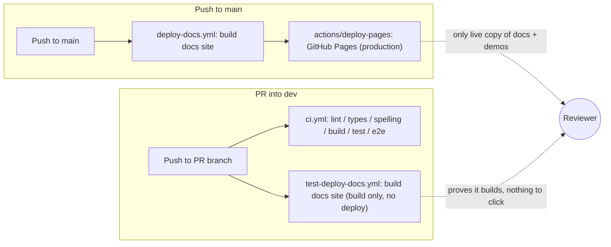

# Design: PR Preview Deployments

|                                       |                                                                                                                                                                                                        |
| ------------------------------------- | ------------------------------------------------------------------------------------------------------------------------------------------------------------------------------------------------------------------------------------------------------------------------------------------------------------------------------------------------------------------------------------------------------------------------------------------------------------------------------------------------------------------------------------------------------------------------------------------------------------------------------------------------------------------------------------------------------------------------------------------------------------------------------------------------------------------------------------------------------------------------------------------------------------------------------------------------------------------------------------------------------------------------------------------------------------------------------------------------------------------------------------------------------------------------------------------------------------------------------------------------------------------------------------------------------------------------------------------------------------------------------------------------------------------------------------------------------------------------------------------------------------------------------------------------------------------------------------------------------------------------------------------------------------------------------------------------------------------------------------------------------------------------------------------------------------------------------------------------------------------------------------------------------------------------------------------------------------------------------------------------------------------------------------------------------------------------------------------------------------------------------------------|
| **Status**                            | Proposed - no phase started                                                                                                                                                                          |
| **Target modules**                    | `render.yaml` (new, repo root - the Blueprint that defines what gets previewed), `documentation-site` (modified: a small `noindex`/robots step for preview builds), `CONTRIBUTING.md`/`AGENTS.md` (modified: document the new workflow). `.github/workflows` gets, at most, one small *optional* addition in Phase 2 (see §4) - the core feature needs no new Actions workflow. No `/src` module is touched - this is a build/hosting change only. |
| **Engine version at time of writing** | `0.25.0`                                                                                                                                                                                              |

---

## 1. Summary

Today, a reviewer evaluating a PR that changes rendering, physics, UI, or any
of the interactive demos under `documentation-site/src/pages/demos` has to
check the branch out locally, run `npm run build` at the repo root, then
build and start the documentation site, to see the change actually run in a
browser. `test-deploy-docs.yml` proves the docs site *builds* on every PR
into `dev`, but nothing ever *deploys* it anywhere reviewers can click into -
the only live copy of the docs site (and therefore the only live copy of the
demos) is the production one at `forge-game-engine.github.io/Forge`,
rebuilt only on push to `main`.

This document proposes **PR Preview Deployments**: every pull request that
touches the documentation site or the engine surface the demos depend on
gets its own short-lived, publicly reachable deployment of the full
documentation site (demos included), built from that PR's branch. The
preview updates on every push to the PR, is linked from the PR itself, and
is torn down automatically when the PR closes. This mirrors the "preview
per pull request" pattern several hosting platforms offer: one throwaway,
isolated URL per branch, no manual deploy step, no production-site
interference, self-cleaning.

**A second requirement shapes the hosting choice as much as the docs-site
need does.** The engine's roadmap includes a future API and WebSocket
service (real-time/multiplayer-adjacent functionality, per project
direction), and previews of *that* work will need the same "open a PR, get
a live URL" experience - but a live URL backed by a real, persistent
process, not a static file server. Firebase Hosting's preview channels -
the pattern this document was originally scoped against - only preview
static output; getting a WebSocket-capable backend into the same picture
would mean pairing Firebase with a second platform later; the project
direction also excludes Firebase generally, independent of that limitation.
So the provider chosen here (§7) is evaluated against both needs at once:
serve the static docs site and demos today, and be able to add a normal,
persistent server process to the same per-PR preview later, without
re-platforming.

The goal is to make "does this actually work in a browser" answerable by
clicking a link in the PR, not by pulling the branch - now, for the docs
site and demos, and later, for the API/WebSocket service, in the same place.

---

## 2. Scope

### In scope

- A new, isolated hosting target for **preview-only** deployments of
  `documentation-site` (which includes every interactive demo, since demos
  are pages within that site - see AGENTS.md's "Documentation Site Demos").
- Choosing a hosting provider whose preview model **also extends to a
  future persistent API/WebSocket service** without switching platforms -
  evaluated in §7 - even though building that service is not part of this
  design.
- Configuration (a Blueprint/manifest file, dashboard settings) that builds
  the root package and the documentation site from a PR's head branch and
  publishes the result to a preview URL unique to that PR.
- Making the preview URL discoverable from the PR itself.
- Automatic teardown of a PR's preview on PR close.
- Gating so pushes from outside collaborators don't silently spend hosting
  quota, or - once the future backend exists - run arbitrary PR code
  against real environment configuration, without a maintainer's say-so.
- A recommendation and rationale for which hosting provider to use, backed
  by a comparison of realistic options.
- Updates to `CONTRIBUTING.md`/`AGENTS.md` describing the new workflow for
  contributors and reviewers.

### Out of scope

- Changing where the **production** documentation site is hosted or how it
  deploys (`deploy-docs.yml`, GitHub Pages, stays exactly as is). Previews
  are additive, not a replacement.
- Previewing anything other than `documentation-site` - there is no
  proposal here to give the `/demo` Vite app, the npm package itself, or
  any other artifact a per-PR URL. `/demo` has no hosted deployment today
  (production or otherwise) and adding one is a separate decision.
- **Designing or building the future API/WebSocket service itself.** This
  document only makes sure today's hosting choice has room for it; the
  service's architecture, protocol, and data model are their own design.
- Visual regression testing or automated screenshot diffing against
  previews. A future design could build on top of the preview URLs this
  document produces, but capturing and comparing screenshots is a
  distinct problem with its own tooling choices.
- Preview deployments for forked-repository PRs from first-time or
  untrusted contributors without a maintainer's explicit approval (see the
  security discussion in §8 and Open Question 1). Those PRs still get full
  `dev` CI (lint/types/tests/build) exactly as they do today - they simply
  don't get an auto-deployed preview until a maintainer opts them in.
- Any change to how or when the npm package itself is published/released
  (`create-release.yml`, `changelog.yml`).

---

## 3. Current state

Three structural facts drive this design:

1. **The demos are not a separate deployable** - they are pages inside
   `documentation-site`, resolved against the built engine package via a
   `file:..` dependency (AGENTS.md, "Documentation Site Demos"). Whatever
   hosts `documentation-site`'s build output automatically hosts every demo
   too. A "demo preview" and a "docs site preview" are the same artifact.
2. **`documentation-site/build` is a plain static site today.** Docusaurus
   produces static HTML/CSS/JS with no server-side rendering step and no
   backend. In isolation this would mean any static-hosting provider is a
   candidate.
3. **...but the engine's next chapter is not static.** A future API and
   WebSocket service means the hosting decision made here shouldn't box the
   project into a platform whose whole model is "static files, or
   short-lived request/response functions only." §7 weighs providers on
   both axes together, not on today's need alone.

---

## 4. Phases

Each phase ships and is useful independently; a maintainer could stop after
Phase 1 and already have working previews, with Phases 2-4 as polish and
hardening.

### Phase 0 - Provider setup and repository connection

Goal: get the chosen provider connected to the repository, with zero
changes to how PRs build today. Definition of done: a maintainer can push
the production Blueprint by hand and see it build and deploy the docs site
successfully outside of any PR.

| Task | Description | Size |
| --- | --- | --- |
| Confirm hosting provider | Confirm the recommendation in §7 (or an alternative) with the project owner; create the account. | S |
| Install the provider's GitHub App | Connect it to this repository only (not org-wide), following the least-privilege option the provider offers. | S |
| Author `render.yaml` | A repository-root Blueprint declaring one service today: a static site built from `npm ci && npm run build` (root) then `npm ci && npm run build` (`documentation-site`), publishing `documentation-site/build`. (Named for the recommended provider, §7; an equivalent manifest for whichever provider is ultimately chosen.) | M |
| Manual smoke deploy | Push the Blueprint and confirm it builds and serves the docs site correctly from the provider's own dashboard, before wiring anything to PRs. | S |
| Pin the Node version the provider builds with | The provider's build environment is not `ci.yml`'s `actions/setup-node@v7` pinned to Node 22 - pin it explicitly (e.g. an `engines` field, a `.node-version` file, or the Blueprint's own runtime setting) so a preview can't fail on a Node-version mismatch that CI never sees. | S |

### Phase 1 - Preview on every push

Goal: a PR gets a real, working preview URL, rebuilt on every push, with no
custom deploy workflow to maintain. Definition of done: opening a PR from a
maintainer's branch produces a clickable preview URL showing that branch's
docs site and demos, kept in sync across pushes, without any workflow file
in this repository having driven the deploy.

| Task | Description | Size |
| --- | --- | --- |
| Enable Preview Environments on the Blueprint | Turn on the provider's native per-PR preview generation for the static site service (e.g. `previews: generation: automatic`). This - not a GitHub Actions job - is what builds and publishes each PR. | S |
| Confirm auto-cancel on rapid pushes | Verify the provider supersedes an in-flight preview build when a new commit lands on the same PR, rather than racing two builds - this is provider-native behavior to confirm, not custom concurrency logic to write. | S |
| `noindex` for preview builds | Inject a `<meta name="robots" content="noindex">` (or the provider's equivalent response header) into preview builds only, so search engines never index throwaway URLs alongside the production docs site. Most providers expose an environment variable on preview builds (e.g. "is this a PR preview") to key this off of. | S |
| Verify demo behavior on a real preview | Open a PR that changes a demo and confirm it renders and behaves correctly at the preview URL, not just that the build succeeds - the same bar AGENTS.md's "Documentation Site Demos" section already sets for a local check. | S |

### Phase 2 - Making the preview discoverable

Goal: the preview URL is easy to find from the PR itself. Definition of
done: a reviewer can find the current preview link without leaving the PR
page or reading workflow logs.

| Task | Description | Size |
| --- | --- | --- |
| Verify the provider's native PR link | Most providers in §7 post their own GitHub deployment/commit-status entry with the preview URL automatically once the GitHub App is connected - confirm this appears and is clear enough on its own before building anything custom. | S |
| Sticky PR comment (only if the native status isn't enough) | If reviewers find a status/check line too easy to miss, add a small workflow that looks up the current preview URL (via the provider's API) and posts/updates one sticky comment with it - edited in place across pushes, not duplicated. | M |

### Phase 3 - Teardown

Goal: previews don't accumulate forever. Definition of done: closing (or
merging) a PR removes its preview automatically, verified against the
provider's actual behavior rather than a workflow this repository owns.

| Task | Description | Size |
| --- | --- | --- |
| Verify automatic teardown | Confirm the provider destroys a PR's preview environment on close/merge on its own - this is a property of the GitHub App integration, not a job to write. | S |
| Check for an idle-expiry setting | Some providers additionally offer a time-boxed expiry independent of PR state (useful for a PR left open a long time); enable it if available as a backstop, and note in this document if it is not. | S |

### Phase 4 - Access control and hardening

Goal: previews are safe to run unattended against external contributions,
and cheap enough at the current low PR-preview cost that skipping unrelated
PRs isn't worth the complexity yet. Definition of done: a PR from a
first-time outside contributor does not trigger a preview build without a
maintainer explicitly allowing it; documentation reflects the shipped
behavior.

| Task | Description | Size |
| --- | --- | --- |
| Configure the fork-PR policy | Use the provider's own setting for whether PRs from forks build automatically, manually, or not at all; set it to require a maintainer action for non-collaborator PRs (see §8). | M |
| Update `CONTRIBUTING.md` / `AGENTS.md` | Document the preview workflow: what triggers it, where the link shows up, how long it lives, and the approval step for external PRs. | S |
| Quota/cost check-in | Confirm the chosen plan's free-tier limits (build minutes, concurrent previews, and - once the future Web Service exists - instance idle behavior) comfortably cover expected PR volume; note the finding here or in the provider project's own README. | S |

---

## 5. Decision log

| # | Decision | Options considered | Chosen | Rationale | Tradeoffs / assumptions |
| - | --- | --- | --- | --- | --- |
| 1 | What gets a preview | (a) The whole `documentation-site`, including demos; (b) demos only, deployed separately from the docs shell | (a) Whole `documentation-site` | Demos are pages inside the docs site, not a separate build artifact (§3) - splitting them out would mean maintaining a second build pipeline for content that already lives in one place. | Assumes the docs site's build time stays reasonable as more demos are added; if it grows large, a separate demos-only bundle could be revisited. |
| 2 | Hosting provider | Render, Railway, Fly.io, Cloudflare Pages + Workers, Vercel, Netlify, GitHub Pages via a subdirectory-per-PR action, Firebase Hosting | Render Preview Environments (Railway as an equally valid alternative) - see §7 for the full comparison | Firebase is excluded per project direction. Of the remaining options, Render (and Railway) preview a real, persistent process the same way it would run in production, so the future API/WebSocket service becomes a second service in the same Blueprint later rather than a reason to add a second hosting platform - unlike Vercel/Netlify (serverless request/response only) or a static-only host. | Introduces a new hosting vendor/account beyond GitHub Pages. Render's free static-site tier has no build-minute-style cap today; once the Web Service for the future backend exists, its free-tier idle/cold-start behavior will need revisiting (Open Question 2, Phase 4's quota check-in). |
| 3 | Deployment mechanism | Provider-native Git integration (build/deploy driven by the provider's own GitHub App) vs. a custom GitHub Actions workflow calling the provider's CLI/API | Provider-native Git integration | Removes an entire class of things this repository would otherwise own and could get wrong: there is no deploy credential to store as an Actions secret, no custom teardown job to keep working, and no risk of a fork PR reaching a stored credential, because there is no credential in this repository's Actions configuration at all. | The build runs on the provider's infrastructure rather than inside `.github/workflows`, so its logs live on the provider's dashboard, not in this repo's Actions tab - accepted, since `ci.yml`/`test-deploy-docs.yml` continue to run in Actions exactly as before and remain the source of truth for lint/type/test correctness. |
| 4 | How the preview link surfaces on the PR | Provider's native GitHub deployment/status only vs. always adding a custom sticky comment | Native status first; add a comment only if that proves insufficient | Matches the existing low-noise posture the repo already asks for elsewhere (e.g. "be frugal about posting on GitHub") - don't build a comment-posting workflow the provider's own integration may already make unnecessary. | If the native status turns out to be easy to miss in review, Phase 2 adds a small workflow for a sticky comment instead of assuming this from the outset. |
| 5 | Production docs deploy | Leave `deploy-docs.yml`/GitHub Pages untouched vs. migrate production to the new provider too | Leave untouched | The request is specifically for transient PR previews; migrating the already-working production deploy is a separate, higher-risk change with no requested benefit here. | Production and previews now live on two different hosts/domains. This is normal for this pattern (most preview-per-PR setups keep a different, deliberately chosen production host) and is called out explicitly so it isn't mistaken for an oversight. |
| 6 | Expiry policy | Explicit teardown on PR close only vs. that plus a provider-side idle expiry | Teardown on close, with idle expiry added if the provider offers one | Render's Preview Environments are destroyed automatically when the PR closes or merges - this happens inside the provider's own GitHub App integration, not a workflow this repository could fail to run. An additional idle-expiry setting is a bonus for a PR left open a long time, not a requirement, since the primary teardown trigger no longer depends on this repository's own automation staying healthy the way a custom teardown job would. | Assumes Render's PR-close teardown is reliable in practice; verify during Phase 3 and confirm whether an independent idle-expiry option exists (Open Question 4 records this as unconfirmed at design time). |
| 7 | Skipping preview builds for unrelated PRs | (a) Accept a preview build on every PR that touches the base branch, regardless of changed paths; (b) build a custom gate (e.g. an Actions job that cancels the provider's build via its API) that skips PRs touching neither `src/**` nor `documentation-site/**` | (a) Accept building every PR, for now | Render's native Preview Environments have no built-in path filter, and building a custom skip-gate reintroduces exactly the kind of bespoke Actions workflow Decision 3 avoided, for a docs-site static build that is fast and not metered on the free tier. | Revisit if the future Web Service's build becomes slow or metered enough that skipping irrelevant PRs starts to matter - at that point, a small API-driven cancel step is the fallback, not a redesign. |

---

## 6. Open questions

1. **Who approves previews for external/first-time contributors, and how?**
   The provider's own fork-PR setting (Phase 4) is the simplest mechanism,
   but does it need to be paired with GitHub's "require approval for
   first-time contributors" setting, or a maintainer-applied label, so the
   policy is consistent across both `ci.yml` and the preview build? This
   determines a chunk of Phase 4's design and should be settled before
   Phase 4 starts.
2. **Who owns the hosting account and its billing?** Someone needs to hold
   the Render (or chosen provider) account - a maintainer's personal
   account, or a project-level org account - and be the point of contact if
   a free tier is ever exceeded, especially once the future Web Service
   adds a metered/paid instance type to the mix. This is an organizational
   decision, not a technical one, and blocks Phase 0's setup step.
3. **Does the preview need to run full `dev` CI (lint/types/tests) before
   deploying, or only the build step the deploy itself requires?** Since
   Decision 3 moved the build off this repo's own Actions runners, the
   preview build is naturally independent of `ci.yml` already - is that the
   desired behavior (a preview stays available even while lint/tests are
   red), or should Phase 1 add a check that blocks the provider's build
   until `ci.yml` passes? Leaning toward independent, matching the "make it
   easy to see the change running" goal.
4. **Does the chosen provider offer a time-boxed idle expiry independent of
   PR state**, the way some preview-per-PR features do, or does the PR's
   own open/closed state remain the only teardown trigger? Confirm during
   Phase 0/3 setup - Decision 6 assumes PR-close teardown is sufficient on
   its own, but an idle expiry is worth enabling if it exists at no extra
   cost.
5. **Should the future API/WebSocket service live in the same `render.yaml`
   Blueprint as the docs site, or its own?** Keeping them in one Blueprint
   means every PR preview that touches either automatically gets both
   services, already networked to each other - the scenario this design's
   provider choice was made to support. A separate Blueprint would decouple
   their release cadence at the cost of that automatic pairing. This
   doesn't need an answer now (§2 explicitly puts designing that service out
   of scope), but whoever designs it should read Decision 2's rationale
   first.

---

## 7. Hosting provider comparison

Firebase Hosting is excluded from this comparison per project direction -
it is a strong fit for a static docs site alone (see the earlier revision
of this document for that analysis), but its preview channels only serve
static output, and pairing it with a second platform for the future
API/WebSocket service would mean two hosting vendors instead of one. The
remaining options are compared on both axes this design cares about: how
well they preview a static Docusaurus site today, and whether that same
per-PR preview model extends to a normal, persistent server process later.

| | Preview mechanism | Persistent-process / WebSocket-ready | Auto PR link | Teardown | New account | Free-tier fit today | Notes |
| --- | --- | --- | --- | --- | --- | --- | --- |
| **Render** (recommended) | "Preview Environments" - native GitHub App integration; a `render.yaml` Blueprint defines services, and each open PR gets an ephemeral copy of all of them | **Yes.** A Render "Web Service" is a normal, always-on (or on-demand) process - the future API/WebSocket backend is just a second service in the same Blueprint, previewed alongside the docs site automatically | Yes - Render posts a GitHub deployment/commit status with the preview URL | Automatic - environment destroyed on PR close/merge | Yes - a Render account, GitHub App scoped to this repo | Yes - static sites are free with no build-minute-style cap; a future Web Service's free instance type sleeps after 15 minutes idle (fine for a docs site, worth a paid instance once the WebSocket service needs to stay warm) | Closest match to "no custom Actions workflow, one URL per PR, torn down automatically" while running real code the same way production would - the property the future backend needs. |
| **Railway** | "PR Environments" - same native concept: connect the repo, define services, each PR clones the service graph into an ephemeral environment | **Yes**, same reasoning as Render - real containers/processes, not edge functions | Yes - via Railway's GitHub integration | Automatic on PR close | Yes - a Railway account | Usage-credit based rather than an indefinitely-free static tier - check current pricing against expected PR volume | Functionally interchangeable with Render for this use case; the deciding factor is pricing-model preference, not capability. Listed as the equally valid alternative. |
| **Fly.io** | No built-in "PR preview" feature - would need a custom GitHub Actions workflow driving `fly deploy`/`fly machine run` per PR | **Yes** - arguably the strongest raw fit; Fly Machines are full VMs, closest to "runs anything" | No - would have to be built | No - would have to be built | Yes - a Fly.io account, plus an API token stored as a repository secret | Usage-based | Reintroduces the custom-Actions-workflow-plus-stored-credential model Decision 3 moved away from. A reasonable fallback if Render/Railway's Blueprint model proves too limiting once the backend exists, not a first choice. |
| **Cloudflare Pages + Workers** | Pages' Git integration previews static output per PR automatically; a Worker can be versioned/previewed alongside it | **Yes, but a different model** - the Workers runtime (`workerd`) supports WebSockets via Durable Objects, purpose-built for stateful realtime, but it is not a conventional Node/Express process | Yes - via Cloudflare's GitHub App | Previews are tied to deployments/branches and pruned by retention settings, not an explicit "PR closed" hook | Yes - a Cloudflare account | Yes - generous free tier, no bandwidth cap | Possibly the best raw performance for the future realtime workload specifically, but it commits the not-yet-designed backend to Cloudflare's Workers programming model rather than a conventional server - a bigger commitment to make now, on a service this document explicitly puts out of scope. |
| **Vercel** | Automatic per-PR "Preview Deployments" once the repo is connected | **No**, not for a real persistent connection - Vercel functions are short-lived request/response; a real-time need would require pairing with a separate provider (Pusher, Ably, a Cloudflare Durable Object) | Yes - built into the integration | Automatic on PR close | Yes - a Vercel account | Yes for open-source | Excellent for the docs site alone, but the moment the API/WebSocket backend exists, previews stop being "the whole stack in one URL" - the exact limitation this design is trying to avoid. |
| **Netlify** | Same "Deploy Previews" pattern as Vercel | **No**, same limitation as Vercel (Netlify Functions are also short-lived request/response) | Yes - built into the integration | Automatic on PR close | Yes - a Netlify account | Yes for open-source | Same tradeoff as Vercel. |
| **GitHub Pages, subdirectory-per-PR** (via a community "PR preview" GitHub Action) | Deploys each PR's build into `pr-preview/pr-<number>/` on the existing `gh-pages`/Pages branch | **No** - static only, no path to a backend preview at all | Yes - such actions post a comment | Manual - relies on the action's own cleanup-on-close step | No - reuses the GitHub Pages already configured in `deploy-docs.yml` | Free (same Pages quota as production) | Zero new vendors, but rules out the future need entirely rather than just being a weaker fit for it - kept here only as the "docs-only, forever" fallback if the future backend plan changes. |

**Recommendation:** Render Preview Environments (Decision 2 in §5), with
Railway as an equally valid alternative if its usage-based pricing model is
preferred over Render's free-static/paid-service split. Both preview a
real, persistent process the same way production would run it, which is
exactly the property Vercel, Netlify, and a static-only GitHub Pages setup
lack, and which Fly.io only offers by rebuilding the custom-Actions-plus-
stored-credential model this design otherwise avoids. Cloudflare Pages +
Workers is the option to reconsider specifically if, once the future
API/WebSocket service is actually designed, the team decides a
Durable-Objects-based realtime architecture is worth committing to over a
conventional server process - that tradeoff belongs to that future design,
not this one.

---

## 8. Security considerations

- **No deploy credential lives in this repository's Actions secrets.**
  Because Decision 3 chose the provider's native GitHub App integration
  over a custom Actions-driven deploy, there is no long-lived token or
  service-account key stored in this repo for a fork PR to ever reach -
  removing an entire class of risk the original Firebase-based version of
  this design had to mitigate with careful `pull_request`-vs-
  `pull_request_target` trigger selection.
- **Fork PRs still need an explicit policy** (Phase 4) - not because a
  credential could leak, but because a fork PR nobody has reviewed yet could otherwise
  spend build/hosting quota, or (once the future Web Service exists) run
  arbitrary code against whatever environment configuration that service's
  preview carries. Configure the provider's fork-PR setting to require a
  maintainer's action rather than building automatically by default.
- **Today, preview content is not sensitive** - it's the same public
  documentation and demo source that's already public in the repository and
  on the production docs site. **This changes once the future API/WebSocket
  service is added**: a real running server, unlike a static file host, can
  hold real environment variables. When that service exists, its preview
  instances must get non-secret/mock configuration by default, and any
  genuinely sensitive value (a real database credential, a third-party API
  key) must never be attached to a preview environment that an unapproved
  fork PR's code could run against. Flagging this now so it isn't
  discovered the hard way when that service's own design lands.
- **`noindex` on preview builds** (Phase 1) prevents throwaway PR URLs from
  being crawled and surfacing in search results next to (or instead of) the
  production docs site, which would otherwise confuse users landing on a
  stale or abandoned preview.

---

## 9. Testing considerations

- The preview setup's own correctness (does a push produce an updated
  preview, does closing a PR tear it down, does the Node-version pin in
  Phase 0 actually match) should be validated by hand against a real
  scratch PR during Phase 0-3 setup - there is no unit-testable surface
  here, it is a Blueprint file and provider dashboard configuration.
- No change is proposed to `ci.yml`, `test-deploy-docs.yml`, or any `/src`
  test suite. Existing coverage (unit tests, e2e, the docs-site build check
  on every PR) is unaffected and keeps running exactly as it does today,
  independent of whether a preview successfully deploys.
- Per Open Question 3, the preview build is naturally independent of
  `ci.yml` passing first (it runs on the provider's own infrastructure, not
  in this repo's Actions), so a red lint/test run and a working preview are
  not mutually exclusive - reviewers can see the visual result of a change
  even while other CI feedback is still being addressed.
- Phase 0's Node-version pin exists because the provider's build
  environment is a different machine than `ci.yml`'s `actions/setup-node`
  runner - a version mismatch is a failure class CI cannot catch, similar in
  spirit to the demo/`dist` gotcha AGENTS.md's "Documentation Site Demos"
  section already documents for local development.

---

## 10. Documentation considerations

- `CONTRIBUTING.md` should gain a short section explaining that opening a
  PR that touches `documentation-site/**` or `src/**` produces a preview
  link (via the provider's GitHub status, or a PR comment if Phase 2 adds
  one), how long it lives, and that first-time contributors' previews need
  a maintainer's approval to run (Phase 4).
- `AGENTS.md`'s "Documentation Site Demos" section should note that a demo
  change can now be checked against a real deployed preview in addition to
  a local `npm run start`, once Phase 1 ships - this doesn't change the
  mandatory local verification steps already documented there, it adds a
  second, shareable way to look at the result.
- No `documentation-site/docs/docs` conceptual-guide changes are needed -
  this feature is a contributor/CI workflow concern, not an engine API or
  behavior consumers of the published package interact with.
