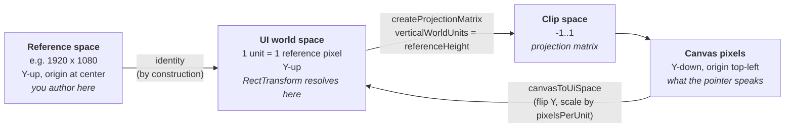
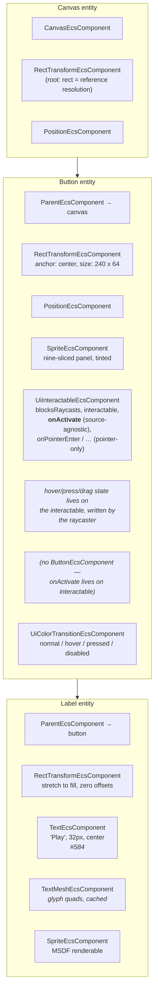
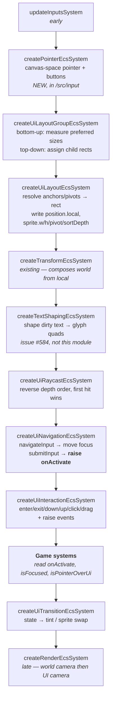
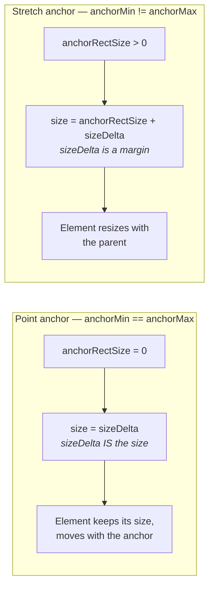
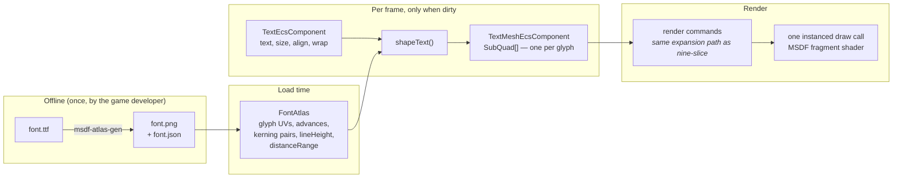
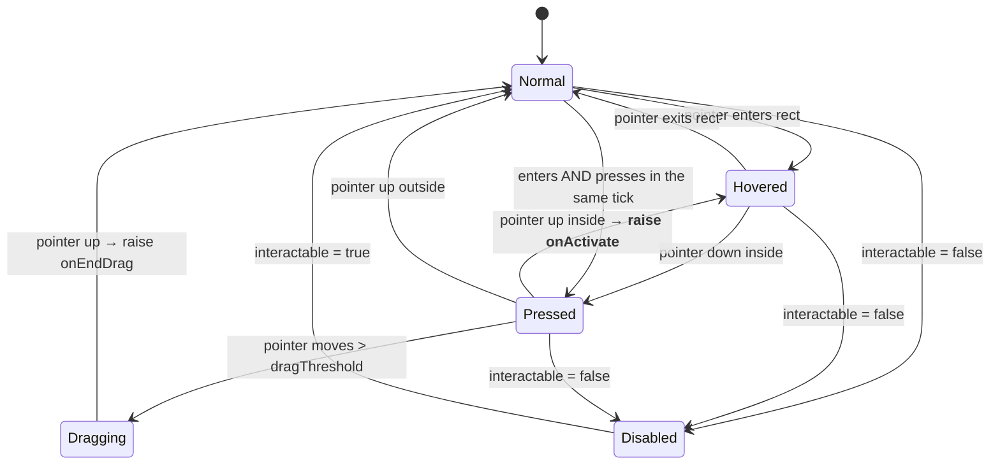
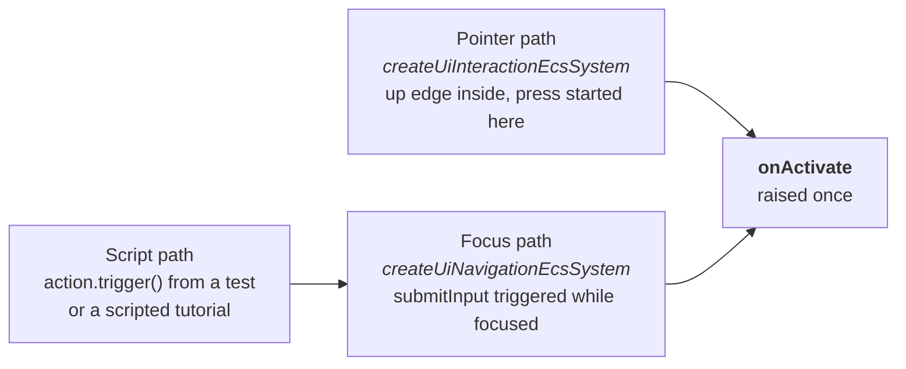

# Design: Forge UI System

|                                       |                                                                                                                                           |
| ------------------------------------- | ----------------------------------------------------------------------------------------------------------------------------------------- |
| **Status**                            | Draft — for review                                                                                                                        |
| **Target module**                     | `/src/ui` → `@forge-game-engine/forge/ui`                                                                                                 |
| **Engine version at time of writing** | `0.24.2`                                                                                                                                  |
| **Model**                             | Retained **anchored rect tree** (canvas → rect transforms → graphics + event routing) — _not_ immediate-mode, _not_ markup-and-stylesheet |

---

## 1. Summary

Forge has no UI module. Anyone shipping a game on it today has to hand-roll HUDs,
menus, and buttons out of raw sprite entities and manual world-space math, or
overlay DOM on top of the canvas and give up on gamepad navigation, in-world
diegetic UI, and post-processing interaction.

This document proposes a **retained-mode, ECS-native UI system built on an
_anchored rect tree_**: a hierarchy of rectangle-shaped elements, each anchored
and pivoted against its parent's rectangle, resolved once per frame by a layout
pass, drawn through the existing instanced sprite pipeline, and hit-tested by a
raycaster that feeds a pointer event state machine.

"Anchored rect tree" is the term this document uses throughout for that model.
It is deliberately descriptive rather than borrowed: the same approach appears in
Unity's uGUI, Godot's `Control` nodes, and Flash's display list, but Forge should
name it for what it does rather than adopt another engine's product name.

The headline finding from the codebase survey: **most of what this needs is not
UI.** Three capabilities Forge lacks outright — **text rendering**, **rect
clipping**, and a **canvas-space pointer** — are each generally useful with no UI
involved, and the first two are now owned separately
([#584](https://github.com/Forge-Game-Engine/Forge/issues/584),
[#583](https://github.com/Forge-Game-Engine/Forge/issues/583)). What remains
genuinely UI-shaped — rect layout, anchors, hit testing, buttons, layout groups —
sits comfortably on what already exists and is individually small.

**The dependency worth stating up front:** UI layout, anchoring, hit testing, and
interaction can all be built and unit-tested before #584 lands, but the module is
not _useful_ without text — buttons need labels and HUDs need numbers. Text is
the largest external dependency on this plan.

---

## 2. Goals and non-goals

### Goals

- **Retained-mode.** Elements are entities that persist across frames. Game code
  mutates them; it does not re-describe the UI every frame.
- **Composable via ECS.** A button is not a class, and not even a component. It
  is an entity with a `RectTransformEcsComponent`, a `SpriteEcsComponent`, a
  `UiInteractableEcsComponent`, and a child label. Drop any one and you get a
  coherent, less capable thing. (DL-13)
- **Resolution-independent.** Author against a reference resolution; the same UI
  reads correctly at 720p and 4K, and at any aspect ratio.
- **Reuses the existing renderer.** UI graphics are sprites. They batch with,
  and through, the machinery in `src/rendering/systems/render-system.ts`.
- **Source-agnostic activation.** The author learns that an element _was
  activated_, not how. A pointer release, a gamepad submit, a keyboard Enter,
  and a scripted call are the same event. Directional focus traversal is part of
  the core interaction model, not late polish. (DL-14)
- **Testable without a GPU.** Layout, hit testing, and interaction state are pure
  data transforms over an `EcsWorld` and unit-testable in `jsdom`. Activation
  arrives through an `InputAction`, so tests and scripted tutorials drive real
  interaction flows without synthesizing input events (DL-14).
- **Two calls to a working button.** Cameras, render targets, canvas scaling, and
  input wiring are defaults, not homework. Nothing in §5 is something a game
  author has to assemble by hand to put a button on screen — see "The minimal
  path" below.

### Non-goals

- **No immediate-mode API.** No `if (ui.button('Play')) { ... }`. The
  immediate-mode model is explicitly out.
- **No markup or stylesheet authoring language.** No XML-ish layout files, no
  CSS-ish style sheets, no parser. Layout is expressed in TypeScript.
- **No visual editor.** The engine is code-only by design. A future editor may
  read and write this system, but is out of scope here.
- **No rich-text document layout.** Single-font, single-style runs per text
  element for v1. No inline images, no bidirectional text, no complex script
  shaping (Arabic, Devanagari).
- **No DOM-backed widgets.** The one place browser text entry is unavoidable
  (IME, mobile keyboards, clipboard) is isolated as an input primitive in
  `/src/input`, not as DOM inside a UI component — so this module stays
  DOM-free (DL-10).

---

## 3. Why an anchored rect tree is the right model here

The three candidate models differ in where they put the source of truth for the
UI tree.

|                         | Source of truth                                                                           | Prior art                          | Fit for Forge                                                                                                                  |
| ----------------------- | ----------------------------------------------------------------------------------------- | ---------------------------------- | ------------------------------------------------------------------------------------------------------------------------------ |
| **Immediate mode**      | Reconstructed every frame from call order                                                 | Dear ImGui, Unity IMGUI            | Poor. Fights ECS — there is no entity to attach an animation, a tween, or a physics-driven wobble to. Debug tooling only.      |
| **Markup + stylesheet** | A retained tree authored in markup and styled by stylesheets, with a flexbox-style solver | The web DOM, Unity UI Toolkit      | Poor. Requires an asset pipeline, a stylesheet language, and a parser before a single button renders. Contradicts "code-only". |
| **Anchored rect tree**  | A retained tree of rect nodes carrying components                                         | Unity uGUI, Godot `Control`, Flash | **Strong.** A rect node carrying components _is_ an ECS entity. The model translates almost 1:1.                               |

The anchored rect tree's specific virtues for this codebase:

- **The anchor/pivot model is the whole responsive story.** Two normalized
  vectors per element (`anchorMin`, `anchorMax`) express pin-to-corner,
  stretch-horizontally, stretch-both, and center — no layout algorithm required.
  Layout _groups_ are then an optional convenience on top, not the foundation.
- **It degrades to "just sprites".** A rect-tree image element is a textured quad
  with a tint and an optional nine-slice. Forge's `SpriteEcsComponent` is already
  exactly that, nine-slice included (`src/rendering/nine-slice-options.ts`).
- **It admits a single, explainable ordering rule** — draw in hierarchy
  pre-order — without any z-index bookkeeping by the caller. This is a property
  of the model, not of Forge today; see the note below.

**Ordering, precisely.** Draw order in Forge is currently a chain, not a single
rule. A sprite is drawn only if its `Renderable.category` passes the camera's
`cullingMask`; cameras are composited by `CameraEcsComponent.layer` across
distinct render targets and in query order within one destination; and within a
camera, commands sort by `SpriteEcsComponent.layer` and then by `depth`, which
`render-system.ts` derives from `position.world.y`.

So "hierarchy order is draw order" is **a property this design has to build, not
one it inherits**, and even then it holds only _within_ a single UI canvas and a
single sprite layer — the surrounding camera and culling-mask rules still apply
and are what keep the UI pass separate from the world pass in the first place.
DL-06 is the mechanism: the layout pass writes each element's hierarchy pre-order
index into `SpriteEcsComponent.sortDepth`, which the render system prefers over
world Y when set.

The part of Unity's uGUI implementation worth _not_ copying is its
component-coupling ergonomics — `GetComponent<Graphic>()` chains, the
`ICanvasElement` rebuild registry, and the `Selectable` inheritance tree. Those
are consequences of an OO component model. In ECS they become queries and plain
data.

---

## 4. Where Forge stands today

### 4.1 What already carries weight

| Capability                       | Where                                                     | Notes                                                                                                                                                                                                                                                                                                                                               |
| -------------------------------- | --------------------------------------------------------- | --------------------------------------------------------------------------------------------------------------------------------------------------------------------------------------------------------------------------------------------------------------------------------------------------------------------------------------------------- |
| Entity hierarchy                 | `ParentEcsComponent`, `createTransformEcsSystem`          | Top-down recursive resolve with cycle detection and a per-frame memo cache. Rotation and scale are inherited correctly, but a child's local position offset is composed by **plain addition** — it is not rotated or scaled by the parent's world transform. See the note in §4.2; treated here as a bug to fix, not a constraint to design around. |
| Instanced sprite batching        | `render-system.ts`, `spriteInstanceDataSegment`           | 17 floats/instance, batched by `Renderable` identity.                                                                                                                                                                                                                                                                                               |
| Nine-slice                       | `computeNineSliceRegions`                                 | Already expands **one** sprite component into **up to nine** render commands — the precedent the text renderer needs (see DL-05).                                                                                                                                                                                                                   |
| Per-camera culling masks         | `CameraEcsComponent.cullingMask` vs `Renderable.category` | The mechanism that isolates a UI pass from the world pass, for free.                                                                                                                                                                                                                                                                                |
| Resolution-independent camera    | `verticalWorldUnits`, `calculatePixelsPerUnit`            | Added in `0.24.0`. This is the canvas scaler, already built (see DL-03).                                                                                                                                                                                                                                                                            |
| Off-screen targets & compositing | `RenderTarget`, `createPresentEcsSystem`, camera `layer`  | Lets UI skip the world's post-processing stack.                                                                                                                                                                                                                                                                                                     |
| Action-based input with groups   | `InputManager`, `TriggerAction`, `HoldAction`             | Group gating (`activeGroup`) is the natural "menu open, game paused" switch. `CameraEcsComponent.zoomInput`/`panInput` are the precedent for a component taking `InputAction`s rather than raw input — the UI canvas follows it (DL-14).                                                                                                            |
| Tweening + easing                | `createAnimationEcsSystem`, `easing-functions/`           | Button press/hover transitions get this for free.                                                                                                                                                                                                                                                                                                   |
| Events                           | `ForgeEvent`, `ParameterizedForgeEvent`                   | The idiom for `onActivate`.                                                                                                                                                                                                                                                                                                                         |

### 4.2 The gaps

Priority is one scale, ordered: **Blocker** (no usable UI without it) > **High**
(ships broken or misleading without it) > **Medium** > **Low**. "Tracked as"
points at the backlog item in §8 or the issue that owns it.

| Gap                                                          | Priority                      | Tracked as                                                    | Detail                                                                                                                                                                                                                                                                                                                                                                            |
| ------------------------------------------------------------ | ----------------------------- | ------------------------------------------------------------- | --------------------------------------------------------------------------------------------------------------------------------------------------------------------------------------------------------------------------------------------------------------------------------------------------------------------------------------------------------------------------------- |
| **No text rendering of any kind**                            | Out of scope (blocks release) | [#584](https://github.com/Forge-Game-Engine/Forge/issues/584) | `grep -ri "font\|fillText" src` returns only terrain-mesh noise. There is no glyph, no font asset, no text shaper. Generally useful outside UI (damage numbers, dialogue, debug overlays), so it belongs in `/src/text`. The UI module can be built and tested without it, but cannot ship a convincing demo until it lands.                                                      |
| **No canvas-space pointer**                                  | **Blocker**                   | 0.1                                                           | Cursor position only exists as a side effect of `Axis2dAction` bindings inside `MouseInputSource`. Nothing exposes "where is the pointer, in canvas pixels, right now" — so nothing can hit-test.                                                                                                                                                                                 |
| **No rectangle type or rect concept in the transform**       | **Blocker**                   | 0.2, 1.1                                                      | Transforms are point + rotation + scale. Every element in this design is a rectangle resolved against its parent's rectangle, so `Rect2` and `RectTransformEcsComponent` are foundational and must be built first — not a nice-to-have. `src/math/Rect.ts` exists but is a class predating the `Vector2` class→plain-object migration, so it is not the type to build on (DL-11). |
| **Draw order is world Y**                                    | **Blocker**                   | 0.3                                                           | `render-system.ts:98` — `const depth = entityPosition.world.y`. For UI this is not a tuning problem, it is visibly wrong output: a label near the top of a panel draws _behind_ the panel. (DL-06)                                                                                                                                                                                |
| **`MouseInputSource` caches `getBoundingClientRect()` once** | High                          | 0.1                                                           | `mouse-input-source.ts:61` — captured in the constructor. Every pointer coordinate is wrong after a resize, scroll, or layout shift. Pre-existing bug; hit testing makes it immediately visible.                                                                                                                                                                                  |
| **Parented position offsets ignore parent rotation/scale**   | High                          | [#581](https://github.com/Forge-Game-Engine/Forge/issues/581) | `composeWithParent` inherits rotation and scale correctly but composes position as `parent.world + local`, so a child's offset is never rotated or scaled by the parent. A child of a rotating parent spins in place instead of orbiting. Pre-existing bug; see the note below.                                                                                                   |
| **No clipping/masking**                                      | Out of scope                  | [#583](https://github.com/Forge-Game-Engine/Forge/issues/583) | Needed for scroll views and any list longer than its container, but equally for minimaps, wipe transitions, and fill-by-reveal bars — so it belongs in `/src/rendering`, not here. Blocks backlog 3.4 only. (DL-09)                                                                                                                                                               |
| **`DepthEcsComponent` is dead code**                         | Low                           | 0.4                                                           | `src/common/components/depth-component.ts` exists, has tests, and is referenced by **nothing** in `/src`. DL-06 concludes it is _not_ the right vehicle for draw order either, so it should be deleted rather than resurrected.                                                                                                                                                   |
| **No touch input source**                                    | Out of scope                  | [#582](https://github.com/Forge-Game-Engine/Forge/issues/582) | `AGENTS.md` advertises "Keyboard, mouse, and touch input handling"; `src/input/` has keyboard, mouse, and gamepad only. Touch is explicitly out of scope for this design; #582 covers only correcting the documentation.                                                                                                                                                          |

**On the transform bug.** `composeWithParent`
(`src/common/systems/transform-system.ts`) does this:

```
world.rotation = parent.world.rotation + local.rotation      // correct
world.scale    = parent.world.scale    * local.scale         // correct
world.position = parent.world.position + local.position      // missing two terms
```

A correct 2D TRS composition needs the child's local offset transformed by the
parent before it is added:

```
world.position = parent.world.position
               + rotate(local.position * parent.world.scale, parent.world.rotation)
```

Concretely: parent at the origin rotated 90°, child at local `(10, 0)`. The
child's world position should be `(0, 10)` — instead it stays at `(10, 0)`,
while the child's own `world` rotation _is_ correctly 90°. So the child sprite
spins but does not orbit: a turret on a rotating tank rotates correctly and sits
in the wrong place.

Nothing currently locks this in — `transform-system.test.ts` has seven tests and
none of them touch rotation or scale. The three older
`parent-position-system.ts` / `parent-rotation-system.ts` /
`parent-scale-system.ts` files carry the same additive position composition, but
are not exported from `src/common/systems/index.ts` and are referenced only by
their own tests, so they are dead code superseded by `createTransformEcsSystem`.

This is filed as [#581](https://github.com/Forge-Game-Engine/Forge/issues/581)
and is **not** something this design works around. Every diagram and decision below assumes it is fixed. The UI system does
not itself depend on the fix (UI elements are unrotated and unscaled in the
common case), but anything diegetic — a world-space health bar above a rotating
ship, Phase 5.3 — does.

---

## 5. Architecture

### 5.1 Module layout

```
src/ui/
  components/
    canvas-component.ts             CanvasEcsComponent, addCanvasComponent
    rect-transform-component.ts     RectTransformEcsComponent
    ui-interactable-component.ts    UiInteractableEcsComponent
    toggle-component.ts             ToggleEcsComponent
    slider-component.ts             SliderEcsComponent
    scroll-rect-component.ts        ScrollRectEcsComponent
    layout-group-component.ts       Horizontal/Vertical/GridLayoutGroupEcsComponent
    layout-element-component.ts     LayoutElementEcsComponent
    content-size-fitter-component.ts
    ui-focus-component.ts           UiFocusEcsComponent (navigation)
  systems/
    ui-layout-system.ts             createUiLayoutEcsSystem
    ui-layout-group-system.ts       createUiLayoutGroupEcsSystem
    ui-raycast-system.ts            createUiRaycastEcsSystem
    ui-interaction-system.ts        createUiInteractionEcsSystem
    ui-transition-system.ts         createUiTransitionEcsSystem
    ui-navigation-system.ts         createUiNavigationEcsSystem
    scroll-rect-system.ts, slider-system.ts, toggle-system.ts
  utilities/
    create-ui-canvas.ts             canvas entity + dedicated UI camera
    create-button.ts, create-panel.ts, create-label.ts
    resolve-rect.ts                 the anchor/pivot math, pure and unit-tested
  types/
    Rect2.ts, UiAnchor.ts (anchor presets), UiRenderMode.ts
  index.ts

src/text/                            (separate module — issue #584, not this work)
  font-atlas.ts, load-font-atlas.ts
  components/text-component.ts, components/text-mesh-component.ts
  systems/text-shaping-system.ts
  shaders/msdf.frag
  index.ts
```

**Why `text` is a sibling, not a child of `ui`.** Text is needed for damage
numbers, dialogue, and world-space signage — none of which are UI. Burying it in
`/src/ui` would force those consumers to import a UI module they do not use.

### 5.2 Coordinate spaces

This is where most UI bugs come from, so it is worth pinning down precisely.



The trick that makes this cheap: set the UI camera's `verticalWorldUnits` to the
reference resolution's **height**. `calculatePixelsPerUnit` then already does the
scaler's job — a 1080-unit-tall camera on a 720px canvas yields
`pixelsPerUnit = 0.667`, and every element shrinks proportionally with no extra
code. `CanvasScaler`'s three Unity modes fall out as:

- _Scale with screen size, match height_ → `verticalWorldUnits = referenceHeight`
- _Scale with screen size, match width_ → recompute `verticalWorldUnits` from the
  live aspect ratio each frame
- _Constant pixel size_ → `verticalWorldUnits = renderContext.height`

**Gotcha, pending [#585](https://github.com/Forge-Game-Engine/Forge/issues/585):**
`SpriteEcsComponent.pivot` is currently Y-**down** (`(0,0)` is top-left), while
`RectTransformEcsComponent.pivot` is Y-**up** (`(0,0)` is bottom-left) like the
rest of the engine. Until #585 lands, the bridge must write
`sprite.pivot.y = 1 - rectTransform.pivot.y`; once it lands, that line should be
**deleted** rather than kept as a compensating error. Getting this wrong produces
UI that looks correct until an element is anchored to an edge.

### 5.3 Anatomy of a button



Every one of those components is independently useful. `UiInteractableEcsComponent`
without a transition component gives you a clickable region with no visual
feedback. `RectTransformEcsComponent`
without `SpriteEcsComponent` gives you an invisible layout container. This is the
payoff of not modelling `Button` as a class.

### 5.4 The frame pipeline

System registration order is load-bearing. `SystemRegistrationOrder`
(`early: -10000`, `normal: 0`, `late: 10000`) is coarse, so UI needs explicit
numeric ordering.



Two ordering constraints that are easy to get wrong and worth asserting in tests:

1. **Layout before transform.** The layout system writes `position.local`;
   `createTransformEcsSystem` composes `position.world` from it. Reversing them
   costs a frame of latency and produces visible jitter on resize.
2. **Raycast after transform.** Hit testing needs resolved world rects.

Interaction is deliberately placed _before_ game systems so that a click is
consumed in the same frame it is detected, and _before_ transitions so a press
tint appears on the same frame as the press.

### 5.5 RectTransform resolution

The core of the layout pass, per element, given the parent's already-resolved
rect. This is the standard anchored-rect formulation:

```
anchorRectMin  = parentRect.min + anchorMin * parentRect.size
anchorRectMax  = parentRect.min + anchorMax * parentRect.size
anchorRectSize = anchorRectMax - anchorRectMin

size           = anchorRectSize + sizeDelta
referencePoint = anchorRectMin + anchorRectSize * pivot
pivotPosition  = referencePoint + anchoredPosition

rect.min       = pivotPosition - size * pivot
rect.max       = rect.min + size

position.local = pivotPosition - parentPivotPosition   // additive, matches transform-system
```

The two regimes fall out of one formula:



`resolve-rect.ts` holds this as a pure function of
`(parentRect, rectTransform) → Rect2` — no world, no entity — which makes the
entire responsive-layout surface unit-testable in isolation. Anchor presets
(`UiAnchor.topLeft`, `.stretchHorizontal`, `.stretchAll`, …) are plain frozen
constants, and are what most callers actually touch.

### 5.6 Text pipeline

> Owned by [#584](https://github.com/Forge-Game-Engine/Forge/issues/584), not this
> module. Included because the UI module consumes it and the two have to agree on
> the sub-quad contract (DL-05).



MSDF (multi-channel signed distance field) gives crisp glyphs at any scale from a
single small atlas, batches as ordinary instanced quads, and needs only a ~10-line
fragment shader (median of three channels, then `smoothstep`). It also gives
outlines, glows, and soft shadows nearly free as extra shader parameters — which
is most of what game UI text needs stylistically.

To keep "hello world" from requiring a toolchain, **the engine ships one
pre-generated default MSDF atlas** (a permissively licensed font) so
`createLabel(world, 'Play')` works with zero setup.

### 5.7 Pointer interaction state machine

Per interactable element, driven by `createUiInteractionEcsSystem`:



**`Hovered` can be skipped entirely, and the design has to survive that.**
Input is _sampled_ per tick, not streamed: `MouseInputSource` accumulates button
downs and ups into per-frame sets and `reset()`s them each tick, so a system sees
the pointer's current position plus a set of edges that occurred since the last
tick — never their ordering within the frame. Two cases fall out of that:

- **Enter and press in the same tick.** At 60 Hz a frame is ~16.7 ms, and a
  flick-and-click comfortably fits inside one. More decisively, **touch has no
  hover phase at all** — the first event is simultaneously "entered" and "down".
  Touch is out of scope (#582), but DL-07 specifies the pointer
  source-agnostically so it can be added later without revisiting this design,
  and that promise is only real if the state machine already tolerates a missing
  hover.
- **Press and release in the same tick.** A synthetic `click()`, or a fast
  enough real one. `MouseInputSource` already keeps downs and ups in _separate_
  per-frame sets, so both facts survive the frame — but a system that reads only
  "is the button currently held" sees neither and silently drops the click.

So `createUiInteractionEcsSystem` must **not** be implemented as one transition
per tick. State is _derived_ from the tick's facts, and events are derived from
the delta against the previous tick:

```
isOver           = this element was the raycast hit this tick
pressStartedHere = a pointer-down edge landed on this element (latched until release)

state = Disabled  if !interactable
      | Pressed   if isOver && pressStartedHere
      | Hovered   if isOver
      | Normal

onPointerEnter    when !wasOver && isOver
onPointerExit     when  wasOver && !isOver
onPointerDown     when a down edge occurred && isOver
onActivate        when an up edge occurred && isOver && pressStartedHere
```

Under this formulation the reviewer's scenario raises `onPointerEnter` **and**
`onPointerDown` in the same tick, the state goes `Normal → Pressed` directly, and
`Hovered` is simply never observed — no click is swallowed. The diagram's
`Normal → Pressed` edge exists to make that legal rather than accidental.

The consequence for callers: **treat these states as sampled, not as a guaranteed
sequence.** Code that assumes it will always see `Hovered` before `Pressed` — for
example a transition that only starts a press animation from a hover animation —
is wrong, and will misbehave first on touch and intermittently on fast mice. The
unit tests should drive both same-tick cases explicitly (§10).

#### Activation is source-agnostic; the pointer is only one path to it

The state machine above is the **pointer** state machine. It is not the whole
interaction model, because a gamepad has no cursor, no hover, and no click. What
it has is a _focused_ element and a _submit_ action.

So `onActivate` is raised from two independent paths, and the author cannot tell
which fired it:



Two states, deliberately distinct:

- **`isHovered`** — pointer-only. Meaningless on a gamepad. Drives cursor-shaped
  affordances.
- **`isFocused`** — source-agnostic. Set by directional navigation, and (by
  canvas policy) also by the pointer moving over an element, so the highlight
  follows the mouse. This is what "the currently selected element" means.

Visual transitions key off a **derived** visual state that merges them, so an
element looks highlighted whether it is moused-over or gamepad-focused, and no
transition component has to know which input the player is using.

`submitInput`, `cancelInput`, and `navigateInput` are `InputAction`s supplied on
the canvas, not raw key or button codes — the same shape as
`CameraEcsComponent.zoomInput`/`panInput`. The UI module never touches an input
_source_.

Both a **polled** and an **evented** surface are exposed, because both idioms
already exist in this codebase:

```typescript
// Polled — ECS-idiomatic, trivially unit-testable, no listener lifetime concerns.
const state = world.getComponent(buttonEntity, uiInteractableId);

if (state?.wasActivatedThisFrame) {
  startGame();
}

// Evented — matches ForgeEvent usage elsewhere in the engine. `onActivate` lives
// on the interactable, so *anything* activatable has it, not just buttons — and
// it fires the same way whether a mouse, a gamepad, a key, or a test triggered
// it (DL-14).
const interactable = addUiInteractableComponent(world, buttonEntity);
interactable.onActivate.registerListener(startGame);
```

`wasActivatedThisFrame` is an edge derived exactly as above, so it is `true` for
one tick even when the press and release landed in the same tick — and it is
equally `true` when the activation came from a gamepad or a script.

`isPointerOverUi` is published once per frame on the canvas so game systems can
gate world interaction ("don't fire the weapon when the click landed on the
pause button") without guessing.

---

## 6. API sketch

Idiomatic to this codebase: plain-data interfaces, a `createComponentId` key, an
`add<Name>Component` factory, `create<Name>EcsSystem` returning a plain object
with a batched `update`.

```typescript
export interface RectTransformDefaultedOptions {
  /** Normalized lower-left anchor within the parent's rect. `(0,0)` = parent's bottom-left. */
  anchorMin: Vector2;
  /** Normalized upper-right anchor within the parent's rect. Equal to `anchorMin` for a point anchor. */
  anchorMax: Vector2;
  /** Normalized origin within this element's own rect; the point placed at the anchor. */
  pivot: Vector2;
  /** Offset of this element's pivot from its anchor reference point, in reference pixels. */
  anchoredPosition: Vector2;
  /** Size in reference pixels when point-anchored; a margin relative to the anchor rect when stretched. */
  sizeDelta: Vector2;
}

export interface RectTransformEcsComponent extends RectTransformDefaultedOptions {
  /** Resolved rect in UI world space. Written every frame by `createUiLayoutEcsSystem`; do not set directly. */
  readonly rect: Rect2;
}

export const rectTransformId =
  createComponentId<RectTransformEcsComponent>('rectTransform');
```

```typescript
/**
 * Creates a system that resolves every `RectTransformEcsComponent` against its
 * parent's rect, top-down, and writes the result into the element's
 * `PositionEcsComponent.local` and the element's `SpriteEcsComponent`
 * size, pivot, and `sortDepth`.
 *
 * Must be registered before `createTransformEcsSystem`.
 * @returns The UI layout ECS system.
 */
export const createUiLayoutEcsSystem = (): EcsSystem<
  [RectTransformEcsComponent, PositionEcsComponent]
> => ({
  query: [rectTransformId, positionId],
  update: (world, { entities }) => {
    /* memoized top-down resolve, mirroring transform-system's cache */
  },
});
```

**The minimal path.** Everything in §5 is machinery the module owns, not setup
the author performs. Two calls put a working, clickable, gamepad-navigable
button on screen:

```typescript
const canvas = createUiCanvas(world, renderContext);
const play = createButton(world, canvas, { label: 'Play' });

play.onActivate.registerListener(startGame);
```

`createUiCanvas` creates the canvas entity, its `RectTransformEcsComponent`, a
dedicated static UI camera with a transparent clear color and a UI culling
mask, and its render target — and registers the UI systems in the correct
order. Every option is defaulted: `referenceResolution` to `1920x1080`,
`scaleMode` to scale-with-screen-size, and the submit/cancel/navigate actions to
sensible bindings registered on the `InputManager` if one is supplied. Pass an
option only to change it.

The second camera in DL-01 is an implementation detail of that single call. If a
game author ever has to think about culling masks or render targets to show a
button, this design has failed.

A full menu, showing what the options look like when you _do_ reach for them:

```typescript
const canvas = createUiCanvas(world, renderContext, {
  referenceResolution: { x: 1920, y: 1080 },
  scaleMode: uiScaleModes.scaleWithScreenSize,

  // Optional. Omitted, these default to bindings registered on the supplied
  // InputManager. Supplied as InputActions exactly the way
  // `CameraEcsComponent` takes `zoomInput`/`panInput`, so the UI never learns
  // whether a gamepad, a keyboard, or a script drove them. (DL-14)
  submitInput: inputManager.getTriggerAction('ui-submit'),
  navigateInput: inputManager.getAxis2dAction('ui-navigate'),
});

const panel = createPanel(world, canvas, {
  anchor: UiAnchor.center,
  sizeDelta: { x: 480, y: 640 },
  sprite: panelSprite,
  slices: { left: 16, right: 16, top: 16, bottom: 16 },
});

addVerticalLayoutGroupComponent(world, panel, {
  spacing: 16,
  padding: { left: 24, right: 24, top: 24, bottom: 24 },
  childAlignment: uiAlignments.center,
});

const playButton = createButton(world, panel, {
  label: 'Play',
  preferredHeight: 64,
});

playButton.onActivate.registerListener(() =>
  inputManager.setActiveGroup('game'),
);
```

---

## 7. Decision log

### DL-01 — Screen-space UI renders through a dedicated camera

**Options.** (a) A second `CameraEcsComponent` with its own culling mask, drawn
after the world camera. (b) A bespoke UI render pass outside the camera loop.
(c) A DOM/CSS overlay.

**Decision: (a).**

**Rationale.** `render-system.ts` already iterates cameras in order, honours
`cullingMask` against `Renderable.category`, supports `clearColor` (use
`Color.transparent`), `isStatic`, and per-camera `renderTarget`. A UI camera is
therefore _zero new rendering code_ — it is configuration. It also makes
post-processing scope a **choice** rather than a constraint (see below). (c)
forfeits gamepad navigation, world-space UI, and shader effects, and splits the
styling model in two.

**Consequences.** Draw order between cameras needs care.
`createPresentEcsSystem` already sorts by `CameraEcsComponent.layer`, but only
across _distinct_ render targets; cameras sharing a destination draw in query
order, which `camera-component.ts` documents explicitly. Two ways to guarantee
the UI camera lands on top:

- Give the UI camera its own `RenderTarget` with a higher `layer` and let the
  existing present pass composite it. Costs one extra full-screen target and one
  extra blit.
- Draw both to the canvas and rely on entity creation order.

Prefer the first — it is the mechanism the engine already has, and it does not
encode a correctness requirement into the order the game happens to create
entities.

#### Post-processing scope: world-only, UI-only, or everything

A separate UI target is the **default**, not a ceiling. Post-processing in this
engine attaches to a **render target**, not to a camera — `bloom-system.ts`
dedupes with `processedTargetsThisFrame.has(renderTarget)`, so an effect is
applied **once per target** no matter how many cameras drew into it. That single
fact gives all three scopes with no new plumbing:

| Want                                                              | Configuration                                                                                                                                                                                                           |
| ----------------------------------------------------------------- | ----------------------------------------------------------------------------------------------------------------------------------------------------------------------------------------------------------------------- |
| **World only** (default) — HUD stays crisp while the world blooms | World and UI cameras have **separate** `renderTarget`s. Effects attach to the world's.                                                                                                                                  |
| **Everything, world + UI**                                        | Point the UI camera's `renderTarget` at the **same target** as the world camera. Both draw into it, the render system clears it once (`clearedDestinationsThisFrame`), and the effect is applied once to the composite. |
| **UI only** — blur the UI behind a modal, vignette a pause menu   | Attach the post-processing components to the **UI camera**, which owns its own target.                                                                                                                                  |

Ordering already works for the shared-target case: post-processing systems are
documented to register _after_ the render system and _before_ the present
system, and both cameras have drawn by the time the render system's update
returns.

The one real constraint to document: with a shared target you get **one** set of
effects over both, so "bloom the world but not the UI, and tone-map everything"
is not expressible in a single pass — that needs the world on its own target,
effects there, then both composited into a shared target with the second effect.
That is a legitimate future need and the argument for eventually letting a
post-processing stack attach to the _present_ step rather than only to a camera,
but it is out of scope here.

---

### DL-02 — UI graphics reuse `SpriteEcsComponent`

**Options.** (a) Reuse `SpriteEcsComponent`. (b) Introduce a parallel
`UiGraphicEcsComponent` and a parallel render path.

**Decision: (a).**

**Rationale.** A rect-tree image element is a tinted, optionally nine-sliced,
optionally atlased quad. That is `SpriteEcsComponent`, feature for feature, today. Reusing it
means UI inherits batching, culling masks, sprite animation, and nine-slice with
no new code, and means a sprite can be moved between world and UI by reparenting
it. (b) would duplicate the entire instance-data and batching pipeline for no new
capability.

**Consequences.** `SpriteEcsComponent.width`/`height`/`pivot` become
layout-system-owned for UI entities and must be documented as such (mutating them
directly on a UI element is overwritten next frame). The Y-flip on pivot noted in
§5.2 is the sharp edge.

---

### DL-03 — Canvas scaling rides `verticalWorldUnits`

**Options.** (a) Set the UI camera's `verticalWorldUnits` to the reference
resolution height and let `calculatePixelsPerUnit` do the scaling. (b) Implement a
`CanvasScaler` that writes a `ScaleEcsComponent` on the canvas root. (c) Layout in
raw canvas pixels and re-resolve everything on resize.

**Decision: (a).**

**Rationale.** `0.24.0` already made cameras resolution-independent; this is the
same problem, already solved. It also means 1 UI world unit = 1 reference pixel,
so every number in layout code is a pixel measurement, which is how designers
think. (b) is the weaker option regardless of the transform bug in §4.2: it puts the
scaler in a second place that has to agree with the camera, and `ScaleEcsComponent`
on the root would additionally have to survive layout, which owns sprite sizing.
Until that bug is fixed, (b) is also outright broken — a scaled canvas root would
not scale its children's offsets.

**Consequences.** Note (b)'s failure mode in the docs; it is the obvious-looking
approach and it silently half-works. _Match width_ mode needs a small per-frame
recompute of `verticalWorldUnits` from the live aspect ratio.

#### Does this decision survive the transform fix ([#581](https://github.com/Forge-Game-Engine/Forge/issues/581))?

**Yes — the decision stands, and for reasons that never depended on the bug.**
Worth being precise about what #581 does and does not change, because the
composition rules differ per channel and only one of them is wrong:

| Channel  | Composition today                           | Correct?                                                                                            |
| -------- | ------------------------------------------- | --------------------------------------------------------------------------------------------------- |
| Rotation | `parent.world + local` — **additive**       | ✅ correct; adding angles is what nesting rotations means                                           |
| Scale    | `parent.world * local` — **multiplicative** | ✅ correct; a 2x parent with a 3x child is 6x                                                       |
| Position | `parent.world + local` — **additive**       | ❌ incomplete — the local offset is added raw, without first being scaled and rotated by the parent |

So #581 is not "make scale and rotation additive like position". Those two are
already right. The fix is to make position's composition _account for_ the
parent's already-correct rotation and scale:

```
world.position = parent.world.position
               + rotate(local.position * parent.world.scale, parent.world.rotation)
```

Once that lands, option (b) stops being broken — a scaled canvas root _would_
correctly scale its children's offsets, and sprite sizes already scale
(`bindSpriteInstanceData` multiplies by `scale.world`). But (b) still loses, on
the arguments that were always the real ones:

- **Cost.** (a) changes one number on one camera and the projection matrix does
  the rest. (b) dirties `position.world` and `scale.world` for **every** UI
  entity on every resize.
- **One coordinate space.** With (a), `rect` values stay in reference pixels no
  matter the screen size, so layout math, hit testing, and anything reading a
  rect all speak one language. With (b), rects live in a screen-dependent scaled
  space, or you maintain both and every consumer has to know which it holds.
- **It collides with `isStatic`** (DL-12). A subtree frozen at one scale is
  simply wrong after a resize, so the freeze optimization would have to be
  invalidated on every resize — exactly the dirty-tracking complexity DL-12
  avoids.
- **It collides with per-element scale.** An author scaling a button 1.1x for a
  press animation would be multiplying against a screen-dependent base, so the
  same "pop" reads differently at 720p and 4K.

The honest correction to the original text: leaning on "(b) is broken" as the
headline argument was lazy, since that is the one objection with an expiry date.
The cost and single-coordinate-space arguments are the load-bearing ones and
hold either way.

---

### DL-04 — Text uses MSDF atlases, in a sibling `/src/text` module

> **Out of scope for this module.** Tracked in
> [#584](https://github.com/Forge-Game-Engine/Forge/issues/584); retained here as
> the decision record that led to it.

**Options.** (a) Canvas2D `fillText` rendered to a texture per string. (b) Bitmap
font atlas (BMFont). (c) MSDF atlas. (d) Vector glyph tessellation.

**Decision: (c)**, with (a) available as a documented prototyping escape hatch.

**Rationale.**

|                     | Batches               | Crisp when scaled           | Toolchain       | Effects                        |
| ------------------- | --------------------- | --------------------------- | --------------- | ------------------------------ |
| Canvas2D → texture  | ✗ one draw per string | ✗                           | none            | ✗                              |
| Bitmap atlas        | ✓                     | ✗ blurs above authored size | atlas generator | ✗                              |
| **MSDF**            | **✓**                 | **✓ any scale**             | atlas generator | **✓ outline/glow/shadow free** |
| Vector tessellation | ✗                     | ✓                           | none            | partial                        |

(a) re-uploads a texture on every text change — fatal for a score counter — and
breaks batching entirely. MSDF's only real cost over (b) is a ~10-line fragment
shader, and it buys arbitrary scaling plus the outline/glow effects game UI
actually wants. The atlas generation step is mitigated by shipping a default
atlas (§5.6).

**Consequences.** New asset type and loader in `/src/asset-loading`. A documented
`msdf-atlas-gen` recipe. Kerning pairs must be in the metrics JSON or text will
look subtly wrong. This is the single largest work item in the plan and it is on
the critical path for everything else.

---

### DL-05 — One sub-quad expansion path serves nine-slice and text

> **Out of scope for this module.** Tracked in
> [#584](https://github.com/Forge-Game-Engine/Forge/issues/584) alongside the text
> work it exists to serve; retained here as the decision record.

**Options.** (a) One child entity per glyph. (b) A separate text render system
with its own command buffer. (c) Generalize the existing nine-slice expansion in
`render-system.ts` into a `SubQuad[]` list that both nine-slice and text produce.

**Decision: (c).**

**Rationale.** `pushSpriteRenderCommands` already turns one `SpriteEcsComponent`
into up to nine render commands. Text is the same operation with more quads. (a)
creates thousands of entities for a paragraph and churns them on every text
change. (b) cannot interleave text correctly with panels in a single sorted
command buffer — a label would draw either always above or always below its own
background.

**Consequences.** `computeNineSliceRegions` moves from a per-frame call inside the
render system to a cached producer, which means nine-slice needs dirty tracking on
width/height change. That is a real refactor of a hot path with existing tests and
demos; budget for it, and land it behind unchanged behavior first. If it proves
thorny, the fallback is a second expansion branch for text in the same function —
uglier, but isolated.

---

### DL-06 — Draw order comes from `SpriteEcsComponent.sortDepth`, not world Y

**Options.** (a) Add an optional `sortDepth` to `SpriteEcsComponent`, used as the
tie-break within a layer when set and falling back to `position.world.y` when
not. (b) Wire up the existing, currently-unused `DepthEcsComponent` as the depth
source when present. (c) Give UI its own separately-sorted render pass.

**Decision: (a).** _(Changed from (b) during review.)_

**Rationale.** Draw order is already a sprite concern, and half of it already
lives on the sprite. `SpriteEcsComponent.layer` is the primary sort key, and its
own JSDoc says ties are broken "by depth (world Y position)". `sortDepth`
overrides exactly that clause:

```typescript
const depth = spriteComponent.sortDepth ?? entityPosition.world.y;
```

Three reasons this beats a separate component:

- **The two halves of one sort key belong together.** Splitting `layer` and
  `depth` across two components means someone tuning draw order has to know
  about two places, and can attach one without the other.
- **It is free, where (b) is not.** `buildCameraCommands` runs _per camera_ and
  already does three `world.getComponent` calls per sprite (rotation, scale,
  flip). Option (b) makes that four — `4 x sprites x cameras` lookups — and this
  design adds a second camera, doubling the multiplier. `sortDepth` is a
  property read on an object already in the batch array.
- **A separate component buys no composition here.** Rotation and scale are
  meaningful on an entity with no sprite; depth is not. There is no entity that
  wants a draw-order key and nothing to draw, so the split is arbitrary rather
  than expressive.

The layout system writes each element's hierarchy pre-order index into
`sortDepth`, so draw order is hierarchy order within a canvas.

**Consequences.** Fully backward compatible: `sortDepth` left undefined
reproduces today's behavior exactly, so no existing sprite changes. It follows
the module's defaulted-options convention, though as a genuinely optional field
it stays `undefined` rather than taking a default — a default of `0` would
silently override world-Y sorting for every sprite.

This leaves `DepthEcsComponent` still dead, and now with no prospective use.
Delete it and its tests (backlog 0.4) rather than leaving a component in the
public API that nothing reads.

---

### DL-07 — A canvas-space pointer belongs in `/src/input`, not `/src/ui`

**Options.** (a) Add `PointerEcsComponent` + `createPointerEcsSystem` to
`/src/input`. (b) Have the UI raycaster read an `Axis2dAction` the consumer wires
up. (c) Read `MouseEvent`s directly inside the UI module.

**Decision: (a).**

**Rationale.** "Where is the pointer" is an input concern that world-space code
(drag-to-select, tower placement, aiming) wants too. (b) makes every consumer
hand-wire a binding with the right `cursorValueTypes.absolute` and origin before
UI works at all. (c) puts a second event listener set on the canvas, racing the
input module's.

**Consequences.** This is where the **stale `getBoundingClientRect`** bug
(§4.2) gets fixed. That one is a genuine prerequisite — hit testing is wrong
after any resize without it.

**The two-camera setup constrains what this component may publish.** Because the
UI renders through its own camera (DL-01), a single canvas-space pointer maps to
**two different world positions** — one through the world camera, one through the
UI camera — and they diverge the moment the world camera pans or zooms.

So `PointerEcsComponent` publishes the pointer in **canvas pixels only**, and
stays camera-agnostic as well as source-agnostic. It must not publish a "world
position", because there is no single correct one. Conversion is the caller's
job and is already camera-parameterized:
`screenToWorldSpace(screenPosition, cameraPosition, cameraZoom, width, height, pixelsPerUnit)`.
The UI raycaster converts through the UI camera; game-world picking converts
through the world camera; neither is privileged.

The matching consistency requirement in the other direction: the raycaster
should only hit-test what the UI camera can actually **see**. An element culled
from the UI camera by `cullingMask` must not be clickable, or the UI develops
invisible hit regions — the same `Renderable.category` check that §3's ordering
note describes for drawing has to gate hit testing too.

**Touch is out of scope for this design.** `PointerEcsComponent` is
therefore specified as a _source-agnostic_ pointer — position, buttons, delta,
scroll — written by `MouseInputSource` today. That shape is deliberate: if a
`TouchInputSource` is added later it becomes another writer of the same
component and every UI system above it keeps working unchanged. Nothing in this
design needs to be revisited to add touch; until then, the UI is
mouse-and-gamepad only, which should be stated plainly in its docs rather than
left implied.

---

### DL-08 — Raycasting is a linear reverse-depth scan

**Options.** (a) Sort interactables by depth descending, test each rect,
first hit wins. (b) Spatial acceleration (quadtree/BVH). (c) A GPU picking pass
with an ID buffer.

**Decision: (a).**

**Rationale.** UI element counts are in the hundreds, not the hundreds of
thousands. A linear scan over `Rect2` containment is a few microseconds and has no
build/update cost, no allocation, and no cache invalidation to get wrong. (c)
would force a render-target readback and a pipeline stall.

**Consequences.** Revisit only if a real UI exceeds a few thousand interactables.
`blocksRaycasts` (per-element) and `interactable` (per-element, inherited via
`CanvasGroup` later) both short-circuit the scan.

---

### DL-09 — Clipping is per-instance shader rect clipping, built outside this module

**Options.** (a) `gl.scissor`. (b) Stencil buffer. (c) A clip rect passed as
per-instance data, `discard`ed in the fragment shader (the approach Unity's
`RectMask2D` takes).

**Decision: (c).**

**Rationale.** (a) forces a draw-call break per mask, destroying batching for
exactly the case (scroll lists) that has the most elements. (b) is more general
but adds stencil state management to a renderer that has none. (c) costs 4 floats
per instance and keeps a scroll view in a single draw call. Nested masks
intersect their rects, so nesting stays free.

**Consequences.** +4 floats to the instance-data segment. Arbitrary-shape masking
(an alpha-cutoff `Mask`) is deferred; if it is ever needed, stencil becomes a
second, opt-in mechanism.

**Scope.** Clipping is **out of scope for the UI module** and is tracked as
[#583](https://github.com/Forge-Game-Engine/Forge/issues/583). It is a rendering
capability, not a UI one — minimap viewports, wipe transitions, fog-of-war
reveals, and fill-by-reveal bars all want it with no UI involved — so it belongs
in `/src/rendering` next to the sprite instance-data segment, for the same reason
text lives in `/src/text` (DL-04). This decision record stays here because the
UI design is what surfaced the requirement and reached this conclusion; #583
owns the work.

The only thing this blocks in the UI backlog is `ScrollRectEcsComponent` (3.4),
which is unusable without clipping — content spills past the viewport. Every
other UI item is unaffected, so this does not gate Phases 0–2.

---

### DL-10 — Text input uses a hidden DOM `<input>`

**Options.** (a) Hand-roll key handling from `KeyboardInputSource`. (b) Overlay an
invisible DOM `<input>`, mirror its value into the element, and render the text
ourselves. (c) No text input in v1.

**Decision: (b).**

**Rationale.** (a) means reimplementing IME composition (Japanese, Chinese,
Korean), mobile soft-keyboard invocation, autocorrect, clipboard, and
accessibility — a multi-month rabbit hole that browsers already solve correctly.
This is the _one_ place where DOM interop is the right engineering call, and it is
the standard approach in browser engines (PixiJS, Phaser).

**Consequences.** A deliberate, contained DOM dependency. It must be positioned
to follow the element's screen rect (which requires `worldToScreenSpace` —
already present in `src/rendering/transforms/`) and cleaned up in the system's
`cleanup` hook.

#### Why a text _input_ stays in UI when text _rendering_ does not

These look inconsistent and aren't, because a text input is two separable
concerns wearing one name:

| Concern                                                                      | Belongs to                                                    | Why                                                                                                                                             |
| ---------------------------------------------------------------------------- | ------------------------------------------------------------- | ----------------------------------------------------------------------------------------------------------------------------------------------- |
| **Text entry** — keystrokes, caret, selection, IME, clipboard, soft keyboard | Input                                                         | Almost always implies a focused interactive widget. Unlike damage numbers or world signage, there is no "entry" without something to type into. |
| **Text display** — drawing the string, caret, and selection highlight        | [#584](https://github.com/Forge-Game-Engine/Forge/issues/584) | Identical to drawing any other text.                                                                                                            |
| **The focusable rect it all hangs off**                                      | UI                                                            | An interactive rectangle is exactly what this module is.                                                                                        |

So the field itself belongs here — but **it is the most hard-blocked item in the
backlog**. Scroll views merely look wrong without clipping; a text field is
_unusable_ without text rendering, because you cannot see what you type. Item
3.5 is marked blocked on #584 accordingly.

**One piece should be split out, for the same reason DL-07 moved the pointer.**
The hidden-`<input>` bridge — "give me a DOM input synced to this screen rect,
and tell me its value, caret, and selection" — is where all the IME and
mobile-keyboard complexity lives, and it is reusable by anything needing text
entry rather than being specific to one UI widget. It belongs as a small
primitive in `/src/input`, next to the other input sources, with
`TextInputEcsComponent` consuming it. That keeps the UI module free of DOM
entirely, which restores the "no DOM-backed widgets" non-goal in §2 as a real
invariant rather than one with an exception carved out of it.

---

### DL-11 — Rects are plain objects with a `Rect2` static namespace

**Options.** (a) Reuse the existing `Rect` class. (b) A plain
`{ min, max }` object with `Rect2.*` static helpers, matching the `Vec2`
convention.

**Decision: (b).**

**Rationale.** `Rect` (`src/math/Rect.ts`) is a class holding two `Vector2`s and
predates the class→plain-object migration that `Vector2`/`Vector3` just went
through in the current `[Unreleased]` cycle. Introducing a new subsystem built on
the old convention would immediately owe a second migration. `Rect2` should mirror
`Vec2` exactly: mutate-in-place helpers taking a `target` first argument.

**Consequences.** Two rect types coexist temporarily. Deprecate `Rect` and migrate
`CameraEcsComponent.scissorRect` in the same release, or accept the duplication
and schedule it. `{ min, max }` is preferred over `{ origin, size }` because
anchor math reads min/max far more often than origin/size.

---

### DL-12 — Full recompute per frame; no dirty tracking in v1

**Options.** (a) Resolve every rect every frame. (b) Dirty-flag propagation on
mutation. (c) The `isStatic` freeze pattern from `transform-system.ts`.

**Decision: (a)** for v1, with (c) as the planned optimization.

**Rationale.** Correctness first. Dirty tracking in a retained UI tree is where
"the button didn't move until I resized the window" bugs live, and there is no
performance evidence yet that it is needed for hundreds of elements. The escape
hatch is already proven in this codebase: `transform-system.ts` freezes static
subtrees behind `PositionEcsComponent.isStatic`, and the same `isStatic` flag
extends naturally to a `RectTransformEcsComponent` whose anchors never change.

**Consequences.** Revisit with a UI stress-test demo (§10). Text shaping is the
exception and is dirty-tracked from day one, because re-shaping a paragraph every
frame is genuinely expensive.

---

### DL-13 — Interaction events and state both live on `UiInteractableEcsComponent`; there is no `ButtonEcsComponent`

**Options.** (a) `onClick` on a `ButtonEcsComponent`, with interaction state in a
separate `UiPointerStateEcsComponent`. (b) Events and state both on
`UiInteractableEcsComponent`; a button is an aggregate factory, not a component.
(c) Events on interactable, state kept in its own component.

**Decision: (b).** _(Changed from (a) during review.)_

**Rationale.**

_Why events move off the button._ Buttons are not the only clickable things.
Toggles, sliders, scrollbar thumbs, list rows, inventory slots, cards, and close
icons all want an activation event and the pointer-enter/exit pair. Hanging the event
surface off `ButtonEcsComponent` forces every one of those to also claim to be a
button, or to duplicate the events. The component that says "this rect
participates in pointer input" is `UiInteractableEcsComponent`, and that is the
component the events belong to.

_Why `ButtonEcsComponent` then disappears._ Once interactable owns the events,
visual feedback belongs to a transition component, and focus belongs to
`UiFocusEcsComponent`, nothing is left for a button component to hold. A button
is fully described by interactable + transitions + a child label, so it becomes
`createButton`, an aggregate factory in the mould of `createCamera` — the
existing precedent in this codebase for "an entity that is always assembled the
same way".

_Why the state component disappears too._ Splitting author-set config from
system-written state into two components looked tidy but had no independent
reason to exist: nothing ever wants the interaction state without the
interactable, or vice versa. The `State` suffix was the tell — every component
is state, so a name needing that word usually marks a component carved out along
the wrong seam. The codebase already keeps both in one component where they
belong together: `PositionEcsComponent` holds author-set `local` beside
system-written `world`, and `RectTransformEcsComponent` does the same with its
resolved `rect`. Interaction state is `world` to the interactable's `local`.

**Consequences.** One component instead of three, one query in the raycaster
instead of two, and one place a reader has to look. Fields written by the
interaction and navigation systems (`isHovered`, `isFocused`, `isPressed`,
`isDragging`, `wasActivatedThisFrame`) are documented as system-owned and
read-only to callers, the same convention `PositionEcsComponent.world` already
uses. Note `isFocused` and `wasActivatedThisFrame` are written by
`createUiNavigationEcsSystem` as well as the interaction system (DL-14), so
neither has a single owning system.

For the same reason, `/src/input`'s pointer component is `PointerEcsComponent`,
not `PointerStateEcsComponent`.

---

### DL-14 — Activation is an `InputAction`, not a click

**Options.** (a) `onClick`, raised by the pointer, with gamepad navigation added
later as a separate concern. (b) A source-agnostic `onActivate`, raised by a
pointer release _or_ a `submitInput` `InputAction` while focused, with the
activating source never exposed to the author.

**Decision: (b).** _(Changed from (a) during review.)_

**Rationale.** A gamepad has no cursor, no hover, and no click. It has a
_focused_ element and a _submit_ button. An API named `onClick` and driven only
by the pointer either excludes controllers outright or bolts them on later as a
parallel path every consumer has to handle twice.

The engine already solved this one layer down, and this design should not
re-solve it differently. `/src/input` decouples `InputAction` from
`InputSource` precisely so game code says "jump was actioned" rather than
"space was pressed". `CameraEcsComponent` already consumes that abstraction
directly — `zoomInput?: Axis1dAction`, `panInput?: Axis2dAction` — rather than
reading keys. The UI canvas takes `submitInput`/`cancelInput`/`navigateInput`
the same way, and the UI module never touches an input _source_.

The author learns that the Start button **was activated**. Not how.

Two states stay deliberately distinct, because collapsing them loses
information: `isHovered` is pointer-only and meaningless on a gamepad;
`isFocused` is source-agnostic and means "the currently selected element".
Transitions key off a derived visual state merging both, so an element looks
highlighted whether it is moused-over or stick-focused, and no transition
component has to know which input the player is holding.

**Consequences.**

- `UiFocusEcsComponent` and `createUiNavigationEcsSystem` move from Phase 5
  polish into **Phase 2 core** (item 2.4). Focus is not a late accessibility
  feature; it is half the interaction model.
- **UI becomes programmatically drivable for free.** Because activation arrives
  through an `InputAction`, a test or a scripted tutorial calls
  `action.trigger()` and the UI responds exactly as it would to a real player —
  no synthesized DOM events, no fake pointer coordinates, no separate test-only
  code path. Unit tests get to drive real interaction flows in `jsdom`, and an
  in-game tutorial can genuinely press its own buttons.
- Drag events (`onBeginDrag`/`onDrag`/`onEndDrag`) stay explicitly
  pointer-shaped. A drag is a pointer gesture with no controller analogue, and
  pretending otherwise would be worse than admitting it.

---

## 8. Feature backlog

Sizes: **S** ≈ 1–2 days, **M** ≈ 3–5 days, **L** ≈ 1–2 weeks, **XL** ≈ 2 weeks+.
Items on the critical path are marked ⛓.

### Phase 0 — Prerequisites

| #     | Item                                                                        | Size | Notes                                                                                                           |
| ----- | --------------------------------------------------------------------------- | ---- | --------------------------------------------------------------------------------------------------------------- |
| 0.1 ⛓ | `PointerEcsComponent` + `createPointerEcsSystem` in `/src/input`            | M    | Canvas-space position, button down/held/up, delta, scroll. Fixes the stale `getBoundingClientRect` bug. (DL-07) |
| 0.2 ⛓ | `Rect2` plain-object type + static helpers                                  | S    | (DL-11) Foundational — every element in this design is a rect.                                                  |
| 0.3   | `SpriteEcsComponent.sortDepth` + `render-system.ts` prefers it over world Y | S    | (DL-06) Optional field; unset reproduces today's behavior exactly.                                              |
| 0.4   | Delete `DepthEcsComponent` and its tests                                    | S    | Dead code with no prospective use once 0.3 lands. (DL-06)                                                       |
| 0.5   | Verify UI-camera compositing order via a dedicated render target            | S    | (DL-01) Confirm the present pass layers a transparent UI target over the world target correctly.                |

**What moved out of Phase 0, and where it went.** Three things that started here
are now separately owned, which is why this phase is far smaller than the work it
gates:

| Was                                                                                                | Now                                                                                                                                |
| -------------------------------------------------------------------------------------------------- | ---------------------------------------------------------------------------------------------------------------------------------- |
| `TouchInputSource`                                                                                 | Out of scope. Documentation accuracy only: [#582](https://github.com/Forge-Game-Engine/Forge/issues/582)                           |
| Font atlas loading, MSDF shader, text shaping, default atlas, **and the sub-quad render refactor** | Out of scope: [#584](https://github.com/Forge-Game-Engine/Forge/issues/584). DL-04 and DL-05 remain here as decision records only. |
| Rect clipping / masking                                                                            | Out of scope: [#583](https://github.com/Forge-Game-Engine/Forge/issues/583)                                                        |

Removing text also removed the plan's highest-risk item — the sub-quad expansion
refactor of `render-system.ts` — from the UI critical path. It now sits with the
work that actually needs it.

**Phase 0 exit criterion:** `pointer.position` is correct in canvas pixels
after a window resize, `Rect2` is available, and a sprite with an explicit
`sortDepth` draws in that order rather than by world Y.

### Phase 1 — Layout core

| #     | Item                                                                                                              | Size | Notes                                                                                  |
| ----- | ----------------------------------------------------------------------------------------------------------------- | ---- | -------------------------------------------------------------------------------------- |
| 1.1 ⛓ | `RectTransformEcsComponent` + `resolveRect` pure function                                                         | M    | §5.5. Unit-tested exhaustively — this is the piece everything else assumes correct.    |
| 1.2 ⛓ | `CanvasEcsComponent` + `createUiCanvas`                                                                           | M    | Render mode, reference resolution, scale mode, dedicated camera wiring. (DL-01, DL-03) |
| 1.3 ⛓ | `createUiLayoutEcsSystem`                                                                                         | M    | Top-down memoized resolve; writes `position.local`, sprite size/pivot, depth.          |
| 1.4   | `UiAnchor` presets                                                                                                | S    | `topLeft`, `center`, `stretchAll`, `stretchHorizontal`, …                              |
| 1.5   | `createPanel` helper (and `createLabel` once [#584](https://github.com/Forge-Game-Engine/Forge/issues/584) lands) | S    | The `createCamera` aggregate-factory pattern.                                          |
| 1.6   | Resize handling                                                                                                   | S    | Canvas rect follows `renderContext` dimensions; re-resolve on change.                  |
| 1.7   | Docs page + a UI demo under `documentation-site/src/pages/demos/ui`                                               | M    | Required by the verification checklist.                                                |

**Phase 1 exit criterion:** A HUD with a corner-anchored panel and a
stretched top bar holds its layout correctly across window resizes and aspect
ratio changes.

### Phase 2 — Interaction

| #     | Item                                                                         | Size | Notes                                                                                                                                                            |
| ----- | ---------------------------------------------------------------------------- | ---- | ---------------------------------------------------------------------------------------------------------------------------------------------------------------- |
| 2.1 ⛓ | `UiInteractableEcsComponent` — config, events, and current interaction state | S    | `blocksRaycasts`, `interactable`, `onActivate` + the pointer event set, `isHovered`/`isFocused`/`isPressed`/`isDragging`/`wasActivatedThisFrame`. (DL-13, DL-14) |
| 2.2 ⛓ | `createUiRaycastEcsSystem`                                                   | M    | Reverse-depth scan, first hit wins, publishes `isPointerOverUi`. (DL-08)                                                                                         |
| 2.3 ⛓ | `createUiInteractionEcsSystem`                                               | M    | The §5.7 pointer state machine; polled state + `ForgeEvent`s. Raises `onActivate` on the pointer path.                                                           |
| 2.4 ⛓ | `UiFocusEcsComponent` + `createUiNavigationEcsSystem`                        | M    | Directional focus traversal and `submitInput`/`cancelInput`. Raises `onActivate` on the focus path. **Core, not polish** (DL-14).                                |
| 2.5   | `createButton` aggregate factory                                             | S    | Assembles interactable + transitions + label. No `ButtonEcsComponent`. (DL-13)                                                                                   |
| 2.6   | `createUiTransitionEcsSystem`                                                | S    | Color tint / sprite swap / scale per state, via the existing easing functions.                                                                                   |
| 2.7   | Input-group interop docs                                                     | S    | The "UI is open, pause the game" and "click landed on UI" patterns.                                                                                              |

**Phase 2 exit criterion:** A main menu with hoverable, clickable, keyboard-
focusable buttons, where clicking a button does not also fire the player's weapon.

### Phase 3 — Controls

| #   | Item                                                                                                                                                                                                                             | Size |
| --- | -------------------------------------------------------------------------------------------------------------------------------------------------------------------------------------------------------------------------------- | ---- |
| 3.1 | `ToggleEcsComponent` (checkbox / radio via toggle groups)                                                                                                                                                                        | S    |
| 3.2 | `SliderEcsComponent` (drag handle, fill, min/max, whole-number mode)                                                                                                                                                             | M    |
| 3.3 | ~~`RectMaskEcsComponent` + per-instance clip rect~~ — **out of scope**, tracked in [#583](https://github.com/Forge-Game-Engine/Forge/issues/583)                                                                                 | —    |
| 3.4 | `ScrollRectEcsComponent` (drag + wheel, inertia, elasticity, scrollbars) — **blocked on [#583](https://github.com/Forge-Game-Engine/Forge/issues/583)**                                                                          | L    |
| 3.5 | `TextInputEcsComponent` — **hard-blocked on [#584](https://github.com/Forge-Game-Engine/Forge/issues/584)**; unusable, not merely imperfect, without text rendering. Consumes a DOM text-entry primitive in `/src/input` (DL-10) | L    |
| 3.6 | `DropdownEcsComponent`                                                                                                                                                                                                           | M    |
| 3.7 | Progress bar / radial fill                                                                                                                                                                                                       | S    |

### Phase 4 — Layout groups

| #   | Item                                                       | Size |
| --- | ---------------------------------------------------------- | ---- |
| 4.1 | `LayoutElementEcsComponent` (min/preferred/flexible sizes) | S    |
| 4.2 | `createUiLayoutGroupEcsSystem` — two-pass measure/arrange  | M    |
| 4.3 | Horizontal / Vertical layout groups                        | M    |
| 4.4 | Grid layout group                                          | M    |
| 4.5 | `ContentSizeFitterEcsComponent`                            | S    |
| 4.6 | `AspectRatioFitterEcsComponent`                            | S    |

### Phase 5 — Polish

| #   | Item                                                                        | Size      |
| --- | --------------------------------------------------------------------------- | --------- |
| 5.2 | `CanvasGroupEcsComponent` (inherited alpha / interactable / blocksRaycasts) | M         |
| 5.3 | World-space canvas render mode (diegetic UI, health bars)                   | M         |
| 5.4 | Text effects: outline, drop shadow, glow (MSDF shader parameters)           | S         |
| 5.5 | Tooltips + a UI-safe-area concept for notched displays                      | S         |
| 5.6 | UI stress-test demo + dirty-tracking optimization if warranted              | M (DL-12) |
| 5.7 | Rich text tags (`<b>`, `<color>`)                                           | L         |

---

## 9. Risks and tradeoffs

| Risk                                                                                                                                                                                                                                     | Likelihood | Impact | Mitigation                                                                                                                                                                                                                                                            |
| ---------------------------------------------------------------------------------------------------------------------------------------------------------------------------------------------------------------------------------------- | ---------- | ------ | --------------------------------------------------------------------------------------------------------------------------------------------------------------------------------------------------------------------------------------------------------------------- |
| **The module is not useful until [#584](https://github.com/Forge-Game-Engine/Forge/issues/584) lands.** Buttons need labels; HUDs need numbers. Every phase here can be built and unit-tested without text, but not demoed convincingly. | Certain    | High   | Accepted, not mitigated — this is a sequencing fact, not a risk to manage. Build Phases 0–2 in parallel with #584; treat text landing as the gate on the UI module's first release, and say so in its docs rather than shipping a text-less module that looks broken. |
| **The sub-quad refactor destabilizes the renderer.** It touches a hot path with existing tests and eight-plus demos depending on nine-slice.                                                                                             | Medium     | High   | No longer on this plan's critical path — it moved to [#584](https://github.com/Forge-Game-Engine/Forge/issues/584) with the text work that needs it. Recorded here because DL-05 is the decision that put it there.                                                   |
| **The model is enormous.** Mature implementations represent many years of engineering. Scope creep is the default outcome.                                                                                                               | High       | Medium | Phases 0–2 are the product. Phases 3–5 are a menu, prioritized by what the demos actually need. Ship Phase 2 before starting Phase 3.                                                                                                                                 |
| **Y-axis confusion** between Y-up world, Y-down sprite pivots, and Y-down canvas pixels.                                                                                                                                                 | High       | Medium | One documented conversion table (§5.2), conversions confined to two named functions, and an e2e test that asserts a corner-anchored element renders in the correct screen corner — the assertion that actually catches an inverted axis.                              |
| **Layout↔transform ordering** is implicit and silently produces one-frame lag if reversed.                                                                                                                                               | Medium     | Medium | Assert ordering in `createUiCanvas`, and add a unit test that registers the systems in the wrong order and asserts it throws.                                                                                                                                         |
| **Per-frame full recompute** may not scale to large UIs.                                                                                                                                                                                 | Low        | Low    | (DL-12). The `isStatic` freeze pattern is already proven in `transform-system.ts`.                                                                                                                                                                                    |
| **Demos are an untested runtime surface.** Per `AGENTS.md`, root `check-types`/`test` pass even when every demo is broken.                                                                                                               | Medium     | Medium | The UI demo is part of Phase 1's definition of done, not a follow-up, and gets an e2e test rather than only a manual browser check.                                                                                                                                   |

### The tradeoff worth stating plainly

Choosing an anchored rect tree over a markup-and-stylesheet model trades
**layout expressiveness** for
**implementability**. Flexbox handles "three buttons, evenly spaced, wrapping when
narrow" more gracefully than anchors do. Anchors handle "health bar pinned to the
top-left, 24px inset" more directly, need no layout solver, and are far easier to
debug — each element's rect depends only on its parent's.

For a game engine, the second class of problem is overwhelmingly more common, and
the debuggability matters more than the expressiveness. Layout groups (Phase 4)
recover most of the first class anyway.

---

## 10. Testing strategy

**Unit (`vitest`, colocated).** The bulk of the value, because most of this system
is pure data transformation.

- `resolveRect` against a table of anchor/pivot/sizeDelta cases: all four corners,
  all three stretch modes, nested three deep, zero-size parents, inverted anchors.
- Layout system: writes the expected `position.local`, sprite size, and depth
  ordering for a known hierarchy.
- Raycaster: overlapping elements resolve to the topmost; `blocksRaycasts: false`
  falls through; `interactable: false` is skipped.
- Interaction: drive the §5.7 state machine through every transition with a
  synthetic pointer, asserting events fire exactly once. Include the two
  same-tick cases explicitly — enter-and-press in one tick (asserting
  `onPointerEnter` and `onPointerDown` both fire and the state reaches
  `Pressed` without ever being observed as `Hovered`), and press-and-release in
  one tick (asserting `onActivate` fires and `wasActivatedThisFrame` is `true`).
  These are the cases a one-transition-per-tick implementation silently drops,
  and they are cheap to assert with a synthetic pointer but nearly impossible to
  reproduce by hand.
  Text shaping tests belong to
  [#584](https://github.com/Forge-Game-Engine/Forge/issues/584), not this suite.

**E2E (`/e2e`, Playwright).** Per the `write-e2e-test` skill, the assertions that
unit tests provably cannot make:

- A corner-anchored element renders in the correct _screen_ corner — the test that
  catches a Y-flip, which numeric assertions cannot.
- Resizing the viewport rescales UI proportionally: measure a landmark's rendered
  on-screen bounds before and after, assert the _ratio_ matches the predicted
  scale factor. Relative, same-run measurement per the e2e guidance — never
  absolute pixel values.
- A real `page.mouse.click` on a button raises `onActivate` exactly once, and a click
  on the panel _behind_ a button does not.
- Text renders as a non-empty, correctly-bounded region at two different camera
  zooms, with the bounds ratio matching the zoom ratio (proves MSDF scaling).

**Demo (`documentation-site/src/pages/demos/ui`).** A menu, a HUD, a settings
panel with sliders and toggles, and a scrolling list — exercising every Phase 1–3
feature in one page, and doubling as the stress test for DL-12.

---

## 11. Open questions

1. **Does the UI module get released before
   [#584](https://github.com/Forge-Game-Engine/Forge/issues/584)?** It can be
   _built_ first, but a text-less UI module will read as broken to anyone who
   installs it. Recommendation: build in parallel, gate the release on text.
2. **Is world-space canvas mode (5.3) actually Phase 5?** Health bars over enemies
   are a common need and might justify promoting it to Phase 2. Note it also
   depends on [#581](https://github.com/Forge-Game-Engine/Forge/issues/581), since
   a health bar parented to a rotating ship is exactly the broken case.
3. **Should `Rect` be deprecated in the same release that introduces `Rect2`?**
   (DL-11) — a small breaking change, cheapest to do now while pre-1.0.
4. **Accessibility.** Canvas-rendered UI is invisible to screen readers. Is a
   parallel offscreen DOM accessibility tree in scope before 1.0, or explicitly
   deferred? Worth an explicit decision rather than a silent omission.
