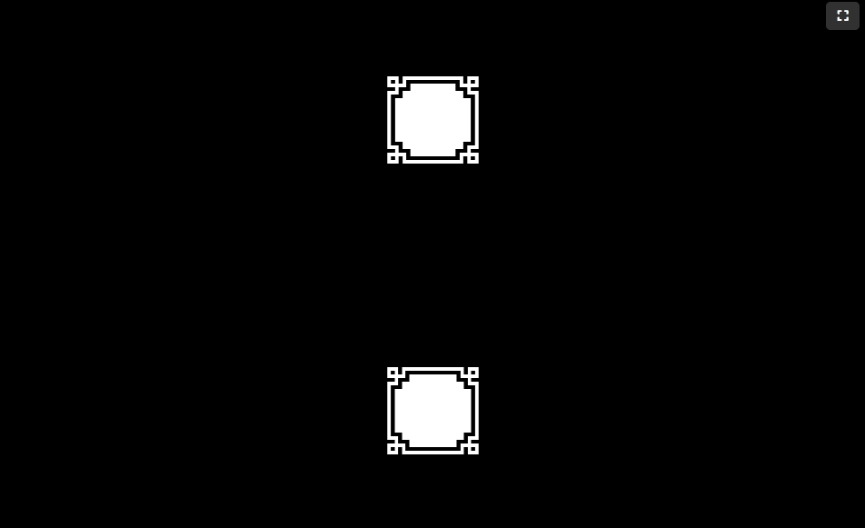
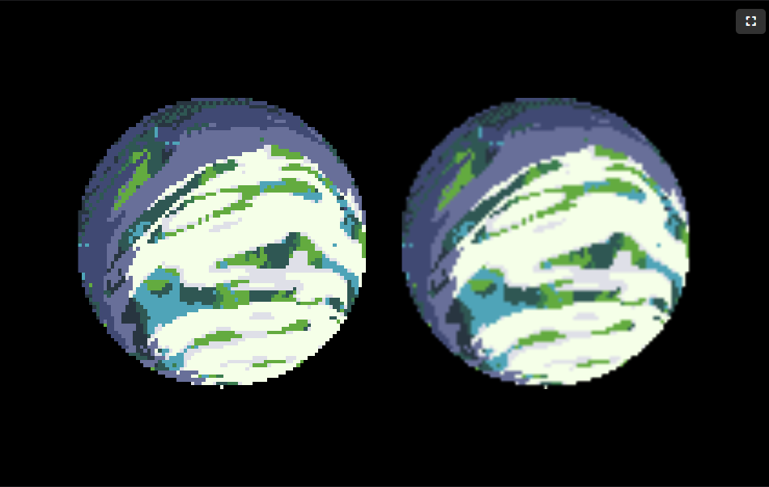

Since `0.21.0`, Forge has gone from "renders sprites and moves them around" to
"simulates a physical world." This post rounds up everything that's shipped
since then.

{/* truncate */}

## A native 2D physics engine

As we move further towards our goal of being a zero-dependency game engine
for the web, we decided to replace
<a href="https://www.brm.io/matter-js/" target="_blank" rel="noopener noreferrer">matter-js</a>,
that we used for initial design, with a native 2D physics implementation in
version `0.21.0` of Forge. Matter.js is a powerful, mature engine, and
reaching the same feature parity and stability will take some time - but
every release will help close that gap, and we're confident we're
headed in the right direction.

The Forge physics engine brings a lot of the tools you would come to expect;
<a href="/Forge/docs/api/classes/RigidBody" target="_blank" rel="noopener noreferrer"><code>RigidBody</code></a>
and <a href="/Forge/docs/api/classes/PhysicsWorld" target="_blank" rel="noopener noreferrer"><code>PhysicsWorld</code></a> gives you gravity,
convex collision shapes, collision detection, raycasting, and
an impulse-based force API - all with zero external dependencies, wired
straight into the ECS. Check out the <a href="/Forge/demos/physics" target="_blank" rel="noopener noreferrer">Physics demo</a> to
see bodies falling, colliding, and settling in real time.

## Joints, springs, and motors for every kind of motion

A physics engine is only as fun as what you can build with it, so the last
few releases have been almost entirely about connecting bodies together:

- **<a href="/Forge/demos/revolute-joint" target="_blank" rel="noopener noreferrer">Revolute joints</a>** (hinges) let two bodies
  rotate around a shared point - see them swinging a wrecking ball in the
  <a href="/Forge/demos/wrecking-ball" target="_blank" rel="noopener noreferrer">Wrecking Ball demo</a>,
  or keeping time in a classic <a href="/Forge/demos/newtons-cradle" target="_blank" rel="noopener noreferrer">Newton's Cradle</a>.
- **<a href="/Forge/demos/prismatic-joint" target="_blank" rel="noopener noreferrer">Prismatic joints</a>** (sliders) constrain
  motion to a single axis, perfect for pistons, elevators, and sliding doors.
- **<a href="/Forge/demos/linear-spring-damper" target="_blank" rel="noopener noreferrer">Linear springs and dampers</a>** add soft, bouncy connections between bodies.
- **<a href="/Forge/demos/torque" target="_blank" rel="noopener noreferrer">Torque and angular-velocity motors</a>** apply continuous rotational force to
  a body.

Put them all together and you get things like the
<a href="/Forge/demos/car" target="_blank" rel="noopener noreferrer">Car demo</a>: a car with motorized
wheels, suspension, and a body all held together with joints, driving over
procedurally generated terrain.

## Terrain to build worlds on

Speaking of terrain - `TerrainShape` gives you 2D heightmap collision that
matches a smooth, curved render mesh point-for-point, so what the player sees
is exactly what they collide with. That render mesh textures itself too: two
independently-tileable layers - a "border" texture near the surface blending
into a "fill" texture below it (grass fading into dirt, for example) - so a
terrain shape never needs a hand-authored texture of its own. The
<a href="/Forge/demos/rolling-ball" target="_blank" rel="noopener noreferrer">Rolling Ball demo</a>
shows a ball rolling over rolling hills built entirely from this new shape.

## Crisp borders at any size with nine-slice sprites

Sprites no longer have to choose between stretching blurrily or being locked
to one size. Nine-slice sprites split an image into a 3x3 grid and scale only
the stretchable middle regions, keeping corners and edges pixel-perfect at
any dimension - see it in the dedicated
<a href="/Forge/demos/nine-slice" target="_blank" rel="noopener noreferrer">Nine-Slice Sprites demo</a>.

A full UI system is still a ways off for Forge, but nine-slicing is one of
the foundational building blocks it'll need - scalable buttons and panels
being the most obvious use case once that lands.

## Multi-pass rendering, bloom, and blur

Cameras can now render into an off-screen texture instead of straight to the
canvas, via a <a href="/Forge/docs/docs/rendering/multipass-rendering" target="_blank" rel="noopener noreferrer">render target</a> and a present pass that blits it back - the
foundation any full-frame effect needs. Building on that, a two-pass
separable <a href="/Forge/docs/docs/rendering/gaussian-blur" target="_blank" rel="noopener noreferrer">Gaussian blur</a>
and an additive-glow <a href="/Forge/docs/docs/rendering/bloom" target="_blank" rel="noopener noreferrer">bloom</a> effect are both built directly on top of it, backed by an
<a href="/Forge/docs/docs/rendering/hdr-rendering" target="_blank" rel="noopener noreferrer">HDR render target and tone-mapping</a> pipeline so bloom reacts to true HDR
brightness instead of clipping at an 8-bit ceiling. Render targets can also
be layered, so only part of a scene picks up an effect while the rest
renders untouched - the
<a href="/Forge/demos/space-shooter" target="_blank" rel="noopener noreferrer">Space Shooter demo</a>
blurs its starfield background while bloom glows only the foreground ships
and lasers.

## A camera that behaves the same everywhere

Before this, a world unit was just a pixel: one unit always rendered as one
pixel, no matter the canvas size. That left every scene to work out its own
resolution-dependent ratio to size and position anything relative to the
screen - and it was a recurring source of bugs, with demos playing
differently depending on the resolution they ran at.

Cameras now show a fixed number of vertical world units
(`verticalWorldUnits`, default `10`) on screen regardless of resolution or
aspect ratio, so the same scene renders at the same relative scale
everywhere. A new `calculateVisibleWorldSize` helper computes exactly how
many world units are visible at any destination size, so game logic can
position things relative to what's actually on screen instead of reaching
for canvas pixel dimensions or hand-rolling its own ratio math.

## Many more smaller improvements

- `GamepadInputSource` now supports hot-plugging - plug in a controller
  mid-game and it's picked up automatically, with the most recently
  connected gamepad selected by default. Try it out with a controller in
  the <a href="/Forge/demos/brick-breaker" target="_blank" rel="noopener noreferrer">Brick Breaker demo</a>.
- `createImageSprite` takes a `pixelated` option: nearest-neighbor filtering
  for crisp, blocky pixel-art scaling, versus the default linear filtering
  suited to rasterized/hand-drawn art.
  
- Demos can now go fullscreen.
- A new `preserveDrawingBuffer` option on `createRenderContext`/`RenderContext`
  lets you read the canvas back after a frame has been presented - handy for
  screenshots or `toDataURL`.
- Mouse-driven trigger actions now correctly respect the active input group,
  matching how keyboard and every other input type already behaved.

## Try it out

All of this is available today - the work landed in `0.21.0` through `0.24.0` Grab the
<a href="/Forge/docs/intro" target="_blank" rel="noopener noreferrer">Getting Started guide</a> to add Forge to your project, or
jump straight into the <a href="/Forge/demos/car" target="_blank" rel="noopener noreferrer">demos</a> to see it all in motion.
For the full list of changes, release by release, see the
<a href="/Forge/docs/changelog" target="_blank" rel="noopener noreferrer">changelog</a>.

We're excited about where the physics engine is headed next - if you build
something with it, we'd love to know!
