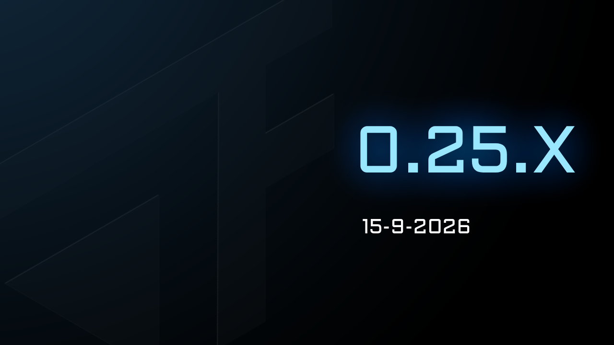
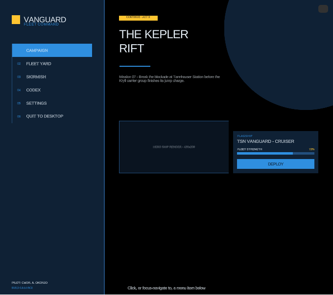
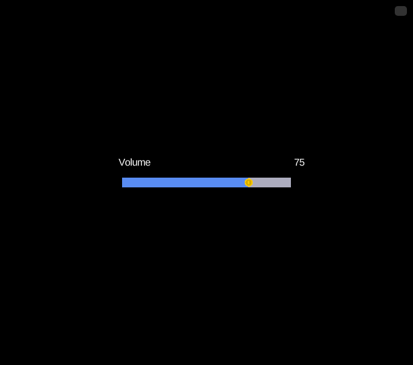
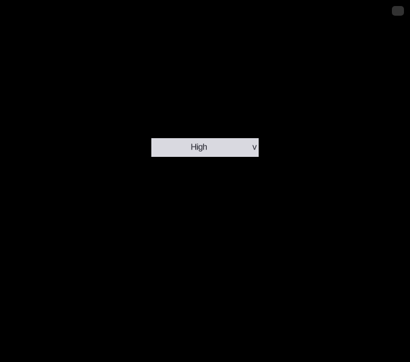
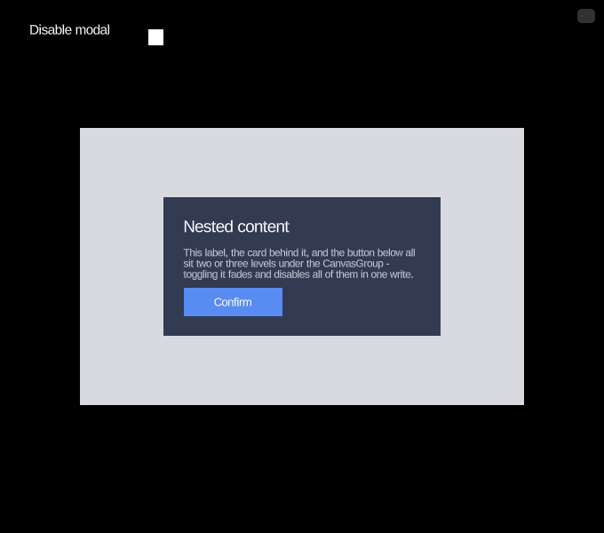
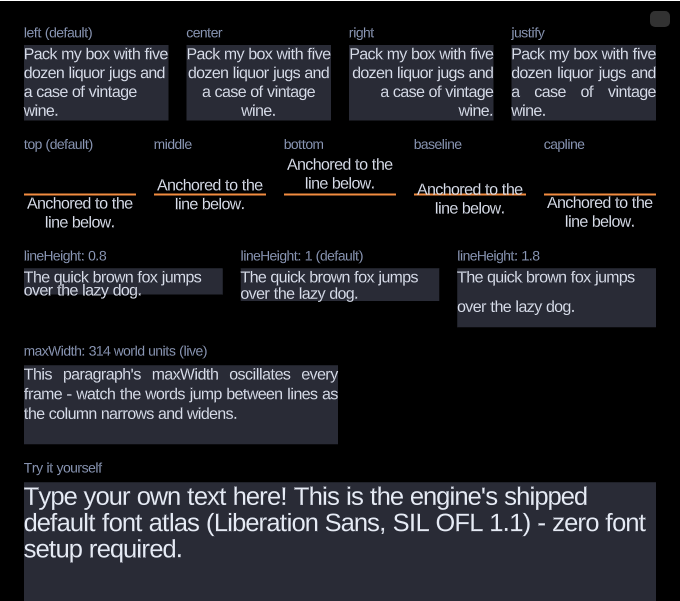

As part of the `0.24.X` release we included support for 9-slice sprites. 9-slice sprites are useful on their own,
but they become crucial when building a UI system. 

A custom UI system for Forge was not on the roadmap for 2026, but we decided to bring the feature forward.
We are changing the long term strategy for Forge. Forge has many strong competitors in the market.
The most notable being Phaser and Excalibur.js, building a "good web-based game engine" is not enough when competing
with battle-tested products. 

{/* truncate */}

While we want to build a good engine, we also want to build an accessible engine. We've been keeping an eye on recent gaming trends, 
and potential target audiences. There is still a large barrier to entry when it comes to building even the simplest of games. 

Forge's original design philosophy of "code-only" does not help break that barrier. We have decided that Forge needs an Editor.

A prerequisite to building an editor is to have a robust UI system.

## A UI system built for speed

The UI module is a full retained-mode layout and interaction system.
It starts with a layout primitive - `RectTransformEcsComponent`, 
anchors, pivots and stretch - resolved every frame by
`createUiLayoutEcsSystem` into concrete positions and sizes, so a
panel's children always end up exactly where their anchors say they should,
regardless of resolution or aspect ratio. A `Canvas`
gives you a dedicated UI camera isolated from the rest of the world by its own
render category.

The **UI Main Menu demo**
above is built entirely from this module - nested panels, layout groups, a
left-hand navigation list, a live fleet-strength bar and a deploy button -
with nothing hand-positioned in pixels.

## Buttons, sliders, toggles, and dropdowns

On top of layout comes interaction:
`UiInteractableEcsComponent` gives any entity pointer and
gamepad/keyboard events - hover, press, drag, and a source-agnostic
`onInvoke` that fires the same way whether a mouse click or a
controller's submit button triggered it. Built on that foundation, the
module ships a full set of ready-made controls:

- ** [Buttons](/Forge/demos/ui-button) with an eased color transition per interaction state (hover, press, disabled), and automatic nearest-neighbor focus navigation for gamepad/keyboard.
- ** [Sliders](/Forge/demos/ui-slider) - a click-and-drag track with a handle and fill, shown above driving a live value label. The whole track is a drag surface, not just the handle.
- ** [Toggles](/Forge/demos/ui-toggle), including mutually-exclusive radio groups sharing one `UiToggleGroupEcsComponent`.
- ** [Progress bars](/Forge/demos/ui-progress-bar), a read-only fill indicator that reflects a `value` write in the same frame - handy for health bars and loading screens.
- ** [Dropdowns](/Forge/demos/ui-dropdown), shown below - a header plus a click-to-open option list, each row an ordinary button under the hood.

## Layout groups, tooltips, and canvas groups

Real screens are rarely made of one-off, hand-placed elements - they're rows
and grids of controls that need to line up, resize together, and sometimes
disappear as a unit. `HorizontalLayoutGroupEcsComponent`,
`VerticalLayoutGroupEcsComponent` and `GridLayoutGroupEcsComponent` arrange a
parent's children automatically (nesting freely), `ContentSizeFitterEcsComponent`
shrink-wraps an entity to its own content, and `AspectRatioFitterEcsComponent`
keeps an element's proportions locked as its parent resizes.

`CanvasGroupEcsComponent` applies alpha, `interactable`, and `blocksRaycasts`
to a whole subtree in one write - fading out and disabling an entire modal,
like above, instead of touching every element inside it individually.
Tooltips (`createTooltip`) attach a floating panel to any interactable
element and show themselves automatically after a hover/focus delay. And for
notched or rounded-corner displays, `UiSafeAreaEcsComponent` shrinks a
full-screen element inward from the device's safe-area insets every frame.

Canvases aren't limited to the screen either - a world-space canvas
(`renderMode: 'worldSpace'`) puts UI content directly in the game world
instead of overlaid on it, for diegetic UI like a health bar over an enemy's
head.

## Crisp text at any size, with outlines and glow

Alongside the UI module, the text module brings multi-channel
signed distance field (MSDF) text rendering to Forge - stays crisp at any
scale. `addTextComponent` shapes and lays out
a string (kerning, word-wrap, horizontal/vertical alignment, line height) into
cached glyph quads drawn through the same instanced sprite pipeline as
nine-slice sprites, and outline/soft-shadow effects render in their own pass.

Best of all, there's zero setup required to get started: Forge ships a
pre-generated default font atlas (Liberation Sans), so `addTextComponent`
renders text out of the box with no font file or license to manage. Bring
your own font with the new `forge-generate-font-atlas` CLI when you need one.

## Raycasting and kinematic bodies

The physics engine picked up two smaller but broadly useful additions:
`raycast(world, start, end, sort?)` casts a line segment against every
collider in an `EcsWorld` - circles, polygons, and terrain alike - and
returns every hit ordered by distance, for line-of-sight checks, projectile
prediction, or a click-to-select tool. And `RigidBodyEcsComponent.type` now lets a body be `'kinematic'` - moved
directly by game code, still pushing dynamic bodies on contact, but unaffected
by gravity or forces - useful for a moving platform or an elevator that
shouldn't be shoved around by what's standing on it.

## Performance

**`Vector2`/`Vector3` are now plain objects, not classes.** Construct them
as `{ x, y }` literals and operate on them via `Vec2`/`Vec3` static methods
(`Vec2.add`, `Vec2.rotate`, `Vec2.normalize`, ...) that mutate their first
argument in place instead of allocating a new vector - a meaningful win in
hot loops like physics integration. `Rect` made the same move, to a plain
`{ min, max }` object operated on via `Rects`. 

While we originally built Vector2/Vector3 classes along with their immutable functions 
to provide a good developer experience, this introduced a tradeoff involving heavy memory allocations and frequent GC hits.
We decided that it makes sense to keep the engine as performant as possible, building a wrapper class would be easy
for teams that want to prioritize DX and immutability. 

## ECS world registration

**`EcsWorld.addSystem` takes `before`/`after` instead of a numeric
priority.** Order a system relative to specific other systems - `after:
[gravitySystem]` - rather than picking an arbitrary number and hoping
nothing else already claimed it. Whole groups of systems can be ordered
against each other too, via `addSystemGroup`.

## Many more smaller improvements

- `SpriteEcsComponent`/`TextEcsComponent` both gained a `sortDepth` override,
  for controlling draw order within a layer independently of world position -
  useful for keeping a panel's own label reliably on top of it.
- `EcsWorld.getComponentAccessor(componentKey)` resolves a component's
  storage once and returns a fast lookup function, for a system checking the
  same optional component on many entities in a tight loop.
- `Game` now follows its container's size automatically via a
  `ResizeObserver`, so a running game's canvas, camera, and UI layout stay in
  sync with a resized window instead of staying pinned to whatever size the
  container was when the game started.
- `DirectedAcyclicGraph<T>` - the generic topological-ordering structure
  behind `before`/`after` system ordering - is exported too, in case you need
  the same kind of ordering elsewhere.

## Try it out

All of this is available today - the work landed in `0.24.1` through
`0.25.1`. Grab the [Getting Started guide](/Forge/docs/intro)
to add Forge to your project, or jump straight into the [UI demos](/Forge/demos/category/ui)
to click, drag, and tab your way around.
