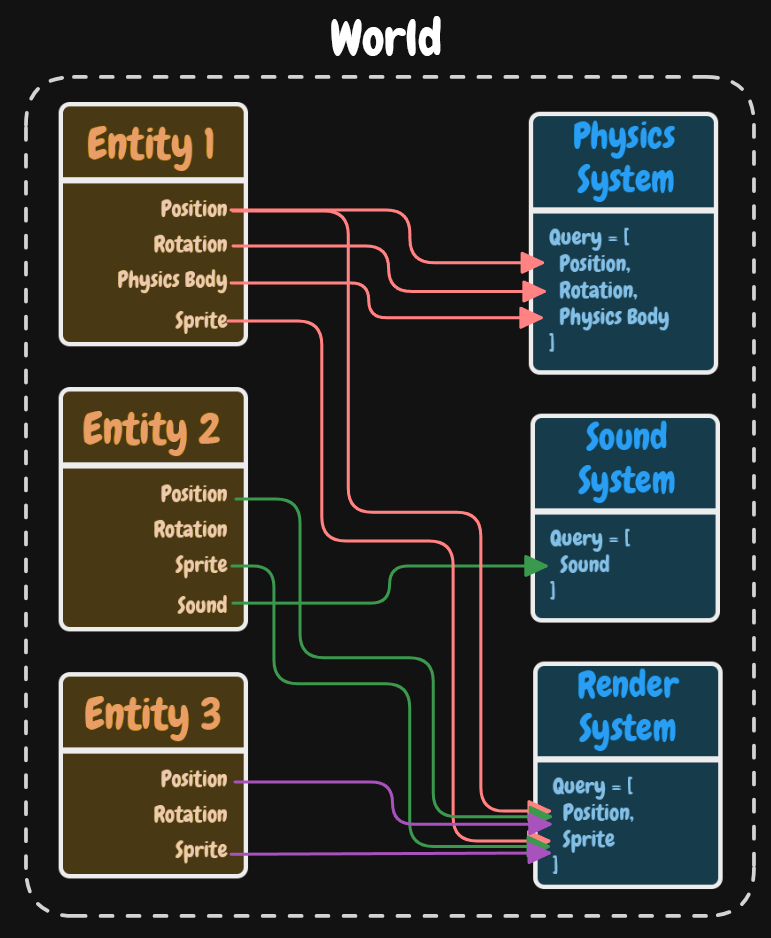

# Entity Component System

Forge has it's own Entity Component System (commonly referred to as ECS). 

[Entity Component System FAQ by Sander Mertens](https://github.com/SanderMertens/ecs-faq) is a great resource to learn more about the ECS pattern.

In Forge, an ECS world orchestrates entities and systems. Entities are composed of components and a system operates on a unique set of component types.

