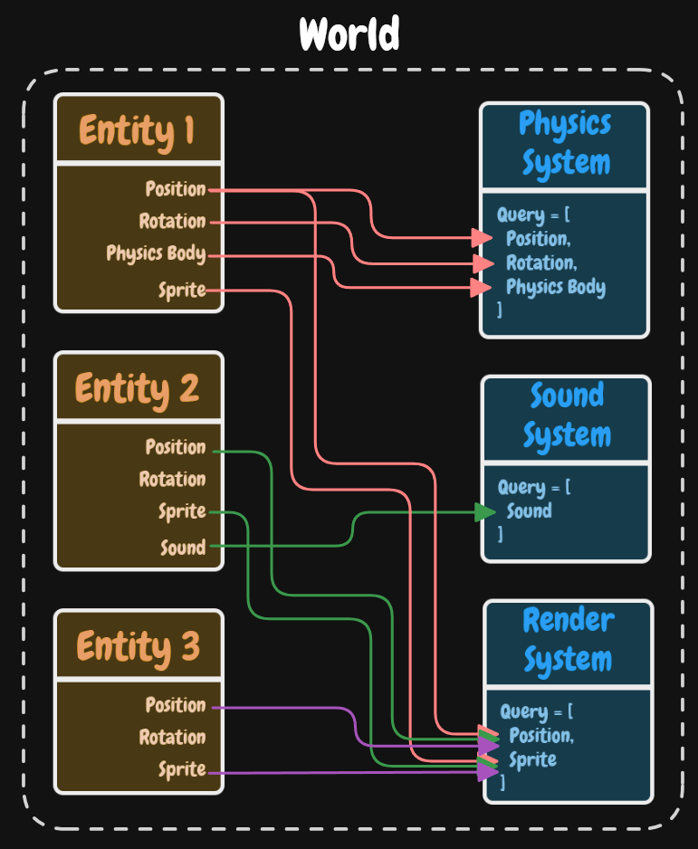

# Entity-Component-System (ECS)

Forge provides a compact, high-performance ECS. The ECS separates data (components) from behavior (systems) and an `EcsWorld` manages entities and component storage.

For a broader conceptual background see the [Entity Component System FAQ by Sander Mertens](https://github.com/SanderMertens/ecs-faq).

Core concepts:

- `EcsWorld` — stores components, creates and removes entities, runs systems.
- Entity — an integer id that groups components.
- Component — typed data attached to entities (or tags).
- System — logic that queries matching entities and updates them.

Guides in this section:

- Game — create a `Game` and attach an `EcsWorld`.
- World — create entities, add/remove components and tags, query entities.
- Entity — entity lifecycle and helper methods.
- Component — defining component keys and tags.
- System — creating systems and registration order.
- Query — how queries select entities and components.

