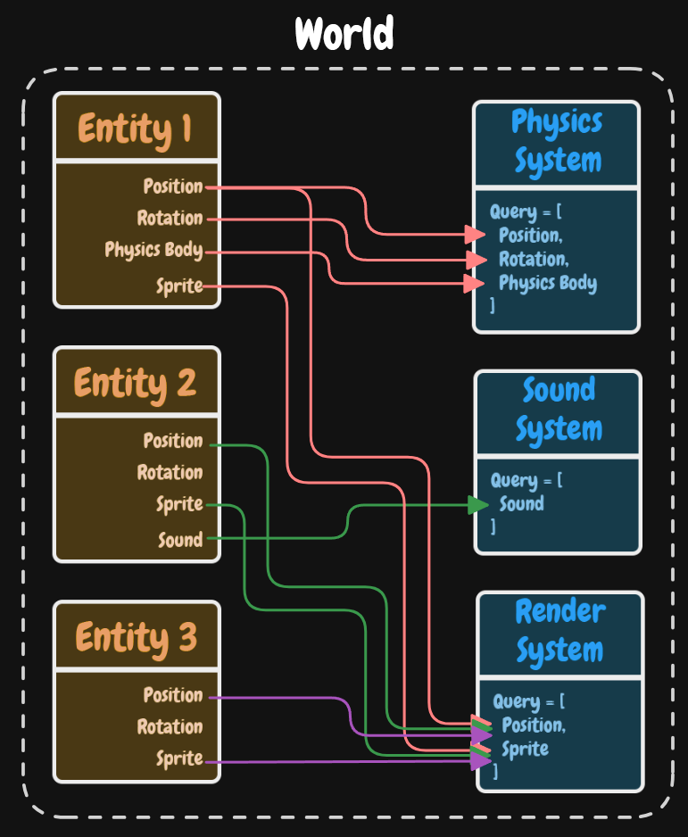

# Entity-Component-System (ECS)

Forge's game logic is built on an entity-component-system (ECS) design:
entities are handles, components are plain data attached to them, and
systems are functions that run every tick over the entities that have a
given set of components. For background on ECS in general, see the
[Entity Component System FAQ by Sander Mertens](https://github.com/SanderMertens/ecs-faq).

The ECS is made of:

- [Game](game.md): `Game` runs the game loop, updating a `Time` and one or
  more worlds every animation frame.
- [World](world.md): `EcsWorld` stores entities, their components and
  tags, and registered systems. It creates and removes entities, answers
  queries, and runs its systems once per tick.
- [Entity](entity.md): a numeric handle that identifies a set of
  components in a world.
- [Component](component.md): typed data attached to an entity under a
  component key, or a tag with no data.
- [System](system.md): an object with a `query` and an `update` function,
  called once per tick with every entity that matches the query.

