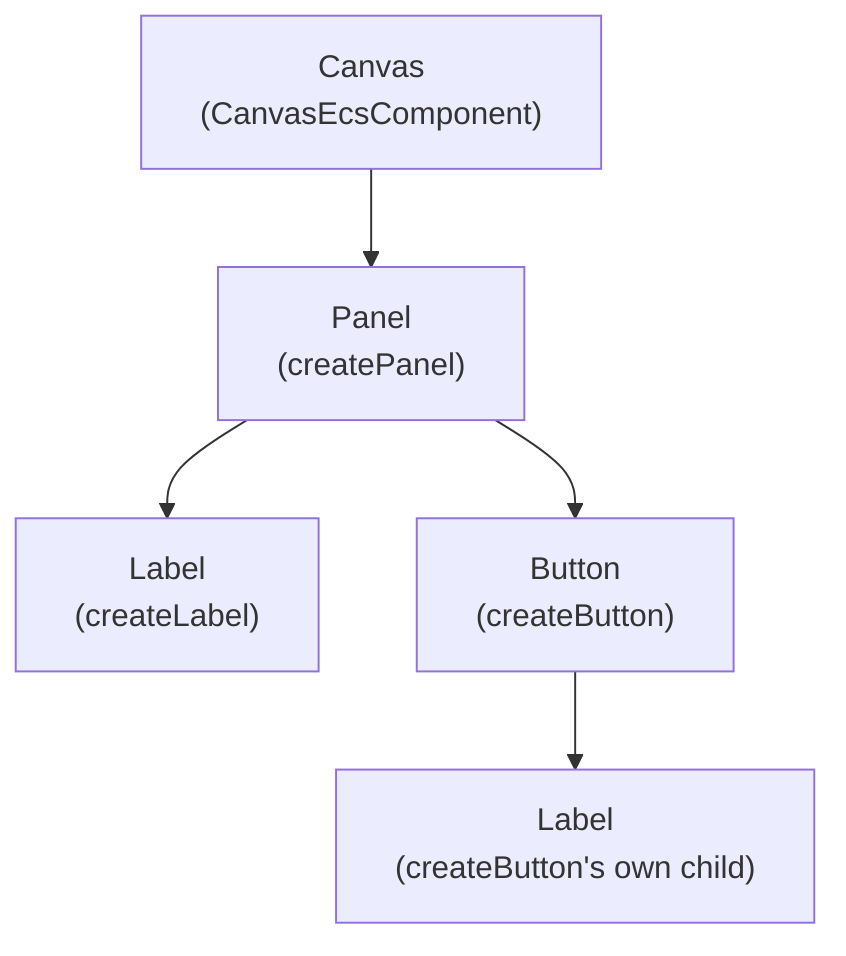

# Creating a Canvas

Every UI you build is a plain ECS entity tree, parented with the same
`addParentComponent` any other entity uses: a canvas at the root, with
panels, labels, and buttons as its children (and grandchildren):



Each node above is just an entity with a `RectTransformEcsComponent`,
resolved every frame against its **parent's** resolved rect - which is why
the canvas has to exist before anything else, and why every `create*`
factory in this module takes a `parent` entity as its second argument.

## Registering the UI systems

`registerUiSystems(world, renderContext, time, options?)` registers every
system a UI canvas depends on - layout, layout groups, interaction, focus
navigation, and more. Call it **once per `EcsWorld`**, regardless of how
many canvases that world ends up with:

```ts
import { registerUiSystems } from '@forge-game-engine/forge/ui';

registerUiSystems(world, renderContext, time, {
  // Pointer interaction needs a pointer source; omit it for a
  // gamepad/keyboard-only game. MouseInputSource satisfies this directly.
  pointerSource: new MouseInputSource(inputManager, game.container),
});
```

`registerUiSystems` and `createUiCanvas` are deliberately separate calls,
the same split as `registerInputs`/creating an input source: `registerUiSystems`
sets up the systems that drive every canvas in the world, once, while
`createUiCanvas` creates one canvas entity and can be called as many times
as you have canvases (a screen-space HUD plus several world-space health
bars, say). Calling `registerUiSystems` more than once for the same world
would register every system a second time, double-processing each canvas
every tick (double `onInvoke` raises, focus moving two steps at once, and
so on) - call it exactly once, the same way you register the transform or
render systems exactly once regardless of how many entities use them.

## Creating a screen-space canvas

```ts
import { createUiCanvas } from '@forge-game-engine/forge/ui';

// Forge doesn't reserve or ship a "UI" render category - pick any bit your
// game isn't already using for another camera, and reuse it everywhere UI
// content needs to match this canvas's cullingMask.
const uiRenderCategory = 1 << 1;

const canvas = createUiCanvas(world, renderContext, {
  cullingMask: uiRenderCategory,
});
```

`createUiCanvas` creates a canvas root entity and, for the default
`renderMode: 'screenSpace'`, a dedicated, static UI camera - a
transparent-cleared, off-screen `RenderTarget` composited onto the canvas
by `createPresentEcsSystem` (see
[Multipass Rendering](../rendering/multipass-rendering.md) for how the
camera/render-target/present-pass pieces fit together generally), isolated
from the world by `cullingMask`/`Renderable.category`. `cullingMask` has no
default - `createUiCanvas` requires it explicitly, since Forge has no
reserved "this bit means UI" value: pick one your game isn't already using
for another camera, and reuse that exact value for every UI visual's own
category. Give a panel's sprite that same category -
`createImageSprite`'s `layer` option sets a sprite's `Renderable.category`,
confusingly by that name (see `SpriteEcsComponent.layer`, a _different_,
draw-order-only field, for the usual meaning of "layer"). Without a
matching category, a world camera whose own `cullingMask` still matches
everything would draw the panel a second time wherever its UI-space
position happens to land in the world.

Text works the same way: `TextEcsComponent.category` defaults to
`TEXT_RENDER_CATEGORY`, shared by every text entity that doesn't override
it - not a value the engine reserves or forces, just an ordinary default,
and one that has nothing to do with any particular UI canvas's
`cullingMask`. [`createLabel`](/Forge/docs/api/functions/createLabel)
doesn't override it either, so a label needs its own `category` passed
explicitly - the same value you gave that canvas's `cullingMask` - to be
visible through it; `createButton`'s `labelCategory` option forwards the
same value to its own child label.

Register `createTransformEcsSystem`/`createRenderEcsSystem` **after**
`registerUiSystems`, so the layout system (which writes `position.local`)
runs before the transform system (which reads it to compute
`position.world`), which in turn must run before the render system.

## Creating a world-space canvas

Pass `renderMode: 'worldSpace'` to put UI content in the game world instead
of overlaid on the screen - diegetic UI like a health bar over an enemy's
head, a name tag, or a floating damage indicator with a persistent rect:

```ts
const healthBarCanvas = createUiCanvas(world, renderContext, {
  renderMode: 'worldSpace',
  camera: worldCamera, // the game's own world camera, not a dedicated UI one
  anchor: UiAnchor.center({ x: 80, y: 10 }),
  anchoredPosition: { x: 0, y: 40 }, // 40 units above the enemy's own origin
});

addUiWorldSpaceFollowComponent(world, healthBarCanvas, { target: enemy });

const fill = createPanel(world, healthBarCanvas, {
  anchor: UiAnchor.stretchAll(),
  sprite: fillSprite,
});

world.addSystem(createTransformEcsSystem());
// After createTransformEcsSystem, not before like the rest of the UI
// pipeline - see createUiWorldSpaceFollowEcsSystem's own doc comment.
world.addSystem(createUiWorldSpaceFollowEcsSystem());
```

A world-space canvas's root rect is an ordinary `RectTransformEcsComponent`
- sized via `anchor`/`anchoredPosition` (mirroring `createPanel`'s own
options) rather than the render destination's size. Its offset from the
entity it follows comes from `anchoredPosition` above, not from touching
`PositionEcsComponent` directly - `createUiLayoutEcsSystem` recomputes the
canvas's local position from its anchor every frame, so a manually-set
`PositionEcsComponent.local` would just be overwritten on the next frame.

It draws through whichever camera `camera` names - typically the game's own
world camera - not a dedicated UI camera `createUiCanvas` creates for you,
so it pans and zooms with the world exactly like any other sprite.
`referenceResolution`/`scaleMode`/`cullingMask`/`layer` aren't valid options
for `renderMode: 'worldSpace'` at all - the type checker rejects them,
since there's no "destination size" for a canvas embedded in the world to
scale against, and no dedicated UI camera for them to configure.

**Following, not parenting**: `addUiWorldSpaceFollowComponent`/
`createUiWorldSpaceFollowEcsSystem` overwrites the canvas's world position
every frame with the target's own world position plus the canvas's local
offset, ignoring the target's rotation entirely - unlike
`addParentComponent`, which inherits the target's full world transform
(the ordinary case for, say, a turret mounted on a rotating tank). Use
this so a diegetic UI canvas stays upright above its target regardless of
which way it's facing, instead of swinging around with it. Because
`createUiWorldSpaceFollowEcsSystem` needs the target's world position
already resolved for the current tick, register it yourself, once, right
after `createTransformEcsSystem` - unlike the rest of the UI pipeline,
`registerUiSystems` doesn't register it for you.

A world-space canvas is created exactly like a screen-space one otherwise -
multiple canvases (a screen-space HUD plus several world-space health
bars) all share the one `registerUiSystems` call for their world.

`createUiCanvas`'s options are a discriminated union on `renderMode`: the
type checker requires `cullingMask` for the default `'screenSpace'` mode and
`camera` for `'worldSpace'`, and rejects the other mode's fields
(`referenceResolution`/`scaleMode`/`layer` vs. `camera`/`anchor`/
`anchoredPosition`) outright, rather than accepting them and ignoring them
at runtime.
