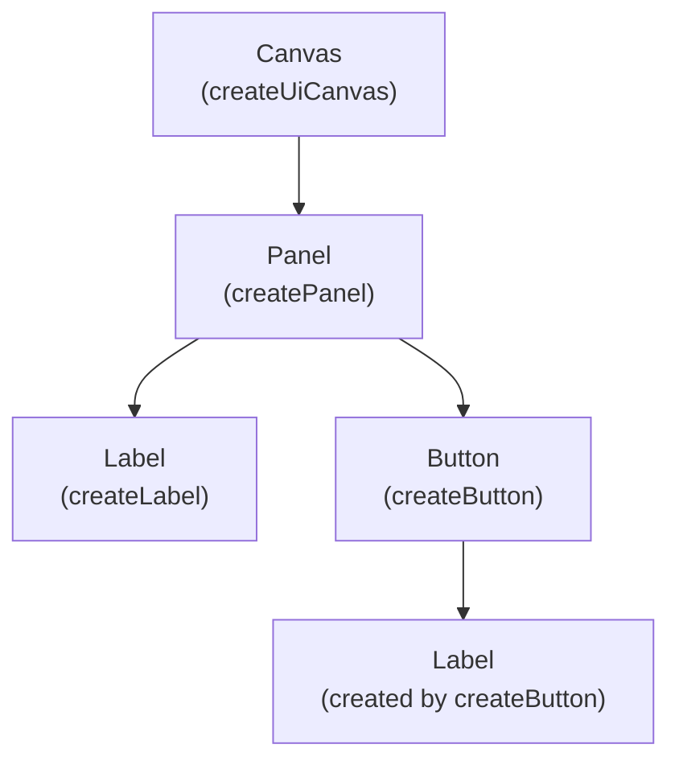

# UI

The `ui` module builds menus, HUDs and other interface elements out of ECS
entities. A UI is an entity hierarchy with a canvas at its root. Every
element in it has a rectangle that is anchored to its parent's rectangle,
and the UI systems resolve those rectangles every frame, size each
element's sprite to its rectangle, and run pointer and focus interaction.

The UI is made of:

- [Canvases](creating-a-canvas.md): the root of a UI tree, holding a
  [`CanvasEcsComponent`](/Forge/docs/api/type-aliases/CanvasEcsComponent).
  A screen-space canvas is drawn over the screen by its own camera; a
  world-space canvas is drawn by a camera you choose, in the game world.
  [`registerUiSystems`](/Forge/docs/api/functions/registerUiSystems)
  registers the systems every canvas in a world uses.
- [Rect transforms](anchors-and-layout.md): every element's
  [`RectTransformEcsComponent`](/Forge/docs/api/type-aliases/RectTransformEcsComponent),
  which anchors its rectangle to its parent's. A screen-space canvas sizes
  its root rectangle from the screen size and its
  [scale mode](responsive-ui.md).
- [Labels](labels-and-text.md): elements that draw text.
- [Buttons and interactables](buttons-and-interaction.md): a
  [`UiInteractableEcsComponent`](/Forge/docs/api/interfaces/UiInteractableEcsComponent)
  makes an element respond to the pointer and to focus navigation.
  `createButton` builds a panel with one.
- [Controls](controls.md): toggles, sliders, progress bars and dropdowns.
- [Text inputs](text-input.md): single-line fields the player types into.
- [Layout groups and fitters](layout-groups.md): components that arrange an
  element's children in a row, a column or a grid, or size an element to
  its content or to an aspect ratio.
- [Canvas groups and tooltips](canvas-groups-and-tooltips.md): a
  `CanvasGroupEcsComponent` fades or disables an element and everything
  under it; a tooltip is a panel shown while an element is hovered or
  focused.
